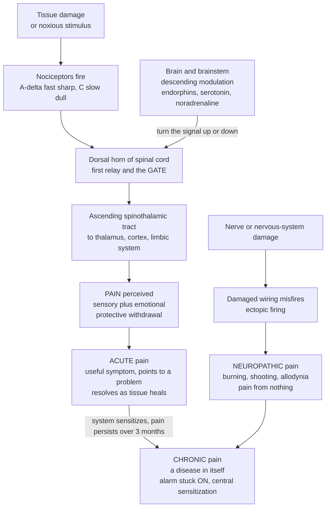

# 🚨 Pain Pathophysiology and Management

> [!abstract] TL;DR
> **Pain** is the body's alarm system — a protective signal generated when specialized sensory neurons called **nociceptors** detect tissue-threatening stimuli, transmit them up the **spinal cord** to the brain, and there are experienced as an unpleasant sensation with both a **sensory** ("where and how much") and an **emotional** ("how awful") dimension. **Acute pain** is a *symptom*: it points at an injury, drives protective withdrawal, and resolves as the tissue heals. But the alarm can malfunction. In **chronic pain** the nervous system becomes **sensitized** and rewired, so pain persists for months or years with little or no ongoing injury — pain becomes a **disease in its own right**. In **neuropathic pain** the wiring itself is damaged, so nerves misfire and generate burning, shooting pain "from nothing." Crucially, the brain **modulates** the signal up or down (gate-control theory, descending inhibition), which is why the same injury hurts differently depending on context. Management is **multimodal** and mechanism-based — non-opioids, opioids (potent but carrying tolerance, dependence, and the public-health catastrophe of the opioid crisis), adjuvants for nerve pain, local anesthetics, and psychological/physical approaches reflecting pain's **biopsychosocial** nature. Pain is the single most common reason people seek medical care, making this one of the most consequential topics in all of medicine.

## Intuition

**Analogy — a smoke alarm wired into your body.** Touch a hot stove and, before you can even think, sensors in your skin fire, race a signal up your spinal cord to your brain, and your hand is already yanked away. That is **acute pain** doing its vital job: it is a *symptom* screaming "something is damaging you — act now." Like a good smoke alarm, it is loud, unpleasant, and lifesaving; you would not want to live without it. People born unable to feel pain (a rare genetic condition) accumulate silent injuries, burns, and joint destruction, and typically die young — proof that pain is a *feature*, not a bug.

But an alarm has a dark side. Sometimes it keeps blaring long after the smoke has cleared. In **chronic pain**, the pain system itself becomes sensitized and rewired — the alarm gets stuck in the ON position — so pain persists for months or years with no fire left to detect. Here pain stops being a useful symptom and becomes **a disease of its own**. And there is a stranger failure mode: **neuropathic pain**, where the *wiring* is damaged, like a frayed electrical cable sparking at random, so the nerves generate searing, shooting pain out of nothing. Finally — and this is the twist that makes pain so human — there is a **volume knob**. The brain can turn the alarm up or down depending on context: a soldier may not notice a wound in battle; anxiety and attention amplify pain; a sugar pill (placebo) can genuinely dampen it. Understanding *how the signal is generated, transmitted, and modulated* is what separates treating pain well from causing harm.

---

## How It Works

### Core Mechanics

Pain is not a single event but a **pathway** — encoding, transmission, perception, and modulation — that can be traced from skin to cortex:

1. **Transduction at the nociceptor.** **Nociceptors** are the free nerve endings of specialized primary sensory neurons that respond only to *noxious* (tissue-threatening) stimuli — extreme heat or cold, intense mechanical force, and chemical irritants. Ion channels such as **TRPV1** (the "capsaicin/heat" channel) convert the stimulus into a depolarizing receptor potential. Unlike touch receptors, nociceptors have a **high threshold** — they stay silent until the stimulus crosses into the damaging range.
2. **Conduction along two fiber types.** The signal travels toward the spinal cord along two kinds of axons that explain the *double sensation* of injury: **A-delta fibers** are thinly myelinated and *fast*, carrying **sharp, well-localized "first" pain** (the immediate stab); **C fibers** are unmyelinated and *slow*, carrying **dull, burning, poorly localized "second" pain** (the throbbing ache that follows).
3. **First relay in the dorsal horn.** The fibers synapse in the **dorsal horn of the spinal cord**, releasing glutamate and neuropeptides such as **substance P**. This is not a passive relay but the crucial **"gate"** — a site where the signal can be amplified or suppressed *before* it ever reaches the brain.
4. **Ascending transmission.** Second-order neurons cross the midline and ascend mainly in the **spinothalamic tract** to the **thalamus**, which distributes the signal to the **somatosensory cortex** (the sensory-discriminative "where and how much") and to the **limbic system** — anterior cingulate and insula — (the affective-motivational "how unpleasant"). Pain is therefore *always* two things at once: a sensation and an emotion.
5. **Descending modulation — the volume knob.** The brainstem (periaqueductal grey, rostral ventromedial medulla) sends **descending pathways** back down to the dorsal horn that can **inhibit or facilitate** incoming pain. These release **endogenous opioids (endorphins/enkephalins)**, **serotonin**, and **noradrenaline**, closing the gate. This circuit explains **placebo analgesia**, **stress-induced analgesia**, distraction, and why mood and attention change how much a given injury hurts.
6. **Sensitization — when the system amplifies itself.** With intense or ongoing input, the pathway turns up its own gain. **Peripheral sensitization** lowers nociceptor thresholds at the injury (the "inflammatory soup" of prostaglandins, bradykinin, and cytokines). **Central sensitization** — a plasticity of dorsal-horn neurons akin to memory formation, including **"wind-up"** (escalating response to repeated identical stimuli) — makes the spinal cord itself hyper-responsive. Sensitization produces **hyperalgesia** (more pain than a noxious stimulus warrants) and **allodynia** (pain from a normally *innocuous* stimulus, like a bedsheet on sunburned skin). Persisting central sensitization is a core engine of **chronic pain**.

### Flow / Architecture



---

## Key Concepts

### Secondary (foundational)

- **Pain is a warning, not the injury itself.** It is the body's alarm telling you something is wrong so you stop and protect the part. The reflex to yank your hand off a stove happens in the spinal cord *before* the brain even registers it.
- **Nociceptors are the sensors.** Special nerve endings fire only when a stimulus is strong enough to *threaten damage* (very hot, very sharp, crushing). Ordinary touch does not trip them.
- **Two speeds of pain.** A fast "sharp" pain (A-delta) arrives first; a slower "dull, burning" pain (C fiber) follows. That is why a stubbed toe stings instantly and then throbs.
- **Acute vs chronic.** **Acute** pain comes with an injury and fades as it heals — it is *useful*. **Chronic** pain lasts a long time (more than about three months) and often continues even after healing — here the alarm is malfunctioning and pain has become a problem of its own.
- **The brain can dial pain up or down.** The same cut hurts less when you are calm or distracted and more when you are anxious or afraid. Pain is not a fixed reading; the brain shapes it.

### Undergraduate (mechanistic)

- **Four stages of nociception.** **Transduction** (stimulus → receptor potential via channels like TRPV1) → **transmission** (A-delta and C fibers → dorsal horn → spinothalamic tract → thalamus/cortex) → **perception** (sensory-discriminative *and* affective-motivational components) → **modulation** (descending inhibition/facilitation).
- **Gate-control theory (Melzack & Wall, 1965).** In the dorsal horn, large-diameter **A-beta touch fibers** activate inhibitory interneurons that "close the gate" on incoming C-fiber pain — the physiological basis for *rubbing a bruise* to ease it, and for **TENS** (transcutaneous electrical nerve stimulation). The gate is further set by descending signals from the brain.
- **Descending inhibitory system.** Periaqueductal grey → rostral ventromedial medulla → dorsal horn, using **endogenous opioids**, **serotonin (5-HT)**, and **noradrenaline (NE)**. This is *why* opioid drugs and serotonin-noradrenaline reuptake inhibitors relieve pain — they borrow the body's own brake.
- **Classifying pain by mechanism.**
  - **Nociceptive** — from actual tissue damage with an intact nervous system. **Somatic** (skin, muscle, bone — sharp, well-localized) vs **visceral** (organs — deep, cramping, poorly localized, often with **referred pain**, e.g., cardiac pain felt in the left arm because visceral and somatic afferents converge on the same dorsal-horn neurons).
  - **Neuropathic** — from damage or dysfunction of the nervous system itself. Burning, shooting, electric-shock quality, with allodynia. Examples: **diabetic peripheral neuropathy**, **postherpetic neuralgia** (after shingles), **sciatica/radiculopathy**, trigeminal neuralgia.
  - **Nociplastic / central** — altered central processing *without* clear tissue or nerve damage; e.g., **fibromyalgia** — the sensitized nervous system generating widespread pain.
- **Sensitization terms.** **Hyperalgesia** = exaggerated pain to a noxious stimulus; **allodynia** = pain to a normally non-painful stimulus; **wind-up** = progressive increase in dorsal-horn firing to repeated identical C-fiber input (temporal summation).
- **Acute vs chronic, formally.** Chronic pain = pain persisting **beyond ~3 months**, or beyond the expected healing time. Its hallmark is that pain intensity is **decoupled from ongoing tissue damage** — driven instead by peripheral and central sensitization.
- **Management is multimodal (general mechanisms).** Combining agents with *different* mechanisms improves relief while limiting any single drug's dose and harms:
  - **Non-opioid analgesics** — **NSAIDs** inhibit **cyclooxygenase (COX)** → fewer **prostaglandins** → less peripheral sensitization and inflammatory pain; **acetaminophen/paracetamol** acts largely centrally by a still-debated mechanism.
  - **Opioids** — bind **µ-opioid receptors**, *mimicking endorphins* to activate descending inhibition and dampen dorsal-horn transmission; potent for acute and cancer pain but limited by tolerance, dependence, and respiratory depression.
  - **Adjuvants for neuropathic pain** — certain **antidepressants** (tricyclics, SNRIs — boosting descending 5-HT/NE) and **anticonvulsants** (gabapentinoids acting on calcium-channel subunits; sodium-channel blockers) calm misfiring nerves.
  - **Local/regional anesthetics** — block voltage-gated **sodium channels** so the nerve cannot conduct the signal at all.
  - **Non-pharmacological** — physical therapy, exercise, and psychological approaches (**CBT**, pain education) targeting the affective and cognitive dimensions.

### Graduate (advanced and clinical)

- **Central sensitization as maladaptive plasticity.** Repetitive C-fiber input drives **NMDA-receptor**-dependent strengthening of dorsal-horn synapses — mechanistically parallel to **long-term potentiation (LTP)** in memory. Consequences: expansion of receptive fields, reduced thresholds, and recruitment of previously subthreshold A-beta inputs so that *touch* now activates pain circuits (the mechanistic basis of allodynia). Woolf's concept of central sensitization reframed chronic pain as a disorder of the CNS, not merely a peripheral signal.
- **Neuroimmune amplification.** **Glial cells** (microglia, astrocytes) in the dorsal horn, activated after nerve injury, release pro-inflammatory cytokines (TNF, IL-1β) and BDNF that further sensitize neurons and erode inhibition (e.g., downregulation of the KCC2 chloride transporter converts GABAergic inhibition toward excitation — *disinhibition*). Pain is thus a **neuroimmune** phenomenon, not purely neuronal.
- **Neuropathic mechanisms in detail.** Nerve injury causes **ectopic firing** from accumulated/altered sodium channels (Nav1.7, Nav1.8), **ephaptic crosstalk** between fibers, sympathetic sprouting, and loss of descending inhibitory tone. This explains stimulus-independent (spontaneous) burning pain and the poor response of neuropathic pain to NSAIDs and even opioids — and its better response to sodium-channel- and calcium-channel-targeted adjuvants.
- **The biopsychosocial model.** Chronic pain is shaped by biology *and* cognition, emotion, and social context: **catastrophizing**, fear-avoidance, depression, sleep disruption, and reward-circuit changes both result from and *drive* pain. Effective care treats the person, not just the nociceptive input — hence multidisciplinary pain programs.
- **The opioid crisis — a central public-health cautionary theme.** Opioids activate the same µ-receptors as endorphins, but chronic exposure produces **tolerance** (needing more for the same effect), **physical dependence** (withdrawal on cessation), **opioid-induced hyperalgesia** (paradoxically *increased* pain sensitivity), and **addiction** via mesolimbic dopamine reward. Aggressive prescribing for chronic non-cancer pain from the late 1990s — driven partly by misleading claims of low addiction risk — helped ignite an epidemic of dependence and overdose deaths (later worsened by illicit fentanyl). The lesson threaded through modern pain medicine: opioids are invaluable for acute, cancer, and end-of-life pain but a poor, hazardous long-term strategy for chronic non-cancer pain, where multimodal and non-opioid approaches are preferred.
- **Measurement and its limits.** Pain is inherently subjective; tools (numeric rating scale, visual analog scale, the McGill Pain Questionnaire capturing sensory vs affective words) quantify report, not a physical quantity. This subjectivity is a genuine scientific and ethical challenge — under-treatment and over-treatment both cause harm, and there is documented disparity in how different populations' pain is believed and treated.
- **Why it ties the whole vault together.** Nearly every disease — inflammation, ischemia, cancer, neuropathy, arthritis — *presents with pain*. Understanding nociception, modulation, and analgesic mechanisms connects fundamental neuroscience to essentially every clinical condition, which is why pain is the most common reason patients present to care.

---

## Python Demo

```python
# Pain pathophysiology: (1) the stimulus-response curve and how SENSITIZATION
# (hyperalgesia/allodynia) shifts it up-and-left while DESCENDING INHIBITION
# (gate control) shifts it down-and-right; (2) the descending "volume knob"
# scaling a fixed noxious input from facilitation to strong inhibition;
# (3) acute-appropriate vs chronically-sensitized pain over time; and
# (4) a conceptual multimodal analgesic step-ladder.
import numpy as np
import matplotlib.pyplot as plt

# ---------- (1) Stimulus-response curves ----------
stim = np.linspace(0, 10, 500)          # stimulus intensity (arbitrary units)

def perceived_pain(s, threshold, gain, ceiling=10.0):
    """Sigmoidal encoding of stimulus -> perceived pain (0..ceiling)."""
    return ceiling / (1.0 + np.exp(-gain * (s - threshold)))

normal      = perceived_pain(stim, threshold=5.0, gain=1.2)   # healthy nociception
sensitized  = perceived_pain(stim, threshold=2.3, gain=1.7)   # left+up: hyperalgesia/allodynia
inhibited   = perceived_pain(stim, threshold=6.8, gain=1.0)   # right+down: gate closed

innocuous = 2.0   # a normally NON-painful stimulus level (light touch)

# ---------- (2) Descending modulation: the volume knob ----------
mod = np.linspace(-1, 1, 500)           # -1 facilitation (gate open) .. +1 inhibition
base_noxious = 8.5                       # pain from a fixed noxious stimulus, unmodulated
pain_out = np.clip(base_noxious * (1 - 0.75 * mod), 0, 10)

# ---------- (3) Pain over time: acute vs chronic ----------
weeks = np.linspace(0, 24, 600)          # ~6 months
acute   = 8.0 * np.exp(-weeks / 2.2)                       # resolves as tissue heals
sens_plateau = 5.0 / (1.0 + np.exp(-(weeks - 3.0)))        # sensitization builds in
chronic = 8.0 * np.exp(-weeks / 2.2) + sens_plateau        # persists past healing
chronic_threshold = 12                                     # 12 weeks ~ 3 months

# ---------- (4) Conceptual multimodal analgesic ladder ----------
pain_level = np.linspace(0, 10, 500)
rung = np.ones_like(pain_level)          # rung 1: non-opioid + adjuvant
rung[pain_level > 3.5] = 2               # rung 2: + weak opioid
rung[pain_level > 6.5] = 3               # rung 3: + strong opioid
rung_labels = {1: "Non-opioid\n(NSAID / acetaminophen)\n+/- adjuvant",
               2: "+ Weak opioid",
               3: "+ Strong opioid\n(+ adjuvant, interventional)"}

# ---------- Plot ----------
fig, ax = plt.subplots(2, 2, figsize=(12, 8))

ax[0, 0].plot(stim, normal,     color="#2563eb", lw=2, label="Normal nociception")
ax[0, 0].plot(stim, sensitized, color="#dc2626", lw=2, label="Sensitized (hyperalgesia/allodynia)")
ax[0, 0].plot(stim, inhibited,  color="#059669", lw=2, label="Descending inhibition (gate closed)")
ax[0, 0].axvline(innocuous, ls="--", color="gray")
ax[0, 0].annotate("innocuous\nstimulus", xy=(innocuous, 0.5), xytext=(innocuous + 0.4, 3.2),
                  fontsize=8, color="gray")
ax[0, 0].scatter([innocuous], [perceived_pain(innocuous, 2.3, 1.7)],
                 color="#dc2626", zorder=5)   # allodynia: pain from a non-painful stimulus
ax[0, 0].set(title="Stimulus -> perceived pain\n(sensitization shifts left/up)",
             xlabel="stimulus intensity", ylabel="perceived pain (0-10)")
ax[0, 0].legend(fontsize=8); ax[0, 0].grid(alpha=0.3)

ax[0, 1].plot(mod, pain_out, color="#7c3aed", lw=2)
ax[0, 1].axvline(0, ls=":", color="gray")
ax[0, 1].annotate("facilitation\n(anxiety, chronic)", xy=(-0.7, pain_out[80]),
                  xytext=(-0.95, 3.0), fontsize=8, color="#dc2626")
ax[0, 1].annotate("inhibition\n(placebo, stress\nanalgesia, opioids)", xy=(0.7, pain_out[420]),
                  xytext=(0.15, 6.0), fontsize=8, color="#059669")
ax[0, 1].set(title="Descending modulation: the volume knob\n(same noxious input, dialed up or down)",
             xlabel="descending tone  (-1 facilitate .. +1 inhibit)",
             ylabel="perceived pain (0-10)")
ax[0, 1].grid(alpha=0.3)

ax[1, 0].plot(weeks, acute,   color="#2563eb", lw=2, label="Acute (resolves)")
ax[1, 0].plot(weeks, chronic, color="#dc2626", lw=2, label="Chronic (sensitized, persists)")
ax[1, 0].axvline(chronic_threshold, ls="--", color="gray")
ax[1, 0].annotate("~3 months:\nchronic boundary", xy=(chronic_threshold, 1.0),
                  xytext=(chronic_threshold + 0.6, 6.5), fontsize=8, color="gray")
ax[1, 0].set(title="Pain over time: acute vs chronic",
             xlabel="weeks since injury", ylabel="pain intensity (0-10)")
ax[1, 0].legend(fontsize=8); ax[1, 0].grid(alpha=0.3)

ax[1, 1].step(pain_level, rung, where="post", color="#d97706", lw=2)
ax[1, 1].fill_between(pain_level, 0, rung, step="post", color="#d97706", alpha=0.12)
for level, label in rung_labels.items():
    x = {1: 1.0, 2: 4.8, 3: 8.0}[level]
    ax[1, 1].text(x, level - 0.42, label, fontsize=7.5, ha="left", va="center")
ax[1, 1].set(title="Multimodal analgesic ladder (conceptual)\nrising pain -> escalating mechanism classes",
             xlabel="pain intensity", ylabel="ladder rung",
             ylim=(0, 3.6), yticks=[1, 2, 3])
ax[1, 1].grid(alpha=0.3)

fig.suptitle("Pain Pathophysiology and Management: signal, sensitization, modulation, and treatment",
             fontsize=13)
fig.tight_layout()
plt.show()
```

**What the plots show.** Top-left: the encoding curve from stimulus to perceived pain. **Sensitization** shifts it *left and up* — a normally innocuous stimulus (dashed line) now lands on the steep part of the red curve and produces real pain (**allodynia**, red dot), and every noxious stimulus produces *more* pain than normal (**hyperalgesia**); **descending inhibition** shifts it right and down (the gate closed). Top-right: the same fixed noxious input scaled by the brain's **volume knob** — facilitation (anxiety, chronic states) amplifies it, inhibition (placebo, stress analgesia, opioids) suppresses it — the quantitative face of context-dependence. Bottom-left: after one injury, acute pain decays as tissue heals, while sensitized **chronic** pain plateaus and persists past the ~3-month boundary, *decoupled* from any healing injury. Bottom-right: a conceptual **multimodal ladder** — as pain intensity rises, escalating classes of mechanism (non-opioid + adjuvant → weak opioid → strong opioid) are layered, illustrating the general principle of combining differing mechanisms rather than maximizing any one drug.

*(Educational model only — a schematic of mechanisms, not a dosing or treatment guide.)*

---

## Real-World Applications

> **Example — TENS and "rub it better" as gate control in action.** When you bang your shin and instinctively rub it, or when a physiotherapist applies a **TENS** unit, you are recruiting large-diameter A-beta touch fibers that activate inhibitory interneurons in the dorsal horn — literally *closing the gate* on the C-fiber pain climbing toward your brain. This everyday reflex is a direct clinical application of Melzack and Wall's gate-control theory, and TENS remains a standard non-pharmacological adjunct precisely because it engages the spinal modulation circuit modeled above.

- **Epidurals and nerve blocks (sodium-channel blockade).** Labor epidurals and regional anesthesia inject **local anesthetics** that block voltage-gated sodium channels on the nerves serving a region, so the pain signal cannot be conducted at all — targeting the *transmission* stage rather than the brain.
- **Antidepressants and anticonvulsants for neuropathic pain.** Diabetic neuropathy, postherpetic neuralgia, and fibromyalgia respond poorly to NSAIDs but often to **SNRIs/tricyclics** (boosting descending serotonin/noradrenaline inhibition) and **gabapentinoids** (calming ectopic firing) — a clinical demonstration that *mechanism dictates treatment*, and that neuropathic pain is a distinct entity.
- **Placebo analgesia and clinical trials.** Because expectation genuinely activates endogenous opioid descending inhibition (reversible by the opioid antagonist naloxone), placebo effects in pain are physiologically real — which is exactly why analgesic drugs must prove superiority over placebo in blinded trials.
- **The opioid crisis as a public-health case study.** The late-1990s surge in opioid prescribing for chronic non-cancer pain — under the influence of claims that addiction risk was negligible — precipitated a decades-long epidemic of dependence and overdose death, later compounded by illicit fentanyl. It stands as medicine's sharpest modern lesson that a powerful, effective drug can cause population-scale harm when its mechanism-linked risks (tolerance, dependence, hyperalgesia, addiction) are underestimated.
- **Cancer and palliative care.** The WHO analgesic ladder was originally devised for cancer pain, where opioids are indispensable and appropriately central — a reminder that the "opioids as last resort" framing is context-specific, not absolute.

---

## Common Pitfalls

- **"Pain intensity equals tissue damage."** In *acute* pain the two roughly track; in *chronic* pain they are **decoupled** — severe pain can arise from a sensitized nervous system with no ongoing injury, and serious injury can be nearly painless in the heat of the moment. Treating chronic pain by hunting endlessly for a structural "cause" often fails.
- **"Chronic pain is just acute pain that lasts longer."** It is a **qualitatively different** state — a disease of a sensitized, rewired nervous system (central sensitization, glial activation, disinhibition), not merely a prolonged signal. This is why chronic pain needs different, multimodal, often CNS-directed strategies.
- **"If it's not visible on a scan, the pain isn't real."** Neuropathic and nociplastic pain (e.g., fibromyalgia) arise from *functional* changes in neural processing that imaging may not show. Disbelief drives under-treatment and harm; pain is defined by the patient's experience, not by a lesion.
- **"Opioids are the strongest painkillers, so stronger pain means more opioids."** Opioids are excellent for acute, cancer, and end-of-life pain but a **poor long-term choice** for chronic non-cancer pain — tolerance, dependence, and paradoxical **opioid-induced hyperalgesia** can make things worse. Escalation is not a solution.
- **"NSAIDs work for all pain."** NSAIDs target **prostaglandin-driven inflammatory/nociceptive** pain and are largely ineffective for **neuropathic** pain, which needs sodium/calcium-channel-targeted adjuvants and descending-inhibition boosters instead.
- **"Pain is purely physical."** Pain is **biopsychosocial** — mood, attention, expectation, sleep, and social context genuinely modulate the signal at the dorsal horn. Ignoring the psychological dimension leaves a major therapeutic lever unused.
- **"Feeling no pain would be a blessing."** Congenital insensitivity to pain leads to unnoticed injuries, mutilation, and early death — vivid proof that acute pain is *protective* and that the goal is a well-calibrated alarm, not a silent one.

---

## Related Concepts

Within the Clinical Medicine vault, this note is the gateway to Section 04. Its **siblings** extend these ideas: *Neurological Pathophysiology* details the nervous-system disorders (stroke, seizures, demyelination) that generate and disrupt pain pathways; *Musculoskeletal and Bone Disease* covers arthritis, back pain, and the most common sources of chronic nociceptive pain; *Neurodegenerative and Cognitive Disorders* intersect where dementia complicates pain assessment; and *Psychiatric and Behavioral Disorders* meet pain through the biopsychosocial model, depression, and addiction. The foundational note *Inflammation and Tissue Repair* supplies the prostaglandin and cytokine "inflammatory soup" behind peripheral sensitization and the target of NSAIDs.

- [[Pain_and_Nociception]] — The neuroscience deep-dive on nociceptors, fiber types, and ascending/descending pathways that this clinical note builds directly upon.
- [[Sensory_Systems_and_Transduction]] — Nociception is a sensory modality; the receptor-potential and transduction machinery here generalizes the TRPV1/threshold concepts of pain.
- [[Spinal_Cord_and_Peripheral_Nervous_System]] — The dorsal horn (the "gate") and peripheral nerves are the anatomical substrate for transmission, referred pain, and neuropathic pain.
- [[Synaptic_Transmission_and_Neurotransmitters]] — Glutamate, substance P, endogenous opioids, serotonin, and noradrenaline are the chemical currency of pain transmission and modulation.
- [[Synaptic_Plasticity_and_LTP]] — Central sensitization and "wind-up" are LTP-like maladaptive plasticity in the dorsal horn — pain as a form of pathological memory.
- [[Ion_Channels_and_Receptor_Pharmacology]] — Opioid receptors, sodium channels (local anesthetics), TRP channels, and calcium-channel subunits are the molecular targets of analgesics.
- [[Psychopharmacology_and_Drug_Mechanisms]] — The receptor-level mechanisms of opioids, antidepressants, and anticonvulsants used as analgesics and adjuvants.
- [[Homeostasis_and_the_Nervous_System]] — The general biology of neural signaling and homeostatic control within which the protective pain reflex operates.
- [[Stress_and_Coping]] — Stress-induced analgesia and the way anxiety and coping style modulate pain illustrate the descending "volume knob."

---

## Review Questions

**Secondary.** Explain why pain is described as the body's "alarm system," and why a person born unable to feel pain would be in danger rather than lucky. What is the difference between *acute* pain and *chronic* pain, and why is only one of them still doing a useful job?

**Undergraduate.** Trace a noxious stimulus from skin to conscious perception, naming (a) the receptor that transduces it, (b) the two fiber types and the two qualities of pain they carry, (c) the spinal relay and ascending tract, and (d) the two dimensions of the pain experience. Then use **gate-control theory** and the **descending inhibitory pathway** to explain why rubbing a bruise, a TENS unit, and a placebo can all reduce the same pain.

**Graduate.** A patient develops burning, shooting pain with allodynia three months after shingles (postherpetic neuralgia), unresponsive to NSAIDs and only partly to opioids. (a) Classify this pain by mechanism and explain the peripheral (ectopic firing, sodium channels) and central (sensitization, disinhibition, glial activation) changes producing it. (b) Justify, on mechanistic grounds, why an anticonvulsant or SNRI adjuvant may help more than escalating opioids — and connect your answer to why chronic opioid therapy for such pain risks tolerance and opioid-induced hyperalgesia, referencing the broader public-health lessons of the opioid crisis.

---

## Sources

- Ropper, A.H., Samuels, M.A., Klein, J.P. & Prasad, S. (2023). *Adams and Victor's Principles of Neurology*, 12th ed. — chapter on Pain and Other Disorders of Somatic Sensation. McGraw-Hill.
- Kandel, E.R., Koester, J.D., Mack, S.H. & Siegelbaum, S.A. (2021). *Principles of Neural Science*, 6th ed. — chapter on Pain. McGraw-Hill.
- Melzack, R. & Wall, P.D. (1965). "Pain Mechanisms: A New Theory." *Science*, 150(3699), 971–979; and Melzack, R. & Wall, P.D. *The Challenge of Pain* (Penguin, rev. ed.).
- Woolf, C.J. (2011). "Central sensitization: implications for the diagnosis and treatment of pain." *Pain*, 152(3 Suppl), S2–S15.
- Raja, S.N. et al. (2020). "The revised International Association for the Study of Pain (IASP) definition of pain." *Pain*, 161(9), 1976–1982.

---

#clinical-medicine #pain #nociception #neuropathic-pain #analgesia
