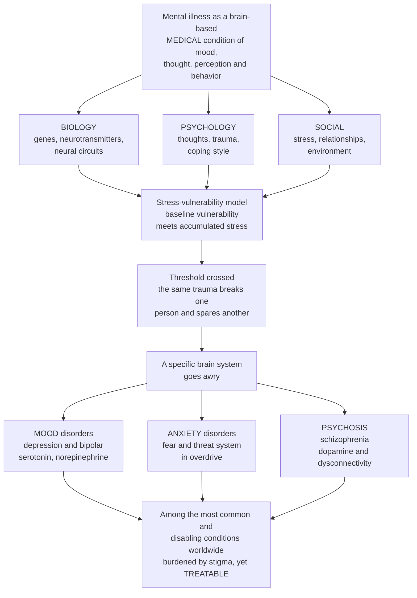

# 🧠 Psychiatric and Behavioral Disorders

> [!abstract] TL;DR
> **Psychiatric and behavioral disorders are medical conditions of the brain's most complex functions** — mood, thought, perception, cognition, and behavior — every bit as real as diseases of the heart or kidney, even though no simple scan reveals them. The unifying frame is the **biopsychosocial model**: mental illness is not caused by one thing but emerges from the convergence of **biology** (genes, neurotransmitters, neural circuits), **psychology** (thoughts, trauma, coping style), and **social context** (stress, relationships, environment). A sharper version is the **stress–vulnerability (diathesis–stress) model**: each person carries a baseline **vulnerability**, and enough life **stress** can tip them across a threshold into illness — which is exactly why the same trauma breaks one person and spares another. Different disorders reflect **different brain systems going awry**: **major depression** and **anxiety** involve mood- and threat-regulating circuits and monoamines (serotonin, norepinephrine); **bipolar disorder** swings between manic and depressive extremes; **schizophrenia** is disordered thought and perception (dopamine dysregulation, altered connectivity). Because there is still no blood test or biomarker for most of them, diagnosis rests on **clinical symptom clusters** (DSM/ICD criteria), which brings heterogeneity and comorbidity. Yet these are among the **most common and disabling conditions humanity faces** — depression and anxiety alone affect hundreds of millions, and mental illness is a leading global cause of disability. Understanding them as **brain-based medical illnesses arising from vulnerability meeting stress** guides multimodal treatment (pharmacology, psychotherapy, neuromodulation) and dismantles the **stigma** that has long compounded the suffering. This note bridges the Psychology and Neuroscience vaults into clinical medicine and completes the neurological section: the disorders of *mind* are inseparable from the disorders of *brain*.

---

## Intuition

**Analogy — the brain's control room, and the software that runs mood, thought, and perception.** Picture the brain as an extraordinarily complex control room running the highest-level programs a body has: the program that sets your **mood**, the one that filters **perception** into a coherent world, the one that organizes **thought** into logical trains, and the one that governs **behavior**. When the control room for your heart's rhythm falters, we call it arrhythmia and nobody doubts it is a disease. When the control room for mood, thought, or perception falters, the output is different — sadness that will not lift, fear with no threat, voices no one else can hear, thoughts that will not hold their thread — but the principle is identical: **a brain system is not functioning as it should**. The reason it *feels* less like a "real" illness is only that we can see a failing heart on an echocardiogram, while a failing mood circuit hides behind a normal-looking brain. That invisibility is a limit of our instruments, not a statement about the reality of the disease.

Now, why does one person's control room fail under a load that another's shrugs off? Because everyone ships with **different hardware and different wear** — this is the **stress–vulnerability model**. Imagine each person's brain has a certain **structural load-bearing capacity** set by genes, early development, and biology (the *vulnerability*, or *diathesis*), and then life piles on **stress** — loss, trauma, sleep deprivation, isolation, substances. A person built with a low ceiling may buckle under a modest load; a person built with a high ceiling can carry far more before anything cracks. Illness appears where **vulnerability plus accumulated stress crosses the threshold** — which is why the same bereavement, the same combat tour, the same adolescence, produces breakdown in one person and resilience in another. No single cause; a **convergence**.

And crucially, *which* program fails depends on *which* system is most loaded. If the **mood-regulating circuitry** and its serotonin/norepinephrine signaling give way, you get **depression** or, swinging to the opposite extreme, **bipolar** mania. If the brain's **threat-detection system** is stuck in overdrive, you get **anxiety**. If the machinery of **thought and perception** — bound up with **dopamine** and long-range brain connectivity — is disrupted, you get **psychosis** and **schizophrenia**. Same control room, different subsystems, different diseases. **Learn to see mental illness as brain-based medical conditions — vulnerable hardware meeting enough stress to break a specific subsystem — and both the treatment and the compassion follow naturally.**

---

## How It Works

### Core mechanics — from vulnerability and stress to a specific broken system

1. **Mental disorders are disturbances of brain function, expressed as symptoms of mood, thought, perception, cognition, and behavior.** There is no lesion you can point to on a routine scan; the pathology lives in the *dynamics* of neurotransmission and circuit activity, not in gross anatomy. This is why psychiatry is the medicine of **dysregulated function** rather than of visible structural damage.
2. **Causation is biopsychosocial — a convergence, never a single switch.** **Biological** contributors (heritable risk, neurotransmitter and receptor differences, HPA-axis and circuit dysregulation, prenatal and developmental insults), **psychological** contributors (temperament, trauma, learned thought and coping patterns), and **social** contributors (chronic stress, poverty, isolation, adverse environments) each shift risk. No one axis is sufficient; disorders emerge where they **overlap**.
3. **The stress–vulnerability (diathesis–stress) model turns convergence into a threshold rule.** Each person carries a baseline **diathesis** (biological/psychological susceptibility). Life delivers **stress**. Illness onset occurs when **diathesis + stress exceeds a threshold** — and, critically, the two **interact**: high-vulnerability individuals cross the threshold under *little* stress, while low-vulnerability individuals need *much more* before they tip. This single idea explains variable susceptibility, why prevention targets both poles (reduce stress *and* build resilience), and why identical exposures yield different outcomes.
4. **Different disorders map to different brain systems and neurotransmitters.** The **monoamines** — serotonin (5-HT), norepinephrine (NE), and dopamine (DA) — plus the fast transmitters **glutamate** (excitatory) and **GABA** (inhibitory) tune the circuits of mood, threat, reward, and thought. Mood disorders implicate serotonergic/noradrenergic tone, neuroplasticity, and the HPA (cortisol) stress axis; anxiety implicates an overactive **amygdala–prefrontal threat circuit** with GABAergic and serotonergic modulation; psychosis implicates **dopamine dysregulation** (mesolimbic excess for hallucinations/delusions; mesocortical deficit for negative/cognitive symptoms) atop a neurodevelopmental, dysconnectivity substrate; addiction hijacks the **mesolimbic dopamine reward circuit**.
5. **Diagnosis is clinical, because biomarkers do not yet exist for most disorders.** Without a defining lab test, psychiatry classifies by **symptom clusters, duration, and functional impairment** codified in the **DSM-5** and **ICD-11**. This pragmatic approach is reliable and treatable-focused, but it carries three consequences: **heterogeneity** (two people with the "same" diagnosis can share few symptoms), **comorbidity** (disorders co-occur far more than chance — depression with anxiety, addiction with almost everything), and **fuzzy boundaries** between categories and between illness and normal distress.
6. **The same broken system produces categories of illness.** *Mood disorders*: **major depression** (persistent low mood/anhedonia plus neurovegetative changes in sleep, appetite, energy, concentration; a leading cause of disability and a driver of suicide risk) and **bipolar disorder** (episodes of **mania/hypomania** alternating with depression). *Anxiety disorders*: generalized anxiety, panic, phobias, with related **OCD** and **PTSD** — the fear/threat system in overdrive. *Psychotic disorders*: **schizophrenia** (**positive** symptoms — hallucinations, delusions; **negative** symptoms — flat affect, avolition, withdrawal; and **cognitive** deficits). Plus **neurodevelopmental** disorders (autism, ADHD), **substance-use/addiction** disorders, **eating disorders**, and **personality disorders**.
7. **Treatment is mechanistic and multimodal — it works on the same three axes that cause illness.** **Pharmacology** modulates the biology (antidepressants raising monoamine signaling and promoting plasticity; antipsychotics blocking dopamine D2 receptors; **mood stabilizers**; **anxiolytics** enhancing GABA); **psychotherapy** — above all **CBT** — reshapes thoughts and behavior, and demonstrably changes circuit activity; **neuromodulation** (ECT, rTMS) resets networks directly; and **social** interventions address the stressors and supports. The **biopsychosocial** cause implies a **biopsychosocial** cure.

### The pathway: brain-based illness, biopsychosocial causes, and the vulnerability-stress threshold



*Read top to bottom: a mental illness is first and foremost a brain-based medical condition; its causes converge from three streams — biology, psychology, and social context; the stress–vulnerability model tells us that where vulnerability meets enough stress, a threshold is crossed; the specific subsystem that gives way defines the category of disorder; and all of them share the same clinical reality — common, disabling, stigmatized, and treatable.*

---

## Key Concepts

### Secondary (intuitive)

- **Mental illness is a real medical condition** of the brain's most complex jobs — mood, thoughts, perception, behavior — not a character flaw or a lack of willpower.
- **No single cause (biopsychosocial):** it comes from **biology** (genes, brain chemistry), **psychology** (thoughts, past trauma, coping), and **social life** (stress, loneliness, hardship) all adding up.
- **Vulnerability meets stress:** everyone has a different tipping point; enough stress can push a vulnerable person into illness, which is why the *same* hard event affects people differently.
- **Different circuits, different disorders:** low mood that will not lift is **depression**; fear stuck "on" is **anxiety**; mood swinging to extremes is **bipolar**; hearing or believing things that are not real is **psychosis / schizophrenia**.
- **It is treatable:** medicines, talking therapies like **CBT**, and support genuinely help — and **stigma**, the shame and misunderstanding around mental illness, is one of the biggest obstacles to getting that help.

### Undergraduate (formal)

- **The biopsychosocial model.** Mental disorders arise from interacting **biological** (genetic loading, neurotransmitter/receptor and circuit differences, HPA-axis dysregulation, developmental insults), **psychological** (temperament, trauma, cognitive schemas, coping), and **social** (chronic stress, socioeconomic adversity, isolation, culture) factors. It replaced older single-cause models and grounds multimodal treatment.
- **Diathesis–stress model.** A predisposing vulnerability (**diathesis**) and precipitating **stress** combine — often multiplicatively — to determine onset. High diathesis lowers the stress needed to trigger illness; low diathesis raises it. It formalizes differential susceptibility and underlies both prevention (stress reduction) and resilience-building.
- **Classification without biomarkers.** Diagnosis uses **DSM-5 / ICD-11** operationalized **symptom criteria** (type, number, duration, and impairment), because validated biological tests do not yet exist for most disorders. Consequences: **heterogeneity** within categories, high **comorbidity**, and debated boundaries (categorical vs dimensional; **RDoC** as a research alternative organizing around circuits and constructs rather than categories).
- **The major categories.** *Mood*: **major depressive disorder** (≥2 weeks of depressed mood and/or anhedonia plus neurovegetative symptoms) and **bipolar disorder** (mania/hypomania ± depression). *Anxiety*: GAD, panic disorder, phobias; related **OCD** and **PTSD**. *Psychotic*: **schizophrenia** with **positive**, **negative**, and **cognitive** symptom domains. Plus **neurodevelopmental** (autism spectrum, ADHD), **substance-use/addiction**, **eating**, and **personality** disorders.
- **The biological substrate.** **Neurotransmitters** — 5-HT, NE, DA, GABA, glutamate — modulate defined **circuits** (limbic/amygdala for threat, prefrontal for regulation, mesolimbic for reward, default-mode and dorsolateral networks for mood and cognition). Many disorders show substantial **heritability** (schizophrenia and bipolar ~60–80%; depression ~35–40%), and **neuroplasticity** — the brain's capacity to remodel — is central both to how disorders develop and to how treatment heals.
- **Treatment principles (mechanistic).** **Antidepressants** (SSRIs/SNRIs) increase synaptic monoamine availability and, over weeks, promote **neuroplasticity** and normalize the HPA axis; **antipsychotics** antagonize **dopamine D2** receptors (and, for atypicals, 5-HT2A); **mood stabilizers** (lithium, certain anticonvulsants) dampen cycling; **anxiolytics** (benzodiazepines) potentiate **GABA-A**. **Psychotherapy** (CBT and others) restructures cognition and behavior with measurable circuit effects. **Neuromodulation** (ECT, rTMS) directly resets networks. Care is **multimodal**.

### Graduate (mechanistic and systems)

- **Psychiatry as dysregulated dynamics, not focal lesion.** Unlike stroke or a tumor, most psychiatric pathology is a disorder of **circuit dynamics and neuromodulatory tone** superimposed on grossly intact anatomy. This reframes disease as a shift in a high-dimensional dynamical system's operating regime — helpful for understanding why symptoms fluctuate, why single-target drugs have limited efficacy, and why the **RDoC** move toward circuit- and construct-based dimensions may eventually outperform categorical DSM diagnoses.
- **Beyond the chemical-imbalance cartoon.** The **monoamine hypothesis** of depression is necessary but insufficient: SSRIs raise synaptic serotonin within hours, yet clinical response takes **weeks**, implicating downstream **neuroplasticity, BDNF signaling, hippocampal neurogenesis, and HPA-axis normalization** as the true effectors. The rapid antidepressant action of **ketamine** (an NMDA-glutamate modulator driving synaptogenesis) further shifts the mechanistic center of gravity from monoamine levels to **plasticity and glutamatergic tone**.
- **Schizophrenia as a neurodevelopmental dysconnection syndrome.** The **dopamine hypothesis** (mesolimbic hyperdopaminergia → positive symptoms; mesocortical hypodopaminergia → negative/cognitive symptoms) is embedded in a broader **neurodevelopmental** account: polygenic risk plus early insults (obstetric, inflammatory, cannabis in the vulnerable) disturb synaptic pruning and long-range connectivity, with **glutamate/NMDA hypofunction** upstream of the dopamine changes. Onset in late adolescence coincides with peak prune-and-myelinate remodeling — vulnerability meeting a developmental stressor.
- **Gene–environment interplay and the missing heritability.** High twin-heritability coexists with **highly polygenic** architecture (thousands of small-effect variants; few large-effect exceptions) and strong **gene × environment interaction** and **epigenetic** mediation (e.g., early-life stress altering glucocorticoid-receptor methylation and HPA reactivity). The diathesis is itself distributed and probabilistic — a *liability* rather than a switch — which is precisely the shape the diathesis–stress model predicts.
- **Comorbidity, the p-factor, and transdiagnostic structure.** Pervasive comorbidity and shared risk suggest a general **psychopathology ("p") factor** and transdiagnostic mechanisms (threat sensitivity, reward deficit, cognitive control) that cut across DSM boundaries. This motivates transdiagnostic treatments and reframes "comorbidity" as our categories carving one underlying liability at the wrong joints.
- **Stigma as a clinical variable, and destigmatization as therapy.** Framing mental illness as a **brain-based medical disease** is not merely rhetorical: stigma independently worsens outcomes by delaying help-seeking, reducing adherence, and compounding social stress — itself a *stressor* feeding back into the diathesis–stress loop. Yet a purely biological framing can paradoxically increase perceived dangerousness and pessimism; the **biopsychosocial** framing — legitimate illness *and* modifiable psychology and environment — best supports both compassion and hope.

---

## Python Demo

```python
# Psychiatric and behavioral disorders -- two quantitative pictures.
#   (a) DIATHESIS-STRESS / STRESS-VULNERABILITY: the probability of illness onset as a
#       function of accumulated STRESS, drawn as a family of curves for LOW, MODERATE, and
#       HIGH baseline vulnerability. The key idea is the INTERACTION: a highly vulnerable
#       person crosses the onset threshold under little stress (curve shifts far left),
#       while a low-vulnerability person needs much more stress to reach the same risk.
#       This is why the SAME life event breaks one person and spares another.
#   (b) GLOBAL BURDEN: approximate point PREVALENCE (% of population) and DISABILITY
#       burden (DALYs, millions) for the major disorders -- showing that depression and
#       anxiety are extraordinarily common while schizophrenia, though rarer, is
#       disproportionately DISABLING per case. Figures are approximate, from WHO / Global
#       Burden of Disease-scale estimates, for teaching, not epidemiological precision.
import numpy as np
import matplotlib.pyplot as plt

# ---------- (a) Diathesis-stress: a family of onset-probability curves ----------
stress = np.linspace(0, 10, 400)            # accumulated life stress (arbitrary units)

def onset_probability(stress, vulnerability, k=1.3, base_threshold=8.0):
    """Logistic onset risk. Higher vulnerability LOWERS the effective stress threshold,
       so the curve shifts left -- the diathesis-stress interaction."""
    threshold = base_threshold * (1.0 - 0.72 * vulnerability)   # vulnerability erodes the threshold
    return 1.0 / (1.0 + np.exp(-k * (stress - threshold)))

profiles = {
    "Low vulnerability":      (0.15, "#2980B9"),
    "Moderate vulnerability": (0.50, "#E67E22"),
    "High vulnerability":     (0.85, "#C0392B"),
}

# ---------- (b) Global prevalence and disability burden ----------
disorders  = ["Depression", "Anxiety", "Bipolar", "Schizophrenia"]
prevalence = [3.8, 4.0, 0.6, 0.3]     # approx global point prevalence, % of population
dalys      = [46,  28,  9,   15]      # approx global disability burden, DALYs in millions

fig, (ax1, ax2) = plt.subplots(1, 2, figsize=(14, 5.8))

# --- panel (a): the family of diathesis-stress curves ---
for label, (v, color) in profiles.items():
    p = onset_probability(stress, v)
    ax1.plot(stress, p, color=color, lw=2.4, label=label)
    # mark where each profile crosses 50% risk -- its personal tipping point
    idx = np.argmin(np.abs(p - 0.5))
    ax1.scatter([stress[idx]], [0.5], color=color, zorder=5, s=45)

ax1.axhline(0.5, color="grey", ls=":", lw=1.2, label="Onset threshold (50% risk)")
ax1.annotate("Same stress,\nvery different risk",
             xy=(4.0, onset_probability(np.array([4.0]), 0.85)[0]),
             xytext=(4.5, 0.30), fontsize=8.5,
             arrowprops=dict(arrowstyle="->", color="black"))
ax1.set_xlabel("Accumulated life stress")
ax1.set_ylabel("Probability of illness onset")
ax1.set_title("(a) Stress-vulnerability model\nvulnerability shifts the tipping point")
ax1.set_ylim(0, 1.02)
ax1.legend(loc="upper left", fontsize=8)
ax1.grid(alpha=0.3)

# --- panel (b): prevalence and disability burden, twin axes ---
x = np.arange(len(disorders))
w = 0.38
b1 = ax2.bar(x - w/2, prevalence, width=w, color="#2E86C1", label="Point prevalence (%)")
ax2.set_ylabel("Point prevalence (% of population)", color="#2E86C1")
ax2.tick_params(axis="y", labelcolor="#2E86C1")
ax2.set_ylim(0, 5)

ax2b = ax2.twinx()
b2 = ax2b.bar(x + w/2, dalys, width=w, color="#CB4335", label="Disability burden (DALYs, millions)")
ax2b.set_ylabel("Disability burden (DALYs, millions)", color="#CB4335")
ax2b.tick_params(axis="y", labelcolor="#CB4335")
ax2b.set_ylim(0, 55)

ax2.set_xticks(x)
ax2.set_xticklabels(disorders, fontsize=9)
ax2.set_title("(b) Global burden of major mental disorders\ncommon AND disabling (approximate)")
ax2.legend(handles=[b1, b2], loc="upper right", fontsize=8)
ax2.grid(alpha=0.25, axis="y")

plt.tight_layout()
plt.show()

# ---------- the payoff: quantify variable susceptibility at a fixed stress ----------
fixed_stress = 4.0
print(f"At an identical stress load of {fixed_stress:.1f} units, estimated onset risk:")
for label, (v, _) in profiles.items():
    risk = onset_probability(np.array([fixed_stress]), v)[0]
    print(f"  {label:<24}{risk*100:5.1f}%")
print("\nThe SAME stressor -> very different outcomes: this is diathesis-stress in one number.")
```

**What you see.** *Panel (a)* is the stress–vulnerability model made visual. All three people follow the same S-shaped rise from "coping" to "ill" as stress accumulates, but their curves are **shifted**: the high-vulnerability profile (red) reaches 50% onset risk under only modest stress, the moderate profile (orange) needs more, and the low-vulnerability profile (blue) needs a great deal before risk climbs. The dropped markers are each person's personal **tipping point**, and the annotation makes the clinical punchline explicit — at one fixed level of stress the three face wildly different risk, which is exactly why the same bereavement, deployment, or adolescence produces illness in one person and resilience in another. The console prints those three risks at a single shared stress load: one stressor, three outcomes. *Panel (b)* shows why this matters at population scale: **depression and anxiety are astonishingly common** (a few percent of the entire population at any moment, hundreds of millions of people), while **schizophrenia**, though far rarer, carries a **disproportionate disability burden per case** — together making mental disorders a leading global cause of years lived with disability. Common, disabling, and — as the treatment section stresses — treatable.

---

## Real-World Applications

- **Structured diagnosis by symptom clusters.** In the absence of a blood test, clinicians apply **DSM-5 / ICD-11** criteria — symptom type, count, duration, and functional impairment — to reach a reliable, treatment-guiding diagnosis. Structured interviews and validated scales (PHQ-9 for depression, GAD-7 for anxiety, PANSS for psychosis) operationalize this and track change over time.
- **Mechanism-matched pharmacotherapy.** Treatment follows the broken system: **SSRIs/SNRIs** for depression and anxiety (raising monoamine tone, driving plasticity over weeks); **antipsychotics** (D2 blockade) for schizophrenia and mania; **lithium and mood stabilizers** to damp bipolar cycling and reduce suicide risk; **benzodiazepines** (GABA-A) for short-term anxiety. Mechanism explains both the therapeutic effect and the side-effect profile.
- **Psychotherapy as a biological intervention.** **CBT** restructures the maladaptive thoughts and avoidance behaviors that maintain depression, anxiety, OCD, and PTSD — and neuroimaging shows it **normalizes prefrontal–amygdala circuit activity**, demonstrating that "talking therapy" is a route to changing the brain. Combined pharmacotherapy-plus-psychotherapy often outperforms either alone.
- **Neuromodulation for treatment-resistant illness.** **ECT** remains the most effective treatment for severe, treatment-resistant, or life-threatening depression and catatonia; **rTMS** offers a non-invasive circuit-targeted option; **ketamine/esketamine** delivers rapid antidepressant and anti-suicidal effects through glutamatergic plasticity — each a direct intervention on network dynamics.
- **Prevention through the stress–vulnerability lens.** Because onset needs *both* vulnerability and stress, public-health strategy targets **both**: reducing modifiable stressors (trauma, poverty, isolation, substance exposure) and building resilience and early support in high-vulnerability groups — screening in primary care, early-psychosis services, and crisis lines that intervene before the threshold is crossed.
- **Addiction as a disorder of reward circuitry.** Framing **substance-use disorders** as hijacking of the **mesolimbic dopamine reward circuit** — not moral failure — reshapes treatment toward medication-assisted therapy, contingency management, and relapse-prevention, and toward compassion. It is the clearest bridge between "behavioral" and "brain-based."
- **Anti-stigma as clinical strategy.** Because stigma delays help-seeking and worsens outcomes, framing mental illness as **legitimate, brain-based medical disease that is treatable** is itself an intervention — deployed in workplace mental-health programs, parity legislation, and clinical communication, always balanced by the psychosocial framing that preserves hope and agency.

---

## Common Pitfalls

- **Treating mental illness as a character flaw or a choice.** The most damaging pitfall, and the root of stigma: framing depression as "weakness" or psychosis as "danger" ignores that these are **disorders of brain function**. The correction is the biopsychosocial, brain-based frame — real illness, arising from causes largely outside the person's control, and treatable.
- **The chemical-imbalance oversimplification.** "Depression is just low serotonin" is a marketing-era cartoon. Monoamines matter, but the delayed response to SSRIs, the role of **neuroplasticity, BDNF, and the HPA axis**, and the rapid effect of glutamatergic agents show the true story is **circuit and plasticity dysregulation**, not a single missing molecule. Over-claiming the simple version breeds later disillusionment.
- **Mistaking "no biomarker" for "not real."** The absence of a scan or blood test reflects the **limits of current instruments**, not the unreality of the disease — just as epilepsy and migraine were once "invisible." Diagnosis by validated symptom criteria is legitimate medicine.
- **Ignoring comorbidity and heterogeneity.** Anchoring on one diagnosis misses that disorders **co-occur** (depression with anxiety, addiction with nearly everything) and that two people with the same label can differ sharply. Treatment must address the whole picture, not a single box.
- **Confusing normal distress with disorder — in both directions.** Over-pathologizing ordinary grief or shyness medicalizes normal life; under-recognizing genuine illness as "just stress" leaves treatable suffering untreated. The threshold is **persistence, severity, and functional impairment**, judged in context.
- **Neglecting the social axis.** Prescribing a pill while ignoring the poverty, trauma, isolation, or ongoing abuse that fuels the illness treats one axis of a three-axis problem. The biopsychosocial cause demands a **multimodal** response.
- **Reading this as clinical advice.** This note teaches the **mechanisms and pathophysiology** of psychiatric disorders at a medical-textbook level. It is not guidance for diagnosing or treating any individual — real mental-health care depends on a qualified clinician, the specifics of the person, and, where there is risk of harm, urgent professional help.

---

## Related Concepts

**Within this vault (Section 04 — Neurological and Musculoskeletal).** This note completes the neurological arc by turning from the disorders of *brain hardware* to the disorders of *mind* that are inseparable from them. *Neurological Pathophysiology* establishes how nervous-system function fails at the level of neurons, circuits, and pathways — the substrate that, when subtly dysregulated rather than grossly destroyed, produces psychiatric disease. *Neurodegenerative and Cognitive Disorders* is its close cousin: dementias and neurodegeneration blur into psychiatry through depression, psychosis, and behavioral change, and share the theme of circuit failure. *Pain Pathophysiology and Management* connects through the deep bidirectional link between chronic pain and mood/anxiety disorders and their shared descending-modulation and monoamine biology. *Seizures, Headache and Neurological Dysfunction* overlaps in the paroxysmal, episodic disturbances of brain function and in the psychiatric comorbidity of epilepsy and migraine. And *Diagnostic Reasoning and Clinical Decision Making* is especially pertinent here, because psychiatry's reliance on symptom-cluster criteria without biomarkers is the purest test of probabilistic clinical reasoning under uncertainty. These five are prose references to sibling notes in this section. The note also builds on the vault hub, [[Clinical_Medicine/01_Foundations_of_Disease_and_Pathophysiology/Clinical_Medicine_and_Pathophysiology_Overview|Clinical Medicine and Pathophysiology Overview]], and shares its **feedback/set-point** logic with [[Clinical_Medicine/03_Metabolic_Endocrine_and_Renal/Endocrine_Pathophysiology|Endocrine Pathophysiology]], through the HPA (cortisol) stress axis that links chronic stress to mood disorders.

**Across the vault (Glob-verified links).**

- [[Neuroscience/06_Clinical_and_Applied_Neuroscience/Psychiatric_Disorders_and_Neurobiology|Psychiatric Disorders and Neurobiology]] — the neuroscience-vault companion; the circuit- and molecular-level neurobiology beneath the clinical picture drawn here.
- [[Neuroscience/01_Cellular_and_Molecular_Neuroscience/Synaptic_Transmission_and_Neurotransmitters|Synaptic Transmission and Neurotransmitters]] — how serotonin, dopamine, norepinephrine, GABA, and glutamate signaling works, and thus how drugs and disease perturb it.
- [[Neuroscience/04_Cognitive_Neuroscience/Decision_Making_and_Reward_Circuits|Decision Making and Reward Circuits]] — the mesolimbic dopamine reward system whose hijacking underlies addiction and whose blunting underlies anhedonia in depression.
- [[Neuroscience/02_Neuroanatomy_and_Brain_Structure/Limbic_System_and_Diencephalon|Limbic System and Diencephalon]] — the amygdala–hippocampus–hypothalamus circuitry of emotion, threat, and the stress axis central to mood and anxiety disorders.
- [[Neuroscience/06_Clinical_and_Applied_Neuroscience/Psychopharmacology_and_Drug_Mechanisms|Psychopharmacology and Drug Mechanisms]] — the mechanisms of antidepressants, antipsychotics, mood stabilizers, and anxiolytics referenced in the treatment section.
- [[Neuroscience/06_Clinical_and_Applied_Neuroscience/Neurodevelopmental_Disorders|Neurodevelopmental Disorders]] — autism and ADHD, and the neurodevelopmental thread that also runs through schizophrenia.
- [[Psychology/13_Abnormal_Psychology/Models_of_Abnormality|Models of Abnormality]] — the psychology-vault treatment of the biopsychosocial and diathesis–stress frameworks that organize this note.
- [[Psychology/13_Abnormal_Psychology/Mood_Disorders|Mood Disorders]] — the psychological-science view of depression and bipolar disorder, complementary to this clinical/biological one.
- [[Psychology/13_Abnormal_Psychology/Anxiety_and_OCD_Disorders|Anxiety and OCD Disorders]] — the threat/fear-system disorders discussed here from the abnormal-psychology angle.
- [[Psychology/13_Abnormal_Psychology/Schizophrenia_and_Psychosis|Schizophrenia and Psychosis]] — positive, negative, and cognitive symptoms and their psychology-vault treatment.
- [[Psychology/06_Clinical_and_Applied/Cognitive_Behavioral_Therapy|Cognitive Behavioral Therapy]] — the evidence-based psychotherapy whose neural effects make it a biological as well as psychological intervention.
- [[Psychology/07_Biological_Psychology_and_Neuroscience/Neurotransmitters_and_Psychopharmacology|Neurotransmitters and Psychopharmacology]] — the biological-psychology bridge on transmitters and the drugs that modulate them.
- [[Psychology/05_Motivation_and_Emotion/Stress_and_Coping|Stress and Coping]] — the "stress" half of the stress–vulnerability model and the coping resources that raise the threshold.
- [[Biology/09_Human_Physiology_and_Anatomy/Homeostasis_and_the_Nervous_System|Homeostasis and the Nervous System]] — the healthy nervous-system function whose dysregulation this note describes.
- [[Health_Nutrition_and_Longevity/04_Sleep_Stress_and_Mental_Wellbeing/Mental_Health_and_Psychological_Wellbeing|Mental Health and Psychological Wellbeing]] — the wellbeing and prevention counterpart to the clinical-disorder view here.
- [[Health_Nutrition_and_Longevity/04_Sleep_Stress_and_Mental_Wellbeing/Stress_and_the_Stress_Response|Stress and the Stress Response]] — the HPA-axis stress physiology linking chronic stress to psychiatric vulnerability.

---

## Review Questions

**Secondary.** Using the "brain's control room" analogy, explain why a mental illness like depression or schizophrenia is a real medical condition even though a doctor cannot see it on a normal brain scan. Then, using the idea of "vulnerability meeting stress," explain why the same difficult life event (say, losing a job) might trigger a serious illness in one person but not in another.

**Undergraduate.** Compare the **biopsychosocial model** and the **stress–vulnerability (diathesis–stress) model**: what does each add, and how do they fit together? Then, for **major depression**, **anxiety disorders**, and **schizophrenia**, name the principal brain system and neurotransmitter(s) implicated and the corresponding class of medication, and explain why diagnosis for all three still rests on **symptom-cluster criteria** rather than a biological test — and what problems (heterogeneity, comorbidity) that creates.

**Graduate.** The "chemical-imbalance" account of depression is described in this note as "necessary but insufficient." Defend that claim mechanistically: reconcile the immediate rise in synaptic serotonin on an SSRI with the weeks-long delay to clinical response, and with the rapid action of ketamine, in terms of **neuroplasticity, BDNF, HPA-axis** function, and **glutamatergic** signaling. Then argue how the **diathesis–stress** framework, a highly **polygenic** genetic architecture, and **gene × environment** interaction together explain both the high heritability of schizophrenia and the fact that most high-risk individuals never become ill. Finally, evaluate the claim that framing mental illness as a purely **biological brain disease** reduces stigma — including the evidence that it can paradoxically increase perceived dangerousness — and state which framing you would adopt clinically and why.

---

## Sources

- American Psychiatric Association. *Diagnostic and Statistical Manual of Mental Disorders* (DSM-5-TR, 5th ed., text revision). APA Publishing — the operational symptom-cluster classification of psychiatric disorders.
- Kandel, E. R., Koester, J. D., Mack, S. H., & Siegelbaum, S. A. (eds.). *Principles of Neural Science* (6th ed.). McGraw-Hill — the neurobiology of disorders of mood, thought, and perception.
- Boland, R., Verduin, M. L., & Ruiz, P. *Kaplan & Sadock's Synopsis of Psychiatry* (12th ed.). Wolters Kluwer — the standard clinical psychiatry reference on diagnosis, disorders, and treatment.
- Loscalzo, J., Fauci, A., Kasper, D., et al. (eds.). *Harrison's Principles of Internal Medicine* (21st ed.), Psychiatric Disorders. McGraw-Hill — psychiatric disease within general internal medicine.
- GBD 2019 Mental Disorders Collaborators. "Global, regional, and national burden of 12 mental disorders in 204 countries and territories, 1990–2019." *The Lancet Psychiatry* (2022) — global prevalence and disability-burden estimates.

---

#clinical-medicine #psychiatry #depression #schizophrenia #mental-health
