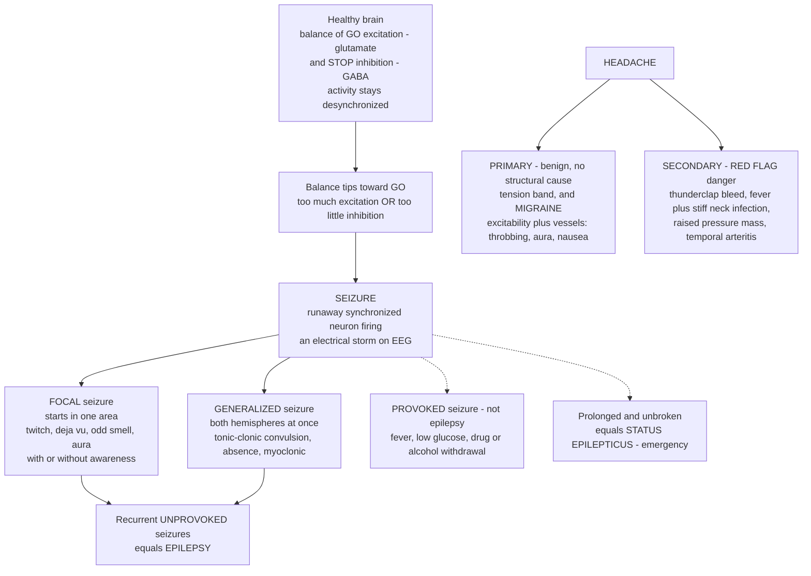

# ⚡ Seizures, Headache, and Neurological Dysfunction

> [!abstract] TL;DR
> The brain runs on a razor-thin balance between electrical **"GO" signals** (excitation, carried by **glutamate**) and **"STOP" signals** (inhibition, carried by **GABA**). A **seizure** is what happens when that balance tips too far toward GO: a population of neurons erupts into a **runaway, hypersynchronous electrical storm**. Depending on where the storm ignites and how far it spreads, it can look like a two-second blank stare, a twitching hand, a wave of rising déjà vu, or a full-body convulsion with loss of consciousness. **Epilepsy** is the *condition* of having recurrent, unprovoked seizures — a brain chronically prone to these storms. This note pairs seizures with the other near-universal neurological complaint, **headache**. Most headache is **benign** (tension-type, and **migraine** — a disorder of cortical excitability and the trigeminovascular system producing throbbing pain, nausea, light sensitivity, and sometimes a visual **aura**), but a small minority are **secondary red-flag headaches** signalling a bleed, tumour, or infection. The clinician's decisive skill is separating the benign majority from the rare "worst headache of my life." Rounding out the brain's **episodic and functional** disturbances are **syncope** (a faint from dropped brain perfusion, easily confused with a seizure), vertigo, sleep disorders, and peripheral **neuropathies**. Together these describe *how the working brain misfires* — distinct from the *structural destruction* of stroke and neurodegeneration covered in the sibling notes.

---

## Intuition

**Analogy — the brain as an orchestra held in balance between "play" and "hush."** Picture a vast orchestra where every neuron is a musician. Two forces keep the music coherent: a conductor's *cue to play* (**excitation**, the GO signal) and a *cue to hush* (**inhibition**, the STOP signal). In a healthy brain these forces are exquisitely matched, so at any instant only the right musicians are playing and the rest are damped — the result is rich, ever-changing, *desynchronized* music. On an EEG this looks like a low, irregular squiggle: billions of neurons doing their own thing.

Now imagine the "hush" cue suddenly fails in one section. With nothing to damp them, those musicians catch each other's rhythm and begin playing **in perfect lockstep, at full blast**. The runaway synchrony spreads: neighbouring sections lock on, the whole hall thunders one deafening chord over and over, and the music — normal brain function — is drowned out. That deafening, synchronized roar *is* a **seizure**. If it stays in one corner of the hall, you get a **focal seizure** (a twitching hand, a strange smell, a rising feeling); if it engulfs the entire orchestra, you get a **generalized tonic-clonic convulsion** with loss of consciousness. A hall that keeps collapsing into these roars — unprovoked, again and again — is what we call **epilepsy**.

**Headache** is a different everyday complaint, and here the analogy is *triage at the door*. The overwhelming majority of people knocking with a headache have a benign problem — a tension "tight band," or a **migraine**, where the cortex becomes transiently hyperexcitable and a pain-signalling system wrapped around the brain's blood vessels fires, producing throbbing pain, nausea, and sometimes a slowly marching visual **aura**. But every so often, someone at the door is carrying an emergency — a ruptured vessel, an infection, a mass raising pressure inside the skull. They may describe it as the **sudden "worst headache of my life."** The clinician's core job is to wave the benign majority through while catching the rare dangerous case. This note is about those two great *functional* disturbances — the brain's electrical storms and its pain signals — as opposed to the structural wreckage of a stroke.

---

## How It Works

### The excitation–inhibition balance

Every moment of normal brain activity is a negotiation between two neurotransmitter systems. **Glutamate** is the brain's principal *excitatory* transmitter: acting on AMPA and NMDA receptors, it depolarizes neurons toward firing — the GO signal. **GABA** (γ-aminobutyric acid) is the principal *inhibitory* transmitter: acting on GABA-A receptors it opens chloride channels that hyperpolarize neurons and *raise the threshold to fire* — the STOP signal. Healthy networks hold these in tight **excitation–inhibition (E-I) balance**, which keeps activity *desynchronized*: neurons fire, but out of step, so the population never speaks in one voice.

A **seizure** is a transient episode of **abnormal, excessive, synchronous neuronal activity**. It arises whenever the balance tips toward excitation — either *too much GO* (excess glutamate, hyperexcitable membranes from a channel mutation, cortical scarring that forms an irritable focus) or *too little STOP* (loss of GABAergic inhibition). Two failures conspire:

1. **Hyperexcitability** — individual neurons are too easily driven to fire (e.g., from an ion-channel defect or a structural lesion acting as a pacemaker focus).
2. **Hypersynchrony** — normally independent neurons become entrained into firing *together*. Recurrent excitatory connections, gap junctions, and loss of the inhibitory "surround" let a local burst recruit its neighbours, and the discharge propagates.

The electrical hallmark at the cellular level is the **paroxysmal depolarizing shift (PDS)**: a giant, sustained depolarization crowned by a burst of action potentials. When enough neurons undergo PDS in unison, their summed fields produce the large, rhythmic **spikes and spike-wave discharges** seen on the scalp **EEG** — the ictal storm made visible.

### Classifying seizures: where the storm starts and how far it spreads

The modern **ILAE classification** organizes seizures by *onset*:

- **Focal seizures** (formerly "partial") begin in **one region of one hemisphere**. Symptoms mirror that region's normal job: a motor-cortex focus twitches the opposite hand; a temporal-lobe focus produces déjà vu, a rising epigastric sensation, or an odd smell; an occipital focus produces flashing lights. Focal seizures are subdivided by **awareness** — *focal aware* (consciousness preserved, the old "simple partial") versus *focal impaired awareness* (the old "complex partial," often with automatisms like lip-smacking). A focal seizure can **spread to both hemispheres** — a *focal to bilateral tonic-clonic* seizure.
- **Generalized seizures** engage **networks across both hemispheres from the outset**. Key subtypes: **tonic-clonic** (the classic convulsion — a rigid *tonic* phase then rhythmic *clonic* jerking, with loss of consciousness); **absence** (brief blank stares with 3 Hz spike-wave on EEG, classically in children); and **myoclonic** (sudden shock-like jerks).

The clinical picture, in short, is a readout of *which network the storm captured* — the same localizing logic used everywhere in neurology.

### Epilepsy, provoked seizures, and status epilepticus

A single seizure is not epilepsy. **Epilepsy** is the disease of **recurrent, unprovoked seizures** (operationally: two unprovoked seizures more than 24 hours apart, or one with high recurrence risk). Its causes span **genetic/channelopathy** (mutations in sodium, potassium, or GABA-receptor genes), **structural** (tumour, cortical malformation, post-stroke or post-traumatic scar, hippocampal sclerosis), **metabolic**, **immune/infectious**, and **unknown**.

Crucially, distinguish these from **provoked (acute symptomatic) seizures** — a normal brain pushed past its threshold by a transient insult: **high fever** (febrile seizures in children), **hypoglycaemia** or electrolyte derangement (low sodium, calcium), **drug or alcohol withdrawal**, or toxins. Provoked seizures are *not* epilepsy; remove the provocation and the risk resolves.

**Status epilepticus** is the neurological emergency: a seizure lasting **beyond ~5 minutes**, or repeated seizures without recovery between them. Prolonged seizing causes excitotoxic neuronal injury, systemic acidosis, hyperthermia, and rising resistance to treatment — it demands rapid termination, first-line with **benzodiazepines** (which boost GABA-A inhibition).

### Anti-seizure therapy: restore STOP, reduce GO

The entire logic of anti-seizure medication follows directly from the E-I picture — **tip the balance back toward inhibition**: *enhance GABA/inhibition* (benzodiazepines, phenobarbital, tiagabine, vigabatrin), *reduce excitation/excitability* by blocking voltage-gated **sodium channels** to dampen high-frequency firing (phenytoin, carbamazepine, lamotrigine), block calcium channels (ethosuximide for absence), or modulate synaptic release (levetiracetam via SV2A). The drugs differ; the goal is always to raise the threshold for a runaway storm.

### Headache: benign primary vs dangerous secondary

Headaches split into two great classes. **Primary headaches** have **no underlying structural cause** — the pain *is* the disease:

- **Tension-type** — the most common, a bilateral "tight band" pressure, mild-to-moderate, without the features below.
- **Migraine** — a disorder of **neuronal excitability plus trigeminovascular activation**. The pain is typically **throbbing, often unilateral, moderate-to-severe**, worsened by movement, and accompanied by **nausea, photophobia (light sensitivity), and phonophobia**. Up to a third of patients get an **aura**: a *slowly marching* neurological symptom — most often shimmering, expanding visual zig-zags — lasting minutes. The aura's substrate is **cortical spreading depression (CSD)**: a slow wave of neuronal depolarization followed by prolonged suppression, creeping across the cortex at **~3 mm/min** (exactly matching how fast the visual scintillation expands). CSD is thought to activate the **trigeminovascular system** — sensory (trigeminal) fibres wrapped around meningeal blood vessels — releasing peptides like **CGRP** that drive the throbbing pain and sensitization.
- **Cluster** — excruciating, strictly one-sided periorbital pain in bouts, with autonomic signs (tearing, red eye, nasal congestion).

**Secondary headaches** are a *symptom of another disease*, and a subset are dangerous. The clinician screens for **red flags** that raise suspicion of a serious secondary cause:

| Red flag | Suggests |
|---|---|
| **Sudden "thunderclap"** peaking in seconds | **Subarachnoid haemorrhage** (a ruptured aneurysm) |
| **Fever + neck stiffness + photophobia** | **Meningitis / encephalitis** |
| **Progressive, worse lying down or on waking, with vomiting** | Raised intracranial pressure — **tumour, mass** |
| **New headache over age 50 with scalp tenderness, jaw claudication** | **Giant cell (temporal) arteritis** — threatens vision |
| **Focal deficit, seizure, altered consciousness** | Mass, bleed, or infection |
| **Immunocompromise or cancer history** | Opportunistic infection, metastasis |

The clinical priority is not to *diagnose every headache* but to **separate benign from dangerous** — most need reassurance, a few need an urgent CT, lumbar puncture, or blood tests.

### Other functional / episodic neurology

- **Syncope** — a *transient loss of consciousness from globally reduced cerebral perfusion* (a drop in blood pressure/cardiac output). It is frequently confused with a seizure, but the mechanism is **circulatory, not electrical**. Clues favouring syncope: an upright trigger, pre-syncopal light-headedness and greying vision, rapid recovery, and no post-event confusion. (Brief "convulsive" jerks *can* occur in syncope from transient hypoxia — a classic trap.) A seizure more often has an aura, tongue-biting, prolonged **post-ictal confusion**, and does not depend on posture.
- **Dizziness / vertigo** — vertigo is the *illusion of movement*, usually from the vestibular system (inner ear or its central connections), distinct from light-headedness.
- **Sleep disorders** — insomnia, narcolepsy, and parasomnias reflect dysregulation of sleep–wake circuitry (and interact with epilepsy, since sleep deprivation lowers the seizure threshold).
- **Neuropathies** — dysfunction of the *peripheral* nerves (numbness, tingling, weakness in a nerve or "glove-and-stocking" distribution), as in diabetic neuropathy — a functional disturbance downstream of the brain.

### The whole picture — from balance to storm, and benign to red-flag



*Read the left branch as the electrical-storm story and the right branch as the headache-triage story — the two great episodic disturbances of the working brain.*

---

## Key Concepts

### Secondary (intuitive)

- **The brain balances GO and STOP.** Normally these are matched, so neurons fire out of step and the music stays coherent.
- **A seizure = the STOP fails and neurons fire together in a runaway electrical storm.** A small storm = a stare or twitch; a whole-brain storm = a convulsion with loss of consciousness.
- **Epilepsy = a brain that keeps having these storms** unprovoked, again and again.
- **Some seizures are *provoked*** by a temporary trigger (high fever, low blood sugar, alcohol withdrawal) in a normal brain — that is not epilepsy.
- **Headache is usually harmless.** Tension headache = a tight band; **migraine** = throbbing pain, often one-sided, with nausea, light sensitivity, and sometimes a slowly spreading visual **aura**.
- **A few headaches are dangerous.** The big warning is a **sudden "worst headache of my life"** (a possible brain bleed), or headache **with fever and a stiff neck** (possible infection).
- **A faint (syncope) is not a seizure** — it comes from a brief drop in blood flow to the brain, not an electrical storm.

### Undergraduate (formal)

- **E-I balance and oscillogenesis.** Cortical activity is desynchronized because feedback inhibition (GABAergic interneurons) tracks and damps excitation. Loss of inhibition or excess recurrent excitation drives **hypersynchrony** — the substrate of a seizure.
- **Paroxysmal depolarizing shift (PDS).** The cellular signature of the epileptic neuron: a large, prolonged depolarization with a burst of spikes; summed across a population it produces EEG **spike-wave** discharges.
- **ILAE onset-based classification.** *Focal* (aware / impaired awareness; can evolve to bilateral tonic-clonic) vs *generalized* (tonic-clonic, absence with 3 Hz spike-wave, myoclonic) vs *unknown onset*. Semiology localizes the onset zone.
- **Epilepsy vs provoked seizure vs status epilepticus.** Epilepsy = recurrent unprovoked seizures (genetic/channelopathy, structural, metabolic, immune, unknown). Provoked/acute-symptomatic seizures follow a transient insult. **Status epilepticus** (≥5 min or repeated without recovery) is a time-critical emergency treated first with benzodiazepines.
- **Anti-seizure drug rationale.** Enhance inhibition (GABAergic drugs) or reduce excitation/excitability (Na⁺-channel blockers dampening high-frequency firing; ethosuximide's T-type Ca²⁺ block for absence; levetiracetam's SV2A modulation).
- **Migraine phases and CSD.** Prodrome → aura (cortical spreading depression, ~3 mm/min) → headache (trigeminovascular activation, CGRP release, central sensitization) → postdrome. Diagnostic criteria (POUND-type features: **P**ulsatile, **O**ne-day duration, **U**nilateral, **N**ausea, **D**isabling).
- **Primary vs secondary headache and red flags.** Primary (tension, migraine, cluster) have no structural cause; secondary headaches are screened with mnemonics such as **SNNOOP10** for red flags (systemic symptoms, neurologic deficit, sudden onset, older age, pattern change, etc.).
- **Syncope vs seizure.** Syncope = transient global hypoperfusion (reflex/vasovagal, cardiac, orthostatic); rapid recovery, posture-dependent, minimal post-event confusion — versus the aura, tongue-biting, and post-ictal state of a seizure.

### Graduate (mechanistic and systems)

- **Ictogenesis vs epileptogenesis.** *Ictogenesis* is the acute transition of a network into a seizure — increasingly modelled as a **dynamical bifurcation** in which the cortical network crosses a tipping point from a stable desynchronized state into a synchronized limit cycle (the framework behind Jirsa's "Epileptor" model and "critical slowing down" as a pre-ictal warning). *Epileptogenesis* is the *chronic* process by which a normal brain becomes epileptic after an insult — synaptic reorganization (mossy-fibre sprouting), interneuron loss, gliosis, altered chloride homeostasis (KCC2 downregulation making GABA paradoxically excitatory), and neuroinflammation.
- **The GABA reversal-potential subtlety.** GABA is inhibitory only because intracellular Cl⁻ is kept low by the KCC2 transporter. In immature neurons and in some epileptic/injured tissue, chloride accumulates and **GABA-A activation becomes depolarizing/excitatory** — a reason inhibition can fail in unexpected ways and why some "inhibitory" strategies backfire.
- **Excitotoxicity and status epilepticus injury.** Sustained glutamatergic firing floods neurons with Ca²⁺ via NMDA receptors, triggering excitotoxic cascades — the mechanism linking prolonged seizures to neuronal death, and the reason status epilepticus is an emergency, not merely a long seizure.
- **Cortical spreading depression, mechanistically.** CSD is a self-propagating wave of near-complete depolarization with breakdown of ion gradients (massive K⁺ and glutamate release), silencing cortex in its wake, propagating at ~2–5 mm/min — matching aura kinetics. In compromised tissue (after stroke or trauma) analogous **spreading depolarizations** are injurious, tying migraine biology to acute brain injury.
- **The CGRP revolution.** Calcitonin gene-related peptide, released from trigeminal afferents, is central to migraine pain. **Anti-CGRP monoclonal antibodies (erenumab, fremanezumab) and small-molecule gepants** validate the trigeminovascular model clinically and represent the first mechanism-specific migraine preventives — a direct translation of pathophysiology to therapy.
- **Channelopathies as a bridge.** Monogenic epilepsies (SCN1A in Dravet syndrome; KCNQ2/3; GABA-receptor subunits) and familial hemiplegic migraine (CACNA1A, ATP1A2, SCN1A) show that seizures and migraine share **ion-channel excitability genes** — the same molecular dial, tuned differently, produces the electrical storm or the spreading-depression wave.
- **Seizure vs syncope as a diagnostic-reasoning problem.** Because convulsive syncope exists and because misdiagnosed syncope-as-epilepsy leads to years of unnecessary drugs (and vice versa, missing a cardiac cause can be fatal), the distinction is a canonical exercise in weighing history features by likelihood ratio — the essence of clinical localization and triage.

---

## Python Demo

```python
# Seizures & headache in three pictures (numpy + matplotlib):
#   (a) E-I BALANCE -> SYNCHRONY: a synthetic EEG-like trace transitions from
#       NORMAL desynchronized, low-amplitude activity to a HYPERSYNCHRONOUS,
#       high-amplitude "ictal" rhythm when inhibition collapses below threshold
#       -> the runaway electrical storm made visible.
#   (b) THE TIPPING POINT: network synchrony (an order parameter) as a function
#       of inhibitory tone -> below a threshold, synchrony jumps sharply: the
#       "seizure threshold" that anti-seizure drugs push back up.
#   (c) MIGRAINE AURA as CORTICAL SPREADING DEPRESSION: a wave of depolarization
#       creeping across the cortex at ~3 mm/min -> why the visual aura slowly
#       "marches" across the visual field over minutes.
import numpy as np
import matplotlib.pyplot as plt

rng = np.random.default_rng(2)

# ---------- (a) EEG: desynchronized (normal) -> hypersynchronous (ictal) ----------
fs = 500.0                                  # sampling rate (Hz)
t  = np.arange(0, 12, 1/fs)                 # 12 seconds
# Synchrony gate S(t): 0 = normal, 1 = seizure. Inhibition collapses ~5-9 s.
S = np.clip((t - 5.0)/0.5, 0, 1) - np.clip((t - 9.0)/0.5, 0, 1)

# Desynchronized background: sum of many oscillators, random freqs & phases
N = 80
f_bg = rng.uniform(8, 40, N)                # mixed beta/gamma frequencies
ph   = rng.uniform(0, 2*np.pi, N)
desync = np.sin(2*np.pi*np.outer(t, f_bg) + ph).sum(axis=1) / np.sqrt(N)

# Ictal rhythm: high-amplitude, rhythmic ~3 Hz spike-and-wave-like discharge
f_ict = 3.0
sync  = 3.2*(np.sin(2*np.pi*f_ict*t) + 0.45*np.sin(2*np.pi*2*f_ict*t + 0.6))

eeg = (1 - S)*desync + S*sync + 0.12*rng.standard_normal(t.size)

# ---------- (b) Order parameter vs inhibitory tone: the seizure threshold ----------
gi   = np.linspace(0.0, 2.0, 500)           # inhibitory tone (relative GABA strength)
thr  = 0.85                                 # seizure threshold
r    = 1.0/(1.0 + np.exp((gi - thr)/0.06))  # synchrony order parameter (1=locked, 0=async)

# ---------- (c) Cortical spreading depression: a wave marching across cortex ----------
x     = np.linspace(0, 60, 600)             # cortical distance (mm)
speed = 3.0                                 # mm/min (matches aura kinetics)
snaps = [2, 6, 10, 14, 18]                  # minutes

fig, (ax1, ax2, ax3) = plt.subplots(1, 3, figsize=(16.5, 5.0))

# --- panel (a) ---
ax1.plot(t, eeg, color="#34495E", lw=0.7)
ax1.axvspan(5, 9, color="#C0392B", alpha=0.12)
ax1.text(2.4, 4.6, "normal\n(desynchronized)", ha="center", fontsize=8.5, color="#2C3E50")
ax1.text(7.0, 4.6, "ICTAL storm\n(hypersynchronous)", ha="center", fontsize=8.5, color="#922B21")
ax1.annotate("inhibition collapses\n-> neurons fire in lockstep",
             xy=(5.2, -4.3), xytext=(0.4, -5.6), fontsize=8, color="#C0392B",
             arrowprops=dict(arrowstyle="->", color="#C0392B"))
ax1.set_xlabel("Time (s)"); ax1.set_ylabel("EEG amplitude (a.u.)")
ax1.set_title("(a) E-I balance -> synchrony: normal vs seizure EEG")
ax1.set_ylim(-6.2, 6.0); ax1.set_xlim(0, 12)

# --- panel (b) ---
ax2.plot(gi, r, color="#2980B9", lw=2.4)
ax2.axvline(thr, color="#C0392B", ls="--", lw=1.4)
ax2.axvspan(0, thr, color="#C0392B", alpha=0.10)
ax2.axvspan(thr, 2.0, color="#27AE60", alpha=0.10)
ax2.text(thr/2, 0.5, "SEIZURE\n(synchronized)", ha="center", fontsize=8.5, color="#922B21")
ax2.text((thr+2)/2, 0.5, "healthy\n(desynchronized)", ha="center", fontsize=8.5, color="#1E7B34")
ax2.annotate("seizure\nthreshold", xy=(thr, 0.5), xytext=(thr+0.28, 0.82),
             fontsize=8, color="#C0392B",
             arrowprops=dict(arrowstyle="->", color="#C0392B"))
ax2.set_xlabel("Inhibitory tone (relative GABA strength)")
ax2.set_ylabel("Network synchrony (order parameter r)")
ax2.set_title("(b) The tipping point: lose inhibition -> runaway synchrony")
ax2.set_ylim(-0.03, 1.05); ax2.set_xlim(0, 2)

# --- panel (c) ---
colors = plt.cm.viridis(np.linspace(0.15, 0.9, len(snaps)))
for tt, c in zip(snaps, colors):
    front = speed*tt
    wave  = np.exp(-((x - front)/3.0)**2)          # depolarization pulse
    ax3.plot(x, wave, color=c, lw=2.0, label=f"t = {tt} min")
ax3.annotate("wave marches at ~3 mm/min", xy=(30, 1.0), xytext=(6, 1.14),
             fontsize=8, color="#4B0082",
             arrowprops=dict(arrowstyle="->", color="#4B0082"))
ax3.set_xlabel("Cortical distance (mm)")
ax3.set_ylabel("Depolarization (normalized)")
ax3.set_title("(c) Migraine aura = cortical spreading depression")
ax3.set_ylim(0, 1.28); ax3.set_xlim(0, 60)
ax3.legend(loc="upper right", fontsize=7.5)

plt.tight_layout()
plt.show()

# --- quantitative readouts ---
ictal_amp  = np.ptp(eeg[(t >= 6) & (t <= 8)])
normal_amp = np.ptp(eeg[(t >= 1) & (t <= 3)])
print(f"Ictal peak-to-peak amplitude is ~{ictal_amp/normal_amp:.1f}x the normal EEG "
      f"-> hypersynchrony = large, rhythmic discharges.")
print(f"Seizure threshold at inhibitory tone ~ {thr}: below it, synchrony r jumps "
      f"from ~{r[gi>1.4].mean():.2f} to ~{r[gi<0.4].mean():.2f}.")
print(f"CSD wave crosses {speed*snaps[-1]:.0f} mm of cortex in {snaps[-1]} min "
      f"({speed} mm/min) -> aura slowly marches over minutes, not seconds.")
```

**What you see.** *Panel (a)* is the E-I balance made visual: for the first five seconds the EEG is a **low, irregular squiggle** — billions of neurons firing *out of step* because inhibition keeps them desynchronized. When inhibition collapses (shaded window), the trace erupts into a **large, rhythmic, hypersynchronous discharge many times taller** than baseline — the electrical storm of a seizure. *Panel (b)* is *why* this happens so abruptly: network synchrony is not a gentle slope but a **threshold phenomenon**. Above a critical inhibitory tone the network stays comfortably desynchronized; let inhibition fall past the **seizure threshold** and synchrony *snaps* to near-maximal — which is exactly the dial anti-seizure drugs push back up. *Panel (c)* explains the migraine **aura**: a wave of cortical depolarization creeping across the cortex at only **~3 mm/min**, so a scintillating scotoma slowly *expands across the visual field over ten to twenty minutes* rather than appearing all at once — a fingerprint that distinguishes migrainous aura from the abrupt deficit of a stroke or the seconds-long march of a seizure.

---

## Real-World Applications

- **EEG diagnosis and seizure localization.** The EEG is the direct clinical readout of panel (a): interictal **spikes** flag an irritable focus, **3 Hz spike-wave** confirms absence epilepsy, and video-EEG telemetry localizes the seizure-onset zone. This localization guides **epilepsy surgery** — resecting the focus (e.g., a sclerotic hippocampus) when drugs fail.
- **Emergency management of status epilepticus.** The E-I logic dictates the protocol: **benzodiazepines first** (rapidly boost GABA-A inhibition to abort the storm), then a longer-acting agent (levetiracetam, valproate, phenytoin), escalating to anaesthetic burst-suppression — a race against excitotoxic injury.
- **Rational anti-seizure drug selection.** Drug choice maps to mechanism and seizure type: **ethosuximide** for absence (T-type Ca²⁺ channels), **sodium-channel blockers** (lamotrigine, carbamazepine) for focal seizures, broad-spectrum **valproate/levetiracetam** for generalized epilepsies — and *avoiding* Na⁺-channel blockers in some generalized syndromes where they worsen seizures.
- **Headache triage in the emergency department.** The red-flag framework is applied daily: a **thunderclap headache** triggers a non-contrast CT and, if negative, a **lumbar puncture** to catch subarachnoid haemorrhage; **fever + neck stiffness** triggers empiric antibiotics and LP for meningitis; **new headache over 50 with a raised ESR** triggers steroids for giant cell arteritis to save vision — decisions that hinge on separating benign primary headache from dangerous secondary causes.
- **CGRP-targeted migraine therapy.** Translating the trigeminovascular model, **anti-CGRP antibodies and gepants** now prevent and abort migraine by blocking the very peptide released during trigeminovascular activation — one of the clearest recent pathophysiology-to-drug pipelines in neurology.
- **Tilt-table testing and cardiac workup for syncope.** Because misclassifying syncope as epilepsy (or missing a lethal cardiac cause) is costly, the syncope-vs-seizure distinction drives ECG, echocardiography, and tilt-table testing — applied diagnostic reasoning about *perfusion failure vs electrical storm*.

---

## Common Pitfalls

- **Calling any single seizure "epilepsy."** A first seizure — especially a *provoked* one (fever, hypoglycaemia, alcohol withdrawal) — is not epilepsy. Epilepsy requires a *tendency to recurrent, unprovoked* seizures. Mislabelling commits patients to years of unnecessary drugs; treat the provocation instead.
- **Confusing syncope with a seizure (and vice versa).** Convulsive jerks *can* occur during a faint from transient brain hypoxia, and a seizure can be mistaken for a faint. Missing the difference means either an untreated cardiac cause or an epilepsy misdiagnosis. Weight posture, prodrome, tongue-biting, and post-ictal confusion.
- **Assuming GABA drugs always calm the brain.** In immature or injured tissue with disrupted chloride homeostasis (KCC2 downregulation), **GABA can become depolarizing/excitatory** — one reason some inhibitory strategies fail or backfire, and why neonatal seizures behave differently.
- **Dismissing every headache as benign — or over-imaging every headache.** The skill is calibrated triage: the vast majority are primary and need no scan, but a **thunderclap onset, fever with stiff neck, progressive morning headache, or new headache over 50** must not be waved through. Both extremes — reflexive reassurance and reflexive CT — are errors.
- **Treating migraine aura and a TIA/stroke as interchangeable.** A migrainous aura **spreads slowly (minutes) and positively** (shimmering lights building up), whereas a TIA/stroke deficit is **sudden and negative** (loss of function). The kinetics in panel (c) are the discriminator; confusing them delays stroke treatment or over-investigates migraine.
- **Reading this as medical advice.** This note describes *mechanisms* at textbook level. It is not guidance for anyone's actual seizure, headache, or medication. A first seizure, status epilepticus, and a thunderclap or "worst-ever" headache are **emergencies** requiring immediate in-person care.

---

## Related Concepts

**Within this section (Neurological and Musculoskeletal).** This note covers the brain's **episodic and functional** disturbances and is meant to be read against its structural counterparts. *Neurological Pathophysiology* supplies the general framework of localization and the neuron/synapse machinery that these disorders derail. *Neurodegenerative and Cognitive Disorders* contrasts the *chronic structural loss* of Alzheimer's and Parkinson's with the *transient electrical* events described here — though the two overlap, since neurodegeneration raises seizure risk. *Pain Pathophysiology and Management* deepens the nociceptive and trigeminovascular biology that migraine and headache draw on. *Psychiatric and Behavioral Disorders* connects at the boundary where functional seizures, migraine comorbidity, and neurotransmitter dysregulation meet. And *Diagnostic Reasoning and Clinical Decision Making* is the meta-skill this note repeatedly exercises — localizing a seizure from its semiology and triaging benign from dangerous headache. These are prose references to sibling notes in the Clinical Medicine vault.

**Across the vault (Glob-verified links).**

- [[Clinical_Medicine/01_Foundations_of_Disease_and_Pathophysiology/Clinical_Medicine_and_Pathophysiology_Overview|Clinical Medicine and Pathophysiology Overview]] — the parent hub; frames disease as failed homeostasis, exactly the E-I balance failure behind a seizure.
- [[Neuroscience/01_Cellular_and_Molecular_Neuroscience/Synaptic_Transmission_and_Neurotransmitters|Synaptic Transmission and Neurotransmitters]] — the glutamate (GO) and GABA (STOP) systems whose balance, when tipped, ignites a seizure.
- [[Neuroscience/01_Cellular_and_Molecular_Neuroscience/Action_Potentials_and_Resting_Membrane_Potential|Action Potentials and Resting Membrane Potential]] — the membrane excitability and firing that, run to excess and synchrony, become the paroxysmal depolarizing shift.
- [[Neuroscience/01_Cellular_and_Molecular_Neuroscience/Ion_Channels_and_Receptor_Pharmacology|Ion Channels and Receptor Pharmacology]] — the sodium, calcium, and GABA channels that are both the site of channelopathy epilepsies and the target of anti-seizure drugs.
- [[Neuroscience/05_Computational_Neuroscience/Neural_Oscillations_and_Synchrony|Neural Oscillations and Synchrony]] — the E-I oscillator dynamics and EEG rhythms that, pushed past a tipping point, produce hypersynchronous ictal discharges.
- [[Neuroscience/03_Systems_Neuroscience/Pain_and_Nociception|Pain and Nociception]] — the pain-signalling pathways underlying headache and the trigeminovascular activation of migraine.
- [[Neuroscience/06_Clinical_and_Applied_Neuroscience/Stroke_and_Traumatic_Brain_Injury|Stroke and Traumatic Brain Injury]] — the *structural* brain injury this note is defined against, and the source of provoked/post-injury seizures and spreading depolarizations.
- [[Neuroscience/04_Cognitive_Neuroscience/Sleep_and_Circadian_Rhythms|Sleep and Circadian Rhythms]] — sleep-wake circuitry that both harbours its own disorders and modulates the seizure threshold (sleep deprivation as a trigger).
- [[Biology/09_Human_Physiology_and_Anatomy/Homeostasis_and_the_Nervous_System|Homeostasis and the Nervous System]] — the baseline neurophysiology of neurons, synapses, and signalling that these episodic disorders perturb.

---

## Review Questions

**Secondary.** Using the "orchestra held between play and hush" picture, explain what a seizure is and why losing the "hush" signal makes a whole section suddenly roar in lockstep. Then explain the difference between a **focal** seizure (a storm in one corner) and a **generalized** seizure (the whole orchestra), and why one might be a twitching hand while the other is a full convulsion. Separately, name the *one headache description* that should make anyone worried enough to seek emergency care, and say what it might signal.

**Undergraduate.** A brain becomes prone to seizures when the **excitation–inhibition balance** tips toward excitation. Describe the two neurotransmitter systems involved and give one example of "too much GO" and one of "too little STOP." Then explain how the mechanism of anti-seizure medication follows *directly* from this balance, naming a drug that works by each route. Finally, distinguish a **provoked seizure** from **epilepsy** and explain why the distinction changes management.

**Graduate.** Contrast **ictogenesis** (the acute transition into a seizure) with **epileptogenesis** (a normal brain becoming epileptic after an insult), including at least two chronic changes that make tissue epileptogenic. Explain the paradox that **GABA can become excitatory** in injured or immature tissue and why it matters therapeutically. Then, for headache, describe how **cortical spreading depression** accounts for both the *slow march* of a migraine aura and its link to the trigeminovascular system and CGRP — and use the *kinetics* of the aura to explain how you would distinguish it from a TIA.

---

## Sources

- Ropper, A. H., Samuels, M. A., Klein, J. P., & Prasad, S. *Adams and Victor's Principles of Neurology* (12th ed.). McGraw-Hill — chapters on Epilepsy and Other Seizure Disorders, and Headache and Other Craniofacial Pains.
- Loscalzo, J., Fauci, A., Kasper, D., et al. (eds.). *Harrison's Principles of Internal Medicine* (21st ed.). McGraw-Hill — "Seizures and Epilepsy" and "Headache" chapters.
- Fisher, R. S., Cross, J. H., French, J. A., et al. (2017). "Operational classification of seizure types by the International League Against Epilepsy (ILAE)." *Epilepsia*, 58(4), 522–530.
- Goadsby, P. J., Holland, P. R., Martins-Oliveira, M., et al. (2017). "Pathophysiology of migraine: a disorder of sensory processing." *Physiological Reviews*, 97(2), 553–622.
- Jirsa, V. K., Stacey, W. C., Quilichini, P. P., et al. (2014). "On the nature of seizure dynamics." *Brain*, 137(8), 2210–2230 — dynamical (bifurcation) view of ictogenesis.

---

#clinical-medicine #epilepsy #seizures #migraine #headache
