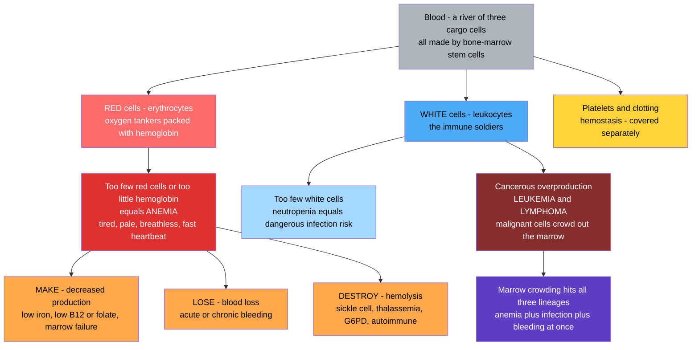

# 🩸 Hematologic Disorders and Anemia

> [!abstract] TL;DR
> Blood is a river carrying three kinds of cargo cells made in the bone marrow: **red cells** (oxygen tankers, powered by **hemoglobin**), **white cells** (immune soldiers), and **platelets** (clotting, covered separately). **Anemia** — the world's most common blood disorder — is simply too few red cells or too little hemoglobin, so tissues run short of oxygen and the person feels tired, pale, and breathless. Anemia arises three ways by the **make–lose–destroy** logic: failing to **build** red cells (missing iron, B12, or folate, or a failing marrow), **losing** them (bleeding), or **destroying** them too fast (hemolysis). White-cell disorders swing the other way — too few (infection risk) or a cancerous overproduction of useless malignant cells that crowd out the marrow: the **leukemias** and **lymphomas**. Because blood reflects nutrition, bleeding, chronic disease, and cancer everywhere in the body, the **complete blood count (CBC)** is medicine's most-ordered and most informative test.
>
> *Educational pathophysiology at textbook level — not individual clinical advice.*

---

## Intuition

**Analogy first:** Picture your blood as a **river carrying three kinds of cargo cells**, and imagine disease striking each in turn. The **red blood cells are oxygen tankers** — every one is packed with **hemoglobin**, the iron-rich pigment that binds oxygen at the lungs and unloads it in the tissues. **Anemia is simply having too small a delivery fleet** (or tankers carrying too little pigment): oxygen delivery drops, and the whole body feels it as fatigue, pallor, and breathlessness, with the heart racing to pump the thinned cargo faster.

A delivery fleet can shrink for only three reasons, and this is the entire logic of anemia — **make, lose, or destroy**. Either the shipyard is **not building enough tankers** (no iron for the hulls, no B12 or folate for assembly, or a broken bone-marrow factory), the tankers are **being lost** off the route (bleeding), or they are **being destroyed** faster than they can be replaced (hemolysis). Every anemia in medicine is one of these three stories, and a single lab number — the average **red-cell size (MCV)** — usually tells you which.

The **white blood cells are the soldiers**, and their disorders swing between two opposite failures: **too few** (immunodeficiency — the body cannot fight infection) or a **cancerous overproduction** in which the factory churns out useless malignant white cells that pile up and crowd everything else out — the **leukemias** and **lymphomas**, cancers of the blood and immune system. Understand the three cargo types and the make-lose-destroy logic of the tankers, and the blood's disorders snap into focus — and because the blood mirrors the whole organism, one cheap blood count becomes a window into nutrition, bleeding, chronic illness, and cancer at once.

---

## How It Works

### Core Mechanics

All blood cells descend from a single **hematopoietic stem cell (HSC)** in the bone marrow, which divides and differentiates down three lineages — a process called **hematopoiesis**.

1. **The red lineage (erythrocytes).** HSCs mature into red cells under the hormone **erythropoietin (EPO)**, secreted by the kidney when it senses low oxygen. A mature red cell is a biconcave, nucleus-free bag of **hemoglobin** — four globin chains, each cradling an iron-containing **heme** that reversibly binds oxygen. Red cells live ~120 days, then are cleared by the spleen and recycled.
2. **The white lineage (leukocytes).** The same HSC feeds the myeloid branch (neutrophils, monocytes/macrophages, eosinophils, basophils) and the lymphoid branch (B cells, T cells, NK cells) — the immune defenders.
3. **Platelets** bud from megakaryocytes to plug damaged vessels — the clotting system, treated in the hemostasis sibling note.
4. **Anemia is a supply-demand failure of oxygen.** When red-cell mass or hemoglobin falls, oxygen-carrying capacity drops. The body compensates by raising cardiac output (tachycardia, wider pulse pressure) and shifting hemoglobin's oxygen affinity, but past a point, tissues go hypoxic — hence fatigue, pallor, and exertional breathlessness.
5. **The make–lose–destroy triage.** Every anemia is (1) **decreased production** (missing iron/B12/folate or a failing marrow), (2) **blood loss**, or (3) **hemolysis** (increased destruction). Two cheap lab clues resolve which: the **MCV** (average red-cell size — micro/normo/macrocytic) and the **reticulocyte count** (are young red cells pouring out, signalling the marrow is trying to compensate, or not?).
6. **White-cell malignancy.** When a myeloid or lymphoid progenitor acquires driver mutations, it proliferates uncontrollably — a **leukemia** (marrow/blood) or **lymphoma** (lymph nodes/lymphoid tissue). The malignant clone crowds out normal hematopoiesis, so patients paradoxically develop **anemia** (too few red cells), **infection** (too few functional white cells), and **bleeding** (too few platelets) all at once.

### Flow / Architecture



---

## Key Concepts

### Secondary Level

**Blood carries three kinds of cell.** Red cells carry oxygen (using hemoglobin), white cells fight infection, and platelets stop bleeding. All three are made in the **bone marrow**, the soft factory inside your bones.

**Anemia = not enough working red cells or hemoglobin.** Because red cells deliver oxygen, anemia starves tissues of oxygen. The classic signs follow directly:

- **Fatigue and weakness** — muscles and brain are short of oxygen.
- **Pallor** — pale skin, gums, and inner eyelids, because there is less red pigment.
- **Breathlessness (dyspnea)** on exertion, and a **fast heartbeat (tachycardia)** — the heart and lungs work harder to compensate.

**The three ways to become anemic — make, lose, or destroy:**

| Route | What goes wrong | Everyday example |
|---|---|---|
| **MAKE** (underproduction) | Marrow cannot build enough red cells | Not enough **iron** in the diet (the world's #1 cause) |
| **LOSE** (blood loss) | Red cells leak out of the body | A bleeding ulcer, heavy periods, an injury |
| **DESTROY** (hemolysis) | Red cells are broken apart too early | **Sickle cell disease**, an inherited faulty hemoglobin |

**The complete blood count (CBC)** is a cheap, routine test that counts all three cell types. It is medicine's most-ordered test because it screens for anemia, infection, bleeding tendency, and blood cancer all at once — a quick window into the whole body.

**Blood cancers exist too.** When white-cell production goes cancerous, the marrow churns out useless malignant white cells: this is **leukemia** (in the blood and marrow) or **lymphoma** (in the lymph nodes). Because the cancer crowds the marrow, patients often become anemic and infection-prone at the same time.

### Undergraduate Level

**The two-axis classification of anemia.** Rather than memorize dozens of causes, clinicians triage anemia along two cheap, orthogonal lab axes:

1. **Cell size — the MCV (mean corpuscular volume)**, in femtoliters:
   - **Microcytic** (MCV < 80 fL) — small, pale cells. Chiefly **iron deficiency** and **thalassemia** (both are hemoglobin-synthesis problems; small cells because there is too little hemoglobin to fill them).
   - **Normocytic** (MCV 80–100 fL) — normal-sized cells. Acute **blood loss**, **anemia of chronic disease**, most **hemolysis**, early marrow failure.
   - **Macrocytic** (MCV > 100 fL) — large cells. **B12 or folate deficiency** (megaloblastic — impaired DNA synthesis makes cells grow large but divide poorly), also liver disease and alcohol.
2. **Marrow response — the reticulocyte count** (young red cells): a **high** count means the marrow is working hard, so the problem is loss or destruction (make is intact); a **low** count means the marrow itself is failing to produce.

**Decreased production (MAKE) in detail:**

- **Iron-deficiency anemia** — the single commonest anemia worldwide. Iron is needed to build heme; without it, cells are microcytic and hypochromic. Causes: poor intake, increased need (pregnancy, growth), malabsorption, and — critically in adults — **chronic blood loss** (a bleeding GI lesion until proven otherwise). Iron deficiency is a *sign to investigate*, not just a number to correct.
- **B12 and folate deficiency (megaloblastic/macrocytic)** — both vitamins are cofactors for DNA synthesis, so their lack impairs the rapid division red-cell precursors need. B12 deficiency additionally causes neurological damage (subacute combined degeneration) and often stems from **pernicious anemia** (autoimmune loss of intrinsic factor, needed to absorb B12).
- **Anemia of chronic disease (of inflammation)** — chronic infection, autoimmunity, or cancer drives **hepcidin**, which locks iron away from the marrow. Usually normocytic; iron stores are actually full but unavailable.
- **Bone-marrow failure** — **aplastic anemia** (immune destruction or toxic wipeout of stem cells → *pancytopenia*, all three lineages fall) or **marrow infiltration** (leukemia, metastatic cancer, fibrosis crowding out normal production).

**Blood loss (LOSE):** *Acute* hemorrhage causes normocytic anemia and, if severe, hypovolemic shock; *chronic* slow bleeding (e.g. a colonic tumor, menstrual loss) eventually depletes iron and converts to a microcytic iron-deficiency picture.

**Hemolysis (DESTROY):** red cells destroyed faster than the ~120-day norm; the marrow responds with a high reticulocyte count, and breakdown products rise (indirect bilirubin → jaundice, LDH up, haptoglobin down).

| Hemolytic anemia | Inherited or acquired | Mechanism |
|---|---|---|
| **Sickle cell disease** | Inherited | A single beta-globin mutation makes HbS polymerize when deoxygenated, deforming cells into rigid sickles that hemolyze and occlude vessels (painful crises) |
| **Thalassemia** | Inherited | Reduced/absent globin-chain synthesis → ineffective erythropoiesis + hemolysis; microcytic |
| **G6PD deficiency** | Inherited (X-linked) | Enzyme deficit leaves red cells unable to handle oxidative stress → episodic hemolysis (infection, fava beans, certain drugs) |
| **Hereditary spherocytosis** | Inherited | Membrane-skeleton defect → spherical cells trapped and destroyed by the spleen |
| **Autoimmune hemolytic anemia** | Acquired | Antibodies coat red cells → splenic/complement destruction |
| **Mechanical / microangiopathic** | Acquired | Cells sheared apart (prosthetic valve, DIC, TTP/HUS) → schistocytes on smear |

**White-cell and marrow disorders.** The mirror image of anemia is malignant *over*production:

- **Leukemias** — malignant proliferation of white cells filling marrow and blood, classified on two axes: **acute vs chronic** (blast-driven and rapidly fatal if untreated vs indolent, more mature cells) and **myeloid vs lymphoid** (lineage of origin). The four archetypes: **AML, ALL** (acute), **CML, CLL** (chronic). Marrow crowding produces the lethal triad — **anemia, infection, and bleeding**.
- **Lymphomas** — solid malignancies of lymphoid tissue (lymph nodes), split into **Hodgkin** (Reed-Sternberg cells, orderly contiguous spread, highly curable) and the diverse **non-Hodgkin** lymphomas.
- **Multiple myeloma** — malignant **plasma cells** flooding the marrow, producing monoclonal antibody (M-protein) and causing bone lesions, hypercalcemia, renal failure, and anemia (the "CRAB" features).
- **Myeloproliferative and myelodysplastic disorders** — clonal marrow diseases producing too many cells (polycythemia vera, essential thrombocythemia, myelofibrosis) or dysplastic, ineffective cells (MDS, a pre-leukemic state).

**Neutropenia and polycythemia** — the count extremes. **Neutropenia** (too few neutrophils, e.g. from chemotherapy) is a medical emergency because it opens the door to overwhelming infection. **Polycythemia** (too many red cells) thickens the blood and raises clot risk — either primary (polycythemia vera, a *JAK2* mutation) or secondary (chronic hypoxia or EPO excess driving compensatory overproduction).

### Graduate Level

**Iron homeostasis and hepcidin — the master switch.** The body has no regulated route to *excrete* iron, so total-body iron is controlled entirely at **absorption**, governed by the hepatic hormone **hepcidin**. Hepcidin binds and degrades ferroportin (the exporter on enterocytes and macrophages), trapping iron inside cells. Inflammation (via IL-6) raises hepcidin — explaining **anemia of chronic disease** (iron sequestered despite full stores) — while iron deficiency and active erythropoiesis (via erythroferrone) suppress it. This axis unifies iron-deficiency, inflammation, and iron-overload (hemochromatosis, where hepcidin fails) into one regulatory circuit.

**The oxygen-hemoglobin dissociation curve and compensation.** Hemoglobin's sigmoidal O2-binding curve (cooperative binding across four subunits) lets it load fully at the lung and unload steeply in tissues. In anemia, tissue hypoxia raises **2,3-BPG**, right-shifting the curve to release more O2 per gram of hemoglobin — a molecular compensation layered atop the cardiac output rise. Chronic anemia is thus often surprisingly well tolerated if it develops slowly, whereas the same hemoglobin reached acutely (hemorrhage) is dangerous because compensation has no time to develop. The Python demo quantifies how oxygen delivery (DO2 = cardiac output x arterial O2 content) falls with hemoglobin and how a rising cardiac output partly rescues it.

**Ineffective erythropoiesis.** Not all production failure is aplasia. In **megaloblastic anemia**, **thalassemia**, and **MDS**, the marrow is *hypercellular* but precursors die before maturing (intramedullary hemolysis) — a paradox of a busy factory producing little useful output, marked by a low reticulocyte count despite marrow hyperplasia and by elevated LDH/bilirubin.

**Molecular basis of hematologic malignancy** — these are the cleanest examples of oncogenesis by defined lesions, tying hematology directly to cancer biology:

- **CML** — the **Philadelphia chromosome** t(9;22) fuses *BCR-ABL1* into a constitutively active tyrosine kinase; the drug **imatinib** blocks it and turned a fatal leukemia into a chronic condition (the paradigm of targeted therapy).
- **APML (a subtype of AML)** — t(15;17) *PML-RARA* blocks myeloid differentiation; **all-trans retinoic acid** forces the blasts to mature — differentiation therapy.
- **Follicular lymphoma** — t(14;18) places *BCL2* under the immunoglobulin enhancer, over-expressing an anti-apoptotic protein so cells refuse to die (evasion of apoptosis, a core cancer hallmark).
- **Polycythemia vera / myelofibrosis** — the *JAK2 V617F* mutation locks cytokine signalling on, driving lineage overproduction independent of EPO.

**The peripheral blood smear** remains a diagnostic microscope on systemic disease: hypochromic microcytes (iron deficiency), hypersegmented neutrophils and macro-ovalocytes (B12/folate), sickle cells, target cells (thalassemia, liver disease), spherocytes (hereditary or immune hemolysis), **schistocytes** (microangiopathic hemolysis — a red flag for TTP/HUS/DIC), and circulating **blasts** (acute leukemia). Modern hematology layers flow cytometry, cytogenetics, and molecular panels on top, but the smear still triages fastest.

**Why the CBC is medicine's most informative test.** Because hematopoiesis integrates nutrition (iron, B12, folate), chronic inflammation (hepcidin), organ function (renal EPO, hepatic clearance), marrow integrity, and clonal disease, a single automated count plus differential simultaneously screens for anemia, infection, immunosuppression, bleeding risk, and occult malignancy — which is why it is ordered more than any other lab and why the blood is often the first place systemic disease declares itself.

---

## Python Demo

```python
# Hematology, two views:
#   (a) ANEMIA CLASSIFICATION BY MCV x MECHANISM
#       Place common anemias on two axes: red-cell size (MCV, x) and the
#       make-lose-destroy cause (y). This is exactly the clinician's triage:
#       microcytic vs normocytic vs macrocytic, crossed with the mechanism.
#   (b) OXYGEN DELIVERY vs HEMOGLOBIN
#       Show how falling hemoglobin cuts oxygen-carrying capacity, and how a
#       compensatory rise in cardiac output partly rescues oxygen delivery.
import numpy as np
import matplotlib.pyplot as plt

fig, (axL, axR) = plt.subplots(1, 2, figsize=(15, 6))

# ---------------------------------------------------------------------------
# (a) Anemia classification: MCV (cell size) vs mechanism (make/lose/destroy)
# ---------------------------------------------------------------------------
# name, representative MCV (fL), mechanism bucket
anemias = [
    ("Iron deficiency",        72, "MAKE"),
    ("Thalassemia",            65, "DESTROY"),   # microcytic BUT hemolytic
    ("Anemia of chronic dz",   84, "MAKE"),
    ("Aplastic anemia",        96, "MAKE"),
    ("Acute blood loss",       90, "LOSE"),
    ("Chronic slow bleed",     76, "LOSE"),      # depletes iron -> microcytic
    ("Sickle cell disease",    90, "DESTROY"),
    ("G6PD deficiency",        88, "DESTROY"),
    ("Autoimmune hemolytic",  102, "DESTROY"),
    ("B12 deficiency",        115, "MAKE"),
    ("Folate deficiency",     118, "MAKE"),
]

mech_y     = {"MAKE": 3, "LOSE": 2, "DESTROY": 1}
mech_color = {"MAKE": "#f08c00", "LOSE": "#1c7ed6", "DESTROY": "#e03131"}

# Shade the three MCV size zones
axL.axvspan(50,  80, color="#ffe3e3", alpha=0.6)   # microcytic
axL.axvspan(80, 100, color="#ebfbee", alpha=0.6)   # normocytic
axL.axvspan(100,130, color="#e7f5ff", alpha=0.6)   # macrocytic
axL.axvline(80,  color="gray", ls="--", lw=1)
axL.axvline(100, color="gray", ls="--", lw=1)

rng = np.random.default_rng(0)
for name, mcv, mech in anemias:
    y = mech_y[mech] + rng.uniform(-0.18, 0.18)    # small jitter for legibility
    axL.scatter(mcv, y, s=140, color=mech_color[mech],
                edgecolor="black", zorder=3)
    axL.annotate(name, (mcv, y), textcoords="offset points",
                 xytext=(0, 10), ha="center", fontsize=8)

axL.text(65,  3.7, "MICROCYTIC\nMCV < 80", ha="center", fontsize=9, color="#c92a2a")
axL.text(90,  3.7, "NORMOCYTIC\n80 - 100", ha="center", fontsize=9, color="#2b8a3e")
axL.text(115, 3.7, "MACROCYTIC\nMCV > 100", ha="center", fontsize=9, color="#1864ab")

axL.set_yticks([1, 2, 3])
axL.set_yticklabels(["DESTROY\n(hemolysis)", "LOSE\n(bleeding)", "MAKE\n(underproduction)"])
axL.set_xlabel("Mean corpuscular volume  MCV  [fL]  -  red-cell size")
axL.set_ylabel("Mechanism  -  make / lose / destroy")
axL.set_title("Anemia Classification: Cell Size (MCV) vs Cause\n"
              "one lab number sorts most anemias; note size and cause are separate axes")
axL.set_xlim(55, 128)
axL.set_ylim(0.4, 4.0)
axL.grid(alpha=0.2, axis="x")

# ---------------------------------------------------------------------------
# (b) Oxygen delivery vs hemoglobin, with cardiac-output compensation
#   Arterial O2 content:  CaO2 = 1.34 * Hb * SaO2      [mL O2 per dL blood]
#   Oxygen delivery:      DO2  = CO * CaO2             [CO in dL/min]
# ---------------------------------------------------------------------------
Hb   = np.linspace(4, 16, 200)     # hemoglobin, g/dL (4 = severe, 15 = normal)
SaO2 = 0.98                        # arterial O2 saturation (fraction)
CaO2 = 1.34 * Hb * SaO2            # O2-carrying capacity, mL/dL

CO_base = 50.0                     # resting cardiac output = 5 L/min = 50 dL/min
# Compensation: below ~10 g/dL the heart raises output to defend delivery.
CO_comp = CO_base * np.maximum(1.0, 10.0 / Hb)     # rises as Hb falls
CO_comp = np.minimum(CO_comp, 2.2 * CO_base)       # capped at ~2.2x (high-output limit)

DO2_uncomp = CO_base * CaO2        # if the heart could NOT compensate
DO2_comp   = CO_comp * CaO2        # realistic: tachycardia / high output

axR.plot(Hb, DO2_uncomp, lw=2.5, color="#e03131",
         label="No compensation (fixed cardiac output)")
axR.plot(Hb, DO2_comp,   lw=2.5, color="#2b8a3e",
         label="With compensation (cardiac output rises)")
axR.axvline(15, color="gray", ls=":", lw=1.2)
axR.text(15, 300, " normal Hb", color="gray", fontsize=9, va="bottom")
axR.axvspan(4, 7, color="#ffe3e3", alpha=0.5)
axR.text(5.4, 1350, "severe\nanemia", ha="center", color="#c92a2a", fontsize=9)

axR.set_xlabel("Hemoglobin  [g/dL]")
axR.set_ylabel("Oxygen delivery  DO2  [mL O2 / min]")
axR.set_title("Falling Hemoglobin Cuts Oxygen Delivery\n"
              "a rising cardiac output partly rescues it - the price is tachycardia")
axR.legend(loc="upper left")
axR.grid(alpha=0.3)
axR.set_xlim(4, 16)
axR.set_ylim(0, 1500)

plt.tight_layout()
plt.show()

# ---------------------------------------------------------------------------
# Numeric takeaways
# ---------------------------------------------------------------------------
i_norm = np.argmin(np.abs(Hb - 15))
i_low  = np.argmin(np.abs(Hb - 6))
print(f"O2 content at Hb 15: {CaO2[i_norm]:5.1f} mL/dL   ->  DO2 {DO2_uncomp[i_norm]:6.0f} mL/min")
print(f"O2 content at Hb  6: {CaO2[i_low]:5.1f} mL/dL   ->  DO2 {DO2_uncomp[i_low]:6.0f} mL/min (no comp)")
print(f"With cardiac-output compensation at Hb 6: DO2 {DO2_comp[i_low]:6.0f} mL/min "
      f"({DO2_comp[i_low]/DO2_uncomp[i_low]:.1f}x rescue)")
```

The **left panel** reproduces the clinician's core triage: sort anemias by **red-cell size (MCV)** into microcytic / normocytic / macrocytic, then cross that with the **make-lose-destroy** mechanism. Notice the teaching point that *size and cause are independent axes* — thalassemia is microcytic yet hemolytic, and a chronic slow bleed migrates from normocytic toward microcytic as it depletes iron. The **right panel** shows why anemia is a whole-body oxygen problem: arterial oxygen content falls almost linearly with hemoglobin, so uncompensated oxygen delivery collapses — but a rising cardiac output (felt as the tachycardia and breathlessness of the anemic patient) partly rescues delivery, which is precisely why slowly developing anemia is tolerated while an equally low hemoglobin from acute hemorrhage is dangerous.

---

## Real-World Applications

> **Iron-deficiency anemia as a diagnostic signpost.** A microcytic anemia with low ferritin in an adult is rarely just "eat more spinach." In a post-menopausal patient or older man it is treated as **occult gastrointestinal bleeding until proven otherwise**, triggering endoscopy to find an ulcer or colon cancer. The anemia is the *messenger*; the CBC's power is that a routine count uncovers a silent tumor before it declares itself. This is why iron deficiency is investigated, not merely supplemented.

> **The CBC and blood smear as medicine's front-line screen.** A single automated count plus differential simultaneously flags anemia, an elevated or suppressed white count, and low platelets. Circulating **blasts** on the smear can be the first sign of acute leukemia; **schistocytes** flag a microangiopathic emergency (TTP/HUS/DIC); **hypersegmented neutrophils** point to B12/folate deficiency. No other test so cheaply surveys nutrition, infection, bleeding, and malignancy at once.

> **Imatinib and CML — hematology as the birthplace of targeted cancer therapy.** Chronic myeloid leukemia is driven in >95% of cases by the *BCR-ABL1* fusion tyrosine kinase. The drug imatinib, designed to block exactly that kinase, converted a uniformly fatal leukemia into a chronic, manageable condition — the proof-of-concept that reading a cancer's precise molecular lesion enables precise, low-toxicity treatment.

> **Erythropoietin from bench to clinic.** The kidney's oxygen sensor secretes EPO to drive red-cell production; its failure explains the **anemia of chronic kidney disease**. Recombinant EPO reverses that anemia — and, notoriously, is abused as a performance-enhancing agent in endurance sport precisely because it raises oxygen-carrying capacity. The same molecule illustrates physiology, disease, therapy, and doping.

> **Newborn screening and sickle cell disease.** Because a single beta-globin point mutation causes sickle cell disease, it can be detected at birth by hemoglobin electrophoresis. Universal newborn screening plus early prophylaxis (penicillin, vaccination, hydroxyurea) has dramatically cut childhood mortality — a direct clinical payoff of understanding a hemolytic anemia at the molecular level.

---

## Common Pitfalls

- **"Anemia is a diagnosis."** It is a *finding*, never a final answer. The clinical work is identifying the make-lose-destroy mechanism — treating the number without finding the bleeding colon cancer behind an iron deficiency can be fatal.
- **"Just give iron for any anemia."** Iron helps only iron-deficiency anemia. Given blindly it does nothing for B12/folate deficiency, hemolysis, or marrow failure — and in conditions of iron overload or ineffective erythropoiesis (thalassemia) it can be actively harmful.
- **"MCV tells you the mechanism."** MCV tells you cell *size*, which correlates with but does not equal cause. Thalassemia is microcytic yet hemolytic; a chronic bleed starts normocytic and only later turns microcytic. Always pair MCV with the **reticulocyte count** to separate production failure from loss/destruction.
- **"Normal hemoglobin in a bleeding patient means no significant loss."** In *acute* hemorrhage, hemoglobin concentration lags because plasma and red cells are lost together; the number falls only after fluid shifts or resuscitation dilute the blood. Judge acute bleeding by vital signs and volume, not the initial hemoglobin.
- **"A high white-cell count means infection."** It usually does — but a very high count of abnormal or immature cells (blasts) signals **leukemia**, not infection. The differential and smear, not just the total, make the distinction.
- **"Anemia of chronic disease is iron deficiency."** Both can be microcytic, but their iron stores are opposite: depleted in true deficiency, *full but locked away* (high hepcidin) in chronic disease. Giving iron in the latter does not help and feeds inflammation.
- **"Blood cancers only cause high counts."** Leukemia and marrow infiltration frequently present with **low** counts — anemia, neutropenia, and thrombocytopenia together (pancytopenia) — because the malignant clone crowds out normal production. Unexplained pancytopenia demands a marrow examination.

---

## Related Concepts

This note sits in *05 Immune, Infectious and Hematologic* and interlocks with several sibling notes (referenced in prose, as house style keeps same-vault siblings unlinked). Platelets and the clotting cascade — the third cargo cell and the machinery for stopping bleeding — are treated in **Hemostasis, Thrombosis and Bleeding Disorders**, the natural companion to this note. Because a low white-cell count opens the door to overwhelming infection, and because malignant white cells are dysfunctional, hematology connects tightly to **Infectious Disease and Host-Pathogen Interaction**. The nutritional causes of anemia (iron, B12, folate) bridge to **Nutritional and Metabolic Disorders**, while the biology of the leukemias, lymphomas, and myeloma — clonal proliferation, driver mutations, marrow crowding — is the hematologic instance of the general principles in **Neoplasia and Cancer Biology**. The inherited hemolytic anemias (sickle cell, thalassemia, G6PD) are worked examples for **Genetic and Congenital Disease**.

Cross-vault links (Glob-verified):

- [[The_Circulatory_and_Respiratory_Systems]] (Biology/09) — the normal physiology of blood, hemoglobin, and oxygen transport that anemia disrupts.
- [[Stem_Cells_and_Differentiation]] (Biology/06) — hematopoietic stem cells and lineage differentiation are the factory whose failure or malignancy underlies these disorders.
- [[Micronutrients_Vitamins_and_Minerals]] (Health/02) — iron, B12, and folate: the raw materials whose deficiency causes the commonest anemias.
- [[Mendelian_Genetic_Disorders]] (Genetics/05) — sickle cell disease and thalassemia as classic single-gene hemoglobinopathies.
- [[Cancer_and_the_Cell_Cycle]] (Biology/06) — the cell-cycle dysregulation behind the malignant overproduction of leukemia and lymphoma.
- [[The_Innate_Immune_System]] (Biology/11) — neutrophils and the frontline defense whose depletion (neutropenia) turns into life-threatening infection.
- [[The_Adaptive_Immune_System]] (Biology/11) — B and T lymphocytes, the cells that go malignant in the lymphoid leukemias and lymphomas.
- [[Protein_Structure_and_Function]] (Chemistry/06) — hemoglobin's quaternary structure and cooperative oxygen binding, and how a single mutation (HbS) corrupts it.
- [[Cancer_Genetics_and_Oncogenes]] (Genetics/05) — the driver lesions (BCR-ABL1, JAK2, BCL2 translocations) behind hematologic malignancy.

---

## Review Questions

1. **(Secondary)** A teenager is tired, pale, and short of breath climbing stairs, and a blood test shows low hemoglobin with small red cells. (a) What is this condition called, and which cargo cell is affected? (b) Name the three broad ways this can happen (the make-lose-destroy framework). (c) Given the *small* red cells and that this is the world's commonest cause, which nutrient is most likely missing, and why would heavy menstrual bleeding contribute?

2. **(Undergraduate)** Two patients both have a hemoglobin of 9 g/dL. Patient A has an MCV of 70 fL with a low reticulocyte count; Patient B has an MCV of 105 fL with a high reticulocyte count and jaundice. (a) Classify each anemia by size and by the make-lose-destroy mechanism. (b) What single additional lab (already given) let you tell a production problem from a destruction problem, and how? (c) For Patient A, why is finding the *cause* of iron deficiency more important than simply prescribing iron?

3. **(Graduate)** A patient presents with fatigue, recurrent infections, easy bruising, and a blood count showing anemia, neutropenia, and thrombocytopenia (pancytopenia), with circulating blasts on the smear. (a) Explain mechanistically how a single malignant white-cell clone produces failure across all three blood lineages at once. (b) Using the oxygen-delivery relationship DO2 = cardiac output x arterial O2 content, explain why this patient tolerates a hemoglobin that would cause collapse if it fell acutely from hemorrhage. (c) If cytogenetics reveal a *BCR-ABL1* fusion, name the class of drug this predicts a response to and explain why hematologic cancers were the proving ground for such targeted therapy.

---

## Sources

- Kumar, V., Abbas, A. K., & Aster, J. C. *Robbins & Cotran Pathologic Basis of Disease* (10th ed.), Chapters 14 (Red Blood Cell and Bleeding Disorders) and 13 (White Cell, Lymph Node, and Spleen Disorders). Elsevier.
- Kaushansky, K., Lichtman, M. A., Prchal, J. T., et al. *Williams Hematology* (10th ed.) / Hoffman, R. et al. *Hematology: Basic Principles and Practice* (8th ed.). Elsevier.
- Loscalzo, J., Fauci, A., Kasper, D., et al. *Harrison's Principles of Internal Medicine* (21st ed.), sections on Anemia, the Leukemias, and Lymphomas. McGraw-Hill.
- World Health Organization. "Haemoglobin concentrations for the diagnosis of anaemia and assessment of severity." WHO/NMH/NHD/MNM/11.1. https://www.who.int/publications/i/item/WHO-NMH-NHD-MNM-11.1
- Camaschella, C. (2015). "Iron-Deficiency Anemia." *New England Journal of Medicine*, 372(19), 1832-1843. https://www.nejm.org/doi/full/10.1056/NEJMra1401038

---

#clinical-medicine #anemia #hematology #leukemia #blood-disorders
