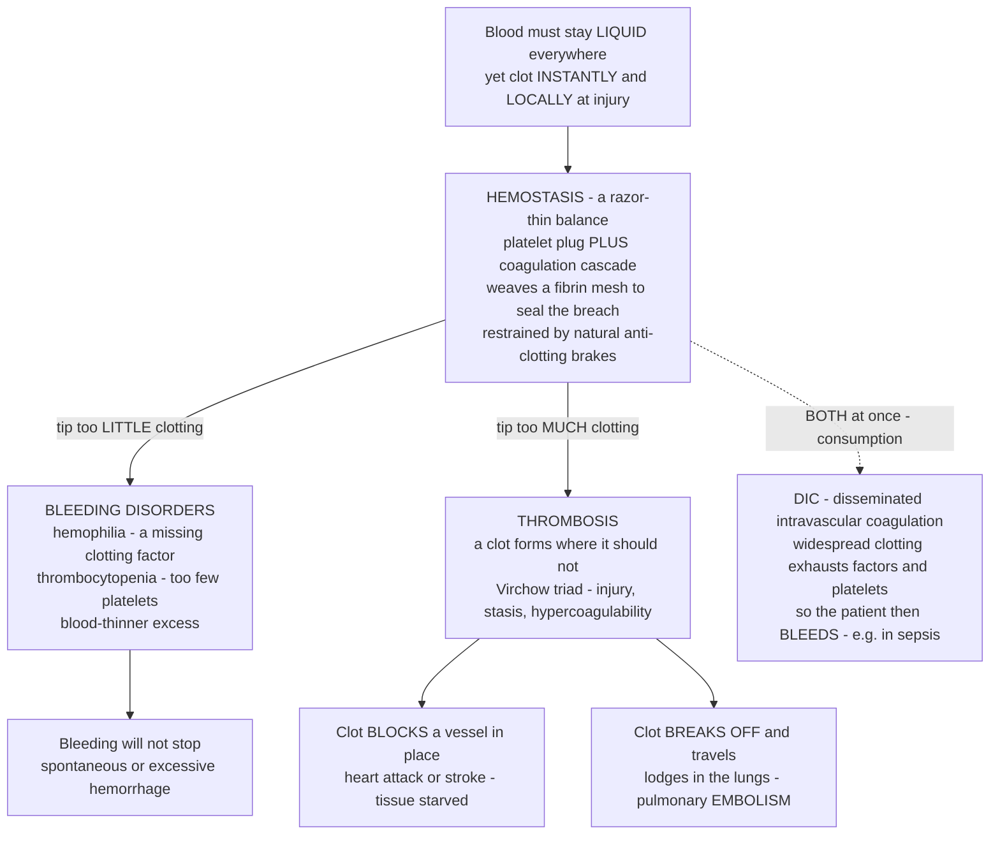

# 🩸 Hemostasis, Thrombosis, and Bleeding Disorders

> [!abstract] TL;DR
> Your blood must perform an exquisite balancing act: stay **liquid and flowing** everywhere, yet **clot instantly and locally** the moment a vessel is breached — and *not a moment before or anywhere else*. This is **hemostasis**, and it rides a knife-edge between two catastrophes. Tip too far toward **bleeding** (clotting too little) and a minor cut won't stop — or you bleed spontaneously, as in **hemophilia** (an inherited lack of a clotting factor) or **thrombocytopenia** (too few platelets). Tip too far toward **clotting** (too much) and you form clots where you shouldn't — a **thrombosis** — which can plug a vessel and starve tissue (the clot behind most heart attacks and strokes) or break off and travel to lodge in the lungs (a **pulmonary embolism**). The machinery is a tightly controlled two-stage response: **platelets** rush to plug the hole (*primary hemostasis*) while a **coagulation cascade** of clotting factors amplifies explosively to weave a **fibrin** mesh that seals it (*secondary hemostasis*), all restrained by natural **anti-clotting brakes** (antithrombin, protein C/S) and dissolved afterward by **fibrinolysis**. Disease is any tip of this balance, and much of modern medicine is the deliberate nudging of it with **blood thinners**. Understanding hemostasis as a razor-thin equilibrium between bleeding and clotting unlocks an enormous range of life-threatening conditions — from hemophilia to deep vein thrombosis to the paradoxical bleeding-and-clotting of sepsis-driven **DIC**.

---

## Intuition

**Analogy — a dam wall that must patch its own leaks in seconds, without ever silting up the reservoir.** Picture a vast reservoir held behind a wall, with water that must stay perfectly fluid and free-flowing so it reaches every field downstream. The wall inevitably springs small leaks. A good system does something remarkable: the instant a crack appears, workers rush *only to that crack*, throw in sandbags, and pour fast-setting concrete to seal it — then stop, precisely there, and dissolve any excess so the channel never clogs. Two things can go catastrophically wrong. If the repair crew is missing or too small, a leak keeps gushing and the reservoir drains — that is **bleeding**. If the crew is trigger-happy and pours concrete into the *open channel* where there was no leak at all, it dams the flow and the fields downstream go dry — that is **thrombosis**, and a chunk of that stray concrete can float downstream and jam a distant sluice gate — an **embolism**.

Blood faces exactly this problem. It must be liquid in every healthy vessel yet solid within seconds at a wound. Its "repair crew" comes in two waves: **platelets** (tiny cell fragments) that swarm and clump to form an immediate plug, and a **cascade of clotting factors** — a chain reaction that amplifies a tiny trigger into an explosive burst of the enzyme **thrombin**, which spins liquid fibrinogen into a tough **fibrin** mesh reinforcing the plug. Crucially, the whole thing is held in check by natural **brakes** that confine clotting to the injury and switch it off elsewhere, plus a demolition system (**fibrinolysis**) that dissolves the clot once the wall has healed. Every disease in this note is one of two failures of that balance: **too little** repair (hemophilia, low or faulty platelets, blood-thinner overdose) causing dangerous hemorrhage, or **too much / misplaced** repair (thrombosis) causing the clots behind heart attacks, strokes, and fatal pulmonary emboli. Hold onto that single image — a knife-edge between bleeding and clotting — and the rest is detail.

---

## How It Works

### Primary hemostasis — the platelet plug

Every vessel is lined by a smooth, non-stick **endothelium** that actively *discourages* clotting. When it is torn, the underlying **collagen** and a large sticky protein called **von Willebrand factor (vWF)** are exposed. Platelets flowing past **adhere** to vWF (like sandbags catching on a snag), then **activate** — changing shape, releasing granules full of signaling molecules (ADP, thromboxane A2) that recruit and prime more platelets — and finally **aggregate**, cross-linking to one another through fibrinogen bridges into a soft, provisional **platelet plug**. This first wave stops the bleeding of small vessels within seconds to minutes, but the plug is fragile and needs reinforcement.

### Secondary hemostasis — the coagulation cascade

Reinforcement comes from the **coagulation cascade**: a relay of circulating clotting **factors** (proteins, mostly made by the liver, several requiring **vitamin K**) that activate one another in sequence, each step amplifying the last. Classically it is drawn as two arms feeding a shared finale:

- The **extrinsic (tissue factor) pathway** — the true physiological trigger — fires when injured tissue exposes **tissue factor**, activating factor VII. Measured clinically by the **PT/INR**.
- The **intrinsic (contact) pathway** — factors XII, XI, IX, and VIII — amplifies the response. Measured by the **aPTT**. (Hemophilia lives here: factors **VIII** and **IX**.)
- Both converge on the **common pathway**: factor X activation, then the explosive generation of **thrombin** (factor IIa), which converts soluble **fibrinogen** into insoluble **fibrin** strands that are cross-linked into a stable mesh trapping platelets and red cells — the mature clot.

The defining feature is **amplification**: a minute initiating stimulus is turned into a massive **thrombin burst** because thrombin feeds back to activate factors V, VIII, and XI (and more platelets), driving its own production. That is why clotting is fast and near-explosive — and why losing even one amplifying factor, as in hemophilia, blunts the whole burst.

### The brakes — anticoagulation and fibrinolysis

Left unchecked, this positive feedback would clot the entire vascular tree. It is confined by natural **anticoagulants**: **antithrombin** (inactivates thrombin and factor Xa; the target of heparin), and the **protein C / protein S** system (switches off factors V and VIII). Once the wall has healed, the clot is dismantled by **fibrinolysis**: the enzyme **plasmin** (generated from plasminogen by tPA) digests fibrin back into soluble fragments (measured as **D-dimer**). Healthy hemostasis is the *dynamic balance* of all four forces — platelets, cascade, brakes, and demolition.

### Tipping the balance — the two families of disease



*Read the center box as the equilibrium. Slide left and you get hemorrhage; slide right and you get pathological clots that either block in place or embolize. The dashed branch — DIC — is the cruel special case where the system does both at once.*

---

## Key Concepts

### Secondary (intuitive)

- **Hemostasis** = the body's leak-repair system: stop bleeding fast at a wound, but keep blood liquid everywhere else.
- **Two waves of repair.** First **platelets** clump into a soft plug; then a **cascade** of clotting factors builds a tough **fibrin** mesh to reinforce it.
- **Bleeding disorders** = the repair is too weak. Missing a factor (**hemophilia**) or too few platelets (**thrombocytopenia**) means cuts won't stop and bruises appear for no reason.
- **Thrombosis** = the repair fires where it shouldn't, forming a **clot** inside an open vessel. Block a heart or brain artery and you get a **heart attack** or **stroke**.
- **Embolism** = a piece of clot breaks off and floats downstream to jam a distant vessel — classically a **pulmonary embolism** in the lungs.
- **Blood thinners** = medicines that deliberately weaken clotting to prevent thrombosis — but push too far and they cause bleeding. It's a balance.

### Undergraduate (formal)

- **Primary hemostasis** (platelets): **adhesion** via von Willebrand factor to exposed collagen → **activation** and granule release (ADP, thromboxane) → **aggregation** into a platelet plug. Defects give a **mucocutaneous** bleeding pattern.
- **Secondary hemostasis** (cascade): extrinsic (tissue factor / VII, → **PT/INR**) and intrinsic (XII, XI, IX, VIII, → **aPTT**) pathways converge on the common pathway (X → **thrombin** → **fibrinogen to fibrin**). Defects give a **deep / joint** bleeding pattern.
- **Counter-regulation:** **antithrombin** and the **protein C/S** system restrain clotting; **plasmin**-driven **fibrinolysis** dissolves it (**D-dimer** = a breakdown product).
- **Clinical bleeding patterns.** *Platelet / vWF problems* → **petechiae**, mucosal bleeds, easy bruising. *Coagulation-factor problems* → deep muscle and **joint bleeds (hemarthroses)**, delayed rebleeding. This split is a high-yield diagnostic clue.
- **Hemophilia A/B** = X-linked recessive deficiency of factor **VIII** (A) or **IX** (B); prolonged **aPTT**, normal PT and platelets. **von Willebrand disease** = the commonest inherited bleeding disorder, impairing both platelet adhesion and factor VIII stability.
- **Thrombosis and Virchow's triad:** pathological clots arise from **endothelial injury**, **stasis** (sluggish flow), and **hypercoagulability**. **Arterial** thrombi (platelet-rich, on ruptured plaques) → MI/stroke; **venous** thrombi (fibrin-rich, in stagnant veins) → **DVT → pulmonary embolism**.
- **Coagulation tests:** **PT/INR** (extrinsic + common), **aPTT** (intrinsic + common), and **platelet count** localize the defect; a prolonged PT *and* aPTT with low platelets and high D-dimer suggests **DIC**.

### Graduate (mechanistic and systems)

- **The cell-based model of coagulation** supersedes the old "two waterfall arms." Coagulation is spatially organized on cell surfaces in three overlapping phases — **initiation** (tissue-factor-bearing cells make a trace of thrombin), **amplification** (that thrombin primes platelets and activates cofactors V, VIII, XI on the platelet surface), and **propagation** (a burst of thrombin on the activated-platelet membrane). The intrinsic/extrinsic split is a lab artifact of PT vs aPTT; in vivo the pathways are one integrated, surface-localized system.
- **Coagulation as a threshold/excitable system.** The thrombin-generation curve (the **thrombogram**) is a classic autocatalytic burst: a long lag, an explosive rise once positive feedback (thrombin → V, VIII, XI) outruns the antithrombin brake, then decay as substrate depletes. Hemophilia does not abolish clotting — it *blunts and delays the propagation burst*, which is why bleeding is delayed and from deep tissues rather than immediate oozing.
- **Endothelium as an active regulator.** Resting endothelium is antithrombotic (thrombomodulin activates protein C; heparan sulfate potentiates antithrombin; it makes prostacyclin, NO, and tPA). Inflammation flips it to a **prothrombotic** phenotype — the mechanistic bridge from **sepsis** and atherosclerosis to thrombosis, and the reason "endothelial injury" leads Virchow's triad.
- **Inherited thrombophilias.** **Factor V Leiden** (a point mutation making factor Va resistant to protein C cleavage) and the **prothrombin G20210A** variant tilt the equilibrium toward clotting; they raise venous-thrombosis risk multiplicatively when combined with acquired triggers (surgery, immobility, estrogen, pregnancy, cancer).
- **DIC as pathological consumption.** A systemic trigger (sepsis, obstetric emergency, malignancy) causes widespread tissue-factor exposure and microvascular clotting; this **consumes** platelets and factors faster than they are made and secondarily activates fibrinolysis — so the patient **clots and bleeds simultaneously**. It is a disorder of the balance itself, not of one arm.
- **Pharmacology as deliberate rebalancing.** **Antiplatelets** (aspirin → thromboxane; P2Y12 inhibitors → ADP) target arterial, platelet-rich thrombi. **Anticoagulants** (heparins potentiate antithrombin; warfarin blocks vitamin-K-dependent factor synthesis; **DOACs** directly inhibit thrombin or factor Xa) target venous, fibrin-rich thrombi. **Thrombolytics** (tPA) activate plasmin to dissolve an established clot. Every one trades reduced thrombosis for increased bleeding — a **therapeutic window** made explicit by the INR target for warfarin.

---

## Python Demo

```python
# Hemostasis as a razor-thin balance, in two pictures:
#   (a) THE CASCADE AS AN AMPLIFYING CHAIN REACTION. Coagulation is autocatalytic:
#       a tiny trigger seeds a trace of thrombin, thrombin feeds back to activate
#       more clotting factors (V, VIII, XI) -> an explosive THROMBIN BURST that
#       is then shut off by antithrombin/protein-C brakes as substrate depletes.
#       We simulate NORMAL vs HEMOPHILIA (reduced amplification -> a blunted,
#       delayed burst = bleeding) vs HYPERCOAGULABLE (extra amplification -> a
#       faster, larger burst = thrombosis risk).
#   (b) THE ANTICOAGULATION THERAPEUTIC WINDOW. As we push "blood-thinner
#       intensity" (e.g. warfarin INR) upward, THROMBOSIS risk falls but
#       BLEEDING risk rises. Their sum is U-shaped; the safe sweet spot between
#       the two catastrophes is the therapeutic window (INR ~2-3).
import numpy as np
import matplotlib.pyplot as plt

# ---------- (a) coagulation cascade: autocatalytic thrombin burst ----------
def thrombin_generation(k_amp, k_init=0.03, k_brake=1.4, trigger=0.05,
                        P0=1.0, dt=0.005, tmax=12.0):
    """Toy autocatalytic model of thrombin (T) generation from prothrombin (P).
    dT/dt = initiation + amplification(k_amp * T * P)  -  brake(k_brake * T)
    dP/dt = -(initiation + amplification)             (substrate consumed)
    """
    n = int(tmax / dt)
    t = np.linspace(0.0, tmax, n)
    T = np.zeros(n)
    P = np.full(n, P0)
    for i in range(1, n):
        gen = k_init * trigger + k_amp * T[i-1] * P[i-1]   # initiation + feedback
        T[i] = max(T[i-1] + dt * (gen - k_brake * T[i-1]), 0.0)
        P[i] = max(P[i-1] - dt * gen, 0.0)
    return t, T

t, T_norm  = thrombin_generation(k_amp=9.0)    # normal amplification
_, T_hemo  = thrombin_generation(k_amp=3.2)    # hemophilia: weak amplification
_, T_hyper = thrombin_generation(k_amp=15.0)   # hypercoagulable: extra amplification

peak_norm  = T_norm.max()
peak_hemo  = T_hemo.max()
t_peak_norm = t[np.argmax(T_norm)]
t_peak_hemo = t[np.argmax(T_hemo)]

# ---------- (b) anticoagulation: bleeding vs thrombosis therapeutic window ----------
inr = np.linspace(0.8, 6.0, 500)
thrombosis_risk = 100.0 / (1.0 + np.exp((inr - 2.3) * 2.4))   # falls as INR rises
bleeding_risk   = 100.0 / (1.0 + np.exp(-(inr - 3.9) * 2.4))  # rises as INR rises
total_risk      = thrombosis_risk + bleeding_risk            # U-shaped net harm
inr_best        = inr[np.argmin(total_risk)]

fig, (ax1, ax2) = plt.subplots(1, 2, figsize=(14, 5.5))

# --- panel (a) ---
ax1.plot(t, T_hyper, color="#8E44AD", lw=2.2, label="Hypercoagulable (faster, bigger burst)")
ax1.plot(t, T_norm,  color="#27AE60", lw=2.6, label="Normal hemostasis")
ax1.plot(t, T_hemo,  color="#C0392B", lw=2.2, label="Hemophilia (blunted, delayed)")
ax1.annotate("explosive\nthrombin burst", xy=(t_peak_norm, peak_norm),
             xytext=(t_peak_norm + 2.0, peak_norm * 0.95), fontsize=8.5,
             arrowprops=dict(arrowstyle="->", color="#1E8449"))
ax1.annotate("burst never\nfully develops\n= bleeding", xy=(t_peak_hemo, peak_hemo),
             xytext=(t_peak_hemo + 2.2, peak_hemo + 0.25 * peak_norm), fontsize=8.5,
             color="#922B21", arrowprops=dict(arrowstyle="->", color="#C0392B"))
ax1.set_xlabel("Time after injury (arbitrary units)")
ax1.set_ylabel("Thrombin generated (clotting drive)")
ax1.set_title("(a) The cascade is an amplifying chain reaction")
ax1.legend(loc="upper right", fontsize=8); ax1.grid(alpha=0.3)
ax1.set_xlim(0, 12)

# --- panel (b) ---
ax2.plot(inr, thrombosis_risk, color="#C0392B", lw=2.4, label="Thrombosis risk (too little)")
ax2.plot(inr, bleeding_risk,   color="#2980B9", lw=2.4, label="Bleeding risk (too much)")
ax2.plot(inr, total_risk,      color="#7F8C8D", lw=2.0, ls="--", label="Net adverse events")
ax2.axvspan(2.0, 3.0, color="#2ECC71", alpha=0.18)
ax2.text(2.5, 92, "therapeutic\nwindow", ha="center", fontsize=8.5, color="#1E8449")
ax2.axvline(inr_best, color="#1E8449", lw=1.0, alpha=0.7)
ax2.set_xlabel("Anticoagulation intensity  (e.g. warfarin INR)")
ax2.set_ylabel("Risk (arbitrary units)")
ax2.set_title("(b) Blood thinners: the bleeding-vs-clotting balance")
ax2.legend(loc="upper center", fontsize=8); ax2.grid(alpha=0.3)
ax2.set_xlim(0.8, 6.0); ax2.set_ylim(0, 105)

plt.tight_layout()
plt.show()

print(f"Normal thrombin peak    : {peak_norm:5.2f} at t = {t_peak_norm:4.1f}")
print(f"Hemophilia thrombin peak: {peak_hemo:5.2f} at t = {t_peak_hemo:4.1f}  "
      f"({100*peak_hemo/peak_norm:4.0f}% of normal, and later) -> delayed deep bleeding")
print(f"Safest anticoagulation intensity (min net harm): INR ~ {inr_best:.1f} "
      f"(inside the 2-3 therapeutic window)")
```

**What you see.** *Panel (a)* is the reason clotting is fast and near-explosive: because thrombin catalyzes its own production, a negligible trigger detonates into a **thrombin burst** (green) once positive feedback outruns the antithrombin brake — a textbook autocatalytic curve with a lag, a spike, and a shutdown. **Hemophilia** (red) doesn't switch clotting off; it *starves the amplification loop*, so the burst is **blunted and delayed** — which is exactly why hemophilic bleeding is deep, delayed, and prone to rebleed rather than a simple faster ooze. Nudge amplification the other way (purple) and the burst comes sooner and larger — the microscopic face of a **hypercoagulable**, thrombosis-prone state. *Panel (b)* is the therapeutic knife-edge: as blood-thinner intensity rises, **thrombosis risk falls but bleeding risk climbs**, and their sum is **U-shaped** — there is a **therapeutic window** (for warfarin, an INR around 2–3) where total harm is minimized. Dose below it and clots form; above it and the patient bleeds. Every anticoagulant decision in medicine is a search for the bottom of that valley.

---

## Real-World Applications

- **Venous thromboembolism (VTE) prevention.** Because Virchow's **stasis** dominates in immobilized patients, hospitals routinely give prophylactic **low-molecular-weight heparin** and use compression devices after surgery, during long illness, and in pregnancy — a direct, population-scale application of the triad to prevent **DVT** and fatal **pulmonary embolism**, one of the leading *preventable* causes of in-hospital death.
- **Managing anticoagulation.** Warfarin therapy is titrated to an **INR** target — the clinical embodiment of panel (b)'s therapeutic window — while newer **DOACs** (apixaban, rivaroxaban, dabigatran) hit factor Xa or thrombin directly with more predictable dosing. Bridging the bleeding-vs-clotting trade-off around surgery or after a stroke is everyday internal-medicine work.
- **Acute stroke and heart attack.** In an ischemic stroke or STEMI, a clot is *actively* blocking flow, so **thrombolytics (tPA)** are given to trigger plasmin and dissolve it, and **antiplatelets** (aspirin, P2Y12 inhibitors) are used to prevent re-clotting on a ruptured plaque — pharmacology deliberately pushing the balance toward dissolution under intense time pressure.
- **Hemophilia care.** Treatment replaces the missing factor (**factor VIII or IX concentrate**), with modern options including extended-half-life products, the bispecific antibody **emicizumab** that mimics factor VIII's cofactor role, and gene therapy that restores endogenous factor production — each restoring the amplification loop blunted in panel (a).
- **Point-of-care coagulation testing.** The **PT/INR**, **aPTT**, platelet count, fibrinogen, and **D-dimer** are ordered constantly to localize a bleeding defect, monitor blood thinners, and (with viscoelastic tests like TEG/ROTEM) guide massive-transfusion protocols in trauma and surgery.
- **Recognizing DIC.** In sepsis, obstetric catastrophe, or advanced cancer, clinicians watch for the ominous combination of **falling platelets, prolonged PT and aPTT, low fibrinogen, and rising D-dimer** — the laboratory fingerprint of consumptive coagulopathy — treating the trigger while supporting the exhausted balance.

---

## Common Pitfalls

- **Thinking hemophilia means blood "won't clot at all."** It clots — just too slowly and weakly (panel a). The hallmark is *delayed, deep* bleeding into joints and muscles and rebleeding after initial control, not the immediate mucosal oozing of a platelet problem. Confusing the two patterns sends the diagnostic workup in the wrong direction.
- **Confusing thrombus with embolus.** A **thrombus** forms and stays put; an **embolus** is a fragment that has broken off and lodged elsewhere. A DVT is a thrombus; the piece that travels to the lung is the embolus that kills. The distinction drives both the mechanism and the urgency.
- **Reading a normal PT/aPTT as "no bleeding risk."** Standard coagulation tests interrogate the **cascade**, not platelets or vessel walls. A patient with severe **thrombocytopenia**, platelet dysfunction, or von Willebrand disease can bleed dangerously with a perfectly normal PT and aPTT. Always pair the picture with a platelet count and a bleeding history.
- **Assuming more anticoagulation is safer.** Panel (b)'s U-shape is the correction: pushing INR ever higher does not keep reducing clots — it trades one catastrophe (thrombosis) for the other (hemorrhage). The goal is the *window*, not the extreme.
- **Missing the endothelial/inflammatory link.** Thrombosis is often taught as a pure "plumbing" clot, but inflamed endothelium (in sepsis or atherosclerosis) is what *initiates* it. Overlooking the endothelium hides the connection between infection, inflammation, and clotting — and the whole logic of DIC.
- **Reading this as medical advice.** This note describes hemostatic *mechanisms* at textbook level. It is not guidance for any individual's bleeding, clot, bruising, or blood-thinner dose — those require a clinician and the specifics of a real patient, and acute severe bleeding or a suspected pulmonary embolism is an emergency.

---

## Related Concepts

**Within the Clinical Medicine vault (prose references).** This note is the hematologic hinge of the vault, and it connects outward in every direction. It sits alongside a companion note on *Hematologic Disorders and Anemia*, which covers the red-cell and marrow-production side of blood that this note's platelet and factor story complements. Its clotting machinery is the missing mechanical link inside *Cardiovascular Pathophysiology*: the thrombus that turns a ruptured atherosclerotic plaque into a myocardial infarction or stroke is exactly the misplaced, arterial, platelet-rich clot described here. The consumptive coagulopathy of **DIC** is the shared endpoint with *Sepsis and Systemic Infection*, where inflamed endothelium and systemic tissue-factor exposure tip the balance into simultaneous clotting and bleeding. The *acquired* bleeding disorders reach into *Liver and Gastrointestinal Disease* — the liver synthesizes nearly every clotting factor, so liver failure and vitamin-K deficiency both produce a coagulopathy — and the *inherited* ones, above all X-linked hemophilia, connect to *Genetic and Congenital Disease*. These are prose references to sibling notes in the Clinical Medicine vault.

**Across the vault (Glob-verified links).**

- [[Clinical_Medicine/01_Foundations_of_Disease_and_Pathophysiology/Clinical_Medicine_and_Pathophysiology_Overview|Clinical Medicine and Pathophysiology Overview]] — the parent hub; frames disease as failed homeostasis, exactly the tipped balance between bleeding and clotting shown here.
- [[Biology/09_Human_Physiology_and_Anatomy/The_Circulatory_and_Respiratory_Systems|The Circulatory and Respiratory Systems]] — the healthy blood and vessels this note protects and, in disease, occludes; blood as a tissue of cells and plasma.
- [[Biology/11_Microbiology_and_Immunology/The_Innate_Immune_System|The Innate Immune System]] — inflammation and endothelial activation, the bridge that makes sepsis and atherosclerosis prothrombotic and drives DIC.
- [[Biology/01_Chemistry_of_Life/Proteins_and_Amino_Acids|Proteins and Amino Acids]] — clotting factors, fibrinogen, and von Willebrand factor are proteins; the fibrinogen-to-fibrin conversion is a protein structural change.
- [[Genetics/05_Human_and_Medical_Genetics/Mendelian_Genetic_Disorders|Mendelian Genetic Disorders]] — hemophilia A/B as the classic X-linked recessive single-gene disorder; also Factor V Leiden as an inherited thrombophilia.
- [[Genetics/04_Developmental_and_Epigenetic_Genetics/Genomic_Imprinting_and_X_Inactivation|Genomic Imprinting and X-Inactivation]] — why hemophilia strikes males and how X-inactivation explains variable expression in carrier females.
- [[Health_Nutrition_and_Longevity/02_Nutrition_Science/Micronutrients_Vitamins_and_Minerals|Micronutrients: Vitamins and Minerals]] — vitamin K, the cofactor required to synthesize functional clotting factors II, VII, IX, and X; its deficiency (and warfarin's blockade of it) causes bleeding.
- [[Systems_Thinking_and_Complexity/01_Foundations_of_Systems_Thinking/Feedback_Loops_and_Causality|Feedback Loops and Causality]] — the coagulation cascade as positive feedback (the thrombin burst) restrained by negative-feedback brakes; hemostasis as a controlled, balanced system.

---

## Review Questions

**Secondary.** Using the "dam wall that patches its own leaks" picture, explain in plain terms what goes wrong in a **bleeding disorder** versus a **thrombosis**, and what an **embolism** adds to the thrombosis story. Why is a **blood thinner** described as a balancing act rather than simply a "good" or "bad" drug?

**Undergraduate.** A patient bruises easily and has pinpoint skin spots (petechiae) and nosebleeds; a second patient has painful bleeding into the knee joints and a family history in males only. For each, state whether the defect is more likely in **primary** (platelet) or **secondary** (coagulation-factor) hemostasis, which lab test you would expect to be abnormal (platelet count, PT, or aPTT), and name a representative diagnosis. Explain the reasoning from the two-wave model of hemostasis.

**Graduate.** Explain, using the concepts of **autocatalytic amplification** and **counter-regulation**, why hemophilia produces *delayed, deep* bleeding rather than immediate oozing, and why coagulation behaves like a threshold/excitable system. Then contrast **arterial** and **venous** thrombosis in terms of clot composition, Virchow's triad, and which drug class (antiplatelet, anticoagulant, thrombolytic) each preferentially requires — and use the therapeutic-window idea to explain why "more anticoagulation" is not automatically safer.

---

## Sources

- Kumar, V., Abbas, A. K., & Aster, J. C. *Robbins & Cotran Pathologic Basis of Disease* (10th ed.). Elsevier — chapter on Hemodynamic Disorders, Thromboembolic Disease, and Shock (hemostasis, thrombosis, Virchow's triad, and DIC).
- Hoffman, R., Benz, E. J., Silberstein, L. E., et al. (eds.). *Hematology: Basic Principles and Practice* (7th ed.). Elsevier — normal hemostasis, bleeding disorders, and thrombosis.
- Loscalzo, J., Fauci, A., Kasper, D., et al. (eds.). *Harrison's Principles of Internal Medicine* (21st ed.). McGraw-Hill — sections on Bleeding and Thrombosis, hemophilia, thrombocytopenia, and antithrombotic therapy.
- Furie, B., & Furie, B. C. (2008). "Mechanisms of thrombus formation." *New England Journal of Medicine*, 359(9), 938–949 — the cell-based, cell-surface model of coagulation and thrombus formation.
- Hoffman, M., & Monroe, D. M. (2001). "A cell-based model of hemostasis." *Thrombosis and Haemostasis*, 85(6), 958–965 — initiation, amplification, and propagation of the thrombin burst.

---

#clinical-medicine #hemostasis #thrombosis #hemophilia #coagulation
