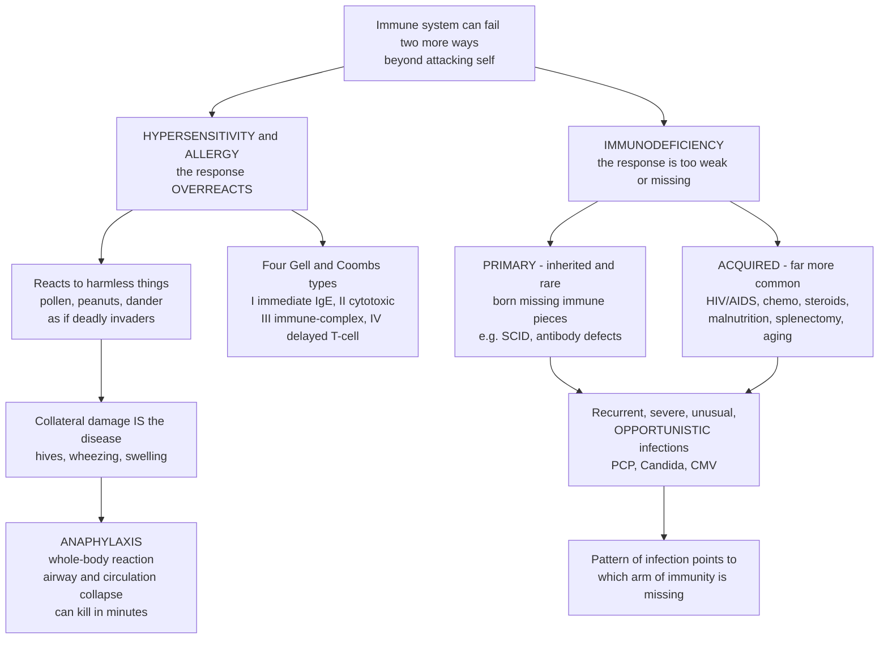

# 🤧 Hypersensitivity, Allergy, and Immunodeficiency

> [!abstract] TL;DR
> An immune system can fail by doing **too much** or **too little**. **Hypersensitivity** is the immune response *overreacting* — mounting an exaggerated, inappropriate attack whose **collateral damage becomes the disease**. Its four **Gell and Coombs types** are: **Type I** (immediate, IgE-mediated — classic **allergy** and life-threatening **anaphylaxis**, driven by mast-cell **histamine** release after prior **sensitization**), **Type II** (antibody-mediated cytotoxicity — transfusion reactions, hemolytic disease), **Type III** (immune-complex deposition — serum sickness, lupus nephritis), and **Type IV** (delayed, T-cell-mediated — contact dermatitis, the TB skin test, transplant rejection). **Immunodeficiency** is the opposite failure — the immune army too weak or missing pieces, so ordinary microbes turn dangerous. It is either **primary** (rare, inherited — e.g. **SCID**, antibody, complement, or phagocyte defects, presenting in childhood with recurrent infection) or **secondary/acquired** (common — **HIV/AIDS** destroying CD4 helper T cells, plus chemotherapy, steroids, malnutrition, splenectomy, aging). Its hallmark is **recurrent, severe, unusual, or opportunistic** infection by microbes that only harm the defenseless. Alongside **autoimmunity**, these are the three modes of immune failure: reactive to the harmless, reactive to self, or insufficiently reactive.

## Intuition

**Analogy — a security system with two failure modes.** Autoimmunity was the system attacking the *wrong* target — friendly fire on the body's own tissue. This note covers the two other ways defense goes wrong: **overreaction** and **underperformance**.

**Hypersensitivity (including allergy)** is a fire alarm so sensitive it burns the house down responding to burnt toast. Your body treats a harmless speck of pollen, a peanut protein, or cat dander like a deadly invader and launches a disproportionate assault. Crucially, the invader was never the threat — the *response* is. The sneezing, hives, and wheezing are collateral damage from your own defenses, and at its most extreme the assault becomes **anaphylaxis**: a whole-body allergic reaction so violent — airways swelling shut, blood pressure crashing — that it can kill in minutes. A key twist: allergy needs a *rehearsal*. The first exposure quietly **sensitizes** you (builds antibodies, no symptoms); it is the *second* encounter that triggers the explosion.

**Immunodeficiency** is the opposite failure — the guards are too few, too weak, or simply missing. Infections a healthy person shrugs off become dangerous or deadly. It can be **inherited** (rare babies born with no working immunity) or, far more commonly, **acquired** — from **HIV/AIDS** (which destroys the immune system's key coordinating cells), chemotherapy, or immunosuppressive drugs. The tell-tale sign is unusual, recurrent, or **opportunistic** infection: microbes that only strike the defenseless. Too much immunity harms you by overreacting; too little leaves you exposed — two more ways the body's defense system fails.

---

## How It Works

### Core Mechanics

**Hypersensitivity — an exaggerated response that damages the host.** The Gell and Coombs framework sorts these reactions by the *immune mechanism* and, conveniently, by *timing*:

1. **Type I — Immediate / IgE-mediated (allergy, anaphylaxis).** Requires two phases. In **sensitization**, first exposure to an allergen drives a Th2-skewed response that makes **IgE** antibody, which coats **mast cells** and basophils — no symptoms yet. On **re-exposure**, allergen cross-links that bound IgE, triggering **degranulation**: an instant flood of **histamine**, tryptase, leukotrienes, and prostaglandins. Result within minutes — vasodilation, smooth-muscle contraction, mucus, itch: hay fever, asthma, hives (urticaria), food and drug allergy, and, when systemic, **anaphylaxis**.
2. **Type II — Antibody-mediated cytotoxic.** IgG or IgM binds antigens *fixed on a cell surface*, flagging the cell for destruction via complement or phagocytes (or altering its function). Examples: **transfusion reactions** (ABO mismatch), **hemolytic disease of the newborn** (Rh), autoimmune hemolytic anemia, Goodpasture syndrome.
3. **Type III — Immune-complex mediated.** Soluble antigen–antibody **complexes** form in the blood, then *deposit* in vessel walls, joints, skin, and kidney, activating complement and drawing in neutrophils that damage the tissue. Examples: **serum sickness**, **lupus nephritis**, post-streptococcal glomerulonephritis.
4. **Type IV — Delayed / T-cell-mediated.** No antibody at all. Sensitized **T cells** (and the macrophages they recruit) drive inflammation over **24–72 hours**. Examples: **contact dermatitis** (poison ivy, nickel), the **tuberculin/TB skin test**, chronic transplant rejection, and granulomatous disease.

A memory aid: **A**llergy/**A**naphylaxis, **C**ytotoxic, **I**mmune-**C**omplex, **D**elayed — "ACID" for Types I–IV. Types I–III are **antibody**-driven and fast (minutes to hours); Type IV is **cell**-driven and slow (days).

**Allergy specifically** tends to progress along the **atopic march** — infant eczema and food allergy giving way to allergic rhinitis and asthma. Its rising prevalence in industrialized settings feeds the **hygiene hypothesis**: reduced early-life microbial exposure biases immune development toward allergic (Th2) responses.

**Immunodeficiency — an inadequate response that leaves the host exposed.** Split by origin:

- **Primary (inherited, rare).** A genetic defect knocks out part of the immune system. The *pattern of infection reveals which arm is missing*: **SCID** (no functional T and B cells → severe infections from birth, the "bubble boy" disease), **antibody/B-cell deficiencies** (recurrent bacterial infections of the sinuses and lungs), **phagocyte defects** (chronic granulomatous disease → catalase-positive bacteria and fungi), and **complement deficiencies** (recurrent *Neisseria*).
- **Secondary / acquired (common).** Something *external* damages a normal immune system: **HIV**, which selectively destroys **CD4 helper T cells** — and when the CD4 count falls or an AIDS-defining opportunistic illness appears, the diagnosis is **AIDS**; plus **chemotherapy**, **corticosteroids and immunosuppressants**, **malnutrition**, **cancer**, **splenectomy** (loss of the filter for encapsulated bacteria), and **aging** (immunosenescence).

The clinical hallmark of any immunodeficiency is infection that is **recurrent, severe, unusual, or opportunistic** — caused by organisms like *Pneumocystis jirovecii* (PCP), *Candida*, and **CMV** that a competent immune system contains without a fight.

### Flow / Architecture



---

## Key Concepts

### Secondary (foundational)

- **Two failure modes.** The immune system can hurt you by doing **too much** (hypersensitivity/allergy) or by doing **too little** (immunodeficiency). A third mode, attacking your own body, is autoimmunity.
- **Allergy is an overreaction to something harmless.** Pollen, peanuts, and pet dander are not dangerous — the *disease is the body's own overblown response* to them: sneezing, itchy hives, wheezing.
- **Allergy needs a first exposure.** The first contact quietly **sensitizes** you and causes no symptoms; the reaction happens on later exposures.
- **Anaphylaxis is the emergency.** A severe, whole-body allergic reaction — the throat and airways swell, blood pressure drops — that can be fatal within minutes and is treated with **epinephrine** (an EpiPen).
- **Immunodeficiency means weak defenses.** With missing or damaged immunity, ordinary germs become dangerous. The clue is getting infections that are unusually frequent, severe, or caused by microbes that rarely bother healthy people.
- **HIV and AIDS.** HIV is a virus that attacks the immune system's helper cells; when it has weakened them enough, the person develops **AIDS** and becomes vulnerable to opportunistic infections.

### Undergraduate (mechanistic)

- **The four types by mechanism and timing.** **Type I** (IgE + mast cells, minutes), **Type II** (IgG/IgM against cell-surface antigens, hours), **Type III** (circulating immune complexes deposit, hours), **Type IV** (sensitized T cells, 24–72 h). Types I–III are antibody-mediated; Type IV is cell-mediated.
- **Type I two-hit model.** *Sensitization* (allergen → Th2 → IL-4/IL-13 → class switch to **IgE** → IgE arms mast cells) then *elicitation* (allergen cross-links FcεRI-bound IgE → **degranulation** → preformed **histamine** and newly synthesized leukotrienes/prostaglandins). An **early phase** (minutes) and a **late phase** (hours, eosinophil-driven) follow.
- **Anaphylaxis physiology.** Systemic mast-cell/basophil mediator release → massive **vasodilation and capillary leak** (distributive shock, hypotension), **bronchoconstriction and laryngeal edema** (airway compromise), urticaria/angioedema. Airway plus circulatory collapse is what kills; **epinephrine** reverses it (α1 vasoconstriction, β2 bronchodilation, stabilizes mast cells).
- **Type II vs III distinction.** Type II antibody targets an antigen *bound to a specific cell or tissue* (fixed target → localized damage). Type III involves *soluble* antigen–antibody complexes that circulate and deposit wherever blood flow and filtration concentrate them (kidney glomeruli, joints, skin, small vessels).
- **Primary immunodeficiency by defective arm.** *T-cell / combined* (SCID, DiGeorge) → viral, fungal, opportunistic infection early in life; *B-cell / antibody* (X-linked agammaglobulinemia, common variable immunodeficiency, selective IgA) → recurrent encapsulated-bacterial sinopulmonary infection after maternal antibody wanes; *phagocyte* (chronic granulomatous disease) → catalase-positive bacteria/fungi, abscesses; *complement* → recurrent *Neisseria*, lupus-like disease.
- **HIV/AIDS mechanism.** HIV (a retrovirus) uses **gp120** to bind **CD4** plus a coreceptor (CCR5/CXCR4), infecting and depleting **CD4 helper T cells**. As CD4 counts fall, cell-mediated immunity collapses. **AIDS** is defined by a CD4 count below ~200 cells/µL or the appearance of an AIDS-defining opportunistic illness (PCP, esophageal candidiasis, CMV retinitis, Kaposi sarcoma, disseminated MAC).
- **The infection pattern as a diagnostic map.** *Which* organisms strike tells you *which* defense is down: recurrent pyogenic bacteria → antibody/complement/phagocyte problem; opportunistic viruses, fungi, and intracellular pathogens (PCP, CMV, *Candida*, *Mycobacteria*) → T-cell/cell-mediated problem.
- **Clinical management themes.** *Allergy* — identify triggers (skin-prick or serum-IgE testing), avoid them, treat with antihistamines/corticosteroids/leukotriene blockers, carry **epinephrine** for anaphylaxis, and consider **immunotherapy** (allergen desensitization). *Immunodeficiency* — antimicrobial **prophylaxis** (e.g. against PCP), immunoglobulin replacement for antibody deficiency, vaccination strategy, and treating the cause (antiretroviral therapy for HIV).

### Graduate (advanced and clinical)

- **Th2 axis and the allergic endotype.** Allergic inflammation is orchestrated by Th2 cells and ILC2s secreting **IL-4, IL-5, IL-13**, plus the epithelial alarmins **TSLP, IL-33, IL-25**. This drives IgE class switching, eosinophilia, mucus, and airway remodeling — and is now the target of biologics: **omalizumab** (anti-IgE), **mepolizumab/benralizumab** (anti-IL-5 axis), **dupilumab** (anti-IL-4Rα) for severe asthma, atopic dermatitis, and chronic urticaria.
- **Hygiene hypothesis, refined.** The "old-friends" / microbiome model holds that reduced early microbial and helminth exposure impairs regulatory T-cell education and biases toward Th2/allergic responses. It helps explain the epidemiological rise in atopy and the atopic march, and motivates early oral tolerance strategies (e.g. early peanut introduction to prevent food allergy).
- **Anaphylaxis nuance.** Distinguish IgE-mediated (allergic) anaphylaxis from **anaphylactoid / non-IgE** reactions (direct mast-cell activation, e.g. some drugs, contrast media, MRGPRX2-mediated), which look identical but require no prior sensitization. **Biphasic** reactions recur hours after apparent resolution; tryptase confirms mast-cell activation.
- **Immune-complex kinetics (Type III).** Pathogenicity depends on complex *size* and antigen–antibody ratio: intermediate-sized complexes formed near equivalence evade clearance and deposit in vessel walls, fixing complement (low serum C3/C4 is a clue) and recruiting neutrophils. Serum sickness and the Arthus reaction are the archetypes; SLE is the systemic disease.
- **HIV natural history and immune reconstitution.** Untreated: acute retroviral syndrome → clinical latency with gradual CD4 decline over years → AIDS. **Antiretroviral therapy (ART)** suppresses viral replication and restores CD4 counts, converting a fatal disease into a chronic one; **U=U** (undetectable = untransmittable). Watch for **immune reconstitution inflammatory syndrome (IRIS)** as immunity returns.
- **Iatrogenic and functional immunodeficiency.** Modern medicine deliberately induces immunodeficiency — chemotherapy-induced neutropenia, transplant immunosuppression (calcineurin inhibitors, anti-metabolites), and biologics (anti-TNF → TB reactivation; rituximab → hypogammaglobulinemia; anti-complement → *Neisseria* risk). Each carries a signature infection risk requiring prophylaxis and vaccination planning.
- **Newborn screening and cure.** **SCID** is now detected at birth by the **TREC assay** (T-cell receptor excision circles); definitive treatment is hematopoietic **stem-cell transplant** or **gene therapy** — one of medicine's first genetic cures.
- **Unifying model of immune failure.** Hypersensitivity, autoimmunity, and immunodeficiency are three points on one axis of **immune regulation**: over-reactive to the harmless (hypersensitivity), reactive to self (autoimmunity), and under-reactive to real threats (immunodeficiency). They can coexist — many primary immunodeficiencies also cause autoimmunity and allergy, because the same regulatory machinery (tolerance, Tregs, checkpoint balance) governs all three.

---

## Python Demo

```python
# Hypersensitivity and immunodeficiency, four views:
#   (a) Type I sensitization: first exposure builds IgE (no symptoms);
#       re-exposure to the SAME harmless dose triggers a massive response.
#   (b) Dose-response: a sensitized person crosses the anaphylaxis threshold
#       at a dose that leaves a naive person untouched.
#   (c) Immunodeficiency: as CD4 competence falls, opportunistic-infection
#       risk rises -- different microbes switch on at different thresholds.
#   (d) The four hypersensitivity types compared by time-to-onset.
import numpy as np
import matplotlib.pyplot as plt

fig, ax = plt.subplots(2, 2, figsize=(13, 9))

# ---------- (a) Sensitization then re-exposure over time ----------
t = np.linspace(0, 60, 2000)                       # days
# Two identical harmless allergen exposures: day 5 (sensitizing) and day 45
allergen = (np.exp(-((t - 5) ** 2) / (2 * 0.8 ** 2))
            + np.exp(-((t - 45) ** 2) / (2 * 0.8 ** 2)))
# IgE arms mast cells only AFTER the first exposure (logistic rise, ~2 wk)
IgE = 1.0 + 9.0 / (1.0 + np.exp(-(t - 14) / 2.5))
symptom = allergen * IgE                            # response = allergen x bound IgE
symptom = symptom / symptom.max() * 100             # scale to percent of max

ax[0, 0].plot(t, allergen / allergen.max() * 100, color="#6b7280", lw=1.6,
              ls="--", label="Allergen exposure (identical dose)")
ax[0, 0].plot(t, IgE / IgE.max() * 100, color="#2563eb", lw=2,
              label="IgE armed on mast cells")
ax[0, 0].plot(t, symptom, color="#dc2626", lw=2.2, label="Allergic symptoms")
ax[0, 0].annotate("1st exposure:\nsensitizes, no symptoms", xy=(5, 8),
                  xytext=(10, 45), fontsize=8,
                  arrowprops=dict(arrowstyle="->", color="black"))
ax[0, 0].annotate("2nd exposure:\nmassive response", xy=(45, 100),
                  xytext=(24, 78), fontsize=8,
                  arrowprops=dict(arrowstyle="->", color="black"))
ax[0, 0].set(title="(a) Type I: allergy needs prior sensitization",
             xlabel="days", ylabel="percent of maximum")
ax[0, 0].legend(fontsize=8); ax[0, 0].grid(alpha=0.3)

# ---------- (b) Dose-response: sensitized vs naive ----------
dose = np.linspace(0, 100, 500)                     # allergen dose (arbitrary units)
def response(d, thr, steep, mx):
    return mx / (1.0 + np.exp(-(d - thr) / steep))
sensitized = response(dose, 15, 4, 100)             # low threshold, high ceiling
naive = response(dose, 80, 8, 18)                   # needs a huge dose, small effect
anaphylaxis = 70                                     # severity above which = anaphylaxis

ax[0, 1].plot(dose, sensitized, color="#dc2626", lw=2.2, label="Sensitized")
ax[0, 1].plot(dose, naive, color="#059669", lw=2.2, label="Naive / non-allergic")
ax[0, 1].axhline(anaphylaxis, ls=":", color="black", label="anaphylaxis threshold")
cross = dose[np.argmax(sensitized >= anaphylaxis)]
ax[0, 1].axvline(cross, ls="--", color="#dc2626", alpha=0.5)
ax[0, 1].fill_between(dose, anaphylaxis, 100, color="#dc2626", alpha=0.08)
ax[0, 1].set(title="(b) A harmless dose becomes life-threatening",
             xlabel="allergen dose", ylabel="reaction severity")
ax[0, 1].legend(fontsize=8); ax[0, 1].grid(alpha=0.3)

# ---------- (c) Immunodeficiency: risk rises as CD4 falls ----------
cd4 = np.linspace(1000, 0, 500)                     # competence falls left -> right
def risk(c, thr, steep):
    return 100.0 / (1.0 + np.exp((c - thr) / steep))
mild = risk(cd4, 500, 60)                           # general susceptibility
pcp = risk(cd4, 200, 30)                            # Pneumocystis pneumonia
cmv = risk(cd4, 50, 15)                             # CMV / disseminated MAC

ax[1, 0].plot(cd4, mild, color="#f59e0b", lw=2, label="General infections (<500)")
ax[1, 0].plot(cd4, pcp, color="#dc2626", lw=2, label="PCP pneumonia (<200 = AIDS)")
ax[1, 0].plot(cd4, cmv, color="#7c3aed", lw=2, label="CMV / MAC (<50)")
for thr in (500, 200, 50):
    ax[1, 0].axvline(thr, ls=":", color="gray", alpha=0.6)
ax[1, 0].invert_xaxis()                             # falling CD4 -> rightward
ax[1, 0].set(title="(c) Immunodeficiency: opportunistic risk vs CD4 count",
             xlabel="CD4 T-cell count (cells/uL, falling ->)",
             ylabel="opportunistic-infection risk (percent)")
ax[1, 0].legend(fontsize=8); ax[1, 0].grid(alpha=0.3)

# ---------- (d) Four hypersensitivity types by onset time ----------
labels = ["Type I\nIgE\n(allergy)", "Type II\ncytotoxic",
          "Type III\nimmune\ncomplex", "Type IV\ndelayed\nT-cell"]
onset_hours = [0.05, 8.0, 8.0, 48.0]                # representative time to onset
colors = ["#dc2626", "#2563eb", "#7c3aed", "#059669"]
ax[1, 1].bar(labels, onset_hours, color=colors)
ax[1, 1].set_yscale("log")
ax[1, 1].set(title="(d) Four types: antibody-fast vs T-cell-slow",
             ylabel="time to onset (hours, log scale)")
ax[1, 1].grid(alpha=0.3, axis="y")
for i, v in enumerate(onset_hours):
    tag = f"{int(v*60)} min" if v < 1 else f"{int(v)} h"
    ax[1, 1].text(i, v * 1.3, tag, ha="center", fontsize=8)

fig.suptitle("Hypersensitivity and Immunodeficiency: overreaction and underperformance",
             fontsize=13)
fig.tight_layout()
plt.show()
```

**What the plots show.** (a) The two allergen exposures are *identical harmless doses*, yet the first produces almost nothing while IgE quietly arms the mast cells; the second, weeks later, triggers a massive response — allergy demonstrably requires prior **sensitization**. (b) For that same dose, a sensitized person's reaction climbs past the **anaphylaxis threshold** while a naive person barely registers — the response is disproportionate to the trigger. (c) As **CD4** competence falls, opportunistic-infection risk rises, and different microbes "switch on" at different thresholds (general infections below 500, PCP below 200 defining AIDS, CMV/MAC below 50) — the falling-competence view of immunodeficiency. (d) The four types line up by tempo: antibody-mediated Types I–III strike in minutes to hours; T-cell-mediated Type IV is *delayed* to days.

---

## Real-World Applications

> **Example — the EpiPen and anaphylaxis.** A child with a severe peanut allergy has been *sensitized*: hidden exposure built peanut-specific IgE on their mast cells. A single bite now cross-links that IgE and triggers whole-body degranulation — throat swelling, wheeze, and a crashing blood pressure within minutes. The auto-injector delivers **epinephrine**, whose α1 action reverses vasodilation and hypotension while its β2 action opens the airways and stabilizes mast cells. This single device is the direct clinical translation of the Type I mechanism: it counteracts exactly the histamine-driven vasodilation and bronchoconstriction that the sensitization-then-re-exposure model predicts.

- **HIV/AIDS and CD4 monitoring.** The entire clinical management of HIV tracks the CD4 curve in plot (c): PCP prophylaxis starts below 200, additional prophylaxis below 50, and **antiretroviral therapy** aims to push CD4 back up — turning a once-fatal immunodeficiency into a chronic condition.
- **Allergen immunotherapy (desensitization).** "Allergy shots" or sublingual tablets give escalating allergen doses to shift the immune response away from IgE toward tolerance (IgG4, Tregs) — deliberately re-educating the very sensitization process modeled in plot (a).
- **The TB skin test (Type IV in the clinic).** The tuberculin/Mantoux test injects TB antigen and reads induration at **48–72 hours** — a delayed, T-cell-mediated (Type IV) reaction used diagnostically, exactly the slow tempo shown in plot (d).
- **Transfusion safety (Type II).** ABO/Rh cross-matching exists to prevent antibody-mediated cytotoxic destruction of mismatched red cells — a Type II hypersensitivity engineered out of routine care.
- **Newborn SCID screening.** The TREC assay on the newborn heel-prick catches primary immunodeficiency before the first life-threatening infection, enabling stem-cell transplant or gene therapy — an inherited immunodeficiency turned curable.

---

## Common Pitfalls

- **"Allergy happens on first exposure."** It cannot — the first exposure *sensitizes* silently. A genuine allergic (or anaphylactic) reaction requires prior contact to build IgE. Reactions on a documented first-ever exposure suggest cross-reactivity to a related allergen or a non-IgE (anaphylactoid) mechanism.
- **"Anaphylaxis is just a bad rash."** It is a *systemic* reaction — airway and circulatory collapse — that kills in minutes. Antihistamines are inadequate; **epinephrine** is the first-line, life-saving treatment and must not be delayed.
- **"A negative first reaction means it's safe."** Sensitization can occur without symptoms, and reactions often *escalate* with each exposure. A mild reaction is not reassurance against a future severe one.
- **"Immunodeficiency always means HIV."** HIV is one important cause, but iatrogenic immunosuppression (chemotherapy, steroids, biologics, transplant drugs), splenectomy, malnutrition, and inherited defects are collectively far more common. The *cause* dictates the *risk profile*.
- **"Confusing the four types."** Mixing up antibody-mediated (I–III) with T-cell-mediated (IV), or Type II (antigen *fixed on a cell*) with Type III (*soluble circulating* complexes), leads to wrong reasoning about timing and target tissue. Anchor on mechanism and tempo.
- **"Opportunistic infections are just bad luck."** In an immunodeficient host they are a *signal*: PCP, esophageal candida, or CMV should trigger a search for the underlying immune defect, and the *pattern* of organism points to which arm is down.
- **"Boost the immune system to fix immunodeficiency."** Generic "immune boosting" does nothing for a specific molecular defect. Rational treatment is targeted — immunoglobulin replacement, antimicrobial prophylaxis, ART, or stem-cell transplant — matched to the missing component.

---

## Related Concepts

This note sits in Section 05 of the Clinical Medicine vault and completes the picture of immune failure. Its siblings extend the theme in prose: *Immune Dysfunction and Autoimmunity* covers the third mode — the immune system reacting against *self* — and together with this note frames the over-reactive / self-reactive / under-reactive triad; *Infectious Disease and Host-Pathogen Interaction* supplies the microbes that immunodeficiency lets loose and that hypersensitivity sometimes overreacts to; *Hematologic Disorders and Anemia* connects through Type II reactions (transfusion, hemolytic disease) and the blood cells that mediate immunity. Elsewhere in the vault, *Inflammation and Tissue Repair* provides the mediator cascade (histamine, complement, cytokines) that hypersensitivity weaponizes, and *Respiratory Pathophysiology* is where Type I allergy expresses as asthma and allergic rhinitis.

- [[The_Adaptive_Immune_System]] — Supplies the B cells, IgE-producing plasma cells, and T cells whose *mis*-regulation causes every hypersensitivity type and whose *loss* defines immunodeficiency.
- [[The_Innate_Immune_System]] — Provides the mast cells, complement, and phagocytes that execute Type I degranulation and whose defects cause primary immunodeficiencies.
- [[Viruses]] — HIV is the retrovirus that destroys CD4 helper T cells, the archetypal cause of acquired immunodeficiency and AIDS.
- [[Vaccines_and_Antibiotics]] — Vaccination strategy and antimicrobial prophylaxis are central to protecting immunodeficient patients; allergen immunotherapy borrows the same tolerance-shaping logic.
- [[Infectious_Disease_Vaccines_and_Immunity]] — The public-health companion covering immunity, opportunistic infection, and the HIV/AIDS burden.

---

## Review Questions

**Secondary.** Explain in your own words why a person can eat peanuts once with no problem and then have a life-threatening reaction the next time. What is the single most important treatment for anaphylaxis, and why is an antihistamine not enough? Separately, why does someone undergoing chemotherapy catch infections that a healthy person would never notice?

**Undergraduate.** Compare the four Gell and Coombs hypersensitivity types by *mechanism* (which antibody or cell) and *timing* (minutes, hours, or days), giving one clinical example of each. Then explain the two-phase Type I model (sensitization vs elicitation) and identify which mediator and which cell are responsible for the immediate symptoms.

**Graduate.** A patient's CD4 count has fallen to 150 cells/µL and they present with *Pneumocystis* pneumonia. (a) What does the CD4 count and this specific organism tell you about which arm of immunity is failing and how? (b) Why is this now classified as AIDS, and how does antiretroviral therapy change the trajectory? (c) Explain how the same regulatory machinery that, when weakened, produces this immunodeficiency can, when biased differently, produce allergy or autoimmunity — arguing the case that all three are points on one axis of immune regulation.

---

## Sources

- Abbas, A.K., Lichtman, A.H. & Pillai, S. (2021). *Cellular and Molecular Immunology*, 10th ed. — Hypersensitivity and Congenital/Acquired Immunodeficiencies. Elsevier.
- Murphy, K. & Weaver, C. (2022). *Janeway's Immunobiology*, 10th ed. — Allergy and Hypersensitivity; Failures of Host Defense Mechanisms. Norton/Garland Science.
- Kumar, V., Abbas, A.K. & Aster, J.C. (2021). *Robbins & Cotran Pathologic Basis of Disease*, 10th ed. — Diseases of the Immune System (Hypersensitivity Reactions; Immunodeficiency Syndromes; AIDS). Elsevier.
- Loscalzo, J., Fauci, A., Kasper, D., et al. (2022). *Harrison's Principles of Internal Medicine*, 21st ed. — Allergy, Anaphylaxis and Systemic Mastocytosis; HIV Disease and AIDS; Primary Immune Deficiency Diseases. McGraw-Hill.
- Gell, P.G.H. & Coombs, R.R.A. (1963). *Clinical Aspects of Immunology* — original four-type classification of hypersensitivity.

---

#clinical-medicine #allergy #hypersensitivity #immunodeficiency #anaphylaxis
