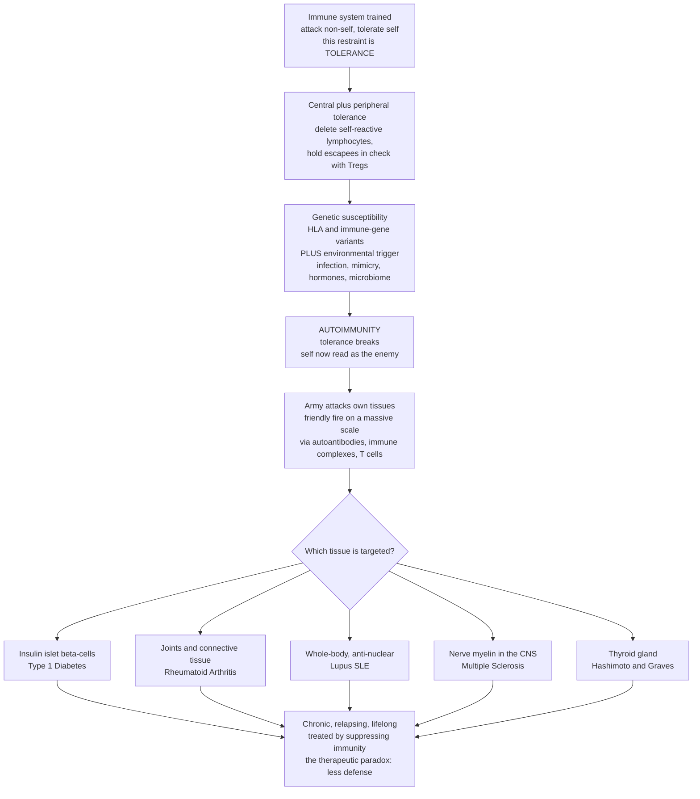

# 🛡️ Immune Dysfunction and Autoimmunity

> [!abstract] TL;DR
> **Autoimmunity** is the catastrophic failure of the immune system's most delicate skill: telling **self** from **non-self**. A healthy immune system is a superbly trained army built to destroy invaders while *never* attacking the body it defends — a restraint called **self-tolerance**, enforced first in the thymus and marrow (**central tolerance** deletes or edits self-reactive lymphocytes) and then throughout the body (**peripheral tolerance** via regulatory T cells, anergy, and checkpoints). When tolerance breaks — typically when a **genetically susceptible** person (often carrying particular **HLA** variants) meets an **environmental trigger** such as an infection that resembles self (**molecular mimicry**) — the army turns its weapons inward: **friendly fire** on a massive scale. The *same* underlying error, aimed at different tissues, produces different diseases: attack the pancreatic islet β-cells and you get **type 1 diabetes**; the joints, **rheumatoid arthritis**; the whole body's connective tissue, **lupus (SLE)**; the nerve myelin, **multiple sclerosis**; the thyroid, **Hashimoto's** (or, with a *stimulating* antibody, **Graves'**). Diseases sort along a spectrum from **organ-specific** to **systemic**, damage tissue through **autoantibodies, immune complexes, or self-reactive T cells**, disproportionately affect **women**, and — because the immune system is built to be relentless and to remember — run a **chronic, relapsing, lifelong** course. The tragic therapeutic irony: we treat autoimmunity by **dialing down the very defenses that normally protect us**, trading disease control against infection risk. Understanding autoimmunity is understanding what happens when the body's defender becomes its attacker. *(Educational pathophysiology at textbook level — not individual medical advice.)*

---

## Intuition

**Analogy — the army that must never fire on its own citizens.** Imagine a superbly trained army whose mission is impossibly delicate: destroy every foreign invader while *never once* harming a citizen of its own country. To pull this off, recruits are put through a brutal boarding school early in life — anyone who reacts to a fellow citizen is expelled or re-trained before ever being deployed. And even the soldiers who graduate are kept on a tight leash by internal affairs officers who constantly whisper "stand down" whenever a soldier starts eyeing a local. That whole apparatus of restraint — the boarding school plus the internal-affairs leash — is **tolerance**. It is what lets a lethal fighting force live safely among the people it protects.

**Autoimmunity is the day that restraint fails.** A soldier who should have been expelled slips through, the internal-affairs officers stop whispering, and the army — still lethal, still disciplined, still *relentless* — mistakes its own citizens for the enemy and opens fire. It is friendly fire on a national scale. *Which* citizens get attacked decides which catastrophe unfolds: shell the power plant and the lights go out (attack the insulin-making cells → **type 1 diabetes**); shell the transit hubs and the city seizes up (attack the joints → **rheumatoid arthritis**); shell indiscriminately across every district and the whole country burns (attack connective tissue everywhere → **lupus**); cut the communication lines and messages stop arriving (strip the insulation off nerves → **multiple sclerosis**); shell the thermostat station and the climate goes haywire (attack the thyroid → **Hashimoto's**). Same error — broken restraint — aimed at different targets.

Why does a loyal army turn on its own? Rarely one thing. A **genetic** predisposition (certain immune-command variants that make soldiers twitchy) plus an **environmental trigger** — most classically an *infection that happens to look like a citizen* — is enough to tip a vulnerable population over the edge. And here is the final cruelty: because the immune system is *designed* to be persistent and to *remember* its targets, autoimmune wars rarely end. They become chronic and lifelong, and the only way to quiet them is to **weaken the very army that guards the borders** — which is why treating autoimmunity always means living with the risk of the invaders it was built to stop.

---

## How It Works

### Core mechanics — tolerance, and the two-hit failure that breaks it

1. **The discrimination problem.** The adaptive immune system generates lymphocytes with astronomically diverse, *randomly* rearranged receptors so that *some* T cell or B cell can recognize *any* possible pathogen. The unavoidable side effect: many of those random receptors also fit **self**. The immune system must therefore purge or muzzle its self-reactive members before they cause harm — this is **self-tolerance**, and autoimmunity is its failure.
2. **Central tolerance (the boarding school).** In the **thymus**, developing T cells that bind self-peptide-**MHC/HLA** too strongly are deleted by **negative selection**; the transcription factor **AIRE** forces the thymus to display tissue-restricted self-antigens (insulin, thyroglobulin) so that even organ-specific self-reactive cells are caught. In the **bone marrow**, self-reactive B cells are deleted or rescued by **receptor editing**. Central tolerance is powerful but leaky — some self-reactive cells always escape to the periphery.
3. **Peripheral tolerance (the internal-affairs leash).** Escapees are held in check body-wide by **regulatory T cells (Tregs, FOXP3+)** that actively suppress self-reactivity, by **anergy** (a lymphocyte that sees antigen without a co-stimulatory "second signal" is switched off, not activated), by **deletion** of chronically stimulated cells, and by **inhibitory checkpoints** (**CTLA-4, PD-1**) that brake activated T cells. Tolerance is thus not a one-time event but a *continuous, active restraint*.
4. **Breaking tolerance — genetics × environment.** Autoimmunity needs a susceptible host *and* a trigger. **Genetic susceptibility**: particular **HLA** alleles (which shape *which* self-peptides get presented) and variants in immune-regulatory genes (*PTPN22, CTLA4, IL23R, FOXP3*) tilt the odds. **Environmental triggers**: **infections** (via **molecular mimicry** — a microbial epitope resembling self, so anti-microbe cells cross-react with tissue), **tissue damage** exposing hidden/sequestered self-antigens, the **microbiome**, **smoking**, and **sex hormones** (a major reason ~4 in 5 patients are women). **Epitope spreading** then broadens the attack from one antigen to many.
5. **How the damage is done (the effector arms).** Once tolerance breaks, self is destroyed by the same weapons used on pathogens, mapping onto **hypersensitivity** mechanisms: **autoantibodies** binding cell-surface or matrix antigens (Type II — Graves', myasthenia gravis, autoimmune hemolytic anemia); **immune complexes** of antibody + self-antigen depositing in tissue and igniting complement-driven inflammation (Type III — the glomerulonephritis and vasculitis of lupus); and **self-reactive T cells** directly killing target cells (Type IV — β-cell destruction in type 1 diabetes, myelin attack in MS).
6. **The clinical spectrum — same error, different target.** Diseases array from **organ-specific** (attack confined to one tissue: type 1 diabetes, Hashimoto's/Graves', MS, myasthenia gravis, pernicious anemia, celiac, IBD) to **systemic** (attack on ubiquitous antigens like nuclear components, hitting many organs: **SLE**, rheumatoid arthritis, scleroderma, Sjögren's, the vasculitides). Course is typically **chronic and relapsing-remitting**; diagnosis leans on **autoantibodies** and **inflammatory markers**.
7. **The therapeutic paradox.** Because you cannot un-teach an immune memory, treatment means **immunosuppression** — corticosteroids, conventional **DMARDs** (methotrexate), and targeted **biologics** (anti-**TNF**, anti-**IL-6**, anti-**IL-17/23**, B-cell-depleting **rituximab**, **JAK inhibitors**). Every one of them dials down defense, so the price of controlling the disease is a raised risk of **infection** (and sometimes malignancy). The mirror image of the whole problem is **transplant rejection** and **graft-versus-host disease** — here tolerance is working *correctly*, attacking genuinely non-self tissue, and we suppress it for the opposite reason.

### The self-tolerance loop and its breakdown



*Read top to bottom: a trained, restrained immune system meets a two-hit failure (susceptibility plus trigger) that snaps its self-tolerance; the unleashed, still-lethal response then attacks the body, and the target organ decides which named disease appears — all of them converging on the same chronic course treated, paradoxically, by turning the defenses down.*

---

## Key Concepts

### Secondary (intuitive)

- **Self vs non-self.** The immune system's core job is to attack foreign things (germs) while leaving *your own body* alone. Getting that distinction right is what keeps a powerful defense from becoming dangerous.
- **Tolerance** = the built-in restraint that stops the immune system from attacking you. Autoimmunity is when that restraint fails.
- **Autoimmunity = friendly fire.** The immune army mistakes your own tissue for the enemy and attacks it. It is not weakness — the defenses are *too* active, aimed the *wrong* way.
- **Same mistake, different disease.** Which organ gets attacked decides the illness: insulin cells → **type 1 diabetes**, joints → **rheumatoid arthritis**, thyroid → **Hashimoto's**, nerves → **multiple sclerosis**, the whole body → **lupus**.
- **Why it lasts.** The immune system is designed to remember its targets forever, so autoimmune diseases are usually **lifelong** and are managed, not cured, by **calming the immune system down**.
- **Who gets it.** Autoimmune disease is common and *growing*, and it strikes **women far more than men** — for lupus, roughly nine women for every man.

### Undergraduate (formal)

- **Two layers of tolerance.** *Central*: negative selection of strongly self-reactive T cells in the **thymus** (aided by **AIRE**, which displays organ-specific antigens) and deletion/**receptor editing** of self-reactive B cells in **marrow**. *Peripheral*: **Tregs (FOXP3+)**, **anergy** (antigen without co-stimulation), activation-induced deletion, and **checkpoints (CTLA-4, PD-1)**. Both must work; central tolerance is inherently incomplete, so peripheral tolerance is the ongoing guardrail.
- **Mechanisms of breakdown.** (1) **Molecular mimicry** — a pathogen epitope resembles self, so the anti-pathogen response cross-reacts (rheumatic fever after strep; Guillain-Barré after *Campylobacter*). (2) **Cryptic/sequestered antigen release** — trauma or infection exposes antigens the immune system never learned to tolerate (e.g., sympathetic ophthalmia). (3) **Bystander activation / adjuvant effect** — infection-driven inflammation licenses nearby self-reactive cells. (4) **Defective regulation** — Treg deficiency or checkpoint failure. (5) **Epitope spreading** — the response broadens from one self-antigen to many over time.
- **The genetic backdrop.** The strongest hits are **HLA (MHC) associations** — e.g., HLA-DR/DQ in type 1 diabetes and rheumatic disease, HLA-B27 in the seronegative spondyloarthropathies — because HLA dictates *which* self-peptides are presented. Non-HLA risk genes (*PTPN22, CTLA4, IL23R*) tune activation thresholds and cytokine pathways. Autoimmunity is **polygenic and multifactorial**, not Mendelian (with rare monogenic exceptions like IPEX).
- **Types of tissue damage (Gell-Coombs mapping).** **Type II** (antibody vs cell-surface/matrix antigen): Graves', myasthenia gravis, autoimmune hemolytic anemia, Goodpasture's. **Type III** (immune-complex deposition + complement): the nephritis, arthritis, and vasculitis of **SLE**. **Type IV** (T-cell-mediated cytotoxicity/inflammation): type 1 diabetes, MS, Hashimoto's, celiac.
- **Organ-specific vs systemic — the defining spectrum.** *Organ-specific* diseases target a tissue-restricted antigen (islet, thyroid, myelin, acetylcholine receptor). *Systemic* diseases target **ubiquitous antigens** (nuclear DNA, histones, ribonucleoproteins), so the damage — via circulating **immune complexes** — is multi-organ; **SLE**, with its **antinuclear antibodies (ANA)** and **anti-dsDNA**, is the archetype.
- **Diagnosis.** **Autoantibody profiles** (ANA, anti-dsDNA and anti-Smith for lupus; **rheumatoid factor** and **anti-CCP** for RA; anti-TPO for Hashimoto's; anti-acetylcholine-receptor for myasthenia) plus **inflammatory markers** (ESR, CRP, complement C3/C4 consumption) and tissue biopsy. Autoantibodies can be diagnostic *and* mechanistic — or merely a marker.
- **Treatment logic.** Suppress or redirect immunity: **corticosteroids** (broad), **DMARDs** (methotrexate, hydroxychloroquine), and **biologics** targeting specific nodes (anti-TNF, anti-IL-6, anti-IL-17/23, anti-CD20/rituximab, anti-BAFF/belimumab, **JAK inhibitors**), balanced against infection risk. Organ-specific failure often also needs **replacement** of the lost function (insulin, levothyroxine).

### Graduate (mechanistic and systems)

- **AIRE and the price of a complete self-catalogue.** AIRE-driven promiscuous expression of tissue antigens in medullary thymic epithelium is how the thymus tolerizes T cells to proteins made only in distant organs; loss-of-function (**APECED/APS-1**) causes multi-organ autoimmunity, proving central tolerance is antigen-display-limited. The corollary: any self-antigen *poorly* represented in the thymus is a latent autoimmune target.
- **Tregs as a dominant, transferable brake.** FOXP3+ Tregs enforce *dominant* tolerance — their loss (**FOXP3** mutation → **IPEX**) yields fatal early polyautoimmunity, and Treg transfer can suppress disease in models. This reframes autoimmunity partly as a *regulatory deficit*, motivating Treg-expanding and low-dose IL-2 therapeutics.
- **Checkpoints and the oncology mirror.** CTLA-4 and PD-1 exist precisely to prevent self-reactivity; **checkpoint-inhibitor cancer immunotherapy** deliberately releases those brakes and, predictably, unmasks **immune-related adverse events (irAEs)** — drug-induced thyroiditis, colitis, hypophysitis, type-1-diabetes-like states. Iatrogenic autoimmunity is now a clinical demonstration that tolerance is an *active* checkpoint-dependent process.
- **The lupus interferon signature.** SLE illustrates innate-adaptive crosstalk: impaired clearance of apoptotic debris and **neutrophil extracellular traps (NETs)** exposes nuclear antigens; immune complexes containing nucleic acids engage endosomal **TLR7/9** and drive a **type I interferon** program that amplifies autoreactivity — the rationale for anti-interferon (anifrolumab) and anti-BAFF (belimumab) biologics.
- **Sex bias and the X chromosome.** Female predominance reflects estrogen effects on immune signaling plus **X-chromosome dosage** — incomplete X-inactivation of immune genes (*TLR7, CD40L*) and Xist-associated ribonucleoprotein autoantigenicity. This is a leading mechanistic hypothesis for why systemic autoimmunity is overwhelmingly female.
- **Molecular mimicry, proven.** Rheumatic fever (streptococcal M-protein vs cardiac myosin), some type 1 diabetes (viral vs islet antigens), and post-infectious neuropathy (*Campylobacter* LPS vs ganglioside) are worked examples where a defined microbial epitope cross-reacts with a defined self-antigen — the clearest bridge from infection to autoimmunity.
- **The transplant/GvHD mirror image.** Graft **rejection** (host T cells attacking allogeneic HLA on donor tissue) and **graft-versus-host disease** (donor T cells attacking host tissue after marrow transplant) are tolerance working *correctly against genuine non-self* — the inverse pathology. They anchor the same conceptual axis (self vs non-self recognition via HLA) and share the therapeutic tool of immunosuppression, clarifying that autoimmunity is a *targeting* error, not an *intensity* error.
- **The suppression trade-off, quantified.** Every immunosuppressant shifts the host along a curve trading autoimmune activity for **opportunistic infection** (anti-TNF and reactivation of latent **tuberculosis**; rituximab and hepatitis B/JC virus) and, for some agents, malignancy surveillance. Modern practice targets the *narrowest effective node* (a single cytokine or lineage) to preserve as much protective immunity as possible — the logic behind biologics over blanket steroids.

---

## Python Demo

```python
# Autoimmunity as a failure of self-tolerance, in two pictures:
#   (a) THE TOLERANCE THRESHOLD. Immune response strength vs how "foreign" an antigen is.
#       A healthy immune system sets a HIGH threshold so that near-self antigens are ignored
#       (self is spared). Autoimmunity is a LOWERED / LEFT-SHIFTED threshold, so self-antigens
#       now cross the line and trigger a response -> self-reactivity. A second panel shows the
#       two-hit tipping: genetic susceptibility raises baseline self-reactivity, and an
#       environmental trigger pushes a susceptible host OVER the disease threshold.
#   (b) THE CLINICAL SPECTRUM + SEX BIAS. Where major autoimmune diseases sit on the
#       organ-specific <-> systemic axis, and their striking female predominance.
import numpy as np
import matplotlib.pyplot as plt

fig, ax = plt.subplots(2, 2, figsize=(13, 9))

# ---------- (a1) Response vs foreignness: healthy vs broken tolerance ----------
foreign = np.linspace(0, 1, 400)          # 0 = pure self ... 1 = clearly foreign
def response(x, threshold, steep=12.0):    # sigmoid immune activation
    return 1.0 / (1.0 + np.exp(-steep * (x - threshold)))

healthy   = response(foreign, threshold=0.55)   # high bar -> self ignored
autoimmune = response(foreign, threshold=0.20)  # lowered bar -> self attacked
self_zone = foreign < 0.30                       # antigens resembling "self"

ax[0, 0].axvspan(0, 0.30, color="#3498db", alpha=0.12, label="self-antigen zone")
ax[0, 0].plot(foreign, healthy,    color="#27AE60", lw=2.4, label="Healthy tolerance")
ax[0, 0].plot(foreign, autoimmune, color="#C0392B", lw=2.4, label="Broken tolerance")
ax[0, 0].fill_between(foreign, autoimmune, where=self_zone, color="#C0392B",
                      alpha=0.22, label="self-reactivity (friendly fire)")
ax[0, 0].axhline(0.5, ls=":", color="grey", lw=1)
ax[0, 0].set(title="(a1) Tolerance threshold: sparing vs attacking self",
             xlabel="how 'foreign' the antigen is  (0 = self, 1 = foreign)",
             ylabel="immune response strength", ylim=(-0.03, 1.05))
ax[0, 0].legend(fontsize=8, loc="center left"); ax[0, 0].grid(alpha=0.3)

# ---------- (a2) Two-hit tipping into disease ----------
g = np.linspace(0, 1, 300)                 # genetic susceptibility (HLA + immune genes)
baseline_self_reactivity = 0.10 + 0.55 * g # rises with susceptibility
with_trigger = baseline_self_reactivity + 0.35   # infection/mimicry/hormone adds a hit
disease_threshold = 0.75

ax[0, 1].plot(g, baseline_self_reactivity, color="#2980B9", lw=2.4,
              label="Susceptible, no trigger")
ax[0, 1].plot(g, with_trigger, color="#C0392B", lw=2.4,
              label="Susceptible + trigger")
ax[0, 1].axhline(disease_threshold, ls="--", color="black", lw=1.2,
                 label="disease threshold")
crosses = with_trigger >= disease_threshold
ax[0, 1].fill_between(g, disease_threshold, with_trigger, where=crosses,
                      color="#C0392B", alpha=0.20, label="tips into disease")
ax[0, 1].set(title="(a2) Two hits break tolerance: genes x environment",
             xlabel="genetic susceptibility", ylabel="self-reactivity index",
             ylim=(0, 1.05))
ax[0, 1].legend(fontsize=8, loc="upper left"); ax[0, 1].grid(alpha=0.3)

# ---------- (b1) Organ-specific <-> systemic spectrum ----------
dz      = ["Type 1\nDiabetes", "Hashimoto", "Multiple\nSclerosis", "Myasthenia\nGravis",
           "Rheumatoid\nArthritis", "Sjogren", "Lupus\nSLE"]
pos     = [0.05, 0.12, 0.20, 0.28, 0.66, 0.82, 0.95]   # 0 = organ-specific, 1 = systemic
yjit    = [0.15, -0.15, 0.15, -0.15, 0.15, -0.15, 0.15]
cmap    = plt.cm.coolwarm(np.array(pos))

ax[1, 0].hlines(0, 0, 1, color="grey", lw=2, zorder=1)
ax[1, 0].scatter(pos, np.zeros_like(pos), s=180, c=cmap, zorder=3, edgecolor="k")
for x, y, name in zip(pos, yjit, dz):
    ax[1, 0].annotate(name, (x, 0), (x, y), ha="center",
                      va="bottom" if y > 0 else "top", fontsize=8)
ax[1, 0].text(0.02, -0.42, "ORGAN-SPECIFIC\n(one tissue attacked)", fontsize=8,
              color="#2166ac", ha="left")
ax[1, 0].text(0.98, -0.42, "SYSTEMIC\n(ubiquitous self-antigens)", fontsize=8,
              color="#b2182b", ha="right")
ax[1, 0].set(title="(b1) The autoimmune spectrum: same error, different target",
             xlim=(-0.05, 1.05), ylim=(-0.55, 0.4))
ax[1, 0].set_yticks([]); ax[1, 0].set_xlabel("target breadth")
ax[1, 0].grid(alpha=0.2, axis="x")

# ---------- (b2) Female predominance (approx. female:male ratio) ----------
dz2   = ["Hashimoto", "Sjogren", "Lupus\nSLE", "Graves", "Multiple\nSclerosis",
         "Rheumatoid\nArthritis", "Type 1\nDiabetes"]
ratio = [9, 9, 9, 7, 3, 3, 1]              # approximate female-to-male ratios
bcol  = plt.cm.magma(np.linspace(0.25, 0.8, len(dz2)))
ax[1, 1].barh(dz2, ratio, color=bcol, edgecolor="k")
ax[1, 1].axvline(1, ls="--", color="grey", label="equal (1:1)")
for i, r in enumerate(ratio):
    ax[1, 1].text(r + 0.15, i, f"{r}:1", va="center", fontsize=8)
ax[1, 1].set(title="(b2) Female predominance of autoimmune disease",
             xlabel="approximate female : male ratio", xlim=(0, 11))
ax[1, 1].invert_yaxis(); ax[1, 1].legend(fontsize=8); ax[1, 1].grid(alpha=0.3, axis="x")

fig.suptitle("Immune Dysfunction and Autoimmunity: broken self-tolerance, the spectrum, and the sex bias",
             fontsize=13)
fig.tight_layout()
plt.show()
```

**What the plots show.** *Panel (a1)* is the whole idea in one curve: the immune response rises with how *foreign* an antigen looks, but a **healthy** system sets that threshold high enough that near-**self** antigens (blue zone) fall on the flat, ignored part of the curve — self is spared. **Autoimmunity** simply *lowers the threshold* (left-shift); now self-antigens cross the line and provoke a response — the shaded red region is literal **friendly fire**. *Panel (a2)* shows why one hit is rarely enough: genetic susceptibility alone raises self-reactivity but usually stays below the disease line, while adding an **environmental trigger** lifts susceptible hosts *over* the threshold — the two-hit, genes-times-environment origin of most autoimmune disease. *Panel (b1)* arranges the major diseases along the **organ-specific → systemic** axis — the same broken-tolerance error aimed at a narrow target (islet, thyroid, myelin) versus at ubiquitous nuclear antigens (lupus at the far right). *Panel (b2)* makes the epidemiology vivid: most systemic and thyroid autoimmunity runs roughly **9:1 female**, with type 1 diabetes a near-even exception — a pattern any mechanistic theory of autoimmunity must explain. *(Ratios are approximate, textbook-level figures for illustration.)*

---

## Real-World Applications

> **Example — the ANA test and diagnosing lupus.** The **antinuclear antibody (ANA)** test operationalizes the core mechanism of *systemic* autoimmunity: because SLE targets **ubiquitous nuclear antigens**, patients circulate antibodies against DNA and nuclear proteins. A positive ANA (especially high-titre) with more specific **anti-dsDNA** and **anti-Smith** antibodies, plus **consumed complement (low C3/C4)** from immune-complex deposition, supports the diagnosis and tracks flares — a direct readout of the friendly-fire biology, including the immune complexes that drive lupus nephritis.

- **Anti-cytokine biologics and their infection trade-off.** **Anti-TNF** agents (infliximab, adalimumab) transformed rheumatoid arthritis and inflammatory bowel disease — but by blunting TNF-dependent granuloma maintenance they can **reactivate latent tuberculosis**, so latent-TB screening before starting is now standard. This is the therapeutic paradox made concrete: better disease control, more infection risk.
- **B-cell depletion and cytokine-node targeting.** **Rituximab** (anti-CD20) depletes B cells in RA, ANCA vasculitis, and refractory lupus; **belimumab** (anti-BAFF) and **anifrolumab** (anti-interferon) target the lupus B-cell/interferon axis; **JAK inhibitors** block multiple cytokine signals at once — each aiming at the *narrowest effective node* to spare protective immunity.
- **Checkpoint-inhibitor autoimmunity in oncology (the mirror).** Cancer immunotherapies that *release* CTLA-4/PD-1 brakes deliberately lower the tolerance threshold to attack tumors — and predictably cause **immune-related adverse events**: autoimmune thyroiditis, colitis, hypophysitis, and new-onset type-1-diabetes-like disease. Iatrogenic autoimmunity is now an everyday clinical proof that tolerance is an active checkpoint process.
- **Replacement therapy for organ-specific failure.** When autoimmunity destroys a gland's *function*, medicine replaces the missing product: **insulin** for type 1 diabetes, **levothyroxine** for Hashimoto hypothyroidism, B12 for pernicious anemia — treating the deficit even when the immune attack itself cannot be reversed.
- **Molecular-mimicry-driven prevention.** Prompt antibiotic treatment of streptococcal pharyngitis prevents **rheumatic fever** (strep M-protein cross-reacting with cardiac myosin) — a public-health intervention that stops autoimmunity by removing the mimicking trigger.
- **Transplant immunosuppression and GvHD (the inverse problem).** Solid-organ and marrow transplantation require calibrated immunosuppression to prevent **rejection** and **graft-versus-host disease** — tolerance working *correctly* against real non-self — using the same drug toolbox, underscoring that autoimmunity is a targeting error, not a strength error.

---

## Common Pitfalls

- **"A positive ANA means lupus."** Low-titre ANA is common in *healthy* people (and rises with age and other conditions); the test has high sensitivity but poor specificity. An autoantibody is a *clue*, not a diagnosis — it must be read with clinical features and more specific antibodies. Over-reading a lone positive ANA generates anxiety and unnecessary workups.
- **Confusing autoimmunity with immunodeficiency.** They are *not* opposites — the immune system is dysregulated, not simply weak or strong, and the two can coexist (many primary immunodeficiencies present with autoimmunity). "Boosting" or "suppressing" immunity as if it were a single dial misunderstands the problem, which is *misdirected specificity*. (Immunodeficiency and allergy are covered in the sibling note *Hypersensitivity, Allergy and Immunodeficiency*.)
- **"Immunosuppression cures it."** It **controls**, rarely cures. Immune memory persists, so stopping therapy often relapses, and every agent trades disease control for **infection risk** (and sometimes malignancy). The clinical art is the narrowest effective suppression.
- **Assuming every autoantibody is pathogenic.** Some autoantibodies *cause* damage (anti-acetylcholine-receptor in myasthenia, anti-dsDNA in lupus nephritis); others are diagnostic **markers** produced downstream of a T-cell-driven process and are not themselves destructive. Confusing marker with mechanism misleads both diagnosis and drug choice.
- **Treating the number instead of the disease.** As with endocrine disease, an abnormal titre or marker in the absence of clinical activity may not warrant escalation; conversely, active organ damage can occur with modest serology. Trends and organ involvement, not a single value, guide management.
- **Ignoring the female predominance and pregnancy interplay.** Missing autoimmune disease in women (where it is far more common) delays diagnosis; ignoring how pregnancy and sex hormones modulate flares (lupus can flare; RA often quiesces) mismanages the course.
- **Forgetting the infection trade-off before starting biologics.** Anti-TNF without latent-TB screening, or immunosuppression without vaccination/opportunistic-infection prophylaxis, converts a treatable autoimmune disease into a preventable infectious catastrophe.
- **Reading this as clinical advice.** This note teaches *mechanisms* of immune dysfunction at textbook level. It is **not** guidance for any individual's diagnosis or treatment, which always depends on a clinician and the specifics of a real patient.

---

## Related Concepts

**Within this vault (Section 05 — Immune, Infectious and Hematologic).** This note is the immune-dysregulation anchor of the section and connects tightly to its siblings, all referenced here in prose. *Infectious Disease and Host-Pathogen Interaction* is the flip side — the immune system doing its intended job against real invaders — and supplies the **infections** (molecular mimicry, bystander activation) that trigger autoimmunity, as well as the **opportunistic infections** that immunosuppression unleashes. *Hypersensitivity, Allergy and Immunodeficiency* is the natural companion: it covers the **Gell-Coombs hypersensitivity types** whose Type II/III/IV mechanisms *are* the effector arms of autoimmune damage, plus the immunodeficiency states this note deliberately excludes. Beyond the section, *Inflammation and Tissue Repair* (Section 01) supplies the **chronic inflammation and fibrosis** that autoimmunity drives in every target organ; *Endocrine Pathophysiology* and *Diabetes Mellitus and Glucose Regulation* (Section 03) are where organ-specific autoimmunity becomes **Hashimoto's, Graves', Addison's, and type 1 diabetes**; and *Musculoskeletal and Bone Disease* is where **rheumatoid arthritis and the connective-tissue diseases** present clinically.

**Across the vault (Glob-verified links).**

- [[Biology/11_Microbiology_and_Immunology/The_Adaptive_Immune_System|The Adaptive Immune System]] — the T cells, B cells, antibodies, and MHC/HLA restriction whose self-tolerance *fails* in autoimmunity; the substrate this whole note breaks.
- [[Biology/11_Microbiology_and_Immunology/The_Innate_Immune_System|The Innate Immune System]] — complement, phagocytes, and pattern-recognition (TLRs) that execute immune-complex and interferon-driven tissue damage in lupus.
- [[Biology/11_Microbiology_and_Immunology/Vaccines_and_Antibiotics|Vaccines and Antibiotics]] — antibody biology and the antigen-recognition machinery that, misdirected at self, becomes autoantibody; and the antibiotics that prevent mimicry-driven rheumatic fever.
- [[Biology/09_Human_Physiology_and_Anatomy/The_Endocrine_System_and_Hormones|The Endocrine System and Hormones]] — the glands (islets, thyroid, adrenal) that organ-specific autoimmunity destroys, producing type 1 diabetes, Hashimoto's, and Addison's.
- [[Biology/09_Human_Physiology_and_Anatomy/Homeostasis_and_the_Nervous_System|Homeostasis and the Nervous System]] — the nerve myelin and neuromuscular junction attacked in multiple sclerosis and myasthenia gravis.
- [[Biology/06_Cell_Division_and_Reproduction/Cancer_and_the_Cell_Cycle|Cancer and the Cell Cycle]] — the checkpoint biology exploited by cancer immunotherapy, whose release *causes* iatrogenic autoimmunity (irAEs) — the oncology mirror.
- [[Genetics/05_Human_and_Medical_Genetics/Complex_Trait_Genetics_and_GWAS|Complex Trait Genetics and GWAS]] — how HLA and non-HLA risk loci are mapped, explaining the polygenic, multifactorial genetic susceptibility behind autoimmune disease.
- [[Health_Nutrition_and_Longevity/06_Public_Health_and_Prevention/Infectious_Disease_Vaccines_and_Immunity|Infectious Disease, Vaccines and Immunity]] — the population-level view of immunity, infection triggers, and the vaccination considerations that matter for immunosuppressed patients.
- [[Health_Nutrition_and_Longevity/02_Nutrition_Science/The_Gut_Microbiome_and_Nutrition|The Gut Microbiome and Nutrition]] — the microbiome as an environmental modulator of tolerance implicated in the rising incidence of autoimmune disease.

---

## Review Questions

**Secondary.** Using the "army that must never fire on its own citizens" analogy, explain what **tolerance** is and what goes wrong in **autoimmunity**. Why does the *same* underlying failure produce type 1 diabetes in one person and lupus in another? And why are autoimmune diseases usually **lifelong** rather than something you recover from like a cold?

**Undergraduate.** Distinguish **central** from **peripheral** tolerance, naming one key mechanism of each and where it operates. Then explain the **two-hit** model of autoimmunity: give one example of a **genetic** contributor and one **environmental** trigger, and describe how **molecular mimicry** can turn an anti-infection response into an anti-self response. Finally, contrast an **organ-specific** with a **systemic** autoimmune disease, referencing the type of self-antigen each targets and the resulting antibody test.

**Graduate.** A patient on **anti-TNF** therapy for rheumatoid arthritis reactivates latent tuberculosis; separately, a melanoma patient on a **PD-1 checkpoint inhibitor** develops autoimmune thyroiditis and colitis. Explain how these two cases are opposite consequences of manipulating the *same* tolerance machinery, and what each reveals about whether autoimmunity is a problem of immune *intensity* or immune *targeting*. Then, framing autoimmunity as a failure of an active, checkpoint- and Treg-dependent restraint, justify why modern therapy favors targeting the **narrowest effective immune node** over blanket immunosuppression — and state the trade-off that choice is trying to optimize.

---

## Sources

- Abbas, A. K., Lichtman, A. H., & Pillai, S. (2021). *Cellular and Molecular Immunology* (10th ed.). Elsevier — immunological tolerance, central and peripheral tolerance, and the mechanisms of autoimmunity.
- Murphy, K., & Weaver, C. (2022). *Janeway's Immunobiology* (10th ed.). Garland Science / W. W. Norton — self-tolerance, autoreactivity, and the immunobiology of autoimmune disease.
- Kumar, V., Abbas, A. K., & Aster, J. C. (2021). *Robbins & Cotran Pathologic Basis of Disease* (10th ed.). Elsevier — "Diseases of the Immune System," including SLE, immune-complex and T-cell-mediated injury, and transplant rejection.
- Loscalzo, J., Fauci, A., Kasper, D., et al. (eds.). *Harrison's Principles of Internal Medicine* (21st ed.). McGraw-Hill — autoimmunity and autoimmune disease, systemic lupus erythematosus, and rheumatoid arthritis.
- Rosenblum, M. D., Remedios, K. A., & Abbas, A. K. (2015). "Mechanisms of human autoimmunity." *Journal of Clinical Investigation*, 125(6), 2228–2233 — tolerance checkpoints and their failure in human disease.

---

#clinical-medicine #autoimmunity #immune-tolerance #lupus #immunology
