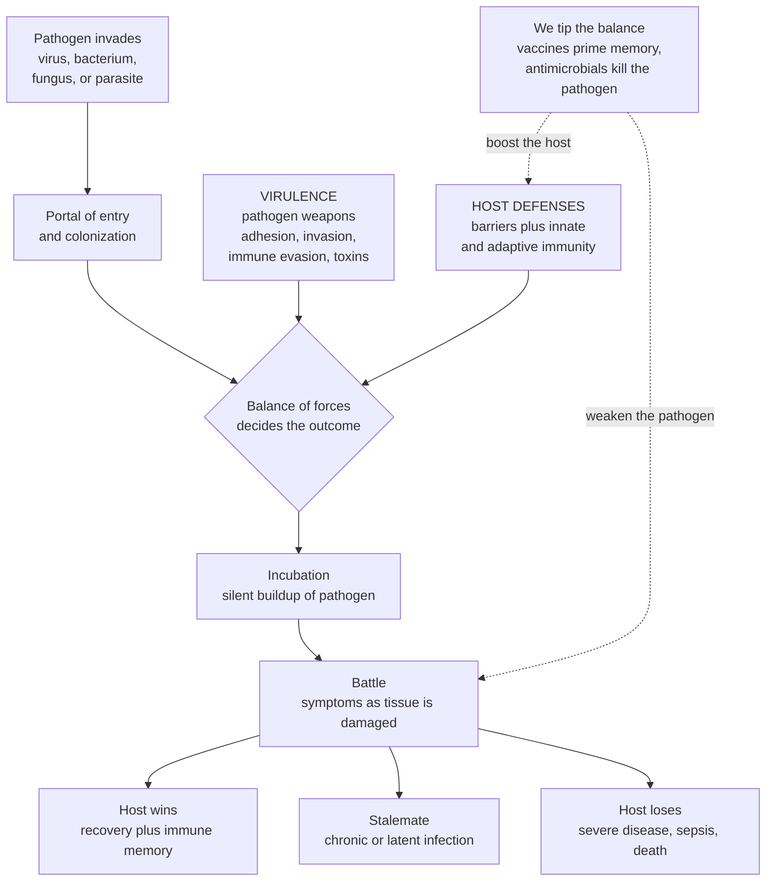

# 🦠 Infectious Disease and Host-Pathogen Interaction

> [!abstract] TL;DR
> **Infectious disease is a war between two parties** — a **pathogen** trying to enter, multiply, and spread, and a **host** trying to detect and destroy it. Whether you get sick, and how badly, is the *outcome of that struggle*, decided by two forces: how nasty the invader is — its **virulence**, the toolkit of weapons for entering, hiding, and damaging tissue — and how strong your defenses are — your **immune system**. This is why the *same* microbe can be trivial in a healthy person and lethal in someone whose defenses are down. Pathogens come in tiers of complexity — **viruses** (hijack your cells to copy themselves), **bacteria** (living cells that invade and release toxins), **fungi**, and **parasites** — and each is fought and treated differently, which is exactly why **antibiotics work on bacteria but not viruses**. The war also plays out over **time**: a silent **incubation** period while the invader builds up, then **symptoms** as the battle rages, then either the host wins (**recovery**, often with lasting **immune memory**), a stalemate (**chronic or latent infection**, like herpes or TB), or the host loses. We deliberately **tip the balance in the host's favor** with two of medicine's greatest triumphs — **vaccines** (priming immune memory before the fight) and **antimicrobials** (chemically sabotaging the pathogen) — while the microbes fight back through **antimicrobial resistance**, evolution under selection that is now a leading global threat. This opener frames the immune, sepsis, and epidemiology notes that follow, and bridges microbiology and immunology to the clinic.

---

## Intuition

**Analogy — infection is a siege, and you are the fortress.** Picture your body as a walled city. Most of the time the walls hold and life inside hums along, oblivious to the microbes swarming the gates. Infection begins when an invader breaches the wall — a cut in the skin, an inhaled droplet, contaminated food — and starts to multiply inside. Now two things decide the outcome, and *only* two. First, **how dangerous is the invader** — does it carry grappling hooks to cling to your walls, battering rams to break in, disguises to slip past your guards, and poisons to sabotage your infrastructure? That arsenal is its **virulence**. Second, **how strong is the garrison** — how quickly do your patrols (the innate immune system) sound the alarm, and how fast can you forge weapons precisely shaped to *this* enemy (the adaptive immune system)? A well-defended city repels an assault that would sack a weakened one. That is the whole reason a bug that gives a healthy adult a mild cold can kill a newborn, a transplant patient, or someone with HIV: **same invader, different garrison.**

The siege has a timeline. First a quiet phase while the invader masses its forces behind the wall and you don't yet feel a thing — the **incubation period**. Then open battle: fever, aches, and pus are not the enemy attacking you but the *sound of your own army fighting* — and sometimes your army does as much collateral damage as the invader. Finally the siege resolves one of three ways: you **win** and post veteran guards who will recognize this enemy instantly next time (**immune memory** — the basis of vaccines), you reach a **stalemate** where the enemy digs into a fortified corner and hides for years (**latent** infection, like the tuberculosis bacillus or the herpes virus), or you **lose**. Medicine's genius has been learning to **rig the siege**: **vaccines** train the garrison *before* the enemy ever arrives, and **antimicrobials** are chemical weapons that poison the invader while sparing your own troops — possible only because bacterial, fungal, and viral machinery differs from ours. Understanding infection as this host-versus-pathogen contest is the foundation of one of medicine's greatest victories, and of its most urgent unfinished battles.

---

## How It Works

### Core mechanics

**1. The pathogens — four tiers of invader (plus one oddity).** Disease-causing microbes are not one thing; they span a ladder of complexity, and *where a microbe sits on the ladder dictates how it makes you sick and how we kill it*:
- **Viruses** — not even cells. They are genetic instructions in a protein coat, **obligate intracellular parasites** that must hijack your own cells' machinery to copy themselves (influenza, HIV, hepatitis B/C, SARS-CoV-2). Because they run *on your hardware*, drugs that hit them must target virus-specific steps without wrecking the cell.
- **Bacteria** — free-living **prokaryotic cells** that can invade, multiply on their own, and cause damage by producing **toxins** and tissue-destroying enzymes (*Streptococcus*, *Mycobacterium tuberculosis*, *E. coli*). Their distinct machinery — cell wall, ribosomes, folate synthesis — is what antibiotics exploit.
- **Fungi** — yeasts and molds; larger, eukaryotic, often **opportunistic**, striking mainly when defenses are down (*Candida*, *Aspergillus*, *Pneumocystis*).
- **Parasites** — from single-celled **protozoa** (malaria's *Plasmodium*) to multicellular **helminths** (worms); frequently chronic and immune-evasive.
- **Prions** — the outlier: infectious *misfolded proteins*, no genetic material at all, causing neurodegeneration.

**2. The interaction — virulence versus host defense.** Whether exposure becomes disease is a *balance*. On the pathogen's side, **virulence** is the sum of its weapons: **adhesion** (sticking to tissue), **invasion** (getting inside cells or past barriers), **immune evasion** (capsules, antigenic variation, hiding intracellularly), **toxins** (exotoxins and endotoxin), and enzymes that destroy tissue. On the host's side stand **barriers** (skin, mucus, acid, flora), **innate immunity** (the fast, non-specific first responders), and **adaptive immunity** (the slow but exquisitely specific antibody and T-cell response that also lays down **memory**). Two quantitative ideas matter: **pathogenicity** (can this organism cause disease *at all*?) versus **virulence** (*how severely*?), and the **infectious dose** (how many organisms it takes). Crucially, the balance point moves with **host immune status** — which is why the **immunocompromised** fall to *opportunistic* infections that never touch a healthy person.

**3. The stages — how the war unfolds in time.** An infection is a natural history: **transmission** and entry through a **portal** (respiratory, fecal-oral, sexual, vector-borne, direct); **colonization** (the microbe living on a surface) which may or may not tip into **infection** (invasion plus a host response); then the classic arc — **incubation** (silent replication) → **prodrome** (vague early symptoms) → **illness** (peak, disease-specific symptoms) → **resolution** (recovery, or death). Damage arises three ways, often blurred together: **direct cytotoxicity** (the pathogen kills cells outright), **toxins** (poisons acting locally or body-wide), and — often the worst — **the host's own immune and inflammatory response** (immunopathology). Infection may stay **acute** (short, self-limited), become **chronic** (persistent active infection), or go **latent** (dormant, reactivating later — herpes, TB). It may stay **local** or turn **systemic** — bacteria in the blood (**bacteremia**) can trigger the dysregulated whole-body response of **sepsis**.

**4. Tipping the balance — diagnosis, drugs, and vaccines.** Establishing that a microbe *causes* a disease historically rested on **Koch's postulates**; diagnosis today runs on **culture**, **molecular** tests (PCR/sequencing), and **serology** (antibodies). Treatment exploits **selective toxicity** — **antibiotics** hit bacteria-specific structures (why they are useless against viruses), with separate **antivirals** and **antifungals**. Under the relentless selection pressure of drug exposure, microbes evolve **antimicrobial resistance (AMR)** — a slow-motion catastrophe. And **vaccines** pre-arm the adaptive system with memory, the intervention that has saved more lives than almost any other, bridging the individual host to the **population** level studied in **epidemiology** (the reproduction number **R0**, herd immunity, outbreak control).

### Flow / architecture



*Read top to bottom as the natural history of an infection; the branch at the bottom — win, stalemate, or lose — is set by the tug-of-war between virulence and host defense, which is exactly where vaccines and antimicrobials intervene.*

---

## Key Concepts

### Secondary (intuitive)

- **A pathogen is a germ that makes you sick** — and there are different kinds. **Viruses** break into your cells and force them to make copies; **bacteria** are tiny living cells that multiply and release poisons; **fungi** and **parasites** are other kinds of invader. Each is fought and treated differently.
- **Getting sick is a fight.** Whether you fall ill depends on *how dangerous the germ is* versus *how strong your defenses are*. A healthy person can shrug off a germ that could kill someone whose immune system is weak.
- **Symptoms are the battle, not just the enemy.** Fever, aches, and swelling are often your *own body fighting back*, not the germ attacking you directly.
- **The infection has a timeline.** First a quiet **incubation** while the germ multiplies and you feel fine, then **symptoms** as the fight peaks, then you usually **recover** — and your body **remembers** the germ so it can win faster next time.
- **Why antibiotics don't cure a cold.** Antibiotics attack parts that *bacteria* have and *your cells* don't. Viruses (which cause colds and flu) don't have those parts, so antibiotics do nothing to them — you need antivirals or your own immune system.
- **Vaccines and hygiene are prevention.** A **vaccine** teaches your defenses to recognize a germ *before* you ever meet it. Clean water, handwashing, and sanitation stop germs from spreading in the first place.

### Undergraduate (formal)

- **The pathogen classes and how they cause disease.** *Viruses* — obligate intracellular, replicate using host machinery, damage cells directly or by triggering immunity (influenza, HIV, hepatitis, SARS-CoV-2). *Bacteria* — prokaryotes causing disease via invasion and via **exotoxins** (secreted proteins) and **endotoxin** (LPS of Gram-negative cell walls) and destructive enzymes. *Fungi* — eukaryotic yeasts/molds, largely opportunistic. *Parasites* — protozoa (malaria, *Toxoplasma*) and helminths, masters of chronic immune evasion. *Prions* — proteinaceous infectious particles.
- **Virulence factors.** Concrete molecular weapons: **adhesins** and pili (attachment), invasins and secretion systems (entry), **capsules** and antigenic variation (immune evasion), **exo/endotoxins** and superantigens (damage), siderophores (iron piracy), and biofilms (persistence and drug tolerance).
- **Pathogenicity vs virulence vs infectious dose.** *Pathogenicity* = capacity to cause disease at all; *virulence* = the *degree* (measured as LD50/ID50); *infectious dose* = number of organisms needed. All three interact with **host immune status** — the reason for **opportunistic** infections in the immunocompromised (HIV/AIDS, chemotherapy, transplant immunosuppression, diabetes, extremes of age).
- **Portals, colonization, and the stages.** Transmission via respiratory, fecal-oral, sexual, vector-borne, bloodborne, or direct-contact routes through a **portal of entry**; **colonization** (surface carriage, e.g., normal flora or asymptomatic carriers) versus **infection** (invasion + host response). Time course: **incubation → prodrome → illness → resolution (convalescence)**.
- **Mechanisms of tissue damage.** *Direct cytopathic effect* (viral lysis), *toxin-mediated* (tetanus, diphtheria, cholera — sometimes with no invasion at all), and *immunopathology* — the host response causing the harm (much of the damage in sepsis, TB cavitation, and severe COVID-19).
- **Temporal and spatial patterns.** *Acute* (influenza), *chronic* (hepatitis B/C, TB), *latent* with reactivation (herpesviruses, *M. tuberculosis*, VZV/shingles); *local* (abscess, cellulitis) vs *systemic* — **bacteremia** and **viremia**, with progression to **sepsis** when the host response to systemic infection becomes dysregulated and organ-damaging.
- **Establishing causation and diagnosing.** **Koch's postulates** (organism present in disease, isolable, reproduces disease, re-isolable) and their molecular update. Diagnostic pillars: **culture** (still the reference for many bacteria/fungi, enables susceptibility testing), **molecular** (PCR, NAAT, sequencing — fast and sensitive), and **serology** (antibody detection — evidence of exposure/timing).
- **Antimicrobials and selective toxicity.** Antibiotics target bacteria-specific structures — **cell wall** (beta-lactams), **70S ribosome** (macrolides, aminoglycosides), **folate synthesis** (sulfonamides), **DNA gyrase** (fluoroquinolones) — sparing human cells; this is *why they don't work on viruses*, which lack these targets. Separate **antivirals** (protease/polymerase inhibitors) and **antifungals** (targeting ergosterol/the fungal wall, a narrower toxicity window because fungi are eukaryotes like us).
- **Antimicrobial resistance and vaccines.** **AMR** arises by mutation and horizontal gene transfer, selected by drug exposure (enzymatic drug destruction like beta-lactamases, efflux pumps, target modification). **Vaccines** prime durable adaptive **memory**; herd protection links to the population parameter **R0** and to epidemiology.

### Graduate (mechanistic and systems)

- **The damage-response framework (Casadevall & Pirofski).** The older "virulence lives in the microbe" view is incomplete. Outcome is a function of **host damage**, which can be caused by the pathogen, by a *weak* host response (uncontrolled replication), *or* by an *excessive* host response (immunopathology). The same organism sits at different points on a U-shaped damage curve depending on the host — reconceiving "pathogen," "commensal," and "opportunist" as *context-dependent* states of one host-microbe pair rather than fixed labels. This dissolves the paradox of why an organism is harmless in one person, lethal in another, and even protective in a third.
- **Immune evasion as an arms race.** Antigenic variation (influenza drift/shift, HIV envelope, trypanosome VSG switching), latency (herpesviruses, HIV proviral reservoir, TB granuloma dormancy), intracellular hiding, molecular mimicry, complement inhibition, and interference with antigen presentation. These are co-evolved counter-adaptations — the **Red Queen** dynamic in which host and pathogen must keep evolving just to hold their ground.
- **Molecular Koch's postulates (Falkow).** Causation of *virulence* refined to the gene level: a gene associated with virulence, disrupting it should attenuate the organism, and restoring it should restore virulence — the logic underlying modern pathogenesis research and target identification.
- **AMR as evolution under selection — a One Health crisis.** Antibiotic exposure is a selection pressure; resistance is the predictable evolutionary response, spread by **horizontal gene transfer** (plasmids, transposons, integrons) across species and reservoirs (human, agricultural, environmental). Mechanisms: drug-inactivating enzymes (extended-spectrum beta-lactamases, carbapenemases), target alteration (MRSA's PBP2a, ribosomal methylation), efflux, and reduced permeability. **Stewardship** exploits the *fitness cost* of resistance; the failure mode is a post-antibiotic era where routine infections again kill.
- **Within-host ecology and dynamics.** Infection is population dynamics inside a host: pathogen growth against immune killing, with thresholds separating clearance from persistence, and the **microbiome** acting as both a barrier (colonization resistance) and a reservoir. Antibiotics that flatten the flora unleash overgrowth (*C. difficile* colitis) — a systems-level side effect invisible at the single-drug, single-bug scale.
- **Tolerance vs resistance (host defense strategies).** Ecology distinguishes **resistance** (reducing pathogen burden) from **tolerance** (reducing the *damage per pathogen* without clearing it). This reframes therapy: sometimes limiting immunopathology (e.g., dexamethasone in severe COVID-19) beats maximizing pathogen killing — a graduate-level insight the damage-response framework predicts.
- **Emerging and re-emerging infections.** Spillover from animal reservoirs (zoonoses — HIV, Ebola, SARS-CoV-2), driven by ecological disruption, travel, and climate, sits at the intersection of virulence evolution, host-range shifts, and population-level spread — the frontier bridging this note to epidemiology.

---

## Python Demo

```python
# Infectious disease as a HOST-vs-PATHOGEN war -- four linked views:
#   (a) WITHIN-HOST INFECTION COURSE: pathogen load vs immune response over time,
#       for an immunocompetent host (clears it), an immunocompromised host
#       (pathogen escapes), and an antimicrobial-treated host (fast clearance).
#   (b) SYMPTOM SEVERITY: tracks the conflict -- direct pathogen damage PLUS
#       immune-mediated (immunopathology) damage -- for the three scenarios.
#   (c) VIRULENCE-vs-DEFENSE OUTCOME MAP: peak pathogen load as a function of
#       pathogen virulence and host immune strength -> a mild/severe terrain.
#   (d) TRANSMISSION (SIR): how one infection spreads through a population at
#       different R0 -- the bridge to epidemiology.
import numpy as np
import matplotlib.pyplot as plt

# ================= (a),(b) Within-host battle: pathogen P vs immune I =================
days = np.linspace(0, 25, 1000)
dt   = days[1] - days[0]

def infection_course(immune_strength, drug=0.0, drug_day=None):
    """Simple predator-prey style within-host model.
    P = pathogen load, I = immune activity. Returns P, I, and damage(t)."""
    P = np.empty_like(days); I = np.empty_like(days)
    P[0], I[0] = 1.0, 0.05                 # small inoculum, low baseline immunity
    r, K   = 1.6, 1e6                       # pathogen growth rate, carrying capacity
    k      = 3.0e-6                         # immune killing efficiency
    a, h   = 1.1, 50.0                      # immune activation rate, half-saturation
    b, I0  = 0.25, 0.05                     # immune decay, baseline
    for t in range(len(days) - 1):
        rx = drug if (drug_day is not None and days[t] >= drug_day) else 0.0
        dP = r * P[t] * (1 - P[t] / K) - k * immune_strength * I[t] * P[t] - rx * P[t]
        dI = a * P[t] / (P[t] + h) - b * (I[t] - I0)
        P[t + 1] = min(max(P[t] + dP * dt, 0.0), K)
        I[t + 1] = max(I[t] + dI * dt, 0.0)
    # symptom severity = direct pathogen damage + immunopathology (immune x pathogen)
    damage = 0.6 * np.log10(P + 1) + 0.4 * (I * np.log10(P + 1))
    return P, I, damage

P_ic, I_ic, D_ic = infection_course(immune_strength=1.0)                    # immunocompetent
P_cx, I_cx, D_cx = infection_course(immune_strength=0.12)                   # immunocompromised
P_rx, I_rx, D_rx = infection_course(immune_strength=1.0, drug=2.5, drug_day=5.0)  # treated

# ================= (c) Virulence-vs-defense outcome map (vectorised over a grid) ======
nV, nS = 90, 90
virulence = np.linspace(0.6, 3.0, nV)      # pathogen aggressiveness (growth multiplier)
defense   = np.linspace(0.1, 2.2, nS)      # host immune strength
VV, SS = np.meshgrid(virulence, defense)   # shape (nS, nV)
Pg = np.full_like(VV, 1.0)                 # pathogen load on the whole grid
Ig = np.full_like(VV, 0.05)               # immune activity on the whole grid
peak = np.zeros_like(VV)
Kc, k2, a2, h2, b2, I0b = 1e6, 3.0e-6, 1.1, 50.0, 0.25, 0.05
for _ in range(1200):                      # integrate every (virulence, defense) cell at once
    dP = VV * Pg * (1 - Pg / Kc) - k2 * SS * Ig * Pg
    dI = a2 * Pg / (Pg + h2) - b2 * (Ig - I0b)
    Pg = np.clip(Pg + dP * 0.02, 0.0, Kc)
    Ig = np.maximum(Ig + dI * 0.02, 0.0)
    peak = np.maximum(peak, Pg)            # track worst pathogen burden = severity proxy
severity = np.log10(peak + 1)             # log peak load -> mild (low) to severe (high)

# ================= (d) Transmission: SIR epidemic for two R0 values ==================
def sir(R0, gamma=0.2, N=1.0, I_seed=1e-3, T=160):
    beta = R0 * gamma / N
    S = np.empty(T); I = np.empty(T); R = np.empty(T)
    S[0], I[0], R[0] = N - I_seed, I_seed, 0.0
    for t in range(T - 1):
        newinf = beta * S[t] * I[t]; newrec = gamma * I[t]
        S[t+1] = S[t] - newinf
        I[t+1] = I[t] + newinf - newrec
        R[t+1] = R[t] + newrec
    return np.arange(T), I
t_lo, I_lo = sir(R0=1.6)
t_hi, I_hi = sir(R0=3.0)

# ================================= Plotting =========================================
fig, ax = plt.subplots(2, 2, figsize=(13.5, 9.5))

# (a) within-host infection course
ax[0,0].plot(days, np.log10(P_ic+1), color="#C0392B", lw=2.2, label="Pathogen: immunocompetent")
ax[0,0].plot(days, np.log10(P_cx+1), color="#8E44AD", lw=2.2, ls="--", label="Pathogen: immunocompromised")
ax[0,0].plot(days, np.log10(P_rx+1), color="#E67E22", lw=2.2, ls=":", label="Pathogen: treated (day 5)")
ax[0,0].plot(days, I_ic, color="#2980B9", lw=1.6, alpha=0.9, label="Immune response (competent)")
ax[0,0].axvline(5.0, color="gray", ls=":", lw=1)
ax[0,0].text(5.2, 0.4, "drug start", rotation=90, fontsize=8, color="gray")
ax[0,0].set(title="(a) Within-host battle: pathogen load vs immunity",
            xlabel="days since infection", ylabel="log10 pathogen load / immune activity")
ax[0,0].legend(fontsize=7.5, loc="upper right"); ax[0,0].grid(alpha=0.3)

# (b) symptom severity tracks the conflict
ax[0,1].plot(days, D_ic, color="#C0392B", lw=2.2, label="Immunocompetent (self-limited)")
ax[0,1].plot(days, D_cx, color="#8E44AD", lw=2.2, ls="--", label="Immunocompromised (escapes)")
ax[0,1].plot(days, D_rx, color="#E67E22", lw=2.2, ls=":", label="Treated (blunted, brief)")
ax[0,1].axvspan(0, 3.5, color="#95a5a6", alpha=0.15)
ax[0,1].text(0.3, ax[0,1].get_ylim()[1]*0.02 + 0.05, "incubation\n(silent)", fontsize=8, color="#555")
ax[0,1].set(title="(b) Symptom severity = pathogen + immune damage",
            xlabel="days since infection", ylabel="symptom severity (arb. units)")
ax[0,1].legend(fontsize=7.5, loc="upper right"); ax[0,1].grid(alpha=0.3)

# (c) virulence-vs-defense outcome map
im = ax[1,0].pcolormesh(virulence, defense, severity, shading="auto", cmap="RdYlGn_r")
cs = ax[1,0].contour(virulence, defense, severity, levels=[2, 4], colors="k", linewidths=1)
ax[1,0].clabel(cs, fmt={2: "mild", 4: "severe"}, fontsize=8)
ax[1,0].set(title="(c) Outcome map: virulence vs host defense",
            xlabel="pathogen virulence  -->", ylabel="host immune strength  -->")
fig.colorbar(im, ax=ax[1,0], label="log10 peak pathogen load (severity)")

# (d) transmission / R0
ax[1,1].plot(t_lo, I_lo, color="#2980B9", lw=2.2, label="R0 = 1.6 (slow, small wave)")
ax[1,1].plot(t_hi, I_hi, color="#C0392B", lw=2.2, label="R0 = 3.0 (fast, big wave)")
ax[1,1].fill_between(t_hi, I_hi, color="#C0392B", alpha=0.12)
ax[1,1].set(title="(d) Transmission through a population (SIR)",
            xlabel="days", ylabel="fraction currently infected")
ax[1,1].legend(fontsize=8); ax[1,1].grid(alpha=0.3)

fig.suptitle("Infectious Disease as a Host-vs-Pathogen War", fontsize=14)
fig.tight_layout()
plt.show()

# quick numeric readout
print(f"Immunocompetent peak load : 10^{np.log10(P_ic.max()+1):.1f}  | cleared: {P_ic[-1] < 10}")
print(f"Immunocompromised peak load: 10^{np.log10(P_cx.max()+1):.1f}  | cleared: {P_cx[-1] < 10}")
print(f"Treated peak load          : 10^{np.log10(P_rx.max()+1):.1f}  | cleared: {P_rx[-1] < 10}")
```

**What the plots show.** *(a)* The **same inoculum** produces three completely different wars depending on the garrison: the **immunocompetent** host lets pathogen load rise through a silent incubation, then the mounting immune response (blue) crushes it back to zero — **recovery**. The **immunocompromised** host cannot muster that response, so the pathogen escapes to its carrying capacity and persists — the mechanism of **opportunistic** and overwhelming infection. **Treatment** started on day 5 collapses the curve early — the rationale for prompt antimicrobials. *(b)* **Symptom severity** tracks the *conflict*, not just the invader: it peaks during the battle and — key insight — includes **immunopathology** (immune activity times pathogen), so a vigorous response is a double-edged sword; the treated course is blunted and brief. *(c)* The **outcome map** is the whole thesis in one image: sweep virulence left-to-right and immune strength bottom-to-top and the terrain shades from green (**mild**) to red (**severe**) — high virulence against weak defense is lethal (top-left red), while strong defense tames even a nasty bug (bottom-right green). The *same pathogen* lands in different zones for different hosts. *(d)* Zooming out to the **population**, a higher **R0** turns a slow, containable ripple into a fast, tall epidemic wave — the bridge from one host's war to the spread studied in epidemiology.

---

## Real-World Applications

> **Example — penicillin, MRSA, and the antimicrobial-resistance arms race.** Penicillin, the first true antibiotic, works by **selective toxicity**: it jams the enzyme bacteria use to cross-link their cell wall — a structure *human cells simply do not have* — so it poisons the invader while sparing the host. This is the concrete answer to "why don't antibiotics work on viruses": viruses have no cell wall, no bacterial ribosome, no folate pathway to attack. But every dose is also a selection pressure. Some *Staphylococcus aureus* carried a **beta-lactamase** that chewed up penicillin; we made methicillin to resist it; the bacteria acquired an *altered* target (PBP2a) that methicillin cannot bind — **MRSA** was born, spreading its resistance gene horizontally on mobile DNA. This is evolution under selection playing out in hospitals in real time, and it is why **antimicrobial stewardship** (using the narrowest effective drug, for the shortest time) is now a core clinical discipline: the damage-response and within-host dynamics modeled above are exactly what stewardship tries to manage.

- **Vaccines as engineered immune memory.** Smallpox eradication, near-elimination of polio, and the rapid mRNA COVID-19 vaccines all exploit the same principle from the intuition: prime the adaptive system so the "garrison" recognizes the enemy *before* it arrives — moving the host far up the defense axis of the outcome map.
- **Diagnostic microbiology in the clinic.** Blood cultures with susceptibility testing, PCR/NAAT panels for respiratory and STI pathogens, and serology for exposure timing are the daily tools that identify *which* invader and *which* drug — turning the abstract host-pathogen balance into a specific treatment.
- **Opportunistic infections define immunosuppression.** *Pneumocystis* pneumonia, disseminated *Candida*, CMV reactivation, and reactivated TB are red flags of HIV/AIDS, chemotherapy, or transplant immunosuppression — clinical proof that virulence is *relative to the host*.
- **Sepsis and the immunopathology lesson.** Severe infection can kill less by microbial action than by the host's own dysregulated response; therapies that *modulate* the response (steroids in severe COVID-19, the sepsis bundles) embody the tolerance-not-just-resistance insight.
- **Global infectious-disease burden.** Lower respiratory infections, tuberculosis, HIV, malaria, and diarrheal disease remain leading causes of death worldwide, concentrated where sanitation, vaccines, and antimicrobials are least available — the same interventions, unevenly distributed.

---

## Common Pitfalls

- **Demanding antibiotics for a virus.** The single most common misuse: antibiotics do *nothing* to viral colds, flu, or most sore throats and bronchitis, because viruses lack the bacterial targets antibiotics hit. Every needless course only selects for resistance and disrupts the microbiome — the driver behind the AMR crisis.
- **Treating "virulence" as a fixed property of the microbe.** The damage-response framework is explicit: outcome depends on the *host* as much as the bug. The "same pathogen" is trivial, lethal, or even commensal in different hosts. Forgetting this is why textbooks once mislabeled organisms as simply "pathogens" or "harmless."
- **Confusing colonization with infection.** Culturing an organism does not prove it is causing disease — many microbes colonize skin, gut, and airways harmlessly (or as asymptomatic carriage). Treating a colonizer wastes drugs, breeds resistance, and can harm; the question is always *is this organism causing damage in this host?*
- **Assuming symptoms equal microbial damage.** Much of the misery and danger of infection — fever, the cytokine storm, TB cavitation, sepsis — is **immunopathology**, the host's own response. This changes therapy: sometimes you *dampen* the response rather than only kill the pathogen.
- **Mistaking latency for cure.** Herpesviruses, HIV, and *M. tuberculosis* can go dormant, not gone. A quiet patient with **latent TB** or a suppressed herpesvirus still harbors the organism, which reactivates when immunity wanes — a stalemate, not a victory.
- **Ignoring the fitness cost / stopping too early.** Under-dosing or prematurely stopping antimicrobials leaves the fittest survivors to repopulate and can select resistance; conversely, over-broad or over-long therapy also selects resistance and unleashes *C. difficile*. Stewardship walks this line deliberately.
- **Reading this as medical advice.** This note teaches the *mechanisms* of infection at textbook level. It is not guidance for diagnosing or treating any individual, which always depends on a clinician, cultures, local resistance patterns, and the specifics of a real patient.

---

## Related Concepts

**Within this vault (Section 05 – Immune, Infectious, and Hematologic).** This note is the section opener and frames its siblings as prose references within the Clinical Medicine vault. It supplies the general host-pathogen balance that the immune notes explore from the *defense* side: *Immune Dysfunction and Autoimmunity* covers what happens when the very system fighting infection turns on the self or fails, and *Hypersensitivity, Allergy and Immunodeficiency* details the immune overreactions and — crucially here — the **immunodeficiencies** that leave a host open to the opportunistic infections described above. *Sepsis and Systemic Infection* is the downstream catastrophe when local infection goes systemic and the host response becomes dysregulated and organ-damaging — the "host loses" branch of this note's diagram. *Inflammation and Tissue Repair* (Section 01) is the tissue-level machinery behind the "battle" — the exudate, pus, granuloma, and fibrosis that both defend and damage. And *Pulmonary Infections and Respiratory Failure* (Section 02) is the commonest organ-specific case study of everything here, applied to the lung.

**Across the vault (Glob-verified links).**

- [[Biology/11_Microbiology_and_Immunology/Viruses|Viruses]] — the obligate-intracellular pathogen class in molecular detail: structure, replication cycles, and why they need host machinery.
- [[Biology/11_Microbiology_and_Immunology/Bacteria_and_Archaea|Bacteria and Archaea]] — prokaryotic cell biology underlying bacterial invasion, toxins, and the very structures antibiotics target.
- [[Biology/11_Microbiology_and_Immunology/The_Innate_Immune_System|The Innate Immune System]] — the fast, non-specific first line of host defense on the "defense" side of the virulence-vs-defense balance.
- [[Biology/11_Microbiology_and_Immunology/The_Adaptive_Immune_System|The Adaptive Immune System]] — the specific, memory-forming response that clears infection and makes vaccines possible.
- [[Biology/11_Microbiology_and_Immunology/Vaccines_and_Antibiotics|Vaccines and Antibiotics]] — the biology of the two great interventions that tip the balance toward the host.
- [[Health_Nutrition_and_Longevity/06_Public_Health_and_Prevention/Infectious_Disease_Vaccines_and_Immunity|Infectious Disease, Vaccines and Immunity]] — the public-health and prevention view of the same host-pathogen story.
- [[Health_Nutrition_and_Longevity/06_Public_Health_and_Prevention/Public_Health_and_Epidemiology|Public Health and Epidemiology]] — the population-level bridge: R0, transmission, and outbreak control that panel (d) previews.
- [[Health_Nutrition_and_Longevity/06_Public_Health_and_Prevention/Global_Health_and_Health_Systems|Global Health and Health Systems]] — why infectious disease remains a leading global killer and how systems prevent and treat it.
- [[Genetics/06_Evolutionary_and_Systems_Genetics/Natural_Selection_Genetic_Drift_and_Bottlenecks|Natural Selection, Genetic Drift and Bottlenecks]] — the evolutionary engine of antimicrobial resistance: selection acting on microbial populations.
- [[Evolutionary_Game_Theory/04_Applications_in_Biology/Host_Pathogen_and_Coevolution|Host-Pathogen and Coevolution]] — the Red Queen arms race between virulence and host defense, formalized game-theoretically.

---

## Review Questions

**Secondary.** Using the "besieged city" idea, explain why the *same* germ can give one person a mild illness and kill another. Then explain, in your own words, why the antibiotics that cure a bacterial infection do nothing for a common cold — what is different about a virus?

**Undergraduate.** (a) Define *pathogenicity*, *virulence*, and *infectious dose*, and explain how *host immune status* shifts the outcome of exposure — using **opportunistic infection** as your example. (b) Name the three broad ways a pathogen damages tissue and give one disease example of each. (c) A patient has a positive sputum culture for a bacterium but no fever, cough, or infiltrate. Explain the difference between **colonization** and **infection** and why treating this result might do more harm than good.

**Graduate.** Antimicrobial resistance is often called "evolution in fast-forward." (a) Explain, using the concepts of *selection pressure*, *horizontal gene transfer*, and the *fitness cost* of resistance, why widespread antibiotic use predictably produces resistant organisms — and how antimicrobial stewardship exploits the fitness cost to fight back. (b) Using the **damage-response framework**, argue why maximizing pathogen killing is *not* always the best therapeutic goal, and give a clinical example where reducing *immunopathology* (tolerance) rather than pathogen burden (resistance) improved survival. (c) Connect the within-host outcome to the population level: how does a change in virulence or host immunity relate to R0 and epidemic potential?

---

## Sources

- Murray, P. R., Rosenthal, K. S., & Pfaller, M. A. *Medical Microbiology* (9th ed.). Elsevier — the pathogen classes, virulence factors, host-pathogen interaction, and antimicrobial mechanisms.
- Loscalzo, J., Fauci, A., Kasper, D., et al. (eds.). *Harrison's Principles of Internal Medicine* (21st ed.), Infectious Diseases section. McGraw-Hill — clinical approach to infection, diagnosis, and antimicrobial therapy.
- Kumar, V., Abbas, A. K., & Aster, J. C. *Robbins & Cotran Pathologic Basis of Disease* (10th ed.), Infectious Diseases chapter. Elsevier — mechanisms of microbial pathogenesis and tissue injury.
- Casadevall, A., & Pirofski, L. (1999, 2003). "Host-pathogen interactions: the damage-response framework." *Infection and Immunity* / *Nature Reviews Microbiology* — the reconception of virulence as host-dependent damage.
- Falkow, S. (1988). "Molecular Koch's postulates applied to microbial pathogenicity." *Reviews of Infectious Diseases*, 10(Suppl 2), S274–S276 — gene-level causation of virulence.

---

#clinical-medicine #infectious-disease #pathogens #host-pathogen #antimicrobial-resistance
