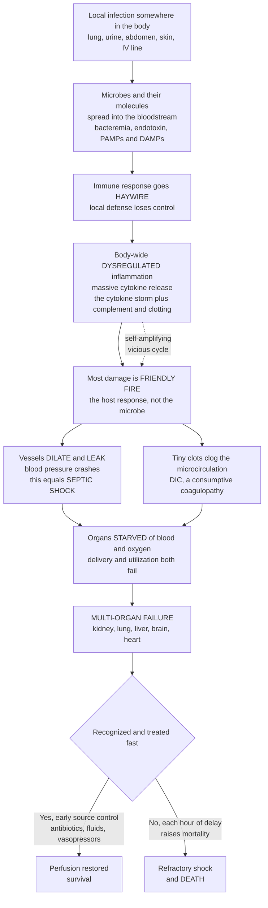

# 🌋 Sepsis and Systemic Infection

> [!abstract] TL;DR
> **Sepsis** is what happens when the body's response to an infection spins out of control and starts destroying the body itself. The modern definition (**Sepsis-3**) captures this exactly: sepsis is **life-threatening organ dysfunction caused by a *dysregulated host response* to infection** — not the infection alone. A local infection (pneumonia, a urinary or abdominal source, skin, an intravenous line) triggers the immune system, but instead of a contained, targeted battle the response becomes a **body-wide firestorm** — a massive, disordered release of inflammatory mediators (a **"cytokine storm"**) that also switches on the complement and coagulation cascades everywhere at once. The tragedy is that **most of the damage is friendly fire, not microbial toxicity**: blood vessels dilate and leak throughout the body so **blood pressure crashes (septic shock)**, tiny clots form and clog the microcirculation (**disseminated intravascular coagulation, DIC**), oxygen delivery and utilization fail, and organ after organ begins to shut down — kidneys (acute kidney injury), lungs (ARDS), liver, brain (encephalopathy), and heart (myocardial depression). **Septic shock** is the severe end: persistent hypotension needing vasopressors plus a rising lactate despite fluids — a form of **distributive shock** with very high mortality. It is a **time-critical emergency** where every hour of delay in antibiotics and resuscitation measurably raises the chance of death, and it remains one of the leading causes of death in hospitals worldwide. Sepsis is the ultimate example of a protective mechanism turned lethal — and the capstone that integrates infection, immunity, inflammation, hemostasis, and shock into one cascade.

---

## Intuition

**Analogy first — the fire brigade that burns down the house it came to save.** Imagine a small fire breaks out in one room of a large building — that is a localized infection. Normally the sprinkler system and a single fire crew show up, douse *that room*, and leave; the rest of the house is untouched. That is a healthy immune response: **targeted, local, and self-limiting.** The smoke and water damage are confined to where the fire was.

**Sepsis is what happens when the alarm system goes haywire and every sprinkler in the whole building fires at once, every fire crew in the city floods in, and they start smashing walls and flooding rooms that were never on fire.** The original fire might have been small — but the *response* is now a building-wide catastrophe. Water pours everywhere (vessels leak), the crews knock out load-bearing walls (organs fail), pipes burst and clog with debris (clots choke the microcirculation), and the water pressure across the whole system collapses (blood pressure crashes). **The building is being destroyed not by the fire, but by the overwhelming, indiscriminate response to it.**

That is the deep insight of sepsis. The microbe lit the match, but the lethal damage is done by the host's own **dysregulated immune and inflammatory reaction** — a "cytokine storm" that dilates and leaks vessels body-wide, throws clots into the smallest vessels, and starves organs of the blood and oxygen they need. Kidneys, lungs, liver, brain, and heart begin to fail one after another as the fluid crashes and the clots spread. It is a **medical emergency where every hour matters**, because sepsis can kill a previously healthy person within a day. Sepsis is the defense mechanism *becoming* the disease — the immune response, meant to save you, turning lethal.

---

## How It Works

### Core Mechanics

Sepsis is best understood as a **cascade from local to systemic**, where each step amplifies the last:

1. **A local infection establishes a focus.** Bacteria (most commonly), viruses, or fungi colonize a site — **lungs (pneumonia — the single most common source), urinary tract, abdomen/gut, skin and soft tissue, or an indwelling line/catheter**. Locally, this is exactly the inflammation you *want*.
2. **The infection or its molecules go systemic.** Microbes may invade the bloodstream directly (**bacteremia**), or — even without live microbes circulating — their molecular signatures spill body-wide: **PAMPs** (pathogen-associated molecular patterns such as **endotoxin/LPS** from Gram-negative bacteria) and **DAMPs** (damage-associated patterns from dying host cells). These are sensed by **pattern-recognition receptors** (e.g., Toll-like receptors) on immune cells everywhere at once.
3. **The host response becomes dysregulated — the key event.** Instead of a proportionate, contained reaction, the innate immune system launches a **massive, disordered systemic inflammatory response**: a flood of pro-inflammatory **cytokines** (TNF-α, IL-1, IL-6 — the **"cytokine storm"**), with simultaneous activation of the **complement** and **coagulation** cascades. **This dysregulation — not the microbe's direct toxicity — is what makes sepsis lethal.**
4. **Endothelial catastrophe.** The mediator storm turns the vast surface of the vascular **endothelium** from a well-behaved barrier into a leaking, vasodilating, pro-thrombotic sheet:
   - **Widespread vasodilation** (driven by **inducible nitric oxide, iNOS → NO**) collapses vascular tone → **hypotension**.
   - **Increased capillary permeability** — the endothelial barrier and its glycocalyx break down → plasma **leaks** into tissues → **edema** and a fall in circulating volume (**functional hypovolemia**).
   - **Microvascular thrombosis** — tissue factor is exposed and coagulation runs unchecked, throwing **microclots** throughout the capillary beds. Clotting factors and platelets are consumed faster than they are made → **disseminated intravascular coagulation (DIC)**, a *consumptive coagulopathy* that paradoxically causes both clotting *and* bleeding.
5. **Oxygen delivery and utilization both fail.** Hypotension and microclots cut oxygen *delivery*; simultaneously, mitochondria become unable to *use* the oxygen that does arrive (**cytopathic hypoxia**). Cells switch to anaerobic metabolism → **rising lactate**, the biochemical alarm of tissue hypoxia.
6. **Progressive multi-organ dysfunction.** Starved of perfusion, organs fail in sequence — **kidneys → acute kidney injury (oliguria, rising creatinine); lungs → ARDS (leaky alveoli, hypoxemia); liver → ischemic injury and cholestasis; brain → encephalopathy (confusion, reduced consciousness); heart → myocardial depression.** This aggregate failure is **multi-organ dysfunction syndrome (MODS)**, quantified clinically by the **SOFA score**.
7. **Septic shock — crossing the tipping point.** When circulatory, cellular, and metabolic failure becomes profound — **persistent hypotension requiring vasopressors to keep mean arterial pressure ≥ 65 mmHg *and* lactate > 2 mmol/L despite adequate fluid resuscitation** — the patient is in **septic shock**, the prototypical **distributive shock**, with the highest mortality.
8. **Why time is everything.** The cascade is **self-amplifying** (positive feedback): hypoperfusion worsens acidosis, acidosis blunts the vessels' response to the body's own catecholamines, capillary leak deepens hypovolemia, and DIC further chokes perfusion. Past a threshold the state becomes **refractory** — organs fail even if the microbe is later cleared. This is why **early recognition, source control, antimicrobials, and hemodynamic support** are life-saving and why **each hour of delay raises mortality**.

### Flow / Architecture



---

## Key Concepts

### Secondary (plain-language core)

- **Sepsis = the body's response to an infection turning against the body itself.** An infection somewhere sets off the immune system, but the reaction becomes a body-wide firestorm instead of a contained fight.
- **The damage is mostly "friendly fire."** Most of the harm in sepsis is done by the body's own overwhelming inflammatory reaction — the **"cytokine storm"** — not directly by the germ.
- **What goes wrong in the body:** blood vessels everywhere **dilate and leak**, so **blood pressure crashes** (this is **septic shock**); **tiny clots** clog small vessels; and organs — **kidneys, lungs, liver, brain, heart** — start to fail because they can't get enough blood and oxygen.
- **Where infections start:** most often the **lungs** (pneumonia), the **urine**, the **belly**, the **skin**, or an **IV line**.
- **It is a race against the clock.** Sepsis can kill a previously healthy person within a day, so doctors must act fast — find and treat the infection, give **antibiotics**, and support blood pressure. **Every hour of delay makes death more likely.**
- **Who is most at risk:** the **very young, the elderly, and people with weak immune systems** (chemotherapy, diabetes, chronic illness).

### Undergraduate (mechanisms and definitions)

- **Sepsis-3 definition.** Sepsis is **life-threatening organ dysfunction caused by a dysregulated host response to infection.** Operationally, organ dysfunction is flagged by an acute rise in the **SOFA score** of ≥ 2 points. The emphasis shifted (from the older 1991/2001 definitions) away from **SIRS** criteria and toward **organ dysfunction**, because the response — not merely the presence of inflammation — is what defines the danger.
- **SIRS vs sepsis vs septic shock.** **SIRS** (systemic inflammatory response syndrome — temperature, heart rate, respiratory rate, white-cell count derangements) is a *non-specific* systemic inflammatory state that can be sterile (trauma, pancreatitis, burns). **Sepsis** is SIRS-like physiology *plus infection plus organ dysfunction*. **Septic shock** is sepsis with profound circulatory and metabolic failure: **vasopressor-dependent hypotension (MAP ≥ 65 mmHg) plus lactate > 2 mmol/L despite adequate fluids.**
- **qSOFA and screening.** A rapid bedside screen — **qSOFA** — flags likely poor outcome with any two of: **respiratory rate ≥ 22, altered mentation, systolic BP ≤ 100 mmHg.** It is a prompt to escalate, not a diagnosis.
- **The pathophysiologic cascade (the core of the disease):**
  - **Recognition:** PAMPs (LPS/endotoxin, peptidoglycan, flagellin) and DAMPs bind pattern-recognition receptors (TLRs) → **NF-κB activation** → cytokine transcription.
  - **Cytokine storm:** early **TNF-α, IL-1β, IL-6**, then a cascade of chemokines and mediators; complement (C3a, C5a) and the coagulation system activate in parallel.
  - **Endothelial dysfunction:** the unifying lesion — **vasodilation** (iNOS/NO, prostacyclin), **capillary leak** (glycocalyx shedding, loosened junctions), and a **pro-thrombotic** surface.
  - **Consequences:** distributive **hypotension**, **hypovolemia** from leak, **DIC**, impaired oxygen delivery *and* utilization, and **multi-organ dysfunction**.
- **Target organs and their failures.** **Kidney → AKI** (prerenal + acute tubular necrosis); **lung → ARDS** (non-cardiogenic pulmonary edema, refractory hypoxemia); **liver → ischemic hepatitis/cholestasis**; **brain → septic encephalopathy**; **heart → sepsis-induced myocardial depression**; **hematologic → DIC/thrombocytopenia**.
- **Septic shock as distributive shock.** Unlike hypovolemic or cardiogenic shock, the *initial* problem is **loss of vascular tone** with a normal or high cardiac output ("warm shock"); leak and myocardial depression add hypovolemic and cardiogenic elements, producing a mixed picture as it progresses.
- **The time-critical management principle (educational, not individual advice).** The pillars are **early recognition and screening**, **source control** (drain the abscess, remove the infected line, relieve the obstruction), **prompt broad-spectrum antimicrobials**, **fluid resuscitation** to refill the leaking vasculature, **vasopressors** (norepinephrine first-line) to restore tone, and **lactate-guided resuscitation**. Retrospective data show mortality rising with each hour of delay in effective antibiotics — the empirical basis for "sepsis bundles."
- **Who is at risk.** Immunocompromised (chemotherapy, HIV, asplenia, immunosuppressants), **extremes of age** (neonates, the elderly), chronic disease (diabetes, cirrhosis, renal failure), indwelling devices, and recent surgery.

### Graduate (integrative and quantitative depth)

- **Beyond "cytokine storm" — a two-phase immune dysregulation.** Sepsis is not purely hyperinflammatory. An early, exuberant pro-inflammatory surge is accompanied and followed by a **compensatory anti-inflammatory response syndrome (CARS)** and **immunoparalysis** — lymphocyte apoptosis, T-cell exhaustion, monocyte deactivation (reduced HLA-DR), and endotoxin tolerance. This **immunosuppressed** later phase explains secondary/opportunistic infections and much of the *late* mortality, and it is why blanket anti-cytokine therapy in trials (anti-TNF, IL-1ra) largely failed — the immune state is heterogeneous and time-varying.
- **Endothelial glycocalyx and vascular barrier biology.** The **endothelial glycocalyx** — a proteoglycan/glycoprotein gel lining vessels — is shed in sepsis (syndecan-1, heparan sulfate released), unmasking adhesion molecules, worsening permeability, and disrupting the **Starling** balance. The revised (Michel–Weinbaum) glycocalyx model reframes why aggressive crystalloid loading can worsen edema without durably filling the intravascular space.
- **Coagulation–inflammation crosstalk (thromboinflammation).** Sepsis blurs the line between clotting and immunity: **tissue factor** on activated monocytes and endothelium triggers thrombin; **NETosis** (neutrophil extracellular traps) provides scaffolds for microthrombi; natural anticoagulants (**activated protein C, antithrombin, TFPI**) are consumed and downregulated. The result is **DIC** — simultaneous microvascular thrombosis (organ ischemia) and factor/platelet consumption (bleeding). This is the mechanistic bridge to hemostasis and bleeding disorders.
- **The DO₂–VO₂ relationship and cytopathic hypoxia.** Oxygen **delivery** (DO₂ = cardiac output × arterial O₂ content) falls; below a **critical DO₂**, consumption becomes supply-dependent and lactate climbs. Uniquely in sepsis, even *restored* macro-hemodynamics may not fix tissue oxygenation because of **microcirculatory shunting** (heterogeneous capillary flow) and **cytopathic/mitochondrial hypoxia** — cells cannot utilize delivered oxygen (mitochondrial dysfunction, possibly involving NO/peroxynitrite inhibition of the electron transport chain). Hence lactate can stay high despite a "corrected" blood pressure.
- **Lactate is multifactorial.** Elevated lactate in sepsis reflects anaerobic glycolysis **and** catecholamine-driven aerobic glycolysis (β2-stimulated Na⁺/K⁺-ATPase) **and** impaired hepatic clearance. **Lactate trajectory/clearance** over hours predicts outcome better than a single value.
- **Sepsis as a nonlinear, tipping-point system.** The compensated-to-decompensated transition behaves like a **bifurcation**: baroreflex and neurohumoral negative-feedback control (sympathetic tone, RAAS, vasopressin) hold pressure until reinforcing positive-feedback loops — vasoplegia, acidosis-blunted vasoreactivity, capillary leak, DIC, myocardial depression — overwhelm it, producing an abrupt, hysteretic collapse that resists reversal. This is the systems-level reason late septic shock is "irreversible" even after antimicrobials clear the organism.
- **Vasoplegia pharmacology.** Catecholamine-refractory vasodilation arises from **iNOS/NO–cGMP** smooth-muscle relaxation, **ATP-sensitive K⁺-channel** opening, **relative vasopressin deficiency**, and adrenergic-receptor downregulation — the rationale for **norepinephrine** first-line, added **vasopressin**, and, in refractory cases, **angiotensin II** or methylene blue.
- **Epidemiology and burden.** Sepsis accounts for roughly **11 million deaths per year worldwide** (~20% of all global deaths by the 2020 GBD estimate) and is a leading cause of in-hospital death and ICU admission — the empirical stakes behind the "time-critical" framing.

---

## Python Demo

```python
# Sepsis and Systemic Infection -- four conceptual views (numpy + matplotlib).
# (a) DYSREGULATED RESPONSE: a normal LOCALIZED immune response rises then RESOLVES,
#     versus a SEPSIS trajectory where inflammation escalates SYSTEM-WIDE past a
#     tipping point and never resolves.
# (b) TIME-CRITICAL PHYSIOLOGY: as sepsis progresses over hours, mean arterial
#     pressure (MAP) is held near-normal, then CRASHES past a tipping point while the
#     organ-dysfunction (SOFA-like) score climbs -- the slide into septic shock.
# (c) EARLY vs DELAYED intervention: treating early caps the organ-dysfunction
#     trajectory low; each hour of delay lets it climb higher (worse outcome).
# (d) MORTALITY vs TREATMENT DELAY: modeled mortality rises with each hour of delay
#     to effective antibiotics -- the empirical basis of "sepsis bundles."
# NOTE: illustrative qualitative models, NOT calibrated clinical values or advice.
import numpy as np
import matplotlib.pyplot as plt

fig, ax = plt.subplots(2, 2, figsize=(13.5, 9.5))

# -------------------------------------------------------------------
# (a) Localized (resolves) vs systemic sepsis (escalates past a tipping point).
# -------------------------------------------------------------------
t = np.linspace(0, 48, 600)                        # hours since infection
# Normal LOCAL response: sharp rise then active resolution back to baseline.
local = np.exp(-t / 9.0) - np.exp(-t / 1.6)
local = local / local.max()
# SEPSIS: escalates to a high, sustained systemic plateau (dysregulated, no resolution).
tip_a = 12.0
sepsis_inflam = 1.0 / (1.0 + np.exp(-0.45 * (t - tip_a)))   # sigmoid to ~1.0

ax[0, 0].plot(t, local, color="mediumseagreen", lw=2.6, label="Normal local response (resolves)")
ax[0, 0].plot(t, sepsis_inflam, color="crimson", lw=2.6, label="Sepsis (escalates system-wide)")
ax[0, 0].axvline(tip_a, color="black", ls=":", lw=1.4)
ax[0, 0].annotate("tipping point:\nresponse goes systemic", xy=(tip_a, 0.5),
                  xytext=(tip_a + 3, 0.30), arrowprops=dict(arrowstyle="->"), fontsize=8.5)
ax[0, 0].set_title("(a) Localized response resolves; sepsis escalates")
ax[0, 0].set_xlabel("Hours since infection")
ax[0, 0].set_ylabel("Systemic inflammatory activity")
ax[0, 0].set_ylim(0, 1.15)
ax[0, 0].legend(fontsize=8, loc="center right")

# -------------------------------------------------------------------
# (b) Blood pressure crashes while organ-dysfunction score climbs.
# -------------------------------------------------------------------
tip_b = 14.0
MAP = 55.0 + 40.0 / (1.0 + np.exp(0.55 * (t - tip_b)))       # 95 -> ~55 mmHg
SOFA = 14.0 / (1.0 + np.exp(-0.35 * (t - tip_b)))            # 0 -> ~14 points

axb = ax[0, 1]
l1, = axb.plot(t, MAP, color="crimson", lw=2.6, label="Mean arterial pressure (mmHg)")
axb.axhline(65, color="gray", ls="--", lw=1.0)
axb.text(1, 67, "MAP 65 threshold", fontsize=7.5, color="gray")
axb.axvspan(0, tip_b, color="mediumseagreen", alpha=0.12)
axb.axvspan(tip_b, 48, color="dimgray", alpha=0.14)
axb.text(6, 100, "sepsis", fontsize=9, color="green", ha="center")
axb.text(31, 100, "SEPTIC SHOCK", fontsize=9, color="black", ha="center")
axb.set_title("(b) MAP crashes as organ-dysfunction score climbs")
axb.set_xlabel("Hours since infection")
axb.set_ylabel("MAP (mmHg)", color="crimson")
axb.set_ylim(40, 110)
axr = axb.twinx()
l2, = axr.plot(t, SOFA, color="darkviolet", lw=2.4, ls="--", label="Organ-dysfunction score (SOFA-like)")
axr.set_ylabel("SOFA-like score", color="darkviolet")
axr.set_ylim(0, 16)
axb.legend(handles=[l1, l2], fontsize=8, loc="center left")

# -------------------------------------------------------------------
# (c) Early vs delayed intervention shapes the organ-dysfunction trajectory.
# -------------------------------------------------------------------
def sofa_with_treatment(t, t_treat, k_up=0.35, cap_slope=0.9):
    # Rises like untreated sepsis until treatment; afterward the climb is damped
    # and the score is pinned to whatever level it had reached (worse if treated late).
    base = 14.0 / (1.0 + np.exp(-k_up * (t - 14.0)))
    level_at_treat = 14.0 / (1.0 + np.exp(-k_up * (t_treat - 14.0)))
    treated = np.where(
        t <= t_treat,
        base,
        level_at_treat + (base - level_at_treat) * np.exp(-cap_slope * (t - t_treat)) * 0.0
        + level_at_treat * np.exp(-0.06 * (t - t_treat))   # gentle recovery after control
    )
    return treated

for t_treat, col, lab in [(3.0, "seagreen", "Treated early (hour 3)"),
                          (12.0, "darkorange", "Treated late (hour 12)"),
                          (24.0, "crimson", "Treated very late (hour 24)")]:
    ax[1, 0].plot(t, sofa_with_treatment(t, t_treat), color=col, lw=2.4, label=lab)
    ax[1, 0].axvline(t_treat, color=col, ls=":", lw=1.1)

ax[1, 0].set_title("(c) Early intervention caps organ dysfunction")
ax[1, 0].set_xlabel("Hours since infection")
ax[1, 0].set_ylabel("Organ-dysfunction score (SOFA-like)")
ax[1, 0].set_ylim(0, 16)
ax[1, 0].legend(fontsize=8, loc="upper left")

# -------------------------------------------------------------------
# (d) Modeled mortality rises with each hour of delay to antibiotics.
# -------------------------------------------------------------------
delay = np.linspace(0, 24, 300)                    # hours to effective antibiotics
# Sigmoid from a baseline mortality up toward a high plateau; ~7-8 pct-points per early hour.
mortality = 20.0 + 62.0 / (1.0 + np.exp(-0.28 * (delay - 8.0)))

axd = ax[1, 1]
axd.plot(delay, mortality, color="firebrick", lw=2.8)
axd.fill_between(delay, 0, mortality, color="firebrick", alpha=0.10)
for h in [0, 6, 12, 18]:
    m = 20.0 + 62.0 / (1.0 + np.exp(-0.28 * (h - 8.0)))
    axd.plot(h, m, "o", color="black", ms=5)
    axd.annotate(f"{m:.0f}%", xy=(h, m), xytext=(h + 0.4, m + 3), fontsize=8.5)
axd.set_title("(d) Mortality rises with each hour of treatment delay")
axd.set_xlabel("Hours of delay to effective antibiotics")
axd.set_ylabel("Modeled mortality (%)")
axd.set_ylim(0, 100)
axd.set_xlim(0, 24)

fig.suptitle("Sepsis: a dysregulated response that escalates system-wide, crashes "
             "perfusion, and is time-critical to treat", fontsize=12)
fig.tight_layout(rect=[0, 0, 1, 0.96])
plt.savefig("sepsis_and_systemic_infection.png", dpi=130)
plt.show()
```

**What the plots show.** Panel **(a)** contrasts the two fates of an immune response: the **normal, localized** reaction (green) spikes and then *actively resolves* back to baseline once the threat is cleared, while the **sepsis** trajectory (red) escalates **system-wide past a tipping point** and never comes down — dysregulation, not clearance. Panel **(b)** is the slide into **septic shock**: mean arterial pressure is held near-normal through the compensated phase and then **crashes past a tipping point** below the 65 mmHg line, exactly as the **organ-dysfunction (SOFA-like) score climbs** — perfusion failing and organs going down together. Panel **(c)** is the whole point of urgency: **treating early (hour 3, green) caps** the organ-dysfunction trajectory low, while each hour of delay lets it climb higher before it can be arrested — *when* you intervene changes the ceiling. Panel **(d)** makes the "time-critical" principle quantitative: **modeled mortality rises with each hour of delay** to effective antibiotics — the empirical logic behind sepsis "bundles" and hour-1 resuscitation. (All curves are qualitative teaching models, not calibrated clinical data.)

---

## Real-World Applications

> **Example — the "Sepsis Six" / hour-1 bundle in emergency and critical care.** Sepsis is the archetype of a disease where a **protocolized, time-boxed** response saves lives, precisely because the pathophysiology is a self-amplifying cascade that becomes irreversible past a tipping point. The **Surviving Sepsis Campaign** bundle operationalizes the mechanism: **measure lactate** (read tissue hypoxia), **draw blood cultures before antibiotics** (identify the source), **give broad-spectrum antibiotics** (attack the trigger before delay compounds mortality — panel d), **start fluid resuscitation** (refill the leaking, vasodilated vasculature), and **add vasopressors** (norepinephrine) if hypotension persists (restore vascular tone). **Source control** — draining an abscess, removing an infected central line, relieving an obstructed ureter or bile duct — is the step that stops the cascade at its origin. **Lactate clearance** and **repeat SOFA** track whether perfusion is being restored.

- **The Sepsis-3 criteria in triage.** **qSOFA** (RR ≥ 22, altered mentation, SBP ≤ 100) is used at the bedside/ward to flag patients who need escalation; the full **SOFA** score quantifies multi-organ dysfunction in the ICU and defines sepsis and septic shock for research and audit.
- **Neonatal and immunocompromised sepsis.** Neutropenic patients (post-chemotherapy) and neonates can deteriorate with minimal early signs, so **febrile neutropenia** and neonatal sepsis are treated as emergencies with immediate empiric antibiotics — a direct application of the "every hour counts" principle to the highest-risk groups.
- **Cytokine-storm syndromes beyond bacteria.** The same host-response physiology underlies **severe COVID-19**, **CAR-T-cell therapy cytokine release syndrome**, and **hemophagocytic lymphohistiocytosis (HLH)** — treated with targeted immunomodulation (dexamethasone, **IL-6 blockade/tocilizumab**, IL-1 blockade), illustrating that the "storm" is a shared final pathway, not unique to infection.
- **DIC and transfusion support.** Recognizing sepsis-associated **DIC** (falling platelets, prolonged clotting times, rising D-dimer, falling fibrinogen) guides supportive transfusion and links sepsis directly to the hemostasis/coagulation domain.
- **Antimicrobial stewardship tension.** The mandate for *immediate broad-spectrum* antibiotics in suspected sepsis is in constant, deliberate tension with **stewardship** (de-escalating once cultures return) — a real-world trade-off between the time-critical mortality curve and resistance/collateral harm.

---

## Common Pitfalls

- **Thinking the microbe does the killing.** The defining insight of Sepsis-3 is that the lethal damage is the **dysregulated host response** — vasodilation, capillary leak, DIC, and organ failure — not direct microbial toxicity. Sterilizing the blood does not instantly reverse the cascade once it has crossed the tipping point.
- **Waiting for hypotension to call it sepsis.** Organ dysfunction and rising lactate can precede a blood-pressure crash; the compensated phase looks deceptively stable (panel b), especially in the young and fit, who then decompensate **abruptly**. "Normal" blood pressure is not reassurance.
- **Equating SIRS with sepsis.** SIRS is non-specific and can be sterile (pancreatitis, trauma, burns); sepsis requires **infection plus organ dysfunction**. Sepsis-3 deliberately de-emphasized SIRS because it was too sensitive and non-specific.
- **Under-appreciating the clock.** Each hour of delay to effective antibiotics is associated with rising mortality (panel d). Treating sepsis as a routine infection to be worked up slowly is a fatal category error.
- **Ignoring source control.** Antibiotics and pressors buy time, but if the driver is an undrained abscess, an infected line, or an obstructed viscus, the cascade will not stop until the **source is physically controlled**.
- **Chasing blood pressure while missing the microcirculation.** Restoring MAP and cardiac output does not guarantee tissue oxygenation — **microcirculatory shunting and cytopathic (mitochondrial) hypoxia** can keep lactate elevated. The pressure gauge is not the whole story.
- **Assuming sepsis is "just" hyperinflammation.** A later **immunoparalysis** phase (lymphocyte apoptosis, monocyte deactivation) drives secondary infections and late deaths — one reason blanket anti-cytokine therapies failed in trials. The immune state is heterogeneous and evolves over time.
- **Over-resuscitating with fluid.** Because the vasculature is leaking (glycocalyx shed), aggressive crystalloid can worsen edema (pulmonary, tissue) without durably filling the intravascular space — balance, not volume for its own sake, is the goal.
- **Reading this as clinical guidance.** This note is **educational pathophysiology** at textbook level, not advice for managing any individual patient — real management always depends on a clinician and the specifics of the case.

---

## Related Concepts

**Within this vault (siblings, referenced in prose).** Sepsis is the **convergence point** of the immune/infectious section, so it leans on its siblings rather than duplicating them. *Infectious_Disease_and_Host_Pathogen_Interaction* supplies the upstream story — how microbes establish infection and how the host normally contains them — which sepsis then shows going catastrophically wrong. *Inflammation_and_Tissue_Repair* provides the mediator machinery (cytokines, complement, endothelial activation) that, when systemic and unresolved, *becomes* the cytokine storm. *Hemostasis_Thrombosis_and_Bleeding_Disorders* underlies **DIC**, the consumptive coagulopathy that clots the microvasculature and bleeds simultaneously. *Shock_and_Circulatory_Collapse* is the mechanistic companion to **septic shock** as the archetypal **distributive** shock, developing the compensation-to-decompensation trajectory only summarized here. And *Pulmonary_Infections_and_Respiratory_Failure* connects the most common septic source (pneumonia) and a key downstream failure (**ARDS**). (These are prose references because they are siblings within the Clinical Medicine vault.)

**Across the vault (Glob-verified links).**

- [[Clinical_Medicine/01_Foundations_of_Disease_and_Pathophysiology/Cellular_Injury_and_Adaptation|Cellular Injury and Adaptation]] — the cellular endpoint: hypoxia → ATP failure → the reversible-to-irreversible threshold that mirrors the compensated-to-refractory course of sepsis.
- [[Clinical_Medicine/01_Foundations_of_Disease_and_Pathophysiology/Clinical_Medicine_and_Pathophysiology_Overview|Clinical Medicine and Pathophysiology Overview]] — frames sepsis as the exemplary "protective mechanism turned harmful," the vault's central theme of disease as broken homeostasis.
- [[Clinical_Medicine/03_Metabolic_Endocrine_and_Renal/Renal_Pathophysiology_and_Kidney_Disease|Renal Pathophysiology and Kidney Disease]] — **acute kidney injury** is one of the earliest and commonest organ failures in sepsis (oliguria, rising creatinine).
- [[Clinical_Medicine/02_Cardiovascular_and_Respiratory_Disease/Respiratory_Pathophysiology|Respiratory Pathophysiology]] — the mechanics of gas exchange whose failure becomes **ARDS**, sepsis's signature lung injury.
- [[Biology/11_Microbiology_and_Immunology/The_Innate_Immune_System|The Innate Immune System]] — the pattern-recognition receptors, phagocytes, complement, and cytokines whose **dysregulation** produces the cytokine storm.
- [[Biology/11_Microbiology_and_Immunology/The_Adaptive_Immune_System|The Adaptive Immune System]] — the lymphocyte compartment whose exhaustion and apoptosis drive the late **immunoparalysis** phase of sepsis.
- [[Biology/11_Microbiology_and_Immunology/Bacteria_and_Archaea|Bacteria and Archaea]] — the microbial triggers, including **Gram-negative endotoxin (LPS)**, the prototypical PAMP that ignites the response.
- [[Biology/09_Human_Physiology_and_Anatomy/The_Circulatory_and_Respiratory_Systems|The Circulatory and Respiratory Systems]] — the vascular bed and gas-exchange physiology that vasodilation, capillary leak, and ARDS disrupt.
- [[Health_Nutrition_and_Longevity/06_Public_Health_and_Prevention/Infectious_Disease_Vaccines_and_Immunity|Infectious Disease, Vaccines and Immunity]] — the population-level view of the infections that seed sepsis, and prevention (vaccination, infection control) as the first line of defense.
- [[Systems_Thinking_and_Complexity/04_Dynamics_and_Modeling/Bifurcations_and_Tipping_Points|Bifurcations and Tipping Points]] — the general theory of why a stable-looking system crosses a threshold and collapses abruptly, the abstract form of the slide into septic shock.
- [[Systems_Thinking_and_Complexity/03_Networks_and_Connectivity/Cascades_and_Systemic_Risk|Cascades and Systemic Risk]] — organ-by-organ failure as a **cascade** through a coupled system, the systemic-risk view of multi-organ dysfunction.
- [[Systems_Thinking_and_Complexity/01_Foundations_of_Systems_Thinking/Feedback_Loops_and_Causality|Feedback Loops and Causality]] — the negative-feedback compensation (baroreflex, RAAS) versus the reinforcing positive-feedback vicious cycles (vasoplegia, leak, DIC) that make late sepsis irreversible.

---

## Review Questions

**Secondary**
1. Using the "fire brigade" analogy, explain why doctors say that in sepsis "the body's own response does most of the damage, not the germ." What does it mean when blood pressure "crashes," and why is sepsis called an emergency where every hour matters?
2. Name three common places an infection can start that lead to sepsis, and list three of the organs that begin to fail as sepsis worsens. Why are the very young, the elderly, and people with weak immune systems most at risk?

**Undergraduate**
3. State the **Sepsis-3** definition of sepsis and the specific criteria that distinguish **septic shock** from sepsis. Then explain the difference between **SIRS**, **sepsis**, and **septic shock**, and why the Sepsis-3 authors shifted the definition away from SIRS toward organ dysfunction.
4. Trace the pathophysiologic cascade from a local infection to multi-organ failure, naming (a) how the infection becomes systemic (PAMPs/DAMPs, bacteremia), (b) the three endothelial consequences of the cytokine storm (vasodilation, capillary leak, microvascular thrombosis), and (c) why septic shock is classified as **distributive** shock.

**Graduate**
5. Sepsis involves *both* a hyperinflammatory "cytokine storm" *and* a later **immunoparalysis** phase. Describe the mechanisms of each phase and use this two-phase model to explain why anti-cytokine monotherapies (anti-TNF, IL-1ra) largely failed in clinical trials, and why some patients die of secondary infections late in the course.
6. Explain why **lactate can remain elevated in septic shock even after mean arterial pressure and cardiac output are restored.** Invoke the DO₂–VO₂ relationship, microcirculatory shunting, cytopathic (mitochondrial) hypoxia, and the multifactorial sources of lactate. Then model the compensated-to-decompensated transition as a **bifurcation** in coupled feedback loops, identifying the dominant negative-feedback control and at least three reinforcing positive-feedback loops that make late septic shock resistant to reversal.

---

## Sources

- Singer, M., Deutschman, C. S., Seymour, C. W., et al. (2016). "The Third International Consensus Definitions for Sepsis and Septic Shock (Sepsis-3)." *JAMA*, 315(8), 801–810.
- Loscalzo, J., Fauci, A., Kasper, D., et al. (eds.). *Harrison's Principles of Internal Medicine* (21st ed.). McGraw-Hill — "Sepsis and Septic Shock."
- Kumar, V., Abbas, A. K., & Aster, J. C. *Robbins & Cotran Pathologic Basis of Disease* (10th ed.). Elsevier — "Hemodynamic Disorders, Thromboembolic Disease, and Shock" (sepsis, SIRS, DIC).
- Evans, L., Rhodes, A., Alhazzani, W., et al. (2021). "Surviving Sepsis Campaign: International Guidelines for Management of Sepsis and Septic Shock 2021." *Critical Care Medicine* / *Intensive Care Medicine*.
- Rudd, K. E., Johnson, S. C., Agesa, K. M., et al. (2020). "Global, regional, and national sepsis incidence and mortality, 1990–2017." *The Lancet*, 395(10219), 200–211.

---

#clinical-medicine #sepsis #septic-shock #cytokine-storm #multi-organ-failure
