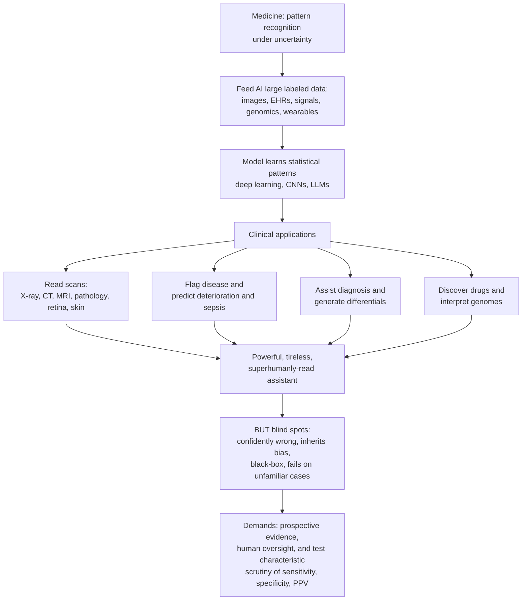

# 🩺 AI and Technology in Clinical Medicine

> [!abstract] TL;DR
> Medicine is full of pattern-recognition-under-uncertainty tasks — reading a scan, recognising a disease from a cluster of symptoms, predicting who will deteriorate — and modern machine learning has become remarkably good at exactly these tasks; but a medical AI model is just another diagnostic test, so it must be evaluated with the same sensitivity/specificity/predictive-value thinking, held to the same evidence bar, and kept under human oversight, precisely because it can be confidently wrong, inherit bias against under-represented groups, hide its reasoning, and fail on cases unlike its training.

---

## Intuition

**Analogy:** Imagine giving every clinician a tireless, blazing-fast, superhumanly-well-read assistant that never forgets a case and can scan a million images without getting bored or tired. Feed a deep-learning model a million labelled chest X-rays and it learns to flag pneumonia; show it retinal photographs and it detects diabetic eye disease about as well as a specialist; give it a patient's live data stream and it can warn of sepsis hours before a human would notice. That is what AI offers medicine.

But it is an assistant with serious blind spots. It can be *confidently* wrong. It inherits and amplifies the biases baked into its training data, so it may quietly perform worse for groups that were under-represented when it learned. It often cannot explain *why* it reached a conclusion — the "black box" problem. And it can fail catastrophically on a case that looks unlike anything it was trained on. So the promise is enormous (earlier diagnosis, fewer errors, expanded access, less drudgery) and so are the perils — which is exactly why medical AI demands the same rigorous evidence, the same test-characteristic thinking, and the same human oversight that the rest of clinical reasoning teaches. AI will not replace doctors; but doctors who use AI well may replace those who do not.

---

## How It Works

### Core Mechanics

1. **Frame the clinical task as prediction.** "Is there pneumonia on this X-ray?", "Will this ICU patient deteriorate in the next 6 hours?", and "Which drug target is worth pursuing?" all reduce to mapping input data to an output label or score.
2. **Gather large, labelled data.** Medicine now generates enormous volumes of it: imaging (radiographs, CT, MRI, digital pathology, retinal and skin photos), electronic health records (EHRs), genomic sequences, continuous waveforms (ECG, EEG), and wearable streams.
3. **Train a model to learn the pattern.** For images and signals this is usually **deep learning** — especially convolutional neural networks that learn hierarchical features (edges → textures → lesions) directly from pixels, rather than hand-crafted rules.
4. **Set an operating threshold.** The model outputs a continuous score; a chosen cutoff converts it into a decision. Moving that cutoff trades **false alarms** (false positives) against **misses** (false negatives) — the same sensitivity/specificity trade-off as any diagnostic test.
5. **Validate as a test, not as magic.** Measure sensitivity, specificity, predictive value, ROC/AUC, and calibration — ideally on prospective, external, multi-site data, and ultimately in trials that show it improves *patient outcomes*, not just accuracy on a benchmark.
6. **Deploy under human oversight.** The model augments a clinician who retains responsibility, watches for out-of-distribution inputs, and guards against automation bias.

### Flow / Architecture



---

## Key Concepts

### Secondary (intuitive foundation)

- **Why medicine suits AI.** Much of clinical work is recognising patterns amid uncertainty, and medicine now produces mountains of data. Computers that learn patterns from data are a natural fit.
- **Training by example.** You do not program the rules; you show the model many labelled examples (this X-ray *has* pneumonia, this one does not) and it learns the pattern itself.
- **It is still just a test.** An AI that says "90% chance of disease" is making a prediction that can be right or wrong — exactly like a blood test, and it must be checked the same way.
- **The catch.** A tool trained mostly on one kind of patient may work poorly on another, and it usually cannot tell you *why* it decided what it did.

### Undergraduate (mechanism and evaluation)

- **Deep learning and CNNs.** Convolutional neural networks are the workhorse of medical imaging; they learn features directly from pixels and now match specialists on tasks like diabetic retinopathy screening and some radiology and dermatology reads.
- **The evaluation link.** A medical AI model *is* a classifier, so it is graded with the same instruments as any diagnostic test: **sensitivity** (catches disease when present), **specificity** (stays quiet when absent), **positive/negative predictive value** (which depend on prevalence), and the **ROC curve / AUC** summarising every possible threshold.
- **Calibration.** Beyond ranking, a well-calibrated model's "80% risk" should mean roughly 80% of such patients actually have the outcome — critical when the score drives treatment decisions.
- **Application families.** Medical imaging (most mature); clinical prediction and early-warning from EHRs (sepsis, deterioration, readmission, triage); diagnostic assistance (differential generation, rare-disease matching); genomics and drug discovery (variant interpretation, target discovery, molecular and protein-structure prediction); NLP and large language models on clinical text (note summarisation, question answering, ambient scribing); plus surgical robotics, monitoring/wearables, and operational uses.

### Graduate (failure modes and governance)

- **Algorithmic bias and health equity.** Models trained on skewed data underperform for under-represented groups and can encode historical disparities. A landmark study (Obermeyer 2019) showed a widely used risk algorithm used *healthcare cost* as a proxy for *health need*; because less money was historically spent on Black patients, the model systematically under-triaged them at equal illness.
- **Distribution shift and brittleness.** Performance degrades when deployment data differ from training data — a different scanner, hospital, population, or a drift over time (dataset shift). Models also latch onto **spurious shortcuts** (e.g. learning a hospital's marker token rather than the pathology).
- **The black-box problem.** Deep models are hard to interpret; post-hoc methods (saliency maps, SHAP, LIME) help but can mislead, and interpretability is contested as a substitute for validation.
- **Automation bias and deskilling.** Clinicians may over-trust confident outputs and let skills atrophy; conversely, alert fatigue causes them to ignore even correct warnings.
- **The evidence bar and regulation.** Serious deployment needs prospective, external validation and ideally randomised trials of clinical *outcomes*, plus regulatory clearance as "Software as a Medical Device" (FDA / CE), with special frameworks for models that keep learning after approval. Liability, privacy, and continuous post-market monitoring round out the governance picture.

---

## Python Demo

```python
# Medical AI evaluated as a diagnostic test.
# Panel 1: a model's ROC curve + one operating threshold (false alarms vs misses).
# Panel 2: algorithmic BIAS -- the AUC gap between a well-represented group and an
#          under-represented group the model saw far fewer examples of.
import numpy as np
import matplotlib.pyplot as plt

rng = np.random.default_rng(7)

def simulate(n_pos, n_neg, sep):
    """Model scores: diseased patients score higher by `sep`; both unit variance.
    Larger `sep` == better separation == better model for that subgroup."""
    pos = rng.normal(sep, 1.0, n_pos)   # diseased
    neg = rng.normal(0.0, 1.0, n_neg)   # healthy
    scores = np.concatenate([pos, neg])
    labels = np.concatenate([np.ones(n_pos), np.zeros(n_neg)]).astype(int)
    return labels, scores

def roc_curve(y, s):
    order = np.argsort(-s)                 # rank by score, most "diseased" first
    y = y[order]
    P, N = y.sum(), (1 - y).sum()
    tpr = np.concatenate([[0.0], np.cumsum(y) / P])        # sensitivity
    fpr = np.concatenate([[0.0], np.cumsum(1 - y) / N])    # 1 - specificity
    return fpr, tpr

def auc(fpr, tpr):
    return np.trapz(tpr, fpr)              # area under the ROC curve

# Majority group: model trained on plenty of data -> strong separation.
y_maj, s_maj = simulate(500, 500, sep=1.6)
# Under-represented group: the model saw few examples -> weaker separation = BIAS.
y_min, s_min = simulate(60, 60, sep=0.7)

fpr_maj, tpr_maj = roc_curve(y_maj, s_maj)
fpr_min, tpr_min = roc_curve(y_min, s_min)
auc_maj, auc_min = auc(fpr_maj, tpr_maj), auc(fpr_min, tpr_min)

# One clinical operating point on the majority model.
thr = 0.8
pred = (s_maj >= thr).astype(int)
tp = np.sum((pred == 1) & (y_maj == 1)); fn = np.sum((pred == 0) & (y_maj == 1))
tn = np.sum((pred == 0) & (y_maj == 0)); fp = np.sum((pred == 1) & (y_maj == 0))
sens = tp / (tp + fn)   # sensitivity  = true positive rate
spec = tn / (tn + fp)   # specificity  = 1 - false positive rate
print(f"Threshold {thr}: sensitivity={sens:.2f}, specificity={spec:.2f}, "
      f"false alarms={fp}, missed cases={fn}")
print(f"AUC majority={auc_maj:.2f}  |  AUC under-represented={auc_min:.2f}  "
      f"|  bias gap={auc_maj - auc_min:.2f}")

fig, ax = plt.subplots(1, 2, figsize=(12, 5))

# Panel 1: the model as a diagnostic test.
ax[0].plot(fpr_maj, tpr_maj, color="C0", lw=2, label=f"Model ROC (AUC={auc_maj:.2f})")
ax[0].plot([0, 1], [0, 1], "k--", lw=1, label="Chance (AUC=0.50)")
ax[0].scatter([1 - spec], [sens], color="crimson", zorder=5, s=60,
              label=f"Threshold {thr}: sens={sens:.2f}, spec={spec:.2f}")
ax[0].set_xlabel("False Positive Rate = 1 - Specificity  (false alarms)")
ax[0].set_ylabel("True Positive Rate = Sensitivity  (catches)")
ax[0].set_title("Medical AI as a diagnostic test: ROC")
ax[0].legend(loc="lower right"); ax[0].grid(alpha=0.3)

# Panel 2: algorithmic bias -- the performance gap across subgroups.
ax[1].plot(fpr_maj, tpr_maj, color="C0", lw=2, label=f"Majority group (AUC={auc_maj:.2f})")
ax[1].plot(fpr_min, tpr_min, color="C3", lw=2, label=f"Under-represented (AUC={auc_min:.2f})")
ax[1].plot([0, 1], [0, 1], "k--", lw=1, label="Chance")
ax[1].fill_between(fpr_maj, tpr_maj, np.interp(fpr_maj, fpr_min, tpr_min),
                   color="orange", alpha=0.25, label="Gap = bias")
ax[1].set_xlabel("False Positive Rate")
ax[1].set_ylabel("True Positive Rate")
ax[1].set_title(f"Algorithmic bias: AUC gap = {auc_maj - auc_min:.2f}")
ax[1].legend(loc="lower right"); ax[1].grid(alpha=0.3)

plt.tight_layout()
plt.savefig("medical_ai_evaluation.png", dpi=120)
plt.show()
```

The first panel makes the central point: a medical AI model is graded with the *same* ROC/sensitivity/specificity tools as any lab test, and choosing a threshold means choosing how many false alarms you will tolerate to avoid misses. The second panel makes the perilous point: an identical model can be excellent for a well-represented group and mediocre for an under-represented one, and that AUC gap *is* the algorithmic bias that threatens health equity.

---

## Real-World Applications

> **Diabetic retinopathy screening (Google Health / IDx-DR).** A deep CNN reads retinal fundus photographs to detect diabetic eye disease at specialist-level sensitivity; IDx-DR became one of the first autonomous AI diagnostics cleared by the FDA — a concrete example of imaging AI validated as a diagnostic test and regulated as Software as a Medical Device.

> **Sepsis and deterioration early-warning (EHR models).** Systems such as Epic's sepsis model and academic early-warning scores mine live EHR data to flag deterioration hours before staff notice. They also illustrate the perils: external validation of the Epic model found far weaker real-world performance than advertised, underscoring the need for independent, prospective evaluation.

> **Protein structure and drug discovery (AlphaFold).** DeepMind's AlphaFold predicts 3D protein structure from sequence with startling accuracy, accelerating target discovery and structure-based drug design — an example of AI compressing years of experimental work.

> **Ambient documentation (clinical LLMs).** Large language models now draft clinical notes from ambient conversation (e.g. Nuance DAX, Abridge), summarise records, and answer questions — attacking clinician burnout and documentation burden, while raising fresh worries about hallucination, privacy, and unverified output.

---

## Common Pitfalls

- **Grading on the wrong test set.** Reporting accuracy on data drawn from the *same* hospital and time as training. Real validation is prospective, external, and multi-site; internal AUC routinely collapses on deployment.
- **Ignoring prevalence.** A model with 99% sensitivity and specificity still yields mostly false positives when the disease is rare — predictive value depends on prevalence, so headline accuracy misleads.
- **Confusing accuracy with benefit.** A more accurate score does not guarantee better patient outcomes; only trials of the *deployed workflow* prove that. Many "superhuman" models never change a single decision.
- **Blind trust in the black box (automation bias).** Over-trusting confident outputs, or drowning in false alarms until real ones are ignored (alert fatigue). Human oversight and good thresholds matter as much as model quality.
- **Bias hiding in a proxy label.** Optimising a convenient proxy (cost, prior utilisation, coded diagnoses) that encodes historical inequity, so the model amplifies disparities while looking accurate on its own target.
- **Silent distribution shift.** A model that worked at launch quietly degrades as scanners, populations, coding practices, or disease patterns drift — without continuous monitoring, no one notices until harm accrues.

---

## Related Concepts

- [[CNN_Fundamentals]] — the convolutional deep-learning architecture that powers most medical image reading (radiology, pathology, retina, skin).
- [[CNN_Architectures]] — the specific network families (ResNet, U-Net-style) adapted for diagnostic imaging.
- [[Semantic_Segmentation_Deep]] — pixel-level delineation of tumours and organs on scans, a core imaging-AI task.
- [[Neural_Network_Basics]] — the deep-learning foundation underlying these models.
- [[ROC_and_AUC]] — the exact curve used to evaluate a medical AI model as a diagnostic test.
- [[Classification_Metrics]] — sensitivity, specificity, predictive value, and calibration, the shared language of tests and AI.
- [[AI_Bias_and_Fairness]] — algorithmic bias and subgroup performance gaps, the engine of the health-equity risk shown in the demo.
- [[Explainable_AI]] — interpretability methods that try to open the black box for clinical trust.
- [[Responsible_AI]] — governance, oversight, and regulation frameworks for high-stakes deployment.
- [[AI-ML/03_NLP/Language_Models/Language_Model_Basics|Language Model Basics]] — the LLM foundations behind clinical text summarisation and ambient scribing.
- [[The_Future_of_Health_and_Medicine]] — the broader health-tech trajectory this AI-augmented clinic is part of.

Within this section, this note is the bridge from AI to the bedside: it depends on **Diagnostic_Reasoning_and_Clinical_Decision_Making** (AI as a decision aid within clinical reasoning), reuses the test-characteristic machinery of **Medical_Testing_and_Diagnostics** (sensitivity, specificity, predictive value, ROC), inherits the evidence standards of **Evidence_Based_Medicine_and_Clinical_Trials** (prospective validation, ideally RCTs of outcomes), overlaps with **Precision_Medicine_and_Genomics_in_the_Clinic** (variant interpretation and molecular design), and points toward **The_Reach_and_Future_of_Clinical_Medicine** (the data-driven, AI-augmented future of care).

---

## Review Questions

1. **(Secondary)** In plain terms, why is medicine an unusually good fit for machine learning — and what is the single most important reason an AI's diagnosis should still be double-checked like any other test?
2. **(Undergraduate)** A medical AI reports 98% sensitivity and 98% specificity for a disease with a prevalence of 1 in 1,000. Explain, using predictive value, why most of its positive alerts will nonetheless be false — and how you would evaluate the model as a diagnostic test.
3. **(Graduate)** A vendor's deterioration model shows AUC 0.90 on internal data but underperforms for an under-represented subgroup after deployment. Diagnose the likely causes (bias in the label/proxy, distribution shift, shortcut learning), and outline the validation, governance, and oversight you would require before and after clinical rollout.

---

## Sources

- Topol EJ. "High-performance medicine: the convergence of human and artificial intelligence." *Nature Medicine* 25, 44–56 (2019). https://www.nature.com/articles/s41591-018-0300-7
- Rajkomar A, Dean J, Kohane I. "Machine Learning in Medicine." *New England Journal of Medicine* 380, 1347–1358 (2019). https://www.nejm.org/doi/full/10.1056/NEJMra1814259
- Obermeyer Z, Powers B, Vogeli C, Mullainathan S. "Dissecting racial bias in an algorithm used to manage the health of populations." *Science* 366, 447–453 (2019). https://www.science.org/doi/10.1126/science.aax2342
- U.S. FDA. "Artificial Intelligence and Machine Learning (AI/ML)-Based Software as a Medical Device (SaMD) Action Plan." https://www.fda.gov/medical-devices/software-medical-device-samd/artificial-intelligence-and-machine-learning-software-medical-device

---

#clinical-medicine #medical-AI #machine-learning #clinical-decision-support #algorithmic-bias
