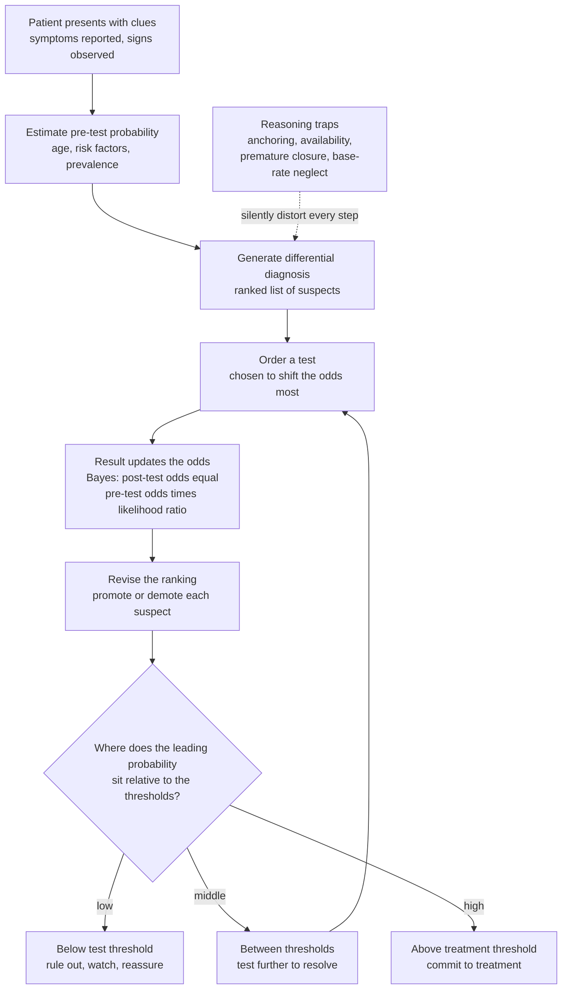

# 🔍 Diagnostic Reasoning and Clinical Decision-Making

> [!abstract] TL;DR
> **Diagnostic reasoning is applied probability under uncertainty** — the central intellectual act of medicine and, when done poorly, a leading source of preventable harm. A clinician almost never *sees* the disease; they see **clues** — symptoms, signs, test results — and must reason backward to the hidden cause. The master skill is thinking in **probabilities, not certainties**: start from a **pre-test probability** (how likely each disease is *before* any test, set by the patient's age, risk factors, and the disease's prevalence), then let every finding **update** those odds via **Bayes' theorem** to a **post-test probability**. A positive test never *proves* disease — it only *raises* the probability, and by how much depends jointly on the test's quality (its likelihood ratio) *and* on how likely the disease was to begin with. That is why the *same* positive result is a red flag in a high-risk patient and a likely false alarm in a low-risk one — the famous **base-rate effect**. Good clinicians build a ranked **differential diagnosis**, act at explicit **test and treatment thresholds** that weigh the costs of being wrong in each direction, and guard against **cognitive biases** — anchoring, availability, premature closure, base-rate neglect. This note is the reasoning framework the rest of Section 06 (testing, evidence, genomics, AI) all serves.

---

## Intuition

**Analogy — the doctor is a detective, and diagnosis is detective work under uncertainty.** A detective walks into a scene and never finds a signed confession waiting on the table. There is only a scatter of **clues** — a muddy footprint, a broken window, a witness's half-memory — and the job is to reason from those fragments to the hidden culprit. Crucially, the detective doesn't start from a blank slate: before examining a single clue, experience already whispers *which suspects are plausible here* — this neighbourhood, this hour, this pattern of crime. Then each new clue **nudges the odds**: it makes one suspect more likely, another less, but it rarely *settles* the case on its own. A muddy footprint outside a house near a muddy field means far less than the same footprint in a spotless downtown apartment. The clue's meaning depends on the context you started from.

That is exactly clinical diagnosis. The disease is the culprit; the symptoms, signs, and test results are the clues; and the clinician's job is to reason from visible evidence to invisible mechanism. You begin with a rough sense of **how likely each disease is *before* any testing** — the **pre-test probability**, shaped by the patient's age, sex, risk factors, and how common the disease simply *is* in people like them. Then each finding **updates** those odds up or down. This is literally **Bayesian reasoning**: a positive test doesn't prove disease, it *raises the probability*, and by how much depends on both the **test's quality** and **how likely the disease was to begin with**. The great detective also keeps a **ranked list of suspects** (the *differential diagnosis*), refuses to fall in love with the first theory (**anchoring**), isn't hypnotized by the vivid case they read about last week (**availability**), and weighs the cost of jailing the wrong person against the cost of letting the guilty one walk (the **cost of errors in each direction**). Diagnosis is disciplined thinking made rigorous by probability — medicine's central skill.

---

## How It Works

### Core mechanics — the diagnostic process as an updating loop

1. **Presentation.** The encounter opens with the **history** (what the patient reports — the symptoms) and the **physical examination** (what the clinician observes and measures — the signs). This is the raw evidence.
2. **Hypothesis generation.** Within seconds, experienced clinicians match the pattern to **illness scripts** — compact mental templates of how a disease typically presents (who gets it, how it starts, what travels with it). This fast, intuitive **pattern recognition** is **System 1** in **dual-process theory**.
3. **The differential diagnosis.** From hypotheses the clinician assembles a **differential** — a *prioritized list of possible causes*, ranked by probability and by danger. "Can't-miss" diagnoses (the ones that kill or maim if missed) are kept high even when unlikely.
4. **Pre-test probability.** Each candidate gets an estimated probability *before testing*, anchored in the **base rate / prevalence** of the disease and the patient's specific risk profile. This is the prior.
5. **Testing to update.** A test is chosen to **shift the odds the most**. Its result updates each candidate's probability via **Bayes' theorem**: `post-test odds = pre-test odds × likelihood ratio`. This deliberate, rule-in / rule-out work is **System 2** — the slow, analytical **hypothetico-deductive** method.
6. **Revise and decide.** The ranking is redrawn, and the clinician asks *where the leading probability now sits relative to two thresholds*: below the **test threshold** → rule out and reassure; between thresholds → gather more evidence; above the **treatment threshold** → commit to treatment. The thresholds themselves are set by the **costs of acting versus not acting**.
7. **Guard the reasoning.** Throughout, disciplined clinicians run metacognitive checks — "what *else* could this be?", "what's the worst this could be?" — to blunt the **cognitive biases** (anchoring, availability, confirmation, premature closure) that quietly distort every step.

### Why the same test result means different things in different patients

The engine is **Bayes' theorem**. Written in odds form it is beautifully simple: your **post-test odds** equal your **pre-test odds** multiplied by the test's **likelihood ratio**. Because you multiply, a test with a strong likelihood ratio applied to a *tiny* pre-test probability still yields a *small* post-test probability — the **base-rate effect**. This is the single most counterintuitive and most important idea in the note: a "positive" from a good test in a low-prevalence setting is *often a false positive*, while the same positive in a high-risk patient is genuine alarm. The number on the report is meaningless without the pre-test probability you multiplied it into.

### Flow / Architecture



*Read the solid arrows as the forward flow of a workup; the dashed arrow is the ever-present threat that biases corrupt the loop before probability ever gets a fair hearing.*

---

## Key Concepts

### Secondary (intuitive)

- **Diagnosis is detective work.** You reason from clues (symptoms, signs, tests) to a hidden cause, never with complete information.
- **Symptom vs sign.** A **symptom** is what the patient *feels and reports* (pain, nausea); a **sign** is what the clinician *observes or measures* (a fever, a murmur).
- **Differential diagnosis** = a *ranked list of suspects* — the possible diseases that could explain the picture, kept open until evidence narrows it.
- **Think in probabilities, not certainties.** A test result makes a disease *more* or *less* likely; it rarely makes it certain. How likely a disease was *before* the test still matters.
- **The same result can mean different things.** A positive test in someone at high risk is a real warning; the same positive in someone at very low risk is often a false alarm.

### Undergraduate (formal)

- **Dual-process theory.** **System 1** (fast, intuitive pattern recognition via illness scripts) and **System 2** (slow, deliberate hypothetico-deductive reasoning) work together; expertise is knowing when to *slow down* and check System 1's snap judgment.
- **Pre-test probability.** The probability of disease *before* the test, estimated from **prevalence / base rate** plus patient-specific risk. It is the **prior**, and it is the number most often neglected.
- **Bayes' theorem and likelihood ratios.** `post-test odds = pre-test odds × LR`. **LR+ = sensitivity / (1 − specificity)**; **LR− = (1 − sensitivity) / specificity**. An LR far from 1 moves probability a lot; an LR near 1 barely moves it. (Sensitivity and specificity are developed in the sibling note on medical testing.)
- **Post-test probability and the base-rate effect.** After a positive test, `PPV = post-test probability of disease`; when prevalence is low, even a good test gives a *low* PPV — most positives are false positives. This is **base-rate neglect** when clinicians forget it.
- **Test and treatment thresholds.** The **treatment threshold** is the probability above which treating beats not-treating; the **testing threshold** is the probability below which even a positive test wouldn't change management. Testing is worthwhile only *between* the two. A **can't-miss** diagnosis lowers these thresholds — you test and treat at lower probabilities because the cost of a miss is catastrophic.

### Graduate (mechanistic and systems)

- **Decision analysis and expected utility.** The threshold model (Pauker and Kassirer) derives thresholds formally: choose the action minimizing **expected loss**, where losses encode the harms of false positives (over-treatment) and false negatives (missed disease) and the disutility of the test itself. Thresholds are where the expected-loss lines of competing strategies cross — utilities, not intuitions, should set them.
- **Calibration vs discrimination of the clinician.** A well-calibrated diagnostician's stated probabilities match observed frequencies (when they say "70 percent," it happens 70 percent of the time). **Overconfidence** — poor calibration — is a documented and dangerous failure mode; probabilistic feedback and structured reflection improve it.
- **Cognitive biases as systematic error.** **Anchoring** (fixating on an initial impression and under-adjusting), **availability** (overweighting a recent or vivid case), **confirmation bias** (seeking data that fits the favored hypothesis), **premature closure** (stopping the workup once one answer feels good enough), and **base-rate neglect** (ignoring prevalence). Croskerry catalogs dozens; debiasing strategies include **cognitive forcing functions**, checklists, diagnostic time-outs, and deliberate "consider the opposite."
- **Diagnostic error as a patient-safety problem.** Diagnostic errors contribute to a large share of preventable harm; the US National Academies' *Improving Diagnosis in Health Care* reframed diagnosis as a system property, not merely an individual's skill — involving feedback, teamwork, and decision support.
- **Guidelines, evidence, and decision support.** Clinical judgment is increasingly scaffolded by **evidence-based** thresholds, validated **clinical prediction rules** (Wells, CURB-65, HEART), and **AI/decision-support** tools that estimate probabilities or surface overlooked diagnoses — automating parts of the Bayesian update while raising new calibration and bias concerns. These are the subjects the rest of Section 06 develops.

---

## Python Demo

```python
# Diagnostic reasoning as applied probability. Two panels:
#   (a) BAYESIAN UPDATING / THE BASE-RATE EFFECT: for a fixed test (sensitivity,
#       specificity), plot how the POST-TEST probability of disease depends on the
#       PRE-TEST probability (prevalence). The positive-result curve is the famous
#       counterintuitive one: even a GOOD test yields a LOW post-test probability
#       when the disease is rare, and a HIGH one when pre-test probability is high.
#   (b) THE DECISION-THRESHOLD MODEL: expected loss of three strategies -- NO-TREAT,
#       TEST-then-act, TREAT-ALL -- as a function of disease probability. Their lower
#       envelope defines the optimal action; the crossover points ARE the testing
#       threshold and the test-treatment threshold. Testing pays only BETWEEN them.
import numpy as np
import matplotlib.pyplot as plt

# ---------------- (a) Bayesian updating across prevalence ----------------
sens, spec = 0.90, 0.90                     # a "good" test
p = np.linspace(1e-3, 1 - 1e-3, 500)        # pre-test probability (prevalence)

# Bayes' theorem for each possible result:
post_pos = (sens * p) / (sens * p + (1 - spec) * (1 - p))          # after POSITIVE
post_neg = ((1 - sens) * p) / ((1 - sens) * p + spec * (1 - p))    # after NEGATIVE

# A worked "rare disease" example: pre-test 1% -> post-test after positive
p_rare = 0.01
ppv_rare = (sens * p_rare) / (sens * p_rare + (1 - spec) * (1 - p_rare))

# ---------------- (b) Threshold model: expected loss of 3 strategies ----------------
C_FN = 1.00      # loss of MISSING disease (false negative) -- the costly error
C_FP = 0.15      # loss of over-treating a well patient (false positive)
u_test = 0.02    # small disutility/risk of the test itself
Se, Sp = 0.90, 0.85

pr = np.linspace(0, 1, 500)
loss_notreat  = pr * C_FN                                   # miss every diseased patient
loss_treatall = (1 - pr) * C_FP                             # over-treat every well patient
loss_test     = (u_test
                 + pr * (1 - Se) * C_FN                     # diseased but test negative -> missed
                 + (1 - pr) * (1 - Sp) * C_FP)              # well but test positive -> over-treated

# Thresholds = crossovers of the optimal (lowest) strategy lines
def crossover(a, b):
    d = a - b
    i = np.where(np.sign(d[:-1]) != np.sign(d[1:]))[0]
    return pr[i[0]] if len(i) else np.nan

p_test_thresh = crossover(loss_notreat, loss_test)    # below: don't even test
p_treat_thresh = crossover(loss_test, loss_treatall)  # above: treat without testing

fig, (ax1, ax2) = plt.subplots(1, 2, figsize=(14, 5.6))

# --- panel (a) ---
ax1.plot(p, post_pos, color="#C0392B", lw=2.2, label="Post-test after POSITIVE result")
ax1.plot(p, post_neg, color="#2980B9", lw=2.2, label="Post-test after NEGATIVE result")
ax1.plot(p, p, color="grey", ls="--", lw=1, label="No-information line")
ax1.scatter([p_rare], [ppv_rare], color="#C0392B", zorder=5)
ax1.annotate(f"rare disease: pre-test {p_rare:.0%}\n-> positive gives only {ppv_rare:.0%}",
             xy=(p_rare, ppv_rare), xytext=(0.22, 0.30), fontsize=8.5,
             arrowprops=dict(arrowstyle="->", color="#C0392B"))
ax1.set_xlabel("Pre-test probability (prevalence)")
ax1.set_ylabel("Post-test probability of disease")
ax1.set_title(f"(a) Bayesian updating -- test Se={sens:.0%}, Sp={spec:.0%}\nthe base-rate effect")
ax1.legend(loc="center right", fontsize=8)
ax1.grid(alpha=0.3)
ax1.set_xlim(0, 1); ax1.set_ylim(0, 1)

# --- panel (b) ---
ax2.plot(pr, loss_notreat,  color="#2980B9", lw=2, label="No-treat")
ax2.plot(pr, loss_test,     color="#27AE60", lw=2, label="Test, then act")
ax2.plot(pr, loss_treatall, color="#C0392B", lw=2, label="Treat all")
optimal = np.minimum.reduce([loss_notreat, loss_test, loss_treatall])
ax2.fill_between(pr, 0, optimal, color="#7f8c8d", alpha=0.10)
for x, lab in [(p_test_thresh, "testing\nthreshold"), (p_treat_thresh, "test-treatment\nthreshold")]:
    ax2.axvline(x, color="k", ls=":", lw=1)
    ax2.text(x, 0.92, f"{lab}\n{x:.2f}", ha="center", va="top", fontsize=8)
ax2.set_xlabel("Probability of disease")
ax2.set_ylabel("Expected loss (lower is better)")
ax2.set_title("(b) Decision thresholds -- test only BETWEEN the two")
ax2.legend(loc="upper center", fontsize=8)
ax2.grid(alpha=0.3)
ax2.set_xlim(0, 1); ax2.set_ylim(0, 1)

plt.tight_layout()
plt.show()

print(f"(a) Good test, rare disease: pre-test {p_rare:.0%} -> post-test (positive) {ppv_rare:.1%}")
print(f"    Same test, pre-test 50%   -> post-test (positive) "
      f"{(sens*0.5)/(sens*0.5+(1-spec)*0.5):.1%}")
print(f"(b) Rule-out below {p_test_thresh:.2f}; TEST between "
      f"{p_test_thresh:.2f} and {p_treat_thresh:.2f}; treat above {p_treat_thresh:.2f}")
```

**What you see.** *Panel (a)* is the base-rate effect made visible. The red curve — the probability of disease *after a positive result* — is not a straight line: at low prevalence it hugs the floor, so even this "good" 90/90 test, when it fires positive in a disease that afflicts only 1 percent of such patients, leaves the post-test probability around **8 percent** (most positives are false alarms), yet the very same positive at a 50 percent pre-test probability yields **90 percent**. The identical result carries wildly different meaning depending on where you started — which is the entire argument for estimating pre-test probability first. *Panel (b)* is the decision layer: three strategies' expected losses cross at two points, carving the probability axis into three zones — **rule out** (too unlikely to bother testing), **test** (only here does information change your action), and **treat** (so likely that a negative test wouldn't stop you). Raise the cost of a miss (`C_FN`) — as for a can't-miss diagnosis — and both thresholds slide left: you test and treat at lower probabilities because the asymmetry of harm demands it.

---

## Real-World Applications

- **Chest pain in the emergency department.** Pre-test probability of acute coronary syndrome from age, risk factors, and story; troponin and ECG update it; the **HEART score** operationalizes the threshold decision — discharge, observe, or admit. A textbook Bayesian workup under time pressure.
- **Suspected pulmonary embolism.** The **Wells score** sets pre-test probability, which dictates whether a **D-dimer** (a highly sensitive rule-out test, valuable only when pre-test probability is low) or straight-to-CT is the right next step — a direct application of the testing-threshold logic.
- **Screening asymptomatic populations.** Mammography, PSA, and low-prevalence screening all live on panel (a)'s left edge, where positive predictive value is inherently low and false positives dominate — the core tension in every screening-policy debate.
- **Antibiotic stewardship.** Deciding whether a sore throat is streptococcal (Centor criteria) or a fever is bacterial vs viral is threshold reasoning: treat, test, or watch, weighing the harm of missed infection against the harm of needless antibiotics.
- **Reducing diagnostic error.** Diagnostic time-outs, structured **differential-diagnosis** checklists, and "worst-case / what-else" prompts are deployed in hospitals precisely to counter anchoring and premature closure — the biases this note names.
- **Clinical decision support and AI.** Probability estimators, imaging classifiers, and differential-generators (from Bayesian expert systems to modern machine learning) automate parts of the update — powerful, but only as trustworthy as their **calibration** and their handling of base rates.

---

## Common Pitfalls

- **Base-rate neglect.** Reading a positive test as proof of disease while ignoring how rare the disease is. In low-prevalence settings most positives are false — always ask "positive *in whom*?" and anchor on pre-test probability first.
- **Anchoring and premature closure.** Locking onto the first plausible diagnosis and under-adjusting as new data arrive, then stopping the workup too early. Antidote: keep the differential explicitly open and ask "what else could this be?" before committing.
- **Availability bias.** Overweighting a diagnosis because a vivid or recent case made it mentally *available*, distorting your felt sense of its prevalence. The last dramatic case is not evidence about *this* patient's base rate.
- **Confirmation bias.** Ordering and interpreting tests to *confirm* the favored hypothesis rather than to *discriminate* between competitors. Choose the test that would most change your mind, and actively seek disconfirming data.
- **Treating the test as the truth.** Forgetting that sensitivity and specificity are never perfect, so a result *shifts* probability rather than settling it. A single negative rarely rules out a high-pre-test-probability, can't-miss diagnosis.
- **Ignoring the asymmetry of harm.** Setting one threshold for everything, when the cost of a missed catastrophic diagnosis should lower the threshold to test and treat. Thresholds are utilities, not universals.
- **Reading this as clinical advice.** This note teaches the *reasoning framework* at textbook level; it is not guidance for any individual's care, which always depends on a clinician and the specifics of a real patient.

---

## Related Concepts

**Within this vault (Section 06 and the foundations).** This opener is the reasoning backbone that the rest of the section rests on. *Medical Testing and Diagnostics* supplies the machinery this note assumes — sensitivity, specificity, predictive values, likelihood ratios, and ROC curves — the quantitative characterization of the tests whose results we update on here. *Evidence-Based Medicine and Clinical Trials* provides the population-level evidence that calibrates our pre-test probabilities and validates the prediction rules and thresholds. *Precision Medicine and Genomics in the Clinic* refines pre-test probability with molecular and genomic risk, splitting broad diagnoses into mechanistically distinct ones. *AI and Technology in Clinical Medicine* examines how decision-support and machine-learning systems automate — and sometimes distort — the Bayesian update and the guarding against bias. And the *Clinical Medicine and Pathophysiology Overview* frames the whole enterprise: diagnosis is the backward-reasoning act from clue to mechanism that names what treatment must target. These are prose references to sibling notes within the Clinical Medicine vault.

**Across the vault (Glob-verified links).**

- [[Logic_and_Critical_Thinking/03_Inductive_and_Probabilistic_Reasoning/Bayesian_Reasoning|Bayesian Reasoning]] — the general logic of updating beliefs with evidence; diagnosis is its highest-stakes application.
- [[Mathematics/06_Probability_and_Statistics/Bayesian_Statistics|Bayesian Statistics]] — priors, likelihoods, and posteriors formalized; pre-test probability is a prior, post-test probability a posterior.
- [[Mathematics/06_Probability_and_Statistics/Probability_Theory|Probability Theory]] — conditional probability and the definitions on which Bayes' theorem and likelihood ratios rest.
- [[Logic_and_Critical_Thinking/03_Inductive_and_Probabilistic_Reasoning/Abductive_Reasoning_and_Inference_to_Best_Explanation|Abductive Reasoning and Inference to the Best Explanation]] — building a differential and choosing the best explanation for the clues is clinical abduction.
- [[Logic_and_Critical_Thinking/06_Applied_Critical_Thinking/Decision_Making_Under_Uncertainty|Decision-Making Under Uncertainty]] — expected utility and thresholds, the decision-analytic frame behind test and treatment thresholds.
- [[Logic_and_Critical_Thinking/06_Applied_Critical_Thinking/Cognitive_Biases_and_Heuristics|Cognitive Biases and Heuristics]] — the general catalog of reasoning traps that produce diagnostic error.
- [[Cognitive_Science/04_Reasoning_Language_and_Higher_Cognition/Dual_Process_Theory|Dual-Process Theory]] — System 1 pattern recognition versus System 2 analysis, the cognitive architecture of clinical thinking.
- [[Cognitive_Science/05_Computational_and_Neural_Approaches/Bayesian_Models_of_Cognition|Bayesian Models of Cognition]] — the view that the brain itself is an approximate Bayesian updater, the same math the clinician applies deliberately.
- [[Cognitive_Science/04_Reasoning_Language_and_Higher_Cognition/Judgment_and_Decision_Making|Judgment and Decision Making]] — the heuristics-and-biases research program that maps how human judgment departs from the probabilistic ideal.
- [[Behavioral_Economics/03_Cognitive_Biases_and_Judgment/Base_Rate_Neglect_and_Bayesian_Reasoning|Base-Rate Neglect and Bayesian Reasoning]] — the canonical demonstration of the base-rate fallacy, the single most common diagnostic-probability error.
- [[Behavioral_Economics/03_Cognitive_Biases_and_Judgment/Anchoring_and_Adjustment|Anchoring and Adjustment]] — anchoring on the first impression, the classic diagnostic trap.
- [[Behavioral_Economics/03_Cognitive_Biases_and_Judgment/Availability_and_Representativeness|Availability and Representativeness]] — how vividness and stereotype-matching distort felt probability at the bedside.

---

## Review Questions

**Secondary.** Using the detective analogy, explain what a "differential diagnosis" is and why a good clinician keeps more than one suspect on the list. Why does a doctor care how common a disease is *before* running any test?

**Undergraduate.** A screening test has 90 percent sensitivity and 90 percent specificity. In population A the disease prevalence is 1 percent; in population B a patient's specific risk makes the pre-test probability 50 percent. A patient in each population tests positive. Explain, using Bayes' theorem in odds form, why the *same* positive result means very different things in the two patients, and state roughly what each post-test probability is. What is this phenomenon called?

**Graduate.** In the threshold model, define the *testing threshold* and the *treatment threshold* in terms of expected loss, and explain why testing is rational only when the pre-test probability lies between them. Now suppose the diagnosis in question is a can't-miss condition (a large false-negative cost). Show how both thresholds move, argue what should happen to the clinician's willingness to test and to treat, and identify which cognitive bias most threatens correct behavior at the low-probability end — and one concrete debiasing strategy against it.

---

## Sources

- Sackett, D. L., Haynes, R. B., Guyatt, G. H., & Tugwell, P. *Clinical Epidemiology: A Basic Science for Clinical Medicine.* Little, Brown — pre-test/post-test probability, likelihood ratios, and the diagnostic process.
- Kassirer, J. P., Wong, J. B., & Kopelman, R. I. *Learning Clinical Reasoning* (2nd ed.). Lippincott Williams & Wilkins — hypothesis generation, the differential, and threshold decision-making.
- Pauker, S. G., & Kassirer, J. P. (1980). "The Threshold Approach to Clinical Decision Making." *New England Journal of Medicine*, 302(20), 1109–1117 — the formal test/treatment threshold model.
- Croskerry, P. (2003). "The Importance of Cognitive Errors in Diagnosis and Strategies to Minimize Them." *Academic Medicine*, 78(8), 775–780 — catalog of diagnostic biases and debiasing.
- Kahneman, D. *Thinking, Fast and Slow.* Farrar, Straus and Giroux — System 1 / System 2 dual-process theory and the heuristics-and-biases program.
- National Academies of Sciences, Engineering, and Medicine (2015). *Improving Diagnosis in Health Care.* National Academies Press — diagnostic error as a patient-safety and systems problem.

---

#clinical-medicine #diagnosis #bayesian-reasoning #clinical-decision-making #cognitive-bias
