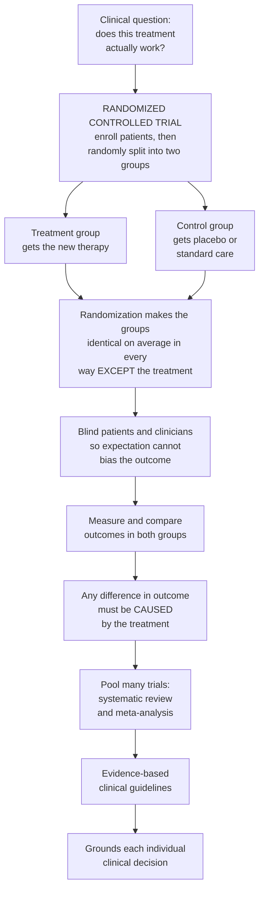

# ⚖️ Evidence-Based Medicine and Clinical Trials

> [!abstract] TL;DR
> **How do we *know* a treatment actually works?** For most of history, medicine ran on authority and anecdote — the eminent doctor's opinion, "it worked for my patients" — and much of it was wrong or even lethal (bloodletting killed for centuries). **Evidence-based medicine (EBM)** replaced "because I said so" with "because we tested it rigorously," integrating the best available research evidence with clinical expertise and patient values. Its engine is the **randomized controlled trial (RCT)**: split patients randomly into a treatment group and a control group, and **randomization** makes the two groups identical on average in every way *except* the treatment — so any difference in outcome must be **caused** by the treatment. Add **blinding** to erase expectation, quantify the result with **confidence intervals** and effect measures like **number needed to treat**, and stack many trials into a **meta-analysis** at the top of the **evidence hierarchy**. This is humanity's best tool for proving that A *causes* B in a noisy world — the foundation of trustworthy modern healthcare. *Educational content, not individual medical advice.*

---

## Intuition

**Analogy:** Imagine two farmers arguing about whether a fertilizer works. The first says, "I used it and my crops grew — it works." But his field also got more rain, better soil, and more sun that year. Did the fertilizer do it, or the weather? He can never know, because everything changed at once. The second farmer does something clever: she takes **one** field, splits it down the middle **by a coin flip**, fertilizes only the randomly chosen half, and waters, weeds, and tends both halves identically. Now if the fertilized half out-yields the other, there is only **one** thing that differs between them — the fertilizer — so it *must* be the cause. She has defeated the fog of confounding variables not by measuring them all, but by making them irrelevant through randomness.

That coin flip is the whole secret of modern medicine. People who *choose* a treatment differ from those who don't (the sick seek it out; the health-conscious try new things); sick people sometimes get better on their own; and both patients and doctors *expect* a pill to help, which alone can produce real improvement (the placebo effect). Every one of these biases fools us into seeing effects that aren't there. **Randomization** makes the two groups statistically identical in age, severity, hidden genetics, and even the things we never thought to measure — so the *only* systematic difference left is the treatment. **Blind** everyone so expectation can't tip the scales, and you have a machine for separating what truly works from what merely *seems* to. EBM means grounding every clinical decision in the best such evidence we can get.

---

## How It Works

### Core Mechanics

1. **The problem: causation in a noisy world.** We want to know whether a treatment *causes* better outcomes. But in raw observation, treatment is tangled with everything else — who receives it, how sick they are, what else they do. **Correlation is not causation**: treated patients doing better could reflect *who chose treatment*, not the treatment. This is **confounding**, and it is the central enemy.

2. **Randomization defeats confounding.** Assigning treatment purely by chance breaks the link between *receiving* treatment and every other patient characteristic — measured *and unmeasured*. On average the two arms are exchangeable, so a difference in outcome is attributable to the treatment alone. This is the experimental route to a **causal** claim, formalized by the potential-outcomes / counterfactual framework (see [[Potential_Outcomes_Framework]]).

3. **A comparator and a placebo control for the rest.** Patients often improve without any active treatment — from the disease's **natural history**, regression to the mean, or the **placebo effect** (belief itself). A control arm (placebo or best standard care) measures that baseline so the *extra* benefit of the drug can be isolated.

4. **Blinding removes expectation and assessment bias.** In a **single-blind** trial patients don't know their arm; in a **double-blind** trial neither patients nor treating clinicians nor outcome assessors know. This blocks conscious and unconscious behavior changes and biased outcome scoring.

5. **Analyze by intention-to-treat (ITT).** Patients are analyzed in the group they were *randomized* to, even if they switched or dropped out. Excluding non-adherers ("per-protocol") quietly re-introduces the confounding randomization removed, because *who adheres* is not random.

6. **Quantify the effect and its uncertainty.** Report a **confidence interval** and effect size, not just a yes/no **p-value**. Translate to clinically meaningful measures: **absolute risk reduction (ARR)** and its reciprocal, the **number needed to treat (NNT)** — how many patients you must treat to prevent one bad outcome.

7. **Stack the evidence.** A single trial can mislead by chance or local quirks. **Systematic reviews** and **meta-analyses** pool many trials into a single, more precise pooled estimate (visualized as a **forest plot**), sitting atop the **evidence hierarchy** and feeding graded clinical **guidelines**.

### Flow / Architecture



---

## Key Concepts

### Secondary Level

- **Evidence-based medicine (EBM):** basing medical decisions on *rigorously tested* evidence, not just on tradition, authority, or one doctor's experience. It asks "what does the best study show?" instead of "what have I always done?"
- **Randomized controlled trial (RCT):** the gold-standard experiment. Take a group of patients, **split them by chance** into a treatment group and a comparison group, and see which does better.
- **Randomization** is the magic ingredient: because the coin flip decides who gets what, the two groups end up alike in every other way, so a difference in outcome must be due to the treatment.
- **Placebo:** a dummy treatment (a sugar pill) given to the control group, because people often feel better just from *believing* they're being treated. The real drug has to beat the placebo.
- **Blinding:** hiding who got the real treatment from patients and doctors, so hope and expectation can't secretly tip the results.
- **Why it matters:** without this method, medicine endorsed useless and harmful treatments for centuries. The RCT is how we tell what *really* works from what only *seems* to.

### Undergraduate Level

- **The EBM process — the four A's:** **Ask** a focused clinical question (often framed as PICO: Population, Intervention, Comparator, Outcome), **Acquire** the best evidence, **Appraise** it critically for validity, and **Apply** it to the patient in light of their values.
- **Control / comparator and natural history:** the control arm captures placebo response *and* the disease's own tendency to improve or worsen, so the trial measures the drug's *added* effect.
- **Blinding levels:** *single-blind* (patient blinded), *double-blind* (patient + clinician + assessor blinded). Double-blinding is essential for subjective outcomes like pain.
- **Endpoints:** **hard/clinical** outcomes patients care about (death, stroke, heart attack) versus **surrogate** markers presumed to predict them (blood pressure, LDL, tumor shrinkage). Surrogates are faster and cheaper but can mislead.
- **Trial phases:** Phase I (safety, small), II (preliminary efficacy + dosing), III (large confirmatory RCT for approval), IV (post-marketing surveillance for rare harms).
- **Statistical power and sample size:** a trial needs enough patients to reliably detect a real effect; underpowered trials miss true benefits (a Type II error).
- **Effect measures:** **relative risk (RR)** and **odds ratio (OR)** describe *proportional* change; **absolute risk reduction (ARR)** the raw difference; **number needed to treat (NNT = 1/ARR)** the clinically intuitive "treat N to help one." Relative measures look impressive while absolute benefit is small.
- **Significance vs certainty:** a **p-value** is the probability of data this extreme if the treatment did nothing; a **confidence interval** shows the plausible range of the true effect. **Statistical significance ≠ clinical significance** — a trivial effect can be "significant" in a huge trial.
- **Two errors:** **Type I (false positive)** — declaring an effect that isn't real; **Type II (false negative)** — missing a real one.
- **The evidence hierarchy:** case reports/expert opinion → case-control & **cohort** (observational, can show association) → **RCT** → **systematic review & meta-analysis** at the top. Observational designs are covered in [[Public_Health_and_Epidemiology]].

### Graduate Level

- **Why randomization identifies a causal effect.** In the potential-outcomes framework, each patient has two hidden outcomes — under treatment and under control — but we observe only one. Randomization makes treatment assignment **independent of potential outcomes**, so the difference in group means is an unbiased estimate of the **average treatment effect** ([[Potential_Outcomes_Framework]]). Observational studies must instead *assume* no unmeasured confounding and adjust for it (e.g. [[Propensity_Score_Matching]]) — an assumption that is untestable and often false.
- **Confounding as bias.** A confounder is a common cause of both treatment and outcome; failing to account for it biases the estimate — the same structure as **omitted-variable bias** in regression ([[Omitted_Variable_Bias]]). Randomization neutralizes *all* confounders at once, including unknown ones; statistical adjustment can only handle those you measured.
- **ITT vs per-protocol, and estimands.** ITT preserves randomization and estimates the *effect of assignment* (a pragmatic, policy-relevant question); per-protocol estimates the *effect of adherence* but re-opens confounding. Modern trials specify the target **estimand** explicitly.
- **Surrogate-endpoint peril.** A biomarker can move the "right" way while the patient does *worse* — the CAST trial (below) is the canonical warning. Validating a surrogate requires showing it captures the treatment's effect on the true outcome.
- **Ethics: equipoise and consent.** Randomizing is ethical only under **clinical equipoise** — genuine uncertainty in the expert community about which arm is better — plus informed consent, IRB oversight, and stopping rules for interim harm/benefit.
- **From observation to causation.** When RCTs are impossible (smoking, most harms), causal claims from observational data lean on the **Bradford Hill viewpoints** (strength, consistency, temporality, dose-response, plausibility) and quasi-experimental designs — the bridge to [[Causal_Reasoning]] and epidemiology. But **observational ≠ causal** by default.
- **Meta-analysis machinery.** Pool trial estimates by **inverse-variance weighting**; choose **fixed-effect** (one true effect) vs **random-effects** (effects vary across trials) models based on **heterogeneity** (the I² statistic). Guard against **publication bias** (small negative trials never published) using **funnel plots** and detect it with asymmetry tests.
- **The replication / reproducibility crisis.** Ioannidis argued *most published research findings are false* because of low prior probability, small samples, flexible analysis (**p-hacking** and multiple comparisons), and **conflicts of interest**. This motivates pre-registration, larger simple trials, and **GRADE** for rating certainty of evidence.
- **External validity and the individual.** RCTs establish an *average* effect in a *selected* population; strict inclusion criteria can limit **generalizability** to the messy real-world patient. Evidence describes **populations**, but medicine treats an **individual** — bridging the gap needs subgroup caution, effect-heterogeneity analysis, and sometimes n-of-1 trials.

---

## Python Demo

```python
# Evidence and trials, quantified:
#   (a) RANDOMIZATION vs CONFOUNDING -- simulate a clinical trial with a known
#       TRUE treatment effect plus patient-to-patient variability. Show that a
#       RANDOMIZED comparison recovers the true effect, while a NON-randomized
#       (self-selected) comparison is biased by confounding. Report a 95% CI /
#       p-value and show how larger samples sharpen the estimate.
#   (b) META-ANALYSIS FOREST PLOT -- pool several trials into one inverse-
#       variance-weighted estimate (the top of the evidence hierarchy).
# Educational simulation with stylized numbers -- not clinical data.
import numpy as np
import matplotlib.pyplot as plt
import math

rng = np.random.default_rng(7)

# ---- Ground truth --------------------------------------------------------
TRUE_EFFECT = 5.0        # treatment truly raises recovery score by 5 points
N = 2000                 # patients per simulated cohort

def simulate_outcomes(treated, severity):
    # recovery = 70 baseline - 8*severity + effect*treated + individual noise
    noise = rng.normal(0, 10, size=len(treated))
    return 70 - 8*severity + TRUE_EFFECT*treated + noise

def diff_stats(y, t):
    """Difference in means, standard error, two-sided p (normal approx)."""
    a, b = y[t == 1], y[t == 0]
    d  = a.mean() - b.mean()
    se = math.sqrt(a.var(ddof=1)/len(a) + b.var(ddof=1)/len(b))
    z  = d/se
    p  = math.erfc(abs(z)/math.sqrt(2))          # two-sided p-value
    return d, se, p

# ---- (a) Randomized vs confounded on the SAME population -----------------
severity = rng.normal(2.0, 1.0, size=N)          # 0 = mild, higher = sicker

# Randomized assignment: a coin flip, independent of severity
T_rand = rng.integers(0, 2, size=N)
Y_rand = simulate_outcomes(T_rand, severity)

# Confounded assignment: SICKER patients self-select INTO treatment,
# so treatment becomes correlated with worse baseline severity.
p_treat = 1.0/(1.0 + np.exp(-(severity - 2.0)))  # high severity -> high P(treat)
T_conf  = (rng.random(N) < p_treat).astype(int)
Y_conf  = simulate_outcomes(T_conf, severity)

d_r, se_r, p_r = diff_stats(Y_rand, T_rand)
d_c, se_c, p_c = diff_stats(Y_conf, T_conf)

# ---- Bigger samples sharpen the estimate (CI half-width shrinks) ---------
sizes = np.array([50, 100, 250, 500, 1000, 2500, 5000, 10000])
halfwidths = []
for n in sizes:
    sev = rng.normal(2.0, 1.0, size=n)
    t   = rng.integers(0, 2, size=n)
    y   = simulate_outcomes(t, sev)
    _, se, _ = diff_stats(y, t)
    halfwidths.append(1.96*se)
halfwidths = np.array(halfwidths)

# ---- (b) Meta-analysis: pool several trials (inverse-variance) -----------
trials  = ["Trial A", "Trial B", "Trial C", "Trial D", "Trial E"]
effects = np.array([6.2, 3.1, 5.5, 2.0, 4.8])    # per-trial mean difference
ses     = np.array([2.4, 1.1, 3.0, 1.6, 0.9])    # per-trial standard error
weights = 1.0/ses**2
pooled  = np.sum(weights*effects)/np.sum(weights)
pooled_se = math.sqrt(1.0/np.sum(weights))

# ---- Plot ----------------------------------------------------------------
fig, (ax0, ax1, ax2) = plt.subplots(1, 3, figsize=(17, 5))

# Panel A: randomization recovers the truth; confounding corrupts it
labels = ["True effect", "Randomized\nestimate", "Confounded\nestimate"]
vals   = [TRUE_EFFECT, d_r, d_c]
errs   = [0.0, 1.96*se_r, 1.96*se_c]
cols   = ["#111827", "#059669", "#dc2626"]
ypos   = [2, 1, 0]
for yp, v, e, c in zip(ypos, vals, errs, cols):
    ax0.errorbar(v, yp, xerr=e, fmt="o", color=c, ms=11, capsize=6, lw=2.2)
ax0.axvline(TRUE_EFFECT, color="#111827", ls="--", lw=1)
ax0.axvline(0, color="gray", lw=1)
ax0.set_yticks(ypos); ax0.set_yticklabels(labels)
ax0.set_ylim(-0.6, 2.6)
ax0.set_xlabel("Estimated treatment effect (recovery points)")
ax0.set_title("Randomization recovers the truth;\nconfounding is biased")

# Panel B: sample size vs precision
ax1.plot(sizes, halfwidths, "o-", color="#0369a1", lw=2.2, ms=8)
ax1.set_xscale("log")
ax1.set_xlabel("Trial sample size (log scale)")
ax1.set_ylabel("95% CI half-width (points)")
ax1.set_title("Bigger trials sharpen\nthe estimate")
ax1.grid(alpha=0.3, which="both")

# Panel C: forest plot (marker area proportional to trial weight)
yp = np.arange(len(trials))[::-1]
ax2.errorbar(effects, yp, xerr=1.96*ses, fmt="none",
             ecolor="#7c3aed", capsize=4, lw=1.6)
ax2.scatter(effects, yp, s=700*weights/weights.max(),
            color="#7c3aed", zorder=3, label="Individual trials")
ax2.errorbar(pooled, -1, xerr=1.96*pooled_se, fmt="D", color="#dc2626",
             ms=13, capsize=6, lw=2.4, label="Pooled (meta-analysis)")
ax2.axvline(0, color="gray", lw=1)               # no-effect line
ax2.axvline(pooled, color="#dc2626", ls=":", lw=1)
ax2.set_yticks(list(yp) + [-1]); ax2.set_yticklabels(trials + ["POOLED"])
ax2.set_xlabel("Mean difference (effect size)")
ax2.set_title("Meta-analysis forest plot:\npooling tightens the estimate")
ax2.legend(loc="lower right", fontsize=8)

plt.tight_layout()
plt.savefig("evidence_based_medicine.png", dpi=120)

print(f"True effect                 : {TRUE_EFFECT:+.2f}")
print(f"Randomized estimate         : {d_r:+.2f}  "
      f"(95% CI half-width {1.96*se_r:.2f}, p={p_r:.1e})")
print(f"Confounded (naive) estimate : {d_c:+.2f}  <-- biased away from truth")
print(f"Pooled meta-analytic effect : {pooled:+.2f}  "
      f"(95% CI half-width {1.96*pooled_se:.2f})")
```

**What it shows.** Panel A is the heart of the matter: fed the *same* population and the *same* true effect, the **randomized** comparison lands right on the true 5-point benefit (green, with its confidence interval), while the **confounded** comparison — where sicker patients self-selected into treatment — is dragged toward zero or even negative (red), *manufacturing the illusion that a helpful drug is useless*. Randomization is what makes the estimate trustworthy; adjustment can't rescue what you never measured. Panel B shows why trials must be large: the confidence interval's half-width shrinks roughly as one over the square root of the sample size, so precision is bought with patients. Panel C is a **forest plot** — five noisy trials, each an imprecise arrow, combine by inverse-variance weighting into a single pooled diamond that is tighter than any one of them. That is the evidence hierarchy made visual: many trials speak more clearly than one.

---

## Real-World Applications

- **The Cochrane Collaboration and systematic reviews.** Cochrane's thousands of systematic reviews and meta-analyses are the practical apex of the evidence hierarchy, synthesizing global trial data into the summaries that underpin clinical guidelines worldwide — the institutional embodiment of "pool the trials, then decide."
- **Women's Health Initiative and hormone therapy (confounding exposed).** Large *observational* studies suggested hormone replacement therapy protected post-menopausal women's hearts. The randomized WHI trial found the opposite — it *raised* cardiovascular and breast-cancer risk. The observational signal was **healthy-user bias**: women who took HRT were simply healthier to begin with. The textbook demonstration that observational ≠ causal, and that only randomization settles it.
- **CAST trial and the surrogate-endpoint trap.** Antiarrhythmic drugs reliably suppressed the extra heartbeats (PVCs) that follow a heart attack — a "good" surrogate. The Cardiac Arrhythmia Suppression Trial randomized patients and found the drugs *increased* death. Fixing the number killed patients; only a hard endpoint (mortality) revealed it.
- **Large simple trials — ISIS-2.** By randomizing over 17,000 heart-attack patients to aspirin and/or streptokinase, ISIS-2 detected modest but real mortality reductions with high precision, showing how big, simple RCTs turn small true effects into confident, practice-changing evidence.
- **RECOVERY platform trial (COVID-19).** A single adaptive, randomized platform tested many therapies against shared controls. It proved **dexamethasone** saves lives in severe COVID-19 and that **hydroxychloroquine** does not — rapid, rigorous causal answers amid a pandemic of anecdote, exactly the authority-versus-evidence contrast EBM exists to resolve.
- **Regulatory drug approval (FDA / EMA phases I–IV).** The entire pipeline from first-in-human safety to post-marketing surveillance institutionalizes the RCT as the standard of proof before a therapy reaches patients, with CONSORT reporting standards to keep trials transparent.

---

## Common Pitfalls

- **Confusing correlation with causation.** The single most expensive error in medicine. An association in observational data can arise from confounding, reverse causation, or bias. Unless it comes from randomization (or a strong quasi-experiment), treat "X is linked to Y" as a hypothesis, not a fact — the HRT reversal is the cautionary tale.
- **Trusting surrogate endpoints.** A drug that improves a lab value, scan, or biomarker has *not* been shown to help patients. Surrogates can move the right way while outcomes move the wrong way (CAST). Demand hard endpoints — survival, function, quality of life — before believing benefit.
- **Reporting relative risk without absolute risk.** "Cuts risk by 50%" sounds dramatic but may mean 2% down to 1% — an NNT of 100. Always ask "50% *of what base rate?*" Relative measures inflate perceived benefit; **absolute risk reduction and NNT** keep it honest.
- **Confusing statistical with clinical significance.** With a large enough sample, a medically meaningless difference becomes "p < 0.05." Significance answers "is it likely non-zero?"; it does *not* answer "is it big enough to matter?" Read the confidence interval and the effect size, not just the p-value.
- **P-hacking and publication bias.** Testing many outcomes, subgroups, or analyses until something crosses p = 0.05 manufactures false positives; and journals preferentially publish positive results, so the literature over-states effects. Pre-registration, correction for multiple comparisons, and funnel-plot checks are the defenses (see Ioannidis in Sources).
- **Per-protocol analysis defeating randomization.** Dropping non-adherers or switchers feels tidy but re-introduces confounding, because adherence is not random. **Intention-to-treat** is the conservative, valid default.
- **Over-generalizing from a selected trial population.** Trials often exclude the elderly, the pregnant, and the multi-morbid, then get applied to exactly those patients. Strong internal validity does not guarantee **external validity** — the average effect in a trial may not be *this* patient's effect.
- **Treating population evidence as an individual verdict.** Evidence quantifies what happens *on average*; a given patient's values, risks, and biology still matter. EBM integrates evidence *with* clinical judgment and patient preference — it does not replace them.

---

## Related Concepts

This note anchors the **Clinical Reasoning and Modern Medicine** section, which explains not just *what* we know in medicine but *how we know it and how we decide*. Its siblings build directly on this foundation: *Diagnostic Reasoning and Clinical Decision Making* applies the same probabilistic mindset (pre-test probability, likelihood ratios, Bayesian updating) to the individual patient rather than the population; *Medical Testing and Diagnostics* dissects sensitivity, specificity, and predictive value — the measurement side of the evidence machinery; *Precision Medicine and Genomics in the Clinic* pushes toward tailoring average-effect evidence to the individual genome, the frontier where population trials meet personal biology; and *AI and Technology in Clinical Medicine* asks how algorithms must themselves be validated by the very trial standards described here. Upstream, *Etiology and Mechanisms of Disease* supplies the causal hypotheses that clinical trials are built to *test*. (These siblings are referenced in prose; they live in the same vault.)

Verified cross-vault links:

- [[Statistical_Inference]] — the machinery of p-values, confidence intervals, and estimation that turns trial data into quantified evidence.
- [[Hypothesis_Testing]] — the formal null-vs-alternative framework, Type I/II errors, and power that underpin trial design and significance claims.
- [[Potential_Outcomes_Framework]] — the counterfactual/causal-inference formalism explaining *why* randomization identifies an average treatment effect.
- [[Omitted_Variable_Bias]] — confounding seen through the econometric lens: the bias that randomization eliminates and observational studies must fight.
- [[Propensity_Score_Matching]] — how observational studies *try* to mimic randomization by balancing measured covariates (and why unmeasured confounding still bites).
- [[Causal_Reasoning]] — correlation-vs-causation, Mill's methods, and the logic of inferring cause that clinical trials operationalize.
- [[Public_Health_and_Epidemiology]] — cohort and case-control designs, measures of association, and the population-level study of causation and risk.
- [[Scientific_Reasoning_and_Method]] — the controlled experiment as the general engine of scientific knowledge, of which the RCT is medicine's instance.

---

## Review Questions

1. **Conceptual (Secondary/Undergraduate).** Explain, in plain language, *why* randomly assigning treatment lets us conclude the treatment *caused* a difference in outcomes, when simply comparing patients who chose the treatment to those who didn't does not. What specific problem does the coin flip solve that careful measurement cannot?
2. **Scenario (Undergraduate).** A new drug is reported to reduce the *relative* risk of stroke by 40% (p = 0.01). The untreated stroke rate is 2% per year. Compute the absolute risk reduction and the number needed to treat, and explain to a patient why the "40%" headline may overstate the personal benefit. What further information would you want before recommending it?
3. **Trade-off / evaluative (Graduate).** A large observational database shows patients on Drug X live longer than those not on it, and a propensity-score analysis "adjusts for" all recorded confounders. A colleague argues this is now "as good as an RCT." Critique this claim: what can randomization guarantee that propensity-score matching cannot, and design the minimal RCT (arms, blinding, endpoint, analysis) you would run to settle the question — noting the ethical condition that must hold to run it.

---

## Sources

- Sackett, D. L., Straus, S. E., Richardson, W. S., Rosenberg, W., & Haynes, R. B. *Evidence-Based Medicine: How to Practice and Teach EBM.* Churchill Livingstone — the founding practical text on the four-step EBM process.
- Guyatt, G., Rennie, D., Meade, M. O., & Cook, D. J. *Users' Guides to the Medical Literature: A Manual for Evidence-Based Clinical Practice* (JAMA / JAMAevidence). McGraw-Hill — critical appraisal of trials, effect measures, and the evidence hierarchy.
- Celentano, D. D., & Szklo, M. *Gordis Epidemiology* (6th ed.). Elsevier — study designs, measures of association (RR, OR, ARR, NNT), confounding, and causal inference.
- Ioannidis, J. P. A. (2005). "Why Most Published Research Findings Are False." *PLoS Medicine*, 2(8), e124 — the seminal critique of bias, p-hacking, and the reproducibility problem.
- Schulz, K. F., Altman, D. G., & Moher, D. (2010). "CONSORT 2010 Statement: Updated Guidelines for Reporting Parallel Group Randomised Trials." *BMJ*, 340, c332 — the reporting standard for RCTs.

---

#clinical-medicine #evidence-based-medicine #randomized-controlled-trial #causal-inference #meta-analysis
