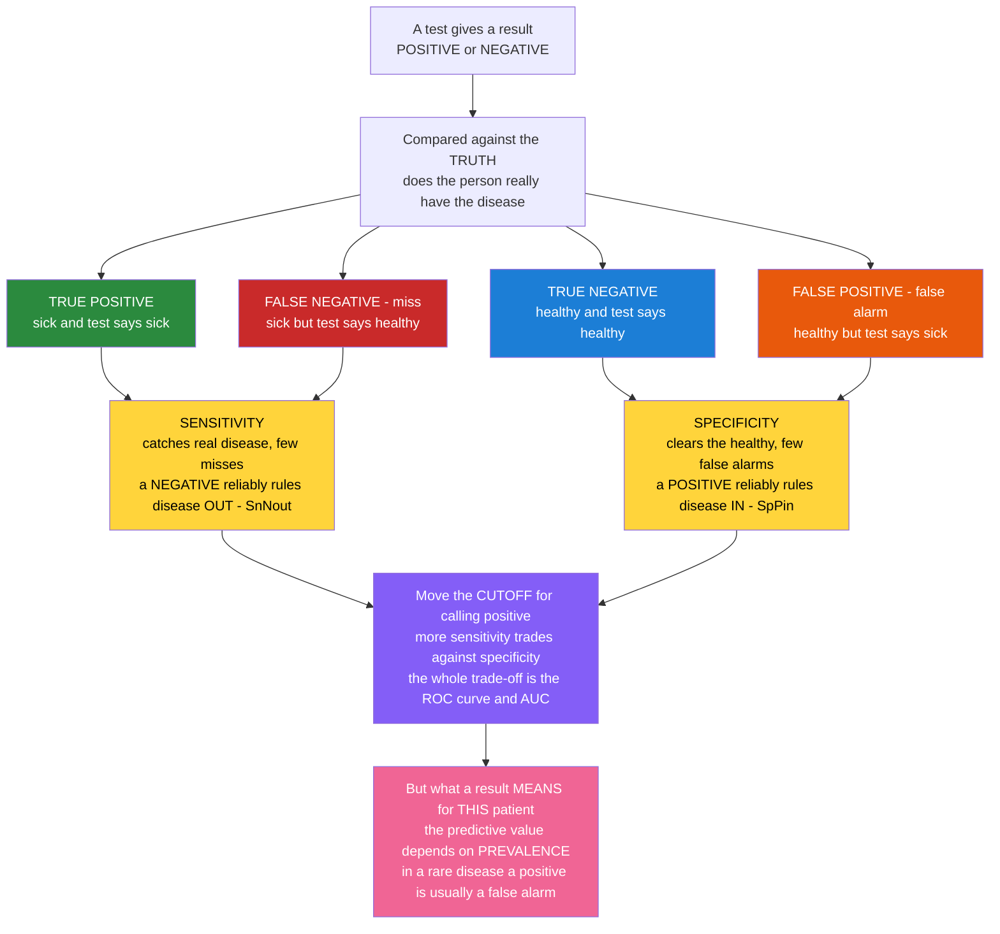

# 🔬 Medical Testing and Diagnostics

> [!abstract] TL;DR
> No medical test is perfect: every test produces **false alarms** (positive in a healthy person) and **misses** (negative in a sick person). Two numbers describe how a test fails — **sensitivity** (how well it catches real disease, so a negative rules disease **out**: *SnNout*) and **specificity** (how well it clears the healthy, so a positive rules disease **in**: *SpPin*). These trade off against each other as you move the decision **cutoff**, a trade-off summarized by the **ROC curve** and its **AUC**. The counterintuitive twist: what a positive result actually *means* for a given patient — its **predictive value** — depends enormously on the disease's **prevalence**, which is why even an excellent test yields mostly false positives when a disease is rare, and why we do not screen everyone for everything. These are precisely the concepts used to evaluate any AI classifier — medicine got there first, with lives on the line.
>
> *Educational content at medical-textbook level — not individual clinical advice.*

---

## Intuition

**Analogy first:** Think of a diagnostic test as a **smoke detector**. A good detector should scream when there is a real fire (catch disease) and stay quiet when you are just making toast (leave the healthy alone). But no detector is perfect. Make it hypersensitive and it shrieks at every slice of toast — it will **never miss a fire, but it cries wolf constantly** (high sensitivity, low specificity). Make it sluggish and it ignores the toast — but it may also **sleep through a small real fire** (high specificity, low sensitivity). You tune this behaviour with a single dial: the **cutoff** for how much smoke counts as "alarm."

Now the deep, unsettling part. Suppose you install this detector in a building where fires are extraordinarily rare — one real fire per ten thousand days. Even a very good detector will produce far more false alarms than real ones, simply because there are ten thousand toast-days for every fire-day. So when it goes off, your honest first guess should still be "probably toast." That is the **base-rate effect**: the meaning of an alarm depends not only on the detector but on **how common fire is in the first place**. In medicine this is the difference between a test's fixed properties (sensitivity, specificity) and what a result tells *this* patient (predictive value), and it is why mass-screening a healthy population for a rare disease can do more harm than good — a lesson that the machine-learning world re-learns every time it deploys a classifier on rare events.

---

## How It Works

### Core Mechanics

A diagnostic test does not measure "disease" directly; it measures a **proxy** (a molecule, a shadow on an image, an electrical trace) and forces a continuous or graded signal into a binary verdict — **positive** or **negative** — by applying a **cutoff**. Comparing that verdict against the underlying **truth** (established by a reference or *gold-standard* test) gives four possible outcomes arranged in a **2x2 table**:

1. **True Positive (TP)** — sick, and the test says sick. A correct catch.
2. **False Positive (FP)** — healthy, but the test says sick. A **false alarm**.
3. **True Negative (TN)** — healthy, and the test says healthy. A correct clearance.
4. **False Negative (FN)** — sick, but the test says healthy. A **miss**.

From this table come the two *test-fixed* properties (they describe the test, read **down the columns** of truth):

- **Sensitivity = TP / (TP + FN)** — the true-positive rate; of all who truly have the disease, the fraction the test catches. A highly sensitive test rarely misses, so a **negative** result confidently rules disease **out** — mnemonic **SnNout**.
- **Specificity = TN / (TN + FP)** — the true-negative rate; of all who are truly healthy, the fraction the test correctly clears. A highly specific test rarely false-alarms, so a **positive** result confidently rules disease **in** — mnemonic **SpPin**.

The two are linked by the **cutoff**. Lower the threshold for calling a result positive and you catch more true cases (sensitivity ↑) but also flag more healthy people (specificity ↓); raise it and the reverse happens. Sweeping the cutoff across every value traces the **ROC curve** (sensitivity vs 1 − specificity), and the area under it (**AUC**) summarizes discrimination in one prevalence-independent number.

Finally come the two *patient-facing* properties (they answer "given my result, what is the chance I truly am / am not diseased?", read **across the rows** of test result) — and these depend on **prevalence**:

- **Positive Predictive Value (PPV) = TP / (TP + FP)** — probability that a positive really is diseased.
- **Negative Predictive Value (NPV) = TN / (TN + FN)** — probability that a negative really is healthy.

Because PPV and NPV mix in the base rate, they are just **Bayes' theorem** applied to a test: the pre-test probability (prevalence) updated by the test result into a post-test probability. **Likelihood ratios** repackage sensitivity and specificity into a prevalence-independent form that plugs cleanly into that Bayesian update.

### Flow / Architecture



---

## Key Concepts

### Secondary Level

**A test can be wrong in two directions.** It can raise a **false alarm** (say you are sick when you are fine) or produce a **miss** (say you are fine when you are sick). Good tests keep both rare, but no test drives both to zero.

- **Sensitivity** = how good the test is at **catching real disease**. A very sensitive test almost never misses, so if it comes back **negative** you can relax — it is good for **ruling things out**. Screening tests are built to be sensitive.
- **Specificity** = how good the test is at **correctly clearing healthy people**. A very specific test almost never false-alarms, so if it comes back **positive** you should take it seriously — it is good for **ruling things in**. Confirmatory tests are built to be specific.

**The one idea people find shocking:** even a very good test can be mostly *wrong* when it comes back positive — **if the disease is rare**. If a disease affects 1 in 10,000 people, most positives are false alarms simply because there are so many healthy people to accidentally flag. This is why doctors do not test everyone for everything; they test people who are already somewhat likely to have the disease.

### Undergraduate Level

Build the full **2x2 table** and compute all four operating characteristics. Suppose a disease has **prevalence p**, the test has sensitivity **Se** and specificity **Sp**. In a population of *N*:

| | Truly diseased | Truly healthy |
|---|---|---|
| **Test positive** | TP = Se · p · N | FP = (1 − Sp) · (1 − p) · N |
| **Test negative** | FN = (1 − Se) · p · N | TN = Sp · (1 − p) · N |

- **Sensitivity (Se)** and **specificity (Sp)** are (approximately) intrinsic to the test and read down the *truth* columns; they do **not** change with prevalence.
- **PPV = TP / (TP + FP)** and **NPV = TN / (TN + FN)** read across the *result* rows and **do** change with prevalence.
- **The sensitivity–specificity trade-off** is governed by the cutoff. Plotting **TPR (sensitivity)** against **FPR (1 − specificity)** across all cutoffs gives the **ROC curve**; a test with no discriminating power lies on the diagonal, a perfect test hugs the top-left corner, and **AUC** (area under the curve) equals the probability that a random diseased patient scores higher than a random healthy one.
- **Screening vs diagnosis.** A screening test is applied to *asymptomatic* people to sort them into higher- and lower-risk groups; it is deliberately **sensitive** (miss as few cases as possible) and is followed by a more **specific** confirmatory test on those who screen positive. A diagnostic test is applied to people with symptoms or a positive screen, where prevalence is higher and PPV is therefore better.

**Worked base-rate example.** Test with Se = 0.99, Sp = 0.95, disease prevalence 0.1 % (p = 0.001). Per 100,000 people: 100 diseased → 99 true positives; 99,900 healthy → about 4,995 false positives. PPV = 99 / (99 + 4,995) ≈ **1.9 %**. A near-perfect test still yields a positive result that is wrong 98 times out of 100 — the **screening paradox**.

### Graduate Level

- **Likelihood ratios (LRs)** are the prevalence-independent, Bayesian-native currency of test interpretation. **LR+ = Se / (1 − Sp)** and **LR− = (1 − Se) / Sp**. They multiply the **pre-test odds** into **post-test odds**: `post-test odds = pre-test odds × LR`. This is Bayes' theorem in odds form and lets a clinician chain multiple tests without recomputing 2x2 tables. Rules of thumb: LR+ > 10 or LR− < 0.1 meaningfully shift probability.
- **Choosing the operating point.** ROC/AUC summarizes discrimination across all cutoffs, but a deployed test needs *one* cutoff, chosen by the **relative cost of a miss vs a false alarm** and by prevalence. The optimal threshold satisfies a slope condition on the ROC curve (Youden's J maximizes Se + Sp − 1; a cost-weighted choice tilts it). AUC can be identical for two tests with very different clinically useful regions.
- **Screening theory — Wilson & Jungner criteria (WHO, 1968).** Screen a population only when: the condition is an **important** health problem; there is a recognizable **latent/early** stage; an **effective treatment** exists that works better when started early; a **suitable, acceptable test** is available; the natural history is understood; and the **cost is balanced** against benefit. Programs that violate these do net harm.
- **Screening-specific biases** that make screening look better than it is: **lead-time bias** (diagnosing earlier lengthens measured survival without postponing death), **length-time bias** (screening preferentially catches slow, indolent disease that was less dangerous anyway), and **overdiagnosis** (detecting disease that would never have caused symptoms, then treating it — pure harm). These are why *randomized mortality* endpoints, not survival-from-diagnosis, are the gold standard for evaluating screening.
- **The gold standard is itself imperfect.** Sensitivity and specificity are measured *against* a reference test (often biopsy/histology), which has its own error. When the reference is imperfect or applied non-randomly (**verification/work-up bias** — only test-positives get the gold standard), estimated Se/Sp are biased. **Spectrum bias** means Se/Sp measured on florid hospital cases overstate performance in the milder community spectrum where the test is actually used.
- **Reference ranges manufacture "abnormality."** A "normal range" is conventionally the central **95 %** of a healthy reference population — so **1 in 20 healthy people is flagged on any single test by construction**, and the probability of at least one abnormal result balloons with the number of tests ordered. Combined with cheap, high-resolution imaging, this drives **incidentalomas**: unexpected findings whose workup carries risk but rarely benefit.

---

## Python Demo

```python
# Diagnostic-test characteristics from first principles, with numpy + matplotlib.
# (a) Sensitivity/specificity trade-off via the CUTOFF, and the resulting ROC/AUC.
# (b) Positive Predictive Value vs PREVALENCE for a fixed test (the screening paradox).
import numpy as np
import matplotlib.pyplot as plt

rng = np.random.default_rng(42)

# --- Model the test as a measured biomarker value ---
# Healthy and diseased populations OVERLAP; the test can never separate them perfectly.
mu_healthy, mu_diseased, sigma = 0.0, 2.5, 1.0
N = 40_000
healthy  = rng.normal(mu_healthy,  sigma, N)
diseased = rng.normal(mu_diseased, sigma, N)

# Positive test  <=>  measured value >= cutoff.  Sweep the cutoff across all values.
cutoffs     = np.linspace(-4, 7, 400)
sensitivity = np.array([(diseased >= c).mean() for c in cutoffs])   # TPR
specificity = np.array([(healthy  <  c).mean() for c in cutoffs])   # TNR
fpr = 1.0 - specificity

# AUC = area under the ROC curve (integrate TPR over FPR, sorted ascending).
order = np.argsort(fpr)
auc = np.trapz(sensitivity[order], fpr[order])

# One illustrative operating point.
cut = 1.25
Se = (diseased >= cut).mean()
Sp = (healthy  <  cut).mean()

# --- PPV / NPV as a function of disease prevalence, for this fixed Se, Sp ---
prev = np.linspace(1e-4, 0.5, 600)
ppv = (Se * prev) / (Se * prev + (1 - Sp) * (1 - prev))
npv = (Sp * (1 - prev)) / (Sp * (1 - prev) + (1 - Se) * prev)

# Smooth analytic gaussians just for plotting the distributions.
xg = np.linspace(-4, 7, 500)
g  = lambda x, m: np.exp(-0.5 * ((x - m) / sigma) ** 2) / (sigma * np.sqrt(2 * np.pi))

fig, ax = plt.subplots(1, 3, figsize=(16, 4.6))

# Panel 1: overlapping distributions + the cutoff that creates FP and FN.
ax[0].plot(xg, g(xg, mu_healthy),  color="#2b8a3e", label="Healthy")
ax[0].plot(xg, g(xg, mu_diseased), color="#c92a2a", label="Diseased")
ax[0].fill_between(xg, g(xg, mu_healthy),  where=(xg >= cut), color="#e8590c", alpha=.35, label="False positives")
ax[0].fill_between(xg, g(xg, mu_diseased), where=(xg <  cut), color="#c92a2a", alpha=.35, label="False negatives")
ax[0].axvline(cut, color="black", ls="--", label=f"Cutoff = {cut}")
ax[0].set_title(f"Test value distributions\nSensitivity={Se:.2f}   Specificity={Sp:.2f}")
ax[0].set_xlabel("Measured biomarker value"); ax[0].set_ylabel("Density"); ax[0].legend(fontsize=8)

# Panel 2: ROC curve with AUC and the chosen operating point.
ax[1].plot(fpr[order], sensitivity[order], color="#1c7ed6", lw=2)
ax[1].plot([0, 1], [0, 1], ls="--", color="gray", label="No skill (AUC 0.5)")
ax[1].scatter([1 - Sp], [Se], color="black", zorder=5, label=f"Cutoff = {cut}")
ax[1].set_title(f"ROC curve  (AUC = {auc:.3f})")
ax[1].set_xlabel("False Positive Rate  (1 - Specificity)")
ax[1].set_ylabel("True Positive Rate  (Sensitivity)"); ax[1].legend(fontsize=8)

# Panel 3: the screening paradox -- PPV collapses toward zero for rare disease.
ax[2].plot(prev * 100, ppv * 100, color="#e8590c", lw=2, label="PPV (positive is truly diseased)")
ax[2].plot(prev * 100, npv * 100, color="#5f3dc4", lw=2, label="NPV (negative is truly healthy)")
ax[2].set_title(f"Predictive value vs prevalence\n(fixed Se={Se:.2f}, Sp={Sp:.2f})")
ax[2].set_xlabel("Disease prevalence (%)"); ax[2].set_ylabel("Predictive value (%)")
ax[2].set_ylim(0, 100); ax[2].legend(fontsize=8)

plt.tight_layout(); plt.show()

# Numeric screening paradox: a good test on a rare disease.
for p in (0.001, 0.01, 0.10):
    val = (Se * p) / (Se * p + (1 - Sp) * (1 - p))
    print(f"prevalence {p:6.1%}  ->  PPV = {val:5.1%}")
# prevalence  0.1%  ->  PPV ~  8%   (most positives are FALSE alarms)
# prevalence  1.0%  ->  PPV ~ 47%
# prevalence 10.0%  ->  PPV ~ 91%   (same test, far more trustworthy positive)
```

The three panels tell the whole story: panel 1 shows why error is unavoidable (the populations overlap) and how the cutoff carves out false positives and false negatives; panel 2 packages every possible cutoff into one ROC curve and AUC; panel 3 shows the same fixed test becoming trustworthy or useless purely because prevalence changed — the base-rate effect made visible.

---

## Real-World Applications

- **Troponin for heart attack (high sensitivity by design).** High-sensitivity cardiac troponin is tuned so that a *negative* result at the right time window reliably **rules out** myocardial infarction (SnNout) — its job in the emergency department is to safely discharge, accepting some false positives that get further workup.
- **PSA and mammography — screening's hard case.** Prostate-specific antigen and screening mammography both illustrate low PPV at population prevalence, overdiagnosis of indolent disease (length-time bias), and lead-time bias — the reason guideline bodies argue over *whether and whom* to screen rather than assuming more screening is better.
- **RT-PCR vs rapid antigen for infectious disease.** Molecular PCR is the sensitive/specific near-reference test; rapid antigen tests trade sensitivity for speed and cost, so a negative antigen test during high community prevalence is far less reassuring than the same test when prevalence is low — a live demonstration of predictive value tracking the base rate.
- **HbA1c for diabetes, and biopsy as gold standard.** HbA1c uses a defined cutoff to convert a continuous measurement into a diagnosis; histopathology on a **biopsy** is the classic *gold standard* against which imaging and blood tests are validated — yet even histology has observer variability, reminding us the reference is imperfect too.
- **Machine-learning classifier evaluation.** Fraud detection, spam filters, and medical-imaging AI are scored with the *identical* apparatus — confusion matrix, sensitivity/recall, specificity, ROC/AUC, precision (the ML name for PPV) — and hit the same base-rate wall on rare events, where precision-recall analysis and threshold tuning replace naive accuracy.

---

## Common Pitfalls

- **Confusing sensitivity with PPV.** "The test is 99 % sensitive, so a positive means I'm 99 % likely sick" is the single most common error. Sensitivity is fixed by the test; the probability *you* are sick given a positive is PPV, which collapses for rare disease. Always ask about prevalence.
- **Ignoring the base rate (base-rate neglect).** Reading a positive result without anchoring on pre-test probability is how good tests produce cascades of harm in low-prevalence screening. Bayes is not optional.
- **Treating the "abnormal" flag as disease.** Reference ranges cover the central 95 % of healthy people, so 1 in 20 healthy results is "abnormal" by definition; order enough tests and an abnormal value is nearly guaranteed. Panels of tests manufacture false positives multiplicatively.
- **Chasing incidentalomas.** Sensitive imaging finds nodules and cysts that would never have mattered; the workup carries real risk. More resolution is not more health.
- **Comparing tests by AUC alone.** Two tests can share an AUC yet differ sharply in the clinically relevant cutoff region; the right operating point depends on the cost of a miss versus a false alarm, not on the area.
- **Spectrum and verification bias.** Sensitivity/specificity measured on severe hospital cases (or only in patients who received the gold standard) overstate real-world performance. Know the population a test was validated in before trusting its numbers.
- **Believing the gold standard is perfect.** Reference tests have their own error and can be applied non-randomly, biasing every downstream estimate of a new test's accuracy.

---

## Related Concepts

The four companion notes in this *Clinical Reasoning and Modern Medicine* section extend this material and should be read together (in prose, as they share the section): **Diagnostic Reasoning and Clinical Decision Making** turns these statistics into bedside Bayesian thinking (pre-test probability → test → post-test probability, threshold-to-test and threshold-to-treat); **Evidence Based Medicine and Clinical Trials** supplies the study designs that measure test accuracy and screening benefit (and the RCT-mortality endpoints that defeat lead-time bias); **AI and Technology in Clinical Medicine** applies the exact ROC/AUC framework to diagnostic algorithms; and **Precision Medicine and Genomics in the Clinic** stresses these ideas with very-low-prevalence genomic markers. The foundational **Neoplasia and Cancer Biology** note underpins why cancer screening (PSA, mammography) is the canonical arena for overdiagnosis and length-time bias.

Cross-vault links (Glob-verified):

- [[AI-ML/01_Classical_ML/Evaluation/Classification_Metrics|Classification Metrics]] — the same confusion matrix; recall = sensitivity, precision = PPV, specificity = true-negative rate.
- [[AI-ML/01_Classical_ML/Evaluation/ROC_and_AUC|ROC Curve and AUC]] — the identical threshold-sweep and area-under-curve summary applied to ML classifiers.
- [[AI-ML/01_Classical_ML/Techniques/Handling_Imbalanced_Data|Handling Imbalanced Data]] — the ML mirror of the screening paradox, where rare positives wreck naive accuracy and precision.
- [[Mathematics/06_Probability_and_Statistics/Bayesian_Statistics|Bayesian Statistics]] — predictive value is Bayes' theorem; likelihood ratios update pre-test into post-test odds.
- [[Logic_and_Critical_Thinking/03_Inductive_and_Probabilistic_Reasoning/Bayesian_Reasoning|Bayesian Reasoning]] — the base-rate fallacy that base-rate neglect in test interpretation exemplifies.
- [[Data_Analytics/01_Foundations/Statistics_for_Analytics|Statistics for Analytics]] — reference ranges, hypothesis testing, and the multiple-comparisons problem behind manufactured abnormality.

---

## Review Questions

**Secondary.** A test is described as "very sensitive." Your friend tests *negative*. Should this result reassure you more, or should a *positive* result alarm you more? Explain using the idea of misses versus false alarms.

**Undergraduate.** A screening test has sensitivity 98 % and specificity 90 %. In population A the disease prevalence is 20 %; in population B it is 0.5 %. Without a calculator, argue which population's positive results are more trustworthy, and name the quantity (PPV) and the theorem (Bayes) that formalize your answer. Roughly why does specificity, not sensitivity, dominate the false-positive count in the rare-disease case?

**Graduate.** A new blood test and an existing imaging test have identical AUC of 0.88 for the same cancer. Give three reasons the blood test could still be the wrong choice for a *population screening program*, invoking the operating-cutoff/cost trade-off, the Wilson–Jungner criteria, and at least one screening-specific bias (lead-time, length-time, or overdiagnosis). Then explain how a likelihood ratio would let you combine this test with a subsequent confirmatory test without ever rebuilding a 2x2 table.

---

## Sources

- Sackett DL, Haynes RB, Guyatt GH, Tugwell P. *Clinical Epidemiology: A Basic Science for Clinical Medicine.* Little, Brown. (Sensitivity/specificity, predictive values, likelihood ratios.)
- Gordis L. *Epidemiology.* Elsevier. (Validity of screening tests; lead-time and length-time bias; the screening chapter.)
- Fletcher RW, Fletcher SW, Fletcher GS. *Clinical Epidemiology: The Essentials.* Wolters Kluwer. (Diagnosis, abnormality, and reference ranges.)
- Wilson JMG, Jungner G. *Principles and Practice of Screening for Disease.* WHO Public Health Papers No. 34, 1968. (The classic screening criteria.)
- Pauker SG, Kassirer JP. "The Threshold Approach to Clinical Decision Making." *N Engl J Med* 1980. (Test and treatment thresholds; Bayesian test interpretation.)

---

#clinical-medicine #diagnostics #sensitivity-specificity #ROC #screening
