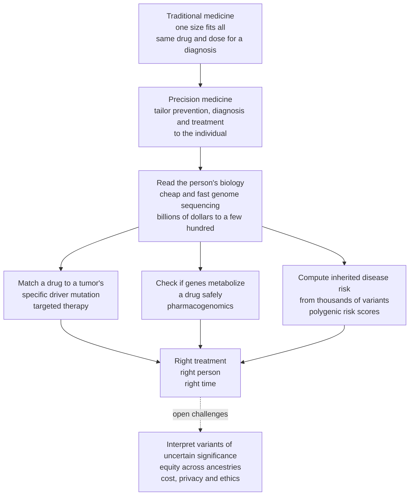

# 🧬 Precision Medicine and Genomics in the Clinic

> [!abstract] TL;DR
> Traditional medicine gives everyone with the same diagnosis the same drug at the same dose, even though a drug that saves one patient does nothing for a second and poisons a third. **Precision medicine** tailors prevention, diagnosis, and treatment to the *individual* — using their genetic, molecular, environmental, and lifestyle data to pick the right therapy for the right person at the right time. Its enabler was a technological miracle: sequencing a human genome collapsed from billions of dollars over years (the Human Genome Project) to a few hundred dollars in a day. That cheap genome now lets oncologists match targeted drugs to a **tumor's specific mutations**, lets clinicians use **pharmacogenomics** to choose safe and effective doses, diagnoses rare genetic disease, and computes an individual's inherited risk from thousands of variants at once — turning "the average patient" into *you*.

---

## Intuition

**Analogy FIRST — the one-size-fits-all suit versus the tailor.** Imagine a clothing store that stocks a single suit in one size and hands the identical suit to every customer who walks in. It fits a few people perfectly, hangs loosely on many, and splits at the seams on others — yet everyone was "treated" the same way. That is how much of medicine has worked: a diagnosis of "lung cancer" or "depression" triggers a standard drug at a standard dose, even though we all know from experience that people respond wildly differently. The same pill is a cure for one person, useless for the next, and dangerous for a third.

**Precision medicine is the tailor.** Instead of one suit for everyone, it takes your measurements first and cuts the cloth to fit *you*. The single most powerful "measuring tape" is your **genome** — the 3-billion-letter instruction manual stamped into nearly every cell. Reading it used to be like commissioning a hand-copied medieval book: the Human Genome Project cost roughly three billion dollars and took over a decade to produce one reference. Then sequencing technology went through the equivalent of the printing press. Today the same read costs a few hundred dollars and finishes in under a day — a price collapse *faster than Moore's law*.

With a cheap genome in hand, three things become possible. First, oncologists can read a **tumor's specific mutations** and choose a drug engineered to hit exactly that molecular defect — turning "lung cancer" from one disease into dozens of molecularly-defined subtypes, each with its own targeted therapy. Second, clinicians can check whether *your* particular genes metabolize a drug normally, too slowly (so a standard dose becomes toxic), or too fast (so it never works) — this is **pharmacogenomics**. Third, they can add up the tiny effects of thousands of common variants into a **polygenic risk score** that estimates your inherited susceptibility to common diseases years before symptoms. The vision is a shift from treating the statistical *average* patient to treating the actual person sitting in front of the doctor.

---

## How It Works

### Core mechanics

1. **Start from the vision.** Precision (or "personalized" / "stratified") medicine uses an individual's genetic, molecular, environmental, and lifestyle data to *customize* prevention, diagnosis, and treatment. The conceptual move is **stratification**: split a population that looks like "one disease" into molecularly-defined subgroups that respond differently, then match each subgroup to the therapy that works for *it*.
2. **Ride the enabler — the genomics revolution.** The **Human Genome Project** (completed 2003) produced the first reference. **Next-generation sequencing (NGS)** then drove per-genome cost from billions of dollars to a few hundred, while cheap **genotyping arrays** read hundreds of thousands of common variants for tens of dollars. Layered on top are **multi-omics** (transcriptomics, proteomics, metabolomics) and population-scale **biobanks** (UK Biobank, All of Us) that link genomes to health records.
3. **Apply it in the clinic through five channels.**
   - **Cancer genomics and targeted therapy** — sequence a *tumor's* somatic driver mutations and select a matched drug (HER2, EGFR, BRAF, ALK) or an immunotherapy biomarker; liquid biopsies read tumor DNA from a blood draw.
   - **Pharmacogenomics** — read *germline* variants in drug-handling genes (CYP2D6, CYP2C19, TPMT, DPYD, HLA-B) to pick the right drug and dose and avoid toxicity or non-response.
   - **Rare and inherited disease diagnosis** — exome/genome sequencing ends the "diagnostic odyssey"; carrier and newborn screening catch treatable disorders early.
   - **Risk prediction** — **polygenic risk scores** aggregate many common variants; **monogenic** risk variants (BRCA1/2, Lynch) flag high-penetrance hereditary risk.
   - **Beyond genomics** — biomarkers, wearables, and data-driven individualization feed the same tailoring loop.
4. **Close the loop back to care.** A variant is only useful if it is *interpretable* and *actionable*: it must be classified (pathogenic vs a **variant of uncertain significance, VUS**), tied to a guideline (e.g. CPIC pharmacogenomic dosing), and integrated into the clinical decision — the point where genomics meets the bedside.

### Flow



---

## Key Concepts

### Secondary (explain to a bright teenager)

- **One-size-fits-all vs tailored.** Old medicine gives everyone with a diagnosis the same treatment. Precision medicine measures *your* biology first and picks what will work for you.
- **Your genome is the measuring tape.** It is a 3-billion-letter manual in almost every cell. Small differences between people's manuals help explain why the same drug helps some people and harms others.
- **Sequencing got cheap, fast.** Reading a whole genome went from about three billion dollars and years of work to a few hundred dollars in a day — that price crash is what made precision medicine possible.
- **Three headline uses.** (1) Read a cancer's mutations and pick a drug aimed at exactly that mutation. (2) Check whether your genes break a drug down normally so the dose is safe. (3) Add up many small gene differences to estimate your risk of a disease before it happens.
- **It is a direction, not magic.** For most common illnesses your genes are only *part* of the story — environment and lifestyle still matter a lot.

### Undergraduate (needs some biology)

- **Germline vs somatic.** Precision *oncology* mostly reads a tumor's **somatic** mutations (acquired, present only in the cancer) to choose therapy. Pharmacogenomics and inherited-risk work read the **germline** genome (inherited, in every cell). Conflating the two is a common error.
- **Targeted therapy and matched biomarkers.** Instead of cytotoxic chemotherapy that hits all dividing cells, targeted agents inhibit a specific driver. Classic pairings: HER2-amplified breast cancer → trastuzumab; EGFR-mutant lung cancer → osimertinib; BRAF V600E melanoma → vemurafenib; ALK fusions → alectinib. Immunotherapy biomarkers (PD-L1 expression, tumor mutational burden, microsatellite instability) select patients for checkpoint inhibitors.
- **Pharmacogenomics of metabolism.** **CYP450** enzymes metabolize a large share of drugs. Genotype defines **poor, normal, and rapid/ultrarapid metabolizers**. For a drug cleared by the enzyme, a poor metabolizer accumulates high (toxic) levels while an ultrarapid metabolizer stays subtherapeutic. For a **prodrug** (e.g. clopidogrel, codeine) the logic *inverts*: poor metabolizers cannot activate it and get no effect. Other high-value examples: **TPMT/NUDT15** before thiopurines, **DPYD** before fluoropyrimidines, **HLA-B*57:01** before abacavir, **HLA-B*15:02** before carbamazepine.
- **Polygenic risk scores (PRS).** Most common diseases are **polygenic**: risk is spread across thousands of common variants of tiny effect, discovered by **genome-wide association studies (GWAS)**. A PRS sums these weighted effects into a single number; its population distribution is roughly bell-shaped, and the tails identify individuals whose *inherited* risk approaches that of a single high-penetrance mutation.
- **Monogenic risk and screening.** High-penetrance variants (BRCA1/2 for breast/ovarian, Lynch mismatch-repair genes for colorectal) justify cascade family testing and risk-reducing screening or surgery.

### Graduate (system-level / molecular)

- **Sequencing economics as the driver.** The per-genome cost curve broke sharply from Moore's-law scaling around 2007–2008 when massively parallel (NGS) chemistry replaced Sanger sequencing. This super-exponential collapse — not any single biological insight — is why genomic medicine became feasible at population scale; the constraint has shifted from *generating* sequence to *interpreting* it.
- **The interpretation bottleneck.** Variants are classified by **ACMG/AMP** criteria into a five-tier scale (pathogenic → likely pathogenic → VUS → likely benign → benign). The **VUS** problem is central: most rare variants observed in any given genome cannot yet be confidently called, and reclassification over time changes clinical meaning. Actionability lags association — a GWAS hit is a statistical signal, not a therapeutic target.
- **PRS construction and its limits.** A PRS is typically `sum_i (beta_i * dosage_i)` over variants, with weights from GWAS summary statistics, refined by LD-aware methods (LDpred, PRS-CS) that account for correlation between nearby variants. **Portability is poor across ancestries**: because GWAS discovery cohorts are overwhelmingly European, PRS accuracy degrades substantially in African, East Asian, and other populations — a structural **equity** failure that risks widening health disparities.
- **Multi-omics and liquid biopsy.** Beyond DNA, **transcriptomic** signatures (e.g. Oncotype DX for breast-cancer chemotherapy decisions), proteomics, and metabolomics refine subgroups. **Circulating tumor DNA (ctDNA)** enables non-invasive genotyping, minimal-residual-disease monitoring, and resistance-mutation tracking over the course of therapy.
- **Governance and ethics.** Incidental/**secondary findings** (ACMG maintains an actionable-gene list), the risk of **genetic discrimination** (in the US, GINA restricts health-insurance and employment use but not life/long-term-care insurance), consent and data privacy for genomes that are simultaneously personal and shared with relatives, and integration into clinical workflows — increasingly with machine-learning decision support — are as decisive as the biology.
- **Regulatory and evidentiary maturation.** Tissue-agnostic ("basket") approvals (pembrolizumab for any MSI-high solid tumor; larotrectinib for NTRK fusions) mark a shift from organ-of-origin to molecular-defect as the unit of disease — the clearest institutional signal that stratified medicine has arrived.

---

## Python Demo

```python
# Precision medicine, four illustrative pieces:
#   (a) the enabler  : collapse of genome-sequencing cost vs Moore's law
#   (b) stratification: one "disease" split by a biomarker into responders vs non-responders
#   (c) pharmacogenomics: metabolizer genotype -> drug blood levels vs the therapeutic window
#   (d) polygenic risk : PRS distribution and disease rate rising across PRS deciles
# All numbers are illustrative teaching values, not clinical data.
import numpy as np
import matplotlib.pyplot as plt

rng = np.random.default_rng(2026)
fig, ax = plt.subplots(2, 2, figsize=(15, 10))

# ---------------------------------------------------------------------------
# (a) Sequencing cost collapse vs Moore's law (log scale)
#     Approximate NHGRI "cost per genome" milestones.
year = np.array([2001, 2004, 2007, 2008, 2010, 2012, 2014, 2016, 2020, 2022])
cost = np.array([1e8,  2e7,  1e7,  1e6,  5e4,  1e4,  5e3,  1.5e3, 700, 400.0])
# Moore's law reference: halve every 2 years, anchored at 2001 cost
moore = cost[0] * 0.5 ** ((year - 2001) / 2.0)

ax[0, 0].semilogy(year, cost, "o-", color="#c0392b", lw=2, label="Genome sequencing cost")
ax[0, 0].semilogy(year, moore, "--", color="#7f8c8d", lw=2, label="Moore's law (halve / 2 yr)")
ax[0, 0].axvspan(2007, 2008.5, color="#f1c40f", alpha=0.25)
ax[0, 0].annotate("NGS arrives:\ncost falls faster\nthan Moore's law",
                  xy=(2008, 1e6), xytext=(2009.5, 8e6),
                  arrowprops=dict(arrowstyle="->"), fontsize=9)
ax[0, 0].set_xlabel("Year"); ax[0, 0].set_ylabel("Cost per genome (USD, log)")
ax[0, 0].set_title("(a) The enabler: sequencing cost collapse")
ax[0, 0].legend(fontsize=8); ax[0, 0].grid(True, which="both", alpha=0.3)

# ---------------------------------------------------------------------------
# (b) Stratification: a targeted drug looks like a failure "for everyone",
#     but is spectacular in the biomarker-positive subgroup.
p_pos   = 0.15          # fraction biomarker-positive (e.g. driver-mutation +)
rr_pos  = 0.70          # response rate of targeted drug in biomarker +
rr_neg  = 0.08          # response rate of targeted drug in biomarker -
rr_chemo = 0.25         # response rate of standard chemo, unselected
rr_all  = p_pos * rr_pos + (1 - p_pos) * rr_neg   # targeted drug given to everyone

labels = ["Chemo\n(all patients)", "Targeted drug\n(all, unselected)",
          "Targeted drug\nbiomarker -", "Targeted drug\nbiomarker +"]
vals   = [rr_chemo, rr_all, rr_neg, rr_pos]
colors = ["#7f8c8d", "#95a5a6", "#e67e22", "#27ae60"]
bars = ax[0, 1].bar(labels, vals, color=colors)
for b, v in zip(bars, vals):
    ax[0, 1].text(b.get_x() + b.get_width()/2, v + 0.02, f"{v*100:.0f}%",
                  ha="center", fontsize=9)
ax[0, 1].axhline(rr_chemo, color="#7f8c8d", ls=":", lw=1)
ax[0, 1].set_ylabel("Response rate")
ax[0, 1].set_ylim(0, 0.85)
ax[0, 1].set_title("(b) Stratify first: the responders hide in a subgroup")
ax[0, 1].annotate("Unselected, the drug\nlooks worse than chemo\n-> test, then treat the +",
                  xy=(1, rr_all), xytext=(1.4, 0.55),
                  arrowprops=dict(arrowstyle="->"), fontsize=8)

# ---------------------------------------------------------------------------
# (c) Pharmacogenomics: same repeated dose, three metabolizer genotypes.
#     One-compartment oral model, superposed multi-dosing.
def oral_conc(t, dose, ka, ke, V):
    t = np.asarray(t, float)
    c = np.zeros_like(t)
    m = t > 0
    c[m] = dose * ka / (V * (ka - ke)) * (np.exp(-ke * t[m]) - np.exp(-ka * t[m]))
    return c

def multi_dose(t, dose, ka, ke, V, tau, n):
    return sum(oral_conc(t - k * tau, dose, ka, ke, V) for k in range(n))

t = np.linspace(0, 96, 2000)
dose, ka, V, tau, n = 100.0, 1.2, 40.0, 12.0, 8
c_poor   = multi_dose(t, dose, ka, 0.03, V, tau, n)   # slow clearance -> accumulates
c_normal = multi_dose(t, dose, ka, 0.10, V, tau, n)   # therapeutic
c_rapid  = multi_dose(t, dose, ka, 0.30, V, tau, n)   # fast clearance -> subtherapeutic

plateau = np.mean(c_normal[t > 60])                    # centre the window on "normal"
win_lo, win_hi = 0.6 * plateau, 1.9 * plateau
ax[1, 0].axhspan(win_lo, win_hi, color="#2ecc71", alpha=0.15, label="Therapeutic window")
ax[1, 0].plot(t, c_poor,   color="#c0392b", lw=2, label="Poor metabolizer -> toxic")
ax[1, 0].plot(t, c_normal, color="#2980b9", lw=2, label="Normal -> therapeutic")
ax[1, 0].plot(t, c_rapid,  color="#8e44ad", lw=2, label="Rapid -> subtherapeutic")
ax[1, 0].set_xlabel("Time (hours, dosing every 12 h)")
ax[1, 0].set_ylabel("Drug concentration (arb. units)")
ax[1, 0].set_title("(c) Pharmacogenomics: one dose, three genotypes")
ax[1, 0].legend(fontsize=8, loc="upper left")

# ---------------------------------------------------------------------------
# (d) Polygenic risk: liability-threshold model -> disease rate by PRS decile.
N   = 200_000
h2  = 0.30                                   # variance in liability explained by PRS
K   = 0.10                                   # population prevalence
prs = rng.standard_normal(N)                 # standardized polygenic risk score
env = rng.standard_normal(N)
liab = np.sqrt(h2) * prs + np.sqrt(1 - h2) * env
thresh = np.quantile(liab, 1 - K)            # top K by liability are "affected"
affected = liab > thresh

deciles = np.digitize(prs, np.quantile(prs, np.linspace(0, 1, 11)[1:-1]))
rate = np.array([affected[deciles == d].mean() for d in range(10)])
ax[1, 1].bar(np.arange(1, 11), rate * 100, color="#16a085")
ax[1, 1].axhline(K * 100, color="#c0392b", ls="--", lw=1.5,
                 label=f"Population average ({K*100:.0f}%)")
ax[1, 1].set_xlabel("PRS decile (1 = lowest inherited risk, 10 = highest)")
ax[1, 1].set_ylabel("Disease rate (%)")
ax[1, 1].set_title("(d) Polygenic risk: the tail carries the load")
ax[1, 1].set_xticks(range(1, 11)); ax[1, 1].legend(fontsize=8)

plt.tight_layout()
plt.savefig("precision_medicine_genomics.png", dpi=120)
plt.show()

# Console sanity check
print(f"(b) Targeted drug, unselected response = {rr_all*100:.1f}%  vs chemo {rr_chemo*100:.0f}%")
print(f"    Same drug in biomarker-positive     = {rr_pos*100:.0f}%")
print(f"(c) Steady-state 'normal' plateau ~ {plateau:.2f}; window ~ [{win_lo:.2f}, {win_hi:.2f}]")
print(f"(d) Disease rate  bottom decile = {rate[0]*100:.1f}%   top decile = {rate[-1]*100:.1f}%")
print(f"    Top-vs-bottom relative risk = {rate[-1]/max(rate[0],1e-6):.1f}x")
```

**What it shows.** Panel **(a)** is the whole story's engine: after next-generation sequencing arrived around 2007–2008, cost per genome fell *below* the Moore's-law line — a super-exponential collapse from ~100 million to a few hundred dollars that made genomic medicine affordable. Panel **(b)** is the core logic of stratification: a targeted drug given to an *unselected* population responds worse than plain chemotherapy and looks like a failure, yet in the biomarker-positive subgroup it works in 70% of patients — you must *test, then treat the right subgroup*. Panel **(c)** is pharmacogenomics: the identical dose lands in the therapeutic window for a normal metabolizer, accumulates to toxic levels in a poor metabolizer, and stays subtherapeutic in a rapid metabolizer (for a **prodrug** the toxic/subtherapeutic labels swap). Panel **(d)** is polygenic risk: disease rate climbs steeply across PRS deciles, so the top of the inherited-risk distribution carries far more than its share — the basis for genomic risk stratification.

---

## Real-World Applications

> **Precision oncology — matching a drug to a tumor's mutation.** A patient with metastatic non-small-cell lung cancer no longer just gets "chemotherapy." Their tumor is sequenced; if it carries an **EGFR** activating mutation they receive osimertinib, an **ALK** fusion → alectinib, a **KRAS G12C** mutation → sotorasib, high **PD-L1** → a checkpoint inhibitor. "Lung cancer" has become dozens of molecularly-defined diseases, each with its own first-line drug — and **tissue-agnostic** approvals (pembrolizumab for any MSI-high tumor, larotrectinib for any NTRK-fusion tumor) treat the *mutation*, not the organ.

- **Pharmacogenomic dosing.** Before starting a thiopurine (azathioprine), many centers test **TPMT/NUDT15**; poor metabolizers would otherwise suffer life-threatening myelosuppression at a standard dose. **DPYD** testing before fluorouracil, **HLA-B*57:01** before abacavir (to prevent fatal hypersensitivity), **HLA-B*15:02** before carbamazepine, and **CYP2C19** for clopidogrel activation are established, guideline-backed (CPIC) examples.
- **Ending the diagnostic odyssey.** Rapid whole-genome sequencing now diagnoses critically ill newborns in the ICU within days, and exome sequencing routinely solves years-long searches for children with unexplained developmental disorders — often revealing a *de novo* variant absent in both parents.
- **Liquid biopsy.** Circulating tumor DNA from a simple blood draw genotypes tumors that are hard to biopsy, monitors minimal residual disease after surgery, and detects resistance mutations *before* imaging shows progression.
- **Population risk stratification.** BRCA1/2 cascade testing enables risk-reducing screening and surgery in families; polygenic risk scores are being piloted to identify individuals with monogenic-equivalent inherited risk for coronary disease, breast cancer, and type 2 diabetes for earlier, more intensive prevention.
- **National programs and biobanks.** The US *All of Us* Research Program, *Genomics England* / NHS Genomic Medicine Service, and the UK Biobank operationalize precision medicine at population scale, linking genomes to health records to make the vision routine rather than boutique.

---

## Common Pitfalls

- **Confusing germline with somatic testing.** A tumor-sequencing result guides *this cancer's* therapy; it does not usually mean the mutation is inherited or heritable. Germline pharmacogenomic or cancer-predisposition testing answers a different question. Ordering or interpreting the wrong one misleads both treatment and family counseling.
- **Treating a GWAS association as if it were actionable.** A statistically robust variant–disease association is *not* automatically a drug target or a management change. The gap between **association and actionability** is where most genomic hype dies; a PRS that predicts risk may still not tell you what to *do* about it.
- **Ignoring the ancestry equity gap.** Because discovery cohorts are overwhelmingly European, **polygenic risk scores lose accuracy in non-European populations**. Deploying a European-derived PRS globally can systematically misclassify risk and *widen* health disparities — an ethical and scientific failure, not a rounding error.
- **Drowning in variants of uncertain significance.** Sequence more genome and you find more **VUS** — variants you cannot confidently call pathogenic or benign. Acting on a VUS (e.g. prophylactic surgery) or being paralyzed by one both cause harm; VUS should generally not drive irreversible decisions and may be reclassified later.
- **Forgetting the prodrug inversion in pharmacogenomics.** For an active drug cleared by an enzyme, poor metabolizers accumulate toxic levels. For a **prodrug** (clopidogrel, codeine) that the enzyme *activates*, poor metabolizers get *no* effect while ultrarapid metabolizers may be dangerously over-activated. Applying the wrong direction is a classic and dangerous error.
- **Overselling determinism.** For most common diseases, genes explain only part of the risk; environment, lifestyle, and chance dominate. A "low genetic risk" score is not a license to ignore prevention, and a high score is not a sentence.
- **Underweighting privacy and discrimination.** A genome is simultaneously the patient's and, partly, their relatives'. Incidental findings, insurance/employment discrimination, and consent for data reuse are not afterthoughts — they can determine whether patients trust and use the technology at all.

---

## Related Concepts

- [[Pharmacogenomics_and_Personalized_Medicine]] — the Genetics-vault basic-science companion detailing CYP450, TPMT, and HLA gene–drug mechanisms; this clinical note operationalizes them into dosing decisions.
- [[DNA_Sequencing_Technologies]] — the next-generation-sequencing chemistry whose plummeting cost (panel a) is the enabler of everything here.
- [[Complex_Trait_Genetics_and_GWAS]] — the genome-wide association studies that supply the variant weights behind polygenic risk scores.
- [[Cancer_Genetics_and_Oncogenes]] — the driver-mutation biology that precision oncology reads to select matched targeted therapy.
- [[Gene_Therapy_and_CRISPR]] — the molecular-repair endpoint when a precise diagnosis identifies a single correctable defect.
- [[Human_Genome_and_Genetic_Variation]] — the catalogue of human variation (SNPs, structural variants) that all clinical interpretation is measured against.
- [[Single_Cell_Genomics_and_Multi_Omics]] — the transcriptomic/proteomic/metabolomic layers that refine molecular subgroups beyond DNA.
- [[Genetic_Counseling_and_Prenatal_Testing]] — the counseling and consent workflow that responsibly delivers genomic results, incidental findings, and risk figures.
- [[Genomics_and_Bioinformatics]] — the Biology-vault overview of genome analysis and the computational pipelines that turn raw reads into interpretable variants.
- [[CRISPR_and_Genome_Editing]] — the Biology-vault editing toolkit behind emerging targeted genomic therapies.
- [[Biomarkers_and_Measuring_Health]] — the broader "measure the individual" principle beyond genomics, from protein markers to wearables.
- [[Genes_Environment_and_Epigenetics_in_Health]] — why genomes are only part of the risk picture, tempering genetic determinism.
- [[The_Future_of_Health_and_Medicine]] — the data-driven, personalized trajectory of healthcare this note sits inside.

Within this vault, this note is the clinical-application capstone that translates genetics to the bedside. It builds directly on **Genetic and Congenital Disease** (inheritance patterns and rare-disease diagnosis) and **Neoplasia and Cancer Biology** (the driver-mutation logic of targeted therapy); it supplies the molecular stratification that **Diagnostic Reasoning and Clinical Decision Making** folds into its probabilistic reasoning; it pairs tightly with **AI and Technology in Clinical Medicine**, since interpreting genomes and integrating them into care increasingly depends on machine learning; and it feeds forward into **The Reach and Future of Clinical Medicine**, where cheap sequencing, multi-omics, and data-driven individualization define where medicine is heading.

---

## Review Questions

**Secondary**
1. In plain language, what is the difference between "one-size-fits-all" medicine and precision medicine, and why did cheap DNA sequencing make the second one possible?
2. Give one example each of how reading a person's genes can help choose (i) a cancer drug and (ii) a safe dose of an ordinary medicine.

**Undergraduate**
3. A new targeted drug shows only a 17% response rate in an unselected trial and is called a failure — yet a biomarker-positive subgroup responds 70% of the time. Explain what stratification reveals here and how it should change the way the drug is used.
4. For a drug that is *cleared* by CYP2D6, describe the expected blood-level and safety difference between a poor metabolizer and an ultrarapid metabolizer at a standard dose. How does the conclusion change if the drug is a *prodrug* activated by CYP2D6?

**Graduate**
5. Polygenic risk scores are derived mostly from European-ancestry GWAS. Explain, mechanistically, why their predictive accuracy degrades in other populations, and argue why deploying them without correction is both a scientific and an ethical problem.
6. Contrast the interpretive and clinical challenges of a **somatic** tumor VUS versus a **germline** VUS discovered incidentally on whole-genome sequencing. In each case, what would responsible action (and inaction) look like, and who else is affected by the result?

---

## Sources

- Collins FS, Varmus H. "A New Initiative on Precision Medicine." *New England Journal of Medicine* 2015;372:793–795 — the foundational policy statement launching the US Precision Medicine Initiative.
- Ashley EA. "Towards precision medicine." *Nature Reviews Genetics* 2016;17:507–522 — comprehensive review of genomic technologies and their clinical translation.
- Roden DM, McLeod HL, Relling MV, et al. "Pharmacogenomics." *The Lancet* 2019;394:521–532 — authoritative review of gene–drug interactions and clinical implementation (CPIC).
- Nussbaum RL, McInnes RR, Willard HF. *Thompson & Thompson Genetics and Genomics in Medicine.* 8th/9th ed. Elsevier — standard textbook on clinical genomics, variant interpretation, and precision diagnosis.
- [National Human Genome Research Institute — "The Cost of Sequencing a Human Genome"](https://www.genome.gov/about-genomics/fact-sheets/Sequencing-Human-Genome-cost) — the primary-source data behind the sequencing-cost-collapse curve.

---

#clinical-medicine #precision-medicine #genomics #pharmacogenomics #targeted-therapy
