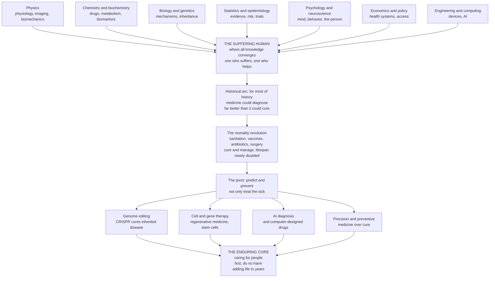

# 🩺 The Reach and Future of Clinical Medicine

> [!abstract] TL;DR
> This is the **capstone** of the whole Clinical Medicine vault. Its claim is simple and vast: **medicine is where all of science converges on the human being.** A single patient encounter draws on the *physics* of a heartbeat, the *chemistry* of a drug, the *biology* of a cell, the *genetics* of a disease, the *statistics* of a clinical trial, the *psychology* of the person, and the *economics* of the system that treats them — all focused on the ancient meeting of one who suffers and one who tries to help. For most of history, medicine could **diagnose** far better than it could **cure**; the last century inverted that, turning death sentences into manageable or curable conditions and **nearly doubling human lifespan** — one of civilization's greatest achievements. Now medicine is entering an era of **reading and rewriting our own biology**: genome editing that cures inherited disease, cell and gene therapies, AI that reads scans and designs drugs, and a historic pivot from *treating the sick* to **predicting and preventing** illness before it strikes. Yet beneath every new technology endure the same truths that always governed the craft — that medicine is ultimately about **caring for people**, that "**first, do no harm**," and that the goal is not merely adding *years to life* but adding **life to years**.

---

## Intuition

**Analogy — step back, and see medicine whole.** Imagine every science as a river. Physics carries the laws of pressure and flow that drive blood through vessels; chemistry carries the reactions that a drug exploits; biology and genetics carry the machinery of the cell and the code that builds it; statistics carries the hard-won knowledge of what actually works; psychology carries the mind of the person who is ill; economics carries the systems that pay for and deliver care. These rivers run through the entire rest of this second brain — through the physics vault, the chemistry vault, the biology and genetics vaults, the statistics and psychology and economics vaults — each flowing on its own. **Clinical medicine is the sea where they all empty**, the one place where every stream of human knowledge is made to converge on a single object: a suffering person who wants to feel better. No other field integrates so much, because no other field has such an unforgiving test — a real body, in real time, that either heals or does not.

Now watch that sea change across history. For nearly all of the human story, a physician could *name* your affliction with growing precision but could do heartbreakingly little to reverse it — medicine was mostly the art of **diagnosis and comfort**, not cure. Then, in a single astonishing century, sanitation, germ theory, anesthesia, antibiotics, vaccines, and molecular biology turned tuberculosis, childbirth fever, and childhood leukemia from near-certain killers into things we prevent, manage, or cure — and the average human lifespan **roughly doubled**. Today the frontier moves again: we are learning to *edit* the genome that writes disease, to *grow* replacement cells and tissues, to let *machines* read images and design molecules, and to *predict* who will fall ill so we can act before they do. This note surveys that immense **reach** of medicine across all the sciences, and its extraordinary **future** — while insisting, throughout, on the enduring human and ethical core that no scanner or algorithm can replace. Medicine is the ultimate *applied* science, and it is the reason for studying every mechanism, every reasoning method, and every technology gathered in this vault: **to understand, to heal, and to care for people.**

---

## How It Works

### The reach — an applied, integrative science

Clinical medicine is not one discipline but the **integration** of nearly all of them, forced into practical use at the bedside:

1. **Physics** underlies physiology (pressures, flows, electricity of the heart and nerve), medical **imaging** (X-ray, CT, ultrasound, MRI), and biomechanics.
2. **Chemistry and biochemistry** govern **pharmacology** (how a drug binds, is metabolized, and cleared), metabolism, and the biomarkers read in every blood test.
3. **Biology and genetics** supply the **mechanisms** of disease — cells, tissues, immunity, inheritance — the substrate all of pathophysiology stands on.
4. **Statistics and epidemiology** turn anecdote into **evidence**: quantifying risk, testing therapies in trials, and separating what works from what merely seems to.
5. **Psychology and neuroscience** address the **mind and behavior** — the patient's fears and choices, the placebo effect, adherence, and mental illness itself.
6. **Economics and policy** determine which care is **affordable, delivered, and to whom** — the health-system layer that decides whether knowledge reaches a human at all.
7. **Engineering and computing** build the **devices** (pacemakers, ventilators, robotic surgery) and the **AI** now reshaping diagnosis and drug discovery.

All of this converges on the individual patient — and, at its best, on the **biopsychosocial whole person**: not a broken part to be fixed, but a body, a mind, and a life in a social world.

### The historical arc — from diagnosing to curing to preventing

- **Ancient and humoral medicine.** For millennia, illness was explained by imbalance of humors; treatment was mostly observation, comfort, and hope. The physician's great skill was **prognosis** — telling what would happen — not intervention.
- **The germ-theory and sanitation revolution (1800s).** Clean water, handwashing, and the discovery that specific microbes cause specific diseases (Pasteur, Koch, Lister, Semmelweis) drove down infectious mortality more than any drug ever would.
- **The therapeutic explosion (1900s).** **Anesthesia and antisepsis** made modern surgery possible; **vaccines** eradicated smallpox and tamed polio; **antibiotics** turned lethal infections into a week of pills; insulin, dialysis, and transplantation rescued failing organs.
- **The molecular and chronic-disease era.** As infections receded, the leading killers shifted to **chronic, non-communicable disease** — heart disease, cancer, diabetes, dementia. This is the **epidemiologic transition**, and it, together with public health, **nearly doubled human life expectancy** across the last century and a half.

### The frontiers — predict, precise, regenerate, augment

- **Preventive and predictive medicine** — the great pivot from treating the sick to **keeping people well**: risk prediction, screening, and lifestyle acting *before* symptoms.
- **Precision and genomic medicine** — matching therapy to the individual's molecular subtype and **pharmacogenomics** (the right drug, right dose, by genotype).
- **Gene and cell therapies** — **CRISPR** genome editing curing inherited disease, **CAR-T** cells reprogrammed to hunt cancer, **regenerative medicine** and stem cells rebuilding tissue, and engineered organs.
- **AI and digital medicine** — algorithms that read scans and pathology, discover and **design drugs**, and monitor health continuously through wearables.
- **Immunotherapy** — unleashing the immune system against cancer, one of oncology's greatest recent revolutions.
- **The microbiome, longevity science, and neurotechnology** — new organs of intervention, from the gut ecosystem to the biology of aging to brain–machine interfaces.

### The enduring core — beneath all the technology

- The **doctor–patient relationship** and clinical humanism.
- **Medical ethics** — autonomy, beneficence, non-maleficence ("first, do no harm"), and justice.
- **Evidence and humility** — knowing what we do not know.
- The aim of not merely prolonging life but improving its **quality**: *life to years*.

### From all the sciences, to the patient, to the future, back to the enduring core



*Read top to bottom: all the sciences converge on the patient; the patient sits at the end of a historical arc from diagnosis to cure to prevention; the frontiers extend that arc — but every frontier ultimately serves, and is judged by, the enduring human and ethical core at the bottom.*

---

## Key Concepts

### Secondary (intuitive)

- **Medicine uses all of science.** Fixing a person means using physics, chemistry, biology, genetics, math, psychology, and even economics all at once — the doctor is the point where every subject meets a real human.
- **We used to name diseases we couldn't cure.** For most of history, a doctor could tell you *what* was wrong far better than they could *fix* it. That flipped in the last hundred years.
- **People live about twice as long now.** Clean water, vaccines, antibiotics, and surgery roughly **doubled** how long the average person lives — a bigger change than most people realize.
- **The next step is stopping disease before it starts.** Instead of only treating the sick, medicine is learning to **predict** who will get ill and **prevent** it.
- **The heart of it never changes.** Under all the machines and drugs, medicine is still one person caring for another, trying above all to **do no harm**.

### Undergraduate (formal)

- **The epidemiologic transition.** As societies develop, the dominant causes of death shift from **infectious and nutritional** disease (which mainly kill the young) to **chronic, non-communicable** disease — cardiovascular disease, cancer, diabetes, dementia — which mainly affect the old. This reshapes what medicine must do.
- **The demographic dividend and its cost.** Falling child mortality and longer lifespans transformed populations, but produced **aging societies** with a rising burden of chronic disease and dementia — a defining challenge of 21st-century medicine.
- **Evidence-based medicine (EBM).** Modern practice rests on a hierarchy of evidence — from case reports up through **randomized controlled trials** and systematic reviews — that disciplines intuition with data on what genuinely helps.
- **Precision vs population medicine.** Twentieth-century medicine treated the *average* patient; precision medicine stratifies by molecular subtype, **pharmacogenomics**, and individual risk, splitting old diagnoses into mechanistically distinct diseases with distinct treatments.
- **Prevention beats cure — usually.** Primary prevention (vaccination, clean water, lifestyle, risk-factor control) has historically saved far more lives than dramatic cures, and remains the highest-leverage layer of the system.
- **The biopsychosocial model.** Health and illness are not purely biological; they emerge from the interaction of biology, psychology, and social context — a corrective to reductionist, organ-only thinking.

### Graduate (integrative and systems)

- **Medicine as the ultimate applied, integrative science.** Its distinctive epistemology fuses **mechanism** (reductionist molecular explanation) with **evidence** (population-level statistical inference) and **judgment** (individual decision under uncertainty) — three modes of knowing that often conflict, and whose integration *is* clinical expertise.
- **The therapeutic reach of genome editing.** CRISPR-based therapies now **functionally cure** monogenic disease: the 2023 approval of an ex vivo gene-edited therapy for sickle cell disease and β-thalassemia marks the first regulatory sanction of editing the human genome as medicine — with in vivo editing and base/prime editing extending the toolkit.
- **Living drugs and regeneration.** **CAR-T** and other engineered cell therapies convert a patient's own immune cells into targeted anti-cancer agents; induced pluripotent stem cells, organoids, and xenotransplantation aim to **replace** rather than merely repair failing tissue — shifting the paradigm from pharmacology to fabrication.
- **AI as a clinical instrument.** Deep-learning systems now match or exceed specialists at narrow tasks (diabetic retinopathy, some pathology and radiology reads), accelerate drug discovery (AlphaFold-enabled structure-based design), and enable continuous, ambient monitoring — while raising hard problems of bias, validation, interpretability, and the "gift of time" versus deskilling.
- **The unsolved and the enduring.** Antimicrobial resistance, chronic disease in aging populations, health **inequity and access**, spiraling cost, pandemic threat, and mental illness remain intractable; and no advance dissolves the timeless ethical spine — **autonomy, beneficence, non-maleficence, justice** — or the goal, articulated as *compression of morbidity*, of adding **life to years**, not merely years to life.

---

## Python Demo

```python
# THE SWEEP AND FUTURE OF MEDICINE, in four pictures.
#   (A) THE MORTALITY REVOLUTION: human life expectancy roughly DOUBLED over the
#       last two centuries -- one of civilization's greatest achievements.
#   (B) THE EPIDEMIOLOGIC TRANSITION: as medicine and public health advanced, the
#       leading causes of death shifted from INFECTIOUS disease (killers of the
#       young) to CHRONIC / non-communicable disease (cancer, heart disease, dementia).
#   (C) THE FRONTIER: the cost of reading a human genome fell FASTER than Moore's law,
#       the enabling technology of precision and genomic medicine.
#   (D) FROM CURE TO PREVENTION: the "compression of morbidity" -- the future aim is
#       not just more years, but more HEALTHY years, compressing illness into a
#       shorter window near the end (life to years, not just years to life).
#
# Figures are illustrative, textbook-level approximations -- not clinical data.
import numpy as np
import matplotlib.pyplot as plt

fig, ax = plt.subplots(2, 2, figsize=(15, 11))
fig.suptitle("The reach and future of clinical medicine: from diagnosing, to curing, to preventing",
             fontsize=15, fontweight="bold")

# ------------------------------------------------------------------
# (A) Life expectancy over time (global, approximate) -- the near-doubling
# ------------------------------------------------------------------
yr_le = np.array([1770, 1800, 1850, 1900, 1920, 1950, 1970, 1990, 2000, 2010, 2020])
le    = np.array([  29,   30,   32,   34,   35,   47,   58,   65,   67,   70,   73])
axA = ax[0, 0]
axA.plot(yr_le, le, "-o", color="#1f77b4", lw=2.4, ms=6)
axA.axhline(le[0], color="grey", ls=":", lw=1)
axA.axhline(le[-1], color="grey", ls=":", lw=1)
axA.annotate("", xy=(1780, le[-1]), xytext=(1780, le[0]),
             arrowprops=dict(arrowstyle="<->", color="#d62728", lw=2))
axA.text(1795, (le[0] + le[-1]) / 2, f"~{le[-1]/le[0]:.1f}x\n(nearly doubled)",
         color="#d62728", fontsize=10, fontweight="bold", va="center")
axA.set_title("(A) The mortality revolution:\nglobal life expectancy roughly doubled")
axA.set_xlabel("Year"); axA.set_ylabel("Life expectancy at birth (years)")
axA.set_ylim(20, 85); axA.grid(alpha=0.3)

# ------------------------------------------------------------------
# (B) Epidemiologic transition -- share of deaths, infectious vs chronic
# ------------------------------------------------------------------
yr = np.linspace(1900, 2020, 200)
# smooth logistic shift: infectious falls, chronic rises, "other" a small remainder
infectious = 45 / (1 + np.exp((yr - 1945) / 12)) + 5      # ~50% -> ~5%
chronic    = 80 / (1 + np.exp(-(yr - 1950) / 15)) + 8      # ~10% -> ~85%
total      = infectious + chronic
infectious = 100 * infectious / total                     # normalise to 100%
chronic    = 100 * chronic / total
axB = ax[0, 1]
axB.stackplot(yr, chronic, infectious,
              labels=["Chronic / non-communicable\n(heart disease, cancer, dementia)",
                      "Infectious & nutritional\n(historically dominant)"],
              colors=["#8E44AD", "#E67E22"], alpha=0.85)
axB.set_title("(B) The epidemiologic transition:\ninfectious -> chronic disease")
axB.set_xlabel("Year"); axB.set_ylabel("Share of deaths (%)")
axB.set_xlim(1900, 2020); axB.set_ylim(0, 100)
axB.legend(loc="center left", fontsize=8, framealpha=0.9)

# ------------------------------------------------------------------
# (C) The frontier: falling cost of sequencing a human genome (log scale)
# ------------------------------------------------------------------
yr_seq = np.array([2001, 2004, 2006, 2008, 2010, 2013, 2015, 2017, 2020, 2022])
cost   = np.array([95e6, 20e6, 10e6, 1e6, 50e3, 5e3, 1500, 1000, 600, 200])  # USD/genome
# Moore's law reference doubling every 2 yr, anchored at 2001
moore = 95e6 * 0.5 ** ((yr_seq - 2001) / 2.0)
axC = ax[1, 0]
axC.semilogy(yr_seq, cost, "-o", color="#2ca02c", lw=2.4, ms=6, label="Cost per genome")
axC.semilogy(yr_seq, moore, "--", color="#7f7f7f", lw=1.8, label="Moore's law (halve / 2 yr)")
axC.set_title("(C) The frontier of precision medicine:\ngenome sequencing cost fell faster than Moore's law")
axC.set_xlabel("Year"); axC.set_ylabel("Cost per genome (USD, log scale)")
axC.grid(alpha=0.3, which="both"); axC.legend(fontsize=9)

# ------------------------------------------------------------------
# (D) Compression of morbidity: from cure toward prevention
# ------------------------------------------------------------------
age = np.linspace(40, 100, 300)
def function_curve(mid, width):   # functional capacity 0-100 vs age (sigmoid decline)
    return 100 / (1 + np.exp((age - mid) / width))
reactive   = function_curve(mid=68, width=9)   # today: earlier, more gradual decline
preventive = function_curve(mid=84, width=4)   # future: healthy longer, then compressed
disability = 50                                 # threshold below = "morbidity"
axD = ax[1, 1]
axD.plot(age, reactive, color="#d62728", lw=2.4, label="Reactive medicine (treat the sick)")
axD.plot(age, preventive, color="#1f77b4", lw=2.4, label="Preventive medicine (predict & prevent)")
axD.axhline(disability, color="grey", ls=":", lw=1)
axD.text(41, disability + 2, "disability threshold", fontsize=8, color="grey")
# morbidity windows (function below threshold)
onset_r = age[np.argmax(reactive < disability)]
onset_p = age[np.argmax(preventive < disability)]
axD.axvspan(onset_r, 100, color="#d62728", alpha=0.08)
axD.axvspan(onset_p, 100, color="#1f77b4", alpha=0.10)
axD.annotate("morbidity\ncompressed", xy=((onset_p + 100) / 2, 20),
             ha="center", fontsize=9, color="#1f77b4", fontweight="bold")
axD.set_title("(D) Compression of morbidity:\nadding LIFE to years, not just years to life")
axD.set_xlabel("Age (years)"); axD.set_ylabel("Functional capacity / health")
axD.set_xlim(40, 100); axD.set_ylim(0, 105); axD.legend(loc="lower left", fontsize=8)

plt.tight_layout(rect=[0, 0, 1, 0.95])
plt.savefig("reach_future_medicine.png", dpi=130)
plt.show()

print(f"(A) Life expectancy: {le[0]} -> {le[-1]} yr  = {le[-1]/le[0]:.2f}x over ~250 yr")
print(f"(B) Infectious share of deaths: ~{infectious[0]:.0f}% (1900) -> ~{infectious[-1]:.0f}% (2020)")
print(f"(C) Genome cost: ${cost[0]:,.0f} (2001) -> ${cost[-1]:,.0f} (2022)  = {cost[0]/cost[-1]:,.0f}x cheaper")
print(f"(D) Morbidity onset pushed from age ~{onset_r:.0f} (reactive) to ~{onset_p:.0f} (preventive)")
```

**What you see.** *Panel (A)* is medicine's single most consequential achievement rendered as one line: global life expectancy climbing from roughly the high-20s to the low-70s — a **near-doubling** — in the historical blink of two centuries, driven far more by sanitation, vaccines, and antibiotics than by any heroic cure. *Panel (B)* shows the **epidemiologic transition** that this success created: as infectious killers of the young were beaten back, the leading causes of death shifted to the **chronic diseases of aging** — heart disease, cancer, dementia — which now define what medicine must confront. *Panel (C)* captures the enabling technology of the coming era: the cost of reading a human genome collapsed from about **95 million dollars to a few hundred**, *outpacing Moore's law*, and putting each person's molecular blueprint within reach of routine care. *Panel (D)* is the aspiration beneath the whole future: not simply extending the lifespan but **compressing morbidity** — keeping people functionally healthy for longer and shortening the frail window at the end. That is the quantitative face of the oldest goal in medicine: adding *life to years*, not just years to life.

---

## Real-World Applications

> **Example — a genetic disease cured by editing the genome.** In late 2023, regulators approved **exagamglogene autotemcel (Casgevy)**, the first medicine based on **CRISPR** genome editing, for **sickle cell disease** and β-thalassemia. A patient's own blood stem cells are removed, a single well-chosen edit reactivates fetal hemoglobin, and the cells are returned — functionally curing a painful, once-untreatable inherited disease by *rewriting the very code that caused it*. This is the whole arc of this note in one therapy: chemistry and molecular biology found the mechanism, genetics supplied the target, engineering built the editing tool, statistics proved it in trials, ethics debated who should receive it and at what cost — all converging on one suffering person. See [[Genetic_and_Congenital_Disease]] for the diseases such tools address.

The reach and future of clinical medicine show up across the whole system:

- **Precision oncology and immunotherapy.** Tumors are sequenced and matched to targeted drugs by their driver mutations, and **CAR-T** cell therapy reprograms a patient's immune cells to destroy blood cancers — the frontier built directly on [[Neoplasia_and_Cancer_Biology]].
- **Pharmacogenomics at the pharmacy.** Genotype-guided dosing (for example, avoiding a drug a patient's liver cannot safely clear) is moving from research into routine prescribing — the "right drug, right dose" promise of precision medicine.
- **AI-assisted diagnosis.** Deep-learning systems screen retinal scans for diabetic eye disease, flag strokes and cancers on imaging, and triage pathology — extending expert-level pattern recognition to places with few specialists.
- **Prediction and prevention.** Polygenic risk scores, continuous glucose monitors, and wearables push medicine *upstream*, catching disease loops before symptoms appear — the pivot exemplified by chronic conditions like [[Diabetes_Mellitus_and_Glucose_Regulation]].
- **The enduring frontiers of failure.** Antimicrobial resistance threatens to undo the antibiotic revolution ([[Infectious_Disease_and_Host_Pathogen_Interaction]]); dementia and the diseases of aging strain every health system ([[Neurodegenerative_and_Cognitive_Disorders]]); and mental illness remains under-treated worldwide ([[Psychiatric_and_Behavioral_Disorders]]) — reminders that new tools do not retire old problems.

---

## Common Pitfalls

- **Techno-utopianism — mistaking capability for delivery.** A therapy that *exists* is not a therapy that *reaches people*. A multi-million-dollar gene edit that only the wealthy can access can widen, not narrow, the gap between the health of the rich and the poor. The hardest problems in medicine's future are as much about **access, cost, and equity** as about biology.
- **Confusing "more years" with "better years."** Extending lifespan without extending *healthspan* can simply lengthen the period of frailty and suffering. The goal that endures is the **compression of morbidity** — life to years — not survival at any quality.
- **Forgetting that prevention is unglamorous but supreme.** Dramatic cures capture attention; clean water, vaccination, and risk-factor control have saved vastly more lives. Undervaluing prevention because it is invisible is a recurring, costly error.
- **Over-trusting the algorithm.** AI systems can encode the **biases** of their training data, fail silently outside their tested population, and offer no reasoning a clinician can interrogate. A confident output is not a correct one; validation, oversight, and human judgment remain essential.
- **Letting the technology eclipse the person.** The screen can pull attention away from the patient in the bed. The **doctor–patient relationship**, listening, and clinical humanism are not soft extras — they are load-bearing parts of healing that no device replaces.
- **Genetic and biological determinism.** A genome, a risk score, or a scan is a probability, not a destiny. Most disease is multifactorial, shaped by environment and behavior; reading a person as their DNA misunderstands both the biology and the human.
- **Reading this as medical advice.** This capstone surveys the *scope and direction* of clinical medicine at a textbook level. It is emphatically **not** guidance for any individual's care, which always depends on a qualified clinician and the specifics of a real patient.

---

## Related Concepts

**Within this vault (siblings, prose references).** This note is the **capstone** that closes the Clinical Medicine vault, tying its six sections together. It builds directly on the vault's opening hub, *Clinical Medicine and Pathophysiology Overview*, which framed disease as failed homeostasis and the clinician as a detective reasoning backward from clue to mechanism. It is the natural companion of the other Section 06 notes on modern practice: *Diagnostic Reasoning and Clinical Decision Making* formalizes the reasoning method; *Evidence Based Medicine and Clinical Trials* is the statistical spine of what "works"; *Precision Medicine and Genomics in the Clinic* details the molecular-stratification frontier surveyed here; and *AI and Technology in Clinical Medicine* develops the digital-medicine themes. Those are prose references to sibling notes in the Clinical Medicine vault. This note *does* wikilink to the organ-system and mechanism notes it synthesizes — cancer, infection, neurodegeneration, diabetes, and psychiatric disease — since they anchor the concrete claims above.

**Across the vault-verse (Glob-verified links).**

- [[Health_Nutrition_and_Longevity/06_Public_Health_and_Prevention/The_Future_of_Health_and_Medicine|The Future of Health and Medicine]] — the public-health and prevention view of exactly this future; the upstream complement to bedside cure.
- [[Health_Nutrition_and_Longevity/05_Aging_and_Longevity/The_Science_of_Aging_and_Longevity|The Science of Aging and Longevity]] — the biology of aging that the chronic-disease era and compression-of-morbidity goal both turn on.
- [[Health_Nutrition_and_Longevity/05_Aging_and_Longevity/Longevity_Interventions_and_the_Future_of_Aging|Longevity Interventions and the Future of Aging]] — the interventions aimed at healthspan, medicine's frontier against aging itself.
- [[Genetics/05_Human_and_Medical_Genetics/Gene_Therapy_and_CRISPR|Gene Therapy and CRISPR]] — the genome-editing toolkit now curing inherited disease; the mechanism behind the Casgevy example.
- [[Genetics/05_Human_and_Medical_Genetics/Pharmacogenomics_and_Personalized_Medicine|Pharmacogenomics and Personalized Medicine]] — the genetic basis of precision prescribing: the right drug and dose by genotype.
- [[Genetics/04_Developmental_and_Epigenetic_Genetics/Stem_Cells_and_Pluripotency|Stem Cells and Pluripotency]] — the cellular engine of regenerative medicine: growing replacement tissue rather than repairing it.
- [[History_of_Science/04_Life_Mind_and_Earth_Sciences/Germ_Theory_and_Modern_Medicine|Germ Theory and Modern Medicine]] — the historical hinge on which the mortality revolution turned; where "diagnose but not cure" began to become "cure."
- [[Ethics_and_Applied_Ethics/02_Bioethics_and_Medical_Ethics/Principles_of_Biomedical_Ethics|Principles of Biomedical Ethics]] — autonomy, beneficence, non-maleficence, and justice: the enduring ethical spine beneath every technology.
- [[Ethics_and_Applied_Ethics/06_Frontiers_of_Ethics/Genetic_Engineering_and_Enhancement_Ethics|Genetic Engineering and Enhancement Ethics]] — the hard questions genome editing raises about therapy versus enhancement, and the germline line.
- [[Ethics_and_Applied_Ethics/02_Bioethics_and_Medical_Ethics/Justice_in_Health_and_Resource_Allocation|Justice in Health and Resource Allocation]] — the access-and-equity problem that determines whether the future reaches everyone or only the few.
- [[Biophysics/06_Frontiers_and_Applications/The_Reach_and_Future_of_Biophysics|The Reach and Future of Biophysics]] — a sibling capstone: the physics of life beneath the medicine, from imaging to molecular machines.

**Mechanism and organ-system anchors (this vault).**

- [[Neoplasia_and_Cancer_Biology]] — the cancer biology behind precision oncology and immunotherapy.
- [[Infectious_Disease_and_Host_Pathogen_Interaction]] — the germ-theory legacy, and the antimicrobial-resistance threat to it.
- [[Genetic_and_Congenital_Disease]] — the inherited diseases that gene therapy now targets.
- [[Neurodegenerative_and_Cognitive_Disorders]] — the dementia burden of an aging population.
- [[Diabetes_Mellitus_and_Glucose_Regulation]] — the exemplar chronic disease of the epidemiologic-transition era.
- [[Psychiatric_and_Behavioral_Disorders]] — mental health, the enduring under-served frontier.

---

## Review Questions

**Secondary.** Medicine is described as "where all of science converges on the human being." Pick three different school subjects (say physics, chemistry, and biology) and give one concrete way each is used to help a single sick patient. Then explain, in your own words, what it means to say that for most of history medicine could *diagnose* far better than it could *cure* — and name two developments that changed that.

**Undergraduate.** Explain the **epidemiologic transition** and connect it to the near-doubling of human life expectancy: why did beating infectious disease *shift* the leading causes of death toward chronic conditions like heart disease, cancer, and dementia, and what new demands does that shift place on modern medicine? Using the idea of *compression of morbidity*, argue why "adding life to years" can be a better goal than simply "adding years to life."

**Graduate.** Clinical medicine is claimed here to be "the ultimate applied, integrative science," fusing mechanism, evidence, and judgment. Choose one frontier — genome editing, CAR-T and regenerative medicine, AI diagnosis, or predictive-preventive medicine — and analyze it along three axes: (1) which sciences it integrates and how; (2) what genuinely new capability it adds to the historical arc from diagnosis to cure to prevention; and (3) which *enduring* problem it does **not** solve (access and equity, the doctor–patient relationship, "first do no harm," or quality versus quantity of life). What does your analysis imply about where the hardest problems in medicine's future actually lie — in the biology, or beyond it?

---

## Sources

- Eric Topol — *Deep Medicine: How Artificial Intelligence Can Make Healthcare Human Again* (Basic Books, 2019); and *The Creative Destruction of Medicine* (Basic Books, 2012).
- Siddhartha Mukherjee — *The Emperor of All Maladies: A Biography of Cancer* (Scribner, 2010); and *The Song of the Cell* (Scribner, 2022).
- James Le Fanu — *The Rise and Fall of Modern Medicine* (revised ed., Basic Books, 2012).
- Jameson, J. L., & Longo, D. L. (2015). "Precision Medicine — Personalized, Problematic, and Promising." *New England Journal of Medicine*, 372(23), 2229–2234. — [doi.org/10.1056/NEJMsb1503104](https://doi.org/10.1056/NEJMsb1503104)
- Roser, M., Ortiz-Ospina, E., & Ritchie, H. "Life Expectancy." *Our World in Data* — [ourworldindata.org/life-expectancy](https://ourworldindata.org/life-expectancy)

---

#clinical-medicine #future-of-medicine #precision-medicine #gene-therapy #medical-ethics
