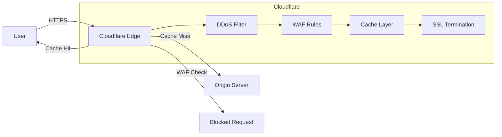

# Cloudflare Overview

> [!abstract] TL;DR
> Cloudflare is a global network operating 300+ Points of Presence (PoPs) connected via Anycast routing. It sits in front of your origin as a reverse proxy, providing CDN edge caching, authoritative DNS, multi-layer DDoS protection, and Universal SSL — all configured from a single dashboard with zero infrastructure to manage.

## What Is Cloudflare

Cloudflare operates as a **global reverse proxy** and security/performance platform. When you point your domain's nameservers to Cloudflare, all traffic to your domain passes through Cloudflare's network before reaching your origin server.

```
User → Cloudflare PoP (edge) → Origin Server
                ↓
         Cache / DDoS / WAF / SSL termination
```

**Key numbers:**
- 300+ PoPs across 100+ countries
- ~20% of all internet traffic passes through Cloudflare
- Anycast routing: all PoPs share the same IP; BGP routes users to the nearest PoP

---

## CDN — Edge Caching

Cloudflare caches static assets (images, CSS, JS, fonts) at edge PoPs so repeat requests never hit your origin.

### Cache Rules

```
# Example: cache all /assets/* for 1 year
Cache-Control: public, max-age=31536000, immutable
```

**Cache Rule settings (dashboard → Caching → Cache Rules):**
- **Cache TTL:** how long to serve from cache (Edge TTL ≠ Browser TTL)
- **Bypass cache:** for authenticated routes (`Cookie: session=*`)
- **Cache everything:** override Cloudflare's default "only cache static extensions"

### `cf-cache-status` response header

| Value | Meaning |
|---|---|
| `HIT` | Served from Cloudflare cache |
| `MISS` | Cache miss, fetched from origin |
| `EXPIRED` | Was cached but TTL expired, re-fetched |
| `BYPASS` | Cache rule said not to cache |
| `DYNAMIC` | Not cacheable (HTML, API) |

### Purge API

```bash
# Purge a single URL
curl -X POST "https://api.cloudflare.com/client/v4/zones/{zone_id}/purge_cache" \
  -H "Authorization: Bearer {token}" \
  -d '{"files":["https://example.com/style.css"]}'

# Purge everything (nuclear option)
curl -X POST ... -d '{"purge_everything": true}'
```

---

## DNS — Authoritative DNS

When Cloudflare manages your zone, it provides authoritative DNS. Responses are served from Cloudflare's Anycast DNS network (fastest DNS globally).

### Proxied vs DNS-only Records (the Orange Cloud)

```
🟠 Proxied (orange cloud)  → traffic routed through Cloudflare network
⬜ DNS-only (grey cloud)   → returns your server's real IP directly
```

**Use proxied for:** web traffic (HTTP/HTTPS), to hide origin IP, to get CDN/DDoS/WAF.  
**Use DNS-only for:** mail (MX, SPF), FTP, SSH, non-HTTP protocols.

**Record types:**
- `A` — IPv4 address
- `AAAA` — IPv6 address  
- `CNAME` — alias (can be proxied at zone apex via CNAME flattening)
- `MX` — mail exchange (always DNS-only)
- `TXT` — SPF, DKIM, domain verification

---

## DDoS Protection

Cloudflare absorbs DDoS attacks at the network edge — traffic is scrubbed before reaching your origin.

| Layer | Type | Protection |
|---|---|---|
| L3/L4 | Volumetric (SYN floods, UDP floods) | Magic Transit, automatic unmetered mitigation |
| L7 | HTTP floods, slow POST, Slowloris | HTTP DDoS Managed Rules, WAF |
| L7 | Bot attacks | Bot Management, Super Bot Fight Mode |

**Rate Limiting** (paid): block/challenge IPs exceeding N requests per 10 seconds on a given path.

**Magic Transit:** BGP-advertise your own IP prefix through Cloudflare to protect non-HTTP infrastructure.

---

## SSL/TLS

Cloudflare terminates SSL at the edge (user → Cloudflare is always HTTPS). The edge → origin connection depends on the SSL mode:

```
User ──HTTPS──► Cloudflare ──[mode]──► Origin
```

| Mode | Edge→Origin | Use case |
|---|---|---|
| **Flexible** | HTTP (unencrypted) | Origin has no SSL cert (avoid in prod) |
| **Full** | HTTPS but cert not validated | Self-signed cert on origin |
| **Full (Strict)** | HTTPS + valid CA cert required | Origin has Let's Encrypt / trusted cert |
| **Off** | HTTP (edge also serves HTTP) | Testing only |

**Universal SSL:** Cloudflare provisions a free SSL cert for your domain automatically (shared cert with 50 other domains). Upload a custom cert or use Advanced Certificate Manager for dedicated certs.

**HSTS (HTTP Strict Transport Security):** tell browsers to always use HTTPS:
```
Strict-Transport-Security: max-age=31536000; includeSubDomains; preload
```

Configure under SSL/TLS → Edge Certificates → HSTS.

---

## Cloudflare as Reverse Proxy



**What Cloudflare hides:** your origin IP. Attackers can't DDoS your origin directly if you keep the origin IP secret (don't leak it in DNS, email headers, etc.).

**Worker Routes vs Origin:** traffic can be fully intercepted by a Worker before ever hitting your origin:
```
User → Cloudflare → Worker (edge compute) → origin (optional)
```

---

## Common Pitfalls

- **Flexible SSL + HTTPS origin redirect = redirect loop.** Cloudflare calls origin over HTTP; origin redirects to HTTPS; Cloudflare calls HTTP again. Fix: use Full or Full (Strict).
- **Orange-clouding non-HTTP records.** Cloudflare only proxies HTTP/HTTPS. If you proxy an SMTP IP you'll break email.
- **Caching HTML pages with user-specific content.** Logged-in user A sees logged-in user B's page. Use `Cache-Control: private` or a bypass rule for authenticated routes.
- **Cache-Control headers from origin don't auto-enable caching for HTML.** By default Cloudflare only caches static file extensions. Use a "Cache Everything" cache rule to cache HTML.
- **Forgetting to set TTLs.** Default `cf-cache-status: MISS` on every request with no cache rule = no CDN benefit.

---

## Review Questions

1. What is the difference between Anycast routing and unicast routing, and why does Cloudflare use Anycast?
2. An API response shows `cf-cache-status: BYPASS`. What likely caused this, and how would you fix it?
3. Your site has a self-signed SSL cert on the origin. Which Cloudflare SSL mode should you use, and why not Flexible?
4. A user's real IP is `1.2.3.4`. Their request hits Cloudflare. What IP does your origin server see in the `REMOTE_ADDR`, and how do you get the real IP?
5. You want to rate-limit `/api/login` to 5 requests/minute per IP. Which Cloudflare feature handles this, and is it available on the free plan?
