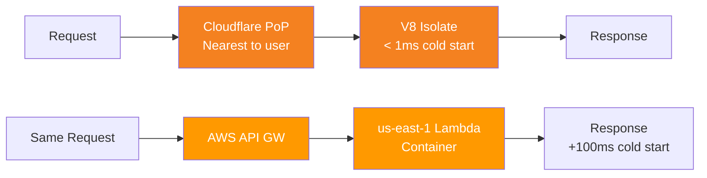

# Cloudflare Workers

> [!abstract] TL;DR
> Cloudflare Workers run JavaScript/TypeScript (and WebAssembly) at the network edge using V8 isolates — not containers — giving sub-millisecond cold starts. Workers intercept HTTP requests at the nearest Cloudflare PoP, can read/write bindings (KV, R2, D1, Durable Objects, AI), and are deployed globally with `wrangler deploy` in seconds.

## What Are Workers

Workers are **serverless functions that run at the edge** — inside Cloudflare's 300+ PoPs, not in a centralized region. Each Worker handles HTTP requests using the same Web APIs available in browsers (`Request`, `Response`, `fetch`, `URL`, `Headers`).

### V8 Isolates vs Containers

| Dimension | Workers (V8 Isolates) | Lambda / Cloud Run (Containers) |
|---|---|---|
| Cold start | < 1ms (isolate reuse) | 100ms–2s (container spin-up) |
| Memory | 128 MB per request | 128 MB–10 GB configurable |
| CPU time | 10ms CPU (free) / 30s (paid) | Up to 15 min |
| Location | Every Cloudflare PoP globally | Single region |
| Isolation | V8 isolate per request | Process/container per invocation |
| Runtime | JavaScript, WASM, Python (beta) | Any language |

**Key insight:** V8 isolates start instantly because there's no OS process to spin up — the V8 engine is already warm; a new isolate is just a new JS context.

---

## Basic Worker Structure

```typescript
// src/index.ts
export default {
  async fetch(request: Request, env: Env, ctx: ExecutionContext): Promise<Response> {
    const url = new URL(request.url);

    if (url.pathname === '/api/hello') {
      return Response.json({ message: 'Hello from the edge!' });
    }

    // Fetch from origin and return
    return fetch(request);
  },
};

// Type your env bindings
interface Env {
  MY_KV: KVNamespace;
  MY_BUCKET: R2Bucket;
  MY_DB: D1Database;
  MY_DO: DurableObjectNamespace;
  AI: Ai;
  SECRET_KEY: string;  // plain text secret from dashboard
}
```

### Handler Types

| Handler | Trigger | Use case |
|---|---|---|
| `fetch` | HTTP request | Main request handler |
| `scheduled` | Cron trigger | Background jobs, cache warming |
| `queue` | Queue message | Async message processing |
| `email` | Inbound email (Email Workers) | Email processing |

---

## Request / Response Web API

Workers use standard browser APIs — no Node.js `http` module:

```typescript
// Reading request data
const method = request.method;          // "GET", "POST", etc.
const url = new URL(request.url);       // parsed URL object
const headers = request.headers;       // Headers object
const body = await request.json();     // parse JSON body
const text = await request.text();     // raw string body
const formData = await request.formData(); // multipart form

// Reading geo/edge data (Cloudflare-specific)
const country = request.cf?.country;   // "US"
const city = request.cf?.city;         // "San Francisco"
const asn = request.cf?.asn;           // autonomous system number
const colo = request.cf?.colo;         // "SFO" — which PoP handled it

// Building responses
return new Response('Hello', {
  status: 200,
  headers: { 'Content-Type': 'text/plain', 'X-Custom': 'value' },
});

return Response.json({ key: 'value' }, { status: 201 });

return new Response(null, {
  status: 301,
  headers: { Location: 'https://new-url.com' },
});
```

---

## `waitUntil` — Background Work

`ctx.waitUntil()` lets you run async work **after** the response is sent to the user — the Worker stays alive until the promise resolves, but the user doesn't wait for it:

```typescript
export default {
  async fetch(request: Request, env: Env, ctx: ExecutionContext): Promise<Response> {
    // Fire-and-forget analytics logging
    ctx.waitUntil(logAnalytics(request, env));

    // Return response immediately — don't wait for logging
    return new Response('OK');
  },
};

async function logAnalytics(request: Request, env: Env) {
  await env.ANALYTICS_KV.put(
    `log:${Date.now()}`,
    JSON.stringify({ url: request.url, country: request.cf?.country })
  );
}
```

**Important:** `waitUntil` only works for truly background tasks. If your response depends on the data, don't use it — `await` normally instead.

---

## `env` Bindings

Bindings connect your Worker to Cloudflare resources. They appear as properties on the `env` object:

```toml
# wrangler.toml — binding declarations
[[kv_namespaces]]
binding = "MY_KV"
id = "abc123"

[[r2_buckets]]
binding = "MY_BUCKET"
bucket_name = "my-bucket"

[[d1_databases]]
binding = "MY_DB"
database_name = "my-database"
database_id = "def456"

[[durable_objects.bindings]]
name = "MY_DO"
class_name = "MyDurableObject"

[ai]
binding = "AI"

[vars]
PUBLIC_KEY = "my-public-key"  # plain text, visible in dashboard

[[secrets]]
# Secrets added via wrangler secret put SECRET_KEY
```

---

## Workers vs Lambda Comparison



| Concern | Workers | Lambda |
|---|---|---|
| Latency | Low (near user) | Higher (single region) |
| Cold starts | None effectively | Possible |
| Max execution | 30s (CPU: 30ms paid) | 15 min |
| File system | No (use R2/KV) | Ephemeral `/tmp` (512MB) |
| Node.js APIs | No (Web APIs only) | Full Node.js |
| VPC access | No | Yes |
| Pricing | $5/10M requests | $0.20/1M + duration |

---

## Wrangler — CLI Tooling

```bash
# Install
npm install -g wrangler

# Login (opens browser OAuth)
wrangler login

# Create new project from template
npm create cloudflare@latest my-worker -- --type=worker

# Local development (runs Workers runtime locally via Miniflare)
wrangler dev

# Deploy to production (all regions simultaneously)
wrangler deploy

# Tail live logs
wrangler tail

# Manage secrets
wrangler secret put DATABASE_URL
wrangler secret list

# KV operations from CLI
wrangler kv key put --namespace-id=abc123 "my-key" "my-value"
wrangler kv key get --namespace-id=abc123 "my-key"
```

### `wrangler dev` vs `wrangler dev --remote`

| Mode | What runs | Good for |
|---|---|---|
| `wrangler dev` (local) | Miniflare simulator locally | Fast iteration, no network calls |
| `wrangler dev --remote` | Your actual Cloudflare account edge | Test with real KV/D1/DO bindings |

---

## Worker Routes vs Custom Domains

**Worker Routes:** pattern-match URLs to invoke your Worker (replaces origin for matched paths):

```toml
# wrangler.toml
routes = [
  { pattern = "example.com/api/*", zone_name = "example.com" },
  { pattern = "example.com/blog/*", zone_name = "example.com" }
]
```

**Custom Domains (Workers Routes):** assign a hostname directly to a Worker (no `fetch(request)` needed to pass through to origin):

```toml
routes = [
  { pattern = "api.example.com/*", custom_domain = true }
]
```

With custom domains, `api.example.com` is entirely handled by the Worker — no origin is called unless you explicitly `fetch()` to one.

---

## Common Pitfalls

- **CPU time ≠ wall clock time.** Workers allow 10ms CPU (free) / 30ms (paid) of *CPU execution*, not wall-clock time. Waiting for `fetch()` or KV operations doesn't count against the limit.
- **No Node.js built-ins.** `fs`, `net`, `crypto` (Node.js style), `Buffer` aren't available. Use Web APIs: `crypto.subtle`, `TextEncoder`, `ReadableStream`.
- **`await fetch()` inside a Worker makes a subrequest from the edge**, not from your origin. Keep this in mind for IP-based restrictions.
- **Environment variables aren't automatically secret.** `[vars]` in wrangler.toml are visible in the dashboard. Use `wrangler secret put` for secrets — they're encrypted at rest.
- **`waitUntil` must be called synchronously** in the `fetch` handler, not inside a nested async function that resolves later.

---

## Review Questions

1. Why do Workers have near-zero cold starts compared to Lambda? What is a V8 isolate?
2. What is the difference between `ctx.waitUntil()` and simply `await`-ing a function?
3. Your Worker needs to read a secret API key. Should you put it in `[vars]` in wrangler.toml or use `wrangler secret put`? Why?
4. `wrangler dev` shows your Worker working locally, but `wrangler dev --remote` fails with a KV read error. What's the likely cause?
5. A Worker needs to run every 5 minutes to warm a cache. Which handler type should you use, and how do you configure it in wrangler.toml?
