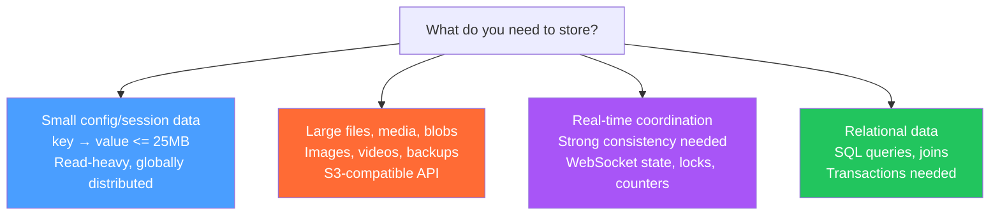

# Workers KV and R2

> [!abstract] TL;DR
> Workers KV is a globally distributed, eventually consistent key-value store ideal for config, sessions, and read-heavy data. R2 is S3-compatible object storage with **zero egress fees**, ideal for files and media. Choose based on data shape: KV for small key-value pairs (<= 25 MB values), R2 for large files and blobs, Durable Objects for coordination requiring strong consistency.

## Workers KV

KV (Key-Value) is Cloudflare's globally replicated store. Writes propagate to all PoPs within ~60 seconds; reads are served from the local PoP cache — extremely fast at the cost of eventual consistency.

### KV API

```typescript
interface Env {
  MY_KV: KVNamespace;
}

export default {
  async fetch(request: Request, env: Env): Promise<Response> {
    const { MY_KV } = env;

    // --- PUT ---
    await MY_KV.put('user:123:theme', 'dark');

    // PUT with TTL (expires in 24 hours)
    await MY_KV.put('session:abc', JSON.stringify({ userId: 123 }), {
      expirationTtl: 86400,  // seconds
    });

    // PUT with metadata (searchable, up to 1024 bytes)
    await MY_KV.put('product:456', JSON.stringify(product), {
      metadata: { category: 'electronics', price: 99.99 },
    });

    // --- GET ---
    const theme = await MY_KV.get('user:123:theme');
    // Returns: "dark" or null if not found

    // GET as JSON (auto-parses)
    const session = await MY_KV.get<{ userId: number }>('session:abc', 'json');

    // GET with metadata
    const { value, metadata } = await MY_KV.getWithMetadata<typeof product, { category: string }>('product:456', 'json');

    // --- DELETE ---
    await MY_KV.delete('session:abc');

    // --- LIST ---
    const list = await MY_KV.list({ prefix: 'user:123:', limit: 100 });
    // list.keys: [{ name: 'user:123:theme', expiration: ..., metadata: ... }]
    // list.complete: false if there are more keys (pagination)
    // list.cursor: pass to next .list() call to paginate

    return Response.json({ theme, session });
  },
};
```

### KV Characteristics

| Property | Value |
|---|---|
| Max key size | 512 bytes |
| Max value size | 25 MB |
| Max metadata | 1,024 bytes |
| Consistency | Eventual (~60s propagation) |
| Read latency | < 1ms (local PoP cache) |
| Write latency | ~50ms (propagates globally) |
| List pagination | Up to 1,000 keys per call |

### KV Pricing (approximate)

| Operation | Free tier | Paid |
|---|---|---|
| Reads | 10M/day | $0.50/million |
| Writes | 1M/day | $5/million |
| Deletes | 1M/day | $5/million |
| Lists | 1M/day | $5/million |
| Storage | 1 GB | $0.50/GB-month |

---

## R2 Object Storage

R2 is Cloudflare's answer to Amazon S3 — fully S3-compatible API with **zero egress fees**. This is the key differentiator: AWS charges $0.09/GB to pull data out; Cloudflare charges $0.

### R2 API (via Worker Binding)

```typescript
interface Env {
  MY_BUCKET: R2Bucket;
}

export default {
  async fetch(request: Request, env: Env): Promise<Response> {
    const { MY_BUCKET } = env;
    const url = new URL(request.url);
    const key = url.pathname.slice(1); // e.g., "images/photo.jpg"

    if (request.method === 'PUT') {
      // --- UPLOAD ---
      await MY_BUCKET.put(key, request.body, {
        httpMetadata: { contentType: request.headers.get('Content-Type') ?? 'application/octet-stream' },
        customMetadata: { uploadedBy: 'user-123' },
      });
      return new Response(`Uploaded: ${key}`);
    }

    if (request.method === 'GET') {
      // --- DOWNLOAD ---
      const object = await MY_BUCKET.get(key);
      if (!object) return new Response('Not found', { status: 404 });

      const headers = new Headers();
      object.writeHttpMetadata(headers);  // copies Content-Type etc.
      headers.set('etag', object.httpEtag);

      return new Response(object.body, { headers });
    }

    if (request.method === 'DELETE') {
      // --- DELETE ---
      await MY_BUCKET.delete(key);
      return new Response('Deleted');
    }

    // --- LIST ---
    const listed = await MY_BUCKET.list({ prefix: 'images/', limit: 100 });
    return Response.json(listed.objects.map(o => ({ key: o.key, size: o.size })));
  },
};
```

### R2 Presigned URLs

Generate a time-limited URL to let users upload/download directly without a Worker proxy:

```typescript
// Generate a presigned GET URL (valid for 1 hour)
const url = await MY_BUCKET.createMultipartUpload(key); // for large files

// Or using the S3-compatible HTTP API + AWS SDK
import { S3Client, PutObjectCommand, GetObjectCommand } from '@aws-sdk/client-s3';
import { getSignedUrl } from '@aws-sdk/s3-request-presigner';

const S3 = new S3Client({
  region: 'auto',
  endpoint: `https://${ACCOUNT_ID}.r2.cloudflarestorage.com`,
  credentials: { accessKeyId: R2_ACCESS_KEY, secretAccessKey: R2_SECRET_KEY },
});

const url = await getSignedUrl(S3, new GetObjectCommand({
  Bucket: 'my-bucket',
  Key: 'images/photo.jpg',
}), { expiresIn: 3600 });
```

### Public Buckets

Enable public access so objects are served directly without a Worker:
```
https://pub-{hash}.r2.dev/{key}
# or with custom domain:
https://assets.example.com/{key}
```

Configure under R2 bucket → Settings → Public Access.

---

## KV vs R2 vs Durable Objects



| Storage | Best For | Consistency | Max Size | Latency |
|---|---|---|---|---|
| **KV** | Feature flags, user prefs, sessions, A/B config | Eventual | 25 MB/value | < 1ms read |
| **R2** | Images, videos, PDFs, backups, datasets | Strong (object) | 5 TB/object | ~10-50ms |
| **Durable Objects** | WebSocket rooms, rate limiters, distributed locks | Strong (transactional) | 128 KB/key (10 GB total) | ~5-30ms |
| **D1** | User profiles, product catalogs, any relational | Strong (SQLite) | 10 GB | ~10-50ms |
| **Cache API** | HTTP response caching, edge cache control | Cache semantics | — | < 1ms |

---

## Practical Patterns

### Session Storage with KV

```typescript
const SESSION_TTL = 7 * 24 * 3600; // 7 days

async function createSession(env: Env, userId: string): Promise<string> {
  const sessionId = crypto.randomUUID();
  await env.SESSIONS.put(`session:${sessionId}`, JSON.stringify({ userId, createdAt: Date.now() }), {
    expirationTtl: SESSION_TTL,
  });
  return sessionId;
}

async function getSession(env: Env, sessionId: string) {
  return env.SESSIONS.get<{ userId: string; createdAt: number }>(`session:${sessionId}`, 'json');
}
```

### Image Upload Proxy with R2

```typescript
// POST /upload — accepts multipart form upload
async function handleUpload(request: Request, env: Env): Promise<Response> {
  const formData = await request.formData();
  const file = formData.get('file') as File;
  const key = `uploads/${crypto.randomUUID()}-${file.name}`;

  await env.ASSETS.put(key, file.stream(), {
    httpMetadata: { contentType: file.type },
    customMetadata: { originalName: file.name, size: String(file.size) },
  });

  return Response.json({ url: `https://assets.example.com/${key}` });
}
```

---

## Common Pitfalls

- **KV read-after-write is not immediate.** If you write a key and read it back in the same request, you might get the old value from cache. Use Durable Objects if you need read-your-own-writes.
- **KV `list()` is expensive.** Listing all keys with a prefix costs the same as individual reads per key. Don't use KV as a database where you need to scan many records — use D1 instead.
- **R2 `get()` returns `null` for missing keys**, not a 404. Handle the null case explicitly.
- **R2 presigned URLs require the S3-compatible API** with R2-generated access keys (not the Cloudflare API token). Create them in R2 bucket → Manage R2 API Tokens.
- **KV values are strings.** You must `JSON.stringify()` objects on write and `JSON.parse()` (or use `'json'` type param) on read.

---

## Review Questions

1. You need to store a user's JWT session (< 1KB) with automatic 24-hour expiry. Which storage solution and which feature do you use?
2. An image upload service stores 10 GB of photos. Why is R2 cheaper than S3 for a read-heavy workload?
3. You write a feature flag to KV and immediately check it in the same Worker invocation. Why might you see the old value?
4. How does `KVNamespace.list()` pagination work? What do `list.complete` and `list.cursor` mean?
5. Your Worker serves R2 objects. A user requests a key that doesn't exist. What does `MY_BUCKET.get(key)` return, and what response should you send?
