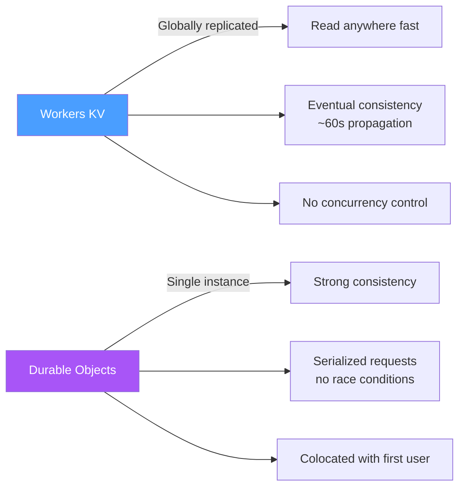

# Durable Objects

> [!abstract] TL;DR
> Durable Objects are single-instance, strongly consistent, colocated stateful objects inside Cloudflare Workers. Each DO has a guaranteed single instance worldwide, transactional key-value storage, and can hold WebSocket connections open. Use them for real-time coordination (chat rooms, game state, rate limiting with exact counts) where eventual consistency from KV is unacceptable.

## What Are Durable Objects

The core problem KV doesn't solve: **multiple Workers writing to the same key concurrently can create race conditions**. KV is eventually consistent; there's no locking.

Durable Objects solve this by guaranteeing:
1. **Single instance:** only one DO instance for a given ID exists globally at any time
2. **Colocated:** the instance runs near the first user who accesses it, and requests are routed to that same PoP
3. **Serialized requests:** requests to the same DO are processed one at a time (no concurrent mutation)
4. **Transactional storage:** the DO's `state.storage` API is ACID-transactional

```mermaid
graph TD
    W1[Worker A\nSF PoP] -->|stub.fetch()| DO[Durable Object\n"game-room-42"\nSingle instance\nin one PoP]
    W2[Worker B\nNYC PoP] -->|stub.fetch()| DO
    W3[Worker C\nLDN PoP] -->|stub.fetch()| DO
    DO --> Storage[(Transactional\nKey-Value Storage)]

    style DO fill:#a855f7,color:#fff
```

---

## Defining a Durable Object Class

```typescript
// src/ChatRoom.ts
export class ChatRoom {
  private state: DurableObjectState;
  private env: Env;
  private sessions: WebSocket[] = [];

  constructor(state: DurableObjectState, env: Env) {
    this.state = state;
    this.env = env;
  }

  // Every request to this DO routes through fetch()
  async fetch(request: Request): Promise<Response> {
    const url = new URL(request.url);

    if (request.headers.get('Upgrade') === 'websocket') {
      return this.handleWebSocket(request);
    }

    if (url.pathname === '/message' && request.method === 'POST') {
      return this.broadcastMessage(request);
    }

    return new Response('Not found', { status: 404 });
  }

  private async handleWebSocket(request: Request): Promise<Response> {
    const pair = new WebSocketPair();
    const [client, server] = Object.values(pair);

    server.accept();
    this.sessions.push(server);

    server.addEventListener('message', async (event) => {
      const data = typeof event.data === 'string' ? event.data : '';
      // Broadcast to all sessions
      this.sessions.forEach(ws => ws.send(data));
      // Persist message count
      const count = ((await this.state.storage.get<number>('messageCount')) ?? 0) + 1;
      await this.state.storage.put('messageCount', count);
    });

    server.addEventListener('close', () => {
      this.sessions = this.sessions.filter(s => s !== server);
    });

    return new Response(null, { status: 101, webSocket: client });
  }

  private async broadcastMessage(request: Request): Promise<Response> {
    const body = await request.json<{ message: string }>();
    this.sessions.forEach(ws => ws.send(JSON.stringify(body)));
    return new Response('Broadcasted');
  }

  // Alarm handler — runs at a scheduled time
  async alarm(): Promise<void> {
    // e.g., cleanup inactive rooms, persist analytics
    const count = await this.state.storage.get<number>('messageCount') ?? 0;
    console.log(`Room had ${count} messages`);
    await this.state.storage.delete('messageCount');
  }
}
```

### Registering in wrangler.toml

```toml
[[durable_objects.bindings]]
name = "CHAT_ROOM"
class_name = "ChatRoom"

[[migrations]]
tag = "v1"
new_classes = ["ChatRoom"]
```

---

## Getting a DO Stub

Workers don't call DOs directly — they get a **stub** that routes to the DO's PoP:

```typescript
interface Env {
  CHAT_ROOM: DurableObjectNamespace;
}

export default {
  async fetch(request: Request, env: Env): Promise<Response> {
    const url = new URL(request.url);
    const roomId = url.searchParams.get('room') ?? 'default';

    // ID from name — same name always routes to the same DO instance
    const id = env.CHAT_ROOM.idFromName(roomId);

    // ID from string — reconstruct a known ID
    // const id = env.CHAT_ROOM.idFromString(idString);

    // Unique ID — new DO instance every time
    // const id = env.CHAT_ROOM.newUniqueId();

    // Get the stub — this is a proxy object, not the real DO
    const stub = env.CHAT_ROOM.get(id);

    // Forward request to the DO (may cross PoPs via Cloudflare backbone)
    return stub.fetch(request);
  },
};
```

---

## Storage API

```typescript
// Inside a Durable Object:
const storage = this.state.storage;

// Basic get/put/delete
await storage.put('key', 'value');
const value = await storage.get<string>('key');
await storage.delete('key');

// Multiple keys at once
await storage.put({ key1: 'val1', key2: 'val2' });
const map = await storage.get<string>(['key1', 'key2']); // Map<string, string>

// List keys with prefix
const entries = await storage.list<string>({ prefix: 'session:', limit: 100 });

// Transactions — all-or-nothing
await storage.transaction(async (txn) => {
  const balance = await txn.get<number>('balance') ?? 0;
  if (balance < amount) throw new Error('Insufficient funds');
  await txn.put('balance', balance - amount);
});

// Schedule alarm (DO wakes up at this time even if no requests)
await storage.setAlarm(Date.now() + 60_000); // wake up in 60 seconds
```

| Property | Value |
|---|---|
| Max key size | 2 KB |
| Max value size | 128 KB |
| Max total storage | 10 GB per DO instance |
| Consistency | Strongly consistent (single writer) |
| Transactions | Optimistic, retried on conflict |

---

## WebSocket Hibernation API

By default, a DO holding WebSocket connections must stay active continuously — burning CPU costs. The **Hibernation API** allows the DO to sleep between messages:

```typescript
export class HibernatingRoom {
  private state: DurableObjectState;

  constructor(state: DurableObjectState, env: Env) {
    this.state = state;
    // Must opt in to hibernation in wrangler.toml: 
    // [durable_objects] enable_websocket_hibernation = true
  }

  async fetch(request: Request): Promise<Response> {
    const pair = new WebSocketPair();
    const [client, server] = Object.values(pair);

    // acceptWebSocket() instead of server.accept() — enables hibernation
    this.state.acceptWebSocket(server, ['tag1']);

    return new Response(null, { status: 101, webSocket: client });
  }

  // Called when a hibernated WS receives a message
  async webSocketMessage(ws: WebSocket, message: string | ArrayBuffer): Promise<void> {
    ws.send(`Echo: ${message}`);
  }

  // Called when a hibernated WS closes
  async webSocketClose(ws: WebSocket, code: number, reason: string): Promise<void> {
    ws.close(code, 'Closing');
  }
}
```

**Hibernation benefit:** the DO pays only for compute when actually processing messages, not while waiting for WebSocket messages — critical for long-lived connections (multiplayer games, chat rooms).

---

## Durable Objects vs KV



| Concern | Workers KV | Durable Objects |
|---|---|---|
| Read latency | < 1ms (local cache) | 5–30ms (may route to DO's PoP) |
| Consistency | Eventual | Strong |
| Concurrent writes | Race conditions possible | Serialized (safe) |
| WebSockets | Not supported | Native |
| Storage per item | 25 MB value | 128 KB value |
| Use case | Config, sessions, feature flags | Coordination, locks, real-time state |

---

## Use Cases

| Use Case | Why DO Fits |
|---|---|
| WebSocket chat rooms | Single DO per room, all connections held in memory |
| Real-time multiplayer game state | Authoritative game state per match, strong consistency |
| Exact rate limiting | `count++` is safe because only one DO processes requests serially |
| Distributed locks | `LOCKED` flag in storage, serialized access prevents double-lock |
| Shopping cart | User's cart has one authoritative instance |
| Online document collaboration (Figma-style) | CRDT operations applied through single DO |

---

## Common Pitfalls

- **DO instances are long-lived but can be evicted.** In-memory state (class properties like `this.sessions`) is lost when the DO sleeps. Persist important state to `storage`.
- **Stubs cost network hops.** If a Worker in Tokyo calls a DO that's colocated in London (because the first user was there), there's latency. DOs colocate near the first requester and stay there.
- **`idFromName()` is deterministic.** The same name always routes to the same instance — globally. Two different rooms must use two different names/IDs.
- **Alarm handlers can fail silently.** If `alarm()` throws, Cloudflare retries it. Make alarm handlers idempotent.
- **Not enabling hibernation for WebSocket DOs.** Without it, each active WebSocket connection keeps the DO alive 24/7, accruing CPU charges.

---

## Review Questions

1. Two Workers in different regions simultaneously try to increment a counter stored in Workers KV. What's the problem, and how do Durable Objects fix it?
2. What is `idFromName()` and when would you use `newUniqueId()` instead?
3. A chat room DO holds 500 WebSocket connections. Without hibernation, what are the cost implications? How does the hibernation API solve this?
4. What is the purpose of the `alarm()` handler, and how do you schedule it?
5. A DO is colocated in London. A user from Tokyo sends a message. Describe the full request path and where latency comes from.
