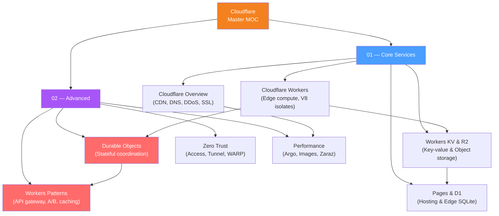

# Cloudflare — Map of Content

> [!info] About this vault
> 8 notes across 2 sections — covering Cloudflare's core services (CDN, Workers, KV, R2, Pages, D1) and advanced features (Durable Objects, Zero Trust, Performance, Workers Patterns).
> Start with **01 Core Services** for the foundational layer, then dive into **02 Advanced** for stateful computing, security architecture, and production patterns.

---

## Concept Map

*(Orange = Cloudflare brand, Blue = foundational section, Purple = advanced section, Red = most advanced notes)*

---

## Sections at a Glance

| # | Section | Notes | Entry Point | Difficulty |
|---|---------|-------|-------------|------------|
| 01 | Core Services | 4 | [[Cloudflare_Overview]] | Beginner → Intermediate |
| 02 | Advanced | 4 | [[Durable_Objects]] | Intermediate → Advanced |

---

## Learning Paths

### Path A — Get a Site on Cloudflare (Ops/DevOps)

*Best for: DevOps engineers, site reliability, getting an existing site behind Cloudflare.*

1. [[Cloudflare_Overview]] — CDN, DNS, DDoS protection, SSL modes, orange cloud vs grey cloud
2. [[Cloudflare_Performance]] — cache rules, cf-cache-status, Argo, Polish, Core Web Vitals

---

### Path B — Build a Serverless Edge Application

*Best for: full-stack engineers building new applications on the Cloudflare stack.*

1. [[Cloudflare_Overview]] — understand the network (PoPs, Anycast, reverse proxy role)
2. [[Cloudflare_Workers]] — V8 isolates, fetch handler, env bindings, wrangler CLI
3. [[Workers_KV_and_R2]] — storage: when to use KV vs R2 vs DO vs D1
4. [[Cloudflare_Pages_and_D1]] — Pages Functions, file-based routing, D1 SQLite, Workers AI
5. [[Workers_Patterns]] — API gateway, JWT middleware, caching patterns, rate limiting
6. [[Durable_Objects]] — when you need strong consistency or WebSockets

---

### Path C — Zero Trust Network Security

*Best for: security engineers, IT admins replacing VPNs with Zero Trust architecture.*

1. [[Cloudflare_Overview]] — Cloudflare as reverse proxy, SSL/TLS, DDoS protection
2. [[Cloudflare_Zero_Trust]] — Cloudflare Access, cloudflared tunnel, WARP, Gateway
3. [[Cloudflare_Performance]] — performance and security configuration in the dashboard

---

## All Notes in This Vault

### 01 — Core Services

| Note | Core Idea | Difficulty |
|------|-----------|------------|
| [[Cloudflare_Overview]] | Global Anycast network, CDN caching (cf-cache-status, Cache Rules, Purge API), DNS (proxied vs grey cloud), DDoS protection (L3/4/7), SSL/TLS modes | Beginner |
| [[Cloudflare_Workers]] | V8 isolates for near-zero cold starts, fetch/scheduled/queue handlers, Web Request/Response API, `waitUntil`, `env` bindings, wrangler CLI | Intermediate |
| [[Workers_KV_and_R2]] | KV: globally distributed eventual-consistent key-value store; R2: S3-compatible zero-egress object storage; KV vs R2 vs DO vs D1 selection | Intermediate |
| [[Cloudflare_Pages_and_D1]] | Pages: Git-connected static hosting + Functions (file-based routing, middleware, `_routes.json`); D1: serverless SQLite at the edge; Workers AI: LLMs at the edge | Intermediate |

### 02 — Advanced

| Note | Core Idea | Difficulty |
|------|-----------|------------|
| [[Durable_Objects]] | Single-instance globally coordinated objects — strong consistency, WebSocket hibernation, transactional storage; DO vs KV trade-off | Advanced |
| [[Cloudflare_Zero_Trust]] | Cloudflare Access (identity-aware proxy), cloudflared Tunnel (no port forwarding), WARP device agent, Gateway (DNS/HTTP filtering, DLP) | Intermediate |
| [[Cloudflare_Performance]] | Cache Everything rules, Argo Smart Routing, Polish/Mirage image optimization, Image Resizing API, Cloudflare Stream, Zaraz (edge-loaded third-party scripts) | Intermediate |
| [[Workers_Patterns]] | API gateway routing, JWT middleware, A/B testing with cookies, geolocation routing, request transformation, response caching with Cache API, rate limiting | Advanced |

---

## Key Concepts Quick Reference

| Concept | What it is | Note |
|---|---|---|
| **V8 Isolate** | JavaScript execution context (not a container) — enables near-zero cold starts | [[Cloudflare_Workers]] |
| **Orange Cloud (proxied)** | DNS record that routes traffic through Cloudflare | [[Cloudflare_Overview]] |
| **`cf-cache-status`** | Response header indicating HIT/MISS/BYPASS/EXPIRED | [[Cloudflare_Overview]], [[Cloudflare_Performance]] |
| **Workers KV** | Globally distributed key-value store (eventual consistency) | [[Workers_KV_and_R2]] |
| **R2** | S3-compatible object storage with zero egress fees | [[Workers_KV_and_R2]] |
| **D1** | Serverless SQLite database at the edge | [[Cloudflare_Pages_and_D1]] |
| **Durable Objects** | Single-instance stateful objects for coordination and WebSockets | [[Durable_Objects]] |
| **cloudflared** | Daemon that creates outbound tunnel (no inbound ports required) | [[Cloudflare_Zero_Trust]] |
| **Argo Smart Routing** | Routes dynamic traffic via Cloudflare's private backbone | [[Cloudflare_Performance]] |
| **Zaraz** | Loads third-party scripts (GTM, analytics) at the edge | [[Cloudflare_Performance]] |
| **`waitUntil`** | Run async work after response is sent to user | [[Cloudflare_Workers]] |
| **`idFromName()`** | Deterministic Durable Object ID from a string | [[Durable_Objects]] |

---

## Cross-Vault Links

- [[DevOps/_MOC_DevOps_Master|DevOps Master MOC]] — CDN and edge compute fits into CDN/Networking sections of DevOps
- [[System Design/_MOC_SystemDesign_Master|System Design Master MOC]] — Edge caching, CDN design, serverless architecture patterns
- [[AI_Product_Builder/_MOC_AI_Product_Builder_Master|AI Product Builder MOC]] — Workers AI, edge LLM inference, AI at the edge

#MOC #Cloudflare #MasterMOC
