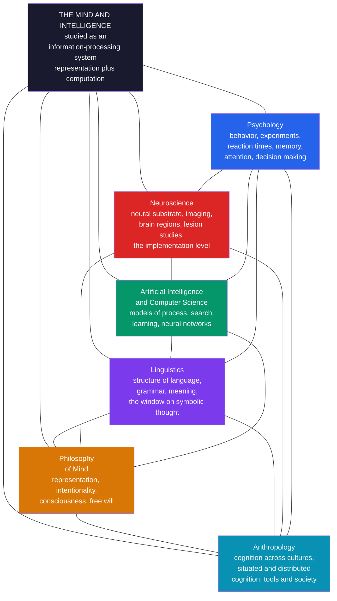

> [!abstract] TL;DR
> Cognitive science is the interdisciplinary study of mind and intelligence, uniting six disciplines — psychology, neuroscience, artificial intelligence, linguistics, philosophy, and anthropology — around a single organizing idea: that the mind is an information-processing system that can be studied scientifically. Born in the 1950s "cognitive revolution" as a reaction against behaviorism's refusal to talk about internal mental states, it holds that thinking is a form of computation over mental representations, analyzable at multiple levels from abstract goal down to neural implementation. Its central debates — symbolic versus connectionist architectures, embodied versus purely computational cognition, and how much of the mind is innate versus learned — remain the live questions that organize the field today.

---

## Intuition

**Analogy:** Imagine six eyewitnesses standing around a single accident at a busy intersection, each looking from a different corner. One watched the driver's face and can describe the panic and hesitation. One heard the engine and the screech and can reconstruct the sounds. One is an engineer who can explain the physics of the braking distance. One noticed exactly what words the driver shouted. One is a philosopher asking whether the driver *chose* to swerve or merely reacted. And one is a visitor from another city who notices that people here drive, gesture, and apologize in ways subtly different from home. No single witness saw "the whole accident." Each captured something real that the others missed, and only by laying all six accounts side by side do you reconstruct what actually happened.

Cognitive science treats a single thought — recognizing a friend's face, understanding a sentence, deciding to reach for a cup — as exactly that kind of event seen from six corners. The psychologist measures the behavior and reaction time. The neuroscientist watches which brain regions light up. The AI researcher asks what computation would have to run to produce that behavior. The linguist studies the structure of the language used. The philosopher asks what it *means* for a physical system to represent, to know, or to be conscious. The anthropologist asks how the same cognitive act is shaped differently across cultures. The bet of the whole field is that the mind is one object, and that these six views are not rival theories but complementary levels of description of a single information-processing system.

This analogy already contains the field's founding move. Before the 1950s, the dominant psychology (behaviorism) insisted you could only talk about the accident's *inputs and outputs* — what went in, what came out — and that speculating about the internal processing was unscientific. Cognitive science was the decision to open the black box and describe what happens *between* stimulus and response: representations, computations, and the mechanisms that transform one into another.

---

## How It Works

The core commitment of cognitive science is the **computational-representational theory of mind (CRTM)**: cognition consists of *representations* (internal states that stand for things — objects, words, goals, propositions) and *computations* (rule-governed processes that transform those representations). On this view, thinking is to the brain roughly what running a program is to a computer — a level of description that is real, causally efficacious, and not reducible to raw physics without loss of explanatory power. This is why a single vocabulary (representation, process, memory, search, inference) lets a psychologist, an AI researcher, and a linguist collaborate at all.

That shared commitment is made precise by **Marr's three levels of analysis** (David Marr, 1982), the field's most important methodological tool. Any information-processing system, Marr argued, must be described at three independent levels:

1. **Computational level** — *what* problem is being solved and *why*. What is the input, what is the desired output, and what makes that mapping the right one? (For vision: recover the 3-D structure of the world from 2-D light.)
2. **Algorithmic / representational level** — *how* the problem is solved. What representations are used for input and output, and what algorithm transforms one into the other? (Which features, which data structures, which sequence of steps.)
3. **Implementation level** — *where and by what physical substrate*. How is the algorithm physically realized — in neurons, in silicon, in something else?

The power of Marr's framework is that the same computational problem can have many algorithms, and the same algorithm many implementations. A cash register and an abacus implement the same computation (addition) with different algorithms and hardware. This *multiple realizability* is what licenses studying the mind partly independently of the brain — and it is exactly what the embodied-cognition camp later pushed back against.

The **historical arc** explains why the field looks the way it does. From roughly 1920 to 1955, behaviorism (Watson, Skinner) dominated Anglo-American psychology, treating the mind as a black box and permitting only talk of observable stimulus-response associations. The **cognitive revolution** of the mid-1950s overturned this. Three near-simultaneous events in 1956 are usually cited as the founding moment: George Miller's paper on the "magical number seven" (working-memory capacity, an internal mental structure), the Dartmouth summer workshop that named artificial intelligence, and Noam Chomsky's demonstration that language has abstract hierarchical structure no stimulus-response chain could produce. Chomsky's devastating 1959 review of Skinner's *Verbal Behavior* is often taken as behaviorism's intellectual death blow. The convergence of computer science (a working metaphor and a formalism for "process"), information theory, and generative linguistics gave psychology permission to talk about internal representation again — and cognitive science was the interdisciplinary field that formed in the convergence, formalized with the founding of the journal *Cognitive Science* (1977) and the Cognitive Science Society (1979).



---

## Key Concepts

### Secondary Level

**What is cognitive science?**

Cognitive science is the scientific study of the mind — how we perceive, remember, reason, decide, use language, and learn. What makes it unusual is that it is not a single subject but a *team sport*: it deliberately combines six fields that had traditionally worked separately. The reason is simple. The mind is too big for any one discipline. If you only run behavioral experiments (psychology) you never see the brain. If you only scan brains (neuroscience) you never build a working model of the process. If you only build models (AI) you never check them against real people. Cognitive science is the agreement to use all the methods at once and share a common vocabulary.

**The cognitive hexagon — the six disciplines:**

| Discipline | The question it brings | Example contribution |
|---|---|---|
| Psychology | How do people actually behave and perform on mental tasks? | Working memory holds about 7 items; reaction times reveal hidden processing stages |
| Neuroscience | What in the brain makes cognition happen? | Broca's area for speech production; the hippocampus for forming new memories |
| Artificial Intelligence | What computation could produce this behavior? | Neural networks that recognize images; search algorithms that play chess |
| Linguistics | How is language structured, and what does it reveal about thought? | Grammar has abstract hierarchical rules no simple habit could produce |
| Philosophy | What does it even mean to represent, to know, or to be conscious? | The mind-body problem; whether a computer could truly "understand" |
| Anthropology | How does culture shape how people think? | Counting, navigation, and memory differ across societies |

**The core idea — mind as information processing:**

The central idea that unites all six is that the mind takes in *information*, transforms it through internal steps, and produces behavior — much like a computer takes input, runs a program, and produces output. A memory is stored information; perceiving is turning raw sensory signals into a useful representation of the world; reasoning is transforming one representation into another by rules. This "information-processing" picture is what let psychologists start talking about invisible things happening *inside* the mind again, after decades in which that was considered unscientific.

**Why it started — the cognitive revolution:**

For the first half of the 20th century, the ruling school in psychology was **behaviorism**. Behaviorists (most famously B. F. Skinner) said that because we cannot directly observe thoughts, science should only study what it can observe: the stimulus that goes in and the behavior that comes out. Talking about "beliefs," "memory," or "understanding" was, to them, unscientific speculation. In the 1950s a group of thinkers rebelled. They argued that you cannot explain human language, memory, or problem-solving without describing internal representations and processes — and that computers proved such internal processes could be described precisely. This "cognitive revolution" opened the black box, and cognitive science was born from it.

---

### Undergraduate Level

#### The Computational Theory of Mind

The unifying theoretical commitment of classical cognitive science is that **cognition is computation over representations**. Two claims are bundled here. First, the *representational* claim: the mind contains internal states that carry content — they are *about* things (the concept DOG is about dogs). Philosophers call this **intentionality** or *aboutness*, and explaining how a physical state can be "about" anything is one of the field's hardest problems. Second, the *computational* claim: mental processes are formal operations that transform representations according to rules sensitive only to the representations' form (their syntax), not directly to their meaning — yet the operations respect meaning because form and content are correlated. This is Jerry Fodor's *Language of Thought* hypothesis: thinking is manipulation of symbolic mental representations with a language-like combinatorial structure, which explains why thought is *productive* (we can entertain endlessly many novel thoughts) and *systematic* (anyone who can think "John loves Mary" can think "Mary loves John").

#### Marr's Three Levels in Practice

Marr's levels are the field's antidote to a recurring confusion: mistaking a description at one level for a competitor to a description at another. A theory of *what* the visual system computes (computational level) does not compete with a theory of *which neurons* implement it (implementation level); they are answers to different questions. The framework also warns against premature reduction. Knowing that a region of cortex is active during arithmetic (implementation) tells you almost nothing about *which algorithm* the brain uses to add — the same neural activity could implement many algorithms. Good cognitive science, on Marr's view, works top-down: first characterize the problem and why it matters, then hypothesize algorithms, then seek their neural realization. Marr's own work on early vision (edge detection, the "primal sketch," stereopsis) is the model example, and *multiple realizability* — the fact that the same computation runs on brains and silicon alike — is the philosophical foundation that licenses treating the algorithmic level as autonomous.

#### The Great Architectural Debate: Symbolic vs Connectionist

The deepest disagreement inside cognitive science is about the *architecture* of the mind at the algorithmic level.

**The symbolic (classical / "GOFAI") view** (Newell and Simon's Physical Symbol System Hypothesis, Fodor and Pylyshyn) holds that cognition manipulates discrete symbols according to explicit rules, much like a digital computer running a program. Its great strengths are explaining the systematicity, compositionality, and productivity of thought and language: if mental representations have combinatorial syntactic structure, systematicity comes for free. Its weakness is brittleness — classical symbolic systems struggle with noisy input, graceful degradation, perceptual pattern recognition, and the acquisition of knowledge from raw experience.

**The connectionist (neural network / PDP) view** (Rumelhart and McClelland's *Parallel Distributed Processing*, 1986) holds that cognition emerges from the activity of many simple, neuron-like units connected by weighted links, with knowledge stored in the *pattern of connection weights* rather than in explicit symbolic rules. Its strengths are exactly the symbolic view's weaknesses: robustness to noise, graceful degradation, learning from examples, and biological plausibility. Its historical weakness — dramatized in Fodor and Pylyshyn's 1988 critique — was explaining systematicity: why should a network that learned "John loves Mary" automatically handle "Mary loves John"? The modern deep-learning era (transformers, large language models) is in large part a spectacular vindication of the connectionist wager, though whether these systems have genuinely solved the systematicity and compositionality problem, or merely approximate it at scale, remains contested and is itself a live research question.

#### Embodied, Situated, and Distributed Cognition

A third position rejects a premise shared by both camps above — that cognition is essentially abstract symbol/signal processing that happens *inside* the head. The **embodied cognition** movement (Varela, Thompson, and Rosch's *The Embodied Mind*; later Andy Clark) argues that cognition is deeply shaped by the body's sensorimotor systems, that many "mental" computations are offloaded onto the environment, and that the boundary of the cognitive system does not stop at the skull. Related banners include **situated cognition** (thinking is inseparable from its physical and social context), **distributed cognition** (Edwin Hutchins showed that navigating a naval ship is a cognitive process spread across many people and instruments, not located in any single head), and the **extended mind** thesis (Clark and Chalmers: a notebook you rely on can be a literal part of your cognitive machinery). This is where anthropology earns its place in the hexagon, and it directly challenges Marr's clean separation of levels: if cognition is constituted partly by the body and world, you cannot fully specify the algorithm without them.

#### Nature vs Nurture: How Much is Built In?

Every subfield inherits a version of the innateness debate. In language, Chomsky's **poverty of the stimulus** argument holds that children acquire grammar so fast, and so uniformly, from input so fragmentary, that they must arrive with innate linguistic structure (Universal Grammar). Empiricists and connectionists counter that powerful general-purpose learning over structured input can account for the same facts without domain-specific innate knowledge. In perception and reasoning, "core knowledge" researchers (Elizabeth Spelke) argue that infants come equipped with innate systems for objects, number, agents, and space; others emphasize how much is constructed through experience and culture. The debate is rarely "all innate" versus "all learned" — it is a quantitative argument about *what* is built in, how domain-specific it is, and how it interacts with learning.

---

### Graduate Level

#### The Symbol Grounding and Intentionality Problems

Classical cognitive science's Achilles' heel is *content*: how do internal symbols come to mean anything? Stevan Harnad's **symbol grounding problem** asks how the symbols in a formal system get connected to what they are about, if their only relations are to other symbols — a dictionary defining words purely in terms of other words never bottoms out in meaning. John Searle's **Chinese Room** argument presses the same wound against strong AI: a person mechanically manipulating Chinese symbols by rulebook produces fluent Chinese output while understanding nothing, so (Searle claims) syntax is insufficient for semantics, and running the right program cannot constitute genuine understanding. Replies include the *systems reply* (the whole room, not the person, understands), the *robot reply* (grounding requires sensorimotor causal contact with the world), and the connectionist reply (subsymbolic distributed representations are grounded differently). The problem connects directly to philosophy's theory of **intentionality** (Brentano, Dennett's *intentional stance*, Dretske's and Millikan's naturalized-content programs) and remains unresolved — it is arguably sharpened, not solved, by modern large language models, which manipulate ungrounded tokens yet produce startlingly meaningful-seeming behavior.

#### The Hard Problem and the Place of Consciousness

Cognitive science had, for its first decades, a working division of labor that quietly set aside consciousness. David Chalmers's distinction between the **"easy" problems** of cognition (explaining discrimination, integration, reportability, attention — all functional, and in principle solvable by the standard information-processing program) and the **"hard" problem** (why is there *subjective experience* — qualia — accompanying any of this at all?) forced the issue back onto the agenda. Competing frameworks now include **Global Workspace Theory** (Baars, Dehaene: consciousness is information broadcast to a global workspace of otherwise separate processors), **Integrated Information Theory** (Tononi: consciousness is identical to integrated information, quantified as Φ), **Higher-Order Theories**, and predictive-processing accounts. The debate reveals a fault line in the field's founding assumption: if the computational-representational theory of mind is complete, the hard problem should dissolve; if it cannot dissolve, then information processing may not be the whole story of mind.

#### Predictive Processing as a Candidate Unifying Framework

The most ambitious recent attempt to reunify the hexagon under one principle is **predictive processing** / the **free-energy principle** (Karl Friston; Andy Clark's *Surfing Uncertainty*; Jakob Hohwy). The claim is that the brain is fundamentally a hierarchical prediction machine: it continually generates top-down predictions of its sensory input and updates its internal model only on the *prediction error* (the surprise). Perception becomes controlled hallucination checked against error; action becomes the fulfillment of predictions by changing the world (active inference); attention becomes the weighting of prediction-error precision; and learning becomes long-term error minimization. Its appeal is scope: it offers a single computational-level story (Marr level 1), a mechanistic algorithm (Bayesian belief updating, level 2), and a plausible neural implementation (cortical hierarchies with distinct feedforward error and feedback prediction channels, level 3), while naturally accommodating embodiment through active inference. Whether it is a genuine unifying theory or a framework so general as to be unfalsifiable is one of the field's current meta-debates.

#### Bayesian Cognition and the Return of Rationality

Running partly in parallel, the **Bayesian / rational-analysis program** (Anderson's rational analysis; Tenenbaum, Griffiths, and colleagues) models cognition as approximately optimal probabilistic inference given the structure of the environment. It has been strikingly successful at the computational level for concept learning, causal induction, intuitive physics, and theory-of-mind reasoning, often explaining how humans generalize correctly from very few examples — precisely the data-efficiency that deep networks historically lacked. Its tension with the heuristics-and-biases tradition (Kahneman and Tversky's demonstrations of systematic irrationality) is productive: the Bayesian answer is often that apparent biases are rational given the true priors and costs, or given bounded computational *resources* ("resource-rational" analysis). This program is where cognitive science reconnects to formal epistemology and to machine learning, and where the "mind as information processor" thesis takes its most mathematically committed modern form.

#### The Vault Structure — Six Sections

This vault develops cognitive science along the following arc:

1. **Foundations of Cognitive Science** — this overview, the computational theory of mind, Marr's levels, the history of the cognitive revolution, and the field's core debates.
2. **Perception and Attention** — how the mind builds representations from sensory input, and how it selects among them.
3. **Memory, Learning, and Representation** — how information is encoded, stored, retrieved, and structured as knowledge.
4. **Language and Thought** — the structure of language, concepts and categorization, reasoning, and decision-making.
5. **Cognitive Architectures and Computational Models** — symbolic systems, connectionism, Bayesian models, and cognitive architectures like ACT-R and SOAR.
6. **Consciousness, Embodiment, and the Future** — the hard problem, embodied and extended cognition, and the frontier of the field.

---

## Python Demo

```python
import numpy as np
import matplotlib
matplotlib.use("Agg")
import matplotlib.pyplot as plt
from matplotlib.patches import Circle, FancyBboxPatch

# ---------------------------------------------------------------
# Cognitive Science as an interdisciplinary NETWORK.
#
# We model the six constituent disciplines of the "cognitive
# hexagon" as nodes on a regular hexagon and draw every pairwise
# connection, with each line's WIDTH proportional to how strongly
# the two disciplines collaborate in practice (a rough,
# illustrative "interdisciplinary coupling" weight in [0, 1]).
#
# We then plot a TIMELINE of the field's founding milestones as a
# scatter, colored by the discipline that primarily drove each,
# to show the mid-1950s convergence that created the field.
# ---------------------------------------------------------------

# --- Six disciplines: label, and a color matching the hexagon ---
disciplines = ["Psychology", "Neuroscience", "AI /\nComp. Sci.",
               "Linguistics", "Philosophy", "Anthropology"]
colors = ["#2563eb", "#dc2626", "#059669", "#7c3aed", "#d97706", "#0891b2"]
N = len(disciplines)

# --- Place the six nodes on a regular hexagon (unit circle) -----
# Start at top (90 degrees) and go clockwise for a clean hexagon.
angles = np.pi / 2 - np.arange(N) * (2 * np.pi / N)
xs = np.cos(angles)
ys = np.sin(angles)

# --- Symmetric coupling matrix W[i, j] in [0, 1] ----------------
# Higher = tighter real-world collaboration between two fields.
# (Illustrative estimates, not measured constants.)
W = np.array([
    #  Psy  Neu  AI   Lin  Phi  Ant
    [0.0, 0.9, 0.8, 0.6, 0.7, 0.5],  # Psychology
    [0.9, 0.0, 0.7, 0.5, 0.6, 0.3],  # Neuroscience
    [0.8, 0.7, 0.0, 0.8, 0.6, 0.2],  # AI / Comp Sci
    [0.6, 0.5, 0.8, 0.0, 0.7, 0.6],  # Linguistics
    [0.7, 0.6, 0.6, 0.7, 0.0, 0.5],  # Philosophy
    [0.5, 0.3, 0.2, 0.6, 0.5, 0.0],  # Anthropology
])

# "Centrality" = summed coupling of each discipline to all others.
centrality = W.sum(axis=1)

print("=" * 60)
print("Cognitive Science — Interdisciplinary Coupling")
print("=" * 60)
order = np.argsort(centrality)[::-1]
for rank, i in enumerate(order, 1):
    name = disciplines[i].replace("\n", " ")
    print(f"  {rank}. {name:16s}  total coupling = {centrality[i]:.1f}")
print()
print(f"  Most connected  : {disciplines[order[0]].replace(chr(10),' ')}")
print(f"  Least connected : {disciplines[order[-1]].replace(chr(10),' ')}")
print("  (Anthropology is the most peripheral of the six, reflecting")
print("   its later and looser integration into the core field.)")

# ---------------------------------------------------------------
# Milestone timeline of the cognitive revolution and beyond.
# Each milestone is tagged with the discipline that mainly drove it
# so it can be colored consistently with the network nodes.
# ---------------------------------------------------------------
# (year, short label, discipline index)
milestones = [
    (1943, "McCulloch-Pitts neuron", 2),
    (1948, "Wiener: Cybernetics", 2),
    (1950, "Turing: 'Can machines think?'", 4),
    (1956, "Dartmouth AI workshop", 2),
    (1956, "Miller: 'Magical Number Seven'", 0),
    (1957, "Chomsky: Syntactic Structures", 3),
    (1959, "Chomsky reviews Skinner", 3),
    (1967, "Neisser: Cognitive Psychology", 0),
    (1979, "Cognitive Science Society", 4),
    (1982, "Marr: Vision (three levels)", 1),
    (1986, "Rumelhart-McClelland: PDP", 2),
    (1995, "Chalmers: the 'hard problem'", 4),
    (2012, "Deep learning breakthrough", 2),
]

# ---------------------------------------------------------------
# FIGURE: left = hexagon network, right = milestone timeline.
# ---------------------------------------------------------------
fig, (axN, axT) = plt.subplots(1, 2, figsize=(16, 7))
fig.suptitle(
    "Cognitive Science: An Interdisciplinary Study of Mind and Intelligence",
    fontsize=13, fontweight="bold")

# ---- Panel 1: the cognitive hexagon as a weighted network ------
axN.set_title("The Cognitive Hexagon\n"
              "line width = strength of interdisciplinary coupling",
              fontsize=10)

# Draw all pairwise edges first (so nodes sit on top).
for i in range(N):
    for j in range(i + 1, N):
        w = W[i, j]
        axN.plot([xs[i], xs[j]], [ys[i], ys[j]],
                 color="#94a3b8", lw=0.5 + 6.0 * w, alpha=0.35,
                 solid_capstyle="round", zorder=1)

# A faint central "mind" hub connected to every node.
axN.scatter([0], [0], s=2600, color="#1a1a2e", zorder=2)
axN.text(0, 0, "MIND\nand\nintelligence", ha="center", va="center",
         color="#f5f5f5", fontsize=8.5, fontweight="bold", zorder=4)
for i in range(N):
    axN.plot([0, xs[i]], [0, ys[i]], color="#1a1a2e",
             lw=1.0, alpha=0.25, zorder=1)

# Draw the six discipline nodes; size scales with centrality.
for i in range(N):
    size = 1400 + 900 * (centrality[i] / centrality.max())
    axN.scatter(xs[i], ys[i], s=size, color=colors[i],
                edgecolors="white", linewidths=2, zorder=3)
    # Push labels slightly outward from the node.
    axN.text(xs[i] * 1.34, ys[i] * 1.34, disciplines[i],
             ha="center", va="center", fontsize=9.5,
             fontweight="bold", color=colors[i], zorder=4)

axN.set_xlim(-1.7, 1.7)
axN.set_ylim(-1.7, 1.7)
axN.set_aspect("equal")
axN.axis("off")

# ---- Panel 2: milestone timeline scatter -----------------------
axT.set_title("Founding Milestones of Cognitive Science\n"
              "note the dense convergence around 1956",
              fontsize=10)

years = np.array([m[0] for m in milestones])
# Stagger the y positions so overlapping-year labels stay readable.
y_positions = np.arange(len(milestones))[::-1].astype(float)

for k, (yr, label, disc) in enumerate(milestones):
    axT.scatter(yr, y_positions[k], s=180, color=colors[disc],
                edgecolors="white", linewidths=1.3, zorder=3)
    axT.text(yr + 1.2, y_positions[k], f"{yr}  {label}",
             va="center", ha="left", fontsize=8.3, color="#1f2937")

# Shade the "cognitive revolution" window 1955-1960.
axT.axvspan(1955, 1960, color="#fde68a", alpha=0.35, zorder=0,
            label="Cognitive revolution")
axT.set_xlim(1938, 2032)
axT.set_ylim(-1, len(milestones))
axT.set_yticks([])
axT.set_xlabel("Year", fontsize=9)
axT.grid(axis="x", alpha=0.2)
axT.legend(loc="lower right", fontsize=8)

# Shared color legend for the six disciplines.
handles = [plt.Line2D([0], [0], marker="o", linestyle="",
                      markersize=9, markerfacecolor=c,
                      markeredgecolor="white",
                      label=d.replace("\n", " "))
           for c, d in zip(colors, disciplines)]
axT.legend(handles=handles, loc="upper left", fontsize=7.5,
           title="Driving discipline", title_fontsize=8, ncol=1)

plt.tight_layout(rect=[0, 0, 1, 0.95])
plt.savefig("cognitive_science_overview.png", dpi=110, bbox_inches="tight")
plt.show()
```

**What the demo shows:**

- **The hexagon network (left)** renders the six disciplines as nodes on a regular hexagon, with every pairwise link drawn and its line width scaled by how tightly the two fields actually collaborate. The central hub represents the shared object — the mind — that all six converge on. Node sizes scale with each discipline's total coupling, so you can literally see that psychology, neuroscience, and AI form the tightly-bound core while anthropology sits more peripherally, mirroring its later and looser integration into the field.
- **The timeline (right)** plots the founding milestones as a scatter, colored by the discipline that primarily drove each. The shaded band over 1955–1960 makes the *cognitive revolution* visible as a genuine convergence: within a five-year window, AI (Dartmouth), psychology (Miller), and linguistics (Chomsky) independently overturned behaviorism, and the field crystallized in the overlap. The later points (Marr 1982, PDP 1986, Chalmers 1995, deep learning 2012) trace how the founding computational picture was successively deepened, challenged by connectionism, confronted with consciousness, and finally scaled into the modern era.

---

## Real-World Applications

> **Human-computer interaction and interface design:** The entire discipline of usability engineering is applied cognitive science. Concepts drawn straight from the field — working-memory limits (don't force users to hold more than a handful of items in mind), the difference between recognition and recall (menus beat command lines because recognizing is easier than recalling), Fitts's law for pointing time, and mental models of how a system works — govern how software, dashboards, aircraft cockpits, and medical devices are designed. Don Norman, who literally coined the phrase "cognitive engineering," moved from academic cognitive science to shaping the design of consumer technology.

> **Modern AI and the architecture debate made real:** The symbolic-versus-connectionist argument stopped being purely theoretical and became a multi-billion-dollar engineering reality. Classical symbolic AI (expert systems, logic-based planners) dominated into the 1980s; the connectionist resurgence, vindicated by deep learning and transformers, now powers image recognition, machine translation, and large language models. Cognitive science supplies both the inspiration (neural networks were loosely brain-inspired; attention mechanisms echo psychological attention) and the critical yardstick (does a model generalize *systematically* and *compositionally* the way human cognition does, or only approximate it at scale?).

> **Education and the science of learning:** Cognitive science has produced some of the most robust, counter-intuitive findings in applied psychology, now reshaping how people are taught. The *spacing effect* (distributed practice beats cramming), *retrieval practice* (testing yourself strengthens memory more than re-reading), *interleaving*, and *cognitive load theory* (instruction must respect working-memory limits) all come from cognitive research on memory and attention and are the empirical backbone of evidence-based teaching and spaced-repetition tools like Anki.

> **Clinical diagnosis and cognitive rehabilitation:** Cognitive neuroscience and neuropsychology translate the field's models of memory, attention, and language into clinical practice. Standardized cognitive assessments localize deficits after stroke or brain injury; the dissociation between distinct memory systems (declarative vs procedural) guides rehabilitation of amnesic patients; and models of attention inform the diagnosis and management of ADHD. The famous patient H.M., whose hippocampal surgery destroyed the ability to form new declarative memories while sparing skill learning, is a foundational case where cognitive theory and clinical reality met.

> **Behavioral economics and public policy:** Kahneman and Tversky's heuristics-and-biases program — a direct descendant of cognitive science's study of reasoning and decision-making — showed that human judgment departs systematically from the rational-agent model economics assumed. This produced behavioral economics (a Nobel Prize in 2002) and the practice of "nudging": designing default options, framings, and choice architectures in retirement savings, organ donation, and public health that work *with* known cognitive biases rather than against them.

---

## Common Pitfalls

- **Treating the brain and the mind as the same level of description** — the single most common confusion. Discovering *which brain region* is active during a task (implementation) does not tell you *which algorithm* the mind is running (algorithmic level) or *what problem* it is solving (computational level). "The amygdala lit up" is not an explanation of fear; it locates an implementation without specifying the computation. Marr's three levels exist precisely to keep these questions distinct, and reductionist "brain-scan explains everything" reasoning routinely collapses them.

- **Mistaking a metaphor for a mechanism** — the "mind as computer" idea is a productive framing, but taking it too literally leads people to assume the brain must have a von Neumann architecture, a central clock, or discrete memory addresses, none of which is biologically accurate. The claim is that cognition is *a* form of information processing, not that the brain is *a digital computer*. Embodied-cognition critics argue the metaphor has actively misled the field by hiding the role of body and environment.

- **Assuming the interdisciplinary label means the fields have actually merged** — in practice, psychology, neuroscience, AI, linguistics, philosophy, and anthropology retain separate journals, methods, incentives, and vocabularies. Genuine integration is hard and often superficial; a paper can cite all six fields while making a real contribution to only one. Treating "cognitive science" as a settled unified science rather than an ongoing and incomplete *project* of integration overstates its coherence.

- **Over-reading the innateness debate as binary** — framing questions as "innate versus learned" or "nature versus nurture" is almost always a mistake. Every serious position grants that both innate structure and learning are involved; the real, and much harder, questions are *what* is built in, how *domain-specific* it is, and how innate biases and experience *interact* during development. Treating a nuanced quantitative debate as an either-or produces bad science on both sides.

- **Confusing the "easy" and "hard" problems of consciousness** — a great deal of confusion comes from believing that explaining a cognitive *function* (attention, reportability, integration) thereby explains subjective *experience*. Chalmers's distinction warns that even a complete functional-computational account of a process leaves open why it should feel like anything from the inside. Claiming to have "explained consciousness" when one has only modeled a function is a persistent overreach.

- **Assuming behavior uniquely determines internal process** — many different internal algorithms can produce the same observable behavior (the *underdetermination* problem). A model that reproduces human reaction times or error patterns has not thereby been *proven* to be the mechanism the brain uses; it is one candidate among possibly many. Good cognitive science seeks converging evidence across levels (behavioral, neural, computational) precisely because no single level pins down the others.

---

## Related Concepts

- [[Memory_Systems]] — Cognitive science's account of the mind as information storage and retrieval is developed in detail here; the distinction between working, short-term, and long-term memory (and declarative vs procedural systems) is core evidence for internal representational structure and a direct product of the cognitive revolution.

- [[Attention_and_Cognitive_Load]] — Attention is the mind's information-selection mechanism; working-memory limits and cognitive load theory are among cognitive science's most reproducible findings and connect the field directly to interface design and education.

- [[Problem_Solving_and_Decision_Making]] — Newell and Simon's symbolic problem-solving research and the heuristics-and-biases tradition both grew out of the cognitive science program; this note covers the reasoning and judgment side of the "mind as information processor" thesis.

- [[Cognitive_Biases]] — Systematic departures from ideal rationality are central data for cognitive science's models of reasoning, feeding both the heuristics-and-biases and the resource-rational research programs discussed above.

- [[Language_and_Thought]] — Chomsky's generative linguistics and the poverty-of-the-stimulus argument, treated from the cognitive-psychology side, were a founding pillar of the cognitive revolution and the clearest case for innate mental structure.

- [[Consciousness_and_Neural_Correlates]] — The neuroscience counterpart to this note's treatment of the "hard problem," Global Workspace Theory, and Integrated Information Theory; addresses the search for the physical basis of subjective experience.

- [[Language_and_the_Brain]] — The neural implementation level for language (Broca's and Wernicke's areas, aphasias) that complements the abstract linguistic and psychological analyses in the hexagon.

- [[Neuroimaging_Methods]] — The methods (fMRI, EEG, lesion studies) by which the neuroscience corner of the hexagon supplies implementation-level evidence; understanding their limits is essential to avoiding the brain-equals-mind pitfall.

- [[Neural_Network_Basics]] — The connectionist / PDP architecture that competes with symbolic models at Marr's algorithmic level; the technical foundation of the modern deep-learning vindication of connectionism.

- [[Language_and_Linguistics_Overview]] — The linguistics corner of the hexagon in full: Saussure, Chomsky, and the structure of language as a window onto symbolic cognition.

- [[Universal_Grammar_and_Language_Acquisition]] — The detailed case for and against innate linguistic structure, the sharpest instance of cognitive science's nature-versus-nurture debate.

- [[Bayesian_Reasoning]] — The formal-probabilistic backbone of the Bayesian / rational-analysis program in cognition and of predictive-processing accounts of the brain.

- [[Logic_and_Critical_Thinking_Overview]] — The normative theories of reasoning against which cognitive science measures actual human inference, and the source of the "rationality" standard in the biases debate.

---

## Review Questions

### Secondary

1. Behaviorists said psychology should only study observable behavior — the stimulus that goes in and the response that comes out — and should not talk about invisible "thoughts" or "memories." What is one everyday mental ability (like understanding a new sentence you've never heard before) that seems very hard to explain without talking about what happens *inside* the mind? How does your example support the cognitive science approach?

2. Cognitive science is often pictured as a hexagon of six fields: psychology, neuroscience, artificial intelligence, linguistics, philosophy, and anthropology. Pick any one everyday act of thinking — recognizing a friend in a crowd, for example — and describe what *two different* corners of the hexagon would each study about that single act.

3. People often say "the mind is like a computer." In what one way is this comparison genuinely helpful, and in what one way could it mislead you about how the brain actually works?

### Undergraduate

1. Explain Marr's three levels of analysis (computational, algorithmic, implementation) and apply them to a concrete cognitive ability such as recognizing a face or adding two numbers. Then explain why the claim "we found the brain region for arithmetic" answers a question at only one level and why that matters for interpreting neuroimaging results.

2. State the symbolic (classical) and connectionist views of cognitive architecture as precisely as you can, and identify the single strongest argument each side has historically made against the other (systematicity for the symbolic side; robustness and learning for the connectionist side). Given the success of modern deep learning, has the debate been *settled*, or merely *shifted*? Defend your answer.

3. The cognitive revolution is usually dated to the mid-1950s and framed as a rejection of behaviorism. Reconstruct the argument for why the convergence of computer science, information theory, and Chomskyan linguistics made it possible to talk scientifically about internal mental representations again — something behaviorism had forbidden. What exactly did each of these three fields contribute?

### Graduate

1. Searle's Chinese Room argues that a system can manipulate symbols with perfect syntactic fluency while understanding nothing, and therefore that running the right program is insufficient for genuine understanding. Evaluate whether large language models strengthen Searle's conclusion, undermine it, or are simply orthogonal to it. In your answer, distinguish the symbol grounding problem from the intentionality problem and specify what kind of evidence, if any, could settle whether such a system "understands."

2. Predictive processing and the free-energy principle are offered as a framework that unifies perception, action, attention, and learning under a single imperative to minimize prediction error, and that spans all three of Marr's levels. Construct the strongest case that this is a genuine unifying theory of mind, and then the strongest case that its generality makes it unfalsifiable and therefore explanatorily empty. Which position do you find more compelling, and what specific empirical result would move you?

3. Embodied, situated, and distributed cognition challenge the assumption — shared by both symbolic and classical connectionist cognitive science — that cognition is essentially internal representation-processing bounded by the skull. Assess the extended mind thesis (Clark and Chalmers) specifically: does it identify a real theoretical error in classical cognitive science, or is it a redescription that relabels ordinary tool-use as "cognition" without empirical payoff? What would count as evidence that the boundary of the cognitive system genuinely extends beyond the brain?

---

## Sources

- [Marr, D. (1982). *Vision: A Computational Investigation into the Human Representation and Processing of Visual Information*. W. H. Freeman / MIT Press](https://mitpress.mit.edu/9780262514620/vision/)
- [Miller, G. A. (1956). "The Magical Number Seven, Plus or Minus Two." *Psychological Review* 63(2), 81–97](https://doi.org/10.1037/h0043158)
- [Chomsky, N. (1959). "A Review of B. F. Skinner's *Verbal Behavior*." *Language* 35(1), 26–58](https://doi.org/10.2307/411334)
- [Fodor, J. A. (1975). *The Language of Thought*. Harvard University Press](https://www.hup.harvard.edu/catalog.php?isbn=9780674510302)
- [Fodor, J. A. & Pylyshyn, Z. W. (1988). "Connectionism and Cognitive Architecture: A Critical Analysis." *Cognition* 28(1–2), 3–71](https://doi.org/10.1016/0010-0277(88)90031-5)
- [Rumelhart, D. E., McClelland, J. L. & the PDP Research Group (1986). *Parallel Distributed Processing: Explorations in the Microstructure of Cognition*. MIT Press](https://mitpress.mit.edu/9780262680530/)
- [Searle, J. R. (1980). "Minds, Brains, and Programs." *Behavioral and Brain Sciences* 3(3), 417–457](https://doi.org/10.1017/S0140525X00005756)
- [Chalmers, D. J. (1995). "Facing Up to the Problem of Consciousness." *Journal of Consciousness Studies* 2(3), 200–219](https://doi.org/10.1093/acprof:oso/9780195311105.003.0001)
- [Clark, A. & Chalmers, D. (1998). "The Extended Mind." *Analysis* 58(1), 7–19](https://doi.org/10.1093/analys/58.1.7)
- [Thagard, P. (2005). *Mind: Introduction to Cognitive Science* (2nd ed.). MIT Press](https://mitpress.mit.edu/9780262701099/mind/)
- [Bermúdez, J. L. (2020). *Cognitive Science: An Introduction to the Science of the Mind* (3rd ed.). Cambridge University Press](https://www.cambridge.org/highereducation/books/cognitive-science/0521708370)
- [Clark, A. (2016). *Surfing Uncertainty: Prediction, Action, and the Embodied Mind*. Oxford University Press](https://global.oup.com/academic/product/surfing-uncertainty-9780190933210)

---

#cognitive-science #mind #interdisciplinary #cognition
