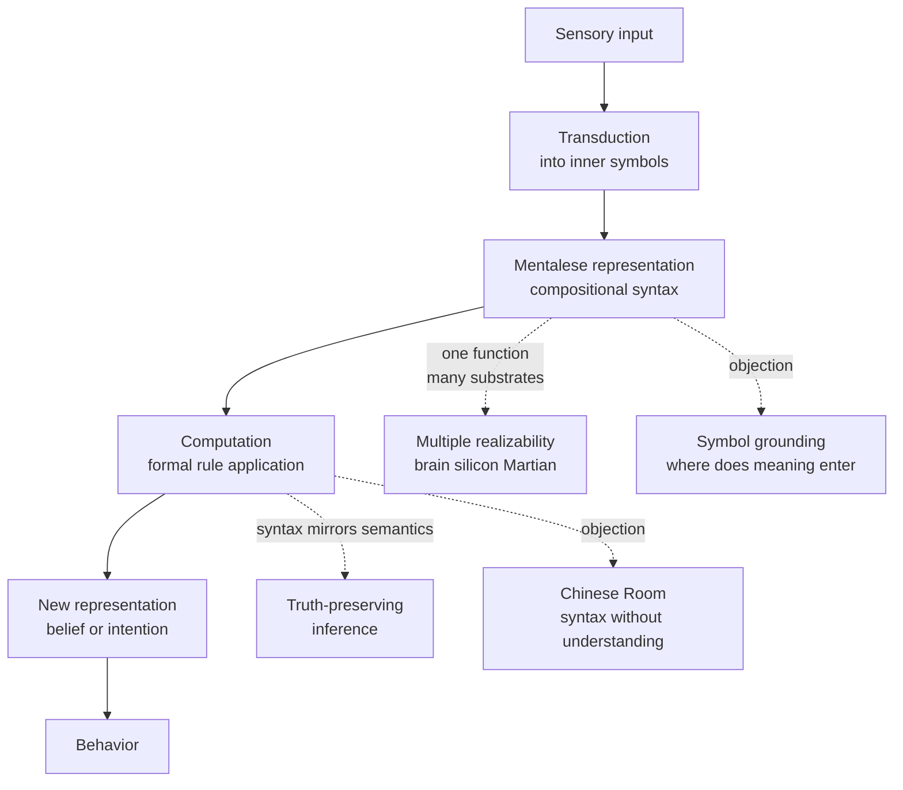

# 🧠 Computational Theory of Mind

> [!abstract] TL;DR
> The Computational Theory of Mind (CTM) claims that thinking literally *is* computation: mental states are structured representations, and cognition is the rule-governed manipulation of those representations by their formal (syntactic) properties — the same relationship a Turing machine has to the symbols on its tape. Because well-chosen syntactic rules can be truth-preserving, a purely mechanical brain can nonetheless reason correctly, which is how CTM tries to solve the deepest puzzle in philosophy of mind: how a physical object can also be a rational thinker.

---

## Intuition

**Analogy:** A pocket calculator does not "understand" numbers, yet it always gives the right answer to `17 × 23`. It works by shuffling electrical patterns according to fixed rules that were *designed to track arithmetic*. The engineer set things up so that whenever the input patterns mean two numbers, the output pattern means their product. The calculator only ever manipulates shapes and voltages — it never touches meaning — but because its rules mirror the structure of arithmetic, the shapes stay in lockstep with the truths.

CTM says your mind is the same trick scaled up. Your beliefs, desires, and perceptions are inner "symbol patterns," and thinking is the brain shuffling those patterns by their form, not their meaning. Evolution and learning tuned the rules so that if you start with true beliefs and think validly, you land on new true beliefs — reasoning without any little person inside who "gets it." Meaning rides along for free on top of well-designed bookkeeping.

---

## How It Works

### Core Mechanics

**1. The core thesis — cognition is computation over representations.** CTM has two moving parts. The *Representational Theory of Mind* (RTM) says propositional attitudes are relations to internal representations: to *believe that it is raining* is to have a representation with the content "it is raining" stored in a "belief box." The *computational* part says mental processes are formal operations that transform these representations by their syntactic shape. Believing, wanting, and inferring are computational relations to symbols; thinking is the sequence of transformations.

**2. Putnam's functionalism.** Hilary Putnam argued that mental states are defined not by their physical substance but by their *causal-functional role* — what inputs trigger them, what outputs they produce, and how they relate to other mental states. Pain is whatever plays the pain-role. His stronger *machine-state functionalism* identified a mind with the *machine table* of a probabilistic Turing machine: a mental state just *is* a state in that abstract table. This decouples mind from matter and directly motivates *multiple realizability*.

**3. Multiple realizability and Turing machines.** A Turing machine is defined purely by its transition table, not by whether it is built from tape, transistors, or neurons. If minds are computational, the *same* mind-program could in principle run on carbon, silicon, or a Martian's exotic biochemistry. This is CTM's answer to the mind-body problem: mental kinds are software kinds, and software is substrate-independent.

**4. Fodor's Language of Thought (LOT / "Mentalese").** Jerry Fodor argued the internal representations must form a *language* with compositional syntax and semantics — a "language of thought," nicknamed Mentalese. Thoughts have constituent structure: the thought JOHN LOVES MARY is built from the concepts JOHN, LOVES, MARY combined by grammatical rules, just as the sentence is built from words. Computation operates on these constituents by their form.

**5. Syntax vs semantics — the central bargain.** Symbols have both *syntactic* properties (their shape, position, how rules can grab them) and *semantic* properties (what they refer to, whether they are true). A computer can only "see" syntax. CTM's key insight, inherited from formal logic, is that you can design syntactic rules that *respect* semantics: **modus ponens** manipulates strings by pattern, yet it can never take you from truths to a falsehood. So a mechanical, meaning-blind process can still be rational. Syntax is engineered to *mirror* semantics.

**6. The Physical Symbol System Hypothesis (Newell & Simon, 1976).** From the AI side, Allen Newell and Herbert Simon proposed that "a physical symbol system has the necessary and sufficient means for general intelligent action." A physical symbol system stores symbol structures and has processes that create, modify, and destroy them. This is the engineering charter of Good Old-Fashioned AI (GOFAI) and the empirical, testable face of CTM.

**7. The systematicity and productivity arguments.** Fodor and Pylyshyn offered CTM's strongest positive argument. *Productivity*: minds can entertain unboundedly many thoughts, which is only explicable if thoughts are built recursively from a finite vocabulary. *Systematicity*: anyone who can think "John loves Mary" can also think "Mary loves John" — the abilities come in structured clusters. Both fall out immediately if thought has a *combinatorial syntax* (a language), and are left unexplained by an unstructured association net. This is the classic argument *against* pure connectionism and *for* LOT.

**8. Classical objections.** *Searle's Chinese Room*: a person hand-executing a Chinese-answering program produces fluent Chinese while understanding nothing — so syntax alone, Searle argues, is not sufficient for semantics or understanding. *The symbol grounding problem (Harnad)*: if the meaning of each symbol is given only by other symbols, the whole system is an ungrounded dictionary-go-round; how do any symbols connect to the world? *The frame problem*: after any action, how does a symbolic agent efficiently decide which of its vast store of beliefs need updating and which stay put, without checking everything?

**9. Classical vs connectionist construals.** *Classical* CTM (symbolic, GOFAI, LOT) posits explicit, structured, rule-governed symbols. *Connectionism* implements cognition as distributed activation across neuron-like units with no discrete symbols — computation as vector transformation. The two are rival hypotheses about *what kind* of computation the mind is, not about whether it computes.

**10. Contemporary views — predictive processing as computation.** Modern *predictive processing* recasts the brain as a hierarchical Bayesian inference engine that constantly predicts its sensory input and computes *prediction errors* to update an internal generative model. This is still computationalism — it is computation over probabilistic representations rather than over logic-like symbols — showing CTM's core commitment surviving in a statistical, sub-symbolic key.

### Flow / Architecture



---

## Key Concepts

**Secondary (intuitive level)**
- The mind is like a computer: thoughts are like symbols, and thinking is like running a program that rearranges those symbols by rules.
- A calculator gets math right without understanding math — CTM says brains work the same way.
- The same "mind program" could in principle run on a brain or a machine (multiple realizability).

**Undergraduate (conceptual level)**
- *Functionalism*: mental states are defined by causal role, not physical make-up; pain is whatever plays the pain-role.
- *Representational Theory of Mind*: to believe P is to bear a computational relation to an inner representation meaning P.
- *Language of Thought*: mental representations have combinatorial syntax; systematicity and productivity are the flagship evidence.
- *Syntax vs semantics*: formal rules like modus ponens are truth-preserving, so meaning-blind manipulation can still be rational.
- *Chinese Room*: Searle's challenge that running a program never suffices for genuine understanding.

**Graduate (technical / disputed level)**
- *Machine-state functionalism* identifies mind with the machine table of a probabilistic Turing machine; criticized for chauvinism and the Twin-Earth / externalism worries about wide vs narrow content.
- *The symbol grounding problem* (Harnad) and *Fodor's methodological solipsism*: can narrow, formal-only content do explanatory work, or must semantics be world-involving?
- *Systematicity debate*: whether connectionist networks (tensor-product / vector-symbolic architectures) genuinely explain or merely implement classical structure.
- *The frame problem* as a challenge to relevance-sensitive, non-monotonic updating in symbolic agents.
- *Predictive processing / active inference* recasts CTM as hierarchical Bayesian free-energy minimization — computationalism over generative models rather than logic-form symbols.

---

## Python Demo

```python
# A tiny "Language of Thought" engine.
# Mental states are SYMBOL STRINGS; thinking is the mechanical application of
# a FORMAL production rule (modus ponens) that never inspects meaning.
# Yet because the rule is truth-preserving, every derived string is guaranteed
# true whenever the axioms are true -- syntax stays locked onto semantics.
# Only numpy + matplotlib are used.

import numpy as np
import matplotlib.pyplot as plt

# --- 1. Mentalese: thoughts as symbol strings ---------------------------
# Atoms are lowercase tokens; "a>b" is the conditional "if a then b".
# The engine treats every string as a pure shape -- no meaning is consulted.
axioms = ["rain", "rain>wet", "wet>slippery", "slippery>fall"]

def is_conditional(s):
    return ">" in s

def antecedent(s):
    return s.split(">", 1)[0]

def consequent(s):
    return s.split(">", 1)[1]

# --- 2. Production rule: MODUS PONENS (pure symbol manipulation) ---------
# If working memory holds atom X and conditional "X>Y", write Y.
# We record provenance so the derivation tree can be reconstructed.
def forward_chain(axioms):
    facts = {f: ("axiom", []) for f in axioms}   # fact -> (rule, [parents])
    changed = True
    while changed:
        changed = False
        atoms = [f for f in facts if not is_conditional(f)]
        conds = [f for f in facts if is_conditional(f)]
        for c in conds:
            x, y = antecedent(c), consequent(c)
            if x in atoms and y not in facts:
                facts[y] = ("modus_ponens", [x, c])  # derive Y from X and X>Y
                changed = True
    return facts

facts = forward_chain(axioms)
for f, (rule, parents) in facts.items():
    tag = "given" if rule == "axiom" else "from {} via {}".format(parents, rule)
    print("{:12s} <- {}".format(f, tag))

# --- 3. Visualize the derivation tree -----------------------------------
def depth(f):
    parents = facts[f][1]
    return 0 if not parents else 1 + max(depth(p) for p in parents)

depths = {f: depth(f) for f in facts}
levels = {}
for f, d in depths.items():
    levels.setdefault(d, []).append(f)

pos = {}
for d, nodes in levels.items():
    for i, f in enumerate(sorted(nodes)):
        pos[f] = (i - (len(nodes) - 1) / 2.0, -d)

fig, ax = plt.subplots(figsize=(9, 6))
for f, (rule, parents) in facts.items():
    for p in parents:
        x0, y0 = pos[p]
        x1, y1 = pos[f]
        ax.annotate("", xy=(x1, y1), xytext=(x0, y0),
                    arrowprops=dict(arrowstyle="->", color="0.5"))
for f, (x, y) in pos.items():
    derived = facts[f][0] != "axiom"
    ax.scatter([x], [y], s=2600,
               c="#ffd27f" if derived else "#9ecae1",
               edgecolors="black", zorder=3)
    ax.text(x, y, f, ha="center", va="center", fontsize=9, zorder=4)

ax.set_title("Language of Thought: syntactic derivation of 'fall' from 'rain'")
ax.axis("off")
plt.tight_layout()
plt.savefig("lot_derivation.png", dpi=120)
print("saved lot_derivation.png")

# The engine started from 'rain' and, by blind string-matching alone, derived
# 'fall'. It never knew what rain or falling ARE -- yet the conclusion is true
# in every world where the axioms are true. That is CTM's whole wager.
```

---

## Real-World Applications

> **Example:** IBM's **MYCIN** and later expert systems are CTM made concrete — medical knowledge encoded as IF-THEN production rules, with an inference engine that forward- or backward-chains over symbol structures exactly like the demo above (see [[Logic_in_AI_and_Computation]]).

- **Symbolic AI / GOFAI planners** (STRIPS, PDDL, Prolog): direct engineering embodiments of the Physical Symbol System Hypothesis; they *are* physical symbol systems solving problems by search over symbol structures.
- **Cognitive architectures** (ACT-R, Soar): explicit computational models of human cognition built on production rules and declarative "chunks," used to predict reaction times and error patterns in psychology experiments.
- **Formal semantics of language**: Montague-style compositional meaning (see [[Formal_Semantics]]) treats understanding a sentence as computing its truth conditions from syntactic structure — LOT for natural language.
- **Predictive-processing neuroscience & modern ML**: hierarchical Bayesian brain models and today's LLM reasoning systems (see [[Reasoning_Models]]) extend computationalism from logic-form symbols to learned probabilistic and sub-symbolic representations.

---

## Common Pitfalls

- **Confusing "the mind is a computer" with "the mind is a laptop"** — CTM is a claim about abstract computation and Turing-machine-style formal processes, not about von Neumann architecture, clock speeds, or silicon. The substrate is deliberately left open by multiple realizability.
- **Assuming syntax delivers semantics for free** — Manipulating symbols correctly does not by itself explain how they come to *mean* anything. Ignoring the symbol grounding problem and the Chinese Room makes CTM look stronger than it is; grounding is an open problem, not a solved one.
- **Treating computationalism and connectionism as opposites of "computation vs no computation"** — Both camps agree the mind computes. Their dispute is about *what kind* of computation (structured symbols vs distributed vectors), so framing it as symbolic-versus-non-computational is a category error.
- **Reading the systematicity argument as settled** — It is CTM's best argument, but connectionists reply with vector-symbolic and tensor-product schemes that reproduce structure. Presenting systematicity as a knockdown proof overstates the case.
- **Over-solving the frame problem verbally** — It is easy to say "just update the relevant beliefs," but *relevance* is exactly what a formal system cannot cheaply compute; this is a genuine technical obstacle for symbolic agents, not a mere wording issue.

---

## Related Concepts

- [[Logic_in_AI_and_Computation]] — GOFAI, production rules, and automated reasoning are the engineering realization of the Physical Symbol System Hypothesis.
- [[Proof_Theory_and_Natural_Deduction]] — supplies the truth-preserving inference rules (like modus ponens) that let syntactic manipulation track semantic truth.
- [[Predicate_Logic_and_Quantifiers]] — the formal language whose compositional syntax and semantics inspired Fodor's Language of Thought.
- [[Propositional_Logic]] — the minimal formal system behind the demo's modus-ponens engine.
- [[Syntactic_Theory_and_Generative_Grammar]] — Chomsky's combinatorial syntax underwrites the productivity and systematicity arguments for LOT.
- [[Formal_Semantics]] — compositional truth-conditional meaning is LOT applied to natural language.
- [[Bayesian_Reasoning]] — the inference framework behind predictive processing, CTM's contemporary probabilistic form.
- [[Reasoning_Models]] — modern LLM reasoning systems inherit CTM's bet that manipulating representations yields rational conclusions.

---

## Review Questions

1. **(Conceptual)** CTM claims a meaning-blind, purely syntactic process can be rational. Explain *why* modus ponens makes this possible, and state precisely what "syntax mirrors semantics" means. What would have to be true of a rule for it to *break* this mirroring?
2. **(Scenario)** You are shown a chatbot that answers philosophy questions fluently. A colleague says "it clearly understands the material — it's a mind." Using the Chinese Room and the symbol grounding problem, construct the strongest reply, then construct the strongest rebuttal (e.g. the Systems Reply). Which do you find more convincing and why?
3. **(Trade-off)** Compare classical (symbolic/LOT) and connectionist construals of CTM on three axes: their handling of the systematicity argument, the frame problem, and the symbol grounding problem. Which construal would you choose to model human sentence comprehension, and which to model rapid visual object recognition? Defend the split.

---

## Sources

- Rescorla, M. (2020). "The Computational Theory of Mind." *Stanford Encyclopedia of Philosophy*. https://plato.stanford.edu/entries/computational-mind/
- Fodor, J. A. (1975). *The Language of Thought*. Harvard University Press.
- Newell, A. & Simon, H. A. (1976). "Computer Science as Empirical Inquiry: Symbols and Search." *Communications of the ACM*, 19(3), 113–126. https://dl.acm.org/doi/10.1145/360018.360022
- Searle, J. R. (1980). "Minds, Brains, and Programs." *Behavioral and Brain Sciences*, 3(3), 417–457. https://doi.org/10.1017/S0140525X00005756
- Harnad, S. (1990). "The Symbol Grounding Problem." *Physica D*, 42, 335–346. https://doi.org/10.1016/0167-2789(90)90087-6

---

#cognitive-science #computational-theory-of-mind #functionalism #representation
