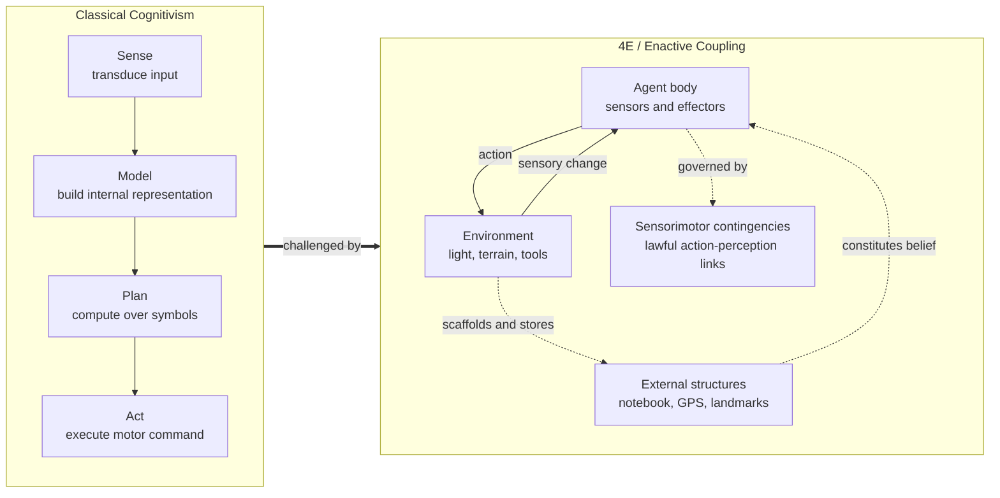

# 🧠 Embodied and Extended Cognition

> [!abstract] TL;DR
> Embodied and extended cognition is the family of theories — often grouped as **4E cognition** (embodied, embedded, enacted, extended) — that reject the classical picture of the mind as a disembodied symbol-processor sealed inside the skull. Instead, the body's morphology, its real-time coupling to the environment, and even external tools like notebooks are treated as *literal parts of the cognitive system*, not mere inputs to it. Cognition is recast from *representation-and-computation* to *dynamical sensorimotor coupling*: a Braitenberg vehicle "seeks" light with no internal map, Otto's notebook does the work of biological memory, and Rodney Brooks' robots act intelligently with "no representation and no computation" in the classical sense.

---

## Intuition

**Analogy:** Watch someone catch a fly ball in the outfield. The classical story says the brain builds a physics model — measures the ball's initial velocity, integrates the parabola, computes the landing coordinates, then walks there. But that is *not* what fielders do. They run so as to keep the ball rising at a constant angle in their visual field (the "optical acceleration cancellation" heuristic). There is no internal model of the trajectory anywhere in the head. The *loop* between eye, legs, and ball *is* the computation. The world is not re-built inside the skull and then acted upon — the body and the world do the cognitive work directly, in real time.

Now push the intuition one step further. Ask an Alzheimer's patient, Otto, where the museum is. He opens the notebook he always carries and reads the address. Ask a healthy person, Inga, the same question and she consults her biological memory. Clark and Chalmers argue there is *no principled difference*: if the notebook plays the same functional role for Otto that memory plays for Inga — reliably available, automatically endorsed, easily accessed — then Otto's *belief* about the address is stored in the notebook. The mind, on this view, leaks out of the head and into the pen, the paper, the smartphone, the environment.

---

## How It Works

### The challenge to classical computationalism

Classical cognitive science (the "cognitivist" or **GOFAI** paradigm) rests on the **physical symbol system hypothesis** (Newell & Simon): cognition is the rule-governed manipulation of internal, amodal symbolic representations. Perception delivers data, a central processor computes over a world model, and the result is shipped to the motor system. The body is a mere transducer; intelligence is *substrate-independent* software.

The 4E program attacks three load-bearing assumptions of that picture:

1. **The representational assumption** — that intelligent action *requires* an internal model of the world. Brooks' robots and Braitenberg's vehicles are existence proofs that complex, adaptive behaviour can arise with little or no internal representation.
2. **The boundary assumption** — that the cognitive system stops at the skin or the skull. The extended mind thesis denies this.
3. **The abstraction assumption** — that concepts are amodal symbols detached from sensory experience. Grounded cognition (Barsalou) and conceptual metaphor theory (Lakoff & Johnson) argue concepts *reuse* perceptual and motor systems.

### The 4E framework

| E | Core claim | Flagship source |
|---|---|---|
| **Embodied** | The body's physical form and sensorimotor capacities *constitute* cognition, not merely house it. | Varela, Thompson & Rosch, *The Embodied Mind* (1991) |
| **Embedded** (situated) | Cognition exploits regularities in the environment to offload computation ("scaffolding"). | Situated action, ecological psychology |
| **Enacted** | Perception is something we *do*; the world is "brought forth" through action, governed by sensorimotor contingencies. | O'Regan & Noë (2001) |
| **Extended** | Cognitive processes and states can be partly constituted by structures *outside* the body. | Clark & Chalmers (1998) |

### The parity principle and Otto's notebook

The extended mind thesis is licensed by the **parity principle**:

> *If, as we confront a task, a part of the world functions as a process which, were it done in the head, we would have no hesitation in recognising as part of the cognitive process, then that part of the world is part of the cognitive process.*

The argument is functionalist: what makes something a belief is the *role it plays*, not the *stuff it is made of*. Otto's notebook satisfies the functional criteria for a standing belief (reliable, portable, trusted, accessible), so it counts. Critics (Adams & Aizawa; Rupert) reply with the **coupling-constitution fallacy** charge: a process being *causally coupled* to cognition does not make it *constitutive of* cognition — my car is coupled to my driving but is not part of my mind.

### Enactivism and sensorimotor contingencies

O'Regan and Noë's **sensorimotor contingency theory** says that seeing "red" or a "square" is *mastery of the lawful ways sensory input changes as you move*. The feel of a sponge is your implicit knowledge of how it will deform under your hand. This dissolves the "grand illusion" of a rich internal picture: the world serves as its own external memory ("the world as an outside store"), sampled on demand by saccades, rather than fully re-represented inside.

### Dynamical systems: cognition without computation

Van Gelder's **Watt governor** argument is the manifesto of the dynamical approach. To keep a steam engine at constant speed, you *could* build a computational controller: measure speed, compare to target, compute a correction, actuate the valve — a sense-model-plan-act cycle. James Watt instead used a spinning flywheel whose arms rise with centrifugal force and mechanically throttle the steam. There is *no representation of engine speed anywhere*; the governor's arm angle and the engine speed are **coupled continuous variables** co-evolving under coupled differential equations. Van Gelder's claim: minds may be governors, not computers — better described by state-space trajectories and attractors than by algorithms over symbols.

### Robotics: intelligence without representation

Rodney Brooks' **subsumption architecture** builds robots as layered stacks of simple stimulus-response behaviours ("avoid obstacles," "wander," "explore") that run in parallel and directly couple sensors to actuators, with higher layers *subsuming* (overriding) lower ones. There is no central world model and no planner. His slogan — **"the world is its own best model"** — captures the situated stance: why store a fragile internal map when you can re-sense the world for free? Braitenberg's *Vehicles* is the toy-model bible of this idea: cross-wire two light sensors to two motors and you get an agent that *looks* like it loves or fears light, with the "psychology" existing only in the observer's eye.

### Flow / Architecture



---

## Key Concepts

### Secondary (intuitive level)
- **Mind is not just the brain.** Thinking uses the body and the world — counting on fingers, laying out puzzle pieces to see them better, keeping a shopping list on paper.
- **The body shapes thought.** We say time "flies," prices "climb," and moods are "up" or "down" — abstract ideas ride on bodily experience.
- **Acting to perceive.** You move your eyes, head, and hands to find out about the world; perception is an activity, not a passive photograph.

### Undergraduate (theory level)
- **4E cognition** — embodied, embedded, enacted, extended: four overlapping rejections of the brain-bound symbol-processor.
- **Parity principle** — the functionalist test that puts external tools on a par with internal processes; drives the extended mind thesis (Clark & Chalmers 1998).
- **Sensorimotor contingencies** — perceptual quality *is* implicit mastery of how input covaries with movement (O'Regan & Noë).
- **Subsumption architecture / "intelligence without representation"** — Brooks' layered reactive robots; "the world is its own best model."
- **Conceptual metaphor & grounded cognition** — abstract concepts are grounded in sensorimotor simulation (Lakoff & Johnson; Barsalou's perceptual symbol systems).

### Graduate (contested foundations)
- **Coupling-constitution fallacy** — Adams & Aizawa / Rupert's rebuttal: causal coupling of X to a cognitive process does not entail X being *constitutive of* it; demands a "mark of the cognitive."
- **The representation wars** — radical enactivism (Hutto & Myin's *Radicalizing Enactivism*) denies *contentful* representation for "basic minds," against representationalists who argue predictive-processing brains *are* model-builders.
- **Dynamicism vs computationalism** — van Gelder's state-space/attractor description versus the claim that dynamical systems can themselves be computational; the debate over what "representation" even requires (decoupleability, teleofunction).
- **Predictive processing as a reconciliation** — active inference (Friston, Clark's *Surfing Uncertainty*) folds embodiment, action, and internal generative models into one framework, partly re-admitting representation on enactive terms.
- **Constitution vs causation** — the deep metaphysical crux underlying every 4E dispute: is the environment *part of* the mind, or merely a *cause* of what the mind does?

---

## Python Demo

```python
# Braitenberg Vehicle 2b ("aggressor" / light-seeker).
# Two light sensors are CROSS-wired to two motors with excitatory links.
# The light-seeking behaviour is NOT computed from an internal map or plan:
# it emerges purely from the sensor->motor wiring + the body's kinematics.
# No world model, no representation, no search -- just sensorimotor coupling.

import numpy as np
import matplotlib.pyplot as plt

# --- Environment ---
light = np.array([8.0, 6.0])   # light source position (x, y)
k_light = 4.0                  # source brightness constant

# --- Vehicle parameters ---
axle = 0.40    # distance between the two wheels (differential drive)
a    = 0.25    # forward offset of the two sensors from body centre
b    = 0.20    # lateral offset of each sensor from the midline
base = 0.20    # baseline motor drive (keeps the body creeping forward)
gain = 6.0     # sensor -> motor excitatory coupling strength
dt   = 0.05    # integration timestep
steps = 800

# --- Initial pose: position and heading ---
pos   = np.array([1.0, 1.0])
theta = 0.30   # radians

def sensor_reading(sensor_xy):
    # inverse-square light intensity at a sensor location
    d2 = np.sum((light - sensor_xy) ** 2)
    return k_light / (d2 + 1e-3)

traj = [pos.copy()]
for _ in range(steps):
    c, s = np.cos(theta), np.sin(theta)
    # world positions of the left and right front sensors
    left  = pos + np.array([a * c - b * s, a * s + b * c])
    right = pos + np.array([a * c + b * s, a * s - b * c])
    sL, sR = sensor_reading(left), sensor_reading(right)

    # CROSSED excitatory wiring (Vehicle 2b): more light on one side
    # speeds up the OPPOSITE motor, steering the body toward the source.
    vL = base + gain * sR   # RIGHT sensor drives LEFT  motor
    vR = base + gain * sL   # LEFT  sensor drives RIGHT motor

    # differential-drive kinematics
    v     = 0.5 * (vR + vL)
    omega = (vR - vL) / axle
    pos   = pos + dt * v * np.array([np.cos(theta), np.sin(theta)])
    theta = theta + dt * omega
    traj.append(pos.copy())

    if np.linalg.norm(light - pos) < 0.15:   # reached the light
        break

traj = np.array(traj)

# --- Visualise the emergent light-seeking trajectory ---
plt.figure(figsize=(6, 6))
plt.plot(traj[:, 0], traj[:, 1], '-', lw=1.6, color='steelblue', label='vehicle path')
plt.plot(traj[0, 0], traj[0, 1], 'ko', ms=8, label='start')
plt.plot(light[0], light[1], '*', color='gold', ms=22,
         markeredgecolor='orange', label='light source')
plt.gca().set_aspect('equal')
plt.title("Braitenberg Vehicle 2b: light-seeking without a world model")
plt.xlabel("x"); plt.ylabel("y")
plt.legend(loc='upper left'); plt.grid(alpha=0.3)
plt.tight_layout()
plt.show()

# The vehicle curves smoothly toward the light and accelerates as it nears
# it -- a purposeful-looking chase produced by four wires and two motors.
# All the "intention" lives in the observer's interpretation, not the agent.
```

The takeaway: the vehicle exhibits goal-directed *looking* behaviour (approach, orient, accelerate) with **no representation of the goal** anywhere in its state. Change the two crossed connections to *ipsilateral* (`vL = base + gain*sL`, `vR = base + gain*sR`) and the very same body becomes a light-*avoider* ("coward"). Behaviour is a property of the coupled system, not of an internal plan — Braitenberg's "law of uphill analysis and downhill synthesis" in action.

---

## Real-World Applications

- **Behaviour-based robotics.** Brooks' subsumption architecture directly shaped iRobot's products, including the Roomba, which cleans effectively using reactive behaviours (bump-and-turn, wall-follow, spiral) rather than a stored floor plan in its cheapest models.
- **Swarm and evolutionary robotics.** Simple sensorimotor agents (Braitenberg-descended controllers) produce flocking, foraging, and collective transport with no global model — used in warehouse robotics and drone swarms.
- **Human-computer interaction and design.** "Cognitive offloading" — to-do apps, spatial file arrangements, tangible interfaces — is engineered on extended-mind principles: the interface *is* part of the user's cognitive process.
- **Rehabilitation and prosthetics.** Enactive and sensorimotor-contingency ideas inform sensory-substitution devices (e.g., tactile-to-vision systems) and closed-loop prosthetics where the [[Motor_System_and_Motor_Control|motor system]] re-learns to perceive through a new coupling.
- **Embodied AI / robot learning.** Modern "embodied AI" benchmarks train agents that must *act* to perceive, echoing enactivism; grounding and morphology matter as much as the policy network. Contrast with the disembodied MDP abstraction in [[RL_Fundamentals|reinforcement learning]].
- **Grounded NLP and metaphor.** Conceptual-metaphor and grounded-cognition findings feed models of figurative language (see [[Cognitive_Semantics_and_Metaphor|cognitive semantics]]).

---

## Common Pitfalls

- **Conflating causal coupling with constitution.** The single most common error (and the sharpest critique): showing the environment *influences* cognition does not show it *is* cognition. Keep "X causally supports thinking" separate from "X is literally part of the thinking."
- **Treating 4E as one thesis.** Embedded (cognition *exploits* the world) is far weaker and less controversial than extended (cognition is *constituted by* the world). Radical enactivism (no basic representation) is stronger still. Lumping them invites straw-man attacks.
- **Overclaiming "no representation."** Braitenberg vehicles and Watt governors show representation is not *always* needed — not that it is *never* needed. Language, planning, and counterfactual reasoning are the hard cases embodiment must still explain.
- **Anthropomorphising the vehicle.** The "love" or "fear" of a Braitenberg vehicle exists only in the observer. Reading intention into simple dynamics (the observer's interpretation, not the agent's state) is exactly the illusion Braitenberg designed the vehicles to expose.
- **Assuming embodiment means "no brain needed."** Embodied cognition redistributes cognitive labour across brain, body, and world; it does not deny the brain's role. Predictive-processing accounts show internal generative models and embodiment can coexist.
- **Ignoring the "cognitive bloat" objection.** If any reliably-used external resource is part of the mind, is Google part of your memory? Theories must supply a principled "mark of the cognitive" to avoid the mind expanding without limit.

---

## Related Concepts

- [[Cognitive_Semantics_and_Metaphor]] — Lakoff & Johnson's conceptual metaphor theory is the linguistic backbone of embodied cognition: abstract concepts are grounded in bodily image schemas.
- [[Sensorimotor_Integration_and_Feedback]] — the neural forward/inverse models and efference copy that implement the perception-action loop enactivism theorises about.
- [[Motor_System_and_Motor_Control]] — the biological machinery whose morphology and feedback loops embodiment claims are *constitutive* of thought, not peripheral to it.
- [[Consciousness_and_Neural_Correlates]] — enactive and sensorimotor theories offer a rival to purely neural accounts of conscious experience (the "grand illusion" of vision).
- [[RL_Fundamentals]] — the classical agent-environment MDP formalism that embodied AI both borrows from and critiques for abstracting away the body.

---

## Review Questions

1. **(Conceptual)** State the parity principle in your own words. Why is it essential to Clark and Chalmers' argument that it is a *functionalist* principle, and how does the coupling-constitution objection attempt to defeat it?
2. **(Scenario)** You are designing a mobile robot that must escape a room by moving toward the brightest exit. Compare a classical sense-model-plan-act controller with a Braitenberg-style reactive controller. Under what environmental conditions (noise, dynamism, compute budget) does each win, and why does "the world is its own best model" cut in favour of the reactive design?
3. **(Trade-off / foundations)** Van Gelder claims the Watt governor shows cognition need not be computational. A critic responds that the governor can be *described* computationally, so the argument proves nothing. Adjudicate: what would it take for a system to count as *genuinely non-representational*, and does the Braitenberg vehicle in the demo above meet that bar?

---

## Sources

- Clark, A. & Chalmers, D. (1998). "The Extended Mind." *Analysis*, 58(1), 7–19. [DOI](https://doi.org/10.1093/analys/58.1.7)
- Varela, F. J., Thompson, E. & Rosch, E. (1991). *The Embodied Mind: Cognitive Science and Human Experience*. MIT Press.
- Brooks, R. A. (1991). "Intelligence without representation." *Artificial Intelligence*, 47(1–3), 139–159. [DOI](https://doi.org/10.1016/0004-3702%2891%2990053-M)
- O'Regan, J. K. & Noë, A. (2001). "A sensorimotor account of vision and visual consciousness." *Behavioral and Brain Sciences*, 24(5), 939–1031. [DOI](https://doi.org/10.1017/S0140525X01000115)
- Barsalou, L. W. (2008). "Grounded Cognition." *Annual Review of Psychology*, 59, 617–645. [DOI](https://doi.org/10.1146/annurev.psych.59.103006.093639)
- Wilson, R. A. & Foglia, L. "Embodied Cognition." *Stanford Encyclopedia of Philosophy*. [Link](https://plato.stanford.edu/entries/embodied-cognition/)

---

#cognitive-science #embodied-cognition #extended-mind #enactivism #4e-cognition
