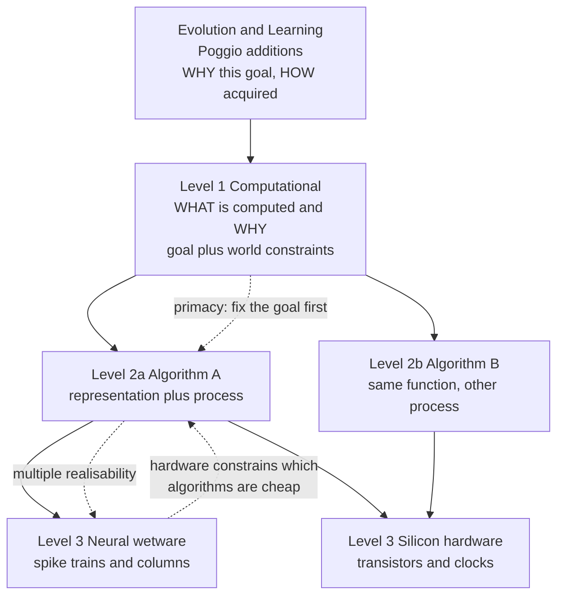

# 🧭 Levels of Analysis and Marr's Three Levels

> [!abstract] TL;DR
> David Marr argued that any information-processing system must be explained at **three semi-independent levels**: the **computational** level (what problem is being solved and why), the **algorithmic/representational** level (what representations and processes carry out the solution), and the **implementational** level (how those processes are physically realised in hardware or wetware). Because a single computational goal can be met by many algorithms, and each algorithm by many physical substrates, the levels are loosely coupled — which is why Marr insisted that understanding the *computation* must come first. The framework remains the organising backbone of cognitive science and continues to shape how AI researchers separate "what a network computes" from "how it is trained and wired."

---

## Intuition

**Analogy:** Think about explaining a **cash register**. You can describe it three ways, and all three are simultaneously true.

1. *What and why:* it computes the total owed and the change to return — arithmetic obeying the rules of addition, because commerce demands a fair, order-independent tally. This is the **computational** story, and notice it says nothing about *how*.
2. *How, in the abstract:* it might add the prices left-to-right into a running sum, or sort them and add largest-first, or slide beads on an abacus. These are different **algorithms** that all honour the same arithmetic goal.
3. *How, in the metal:* the chosen algorithm runs on gears, or on a silicon adder, or on a clerk's neurons. This is the **implementation**.

You can swap the mechanism (gears for silicon) without changing the algorithm, and swap the algorithm (left-to-right for sorted) without changing the computation. Marr's claim is that **minds and brains are exactly like this** — and that if you only study the wetware (the gears) you will never understand *addition*. In the technical domain, "compute the total" becomes "recover a 3-D scene from 2-D retinal images," and the same three-way split applies.

---

## How It Works

### The three levels (Marr & Poggio, formalised in *Vision*, 1982)

1. **Computational (or "computational theory") level — WHAT and WHY.**
   Specify the *function* the system computes as a mapping from inputs to outputs, together with the *goal* and the *constraints of the world* that make that mapping the right one. For stereo vision the goal is "recover depth"; the constraint is that a physical surface point projects to two retinal points obeying the epipolar geometry. This level is about *competence* — the abstract problem, divorced from any mechanism.

2. **Algorithmic / representational level — HOW, abstractly.**
   Choose the **representations** for input and output and the **algorithm** that transforms one into the other. Depth could be represented as a disparity map; the algorithm could be coarse-to-fine matching, or a relaxation network. Many distinct algorithms satisfy the same computational specification.

3. **Implementational / physical level — HOW, physically.**
   Specify how the representation and algorithm are *realised* in a substrate: cortical columns and spike trains in a brain, transistors and clock cycles in a chip. The same algorithm can be implemented in radically different hardware.

### Why the levels are semi-independent: multiple realizability

The levels are **loosely coupled, not watertight**. A given computational goal is served by *many* algorithms; a given algorithm is realised by *many* physical systems. This **multiple realizability** is what licenses a functionalist cognitive science: you can study the algorithm a person uses to add numbers without first mapping every neuron, exactly as you can study a sorting algorithm without knowing whether it runs on ARM or x86. The coupling is not zero, though — hardware makes some algorithms cheap and others impossibly slow, so implementation *constrains* the plausible algorithms (a point Marr's critics press hard).

### The primacy-of-the-computational-level argument

Marr's most-quoted claim is that **the computational level has explanatory priority**. His analogy: trying to understand perception by studying only neurons is like trying to understand bird flight by studying only feathers — it cannot be done. You cannot reverse-engineer a mechanism until you know *what problem it is solving*, because the same neural circuitry looks arbitrary until you know its goal. Fix the computation first; then a small number of algorithms become natural; then the implementation becomes interpretable.

### Marr's own worked example: vision as a hierarchy of representations

Marr applied the framework to early vision, positing a pipeline of increasingly abstract representations:

- **Grey-level image** → raw intensities on the retina.
- **Primal sketch** → make explicit the *intensity changes* (edges, bars, blobs, terminations). Edge detection is computed by finding **zero-crossings** of a Laplacian-of-Gaussian filtered image — a computational-level claim (find luminance discontinuities at multiple scales) realised algorithmically by convolution and zero-crossing detection.
- **2.5-D sketch** → a viewer-centred map of surface orientation and depth.
- **3-D model** → an object-centred, viewpoint-independent description for recognition.

The point is that each stage is defined first by *what information it makes explicit and why*, only then by the algorithm and the neural circuit.

### Neighbouring frameworks Marr drew on and inspired

- **Chomsky's competence / performance distinction.** Marr's computational level is close kin to Chomsky's **competence** (the idealised knowledge of grammar), while the algorithmic + implementational levels correspond to **performance** (how that knowledge is actually deployed, with memory limits and errors). Both insist you must characterise the abstract capacity before the messy mechanism.
- **Newell's levels of a computer system.** Allen Newell independently proposed a stack — device, circuit, logic, register-transfer, program/symbol, and the **knowledge level** — where each level abstracts over the one below. Marr's three levels roughly compress Newell's stack, with the *knowledge level* echoing the computational level.
- **Poggio's later additions: learning and evolution.** Tomaso Poggio (2012) argued Marr's three are incomplete for biological systems and added two *higher* levels: **learning** (how the algorithm is acquired from data during a lifetime) and **evolution** (how the computation itself was selected across generations). These sit *above* the computational level as further "why" explanations, and they map neatly onto modern machine learning, where the learning level is where most engineering effort now lives.



---

## Key Concepts

### Secondary (intuitive grasp)

- **Three ways to explain a machine:** *what it does and why* (computational), *the steps it follows* (algorithmic), *what it is made of* (implementational).
- **Same goal, many recipes:** adding a shopping list gives the same total whether you add left-to-right or largest-first — the *what* is fixed but the *how* can vary.
- **Study the purpose first:** you cannot understand a strange machine by taking it apart until you know what job it is meant to do.

### Undergraduate (working knowledge)

- **Multiple realizability:** one computational function → many algorithms → many physical substrates; this is the philosophical basis of *functionalism* and of treating cognition as software running on neural hardware.
- **Representation is a first-class choice:** at the algorithmic level, the *representation* (disparity map vs depth map, Arabic numerals vs Roman) is as consequential as the process, because it makes some information explicit and cheap and other information implicit and expensive.
- **Competence vs performance:** Chomsky's distinction is Marr's computational-vs-lower-levels split applied to language; both idealise away resource limits at the top level.
- **The zero-crossing example:** Marr–Hildreth edge detection is a concrete case where the same computational claim ("find luminance discontinuities across scales") is stated cleanly before any specific filter or neural circuit is proposed.

### Graduate (critical and integrative)

- **Levels are semi-independent, not independent:** implementation genuinely *constrains* algorithms (parallel, noisy, energy-limited neural hardware favours certain algorithm classes), so strict top-down "computation first, ignore the brain" is an idealisation that embodied and connectionist researchers reject.
- **Poggio's five-level view:** adding *learning* and *evolution* reframes Marr for the deep-learning era — a trained network's *weights* are a learning-level object, its *forward pass* an algorithmic-level object, and its *goal* a computational-level object; the three collapse dangerously easily in practice.
- **Dynamical / embodied critiques:** van Gelder, Thelen, and others argue that cognition is better modelled as a continuous coupled dynamical system with no clean "representation + algorithm" layer, so Marr's middle level may be a category error for embodied, real-time behaviour.
- **Anti-realism about the algorithmic level:** some hold that only the computational and implementational levels are objectively "in the system," while the algorithmic level is an observer-relative gloss — the *stance* debate (Dennett) versus Marr's realism about representations.

---

## Python Demo

```python
# Marr's three levels for ONE task: estimate the central value (mean) of a
# stream of noisy sensory samples. We render each level explicitly and plot them.
#   Level 1 Computational   : WHAT/WHY  -> the mean minimises total squared error
#   Level 2 Algorithmic     : HOW (abstract) -> two DIFFERENT algorithms, same function
#   Level 3 Implementational: HOW (physical) -> a simulated neural population code
import numpy as np
import matplotlib.pyplot as plt

rng = np.random.default_rng(0)

# 40 noisy measurements of one underlying location (e.g. repeated retinal cues)
N = 40
true_value = 3.0
samples = true_value + rng.normal(0.0, 1.0, size=N)

# ---------------------------------------------------------------------------
# LEVEL 1 - COMPUTATIONAL: what is computed and WHY.
# The mean is the value m that MINIMISES the total squared error:
#     m* = argmin_m  sum_i (x_i - m)^2   ->   m* = (1/N) sum_i x_i
# ---------------------------------------------------------------------------
grid = np.linspace(samples.min() - 1, samples.max() + 1, 400)
cost = np.array([np.sum((samples - m) ** 2) for m in grid])
m_star = samples.mean()                      # closed-form minimiser

# ---------------------------------------------------------------------------
# LEVEL 2 - ALGORITHMIC: two processes computing the SAME function.
#   Algorithm A: batch sum-then-divide (stores all data, one shot)
#   Algorithm B: online incremental mean (stores nothing, updates per sample)
# ---------------------------------------------------------------------------
mean_batch = samples.sum() / N               # Algorithm A

running = np.zeros(N)                         # Algorithm B trajectory
m = 0.0
for n in range(N):
    m = m + (samples[n] - m) / (n + 1)        # streaming update rule
    running[n] = m
mean_online = running[-1]
assert np.isclose(mean_batch, mean_online)    # same answer, different algorithm

# ---------------------------------------------------------------------------
# LEVEL 3 - IMPLEMENTATIONAL: a neural population code.
# A bank of neurons with Gaussian tuning curves tiles the value axis. The
# estimate m* becomes a bump of population activity; a weighted population-
# vector read-out recovers the number from the firing rates.
# ---------------------------------------------------------------------------
prefs = np.linspace(grid[0], grid[-1], 25)    # preferred values of 25 neurons
sigma = 0.6
activity = np.exp(-(prefs - m_star) ** 2 / (2 * sigma ** 2))   # firing rates
decoded = np.sum(activity * prefs) / np.sum(activity)          # population vector

# ---------------------------------------------------------------------------
# Visualise the three levels side by side.
# ---------------------------------------------------------------------------
fig, ax = plt.subplots(1, 3, figsize=(15, 4))

# Level 1: the objective landscape and its minimiser
ax[0].plot(grid, cost, color="tab:blue")
ax[0].axvline(m_star, color="k", ls="--")
ax[0].set_title("Level 1 Computational\nWHAT/WHY: minimise squared error")
ax[0].set_xlabel("candidate value m")
ax[0].set_ylabel("total squared error")
ax[0].annotate("m* = mean", xy=(m_star, cost.min()),
               xytext=(m_star + 0.4, cost.min() + np.ptp(cost) * 0.35),
               arrowprops=dict(arrowstyle="->"))

# Level 2: two algorithms converging to one number
ax[1].plot(range(1, N + 1), running, marker="o", ms=3,
           label="Algorithm B: online update")
ax[1].axhline(mean_batch, color="tab:red", ls="--",
              label="Algorithm A: batch sum / N")
ax[1].axhline(m_star, color="k", ls=":", lw=1, label="target m*")
ax[1].set_title("Level 2 Algorithmic\nTwo processes, one function")
ax[1].set_xlabel("samples seen")
ax[1].set_ylabel("current estimate")
ax[1].legend(fontsize=8)

# Level 3: the neural population representation and its read-out
ax[2].bar(prefs, activity, width=0.18, color="tab:green", alpha=0.75)
ax[2].axvline(decoded, color="k", ls="--", label=f"decoded = {decoded:.2f}")
ax[2].set_title("Level 3 Implementational\nNeural population code")
ax[2].set_xlabel("neuron preferred value")
ax[2].set_ylabel("firing rate")
ax[2].legend(fontsize=8)

plt.tight_layout()
plt.show()

print(f"Level 1 target (closed form) : {m_star:.4f}")
print(f"Level 2 batch algorithm      : {mean_batch:.4f}")
print(f"Level 2 online algorithm     : {mean_online:.4f}")
print(f"Level 3 population read-out   : {decoded:.4f}")
# All four numbers agree: one computation, realised many ways.
```

The demo makes Marr's central point tangible: the four printed numbers are (nearly) identical, yet each was produced by a *different level of description* of the *same* computation. Change the algorithm (batch vs online) or the substrate (neurons vs floating-point) and the computed function is preserved — that is multiple realizability in code.

---

## Real-World Applications

- **Computer vision pipelines.** Classical edge/feature detection (Marr–Hildreth, Canny) is still taught computational-level first ("locate luminance discontinuities at multiple scales"), then algorithmically (Laplacian-of-Gaussian convolution, non-max suppression), then in hardware (GPU convolution kernels). Modern CNNs learn the algorithmic level from data, but the computational specification of the task is still what defines the loss.
- **Cognitive modelling.** Rational-analysis and Bayesian models of cognition (Anderson, Griffiths, Tenenbaum) are explicitly *computational-level* theories: they ask what the optimal solution to a perceptual or inductive problem is, then compare human behaviour to it, deferring the mechanism.
- **Interpretability and reverse-engineering neural networks.** Mechanistic interpretability implicitly uses Marr in reverse — start from the trained weights (implementation), recover the circuit/algorithm, then infer *what function* a head or feature computes. The recurring lesson (Marr's warning) is that staring at weights without a hypothesis about the computation yields little.
- **Neuroscience experimental design.** Deciding whether a finding is "just a wiring detail" or "a genuine algorithmic principle" is a levels judgement: single-unit recordings live at the implementational level and only become theory once tied to a computational goal such as predictive coding or efficient coding.

---

## Common Pitfalls

- **Collapsing levels ("neurons all the way down").** Explaining behaviour purely by cell types or connectivity, with no statement of the *computation*, produces detail without understanding — precisely the "feathers, not flight" error Marr warned against.
- **Treating the levels as fully independent.** The opposite mistake: designing algorithms with no regard for the substrate. Real neural hardware is slow, parallel, noisy, and energy-limited, so implementation *does* constrain which algorithms are biologically plausible; strict "computation first, ignore the brain" is an idealisation, not a law.
- **Confusing "computational level" with "runs on a computer."** Marr's *computational* level is about the abstract problem and its logic — the *what and why* — not about computers. A pocket calculator's computational level is arithmetic, regardless of the silicon.
- **Assuming there is exactly one algorithmic description.** Because algorithms are semi-independent of both the goal and the hardware, an observed neural circuit may implement any of several algorithms; identifying "the" algorithm requires additional evidence, not just anatomy.
- **Forgetting Poggio's learning/evolution levels for adaptive systems.** For brains and trained networks, "why this computation" is partly answered by *learning* and *evolution*; ignoring them makes a learned solution look like a fixed design decision.

---

## Related Concepts

- [[Population_Coding_and_Decoding]] — the neural population code in the demo (tuning curves plus a population-vector read-out) is Marr's *implementational* level made concrete for a real cortical coding scheme.
- [[Visual_System_and_Visual_Cortex]] — V1 orientation columns and receptive fields are the canonical implementational substrate for the *primal sketch* and edge-detection computations Marr analysed.
- [[CNN_Fundamentals]] (AI-ML vault) — convolutional feature detectors are a modern, learned realisation of Marr's edge/primal-sketch stage; comparing the two shows the computational goal preserved across hand-designed and learned algorithms.
- [[Neural_Coding_and_Spike_Trains]] — spike-train codes are the physical medium in which any cognitive algorithm must ultimately be implemented, the bottom of Marr's stack.
- [[Consciousness_and_Neural_Correlates]] — the "neural correlates" research programme is a levels question: which implementational facts matter, and which are merely realisation detail, for a given cognitive function.

---

## Review Questions

1. **(Secondary)** Using the cash-register or shopping-list analogy, explain in your own words the difference between the computational, algorithmic, and implementational levels, and give one example of changing the *algorithm* without changing the *computation*.
2. **(Undergraduate)** Marr claims the computational level has explanatory priority. State his "feathers vs flight" argument, then give a concrete case from vision (e.g. edge detection) where specifying the computation first makes the neural mechanism interpretable. Where does Chomsky's competence/performance distinction map onto Marr's levels?
3. **(Graduate)** Embodied and dynamical-systems theorists argue that the *algorithmic* level is a category error for real-time embodied behaviour, and Poggio argues Marr's three levels omit *learning* and *evolution*. Reconstruct both critiques, then take a position: is Marr's framework still the right organising scheme for interpreting modern deep networks, or does it need Poggio's extensions to avoid conflating a network's weights, forward pass, and objective?

---

## Sources

- Marr, D. (1982/2010). *Vision: A Computational Investigation into the Human Representation and Processing of Visual Information.* MIT Press.
- Marr, D. & Poggio, T. (1976). *From Understanding Computation to Understanding Neural Circuitry.* MIT AI Memo 357.
- Poggio, T. (2012). "The Levels of Understanding framework, revised." *Perception*, 41(9), 1017–1023.
- Chomsky, N. (1965). *Aspects of the Theory of Syntax.* MIT Press (competence/performance distinction).
- Newell, A. (1982). "The Knowledge Level." *Artificial Intelligence*, 18(1), 87–127.
- McClamrock, R. (1991). "Marr's Three Levels: A Re-evaluation." *Minds and Machines*, 1(2), 185–196.

---

#cognitive-science #marr #levels-of-analysis #computation #vision
