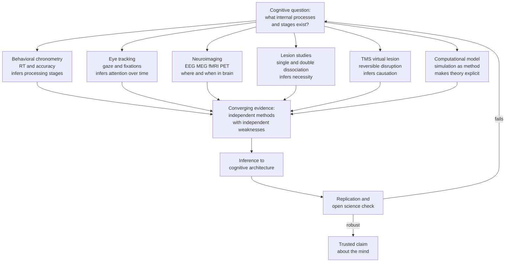

# 🧠 Research Methods in Cognitive Science

> [!abstract] TL;DR
> Cognitive science cannot open the black box of the mind directly, so it triangulates hidden mental processes from measurable traces — how *long* a response takes (reaction time), *where* the eyes move, *which* brain regions light up, and *what* breaks when a region is damaged. No single method is decisive: behavioral chronometry infers processing *stages*, neuroimaging trades **spatial for temporal resolution**, lesion studies establish **necessity** via dissociations, TMS creates reversible "virtual lesions" for causal claims, and computational models make the inferred architecture explicit and falsifiable. The discipline's signature move is **converging evidence** — a claim about the mind's architecture is only trustworthy when methods with independent weaknesses point to the same conclusion.

---

## Intuition

**Analogy:** Imagine you are a mechanic who is forbidden from opening the hood of a running car. You must reverse-engineer the engine's internal design from the outside only.

You could **time** how long the car takes to accelerate from different starting speeds (behavioral reaction time). You could watch **where the driver looks** before each maneuver (eye tracking). You could hold a stethoscope to the chassis and map the **heat and vibration** while it idles versus revs (neuroimaging). You could study a **broken car** that lost exactly one function — headlights dead but engine fine — to prove those systems are separable (lesion studies and dissociations). You could **temporarily unplug** one wire and see what stops working, then plug it back in (TMS). Finally, you could **build a working replica** from your best guess and check whether it behaves the same (computational modeling).

Each probe is noisy and each has a blind spot. But when the stopwatch, the stethoscope, the broken car, and your replica *all* imply "there is a separate ignition subsystem here," you can finally believe it. That triangulation — never trusting one instrument alone — is the entire methodological engine of cognitive science.

---

## How It Works

### The Core Logic: From Behavior to Architecture

Cognitive science treats the mind as an **information-processing system** whose internal stages are not directly observable. Every method is a strategy for making an inference about that hidden architecture from an observable signal. Two ideas do most of the work:

1. **Mental chronometry** — the assumption that mental operations take measurable *time*, so differences in reaction time (RT) between carefully matched conditions estimate the duration of specific internal processes.
2. **Dissociation logic** — the assumption that if two functions can be selectively impaired independently of one another, they are supported by *separable* underlying mechanisms.

### Behavioral Chronometry: Subtraction and Additive Factors

- **Donders' subtraction method (1868):** Build two tasks that differ by exactly one hypothesized stage. Subtract the RT of the simpler task from the more complex one, and the difference *is* the duration of the added stage. A simple-detection task versus a choice task isolates the "decision" stage.
- **Sternberg's additive factors method (1969):** Rather than subtracting whole tasks, manipulate several factors at once. If two factors affect RT **additively** (no interaction), they influence *separate* processing stages; if they **interact**, they touch a *shared* stage. This upgrades subtraction from assuming stages to *testing* for them.
- **Accuracy and psychophysics:** RT is paired with error rates to guard against **speed-accuracy tradeoffs**, and psychophysical methods relate stimulus intensity to perceptual judgments to map sensory thresholds.

### The Neuroimaging Resolution Tradeoff

Brain methods differ chiefly in **spatial versus temporal resolution**, and no non-invasive technique wins both:

- **EEG / ERP and MEG** — millisecond temporal resolution, coarse spatial localization. Best for *when* a process happens.
- **fMRI and PET** — millimeter spatial resolution, sluggish seconds-scale temporal resolution. Best for *where* a process happens.
- **Lesion and TMS** — establish *necessity* and *causation*, not mere correlation.

### Converging Evidence and Inference to Architecture



---

## Key Concepts

### Secondary Level

**Why not just ask people?** Introspection is unreliable — much of cognition is unconscious, and people confidently report reasons for behavior they cannot actually observe. So cognitive scientists measure *indirect traces*: how fast someone answers, where they look, which brain areas activate.

**Reaction time as a ruler:** If pressing a button takes longer when a task is harder, the extra milliseconds estimate the "thinking time" the harder task added. Longer RT for a bigger mental task is the simplest window into invisible mental work.

**The one-instrument trap:** Any single measure can mislead. Brain imaging shows *correlation* (a region is active) but not *necessity* (whether it is required). Confidence comes from many methods agreeing — this is called **converging evidence**.

### Undergraduate Level

**Mental rotation — the signature experiment.** Shepard and Metzler (1971) showed participants pairs of 3D block figures and asked whether they were the *same* shape rotated, or mirror images. The key result: RT increased **linearly** with the angular difference between the two figures. The straight line implies people mentally rotate an internal, analog image at a roughly constant angular velocity — a genuinely spatial, image-like representation, not an abstract propositional description. This is the classic demonstration that reaction time can reveal the *format* of internal representation, not just its speed.

**Dissociation logic in detail.**

| Pattern | What is observed | What it licenses |
|---|---|---|
| **Single dissociation** | Damage impairs task A but spares task B | A and B *may* differ, but B could just be easier |
| **Double dissociation** | Patient 1: A impaired, B spared. Patient 2: B impaired, A spared | Strong evidence A and B use *separable* mechanisms |

The classic double dissociation is amnesia research: patient **H.M.** lost the ability to form new declarative memories yet could still learn motor skills, while other patients show the reverse — dissociating declarative from procedural memory as distinct systems.

**Perturbation methods.** **TMS** delivers a magnetic pulse that briefly disrupts a cortical region, creating a reversible "virtual lesion." Because the disruption is temporary and experimentally timed, TMS supports **causal** claims (region X is *necessary* for task Y at time T) that correlational fMRI cannot, without waiting for a naturally brain-damaged patient.

**Eye tracking.** Gaze position and fixation duration index the moment-to-moment allocation of attention. The **eye-mind assumption** holds that what is fixated is what is being processed — useful in reading research, scene perception, and usability testing, though covert attention can decouple gaze from focus.

**Verbal protocols / think-aloud.** Ericsson and Simon (1980, 1993) formalized *protocol analysis*: asking participants to think aloud while solving a problem gives a trace of the contents of working memory, *provided* they merely verbalize current thoughts rather than *explain* or *rationalize* them. Concurrent reports are more valid than retrospective ones, which are contaminated by reconstruction.

### Graduate Level

**Additive factors as architecture inference.** Sternberg's logic is a formal test of **serial-stage models**: additivity of two factors on mean RT implies they load onto distinct, non-overlapping stages. The method has known limits — it assumes discrete, serial, non-cascaded stages, and interactions are ambiguous (they could reflect a shared stage *or* a violation of the stage assumption itself). Cascade and parallel models (McClelland) and continuous-flow accounts complicate the clean subtraction picture.

**Drift-diffusion and process models of RT.** Modern chronometry replaces subtraction with generative models. The **drift-diffusion model** treats a decision as noisy accumulation of evidence to a bound, jointly fitting the *full RT distribution* and error rates. This decomposes an RT effect into interpretable parameters — drift rate (evidence quality), boundary separation (caution / speed-accuracy setting), and non-decision time (encoding plus motor) — resolving the speed-accuracy confound that plagues raw mean RT.

**The reverse-inference problem.** Concluding "the participant felt fear because the amygdala activated" is invalid unless the region is *selective* for that process. Because most regions activate across many tasks, forward inference (task to activation) does not license backward inference (activation to mental state) without Bayesian priors on selectivity. This is neuroimaging's deepest interpretive trap.

**Computational modeling as a method, not a decoration.** Simulation is a first-class empirical tool: a running model forces every hidden assumption to be explicit and generates quantitative predictions that can be falsified. Symbolic cognitive architectures (**ACT-R**, **SOAR**), connectionist networks, and Bayesian models each instantiate a theory of the architecture; **model comparison** (via likelihood, AIC/BIC, cross-validation) adjudicates between them against behavioral and neural data. Marr's three levels — computational, algorithmic, implementational — clarify *which* question a given model and method actually answers.

**Converging operations, formalized.** Garner, Hake, and Eriksen (1956) argued that any single operation confounds the construct with method-specific artifacts; only when multiple operations that share the target construct but differ in artifacts converge can a construct be validly inferred. This is the epistemological backbone connecting chronometry, imaging, lesions, and modeling.

**Replication and open science.** Cognitive science inherited the reproducibility crisis: small samples, flexible analysis pipelines ("researcher degrees of freedom"), p-hacking, and publication bias inflate false positives. fMRI is especially vulnerable — Eklund et al. (2016) showed common cluster-correction methods yielded false-positive rates far above nominal. Reforms: **pre-registration**, registered reports, larger and better-powered samples, open data and code, and multiverse / specification-curve analysis to expose analytic flexibility.

---

## Python Demo

```python
# Simulate and analyze a Shepard & Metzler mental-rotation experiment.
# Prediction: reaction time (RT) rises LINEARLY with the angular disparity
# between two 3D shapes. A straight RT-vs-angle line is the classic signature
# of an internal ANALOG rotation process running at ~constant angular velocity.

import numpy as np
import matplotlib.pyplot as plt

rng = np.random.default_rng(42)

# 1. Experimental design: angular disparities tested (degrees)
angles = np.array([0, 20, 40, 60, 80, 100, 120, 140, 160, 180])
trials_per_angle = 25

# 2. Ground-truth "mental" model:
#    RT = intercept + slope * angle  (+ Gaussian trial noise)
#    intercept = perception + decision + motor time  (non-rotation stages)
#    slope     = time per degree of internal rotation
true_intercept = 450.0     # milliseconds
true_slope     = 4.0       # milliseconds per degree  -> ~250 deg/s

# 3. Generate noisy single-trial RTs
ang_col = np.repeat(angles, trials_per_angle)
noise   = rng.normal(0, 60, size=ang_col.size)      # 60 ms trial noise
rt      = true_intercept + true_slope * ang_col + noise

# 4. Mean RT per angle (what the classic figure plots)
mean_rt = np.array([rt[ang_col == a].mean() for a in angles])

# 5. Ordinary-least-squares regression on single trials (closed form)
X   = ang_col.astype(float)
b1  = np.cov(X, rt, bias=True)[0, 1] / np.var(X)     # slope
b0  = rt.mean() - b1 * X.mean()                       # intercept
fit = b0 + b1 * angles

# 6. Coefficient of determination R-squared
pred      = b0 + b1 * X
ss_res    = np.sum((rt - pred) ** 2)
ss_tot    = np.sum((rt - rt.mean()) ** 2)
r_squared = 1.0 - ss_res / ss_tot

print(f"Recovered slope      : {b1:.2f} ms/deg   (true 4.00)")
print(f"Recovered intercept  : {b0:.1f} ms       (true 450)")
print(f"Mental rotation rate : {1000.0 / b1:.0f} deg/s")
print(f"R-squared            : {r_squared:.3f}")

# 7. Plot: the classic linear RT-vs-angle signature
plt.figure(figsize=(8, 5))
plt.scatter(ang_col, rt, s=8, alpha=0.25, color="steelblue",
            label="single trials")
plt.scatter(angles, mean_rt, s=60, color="crimson", zorder=3,
            label="mean RT per angle")
plt.plot(angles, fit, color="black", linewidth=2,
         label=f"OLS fit: RT = {b0:.0f} + {b1:.1f} * angle")
plt.xlabel("Angular disparity (degrees)")
plt.ylabel("Reaction time (ms)")
plt.title("Mental Rotation: linear RT-vs-angle signature (Shepard & Metzler)")
plt.legend()
plt.tight_layout()
plt.savefig("mental_rotation_rt.png", dpi=150)
plt.show()
```

**What this shows:** The simulated single-trial RTs scatter around a straight line whose slope (~4 ms per degree, recovered by regression) estimates the *rate* of internal rotation, and whose intercept (~450 ms) estimates all the non-rotation stages (perception, decision, motor). The near-1.0 R-squared reproduces the empirical hallmark: because RT grows *linearly* with angle, the mind appears to rotate an analog spatial image at a constant angular velocity rather than comparing abstract descriptions. This is exactly how reaction-time data lets us infer the *format* of an internal representation we can never directly observe.

---

## Real-World Applications

**Clinical neuropsychology.** Double dissociations from stroke and lesion patients remain the foundation of diagnostic batteries — separating, for example, semantic memory deficits from episodic ones, or naming impairments from comprehension impairments — to localize damage and target rehabilitation.

**Human-computer interaction and UX.** Reaction-time studies and eye tracking drive interface design: fixation heatmaps reveal what users notice, and RT on target-search tasks quantifies how layout affects findability. A/B tests are field experiments applying the same chronometric logic to product decisions.

**Reading and education research.** Eye-movement tracking during reading exposes where readers slow down, regress, or skip, informing dyslexia diagnosis and the design of instructional materials.

**Brain-computer interfaces and clinical neuroscience.** EEG/ERP components (P300, motor imagery rhythms) and ECoG high-gamma signals are decoded in real time to drive communication devices for paralyzed patients — an applied payoff of high-temporal-resolution electrophysiology.

**AI and cognitive modeling.** Cognitive architectures such as ACT-R are used to build human-performance models for aviation, driving, and interface certification, predicting operator error and workload before deployment.

**Marketing and usability neuroscience.** "Neuromarketing" applies eye tracking, EEG, and occasionally fMRI to measure attention and preference — with the important caveat that reverse-inference limits how much mental content can honestly be read off brain signals.

---

## Common Pitfalls

- **Ignoring the speed-accuracy tradeoff** — A condition can show faster RT simply because participants sacrificed accuracy, not because the underlying process is faster. Always analyze RT *and* error rates together, or use a joint model like the drift-diffusion model.

- **Reverse inference from imaging** — Concluding a specific mental state from a region's activation ("the insula lit up, so they felt disgust") is invalid unless that region is selective for the process. Most regions are multifunctional; forward activation does not license backward mind-reading.

- **Over-reading a single dissociation** — A patient impaired on task A but not B may simply find B easier or less demanding, not prove separate mechanisms. Only a *double* dissociation strongly implies separable systems.

- **Confusing correlation with necessity** — fMRI shows a region *co-varies* with a task; it cannot show the region is *required*. Necessity claims need lesion evidence or TMS perturbation.

- **Trusting retrospective verbal reports** — Asking people *why* they did something taps rationalization, not the actual cognitive process. Ericsson and Simon's protocol analysis works only for *concurrent* verbalization of current thoughts, not post-hoc explanation.

- **Analytic flexibility and p-hacking** — Especially in fMRI, the many defensible preprocessing and thresholding choices ("researcher degrees of freedom") inflate false positives. Pre-register the pipeline, report the full multiverse, and use validated cluster-correction.

- **Treating one method as ground truth** — The whole discipline rests on *converging* evidence. A finding supported by only one paradigm, however elegant, is provisional until an independent method with different weaknesses agrees.

---

## Related Concepts

- [[Neuroimaging_Methods]] — the neuroscience-side deep dive on EEG, MEG, fMRI, PET, and TMS and the spatial-versus-temporal resolution tradeoff this note summarizes.
- [[Research_Methods_Psychology]] — the broader experimental toolkit (random assignment, validity, ethics) that cognitive methods specialize and extend.
- [[Methods_in_Neuroscience]] — complementary catalogue of biological measurement techniques from the neuroscience-of-behavior angle.
- [[Statistical_Inference_and_Hypothesis_Testing]] — the inferential machinery (p-values, effect sizes, power) that underwrites every RT and imaging analysis and sits at the heart of the replication debate.
- [[Scientific_Reasoning_and_Method]] — the philosophy-of-science backdrop for converging operations, falsification, and inference to the best explanation.
- [[Problem_Solving_and_Decision_Making]] — the cognitive domain where verbal-protocol and RT methods were most influentially applied.
- [[Attention_and_Cognitive_Load]] — eye tracking and RT are the primary instruments for measuring attention allocation and processing demand.
- [[Memory_Systems]] — the amnesia double dissociations (declarative vs procedural) are the textbook case of dissociation logic in action.

---

## Review Questions

1. **Conceptual (Secondary):** Why do cognitive scientists rely on reaction time and eye movements instead of simply asking participants to report their thought processes? Give two reasons introspective self-report is unreliable.

2. **Scenario (Undergraduate):** You want to know whether a specific parietal region is *necessary* for mental rotation, not merely active during it. An fMRI study shows the region activates as rotation angle increases. Why is that insufficient, and what method would you add to establish necessity? Design the experiment, including the control condition.

3. **Trade-off (Graduate):** A colleague reports that manipulating stimulus contrast and manipulating response complexity *interact* to affect mean RT in a Sternberg-style additive-factors design. Explain the two competing interpretations of this interaction, why the result is ambiguous about cognitive architecture, and how a drift-diffusion model of the full RT distribution could disambiguate them.

---

## Sources

- Shepard, R. N., & Metzler, J. (1971). "Mental rotation of three-dimensional objects." *Science*, 171(3972), 701–703. https://www.science.org/doi/10.1126/science.171.3972.701
- Sternberg, S. (1969). "The discovery of processing stages: Extensions of Donders' method." *Acta Psychologica*, 30, 276–315. https://www.sciencedirect.com/science/article/abs/pii/0001691869900553
- Ericsson, K. A., & Simon, H. A. (1993). *Protocol Analysis: Verbal Reports as Data* (rev. ed.). MIT Press. https://mitpress.mit.edu/9780262550239/protocol-analysis/
- Poldrack, R. A. (2006). "Can cognitive processes be inferred from neuroimaging data?" *Trends in Cognitive Sciences*, 10(2), 59–63. https://www.cell.com/trends/cognitive-sciences/fulltext/S1364-6613(05)00336-0
- Eklund, A., Nichols, T. E., & Knutsson, H. (2016). "Cluster failure: Why fMRI inferences for spatial extent have inflated false-positive rates." *PNAS*, 113(28), 7900–7905. https://www.pnas.org/doi/10.1073/pnas.1602413113

---

#cognitive-science #methods #reaction-time #neuroimaging #experiment
