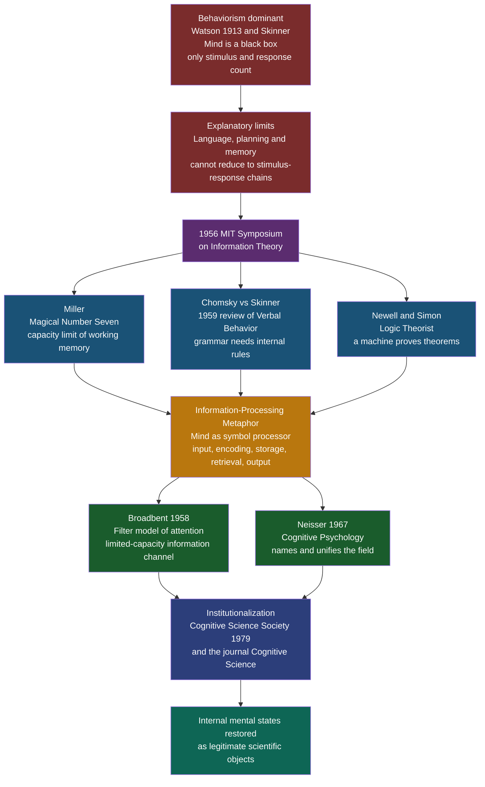

# 🧠 The Cognitive Revolution

> [!abstract] TL;DR
> Between roughly 1948 and 1970, psychology abandoned the behaviorist ban on studying the mind and re-legitimized internal mental states — attention, memory, representation, planning — as measurable scientific objects. The catalyst was a new metaphor borrowed from the emerging computer: the mind as an information-processing system with inputs, internal stages, storage, and outputs. This paradigm shift, crystallized at the 1956 MIT Symposium and named by Neisser in 1967, founded modern cognitive science.

---

## Intuition

**Analogy:** Imagine two rival mechanics arguing about a mysterious vending machine. The first mechanic — the behaviorist — refuses to open the casing. "I only trust what I can see," he says. "I put in a coin, a soda comes out. I will describe the machine purely as a table of coins-in and sodas-out. Talk of gears and springs inside is unscientific speculation." For decades this discipline is productive: he builds a precise catalog of stimulus and response.

Then a second mechanic — the cognitivist — points out that the input-output table cannot explain everything. Sometimes the same coin yields a different result depending on what was inserted a minute earlier; sometimes the machine "remembers" a failed selection. No lookup table can capture that without positing something inside that stores state and transforms it. "The casing is not sacred," she says. "We can infer the internal mechanism from the timing and pattern of outputs — even without seeing it directly." The cognitive revolution was psychology deciding, collectively, that it was finally allowed to open the casing.

The tool that made opening it respectable was the digital computer. A computer is a physical device whose behavior is only intelligible in terms of unobservable internal states — programs, buffers, memory registers. If engineers could talk rigorously about the invisible information-processing inside a machine, psychologists could talk rigorously about the invisible information-processing inside a mind.

---

## How It Works

### Core Mechanics

The revolution was less a single discovery than a change in what counted as a permissible explanation. Five moves defined it:

1. **Diagnosing behaviorism's limits.** John Watson (1913) and B. F. Skinner had insisted psychology study only observable behavior; the mind was a "black box" and internal states were unscientific. This worked for conditioning but broke down on language, problem-solving, planning, and memory — behaviors whose structure demands reference to internal rules and representations that no stimulus-response chain can generate.

2. **Importing the information-processing metaphor.** From Shannon's information theory (1948), Turing's theory of computation, and von Neumann's stored-program architecture came a new vocabulary: encoding, channels, capacity, storage, retrieval, buffers. The mind could now be modeled as a system that *transforms information through internal stages*, not merely a reflex arc.

3. **Making internal stages measurable.** The key methodological breakthrough was that unobservable stages leave observable fingerprints — chiefly in reaction time. If adding a memory-search step lengthens response time in a lawful way, then the internal stage is real and quantifiable, even though it is never directly seen. This is the logic behind mental chronometry and Sternberg's additive-factors method.

4. **Catalyzing events of 1956.** The paradigm reached critical mass in a single year, anchored by the 11 September 1956 Symposium on Information Theory at MIT.

5. **Institutionalizing the field.** Ulric Neisser's textbook *Cognitive Psychology* (1967) named and unified the movement; the Cognitive Science Society and its journal *Cognitive Science* (1979) gave it a permanent home spanning psychology, linguistics, computer science, philosophy, and neuroscience.

The core catalyzing events:

| Year | Event | Why it mattered |
|------|-------|-----------------|
| 1948 | Shannon, *A Mathematical Theory of Communication* | Gave "information" a precise, quantifiable meaning |
| 1956 | Miller, "The Magical Number Seven, Plus or Minus Two" | Working memory has a fixed capacity limit — an internal structural fact |
| 1956 | Newell and Simon demonstrate the Logic Theorist | A machine proves theorems by manipulating symbols — thought as computation |
| 1956 | MIT Symposium on Information Theory (11 Sept) | Miller, Chomsky, and Newell/Simon present on the same day |
| 1958 | Broadbent, *Perception and Communication* | Filter model of attention: mind as a limited-capacity information channel |
| 1959 | Chomsky's review of Skinner's *Verbal Behavior* | Argued grammar requires innate internal rules, not reinforcement |
| 1967 | Neisser, *Cognitive Psychology* | Named the field and made it a coherent discipline |
| 1979 | Cognitive Science Society founded; journal launched | Institutional and interdisciplinary permanence |

### Flow / Architecture



---

## Key Concepts

### Secondary Level

**What behaviorism claimed, and why it dominated.** John B. Watson launched behaviorism in 1913 with a manifesto: psychology is a purely objective, experimental branch of natural science, and its goal is the prediction and control of behavior. Introspection — asking people to report their inner experience — was declared unreliable and unscientific. B. F. Skinner extended this into *radical behaviorism*: behavior is shaped by its consequences through reinforcement and punishment, and appeals to inner mental causes are unnecessary. Behaviorism dominated American psychology for roughly fifty years because it delivered rigorous, replicable experiments and powerful applied results in learning and conditioning.

**Where it broke down.** Behaviorism could not comfortably explain behaviors whose structure seems to require internal representation:
- **Language.** A child produces sentences they have never heard. Reinforcement of specific utterances cannot explain infinite productive novelty.
- **Insight and planning.** Solving a maze or a puzzle by mentally trying routes before acting implies an internal model of the world.
- **Memory.** The very existence of a fixed capacity limit ("seven plus or minus two") is a claim about an internal store, not about stimulus and response.

**The new metaphor.** The cognitive revolution replaced the reflex arc with the *information-processing* view: the mind receives input, encodes it into an internal representation, stores and transforms that representation through a series of stages, and produces output. The computer supplied both the vocabulary and the proof-of-concept that machines with internal states could behave intelligently.

### Undergraduate Level

**1956: the year the paradigm crystallized.** George Miller later called the MIT Symposium of 11 September 1956 the day he "left the symposium with a strong conviction... that experimental psychology, theoretical linguistics, and the computer simulation of cognitive processes were all pieces of a larger whole." Three landmark contributions converged:

- **Miller — "The Magical Number Seven, Plus or Minus Two."** Miller reviewed evidence that immediate memory and absolute judgment are limited to about seven items or "chunks." Crucially, *chunking* — recoding raw items into meaningful units — expands effective capacity. This is a claim about internal representational structure that behaviorism had no vocabulary for.

- **Newell and Simon — the Logic Theorist.** The first running program that could prove theorems in symbolic logic (it proved 38 of the first 52 theorems in *Principia Mathematica*, and one more elegantly than Whitehead and Russell). It embodied the *physical symbol system hypothesis*: intelligence is the rule-governed manipulation of symbols, and thinking can be simulated on a machine.

- **Chomsky vs. Skinner.** Noam Chomsky's 1959 review of Skinner's *Verbal Behavior* (1957) is often treated as behaviorism's obituary. Chomsky argued that terms like "stimulus," "response," and "reinforcement" become vacuous when stretched to cover language, and that children's rapid, uniform, creative acquisition of grammar demands innate internal structure — not a reinforcement history. See [[Syntactic_Theory_and_Generative_Grammar]] and [[Universal_Grammar_and_Language_Acquisition]].

**Broadbent's filter model (1958).** Donald Broadbent gave the information-processing metaphor its first concrete cognitive architecture. Drawing on dichotic-listening data (different messages to each ear), he proposed that sensory information enters a high-capacity short-term store, then passes through a *selective filter* that admits one channel — selected by physical features such as which ear or which voice pitch — into a limited-capacity processing system. This was a falsifiable box-and-arrow model of an internal mechanism, and it launched the modern study of attention. See [[Attention_and_Cognitive_Load]].

**Neisser names the field (1967).** Ulric Neisser's *Cognitive Psychology* defined cognition as "all the processes by which the sensory input is transformed, reduced, elaborated, stored, recovered, and used." The book synthesized perception, attention, memory, and thinking under a single information-processing banner and gave the movement a textbook identity — the moment a scattered set of ideas became a discipline students could be trained in.

**Mental chronometry: measuring the invisible.** The revolution's methodological engine is the use of reaction time to decompose cognition into stages. If the mind processes information through discrete internal steps, then experimentally inserting or complicating a step should lengthen response time by a measurable, additive amount. Sternberg's additive-factors method (1969) formalized this: manipulations that affect *different* stages have additive effects on total RT, while manipulations affecting the *same* stage interact. Reaction-time distributions thus became a window into unobservable processing structure — the empirical heart of cognitivism (demonstrated in the Python section below).

### Graduate Level

**Kuhnian framing — was it really a "revolution"?** The term invokes Thomas Kuhn's *The Structure of Scientific Revolutions* (1962): a paradigm shift in which anomalies accumulate under the old framework until a new one replaces it. Historians of psychology dispute the tidy narrative. Continuity theorists (e.g., Leahey) argue there was no single crisis and no clean overthrow — Tolman's "cognitive maps" (1948), Bartlett's schema theory (1932), and Gestalt psychology all studied internal structure well before 1956, and behaviorist methods persisted. The "revolution" was arguably a gradual re-legitimization of mentalism rather than a discontinuous rupture. What genuinely changed was the *acceptability* of positing unobservable internal states, licensed by the computational analogy.

**The computer metaphor: enabling insight and hidden liability.** The information-processing view rests on the functionalist premise that cognition is computation — symbol manipulation that is *substrate-independent*, describable at Marr's computational and algorithmic levels without commitment to neural implementation. This was liberating: it let psychologists theorize about representations and processes without waiting for neuroscience. But it embedded assumptions later contested:
- **Serial, symbolic, von Neumann bias.** Early models assumed discrete symbols processed in serial stages. The 1980s connectionist / PDP counter-movement (Rumelhart, McClelland) argued for parallel, distributed, sub-symbolic processing in neuron-like networks — reviving a tension that runs straight through to today's deep-learning-versus-symbolic-AI debates. See [[Logic_in_AI_and_Computation]].
- **Disembodiment.** Treating cognition as abstract symbol crunching downplayed the body and environment, provoking the later *embodied*, *situated*, and *enactive* cognition programs (Varela, Clark, Barsalou).

**Why behaviorism was vulnerable, formally.** Chomsky's deepest argument was about *generative capacity*: a finite organism producing an unbounded set of novel grammatical sentences cannot be modeled by a finite stimulus-response lookup or a Markov (finite-state) chain, because natural-language syntax involves unbounded center-embedding and long-distance dependencies. This is a mathematical claim — that the required computational machinery exceeds what associationist mechanisms provide — and it reframed the mind-vs-black-box dispute as a question about the *class of computation* the mind implements.

**Institutionalization and interdisciplinarity.** The 1979 founding of the Cognitive Science Society and the journal *Cognitive Science* (with George Miller and others central) formalized the field as the intersection of six disciplines — psychology, linguistics, computer science / AI, philosophy, neuroscience, and anthropology — famously depicted in the Sloan Foundation's 1978 "cognitive hexagon." This interdisciplinarity is the durable legacy: cognitive science is defined not by a subject matter but by a shared commitment to explaining mind as information processing across levels of analysis.

---

## Python Demo

```python
# Contrasts a BEHAVIORIST model (stimulus -> response, single stage, no internal
# processing) against a COGNITIVIST model (stimulus -> internal processing stage ->
# response) on a simulated choice reaction-time experiment.
#
# Core idea of the cognitive revolution: an internal processing stage leaves a
# measurable fingerprint in the SHAPE of the RT distribution. Real human RTs are
# right-skewed (a fast rise, a long slow tail) because they are the sum of a
# roughly Gaussian encode+motor stage AND an exponential internal decision stage.
#
#   Behaviorist model  = single Gaussian        (one stage, symmetric, black box)
#   Cognitivist model  = Gaussian + Exponential (ex-Gaussian, two internal stages)
#
# numpy + matplotlib only.

import numpy as np
import matplotlib.pyplot as plt

rng = np.random.default_rng(7)

# ---------------------------------------------------------------------------
# 1. "Observed" human data from a choice-RT task (ground truth: two stages)
#    RT = non_decision_time (Gaussian) + internal_decision_time (Exponential)
#    Times in milliseconds.
# ---------------------------------------------------------------------------
N = 4000
mu_true, sigma_true, tau_true = 320.0, 30.0, 90.0   # encode+motor mean/sd, decision scale
observed = rng.normal(mu_true, sigma_true, N) + rng.exponential(tau_true, N)

obs_mean = observed.mean()
obs_std = observed.std()
# sample skewness (third standardized moment) -> the signature of an internal stage
obs_skew = np.mean(((observed - obs_mean) / obs_std) ** 3)

# ---------------------------------------------------------------------------
# 2. BEHAVIORIST model: one stage, no internal processing -> best-fit Gaussian.
#    A pure S->R reflex has a fixed latency plus symmetric motor noise. Fit it
#    fairly by matching the observed mean and standard deviation.
# ---------------------------------------------------------------------------
M = 200_000
behaviorist = rng.normal(obs_mean, obs_std, M)

# ---------------------------------------------------------------------------
# 3. COGNITIVIST model: recover the two internal stages from the data via
#    method-of-moments for the ex-Gaussian, then simulate.
#      mean     = mu + tau
#      variance = sigma^2 + tau^2
#      skew     = 2 * tau^3 / (sigma^2 + tau^2)^{3/2}
# ---------------------------------------------------------------------------
var_obs = obs_std ** 2
tau_hat = (max(obs_skew, 1e-6) * var_obs ** 1.5 / 2.0) ** (1.0 / 3.0)  # decision stage
sigma_hat = np.sqrt(max(var_obs - tau_hat ** 2, 1.0))                  # encode+motor sd
mu_hat = obs_mean - tau_hat                                            # encode+motor mean
cognitivist = rng.normal(mu_hat, sigma_hat, M) + rng.exponential(tau_hat, M)

# ---------------------------------------------------------------------------
# 4. Goodness of fit: SSE between each model's density and the observed density
#    over a common set of bins. Lower is better.
# ---------------------------------------------------------------------------
lo, hi = observed.min() - 20, observed.max() + 20
bins = np.linspace(lo, hi, 60)
centers = 0.5 * (bins[:-1] + bins[1:])

obs_density, _ = np.histogram(observed, bins=bins, density=True)
beh_density, _ = np.histogram(behaviorist, bins=bins, density=True)
cog_density, _ = np.histogram(cognitivist, bins=bins, density=True)

sse_beh = np.sum((beh_density - obs_density) ** 2)
sse_cog = np.sum((cog_density - obs_density) ** 2)

# ---------------------------------------------------------------------------
# 5. Visualize RT histograms for both models against the observed data.
# ---------------------------------------------------------------------------
fig, axes = plt.subplots(1, 2, figsize=(14, 5.5), sharey=True)
fig.suptitle(
    "Behaviorist (single-stage) vs Cognitivist (internal-stage) RT models",
    fontsize=13, fontweight="bold",
)

OBS_CLR, BEH_CLR, COG_CLR = "#7f8c8d", "#e74c3c", "#27ae60"

for ax, dens, clr, label, sse in [
    (axes[0], beh_density, BEH_CLR,
     "Behaviorist: stimulus -> response\n(single Gaussian stage, black box)", sse_beh),
    (axes[1], cog_density, COG_CLR,
     "Cognitivist: stimulus -> internal stage -> response\n(Gaussian + exponential)", sse_cog),
]:
    ax.bar(centers, obs_density, width=(bins[1] - bins[0]), color=OBS_CLR,
           alpha=0.55, label="Observed human RT")
    ax.plot(centers, dens, color=clr, linewidth=2.6, label="Model prediction")
    ax.axvline(obs_mean, color="navy", linestyle="--", linewidth=1.2,
               label=f"Observed mean = {obs_mean:.0f} ms")
    ax.set_title(f"{label}\nSSE vs observed = {sse:.2e}", fontsize=10)
    ax.set_xlabel("Reaction time (ms)")
    ax.legend(fontsize=8.5, loc="upper right")
    ax.grid(alpha=0.2)

axes[0].set_ylabel("Probability density")
plt.tight_layout()
plt.savefig("cognitive_revolution_rt_models.png", dpi=150, bbox_inches="tight")
plt.show()

# ---------------------------------------------------------------------------
# 6. Report
# ---------------------------------------------------------------------------
print("=== Cognitive Revolution: RT model comparison ===\n")
print(f"Observed RT   : mean={obs_mean:.1f} ms  sd={obs_std:.1f} ms  skew={obs_skew:.3f}")
print(f"Recovered stages (cognitivist model):")
print(f"  encode+motor : N(mu={mu_hat:.1f}, sd={sigma_hat:.1f}) ms")
print(f"  decision     : Exp(scale tau={tau_hat:.1f}) ms\n")
print(f"SSE  behaviorist (1 stage)  = {sse_beh:.3e}")
print(f"SSE  cognitivist (2 stages) = {sse_cog:.3e}")
better = "COGNITIVIST" if sse_cog < sse_beh else "BEHAVIORIST"
print(f"\nBetter fit: {better} model "
      f"(cognitivist reduces error by {100 * (1 - sse_cog / sse_beh):.1f}%).")
print("\nThe positive skew of real RTs is the fingerprint of an internal")
print("processing stage. A single-stage S->R model is forced to be symmetric")
print("and cannot reproduce the long right tail -- the empirical crack through")
print("which cognitivism reintroduced internal mental states as measurable.")
```

**What the simulation shows:** Human reaction-time distributions are reliably right-skewed. A behaviorist single-stage model can only produce a symmetric Gaussian around the mean, so it over-predicts density on the fast side and misses the long slow tail. The cognitivist model decomposes each RT into an encode+motor stage plus an internal decision stage; the exponential decision component reproduces the skew almost exactly, yielding a far lower sum-of-squared-error. The distribution's *shape* — not just its mean — becomes evidence for an unobservable internal stage. This is precisely the methodological move (mental chronometry) that let cognitive psychologists study the mind's interior without ever opening the skull.

---

## Real-World Applications

> **Example 1 — Human-computer interaction and the model human processor.** Card, Moran, and Newell's *The Psychology of Human-Computer Interaction* (1983) turned the information-processing metaphor into an engineering tool: the "Model Human Processor" specifies perceptual, cognitive, and motor processors with measured cycle times (~100, ~70, ~70 ms), and the GOMS method predicts how long expert users take to complete tasks by summing internal operator times. Modern UX latency budgets and keystroke-level models descend directly from mental chronometry.

> **Example 2 — Working memory limits in interface and instructional design.** Miller's capacity limit and its successor, Baddeley's working-memory model, underlie cognitive-load theory in education and the "chunking" heuristics in design (grouping phone numbers, menu items, and form fields into small meaningful units). The reason security codes and grouped digits are easy to hold is a direct application of the revolution's central empirical claim. See [[Memory_Systems]] and [[Attention_and_Cognitive_Load]].

> **Example 3 — Symbolic AI and the physical symbol system hypothesis.** Newell and Simon's Logic Theorist and later General Problem Solver established that intelligence could be modeled as symbol manipulation, seeding decades of "Good Old-Fashioned AI": expert systems, planners, and theorem provers. The computational theory of mind and modern AI share this common ancestor, and the ongoing symbolic-versus-connectionist debate is its direct descendant. See [[Logic_in_AI_and_Computation]].

> **Example 4 — Diagnostic reaction-time paradigms.** Because internal stages are measurable via RT, tasks like the Stroop test, lexical decision, and the Implicit Association Test infer hidden cognitive structure — interference, automaticity, associative strength — from millisecond timing patterns. These tools, ubiquitous in clinical and social psychology, exist only because the revolution licensed treating unobservable processing stages as real and quantifiable.

---

## Common Pitfalls

- **Treating the revolution as a clean overthrow on a single date.** The "1956 revolution" is a useful shorthand, not literal history. Tolman's cognitive maps (1948), Bartlett's schemas (1932), and Gestalt psychology studied internal structure earlier, and behaviorist research continued for decades. The genuine change was the gradual re-legitimization of positing internal states, not an instantaneous coup.

- **Assuming behaviorism was simply wrong and got discarded.** Behaviorism's methods and findings remain foundational — conditioning, reinforcement schedules, behavior therapy, and applied behavior analysis are alive and effective. Cognitivism added a level of explanation (internal processing); it did not erase the behavioral level. See [[Operant_Conditioning]] and [[Classical_Conditioning]].

- **Reifying the computer metaphor into a literal claim.** "The mind is a computer" is a productive analogy, not a proven identity. Taking it too literally imported serial, symbolic, disembodied assumptions that connectionism, embodied cognition, and predictive-processing frameworks later challenged. Use the metaphor as scaffolding, not dogma.

- **Confusing the information-processing approach with cognitive neuroscience.** The classical revolution deliberately abstracted away from the brain (functionalism: cognition is substrate-independent). Cognitive *neuroscience* — the 1980s merger with neuroimaging — is a later development that re-coupled the mind to its neural implementation. Conflating the two erases an important historical distinction.

- **Overstating Chomsky's 1959 review as a solo knockout.** The review was influential but was one force among several; its specific critiques of Skinner remain contested by behaviorist scholars (e.g., MacCorquodale's 1970 rebuttal). The revolution was a convergence of memory research, AI, information theory, and linguistics — not a single decisive paper.

---

## Related Concepts

- [[History_and_Schools_of_Psychology]] — Situates the cognitive revolution within the sequence of schools; behaviorism as the predecessor the revolution reacted against
- [[Operant_Conditioning]] — Skinner's framework whose limits on language and planning helped trigger the shift
- [[Classical_Conditioning]] — The associationist learning tradition that the "black box" doctrine grew out of
- [[Memory_Systems]] — Direct descendant: Miller's capacity limit and the multi-store models the revolution produced
- [[Attention_and_Cognitive_Load]] — Broadbent's filter model and the limited-capacity-channel view of attention it established
- [[Syntactic_Theory_and_Generative_Grammar]] — Chomsky's generative program, the linguistic engine of the revolution
- [[Universal_Grammar_and_Language_Acquisition]] — The nativist argument (poverty of the stimulus) that dismantled the behaviorist account of language
- [[Logic_in_AI_and_Computation]] — Newell and Simon's Logic Theorist and the physical symbol system hypothesis; the computational theory of mind
- [[Cognitive_Biases_and_Heuristics]] — The revolution's most applied offspring: internal heuristics as measurable objects of study

---

## Review Questions

### Secondary

1. Behaviorists refused to study the mind because they thought internal states were unscientific. What is one everyday behavior — such as understanding a new sentence or planning a route — that seems impossible to explain using only stimulus and response? Explain why it requires talking about something "inside."

2. What did the digital computer offer psychologists that made it acceptable, for the first time, to theorize about invisible mental processes? Give the analogy in your own words.

3. Miller's "magical number seven" says immediate memory holds about seven items, but chunking can expand that. Give a concrete example of chunking from daily life and explain why it increases how much you can hold.

### Undergraduate

1. Three contributions converged around the 1956 MIT Symposium: Miller's capacity limit, Newell and Simon's Logic Theorist, and Chomsky's critique of Skinner. Explain how each one, in a different way, argued that behavior cannot be explained without positing internal information-processing structure.

2. The Python demo shows that a single-stage (Gaussian) model cannot reproduce the right-skew of real reaction-time data, while a two-stage (ex-Gaussian) model can. Explain how this illustrates the general method by which cognitive psychologists inferred unobservable internal stages. What property of the data is the "fingerprint" of an internal stage?

3. Broadbent's filter model was a box-and-arrow diagram of attention. Why was building falsifiable models of internal mechanisms such a radical departure from behaviorist practice, and what made those internal boxes testable rather than mere speculation?

### Graduate

1. Historians such as Leahey argue the "cognitive revolution" was a gradual re-legitimization rather than a Kuhnian paradigm shift with a genuine crisis and rupture. Marshal the evidence for both the "revolution" and the "continuity" readings. Which framing better fits the historical record, and what turns on the choice?

2. The information-processing metaphor imported serial, symbolic, substrate-independent assumptions that connectionism and embodied cognition later challenged. Analyze how the computer metaphor was simultaneously the enabling insight and the hidden liability of classical cognitivism. Which of its assumptions have survived, and which have been overturned?

3. Chomsky's deepest argument against behaviorism concerned generative capacity — that finite associationist mechanisms cannot produce the unbounded, structured output of natural-language syntax. Reconstruct this argument formally in terms of classes of computation, and assess whether modern large language models, trained by statistical prediction, refute it, vindicate it, or reframe it entirely.

---

## Sources

- [Miller, G.A. (1956). The magical number seven, plus or minus two. *Psychological Review*, 63(2), 81–97](https://doi.org/10.1037/h0043158)
- [Chomsky, N. (1959). Review of Skinner's *Verbal Behavior*. *Language*, 35(1), 26–58](https://doi.org/10.2307/411334)
- [Newell, A. & Simon, H.A. (1956). The Logic Theory Machine. *IRE Transactions on Information Theory*, 2(3), 61–79](https://doi.org/10.1109/TIT.1956.1056797)
- [Broadbent, D.E. (1958). *Perception and Communication*. Pergamon Press](https://doi.org/10.1037/10037-000)
- [Neisser, U. (1967). *Cognitive Psychology*. Appleton-Century-Crofts](https://www.goodreads.com/book/show/1943026.Cognitive_Psychology)
- [Miller, G.A. (2003). The cognitive revolution: a historical perspective. *Trends in Cognitive Sciences*, 7(3), 141–144](https://doi.org/10.1016/S1364-6613(03)00029-9)
- [Sternberg, S. (1969). The discovery of processing stages: extensions of Donders' method. *Acta Psychologica*, 30, 276–315](https://doi.org/10.1016/0001-6918(69)90055-9)

---

#cognitive-science #history #cognitive-revolution #behaviorism
