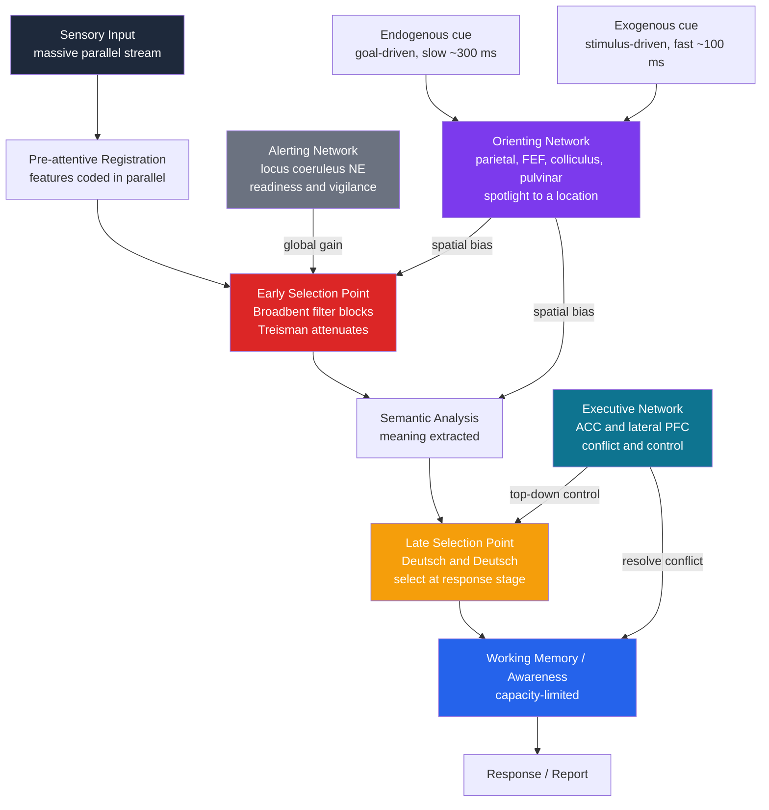

# 🔦 Attention and Selection

> [!abstract] TL;DR
> Attention is the brain's solution to a bandwidth problem: the senses deliver far more information than the ~limited-capacity stages of cognition can process, so a **selection mechanism** decides which inputs get amplified and which are suppressed. The century-old debate over *where* in the processing stream selection happens — early (before meaning, per Broadbent) or late (after meaning, per Deutsch and Deutsch) — was ultimately reconciled by **load theory**: the locus of selection is not fixed but shifts with perceptual demand. Posner's cueing paradigm turned the spotlight metaphor into a measurable phenomenon, and Posner and Petersen decomposed attention into three interacting networks — **alerting, orienting, and executive** control.

---

## Intuition

**Analogy:** Imagine a security operation with a hundred CCTV cameras but only three monitors and one guard. The guard cannot watch every feed, so a triage system decides which cameras appear on the monitors. The core design question is *when* to triage. Do you cut most feeds at the wall — before they even reach the control room — so only the "important" cameras are wired through (**early selection**)? Or do you route every camera into the room, let a bank of cheap processors tag each one for content, and only then decide which three the guard actually looks at (**late selection**)? The first design saves wiring and power but risks discarding a feed that suddenly matters; the second wastes processing on feeds nobody watches but never misses a labelled event.

Your brain runs *both* schemes and switches between them depending on how busy the "wiring" already is. When the attended task saturates perceptual capacity, irrelevant feeds get cut early. When capacity is spare, everything is processed to the level of meaning and selection slips to the end. That single insight — selection has a *movable* locus governed by load — dissolves a debate that ran for forty years.

---

## How It Works

### Core Mechanics

1. **Parallel pre-attentive registration.** Basic features (colour, orientation, motion, pitch, onset) are coded across the whole sensory field *in parallel*, cheaply and automatically, without attention. This stage never bottlenecks.

2. **The selection bottleneck.** Somewhere downstream, capacity runs out. Only a subset of representations can be bound, held, and reported. Attention is the biasing signal that decides the subset. The **early-vs-late debate** is a debate about the *position* of this bottleneck:
   - **Broadbent's filter (1958)** — a hard, all-or-none filter operates *early*, on physical features (which ear, which voice). Unattended channels are blocked before semantic analysis. Explains why dichotic-listening participants recall almost nothing about the unattended ear.
   - **Treisman's attenuation (1964)** — the filter is not a gate but a *dimmer*. Unattended channels are turned down, not off. High-priority words with low recognition thresholds (your own name, "fire!") can still break through the attenuated signal — the **cocktail-party effect**.
   - **Deutsch and Deutsch late selection (1963)** — *all* inputs are analysed for meaning; selection happens only at the *response* stage. What looks like filtering is really a decision about what to act on and remember.

3. **Load theory (Lavie, 1995) reconciles the debate.** Selection locus depends on load:
   - **High perceptual load** (a crowded, demanding display) consumes all capacity in early perception, leaving none to process distractors → *effectively early selection*.
   - **Low perceptual load** leaves spare capacity that *automatically* spills onto irrelevant items → *effectively late selection* (distractors get processed whether you want them to or not).
   - **High cognitive / working-memory load** does the opposite: it starves the executive control that *rejects* already-processed distractors, so distractor interference *increases*. Perceptual load and cognitive load push distractor processing in opposite directions.

4. **Dimensions of selection.** Attention can be steered along several axes: **spatial** (a location, the classic spotlight), **feature-based** (all red items everywhere at once), and **object-based** (the whole of one object, even its currently unattended parts). Treisman's **Feature Integration Theory** (described in *Key Concepts*, and covered in depth in the visual-search literature) explains how spatial attention *binds* independently coded features into a single object — without it, features can mis-combine into **illusory conjunctions**.

5. **Orienting: endogenous vs exogenous.** Attention is deployed two ways. **Endogenous** (voluntary, goal-driven) orienting is slow (~300 ms to build), sustained, and driven by central symbolic cues. **Exogenous** (reflexive, stimulus-driven) orienting is fast (~100 ms), transient, involuntary, triggered by a peripheral onset — and is followed by **inhibition of return**, a later *suppression* of the just-visited location that discourages re-checking.

6. **Three networks (Posner and Petersen, 1990).** Attention is not one system but three interacting ones: **alerting** (achieving and sustaining a state of readiness; norepinephrine / locus coeruleus), **orienting** (selecting information across space; parietal cortex, frontal eye fields, superior colliculus, pulvinar), and **executive** (detecting and resolving conflict, overriding prepotent responses; anterior cingulate and lateral prefrontal cortex — the same machinery that governs **working memory**).

### Flow / Architecture



*Two candidate bottleneck positions sit on the same processing chain. Under high perceptual load the effective cut is at the red node; under low load it slips to the amber node. The three networks bias the chain from the side: alerting sets global gain, orienting adds spatial bias, and the executive resolves conflict at selection and in working memory.*

---

## Key Concepts

### Secondary Level

**Attention is selection under limited capacity.** The senses are high-bandwidth; downstream cognition is not. Attention is the triage that decides what gets through. The **dichotic listening** demonstration makes this vivid: wearing headphones with a different message in each ear and "shadowing" (repeating aloud) one, you retain almost nothing of the other — not its words, not its language — yet you *do* notice if the ignored voice changes sex, or if it says your name. Selection is real, but it is leaky and priority-sensitive.

**The spotlight.** Spatial attention behaves like a movable beam: whatever falls inside is processed in sharp detail, whatever falls outside is dim. You can move the beam covertly, *without moving your eyes* — the foundation of Posner's paradigm.

### Undergraduate Level

**Posner's spatial cueing paradigm (1980).** Fixate centrally. A cue indicates a location; a target then appears either there (**valid**, ~80% of trials) or elsewhere (**invalid**). Reaction time to detect the target is reliably **faster on valid trials** — the **validity effect**. Decomposed against a neutral baseline, the **benefit** (neutral − valid) measures facilitation from pre-deployed attention; the **cost** (invalid − neutral) measures the penalty of having to **disengage, shift, and re-engage**. Right-parietal-lesion patients show a specific *disengage* deficit (the neural basis of spatial neglect), proving the three-stage model is not just a metaphor.

**Endogenous vs exogenous orienting.** Central symbolic cues (an arrow at fixation) drive slow, voluntary, sustainable **endogenous** orienting. Peripheral onsets drive fast, reflexive **exogenous** capture that peaks ~100 ms then reverses into **inhibition of return**. The two use overlapping but dissociable circuitry and have different time courses — a peripheral cue helps early and hurts late.

**Spotlight vs zoom-lens.** The spotlight has an adjustable *aperture*: the **zoom-lens model** (Eriksen) says you trade **size for resolution** under a fixed resource budget. A narrow beam gives high processing gain over a small region; a wide beam spreads the same resource thinly, lowering peak gain everywhere inside it. This is why you cannot simultaneously monitor a wide field *and* resolve fine detail.

**Feature Integration Theory (Treisman and Gelade, 1980).** Features (colour, orientation) are registered in parallel across separate feature maps; a single feature "pops out" regardless of set size. But **binding** those features into an object requires *focal spatial attention* applied location by location — which is why conjunction search (find the red *vertical* bar among red horizontals and blue verticals) is slow and serial. Remove attention and features mis-bind into **illusory conjunctions**. (FIT is the bridge between low-level perception and object-based selection; this note treats it as a bounded case of spatial selection rather than duplicating the full account.)

**Load theory (Lavie).** The single most useful reconciliation of early-vs-late selection. Whether distractors get processed depends on spare capacity: high perceptual load exhausts it (early-like selection, distractors ignored); low perceptual load leaves spillover (late-like selection, distractors intrude); high working-memory load *worsens* distractor rejection by loading the executive.

### Graduate Level

**The temporal architecture of the bottleneck.** Two paradigms probe attention *in time* rather than space:
- **Attentional blink (AB).** In rapid serial visual presentation (~100 ms per item), correctly reporting a first target (T1) causes a second target (T2) appearing **200–500 ms later** to be *missed*, even though it is fully visible. The blink reflects a bottleneck at **working-memory consolidation**, not perception (T2 is registered pre-attentively; it fails to be *encoded*). A signature exception is **lag-1 sparing**: a T2 immediately following T1 escapes the blink because it enters the same attentional episode.
- **Psychological refractory period (PRP).** When two speeded tasks are separated by a short stimulus-onset asynchrony, the response to the second task slows as the SOA shrinks. This localises a **central bottleneck at the response-selection stage** — only one stimulus-to-response mapping can be selected at a time, even when perception and motor output run in parallel. AB and PRP together argue for a serial *central* bottleneck distinct from the sensory front end.

**Vigilance and sustained attention.** Over minutes of monitoring for rare signals (radar, quality control), hit rate falls and RT rises — the **vigilance decrement**. Mackworth's Clock Test first quantified it. Modern accounts frame it as a depletion or disengagement of the **alerting** network and a drift toward the default-mode / mind-wandering state, not mere fatigue. Sustained attention is dissociable from selective attention: you can be excellent at one and poor at the other.

**Three networks, three chemistries, three anatomies (Posner and Petersen, 1990; Petersen and Posner, 2012).**

| Network | Function | Key regions | Neuromodulator |
|---|---|---|---|
| **Alerting** | Achieve and maintain readiness; phasic and tonic vigilance | Locus coeruleus, right frontal and parietal | Norepinephrine |
| **Orienting** | Select information by location / feature; the spotlight | Superior parietal, temporoparietal junction, frontal eye fields, superior colliculus, pulvinar | Acetylcholine |
| **Executive** | Detect and resolve conflict; override prepotent responses | Anterior cingulate, lateral prefrontal cortex | Dopamine |

The **Attention Network Test (ANT)** measures all three in a single 30-minute task by combining Posner cueing (orienting), warning cues (alerting), and a flanker conflict (executive).

**Executive attention overlaps working memory.** The executive network is not merely *analogous* to the central executive of working memory — it is largely the *same* lateral-prefrontal and cingulate machinery. Working-memory contents act as an internal attentional template that biases perception (attention "looks for" what is held in mind); conversely, attention gates what enters working memory. Individual differences in **working-memory capacity** predict the ability to *resist attentional capture* and control the spotlight, which is why the two constructs are so tightly correlated. See [[Attention_and_Executive_Function]] and [[Memory_Systems]].

---

## Python Demo

```python
# Two models of attentional selection:
#   (1) Posner spatial-cueing paradigm -> the validity effect in reaction time
#   (2) Attentional-spotlight gain field -> a 2D Gaussian that enhances the cued location
# numpy + matplotlib only.

import numpy as np
import matplotlib.pyplot as plt

rng = np.random.default_rng(0)

# ----------------------------------------------------------------------
# MODEL 1: Posner spatial cueing
# RT = non-decision time + evidence-accumulation time + optional reorient cost.
# A validly cued target lands at the high-gain (attended) location, so the
# evidence drift rate is high and accumulation is fast. An invalidly cued
# target lands at a low-gain location AND forces a disengage-shift-engage
# reorienting penalty, so RT is slower -> the validity effect.
# ----------------------------------------------------------------------
N            = 6000      # trials per condition
t0           = 150.0     # non-decision (sensorimotor) time, ms
threshold    = 1.0       # evidence needed to trigger a response
base_drift   = 0.006     # evidence per ms at baseline processing gain
gain_valid   = 1.8       # multiplicative gain when target is at the attended spot
gain_invalid = 0.9       # gain when attention was deployed elsewhere
reorient_ms  = 45.0      # disengage + shift + engage penalty on invalid trials

def simulate_rt(gain, reorient, n):
    # trial-to-trial drift variability makes the RT distribution right-skewed,
    # as observed in real data
    drift = base_drift * gain * (1.0 + rng.normal(0.0, 0.15, n))
    drift = np.clip(drift, 1e-4, None)          # keep drift positive
    accum = threshold / drift                    # mean accumulation time, ms
    rt = t0 + accum + reorient + rng.normal(0.0, 20.0, n)
    return rt

valid_rt   = simulate_rt(gain_valid,   0.0,         N)
invalid_rt = simulate_rt(gain_invalid, reorient_ms, N)
validity_effect = invalid_rt.mean() - valid_rt.mean()

print("POSNER SPATIAL CUEING")
print(f"  Valid cue    : mean RT = {valid_rt.mean():6.1f} ms")
print(f"  Invalid cue  : mean RT = {invalid_rt.mean():6.1f} ms")
print(f"  Validity effect (invalid - valid) = {validity_effect:5.1f} ms")

# ----------------------------------------------------------------------
# MODEL 2: Attentional-spotlight gain field
# A 2D Gaussian centred on the cued location multiplies the processing gain.
# The zoom-lens principle: total resource is FIXED, so a narrow spotlight has a
# tall peak gain, a wide spotlight has a low peak spread over more area.
# ----------------------------------------------------------------------
size = 100
x = np.linspace(-5, 5, size)
y = np.linspace(-5, 5, size)
X, Y = np.meshgrid(x, y)

cue_x, cue_y = 2.0, 1.5          # cued (attended) location in the visual field
resource     = 60.0              # fixed attentional resource budget

def gaussian_gain(sigma):
    # fixed-resource: peak amplitude scales as 1 / (2*pi*sigma^2)
    amp = resource / (2.0 * np.pi * sigma**2)
    return 1.0 + amp * np.exp(-((X - cue_x)**2 + (Y - cue_y)**2) / (2.0 * sigma**2))

sigma_narrow, sigma_wide = 0.7, 1.6
gain_narrow = gaussian_gain(sigma_narrow)   # tight, high-resolution spotlight
gain_wide   = gaussian_gain(sigma_wide)     # broad, low-gain zoom-lens

# Apply the spotlight to a noisy stimulus field to show enhanced processing
stimulus  = rng.normal(1.0, 0.4, (size, size))
processed = stimulus * gain_narrow

# ----------------------------------------------------------------------
# VISUALISE
# ----------------------------------------------------------------------
fig, ax = plt.subplots(2, 2, figsize=(13, 10))

# Panel A: Posner RT distributions
bins = np.linspace(200, 800, 60)
ax[0, 0].hist(valid_rt,   bins=bins, alpha=0.7, color="steelblue",
              label=f"Valid   (mean {valid_rt.mean():.0f} ms)")
ax[0, 0].hist(invalid_rt, bins=bins, alpha=0.7, color="tomato",
              label=f"Invalid (mean {invalid_rt.mean():.0f} ms)")
ax[0, 0].axvline(valid_rt.mean(),   color="steelblue", ls="--", lw=1.5)
ax[0, 0].axvline(invalid_rt.mean(), color="tomato",    ls="--", lw=1.5)
ax[0, 0].set_xlabel("Reaction time (ms)")
ax[0, 0].set_ylabel("Trial count")
ax[0, 0].set_title(f"Posner cueing: validity effect = {validity_effect:.0f} ms")
ax[0, 0].legend()

# Panel B: mean RT bar with the validity effect annotated
means = [valid_rt.mean(), invalid_rt.mean()]
errs  = [valid_rt.std() / np.sqrt(N), invalid_rt.std() / np.sqrt(N)]
ax[0, 1].bar(["Valid", "Invalid"], means, yerr=errs, capsize=6,
             color=["steelblue", "tomato"])
ax[0, 1].set_ylabel("Mean reaction time (ms)")
ax[0, 1].set_ylim(0, max(means) * 1.25)
ax[0, 1].set_title("Faster RT for validly cued targets")
ax[0, 1].annotate("", xy=(1, means[1]), xytext=(1, means[0]),
                  arrowprops=dict(arrowstyle="<->", color="black"))
ax[0, 1].text(1.05, (means[0] + means[1]) / 2,
              f"{validity_effect:.0f} ms", va="center")

# Panel C: 2D Gaussian spotlight gain field (narrow)
im = ax[1, 0].imshow(gain_narrow, extent=[-5, 5, -5, 5], origin="lower",
                     cmap="magma", aspect="auto")
ax[1, 0].scatter([cue_x], [cue_y], marker="+", s=200, c="cyan", linewidths=2)
ax[1, 0].set_title("Attentional spotlight: 2D Gaussian gain field")
ax[1, 0].set_xlabel("Horizontal position")
ax[1, 0].set_ylabel("Vertical position")
fig.colorbar(im, ax=ax[1, 0], label="processing gain")

# Panel D: zoom-lens cross-section through the cue (narrow vs wide, fixed resource)
row = np.argmin(np.abs(y - cue_y))
ax[1, 1].plot(x, gain_narrow[row, :], color="crimson", lw=2,
              label=f"Narrow (sigma={sigma_narrow}) high peak")
ax[1, 1].plot(x, gain_wide[row, :], color="darkorange", lw=2,
              label=f"Wide (sigma={sigma_wide}) low peak")
ax[1, 1].axvline(cue_x, color="gray", ls=":", lw=1)
ax[1, 1].set_title("Zoom-lens trade-off: size vs resolution (fixed resource)")
ax[1, 1].set_xlabel("Horizontal position")
ax[1, 1].set_ylabel("Processing gain at cue row")
ax[1, 1].legend()

plt.tight_layout()
plt.savefig("attention_selection_demo.png", dpi=150)
print("\nFigure saved: attention_selection_demo.png")
```

The RT model reproduces the **validity effect** (validly cued targets are detected faster) purely from a difference in processing gain plus a reorienting cost, and the right-skewed distributions match the shape of empirical RT data. The spotlight model shows the **zoom-lens trade-off**: because the resource budget is fixed, the narrow spotlight buys a tall, sharp gain peak while the wide one spreads a shallow gain over more of the field — you cannot have both broad coverage and high resolution at once.

---

## Real-World Applications

> **Example — Aviation and driver-assistance HMI design.** Cockpit and dashboard warning systems are engineered around **exogenous orienting** and **inhibition of return**. A sudden peripheral onset (a flashing terrain-warning light, a lane-departure icon) reflexively captures the spotlight within ~100 ms *without* requiring the pilot to be looking at it — exploiting stimulus-driven capture rather than voluntary scanning. Designers deliberately avoid cluttering the periphery with competing onsets, because under **high perceptual load** (Lavie) the crew has no spare capacity and genuinely *cannot* process a second alert, and because too many transient cues trigger inhibition of return that suppresses re-checking a location that just flashed.

> **Example — Radiology and TSA baggage screening.** These are **sustained-attention / vigilance** tasks with rare targets, so they suffer the **vigilance decrement**: miss rates climb after 20–30 minutes. Operational fixes map directly onto the theory — mandatory rotation off-station, artificially inserted "test" threats to keep target prevalence (and alerting) high, and dual-reader protocols. The **low-prevalence effect** (targets that appear rarely are missed disproportionately) is a documented failure of the alerting and orienting networks under low expectation.

> **Example — Rapid serial visual presentation in UI notifications.** Fast-scrolling feeds and stacked toast notifications hit the **attentional blink**: if two important messages appear 200–500 ms apart, users reliably miss the second even though it was on screen. Interfaces that space or batch critical alerts are working around a hard limit of working-memory consolidation, not user carelessness.

---

## Common Pitfalls

- **Treating the early-vs-late question as having one answer.** It does not. The locus of selection is *movable* and set by load. Any claim that selection is "really" early or "really" late without specifying perceptual and cognitive load is under-specified — this is exactly what load theory fixed.
- **Confusing attention with the eyes.** Covert attention shifts *without* eye movement; Posner's whole paradigm depends on central fixation. Assuming gaze position equals attention (as naive eye-tracking analyses do) misses covert shifts and pre-saccadic attention entirely.
- **Conflating attention with awareness.** You can process a stimulus for meaning (it primes later responses) without ever becoming aware of it, and you can be dimly aware of the whole scene while attending to almost none of it. Attention modulates awareness but is not identical to it. See [[Consciousness_and_Neural_Correlates]].
- **Assuming the spotlight is only spatial.** Feature-based attention selects a colour across the *entire* field at once, and object-based attention spreads across an object's unattended parts. A purely spatial model cannot explain conjunction search, illusory conjunctions, or same-object advantages.
- **Believing "divided attention" is genuine parallelism.** For any task that recruits the central response-selection stage, the PRP shows a serial bottleneck: apparent multitasking is rapid switching with a switch cost, not true simultaneity.
- **Ignoring inhibition of return.** Exogenous cues help *early* (~100 ms) but *hurt* later (~300 ms and beyond). A designer who assumes a peripheral flash is always beneficial will slow re-detection at that location.

---

## Related Concepts

- [[Attention_and_Cognitive_Load]] — the psychology-side companion: cognitive load theory, dual-task costs, and the same early/late-selection models framed for instructional design.
- [[Attention_and_Executive_Function]] — the neuroscience of the executive and orienting networks: biased competition, dorsal/ventral attention systems, ACC conflict monitoring, and the prefrontal basis of executive attention.
- [[Sensation_and_Perception]] — the pre-attentive sensory front end that feeds the selection bottleneck; where feature registration happens before attention acts.
- [[Memory_Systems]] — working memory's central executive is largely the *same* system as executive attention; WM capacity predicts control over the spotlight.
- [[Visual_System_and_Visual_Cortex]] — the visual hierarchy (V1 to V4 and beyond) where spatial and feature-based attention multiplicatively boost neuronal firing.
- [[Consciousness_and_Neural_Correlates]] — the attention-awareness distinction and the claim that attended representations reach the threshold for conscious access.

---

## Review Questions

**Tier 1 — Conceptual (explain to a peer).**
1. Using the CCTV analogy, explain the difference between early and late selection, and state one experimental finding that each of Broadbent, Treisman, and Deutsch and Deutsch would point to as support.

**Tier 2 — Applied / scenario.**
2. In a Posner cueing experiment you observe that the *cost* of an invalid cue is much larger than the *benefit* of a valid cue relative to a neutral baseline. Using the disengage-shift-engage model of orienting, explain which stage most plausibly produces this asymmetry, and what you would predict for a patient with right parietal damage.

**Tier 3 — Trade-off / synthesis.**
3. A colleague argues that increasing an operator's mental workload will always make them worse at ignoring on-screen distractors. Using load theory, explain why *perceptual* load and *cognitive/working-memory* load make opposite predictions about distractor interference, and design a single display manipulation that would let you dissociate the two.

---

## Sources

- Posner, M. I. (1980). "Orienting of attention." *Quarterly Journal of Experimental Psychology*, 32(1), 3–25. — The spatial-cueing paradigm and the validity effect.
- Posner, M. I. and Petersen, S. E. (1990). "The attention system of the human brain." *Annual Review of Neuroscience*, 13, 25–42. — The alerting, orienting, and executive three-network framework.
- Treisman, A. and Gelade, G. (1980). "A feature-integration theory of attention." *Cognitive Psychology*, 12(1), 97–136. — Parallel feature registration, serial binding, and illusory conjunctions.
- Lavie, N. (1995). "Perceptual load as a necessary condition for selective attention." *Journal of Experimental Psychology: Human Perception and Performance*, 21(3), 451–468. — Load theory reconciling early vs late selection.
- Broadbent, D. E. (1958). *Perception and Communication*. Pergamon Press. — The original filter model and dichotic-listening evidence.
- Raymond, J. E., Shapiro, K. L. and Arnell, K. M. (1992). "Temporary suppression of visual processing in an RSVP task: an attentional blink?" *Journal of Experimental Psychology: Human Perception and Performance*, 18(3), 849–860. — The attentional blink.

---

#cognitive-science #attention #selective-attention #posner #cognitive-load
