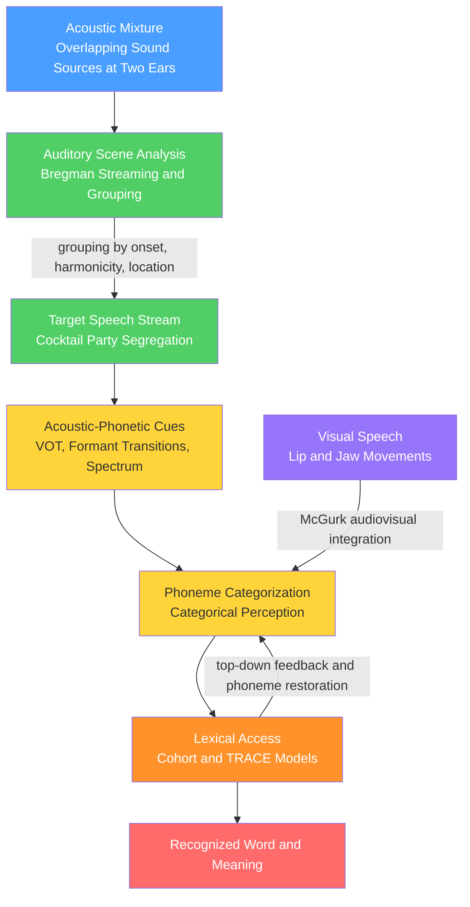

# Auditory and Speech Perception

> [!abstract] TL;DR
> Auditory and speech perception is how the mind converts a single, continuously varying pressure wave arriving at the ears into discrete perceptual objects: separated sound sources, a perceived pitch, and — for speech — a stream of phonemes and words. The hard problem is that the acoustic signal is **an unlabelled mixture with no invariant cues**: sources overlap (the cocktail party problem), a phoneme's acoustics change completely with context (coarticulation and the lack-of-invariance problem), and pitch can be heard even when its defining frequency is physically absent (the missing fundamental). The brain solves this with a mix of bottom-up grouping heuristics (Bregman's auditory scene analysis), strong top-down expectations (phoneme restoration, lexical context), and multimodal integration (the McGurk effect), producing categorical, robust perception that still outperforms machine speech recognition in noise.

---

## Intuition — analogy FIRST

Imagine standing at the edge of a lake into which several people are simultaneously throwing pebbles. All the ripples add together, and by the time the combined wavefront reaches your feet it is a single, complicated up-and-down motion of the water. Your task, using only that one wiggling waterline, is to reconstruct *how many* people were throwing, *where* each stood, and *what rhythm* each was using. That is exactly the problem your two eardrums face: every voice, every footstep, and the hum of the air conditioner have been summed into one pressure wave per ear, and the brain must un-mix them.

Now make it harder. One of those pebble-throwers is spelling out a message in splashes, but they never make the *same* splash twice — the shape of each splash depends on what they threw just before and what they are about to throw next. To read the message you cannot match splashes to a fixed dictionary of shapes; you must use context, expectation, and prior knowledge of the "thrower's" habits. That second layer is **speech perception**: recovering an intended sequence of discrete linguistic symbols from a physically continuous, context-smeared, never-repeating signal.

---

## How It Works

Perception runs as a cascade from an unlabelled acoustic mixture up to a recognised word, but with two twists that make it *not* a simple bottom-up pipeline: **top-down feedback** (context reaches down to reshape what you hear at the phoneme level) and **cross-modal integration** (what you see on the lips changes what you hear).



**Core mechanics, stage by stage:**

1. **Un-mixing (auditory scene analysis).** The cochlea delivers a running spectrum; the brain must decide which spectral energy belongs together. Frequency components that start at the same instant, share a common fundamental (harmonicity), or come from the same spatial location are grouped into one "stream." Everything else becomes background.
2. **Feature extraction.** Within the attended speech stream, the system reads acoustic-phonetic cues: voice onset time, formant frequencies and their transitions, spectral shape of fricatives, and timing.
3. **Categorization.** Continuously varying cues are mapped onto discrete phoneme categories. Perception is sharpened at category boundaries — the hallmark of categorical perception.
4. **Lexical access.** Phoneme evidence activates candidate words in parallel; candidates compete and are pruned as more of the word arrives (Cohort), or interact bidirectionally with the phoneme level (TRACE).
5. **Feedback.** Lexical and sentential context feed *back* down, letting the listener "restore" phonemes masked by noise and resolve ambiguous sounds toward real words.

---

## Key Concepts

### Secondary Level

**Auditory scene analysis (ASA).** Coined by Albert Bregman (1990), ASA is the process of organising the mixed sound arriving at the ears into perceptual **streams**, one per source. The classic laboratory demonstration is the **galloping / streaming** sequence: rapidly alternating high and low tones (A-B-A-B) are heard as one bouncing melody when the pitches are close or the tempo is slow, but split into **two separate streams** (one high, one low) when the pitches are far apart or the tempo is fast. Grouping is driven by simple heuristics: sounds that start together, are close in frequency, or come from the same direction tend to be heard as one thing.

**The cocktail party problem.** At a noisy party you can follow one conversation and ignore the others, then switch when you hear your own name across the room. Colin Cherry (1953) framed this as *the* problem of selective auditory attention: how does the system latch onto one voice in a mixture, and how much of the ignored streams is still processed?

**Pitch and the missing fundamental.** Pitch is a *perceptual* quality, not simply the lowest frequency present. If you play the harmonics 400, 600, and 800 Hz but delete the 200 Hz fundamental, listeners still hear a pitch of **200 Hz** — the **missing fundamental**. This proves pitch is computed from the *pattern* of harmonics (their common spacing), not just read off the energy at the pitch frequency. It is why a voice on a tinny phone speaker, which cannot reproduce low frequencies, still sounds the right pitch.

**Is speech special?** Speech seems to be perceived differently from other sounds. Two striking demonstrations: (1) **categorical perception** — we hear sharp category boundaries rather than smooth acoustic gradients; and (2) the **McGurk effect** (McGurk & MacDonald, 1976) — dub the sound "ba" onto a video of a mouth saying "ga" and most people hear "da," a fusion of the two. You cannot un-see it: the illusion persists even when you know the trick, showing that speech perception is inherently **audiovisual**.

**Voice onset time (VOT).** The single most-studied speech cue. VOT is the delay between a stop consonant's release burst and the start of vocal-fold vibration. Short VOT is heard as voiced (/ba/); long VOT as voiceless (/pa/). Sliding VOT smoothly from 0 to 60 ms does *not* produce a smooth change in perception — instead perception flips abruptly at a boundary near 25-30 ms.

### Undergraduate Level

**Primitive vs schema-based grouping.** Bregman distinguishes bottom-up **primitive grouping** (innate, driven by onset synchrony, harmonicity, spatial and spectral proximity) from **schema-based grouping** (learned, knowledge-driven — e.g., recognising the melody of a familiar song, or your language's phonotactics). Grouping also splits into **simultaneous** (which frequencies present *at the same moment* belong together) and **sequential** (which sounds *across time* form one stream).

**Theories of pitch.** Two mechanisms coexist. **Place coding** reads pitch from *where* on the cochlea (tonotopy) the peak excitation falls — good at high frequencies. **Temporal coding** reads pitch from the *timing* of neural firing phase-locked to the waveform periodicity — essential for the missing fundamental and for pitch below about 4-5 kHz. Modern pattern/autocorrelation models compute pitch from the periodicity common to all resolved harmonics, which is why deleting the fundamental does not delete the pitch.

**The lack-of-invariance problem.** There is no fixed acoustic pattern that corresponds to a given phoneme across all contexts. The /d/ in "di" and the /d/ in "du" have completely different formant transitions, yet both are heard as /d/. Because of **coarticulation** — articulators for neighbouring sounds overlap in time — a phoneme's acoustics are smeared into its neighbours. This one-to-many mapping from phoneme to acoustics (and many-to-one from acoustics to phoneme) is the central puzzle speech perception must solve.

**Motor theory of speech perception.** Alvin Liberman and colleagues at Haskins Laboratories argued that because the acoustics lack invariance, listeners recover the invariant thing that *caused* the sound: the speaker's intended **articulatory gestures**. On this view speech is perceived by a specialised, possibly innate module that references the listener's own motor system. The McGurk effect (visual articulation altering heard phonemes) and categorical perception were taken as key support. The theory is now widely regarded as too strong (see Graduate), but it correctly emphasised that speech perception is tied to production and is multimodal.

**Categorical perception, precisely.** The technical claim has two parts, tested with two tasks on a synthesised continuum (e.g., VOT from /ba/ to /pa/):
- **Identification** is a *sharp step function*: almost all tokens are labelled as one category or the other, with an abrupt boundary.
- **Discrimination** is *predicted by identification*: two tokens are easy to tell apart only if they straddle the category boundary (get different labels), and are nearly indistinguishable if they fall within the same category — even when the physical difference is identical. Discrimination therefore **peaks at the boundary** (Liberman, Harris, Hoffman & Griffith, 1957). Consonants show strong categorical perception; steady-state vowels show much weaker, more continuous perception. Lisker & Abramson (1964) showed different languages place the VOT boundary at different points, and listeners hear their own language's boundary.

**Spoken word recognition — Cohort model.** Marslen-Wilson & Welsh (1978): as a word unfolds over time, its onset activates a **cohort** of all words consistent with the input so far ("ele..." activates *elephant, elegant, eleven, elevator...*). Incoming phonemes prune the cohort; recognition occurs at the **uniqueness point**, where only one candidate survives. The model is strongly incremental and left-to-right, and highlights that we recognise many words *before* they finish.

**Spoken word recognition — TRACE.** McClelland & Elman (1986): an **interactive-activation** network with three layers — features, phonemes, words — connected by excitation within levels' supporters and inhibition among competitors, and crucially **bidirectional (top-down) connections**. Word units feed activation back down to their phonemes, which is TRACE's account of top-down effects. TRACE naturally handles noisy input and lexical influence but has been criticised for its literal time-replicated architecture.

**Top-down effects: phoneme restoration.** Warren (1970) spliced a cough or noise burst over a phoneme in a sentence ("the *_eel* was on the axle"). Listeners not only "heard" the missing phoneme clearly but could not correctly locate the noise — and, tellingly, the *restored* phoneme depended on later context: "*_eel* on the **axle**" → *wheel*; "on the **orange**" → *peel*. Perception fills the gap using the word and sentence. The related **Ganong effect** shows an ambiguous sound midway between /g/ and /k/ is heard as whichever makes a real word ("_ift" heard as *gift*).

**Infant speech perception and perceptual narrowing.** Eimas, Siqueland, Jusczyk & Vigorito (1971) showed that **1-4-month-old infants perceive VOT categorically**, discriminating across the adult /ba/-/pa/ boundary but not within a category — before any language experience. Infants start as "universal listeners" sensitive to the phonetic contrasts of *all* languages. Werker & Tees (1984) then documented **perceptual narrowing**: between roughly 6 and 12 months, infants **lose** the ability to discriminate non-native contrasts (e.g., English-learning infants stop distinguishing Hindi dental vs retroflex stops) while sharpening native ones. Experience commits perception to the mother tongue.

### Graduate Level

**The theory war over speech perception.** Three camps interpret categorical perception and the McGurk effect differently:
- **Motor theory** (Liberman & Mattingly, 1985): a specialised, gesture-referenced, innate speech module.
- **Direct realism** (Fowler, 1986): listeners perceive distal articulatory events directly, but via general ecological perception, no special module.
- **General auditory / learning approach** (Diehl, Lotto & Holt, 2004): categorical perception falls out of the non-linear response of the *general* auditory system plus statistical learning of the input distribution — no gestures, no module. Evidence against speech being uniquely special: categorical perception occurs for non-speech (musical intervals, plucked vs bowed onsets), and non-human animals (chinchillas, quail) show human-like VOT boundaries (Kuhl & Miller, 1978). The modern consensus leans toward general mechanisms tuned by experience, while conceding speech recruits motor and multimodal resources.

**Interactive vs autonomous architectures.** TRACE's top-down phoneme feedback is contested. Norris, McQueen & Cutler's **Merge** and the **Shortlist / Shortlist B** models argue lexical knowledge influences *decisions* without feeding back to *perception* — an **autonomous** (feedforward + decision-stage integration) account that fits the same phoneme-restoration and Ganong data without literal top-down connections. Distinguishing "feedback changes perception" from "context biases the decision" is subtle and remains a live debate; **Bayesian / ideal-observer** framings (see below) partly dissolve it by treating context as a prior combined with the acoustic likelihood.

**Bayesian and adaptive speech perception.** Speech perception can be modelled as **inference**: the listener infers the intended category from the acoustics given a prior over categories and a learned likelihood (the acoustic distribution each category produces). Kleinschmidt & Jaeger's (2015) *ideal adapter* frames **talker normalization** and **perceptual recalibration** — rapidly re-tuning category boundaries to a new talker or accent — as belief updating over generative parameters. This unifies categorical perception (sharp posteriors), the lack-of-invariance problem (talker-dependent likelihoods), and perceptual learning under one computational goal.

**Neural substrates (cognitive neuroscience).** Speech-selective responses cluster in the **superior temporal gyrus/sulcus (STG/STS)**, where high-density electrocorticography reveals neural populations tuned to **phonetic features** (manner, place, voicing) rather than raw spectra (Mesgarani et al., 2014). The **mismatch negativity (MMN)** — an automatic EEG/MEG response to a deviant in a stream of standards — is *larger* for across-category than within-category acoustic changes, giving a pre-attentive neural index of phonological categories and language-specific memory traces. The Hickok-Poeppel **dual-stream** model maps a ventral "what" stream (STG/STS → temporal pole; sound-to-meaning) and a dorsal stream (→ parietal and frontal motor areas; sound-to-articulation) — reconciling motor-theory intuitions with a non-modular architecture.

**Relation to automatic speech recognition (ASR).** The engineering field faces the same lack-of-invariance and segmentation problems and its history mirrors the theory debate. Classic **HMM-GMM** systems modelled context by expanding to *triphones* — a brute-force answer to coarticulation — over MFCC features that mimic the cochlear filterbank. Deep-learning acoustic models and then **end-to-end** systems (CTC, attention, transformers; wav2vec 2.0, Whisper) learn context-dependent representations directly and, like STG neurons, develop phonetic-feature-like units in early layers. Yet **human listeners remain far more robust in noise, with unfamiliar accents, and at the cocktail party** than ASR — a gap attributed to humans' richer scene analysis, top-down linguistic prediction, and audiovisual integration that most ASR ignores. Modern **audiovisual ASR** and neural **source separation** are explicitly attempts to import ASA and McGurk-style multimodality into machines.

---

## Python Demo

Simulate the two signatures of **categorical perception** on a synthetic /ba/-/pa/ continuum that varies along a single acoustic dimension, **voice onset time (VOT)**. We (1) model the sharp sigmoid **identification** boundary and (2) derive the **discrimination** curve from those labels using the classic Haskins independent-labeling prediction for an ABX task — which produces the signature **peak in discrimination right at the category boundary**. numpy and matplotlib only.

```python
import numpy as np
import matplotlib.pyplot as plt

# 1. Build the acoustic continuum: Voice Onset Time (VOT) from /ba/ to /pa/.
#    Short VOT -> voiced /ba/;  long VOT -> voiceless /pa/.
vot_ms = np.arange(0, 55, 5)            # 11 stimuli: 0, 5, ..., 50 ms

# 2. IDENTIFICATION: a sharp logistic boundary near 25 ms.
boundary = 25.0                          # phoneme boundary (ms)
slope    = 0.45                          # steepness -> "categorical" sharpness
p_pa = 1.0 / (1.0 + np.exp(-slope * (vot_ms - boundary)))   # P(respond "/pa/")

# 3. DISCRIMINATION: predict ABX performance from the labels alone.
#    A listener labels A, B and X independently using the identification
#    probabilities, then answers by matching labels. This is the classic
#    Liberman et al. (1957) / Haskins prediction.
def abx_from_labels(p, r):
    """Predicted P(correct) in an ABX task for a stimulus pair whose
    'respond /pa/' probabilities are p and r (independent-labeling model)."""
    def half(pa, pb):                    # X is a token of the stimulus with prob pa
        correct = pa**2 * (1 - pb) + (1 - pa)**2 * pb
        guess   = 0.5 * (pa**2 * pb + pa * (1 - pa) * pb
                         + (1 - pa) * pa * (1 - pb) + (1 - pa)**2 * (1 - pb))
        return correct + guess
    return 0.5 * (half(p, r) + half(r, p))

# One-step (adjacent, 5 ms apart) discrimination, plotted at pair midpoints.
pair_mid = (vot_ms[:-1] + vot_ms[1:]) / 2.0
disc = np.array([abx_from_labels(p_pa[i], p_pa[i + 1])
                 for i in range(len(vot_ms) - 1)])

# 4. Plot both curves on a shared proportion axis.
fig, ax = plt.subplots(figsize=(9, 5.5))
ax.plot(vot_ms, p_pa, 'o-', color='#1f77b4', lw=2,
        label='Identification:  P(respond "/pa/")')
ax.plot(pair_mid, disc, 's--', color='#d62728', lw=2,
        label='Discrimination:  ABX P(correct), adjacent pairs')

ax.axvline(boundary, color='gray', ls=':', lw=1.5)
ax.text(boundary + 0.7, 0.06, 'phoneme\nboundary', color='gray', fontsize=9)
ax.axhline(0.5, color='black', lw=0.8, alpha=0.4)          # chance / 50 percent
ax.text(48, 0.52, 'chance', color='black', fontsize=8, alpha=0.6, ha='right')

ax.set_xlabel('Voice Onset Time (ms)      /ba/ voiced  <---        --->  voiceless /pa/')
ax.set_ylabel('Proportion')
ax.set_ylim(0, 1.05)
ax.set_title('Categorical Perception of a /ba/-/pa/ VOT Continuum\n'
             'Sharp identification boundary  +  discrimination peak at that boundary')
ax.legend(loc='center left')
ax.grid(True, ls='--', alpha=0.3)
plt.tight_layout()
plt.show()

# Expected output:
#   * Identification is a steep S-curve crossing 0.5 at ~25 ms.
#   * Discrimination rises to a PEAK right at the boundary and falls toward
#     chance (0.5) within each phoneme category -- two acoustically equal
#     steps are easy to tell apart across the boundary but not within it.
#     That asymmetry IS categorical perception.
```

---

## Real-World Applications

**Robust ASR and the cocktail party.** Voice assistants and meeting-transcription systems fail where humans succeed: overlapping talkers and background noise. Engineering responses — microphone-array **beamforming**, neural **speech separation** (e.g., Conv-TasNet, permutation-invariant training), and **audiovisual ASR** — are direct attempts to reproduce auditory scene analysis and McGurk-style multimodal integration in machines.

**Cochlear implants.** Implants restore coarse tonotopic (place) information but discard **temporal fine structure**, degrading exactly the periodicity cues that support the missing-fundamental pitch, talker separation, and lexical tone. This is why implant users understand speech well in quiet but struggle at the cocktail party and with Mandarin tone — a clinical consequence of how pitch and streaming actually work.

**Second-language pronunciation training.** Perceptual narrowing explains why adult Japanese learners struggle with English /r/-/l/ and why Spanish speakers hear English VOT contrasts differently. **High-variability phonetic training** (many talkers, many contexts) can partially re-open category boundaries, exploiting the same adaptive mechanisms that ideal-adapter models describe.

**Hearing aids and spatial hearing.** Directional microphones and noise-reduction algorithms are built on ASA cues (onset, spatial location, harmonicity). "Spatial release from masking" — the boost you get when a competing talker is spatially separated — is engineered into modern binaural hearing aids.

**Media, dubbing, and forensics.** The McGurk effect makes poorly dubbed film disconcerting and drives lip-sync standards. Phoneme restoration is why compressed or intermittently dropped audio (VoIP, streaming) is still intelligible. Forensic phonetics uses knowledge of talker normalization and cue variability when evaluating disputed recordings.

**Developmental screening.** Because categorical perception and perceptual narrowing follow a known timetable, infant speech-discrimination measures (e.g., using the mismatch response) are used as early markers for language and reading disorders such as developmental dyslexia, which is associated with less sharp phonological categories.

---

## Common Pitfalls

- **Overstating "speech is special."** Categorical perception and the McGurk effect were long taken as proof of a dedicated, innate speech module. But non-human animals show human-like VOT boundaries, and categorical perception appears for non-speech sounds. Speech recruits motor and multimodal resources without necessarily requiring a unique module — treat "special" as an empirical question, not a premise.
- **Confusing "having categories" with categorical perception.** The strong claim is not merely that we sort sounds into categories; it is the specific **discrimination signature** — near-chance discrimination *within* a category and a peak *at* the boundary. With sensitive tasks and vowels, within-category discrimination is clearly above chance, so perception is more **gradient** than the original all-or-none story. Listeners retain fine acoustic detail (used for talker identity and adaptation).
- **Assuming acoustic invariance.** Beginners look for "the acoustic signature of /d/." There isn't one — coarticulation makes /d/ acoustically different in every vowel context. Any model (or exam answer) that assumes a fixed template per phoneme is solving the wrong problem; the lack-of-invariance problem is the whole point.
- **Equating pitch with energy at the fundamental.** The missing fundamental proves pitch is computed from the harmonic *pattern*, not from energy at the pitch frequency. Do not assume "no energy at 200 Hz" means "no 200 Hz pitch."
- **Treating word recognition as purely bottom-up (or purely top-down).** Phoneme restoration and the Ganong effect show context matters; but whether context *changes perception* (interactive, TRACE) or only *biases decisions* (autonomous, Merge/Shortlist) is unresolved. Asserting either as settled fact is a mistake.
- **Assuming ASR "hears like a human."** MFCCs mimic the cochlear filterbank and deep models learn phonetic-feature units, but human robustness in noise, with accents, and at the cocktail party still far exceeds machines — largely because most ASR omits scene analysis, strong linguistic prediction, and vision.

---

## Related Concepts

**Neuroscience — biological substrate**
- [[Auditory_System_and_Sound_Processing]] — The cochlea, tonotopy, and the ascending pathway that deliver the running spectrum on which all scene analysis and phoneme categorization operate; place vs temporal pitch coding lives here.
- [[Neural_Coding_and_Spike_Trains]] — Phase-locking and temporal (periodicity) coding are the neural basis of the missing-fundamental pitch and of the fine-timing cues cochlear implants discard.

**Linguistics — the units being perceived**
- [[Phonetics]] — Defines VOT, formants, formant transitions, and coarticulation; the acoustic-phonetic cues this note shows the listener must decode.
- [[Phonology]] — Phonemes, contrasts, and natural classes are the discrete categories that categorical perception carves out of the continuous signal.
- [[Prosody_and_Suprasegmentals]] — Pitch, stress, and intonation contours perceived over units larger than the phoneme; lexical tone is exactly the periodicity cue implants struggle with.
- [[Language_Acquisition]] — Infant perceptual narrowing (Werker & Tees) and the shift from universal to native-language listening are core to how speech perception develops.
- [[Universal_Grammar_and_Language_Acquisition]] — The nativist framing of what infants bring to speech perception versus what statistical learning supplies.
- [[Computational_Linguistics]] — Computational models of language processing, including the psycholinguistic word-recognition tradition (Cohort, TRACE).

**Audio and Speech technology — the engineering analog**
- [[Mel_Filterbank_MFCCs]] — Feature front-end explicitly modelled on cochlear frequency resolution; the machine analog of peripheral auditory analysis.
- [[Spectrograms_Features]] — The time-frequency representation in which formants, VOT, and frication are read by both phoneticians and models.
- [[HMM_GMM_ASR]] — Classic ASR whose triphone modelling is a brute-force engineering answer to coarticulation and the lack-of-invariance problem.
- [[ASR_Deep_Learning]] — End-to-end acoustic models that learn context-dependent, phonetic-feature-like units, paralleling STG neural tuning.
- [[Whisper_Architecture]] — A modern large-scale speech recognizer; a concrete benchmark for the human-vs-machine robustness gap in noise and accents.

---

## Review Questions

### Secondary

1. At a loud party you can follow one friend's voice and tune out the others, yet you snap to attention when someone across the room says your name. Name the two phenomena this illustrates (one about separating sound sources, one about attention), and give two acoustic cues the brain uses to decide which sounds belong to your friend's voice.

### Undergraduate

2. A researcher synthesises an 11-step continuum from /ba/ to /pa/ by increasing voice onset time in 5 ms steps and runs both an identification task and an ABX discrimination task. Sketch the expected shape of each curve, mark where the discrimination peak falls relative to the identification boundary, and explain *why* two physically equal 5 ms steps can be easy to discriminate in one part of the continuum and nearly impossible in another. How would the result differ if the continuum were a steady-state vowel instead of a stop consonant?

### Graduate

3. Phoneme restoration (Warren) and the Ganong effect show that lexical context influences what phoneme a listener reports. TRACE explains this with top-down connections that feed word-level activation back to the phoneme level; Merge/Shortlist explain the same data with a purely feedforward system plus a decision stage that integrates lexical knowledge. (a) Describe one behavioural or neural finding that a strict feedforward model must explain, and how it attempts to. (b) Explain how a Bayesian ideal-observer framing of speech perception partially dissolves the "feedback vs decision bias" dichotomy, and what the lack-of-invariance problem and talker normalization contribute to that account.

---

## Sources

- Bregman, A. S. (1990). *Auditory Scene Analysis: The Perceptual Organization of Sound*. MIT Press. — The foundational treatment of streaming, grouping cues, and the cocktail party problem.
- Liberman, A. M., & Mattingly, I. G. (1985). The motor theory of speech perception revised. *Cognition*, 21(1), 1-36. — The mature statement of motor theory and its handling of categorical perception and the McGurk effect.
- McGurk, H., & MacDonald, J. (1976). Hearing lips and seeing voices. *Nature*, 264, 746-748. — The original audiovisual fusion illusion.
- Warren, R. M. (1970). Perceptual restoration of missing speech sounds. *Science*, 167(3917), 392-393. — The phoneme restoration effect and top-down context.
- McClelland, J. L., & Elman, J. L. (1986). The TRACE model of speech perception. *Cognitive Psychology*, 18(1), 1-86. — The interactive-activation model of spoken word recognition.
- Werker, J. F., & Tees, R. C. (1984). Cross-language speech perception: Evidence for perceptual reorganization during the first year of life. *Infant Behavior and Development*, 7(1), 49-63. — Perceptual narrowing in infants.
- Diehl, R. L., Lotto, A. J., & Holt, L. L. (2004). Speech perception. *Annual Review of Psychology*, 55, 149-179. — The general-auditory alternative and a balanced review of the theory debate.

---

#cognitive-science #audition #speech-perception #categorical-perception #psychoacoustics
