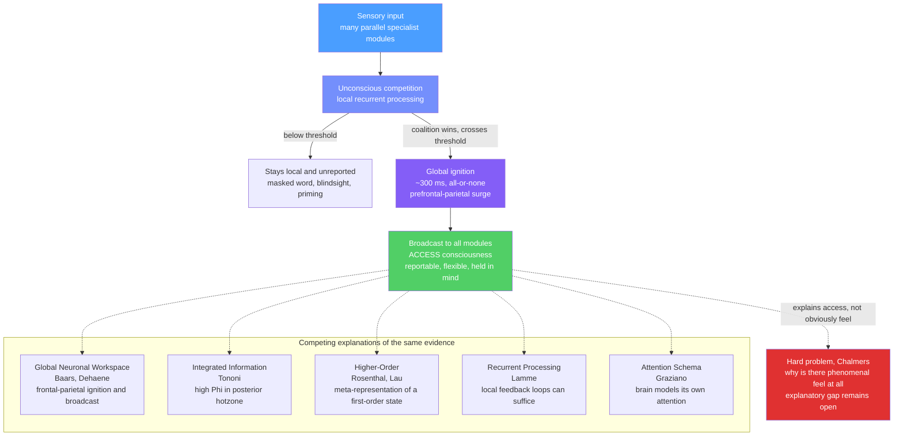

# 🧠 Consciousness and Awareness

> [!abstract] TL;DR
> Consciousness science splits the target into an *access* sense — information that is globally available for report, reasoning, and flexible control — and a *phenomenal* sense — the felt, first-person quality of experience. The access sense is increasingly tractable through the neural correlates of consciousness (NCC) program and computational theories like Global Workspace, Integrated Information, Higher-Order, Recurrent Processing, and Attention Schema; the phenomenal sense is the target of Chalmers' "hard problem," which remains an open question rather than a solved one.

---

## Intuition

**Analogy:** Picture a bustling newsroom. Dozens of reporters (specialist brain modules) work in parallel, each chasing its own story — traffic, weather, sports, a breaking fire. Most of what they gather never leaves their desk. But when one story is judged urgent enough, an editor puts it on the *wire*: it is broadcast simultaneously to every desk, the front page, and every affiliate station. Suddenly the whole organization can act on it, quote it, and build on it. That wire broadcast is a good picture of **access consciousness** — the moment a piece of information becomes globally available to the rest of the system.

Now notice what the newsroom analogy does *not* explain: why reading the wire copy should feel like anything from the inside. You can describe the entire distribution mechanism — who sends what to whom, and when — without touching the question of *felt experience*. That residue is **phenomenal consciousness**, and the gap between "we described the broadcast" and "we explained the feeling" is the whole difficulty of the field.

---

## How It Works

### Two senses of "conscious" (Ned Block)

Ned Block (1995) argued that the everyday word "conscious" conflates two things that come apart:

1. **Access consciousness (A-consciousness):** a representation is A-conscious when it is *poised for global use* — available to reasoning, verbal report, and the rational control of action. This is a *functional*, third-person notion: you can, in principle, measure whether information is broadcast.
2. **Phenomenal consciousness (P-consciousness):** the *what-it-is-like* of an experience — the redness of red, the sting of pain. This is a first-person, qualitative notion.

Most laboratory paradigms operationalize *access*. Whether access and phenomenality can ever fully dissociate (e.g., "phenomenal overflow" — richer experience than we can report) is itself a debated empirical question.

### Easy problems, the hard problem, and the explanatory gap (stated neutrally)

David Chalmers (1995) distinguished the **easy problems** — explaining discrimination, integration, reportability, attentional control, and the difference between wakefulness and sleep — from the **hard problem**: why any of this processing is accompanied by subjective experience at all. The "easy" problems are hard in practice but tractable in principle with standard functional/mechanistic tools. The hard problem is called *hard* because a complete functional story seems logically compatible with the absence of experience (the "philosophical zombie" thought experiment). The **explanatory gap** (Levine 1983) is the neutral observation that no current third-person description *entails* the first-person facts. Positions range from *illusionism* (the gap is a cognitive illusion — Frankish) to *strong non-reductive* views (the gap is principled — Chalmers, Nagel). The scientific program below deliberately brackets this dispute and studies the *correlates and mechanisms of access*.

### The NCC research program

A **neural correlate of consciousness** is the *minimal* set of neural events jointly sufficient for a specific conscious content. "Minimal" is the operative word: the goal is to subtract away everything needed only for stimulus input, motor output, and reporting, isolating the signature of the experience itself. The methodological trick is **contrastive analysis**: hold the physical stimulus constant while the percept changes (or vice versa), and look for what tracks the *percept*.

### Measures and dissociation paradigms

- **Visual masking:** a brief target followed quickly by a mask becomes invisible despite identical early retinal processing — a clean on/off switch for access.
- **Binocular rivalry:** conflicting images to each eye produce alternating percepts under a constant stimulus; NCC candidates track the *report*, not the retina.
- **Attentional blink:** in rapid serial presentation, detecting target 1 makes target 2 invisible for ~200–500 ms — a temporal bottleneck in conscious access.
- **No-report paradigms:** measure neural activity *without* asking for a response (frequency tagging, pupillometry, optokinetic nystagmus), separating correlates of *experiencing* from correlates of *reporting*.
- **The global ignition signature:** near the access threshold, prefrontal-parietal networks show a sudden, non-linear, all-or-none surge (~300 ms), visible as the P3b ERP, a burst of gamma power, and long-range synchrony — a phase-transition-like "ignition."

### Dissociations: blindsight and beyond

**Blindsight** patients with primary visual cortex (V1) damage deny seeing stimuli in their blind field yet perform above chance at guessing location or motion — behavior *without* reported awareness. This, along with priming, subliminal semantic processing, and covert awareness in some clinically "vegetative" patients, shows that a great deal of sophisticated computation runs *without* access consciousness, and that access adds something specific: flexible, cross-domain, reportable availability.

### The theory landscape (presented fairly)



---

## Key Concepts

### Secondary Level

- **Awareness is not one thing.** "Being awake" (arousal, driven by brainstem and thalamus) is different from "being aware *of* something" (content). A dreaming sleeper has content with low arousal; a vegetative patient can have arousal with little demonstrable content.
- **Access vs phenomenal, informally.** Access = "the information got onto the loudspeaker so the rest of my mind can use it." Phenomenal = "there is a felt quality to it." Everyday language blurs the two.
- **You process more than you are aware of.** Subliminal images, primed words, and blindsight show the brain does heavy lifting without conscious access. Consciousness seems reserved for flexible, novel, cross-domain use of information.
- **The hard problem, plainly.** Even a perfect wiring diagram of the brain would not, on its face, tell you *why* seeing red feels like anything. Stating this is not mysticism — it is naming what current explanations do and do not deliver.

### Undergraduate Level

- **Global Workspace Theory (Baars 1988).** A cognitive architecture: many unconscious specialist processors plus a limited-capacity shared "workspace." Content becomes conscious when it wins competition for the workspace and is *broadcast* back to all specialists — enabling report, working memory, and voluntary control.
- **Global Neuronal Workspace (Dehaene, Changeux, Sergent).** The neural implementation: conscious access = late (~300 ms), all-or-none **ignition** of long-range prefrontal-parietal "workspace" neurons with re-entrant feedback to sensory cortex. Signatures: P3b, gamma burst, long-distance synchrony. Below threshold: only local sensory responses.
- **Contrastive method and NCC.** Compare seen vs unseen with matched stimuli (masking, rivalry) to isolate what tracks the percept. V1 tends to track the retinal image; higher visual, parietal, and frontal areas track the report.
- **Attention is separable from consciousness.** Inattentional blindness (missing the "gorilla") shows you can be conscious yet miss an unattended item; some experiments suggest you can be aware of things you are not attending to. They usually co-vary but are mechanistically distinct — a key reason no-report paradigms matter.
- **Recurrent Processing Theory (Lamme 2006).** Feedforward sweeps alone are unconscious; *local recurrent* (feedback) processing in sensory cortex is proposed as sufficient for phenomenal experience, even before frontal broadcast — implying phenomenality can outrun report.

### Graduate Level

- **Integrated Information Theory (Tononi 2004–2016).** Starts from phenomenological axioms (experience is intrinsic, structured, specific, unified, definite) and posits that consciousness *is* integrated information, quantified by **Φ (phi)** — how much a system's cause-effect structure exceeds that of its parts. Predicts a **posterior cortical hotzone** as the substrate and treats prefrontal ignition as related to *access/report*, not experience. Φ is substrate-independent in principle but computationally intractable for large systems (super-exponential partition search), forcing approximations.
- **Higher-Order Theories (Rosenthal; Lau & Rosenthal 2011).** A first-order state (e.g., a V4 color representation) is conscious only when a *higher-order* representation targets it. Modern "perceptual reality monitoring" (Lau 2022) frames prefrontal cortex as deciding which internal signals count as veridical perceptions — explaining why prefrontal lesions can degrade subjective visibility while leaving stimulus-driven behavior intact.
- **Attention Schema Theory (Graziano 2013).** The brain builds a simplified internal *model of its own attention* — an "attention schema" — just as it models the body with a body schema. Subjective awareness, on this view, is the content of that self-model. AST is explicitly designed to be engineerable, making it a favored framework for machine-consciousness discussions.
- **Global ignition as a phase transition.** fMRI/MEG/intracranial data show near-threshold stimuli produce categorical, non-linear network activation (dlPFC, IFG, ACC, IPL/TPJ, insula), while local sensory activity ramps gradually — evidence of bistable, all-or-none access dynamics rather than a smooth gradient.
- **No-report critique and the frontal-vs-posterior dispute.** Removing the report requirement attenuates late frontal signatures (P3, frontal gamma), suggesting some "NCC" markers index *reportability*. This directly pits GNWT (frontal ignition essential) against IIT/RPT (posterior sufficiency). The pre-registered **adversarial collaboration** (Cogitate consortium; Melloni et al.) tested distinguishing predictions and yielded mixed support — neither theory decisively confirmed.
- **Measuring consciousness without behavior — PCI.** The Perturbational Complexity Index (Casali et al. 2013) perturbs cortex with TMS and computes the Lempel-Ziv complexity of the evoked spatiotemporal response. Conscious brains yield complex, widely differentiated responses; unconscious states (deep sleep, anesthesia, coma) yield simple, stereotyped ones — discriminating states with high accuracy and probing covert awareness where behavior fails.
- **Machine consciousness — how the theories answer differently.** IIT: current feedforward-dominant networks (including transformers) have very low Φ due to weak recurrent integration. GNWT/AST: consciousness is functional, so a system with a genuine global broadcast or an attention schema *could* qualify — a substrate-independent, in-principle "yes." These are live, contested questions, not settled results.

---

## Python Demo

```python
import numpy as np
import matplotlib.pyplot as plt

# Toy Global Workspace model (Baars / Dehaene).
# Several specialized modules accumulate evidence and COMPETE via lateral
# inhibition. A winner-take-all coalition IGNITES when one module clears a
# threshold and beats its rivals by a margin; the winning content is then
# BROADCAST to every module -- a computational sketch of ACCESS consciousness.
# This models information access/broadcast only. It makes NO claim about
# phenomenal (felt) consciousness.

rng = np.random.default_rng(7)

N       = 6      # specialist modules: vision, audition, language, motor, ...
T       = 200    # time steps
leak    = 0.10   # leaky-accumulator decay
inhib   = 0.05   # lateral inhibition strength (competition)
noise   = 0.02   # stochastic drift
thresh  = 0.55   # ignition threshold
margin  = 0.10   # winner must beat runner-up by this to form a coalition
gain    = 0.45   # broadcast injection to ALL modules at ignition

# Constant bottom-up drive per module; module index 2 is the strongest.
drive = np.array([0.050, 0.042, 0.090, 0.046, 0.052, 0.038])

act        = np.zeros((N, T))   # activation trace per module
workspace  = np.zeros(T)        # broadcast module (index+1); 0 = none
ignited    = False
ignition_t = None

for t in range(1, T):
    a = act[:, t - 1]
    # Lateral inhibition: each module suppressed by the others' total activity.
    comp  = inhib * (a.sum() - a)
    a_new = a * (1 - leak) + drive - comp + rng.normal(0, noise, N)
    a_new = np.clip(a_new, 0.0, 1.0)

    if not ignited:
        ranked = np.sort(a_new)[::-1]
        winner = int(np.argmax(a_new))
        # Winner-take-all: clear threshold AND dominate the runner-up.
        if a_new[winner] >= thresh and (ranked[0] - ranked[1]) >= margin:
            ignited    = True
            ignition_t = t
            a_new      = np.clip(a_new + gain, 0.0, 1.0)  # broadcast to ALL
            workspace[t] = winner + 1
    else:
        # Sustained broadcast keeps every module elevated (globally available).
        a_new        = np.clip(a_new + 0.5 * gain, 0.0, 1.0)
        workspace[t] = workspace[t - 1]

    act[:, t] = a_new

# ---- Plot ignition / broadcast dynamics ----
fig, (ax1, ax2) = plt.subplots(2, 1, figsize=(11, 6), sharex=True)

colors = plt.cm.tab10(np.linspace(0, 0.9, N))
for i in range(N):
    lbl = f"Module {i + 1}" + (" (strongest drive)" if i == 2 else "")
    ax1.plot(act[i], color=colors[i], lw=1.7, alpha=0.85, label=lbl)

ax1.axhline(thresh, color="red", ls="--", lw=1.4, label="Ignition threshold")
if ignition_t is not None:
    ax1.axvline(ignition_t, color="darkred", ls=":", lw=2.0,
                label=f"Ignition at t = {ignition_t}")
ax1.set_ylabel("Activation (a.u.)")
ax1.set_title("Global Workspace: competition, then all-or-none ignition and broadcast")
ax1.legend(fontsize=7, ncol=4, loc="upper left")
ax1.set_ylim(-0.05, 1.1)

ax2.fill_between(range(T), (workspace > 0).astype(float),
                 step="post", color="steelblue", alpha=0.6,
                 label="Workspace occupied (global broadcast ON)")
ax2.set_ylabel("Broadcast state")
ax2.set_xlabel("Time step")
ax2.set_title("Access is discrete: broadcast is all-or-none, not graded")
ax2.legend(loc="upper left")

plt.tight_layout()
plt.show()

# Reading the plot:
#   * Early on, modules compete; lateral inhibition suppresses the losers
#     while the strongest module pulls ahead (subthreshold, "unconscious").
#   * When the leader clears the threshold and dominates its rivals, ignition
#     fires and the winning content is injected into EVERY module at once.
#   * The lower panel shows the transition is categorical -- the hallmark of
#     access (broadcast), not a smooth ramp. This mirrors the P3/ignition
#     signature, without asserting anything about felt experience.
```

---

## Real-World Applications

- **Anesthesia depth monitoring.** EEG-derived indices (e.g., BIS) and, in research, PCI track the loss and return of conscious access to reduce rare but traumatic intraoperative awareness. Loss of consciousness under propofol correlates with breakdown of long-range cortico-cortical communication, not uniform silencing — a direct prediction of workspace-style theories.
- **Disorders of consciousness.** Bedside behavioral scales misclassify a substantial fraction of patients. TMS-EEG complexity (PCI) and active fMRI paradigms (e.g., "imagine playing tennis") detect *covert* awareness in some clinically unresponsive patients, informing prognosis and ethics.
- **Psychedelic and altered-state neuroscience.** Psilocybin and LSD increase signal diversity and loosen default-mode connectivity — an "entropic brain" signature interpreted through IIT (changed integration) and predictive-processing (relaxed priors) lenses, linking subjective reports to measurable network dynamics.
- **Human-factors and vigilance systems.** The attentional blink and inattentional blindness set hard limits on how much a human operator (pilot, driver, radiologist) can consciously register in rapid succession — directly shaping cockpit alerting, driver-monitoring, and display design.
- **Machine-consciousness and AI safety framing.** GNWT, IIT, and AST supply competing, testable-in-principle criteria for asking whether an artificial system has access-like global broadcast or a self-model of attention — used to argue *against* naive attributions of sentience to current LLMs while keeping the empirical question open.

---

## Common Pitfalls

- **Conflating attention with consciousness.** Report-based paradigms bundle attention, working memory, and motor preparation into the "NCC." No-report designs are essential to tell correlates of *experiencing* from correlates of *reporting*.
- **Treating the hard problem as merely unsolved-but-easy.** Assuming better data will automatically dissolve the explanatory gap prejudges a genuinely open philosophical dispute. State it neutrally: the science targets access and mechanism; phenomenality remains contested.
- **Reading a correlation as a cause.** A region that tracks the percept in rivalry may be *downstream* of the true NCC, merely reflecting broadcast content. Causal tools (TMS, lesions, optogenetics) are needed before claiming a region *produces* consciousness.
- **Over-trusting Φ estimates.** Exact Φ is intractable for real brains; different approximations can disagree sharply for the same system. Empirical claims resting on estimated Φ deserve caution.
- **Assuming complex behavior implies consciousness.** Blindsight, priming, and skilled unconscious processing show sophisticated computation without access. Complexity alone is not evidence of awareness — in brains or machines.
- **Picking a "winning" theory prematurely.** Frontal *and* posterior correlates both exist; showing one does not refute the other. The adversarial-collaboration results remain mixed, so honest exposition presents GWT, IIT, HOT, RPT, and AST as live competitors.

---

## Related Concepts

- [[Consciousness_and_Neural_Correlates]] — the neuroscience-vault companion; deeper on NCC anatomy, PCI, anesthesia, split-brain, and the IIT-vs-GNWT adversarial collaboration
- [[Attention_and_Executive_Function]] — the fronto-parietal attention networks overlap the global workspace; dissociating attention from awareness is central to no-report paradigms
- [[Neural_Oscillations_and_Synchrony]] — gamma bursts and long-range synchrony are proposed physical signatures of the ignition/broadcast event
- [[Visual_System_and_Visual_Cortex]] — V1 damage produces blindsight, and rivalry/masking work along the ventral stream; grounds the dissociation evidence used to define NCCs
- [[Information_Theory]] — entropy and mutual information underpin Integrated Information Theory's Φ and the "complexity" measures (Lempel-Ziv) behind PCI
- [[Attention_Mechanism]] — the machine-learning attention/soft winner-take-all is a useful engineering echo of workspace competition, relevant to the machine-consciousness debate (not an equivalence)

---

## Review Questions

1. **(Secondary)** A friend claims "the brain only processes what we're consciously aware of." Using blindsight and subliminal priming, explain why this is wrong, and describe what access consciousness seems to *add* on top of unconscious processing.
2. **(Undergraduate)** Design a contrastive experiment (using masking or binocular rivalry) to find a neural correlate of a specific conscious percept while holding the physical stimulus constant. Explain why a *no-report* version of your design gives a cleaner estimate of the NCC, and name one signature (e.g., P3b) whose interpretation might change between the report and no-report versions.
3. **(Graduate)** Global Neuronal Workspace and Integrated Information Theory make conflicting predictions about the anatomical locus of consciousness. State the single most diagnostic prediction that separates them, describe the experiment (and control paradigm) you would run, and say precisely what result would force each theory to revise a core claim. Then explain why success on this question would still leave Chalmers' hard problem untouched.

---

## Sources

- Block, N. (1995). "On a confusion about a function of consciousness." *Behavioral and Brain Sciences*, 18(2), 227–247.
- Chalmers, D. J. (1995). "Facing up to the problem of consciousness." *Journal of Consciousness Studies*, 2(3), 200–219.
- Dehaene, S. (2014). *Consciousness and the Brain: Deciphering How the Brain Codes Our Thoughts*. Viking.
- Tononi, G., Boly, M., Massimini, M., & Koch, C. (2016). "Integrated information theory: from consciousness to its physical substrate." *Nature Reviews Neuroscience*, 17(7), 450–461.
- Graziano, M. S. A. (2013). *Consciousness and the Social Brain*. Oxford University Press.
- Cogitate Consortium; Melloni, L., et al. (2023). "An adversarial collaboration to critically evaluate theories of consciousness." (pre-registered report / preprint, bioRxiv).

---

#cognitive-science #consciousness #global-workspace #access-consciousness #ncc
