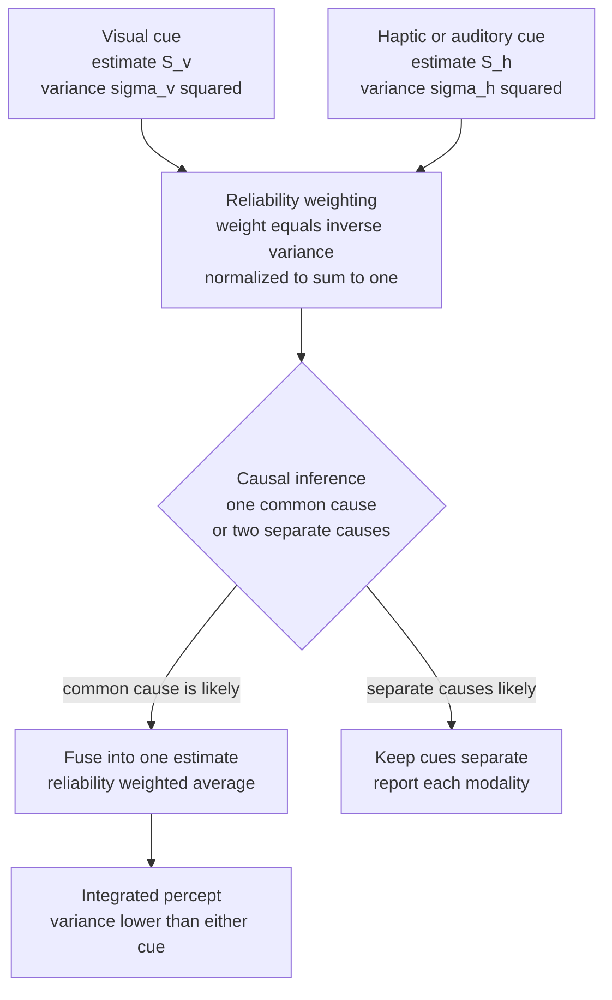

# 🧩 Multisensory Integration

> [!abstract] TL;DR
> Multisensory integration is how the brain fuses information from different senses — vision, touch, hearing, balance — into a single coherent percept. When the cues are treated as coming from one event, the brain combines them by reliability-weighted averaging: each modality contributes in proportion to its inverse variance (its precision), yielding an integrated estimate that is *more* precise than any sense alone. This near-optimal, Bayesian statistics explains a family of striking illusions — the ventriloquist effect, the McGurk effect, the rubber hand illusion, and the sound-induced double flash — as the *correct* answer to a well-posed inference problem, not as errors.

---

## Intuition

**Analogy:** Imagine two witnesses describing where a firework burst in the night sky. One has sharp eyes but was looking through fog; the other has weaker eyes but a clear view. If you had to name a single location, you would not just believe one and ignore the other, and you would not naively split the difference either. You would lean toward whichever witness was more *reliable* under the conditions — trusting the clear-view witness more when the fog was thick. And crucially, pooling two imperfect reports gives you a better estimate than either report alone, because their independent errors partially cancel.

The brain does exactly this with the senses. Your eyes and your fingertips are two "witnesses" reporting the size of an object; your ears and your eyes are two witnesses reporting where a voice came from. The brain weights each witness by how trustworthy it is *right now* and blends them. When one witness is far more reliable, it effectively "captures" the estimate — which is why a ventriloquist's visibly moving dummy makes you hear the voice coming from the puppet's mouth: vision is the more reliable spatial witness, so it wins.

---

## How It Works

### Core mechanics

The core computation is **reliability-weighted averaging**. Suppose two senses each provide a noisy estimate of the same physical property $S$ (say, the size of a bar):

- Vision reports $S_V$ with variance $\sigma_V^2$
- Haptics (touch) reports $S_H$ with variance $\sigma_H^2$

If each estimate is unbiased and corrupted by independent Gaussian noise, the **Maximum Likelihood Estimate (MLE)** of the true property is the weighted average

$$\hat{S} = w_V \, S_V + w_H \, S_H, \qquad w_V = \frac{1/\sigma_V^2}{1/\sigma_V^2 + 1/\sigma_H^2}, \quad w_H = \frac{1/\sigma_H^2}{1/\sigma_V^2 + 1/\sigma_H^2}$$

Each weight is the modality's **precision** (inverse variance) normalized so the weights sum to one. The variance of the fused estimate is

$$\frac{1}{\sigma_{\hat{S}}^2} = \frac{1}{\sigma_V^2} + \frac{1}{\sigma_H^2} \quad\Longrightarrow\quad \sigma_{\hat{S}}^2 = \frac{\sigma_V^2 \, \sigma_H^2}{\sigma_V^2 + \sigma_H^2}$$

Because precisions add, the integrated variance is **strictly smaller than the smaller of the two** individual variances. Two blurry senses combine into a sharper one. Ernst & Banks (2002) showed that human visual-haptic size and height judgments match this equation almost exactly, and — critically — that when they artificially blurred the visual cue, subjects *shifted their weighting toward touch* in the precise amount the equation predicts. This is why multisensory integration is called **statistically optimal** or **Bayes-optimal** cue combination.

Whether integration happens at all is governed by three empirical **integration rules** discovered by Stein & Meredith in single-neuron recordings from the superior colliculus:

1. **Spatial rule** — cues arising from the same location are combined; spatially discordant cues can *suppress* each other.
2. **Temporal rule** — cues within a narrow temporal binding window (roughly 100–200 ms) are combined; outside it they are treated as separate events.
3. **Inverse effectiveness** — the *weaker* each unimodal input is, the *larger* the proportional boost from combining them. Multisensory enhancement is greatest exactly when each sense alone is near-useless — which is when help is most needed.

The deeper question is **when to bind versus segregate**. Forced fusion (always averaging) is wrong when the cues really come from different events. Körding et al. (2007) framed this as **Bayesian causal inference**: the brain first infers whether one common cause or two independent causes produced the signals, then integrates fully, partially, or not at all. This single model reproduces the full range of behavior from complete fusion (small conflicts) to complete segregation (large conflicts), with a graceful transition in between.

### Flow / architecture



---

## Key Concepts

### Secondary

- **What integration buys you** — combining senses reduces uncertainty and resolves ambiguity. A single sense can be fooled or noisy; agreement across senses signals a real, external event.
- **The ventriloquist effect** — a spatial audiovisual illusion. When a voice and a visibly moving mouth are slightly separated in space, the sound is *heard* as coming from the mouth. Vision usually has finer spatial resolution than hearing, so vision "captures" the perceived location.
- **The McGurk effect** — an audiovisual *speech* illusion. Hearing the syllable "ba" while watching lips articulate "ga" makes most people perceive "da" (a fused percept) or "ga". Seeing the mouth changes what you literally hear — proof that speech perception is multisensory, not purely auditory.
- **The rubber hand illusion** — a visuo-tactile-proprioceptive illusion. Watching a fake rubber hand being stroked in synchrony with strokes on your hidden real hand makes you feel the rubber hand as your own and mislocate your real hand toward it. Body ownership itself is a multisensory inference.
- **The sound-induced flash illusion (double flash)** — an auditory-visual illusion where a single flash accompanied by *two* beeps is seen as *two* flashes. Here the more reliable sense for counting brief events is hearing, so audition captures vision — the reverse direction from the ventriloquist effect. Direction of capture depends on which sense is more reliable for that specific judgment.
- **Binding window** — cues must be close enough in time and space to be treated as one event. Perceived simultaneity is the gateway to integration.

### Undergraduate

- **Maximum Likelihood Estimation (MLE) model** — under independent Gaussian noise, optimal cue combination is a precision-weighted average with $\hat{S} = \sum_i w_i S_i$ and $w_i \propto 1/\sigma_i^2$. The hallmark prediction, confirmed by Ernst & Banks (2002), is **reliability reweighting**: degrade one cue and the brain automatically down-weights it by exactly the amount that keeps the estimate optimal.
- **Variance reduction** — the integrated variance $\sigma_{\hat{S}}^2 = (\sigma_V^{-2} + \sigma_H^{-2})^{-1}$ is always smaller than either input variance. This is the single most testable signature of optimal integration and distinguishes true fusion from "just picking the better cue".
- **Inverse effectiveness (Stein & Meredith)** — proportional multisensory enhancement scales inversely with unimodal effectiveness. In MLE terms this falls out naturally: adding a second cue helps most when the first is imprecise, because relative precision gains are largest near the noise floor.
- **Superior colliculus and multisensory neurons** — the deep layers of the superior colliculus (SC) hold spatially aligned maps of visual, auditory, and somatosensory space. Individual multisensory neurons fire *superadditively* to aligned cross-modal stimuli and obey the spatial, temporal, and inverse-effectiveness rules. The SC drives orienting: turning eyes and head toward salient multisensory events. Cortical feedback (from association cortex such as area AES in cats) is required for these neurons to integrate at all.
- **Crossmodal correspondences** — systematic, often pre-linguistic mappings between features of different senses: high pitch maps to "small, bright, high in space, pointy"; the *bouba/kiki* effect maps rounded shapes to sonorant sounds and spiky shapes to plosive sounds. These learned or innate priors bias which cues the brain expects to belong together.
- **Direction of dominance is not fixed** — "vision dominates" is a special case. The modality that wins is the one with higher *task-specific reliability*: vision for spatial location (ventriloquist), audition for temporal rate (double flash), touch/proprioception for some size and force judgments. Modality precision, not a fixed hierarchy, determines the winner.

### Graduate

- **Bayesian causal inference (Körding et al., 2007)** — forced fusion is only optimal when the cues share a cause. The full model places a prior $p(C=1)$ on "common cause" versus $p(C=2)$ "independent causes", computes the posterior over causal structure given the sensory conflict, and produces a final estimate by **model averaging**: $\hat{S} = p(C{=}1\mid \text{data})\,\hat{S}_{\text{fused}} + p(C{=}2\mid \text{data})\,\hat{S}_{\text{segregated}}$. Small conflicts yield near-complete fusion; large conflicts yield near-complete segregation, matching the nonlinear "breakdown of ventriloquism" seen when audiovisual disparity grows large.
- **Priors and the generative model** — the brain's integration behavior encodes a generative model: a prior over the number of sources, a prior over their locations, and modality-specific likelihoods (noise models). Manipulating stimulus statistics (e.g., disparity distributions) shifts the inferred prior, revealing that these priors are learned and adaptable.
- **Where is optimality implemented?** — probabilistic population codes (Ma, Beck, Latham & Pouget, 2006) show that with Poisson-like neural variability, simply *summing* the population activity of two modalities implements exact reliability-weighting, because precision is encoded in the gain (amplitude) of the population response. Optimality can thus emerge from a biologically trivial operation — adding spike counts — no explicit division required.
- **Limits and violations of optimality** — humans are near-optimal for many low-level cues but show sub-optimalities: mis-estimated reliabilities, prior biases, developmental immaturity (children under ~8–10 years do not integrate optimally, using single dominant cues instead), and breakdowns under high conflict. Optimality is a normative benchmark, not a universal law.
- **Temporal recalibration and the binding window** — the audiovisual simultaneity window is plastic. Repeated exposure to a fixed audiovisual lag (as with delayed AV in video calls) shifts perceived simultaneity, showing the binding window is continuously recalibrated by the environment's statistics.
- **Sensory substitution as forced remapping** — devices that route one modality's information through another (a camera feeding a tactile or auditory display) exploit the brain's modality-agnostic capacity to extract structure. With training, the substituting modality can acquire quasi-perceptual, spatial "feel", supporting the view that cortical areas are more computation-defined than modality-defined (the "metamodal brain" hypothesis, Pascual-Leone & Hamilton).

---

## Python Demo

This demo implements the Ernst & Banks (2002) MLE model. Part 1 combines a visual and a haptic estimate of an object's size, weighting each by its inverse variance, and shows the integrated distribution is narrower (more certain) than either single sense. Part 2 uses the *same* model to reproduce the **ventriloquist effect**: with a fixed spatial conflict between a seen and a heard event, the perceived location is pulled toward vision as vision becomes more reliable — vision "captures" the sound.

```python
# MLE model of multisensory integration (Ernst & Banks, 2002)
# numpy + matplotlib only.
import numpy as np
import matplotlib.pyplot as plt


def gaussian(x, mu, sigma):
    """Un-normalized-to-area-1 Gaussian likelihood over stimulus axis x."""
    return np.exp(-0.5 * ((x - mu) / sigma) ** 2) / (sigma * np.sqrt(2 * np.pi))


def mle_combine(mu_v, sig_v, mu_h, sig_h):
    """
    Reliability-weighted (inverse-variance) fusion of two cues.
    Returns fused mean, fused sigma, and the two normalized weights.
    """
    r_v = 1.0 / sig_v**2          # precision = reliability of vision
    r_h = 1.0 / sig_h**2          # precision = reliability of haptics
    w_v = r_v / (r_v + r_h)       # normalized weights sum to 1
    w_h = r_h / (r_v + r_h)
    mu_c = w_v * mu_v + w_h * mu_h
    sig_c = np.sqrt(1.0 / (r_v + r_h))   # fused variance = (sum of precisions)^-1
    return mu_c, sig_c, w_v, w_h


# ---------- Part 1: variance reduction from fusion ----------
# Two senses estimate the size (mm) of the same bar, with different noise.
mu_v, sig_v = 52.0, 3.0    # vision: slight over-estimate, moderate noise
mu_h, sig_h = 48.0, 2.0    # haptics: slight under-estimate, lower noise (more reliable)

mu_c, sig_c, w_v, w_h = mle_combine(mu_v, sig_v, mu_h, sig_h)

print("=== Part 1: Ernst & Banks visual-haptic fusion ===")
print(f"Vision   : mean={mu_v:.1f} mm  sigma={sig_v:.2f}  weight={w_v:.2f}")
print(f"Haptics  : mean={mu_h:.1f} mm  sigma={sig_h:.2f}  weight={w_h:.2f}")
print(f"Fused    : mean={mu_c:.2f} mm  sigma={sig_c:.2f}")
print(f"Fused sigma is smaller than BOTH inputs? "
      f"{sig_c < min(sig_v, sig_h)}  "
      f"({sig_c:.2f} < {min(sig_v, sig_h):.2f})")

x = np.linspace(38, 62, 800)

fig, (ax1, ax2) = plt.subplots(1, 2, figsize=(13, 5))

ax1.plot(x, gaussian(x, mu_v, sig_v), color="tab:blue",   lw=2, label="Vision")
ax1.plot(x, gaussian(x, mu_h, sig_h), color="tab:orange", lw=2, label="Haptics")
ax1.plot(x, gaussian(x, mu_c, sig_c), color="tab:red",    lw=3,
         label="Integrated (MLE)")
ax1.axvline(mu_c, color="tab:red", ls="--", alpha=0.6)
ax1.set_title("Optimal fusion is more certain than either sense\n"
              "(narrower = lower variance = higher precision)")
ax1.set_xlabel("Estimated size (mm)")
ax1.set_ylabel("Probability density")
ax1.legend()
ax1.grid(alpha=0.3)

# ---------- Part 2: the ventriloquist effect ----------
# A visual event at +5 deg and an auditory event at -5 deg (spatial conflict).
# Audition has fixed, poor spatial reliability; vision's reliability varies.
# Perceived location is the reliability-weighted average -> pulled toward vision.
loc_vision, loc_audio = +5.0, -5.0
sig_audio = 8.0                                  # ears: coarse spatial noise (fixed)
sig_vision_range = np.linspace(1.0, 20.0, 200)   # eyes: sharp -> blurry

perceived = []
weight_vision = []
for sv in sig_vision_range:
    mu_p, _, wv, _ = mle_combine(loc_vision, sv, loc_audio, sig_audio)
    perceived.append(mu_p)
    weight_vision.append(wv)
perceived = np.array(perceived)

ax2.plot(sig_vision_range, perceived, color="tab:red", lw=3,
         label="Perceived sound location")
ax2.axhline(loc_vision, color="tab:blue",   ls="--", label="True visual location")
ax2.axhline(loc_audio,  color="tab:orange", ls="--", label="True audio location")
ax2.fill_between(sig_vision_range, loc_audio, perceived, alpha=0.12, color="tab:red")
ax2.set_title("Ventriloquist effect from the SAME model\n"
              "reliable vision (left) captures the perceived sound location")
ax2.set_xlabel("Visual noise sigma (small = more reliable vision)")
ax2.set_ylabel("Perceived location (deg)")
ax2.legend(loc="center right")
ax2.grid(alpha=0.3)

plt.tight_layout()
plt.savefig("multisensory_integration.png", dpi=120, bbox_inches="tight")
plt.show()

# Numeric read-out of the capture effect
print("\n=== Part 2: ventriloquist capture ===")
for sv in [1.0, 4.0, 8.0, 16.0]:
    mu_p, _, wv, _ = mle_combine(loc_vision, sv, loc_audio, sig_audio)
    print(f"vision sigma={sv:5.1f}  ->  visual weight={wv:.2f}  "
          f"perceived sound at {mu_p:+.2f} deg "
          f"(true audio {loc_audio:+.1f})")
```

Expected behavior: in Part 1 the fused sigma is smaller than both inputs (variance reduction is the defining signature of optimal integration), and the fused mean sits closer to the more reliable haptic estimate. In Part 2, when vision is sharp (small sigma) the perceived sound location is dragged almost onto the visual location — the ventriloquist effect — while blurry vision releases the sound back toward its true auditory position. No new equations are needed for the illusion: it is the plain consequence of reliability-weighted averaging.

---

## Real-World Applications

- **Virtual and augmented reality** — presence and immersion depend on keeping visual, auditory, and vestibular/proprioceptive cues within the temporal binding window. Audiovisual lag beyond ~100 ms breaks integration and lip-sync; conflicts between visual motion and the vestibular sense produce **cybersickness**. Spatial audio engines deliberately exploit the ventriloquist effect so that sounds are heard as emanating from the correct on-screen object even when speakers are elsewhere.

- **Upper-limb and cochlear prosthetics** — restoring a sense of body ownership and useful control benefits from congruent multisensory feedback. Providing synchronized tactile/proprioceptive feedback that matches the seen movement of a prosthetic hand (a rubber-hand-illusion-like manipulation) increases embodiment and improves control. Cochlear implant users lean heavily on lip-reading (McGurk-style audiovisual speech fusion) to reach usable speech comprehension in noise.

- **Sensory substitution devices** — systems like the tongue-display BrainPort or the vOICe (camera-to-soundscape) route visual structure through touch or hearing. They work precisely because integration and cortical plasticity let the brain extract spatial meaning from an unusual carrier signal, letting some blind users detect shape, motion, and layout.

- **Human-computer interaction and alarms** — redundant multimodal alerts (a warning that both flashes and beeps) are detected faster and more reliably than either alone, an applied consequence of inverse effectiveness — the multimodal benefit is largest in noisy, degraded, high-workload conditions such as cockpits and operating rooms.

- **Robotics and sensor fusion** — the engineering counterpart of this biology is the Kalman filter and Bayesian sensor fusion, which combine lidar, camera, and IMU by exactly the same inverse-variance weighting the brain approximates.

---

## Common Pitfalls

- **Assuming "vision always dominates"** — dominance is task-specific and follows reliability. Vision wins for spatial location, but audition wins for temporal rate (the double-flash illusion) and touch can win for some size/force tasks. The right statement is: *the most reliable modality for that judgment dominates*.
- **Confusing averaging with picking the best cue** — reliability weighting still uses both cues; that is why the fused variance is lower than the better single cue. If a model merely switched to the more reliable sense, integrated precision could never *exceed* it. The variance-reduction test distinguishes the two.
- **Ignoring the causal-inference step** — forced fusion is only correct when the cues share a cause. Averaging genuinely unrelated signals (a car horn and a distant flash) is a failure mode; real perception first asks "one event or two?" and can fully segregate. Any model that always fuses will mispredict behavior under large conflicts.
- **Treating the binding window as fixed** — the audiovisual simultaneity window is plastic and recalibrates to environmental lags; assuming a hard, universal threshold mispredicts adaptation effects.
- **Adding cues that are correlated as if independent** — the inverse-variance formula assumes independent noise. If two "cues" share a common noise source, naive summation of precisions overstates certainty (overconfidence). Correlated cues must be down-weighted.
- **Expecting adult-level optimality in children** — optimal integration matures late (roughly age 8–12 for many visual-haptic tasks). Younger children often rely on a single dominant sense, so developmental data should not be scored against the adult MLE benchmark.

---

## Related Concepts

- [[Theories_of_Perception]] — shares the Bayesian/MLE framework as the general theory of perception-as-inference; this note applies that framework specifically to fusing *across* senses, whereas the perception note covers within-modality inference and the direct-vs-constructivist debate. (Sibling note in this section.)
- [[Bayesian_Reasoning]] — the formal machinery of priors, likelihoods, and posteriors that grounds optimal cue combination and Körding's causal-inference model; reliability weighting is Bayes' rule for two Gaussian likelihoods.
- [[Sensory_Systems_and_Transduction]] — the upstream story: how each modality transduces stimuli into neural signals, and it already introduces the superior colliculus, inverse effectiveness, and the spatial/temporal integration rules used here.
- [[Sensorimotor_Integration_and_Feedback]] — how fused multisensory estimates feed movement control and state estimation; the same inverse-variance logic drives sensorimotor Kalman-filter-style integration of vision and proprioception.

---

## Review Questions

**Secondary**
1. Watching a ventriloquist, you hear the voice coming from the dummy's mouth even though it comes from the performer. Which sense is "winning" for *where* the sound is, and why does that make sense given how good your eyes versus ears are at pinpointing locations?
2. The McGurk effect and the rubber hand illusion involve different senses. In one sentence each, describe what cues are put in conflict and what surprising percept results.

**Undergraduate**
3. Vision estimates a bar's height with sigma = 4 mm and touch with sigma = 3 mm. Compute the two reliability weights, the fused estimate's variance, and confirm it is smaller than either input variance. What single manipulation would shift the weighting toward vision, and why?
4. Explain the principle of inverse effectiveness both behaviorally (superior colliculus neurons) and in terms of the MLE equation. Why does combining two *weak* cues give a larger proportional benefit than combining two strong ones?

**Graduate**
5. Forced-fusion MLE predicts that perceived location is always a weighted average of the cues, yet at large audiovisual disparities the ventriloquist effect breaks down and observers report two separate events. Describe how Körding et al.'s Bayesian causal-inference model resolves this, and what role the prior over "common cause" plays in the transition from fusion to segregation.
6. Ma et al. (2006) argued that probabilistic population codes can implement optimal cue combination by simply summing neural activity. Explain how reliability comes to be encoded in the population response and why summation then implements inverse-variance weighting without any explicit division operation.

---

## Sources

- Ernst, M. O., & Banks, M. S. (2002). "Humans integrate visual and haptic information in a statistically optimal fashion." *Nature*, 415, 429–433. https://www.nature.com/articles/415429a
- Körding, K. P., Beierholm, U., Ma, W. J., Quartz, S., Tenenbaum, J. B., & Shams, L. (2007). "Causal inference in multisensory perception." *PLoS ONE*, 2(9), e943. https://doi.org/10.1371/journal.pone.0000943
- Stein, B. E., & Meredith, M. A. (1993). *The Merging of the Senses*. MIT Press. https://mitpress.mit.edu/9780262193313/the-merging-of-the-senses/
- Ma, W. J., Beck, J. M., Latham, P. E., & Pouget, A. (2006). "Bayesian inference with probabilistic population codes." *Nature Neuroscience*, 9, 1432–1438. https://www.nature.com/articles/nn1790
- Shams, L., Kamitani, Y., & Shimojo, S. (2000). "What you see is what you hear" (the sound-induced flash illusion). *Nature*, 408, 788. https://www.nature.com/articles/35048669

---

#cognitive-science #multisensory #cue-integration #crossmodal #perception
