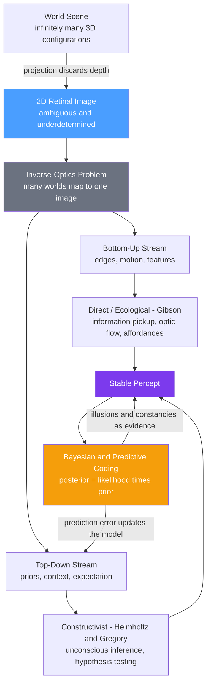

# 👁️ Theories of Perception

> [!abstract] TL;DR
> The retinal image is fundamentally ambiguous — infinitely many 3D world states project to the same 2D pattern of light (the **inverse-optics** or **poverty-of-the-stimulus** problem). Theories of perception are competing answers to how the brain nonetheless recovers a single, stable, useful percept. They split into two great traditions — **direct/ecological** perception (Gibson: the world is rich enough that perception just *picks up* information) and **constructivist** perception (Helmholtz/Gregory: perception is *unconscious inference*, a best guess about hidden causes). Modern **predictive coding** and **Bayesian perception** unify them: the percept is the posterior that best explains sensory data given prior knowledge, and both bottom-up evidence and top-down priors contribute.

---

## Intuition

**Analogy:** Imagine you are handed the *shadow* of an object cast on a wall and asked what cast it. A single elliptical shadow could come from a tilted coin, a rugby ball, an egg, or a stretched disc — the shadow alone cannot tell you. To decide, you must combine the shadow (the evidence) with everything you already know: what objects are common, how light usually falls, what you were just holding. Your guess feels instant and certain, but it is a guess.

Your eye faces exactly this predicament every waking moment. The retina receives only a flat, ambiguous "shadow" of a 3D world, stripped of depth. Perception is the brain's astonishingly fast, mostly-correct machinery for reconstructing the most probable scene that could have produced that shadow. The entire field of perception theory is a debate about *how* that reconstruction works — and whether it is even a reconstruction at all.

---

## How It Works

### The fundamental problem: inverse optics

Forward optics is easy: given a scene, physics tells you exactly what image forms on the retina. Perception must run this **backward** — from image to scene — and the backward map is *one-to-many*. Depth is collapsed by projection, illumination and reflectance are confounded (a dark surface in bright light and a light surface in shadow can produce identical luminance), and occlusion hides parts of objects. The problem is formally **ill-posed**: the data underdetermine the answer. Every theory of perception is, at bottom, a proposal for the *extra constraints* the brain uses to make an ill-posed problem well-posed.

### Two directions of processing

- **Bottom-up (data-driven):** processing flows from raw sensory features upward — edges, contrasts, motion — building toward objects. Pure bottom-up would suffice only if the stimulus were unambiguous.
- **Top-down (theory-driven):** prior knowledge, context, expectation, and goals flow downward to disambiguate and complete the incoming data. This is why the same shape reads as "H" in T-H-E and "A" in C-A-T.

Real perception interleaves both. The theories below differ mainly in *how much* top-down inference they think is necessary.

### The direct / ecological approach (Gibson)

James J. Gibson argued the "poverty of the stimulus" is an artifact of the laboratory. In the real, textured, moving world the **ambient optic array** is *rich*, not impoverished. As an animal moves, **optic flow** (the streaming expansion of the visual field) directly specifies heading, time-to-contact, and surface layout. Perception is **information pickup**, not inference: the invariants are already *in* the light, and the tuned perceptual system resonates to them. Gibson's signature idea is the **affordance** — organisms perceive what the environment *offers for action* (a surface affords walking, a handle affords grasping) directly, without an intermediate mental model.

### The constructivist approach (Helmholtz, Gregory)

Hermann von Helmholtz proposed perception as **unconscious inference**: the brain unconsciously infers the most likely external cause of the sensations, using learned assumptions (e.g., "light comes from above"). Richard Gregory sharpened this into **perception as hypothesis testing** — the percept is the brain's best current *hypothesis* about the scene, and illusions are what happen when a normally-reliable hypothesis is misapplied. Here the stimulus really *is* impoverished, and top-down knowledge does the heavy lifting.

### Gestalt principles of organization

Before either camp, the Gestaltists (Wertheimer, Köhler, Koffka) catalogued the built-in *grouping laws* the brain uses to carve raw input into wholes: **proximity** (near elements group), **similarity** (alike elements group), **closure** (fill in gaps to complete a shape), **common fate** (elements moving together group), continuity, and figure-ground. In modern terms these are strong *priors* about how the world is structured.

### Recognition: template, prototype, feature theories

Once organized, patterns must be recognized:

- **Template matching** — compare input to stored exact templates. Simple but brittle to changes in size, rotation, and noise.
- **Feature theories** — decompose input into elementary features (Selfridge's *Pandemonium*; Treisman's Feature Integration Theory), recombined to identify objects. Explains visual-search asymmetries.
- **Prototype theories** — compare against an averaged, idealized *prototype* rather than exact templates, tolerating natural variability.

### Marr's computational vision

David Marr insisted vision be understood at three **levels of analysis**: the **computational** (what problem is solved and why), the **algorithmic/representational** (what representations and processes), and the **implementational** (how neurons realize it). He proposed a bottom-up pipeline of representations: **primal sketch → 2.5-D sketch (viewer-centered surfaces) → 3-D model (object-centered)**. Marr operationalized "inverse optics is ill-posed" and forced the field to state its assumptions explicitly.

### Predictive coding & Bayesian perception (the synthesis)

The **Bayesian brain** hypothesis treats the percept as a **posterior**: `P(scene | image) ∝ P(image | scene) · P(scene)`. Sensory evidence is the **likelihood**; learned regularities (light-from-above, objects-are-convex, Gestalt grouping) are the **prior**. **Predictive coding** implements this hierarchically: higher cortical areas continuously *predict* the activity of lower areas; only the **prediction error** (the unexplained residual) propagates upward to update the model. This reconciles the two traditions — bottom-up error signals *and* top-down priors both shape the final percept — and reframes **illusions as priors overpowering weak or atypical evidence**, and **constancies as the brain discounting nuisance variables** (illumination, viewing angle) to recover the stable cause.



---

## Key Concepts

### Secondary (school-level intuition)

- **Sensation vs perception:** sensation is detecting energy; perception is *interpreting* it into a meaningful scene.
- **The image is ambiguous:** a 2D picture can stand for many different 3D scenes — the brain must pick one.
- **Two directions:** bottom-up builds from the raw image; top-down uses what you already expect.
- **Illusions are clues:** the Müller-Lyer and Ames-room illusions show the brain is *guessing*, not photographing.
- **Gestalt grouping:** proximity, similarity, closure, and common fate describe how we spontaneously see wholes.

### Undergraduate (cognitive-psychology depth)

- **Inverse-optics / poverty-of-the-stimulus problem:** perception is an ill-posed inverse problem requiring extra constraints.
- **Gibson's ecological theory:** optic flow, invariants, affordances, direct information pickup — perception without inference.
- **Helmholtz/Gregory constructivism:** unconscious inference and perception-as-hypothesis; misapplied hypotheses yield illusions.
- **Perceptual constancies:** size, shape, color, and lightness constancy as the visual system discounting viewing conditions.
- **Recognition models:** template vs feature (Pandemonium, Feature Integration Theory) vs prototype accounts.
- **Marr's three levels** and the primal → 2.5-D → 3-D representational pipeline.

### Graduate (computational / systems view)

- **Bayesian ideal-observer models:** perception as posterior inference; priors formalize environmental statistics (e.g., slow-and-smooth motion prior explaining the aperture-problem percept).
- **Predictive coding / free-energy:** hierarchical generative models minimizing prediction error (variational free energy); precision-weighting of prediction errors as a mechanism of attention.
- **Cue combination as MAP/MLE:** optimal integration of independent cues weights each by its reliability (precision) — see the demo below.
- **Analysis-by-synthesis:** perception evaluates hypotheses by running a forward (generative) model and comparing predicted to actual input.
- **Debates:** direct vs indirect perception, the role of the dorsal ("action / where") vs ventral ("recognition / what") streams, and whether cognition penetrates perception.

---

## Python Demo

A Bayesian **cue-integration** model. Two noisy sensors — vision and touch (haptics) — each estimate the size of an object. Under Gaussian assumptions, the optimal fused estimate is the **precision-weighted** average of the cues, and its variance is *lower than either cue alone*. This is exactly how the brain fuses vision and touch (Ernst & Banks, 2002).

```python
# Bayesian (precision-weighted) integration of two noisy sensory cues.
# Vision and haptics each estimate object SIZE; we fuse them optimally
# and show the fused posterior is sharper than either cue by itself.
import numpy as np
import matplotlib.pyplot as plt

true_size = 10.0  # cm, the actual object size (unknown to the observer)

# Each cue is a Gaussian likelihood N(mean, sigma^2).
mu_v, sigma_v = 9.0, 1.0    # visual estimate: reliable in good light -> small sigma
mu_h, sigma_h = 11.5, 2.0   # haptic estimate: noisier -> larger sigma

# Reliability = precision = 1 / variance.
prec_v = 1.0 / sigma_v**2
prec_h = 1.0 / sigma_h**2

# Optimal fusion: fused mean is the precision-weighted average of the cues,
# and fused precision is the SUM of precisions (so fused variance is smaller).
mu_fused = (prec_v * mu_v + prec_h * mu_h) / (prec_v + prec_h)
prec_fused = prec_v + prec_h
sigma_fused = np.sqrt(1.0 / prec_fused)

print(f"Visual cue : mu = {mu_v:5.2f} cm, sigma = {sigma_v:.2f}, var = {sigma_v**2:.3f}")
print(f"Haptic cue : mu = {mu_h:5.2f} cm, sigma = {sigma_h:.2f}, var = {sigma_h**2:.3f}")
print(f"Fused      : mu = {mu_fused:5.2f} cm, sigma = {sigma_fused:.2f}, var = {sigma_fused**2:.3f}")
print(f"Fused variance {sigma_fused**2:.3f} < visual {sigma_v**2:.3f} and haptic {sigma_h**2:.3f}")

def gaussian(x, mu, sigma):
    return np.exp(-0.5 * ((x - mu) / sigma)**2) / (sigma * np.sqrt(2.0 * np.pi))

x = np.linspace(4, 16, 600)
plt.figure(figsize=(9, 5))
plt.plot(x, gaussian(x, mu_v, sigma_v), color="#4a9eff", lw=2,
         label=f"Visual cue  (sigma={sigma_v})")
plt.plot(x, gaussian(x, mu_h, sigma_h), color="#f59e0b", lw=2,
         label=f"Haptic cue  (sigma={sigma_h})")
plt.plot(x, gaussian(x, mu_fused, sigma_fused), color="#7c3aed", lw=3,
         label=f"Fused posterior  (sigma={sigma_fused:.2f})")
plt.axvline(true_size, color="gray", ls="--", lw=1.5, label="True size")
plt.axvline(mu_fused, color="#7c3aed", ls=":", lw=1.5)
plt.title("Bayesian cue integration: the fused percept is sharper than either sense")
plt.xlabel("Estimated size (cm)")
plt.ylabel("Probability density")
plt.legend()
plt.tight_layout()
plt.savefig("cue_integration.png", dpi=120)
plt.show()
```

**What to notice:** the purple posterior is *taller and narrower* than both input curves — combining two imperfect senses yields a more certain percept than either alone. Its peak sits *closer to the more reliable (visual) cue*, because precision weighting trusts the low-variance sensor more. This is the mathematical heart of the Bayesian theory of perception, and it makes a testable quantitative prediction that human observers actually match.

---

## Real-World Applications

- **Computer vision & robotics:** the inverse-optics framing drives structure-from-motion, depth-from-stereo, and shape-from-shading; modern **sensor fusion** (camera + LiDAR + IMU on self-driving cars) is literally precision-weighted cue integration.
- **Virtual & augmented reality:** designers exploit monocular depth cues, optic flow, and constancy to make flat displays read as 3D; **cue conflicts** (e.g., vergence-accommodation mismatch) cause simulator sickness.
- **UX and visual design:** Gestalt grouping laws govern layout, iconography, and information hierarchy so that interfaces are parsed the way designers intend.
- **Medical imaging & radiology:** expert perception is trained top-down; systems present images to exploit feature salience and reduce inattentional misses.
- **Clinical insight:** aberrant precision on priors is a leading computational account of **hallucinations in schizophrenia** (over-weighted priors) and some autistic perceptual differences (under-weighted priors), directly from the predictive-coding model.

---

## Common Pitfalls

- **Treating perception as a passive recording.** The retina does not "send a picture" to a screen in the head; perception is active inference. The homunculus who "watches" the image never exists.
- **Assuming bottom-up and top-down are rival theories.** They are complementary streams, not competitors — predictive coding needs both. Ambiguity is resolved by their interaction, not by one winning.
- **Reading Gibson as anti-brain.** Direct perception denies *inference*, not *neural processing*. The dispute is about whether representations/hypotheses are needed, not whether neurons fire.
- **Confusing constancies with "errors."** Size and lightness constancy are the system working *correctly* by discounting nuisance variables; the same machinery produces illusions only when its priors are violated.
- **Believing illusions prove the senses are unreliable.** Illusions reveal the brain's normally-adaptive priors; they are features of an optimal-under-uncertainty system, not bugs.
- **Equating "prior" with "conscious belief."** Perceptual priors are largely implicit statistical regularities baked in by evolution and learning, not propositions you can introspect or override (the Müller-Lyer illusion persists even when you *know* the lines are equal).

---

## Related Concepts

- [[Sensation_and_Perception]] — the psychology-level companion covering transduction, thresholds, and signal detection that feeds these theories.
- [[Bayesian_Reasoning]] — the formal `posterior ∝ likelihood · prior` machinery that underlies Bayesian/predictive-coding perception and the cue-integration demo.
- [[Visual_System_and_Visual_Cortex]] — the neural hardware (retina → LGN → V1 → ventral/dorsal streams) that implements the hierarchical predictions.
- [[Sensory_Systems_and_Transduction]] — how physical energy becomes the neural evidence that perception must invert.
- [[Attention_and_Cognitive_Load]] — attention as precision-weighting of prediction errors; selects which sensory channels dominate the percept.
- [[Abductive_Reasoning_and_Inference_to_Best_Explanation]] — perception-as-hypothesis-testing is inference to the best explanation running below conscious awareness.
- [[Optical_Flow_Tracking]] — the computer-vision realization of Gibson's optic flow, estimating motion fields for heading and time-to-contact.
- [[Cognitive_Biases]] — many biases are top-down priors misapplied in judgment, mirroring how priors produce perceptual illusions.

---

## Review Questions

1. **(Conceptual)** Why is perception described as an "ill-posed inverse problem," and what role does a *prior* play in making it solvable? Give a concrete example of a prior the visual system uses.
2. **(Compare)** Gibson claims perception is direct information pickup requiring no inference, while Gregory claims perception is hypothesis testing. Design a single experiment whose result would favor one view over the other, and state what each theory predicts.
3. **(Applied / quantitative)** Two cues estimate a quantity with standard deviations 1.0 and 3.0. Using precision-weighting, what fraction of the fused estimate is contributed by the more reliable cue, and roughly how much smaller is the fused standard deviation than the better single cue? What does this predict about a person whose vision is degraded in fog?

---

## Sources

- Marr, D. (1982). *Vision: A Computational Investigation into the Human Representation and Processing of Visual Information*. W. H. Freeman.
- Gibson, J. J. (1979). *The Ecological Approach to Visual Perception*. Houghton Mifflin.
- Gregory, R. L. (1997). "Knowledge in perception and illusion." *Philosophical Transactions of the Royal Society B*, 352(1358), 1121–1127.
- Ernst, M. O., & Banks, M. S. (2002). "Humans integrate visual and haptic information in a statistically optimal fashion." *Nature*, 415, 429–433.
- Rao, R. P. N., & Ballard, D. H. (1999). "Predictive coding in the visual cortex." *Nature Neuroscience*, 2(1), 79–87.
- Knill, D. C., & Richards, W. (Eds.) (1996). *Perception as Bayesian Inference*. Cambridge University Press.

---

#cognitive-science #perception #bayesian-perception #bottom-up #top-down
