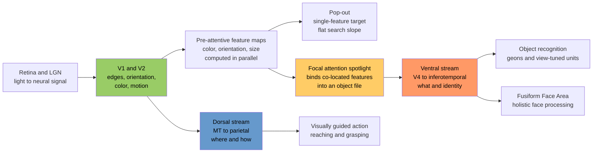

# 👁️ Visual Cognition

> [!abstract] TL;DR
> Visual cognition is the set of mental representations and processes that turn a flat, ambiguous retinal image into a structured world of recognizable objects, faces, and scenes you can act on. Its central themes are the two cortical streams (a ventral "what" pathway for identity and a dorsal "where/how" pathway for action), the **binding problem** of how separately-coded features get glued into unified objects, and the role of **focal attention** in solving it — formalized by Treisman's Feature Integration Theory and its signature visual-search slopes.

---

## Intuition

**Analogy: an airport baggage system.** Thousands of suitcases stream past scanners that instantly register raw attributes everywhere at once — "red patch here," "hardshell there," "barcode over there." That parallel registration is cheap and effortless. But to actually route *one specific bag* to its owner, a worker must focus on a single suitcase, read all of its tags *together*, and bind them into a single object: "this red hardshell with tag 4471 belongs to Jane, gate 12." Registering features in parallel is one thing; **binding** the right features to the right object is another, and it needs a spotlight that visits one item at a time.

Your visual system works the same way. Color, orientation, motion, and size are each computed across the *entire* visual field simultaneously in separate "feature maps." But knowing *which* redness goes with *which* vertical edge to form the red pencil (rather than the green pencil next to it) requires **attention** to visit that location and fuse its features. When attention is elsewhere, the world can change dramatically and you will not notice — the hard truth behind change blindness and the famous invisible gorilla.

---

## How It Works

### Vision is inference, not transcription

The retinal image is 2D, noisy, and massively ambiguous: infinitely many 3D scenes could have produced it (the *inverse optics* problem). Visual cognition is therefore best understood as **inference** — the brain reconstructs the most probable causes (objects, surfaces, lighting) behind the image, using priors learned from a lifetime of natural scene statistics. This is why illusions exist: they are cases where the priors mispredict.

### Two processing stages: parallel then serial

1. **Pre-attentive stage (parallel, fast, whole-field).** From V1 onward, primitive features — color, orientation, motion, size, contrast — are extracted *everywhere at once* into separate topographic feature maps. This stage produces "pop-out": a single red item among green ones announces itself instantly regardless of how many green items surround it.
2. **Attentive stage (serial, capacity-limited).** To combine features from different maps into a bound object representation ("this location has red AND vertical"), a **spotlight of focal attention** must select one location. Binding is the job attention does. Without it, features can migrate — producing **illusory conjunctions** (Treisman & Schmidt, 1982), where a briefly-flashed red X and green O are misreported as a green X and red O.

### The two cortical streams

After V1/V2 the pathway forks into two anatomically and functionally distinct streams (Ungerleider & Mishkin, 1982; reframed by Goodale & Milner, 1992):

- **Ventral stream ("what")** — V1 → V2 → V4 → inferotemporal cortex. Builds *perceptual identity*: what the object is, tolerant of changes in size, position, and viewpoint. Damage causes **visual agnosias** and **prosopagnosia**.
- **Dorsal stream ("where/how")** — V1 → V2 → MT/V5 → posterior parietal cortex. Computes spatial location and the fast, viewer-centered coordinates needed to *act* on objects (reaching, grasping). Patient **D.F.** (ventral damage) could not report a slot's orientation yet posted a card through it accurately; **optic ataxia** patients (dorsal damage) show the reverse — they recognize objects but misreach for them.

### Object recognition and the binding problem

Recognizing an object requires matching an image against stored structural knowledge. Two big debates:

- **Viewpoint-invariant vs viewpoint-dependent.** Biederman's **Recognition-by-Components (RBC)** theory proposes objects are decomposed into ~36 volumetric primitives called **geons** (cylinders, cones, wedges) plus their spatial relations, giving recognition that is largely invariant to rotation and lighting. Competing evidence shows recognition is often **viewpoint-dependent** (slower and less accurate for unfamiliar views), favoring stored 2D view-tuned templates that are interpolated between. The modern consensus: partial invariance built from view-tuned units.
- **The binding problem.** Because "red," "vertical," and "moving-left" are coded in *different* neural populations, how does the brain represent that they belong to the *same* object and not the neighboring one? Focal attention (FIT) is one proposed solution; temporal synchrony of firing (gamma-band, von der Malsburg / Singer) is another, more controversial one.

### Feature Integration Theory and visual search

Treisman & Gelade's (1980) FIT is diagnosed through **visual search** — find a target among distractors while set size varies:

- **Feature search (pop-out):** target differs by a *single* feature (red among green). Detected pre-attentively in parallel. Reaction time is nearly **flat** as set size grows (slope near 0 ms/item).
- **Conjunction search:** target is defined by a *combination* (red-vertical among red-horizontal and green-vertical). No single feature isolates it, so attention must scan items serially. Reaction time rises **steeply and linearly** with set size (~20-30 ms/item on target-present trials, roughly double on target-absent trials — the signature of a self-terminating serial scan).

Wolfe's **Guided Search** later refined this: pre-attentive feature maps *guide* attention toward promising locations, so real search lives on a continuum rather than a strict parallel/serial dichotomy.



---

## Key Concepts

### Secondary Level

- **Two visual streams.** Ventral = *what* (recognizing your friend); dorsal = *where/how* (grabbing your coffee cup without staring at it). One stream can fail while the other works.
- **Pop-out vs effortful search.** A red dot among green dots "jumps out" no matter how many greens there are. Finding a red *vertical* dot among red horizontals and green verticals feels like a slow item-by-item hunt. This everyday difference is the empirical heart of FIT.
- **Faces are special.** We process faces **holistically** (as a whole gestalt), which is why an upside-down face is disproportionately hard to recognize (the **inversion effect**). Damage to the fusiform gyrus can cause **prosopagnosia** — failing to recognize even close family by face while still recognizing them by voice.
- **Change blindness and inattentional blindness.** We feel like we see a rich, complete scene, but we retain surprisingly little without attention. In Simons & Chabris (1999), roughly half of viewers counting basketball passes completely miss a person in a **gorilla** suit walking through the scene.

### Undergraduate Level

- **The binding problem, precisely.** Distributed feature codes create an addressing problem: how does the system tag "this red" and "this vertical" as the *same* token? FIT's answer: a spatial attention window selects one location, and only features inside it get written into a common **object file**. Evidence: under attentional overload, subjects report **illusory conjunctions** (mis-bound feature combinations that were never actually present).
- **Recognition-by-Components (geons).** Biederman (1987): edges → nonaccidental properties (co-termination, parallelism) → geons → object. Predicts recognition survives occlusion and rotation *as long as the geon structure is recoverable*, and fails when contour deletion hits geon vertices. Contrast with **view-based / template** models (Tarr & Bülthoff) supported by viewpoint-dependent reaction-time costs.
- **Guided Search (Wolfe).** Bottom-up feature saliency plus top-down feature templates generate an **activation map** that ranks locations; attention samples them in priority order. Explains why some conjunction searches are efficient and dissolves the strict serial/parallel binary of classic FIT.
- **Scene gist.** Observers extract the "gist" of a scene ("a beach," "a kitchen") in ~100 ms from a single glance, largely **without focal attention**, using global statistical properties (Oliva & Torralba's *spatial envelope*: openness, roughness, naturalness). Gist then guides where attention should go for detailed object recognition.
- **Holistic face processing.** Beyond inversion, the **composite face effect** (top half of one face + bottom half of another fuse into a perceived new identity) and **part-whole effect** show faces are encoded as integrated wholes rather than independent features.

### Graduate Level

- **Perception-vs-action reinterpretation.** Goodale & Milner reframed Ungerleider & Mishkin's *what/where* as *what/how*: the dorsal stream is not about spatial *awareness* but about the real-time visuomotor transformation into effector-centered coordinates. Caveat: the streams are heavily interconnected after V2; the dissociation is a gradient, not a wall (patient D.F. remains the strongest single case).
- **Mental imagery: the imagery debate.** Does "seeing with the mind's eye" use **depictive/analog** representations that literally reinstate spatial structure in visual cortex (**Kosslyn**) or **propositional** descriptions plus tacit knowledge that only *simulate* picture-like behavior (**Pylyshyn**)? Evidence for Kosslyn: mental rotation reaction time scales linearly with angular disparity (Shepard & Metzler); image scanning takes longer for greater imagined distances; **V1 retinotopic activation** during imagery (fMRI). Pylyshyn's counter: results reflect **cognitive penetrability** (subjects reproduce what they *believe* should happen) and a homunculus fallacy — a picture in the head still needs an interpreter.
- **Deep CNNs as models of the ventral stream.** Goal-driven deep convolutional networks trained on object recognition develop internal representations that **predict IT and V4 neural responses** better than any hand-built model (Yamins & DiCarlo, 2014, 2016), and layer depth aligns with cortical hierarchy (Representational Similarity Analysis; Khaligh-Razavi & Kriegeskorte, 2014). Convergences: early filters resemble V1 Gabors, tolerance to position/scale grows with depth. Divergences that matter for cognitive science: CNNs are **texture-biased** rather than shape-biased (Geirhos et al.), are brittle to **adversarial perturbations** imperceptible to humans, are largely **feedforward** (missing the recurrence and predictive feedback prominent in cortex), and lack the attention-gated binding that FIT describes.
- **Neural theories of binding.** Beyond attention: the **temporal correlation hypothesis** proposes neurons coding the same object fire in gamma-band synchrony; evidence is mixed and debated. Attention-based (FIT) and synchrony-based accounts are not mutually exclusive.

---

## Python Demo

This simulation reproduces the single most cited signature of Feature Integration Theory: **search-slope dissociation**. We model a pop-out (single-feature) search as a parallel process whose time is independent of set size, and a conjunction search as a **self-terminating serial scan** where attention inspects items one at a time until it finds the target. We then plot mean reaction time against set size and fit the slopes — flat for pop-out, steep for conjunction. Uses only `numpy` and `matplotlib`.

```python
import numpy as np
import matplotlib.pyplot as plt

rng = np.random.default_rng(42)

# ------------------------------------------------------------------
# Feature Integration Theory: visual-search simulation
#
# Each item has two features: color in {red, green}, orientation in {vertical, horizontal}.
# TARGET = red vertical bar.
#
# FEATURE (pop-out) search : distractors are all GREEN vertical.
#   The target is the ONLY red item -> a pre-attentive color map flags it in
#   PARALLEL, so detection time does NOT depend on set size (flat slope).
#
# CONJUNCTION search : distractors are a mix of RED horizontal and GREEN vertical.
#   No single feature isolates the target; focal attention must bind color+orientation
#   SERIALLY, item by item, stopping when the red-vertical target is found.
# ------------------------------------------------------------------

BASE_RT  = 400.0   # ms: fixed overhead (stimulus encoding + motor response)
PER_ITEM = 50.0    # ms: cost of one attentional fixation during serial search
NOISE_SD = 25.0    # ms: trial-to-trial decision/motor noise

def feature_search_rt(set_size):
    """Parallel pop-out: unique color flagged pre-attentively. RT is set-size invariant."""
    return BASE_RT + rng.normal(0.0, NOISE_SD)

def conjunction_search_rt(set_size):
    """Self-terminating serial search: attention inspects items in random order
    and stops at the target. Items inspected until the target ~ Uniform(1, N),
    so mean inspected = (N + 1) / 2  ->  slope = PER_ITEM / 2."""
    order = rng.permutation(set_size)          # random scan order over item indices
    target_index = 0                            # target lives at index 0
    n_inspected = int(np.where(order == target_index)[0][0]) + 1
    return BASE_RT + PER_ITEM * n_inspected + rng.normal(0.0, NOISE_SD)

set_sizes = np.array([1, 4, 8, 12, 16, 20, 24, 28, 32])
n_trials  = 500

feat_means = np.array([np.mean([feature_search_rt(n)     for _ in range(n_trials)]) for n in set_sizes])
conj_means = np.array([np.mean([conjunction_search_rt(n) for _ in range(n_trials)]) for n in set_sizes])

# Least-squares slope (ms per item)
feat_slope, feat_int = np.polyfit(set_sizes, feat_means, 1)
conj_slope, conj_int = np.polyfit(set_sizes, conj_means, 1)

print(f"Feature / pop-out slope : {feat_slope:6.2f} ms per item  -> effectively FLAT (parallel)")
print(f"Conjunction slope       : {conj_slope:6.2f} ms per item  -> STEEP (serial, self-terminating)")
print(f"Slope ratio conj:feat   : {conj_slope / max(abs(feat_slope), 1e-6):6.1f} x")

plt.figure(figsize=(7, 5))
plt.plot(set_sizes, feat_means, 'o-', color='seagreen',
         label=f'Feature / pop-out  ({feat_slope:.1f} ms/item)')
plt.plot(set_sizes, conj_means, 's-', color='firebrick',
         label=f'Conjunction  ({conj_slope:.1f} ms/item)')
plt.xlabel('Set size (number of items)')
plt.ylabel('Mean reaction time (ms)')
plt.title('Feature Integration Theory: Visual-Search Slopes')
plt.legend()
plt.grid(alpha=0.3)
plt.tight_layout()
plt.show()

# Expected: pop-out slope ~0 ms/item; conjunction slope ~25 ms/item (= PER_ITEM / 2),
# reproducing Treisman & Gelade (1980).
```

**What the code shows.** The pop-out condition produces a horizontal line — adding distractors does not slow detection, because the single odd feature is registered in parallel across the whole field. The conjunction condition produces a steeply rising line with slope ≈ `PER_ITEM / 2` (~25 ms/item), because attention must serially inspect items and, on average, checks half of them before landing on the target. This ~2x-half relationship (target-present slope ≈ half of target-absent) is exactly the empirical fingerprint of a self-terminating serial search that Treisman used to argue attention is what binds features.

---

## Real-World Applications

**1. Medical imaging and airport security screening.** Radiologists and baggage screeners perform conjunction-style searches under time pressure. FIT-derived slopes and the **low-prevalence effect** (Wolfe et al.: when targets are rare, miss rates spike) directly inform screening protocols, dwell-time requirements, and the design of computer-aided detection prompts. Inattentional blindness explains real "looked-but-failed-to-see" misses of obvious tumors.

**2. UX, dashboards, and data visualization.** Pre-attentive attributes (color, size, motion, orientation) let a single critical alert *pop out* of a crowded dashboard without search. Designers exploit feature search for salience (a red error badge) and avoid conjunction-coded distinctions (an item that is only findable as "the small blue square") for time-critical readouts.

**3. Driving safety and heads-up displays.** Change blindness and inattentional blindness underlie collisions where drivers "looked but did not see" a motorcyclist. HUD and ADAS alert design uses abrupt-onset, pop-out cues that capture attention pre-attentively rather than requiring visual search.

**4. Face recognition and eyewitness testimony.** Holistic processing and the inversion effect shape both machine face-ID pipelines and the known unreliability of eyewitness identification. Change blindness demonstrations (an experimenter swapped mid-conversation) show how little face detail bystanders actually encode — a caution now cited in legal contexts.

**5. Engineering computer vision.** The ventral-stream-as-CNN correspondence flows both ways: neuroscience inspired the architecture, and today deep vision systems (object detection, recognition) are the working engineering realization. See the Computer Vision vault notes below for the implementation side.

---

## Common Pitfalls

- **The "grand illusion" of rich vision.** Introspection insists we see a detailed, stable, fully-rendered scene. Change blindness and inattentional blindness show the internal representation is sparse and attention-gated. Do not assume "in view" equals "represented" — much of the apparent richness is available on demand, not stored.
- **Confusing attention with eye position.** Attention can be **covert** — you can attend to a peripheral location without moving your eyes. Fixation is not proof of processing; the gorilla was fixated by many who never saw it.
- **Treating pop-out slope as literally zero and search as strictly binary.** Real feature-search slopes are shallow but not exactly flat, and Guided Search shows search is a continuum shaped by top-down guidance. FIT's clean parallel/serial dichotomy is a first approximation, not a law.
- **Assuming recognition is fully viewpoint-invariant.** Geon/RBC invariance is partial; novel viewpoints reliably cost time and accuracy. Both structural (geon) and view-based components operate.
- **Reading the FFA as a self-contained "face module."** The **expertise hypothesis** (Gauthier's *greebles*; car and bird experts) shows the fusiform region engages for any category of fine subordinate-level expertise, not faces alone. Localization is not the same as domain-specificity.
- **Equating mental imagery vividness with picture-like format.** The Kosslyn-Pylyshyn debate is about representational *format* (depictive vs propositional), not how vivid your imagery feels. Vivid imagery does not by itself settle the format question, and "a picture in the head" still needs an interpreter (the homunculus problem).
- **Over-reading CNN-cortex fits.** High predictivity of IT responses does not mean CNNs *are* the ventral stream. They differ in texture bias, adversarial fragility, and lack of recurrent/attentional binding — precisely the cognitive-science phenomena this note is about.

---

## Related Concepts

- [[Visual_System_and_Visual_Cortex]] — the neural hardware (retina → LGN → V1 → ventral/dorsal streams) that this note treats at the level of representations and processes.
- [[Sensation_and_Perception]] — the psychophysics and Gestalt-organization foundation that precedes object recognition; signal detection and perceptual constancies.
- [[Attention_and_Cognitive_Load]] — the capacity-limited attentional spotlight that FIT invokes to solve the binding problem; the mechanism behind inattentional blindness.
- [[CNN_Fundamentals]] — convolution, pooling, and hierarchical feature maps as the computational abstraction of the ventral "what" stream.
- [[CNN_Architectures]] — the engineering lineage (AlexNet → ResNet → EfficientNet) that operationalizes hierarchical object recognition.
- [[Famous_CNN_Architectures]] — deeper dive into the specific networks used as models of and tests against IT/V4 responses.
- [[Object_Detection_RCNN]] — the applied "where AND what" problem in machine vision; a useful contrast to how the brain splits location and identity across two streams.

---

## Review Questions

**Secondary / Conceptual**
1. Explain in plain language why searching for a red dot among green dots gets no harder as you add more green dots, but searching for a red *vertical* dot among red horizontal and green vertical dots gets steadily harder. What does this difference reveal about how the brain combines features?

**Undergraduate / Integrative**
2. A participant is briefly shown a red T and a green X, then reports seeing a "green T." (a) Name this phenomenon and the theory that predicts it. (b) What experimental manipulation would make such errors *more* frequent, and why? (c) How does this finding support the claim that attention is required for feature binding?

**Graduate / Trade-off**
3. Goal-driven deep CNNs predict inferotemporal cortex responses better than any hand-designed model, yet they are texture-biased, adversarially fragile, and feedforward. (a) Does strong neural-response predictivity justify calling CNNs a *model of the ventral stream*? (b) Identify two visual-cognition phenomena covered in this note that current feedforward CNNs fail to capture, and explain what architectural feature would be required to address each.

---

## Sources

- Treisman, A. & Gelade, G. (1980). A feature-integration theory of attention. *Cognitive Psychology*, 12(1), 97-136.
- Biederman, I. (1987). Recognition-by-components: A theory of human image understanding. *Psychological Review*, 94(2), 115-147.
- Goodale, M.A. & Milner, A.D. (1992). Separate visual pathways for perception and action. *Trends in Neurosciences*, 15(1), 20-25.
- Simons, D.J. & Chabris, C.F. (1999). Gorillas in our midst: Sustained inattentional blindness for dynamic events. *Perception*, 28(9), 1059-1074.
- Wolfe, J.M. (1994). Guided Search 2.0: A revised model of visual search. *Psychonomic Bulletin & Review*, 1(2), 202-238.
- Yamins, D.L.K. & DiCarlo, J.J. (2016). Using goal-driven deep learning models to understand sensory cortex. *Nature Neuroscience*, 19(3), 356-365.

---

#cognitive-science #vision #object-recognition #visual-search #feature-integration
