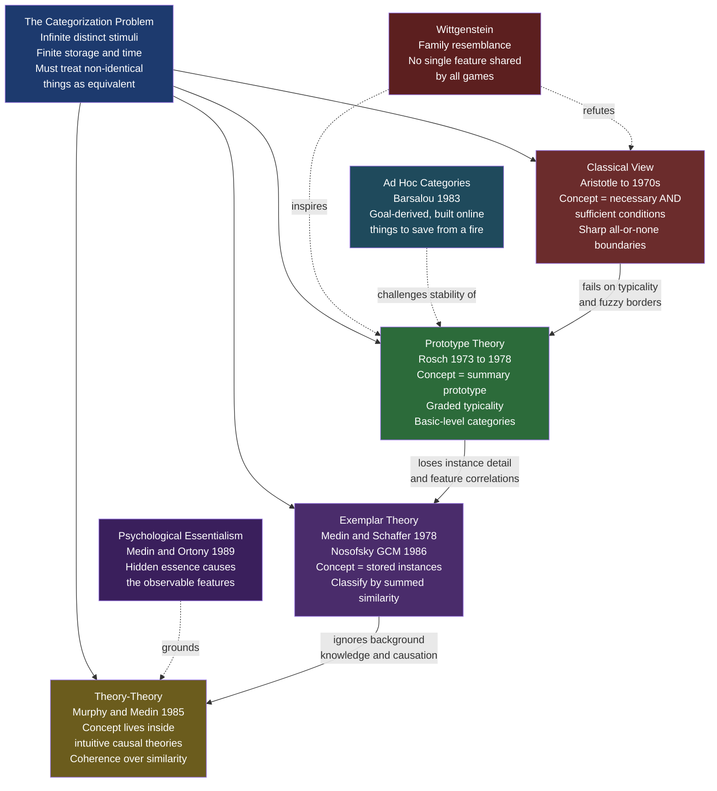

# 🗂️ Concepts and Categorization

> [!abstract] TL;DR
> A concept is the mental representation that lets a finite mind treat an infinite variety of never-identical experiences as members of the same kind, so that knowledge learned about one instance transfers to the next. The field's core arc runs from the failed classical view (categories as definitions) through Rosch's prototype theory (graded typicality and family resemblance) and exemplar theory (categorization by similarity to stored instances, formalized in Nosofsky's GCM) to the theory-theory (concepts embedded in intuitive causal theories) and psychological essentialism (belief in hidden category essences) — a debate that is ultimately about whether concepts are stable, similarity-based representations or flexible, knowledge-driven constructions.

---

## Intuition

**Analogy:** You have never seen *this exact cup* before — a chipped blue mug at a stranger's house — yet within a fraction of a second you know it holds liquid, has a graspable handle, will shatter if dropped, and is not for eating soup. You have never encountered this specific object, but you have a concept, CUP, and the concept does the work: it lets you skip re-learning the world from scratch every time an unfamiliar object appears. A mind that treated every distinct retinal image as a genuinely new thing would drown in detail and never generalize.

That is the fundamental pressure behind categorization. The world presents an effectively infinite stream of distinct stimuli; the mind has finite storage and finite time. Categories are the compression scheme: group the non-identical into equivalence classes so that a fact learned about one member ("cups can be picked up by the handle") becomes a prediction about all the others. The deep question of the field is not *whether* we categorize but *how* the category is represented in the head — as a definition, a summary prototype, a cloud of remembered examples, or a fragment of an intuitive theory about how the world works.

---

## How It Works

### Core Mechanics

Categorization is the mapping from a perceived stimulus to a category label, plus the inferences that label licenses. Four theoretical answers dominate the history of the field, each responding to the failures of the one before:

1. **Classical (definitional) view** — A concept is a set of *necessary and sufficient conditions*. Something is a BACHELOR if and only if it is [+male, +adult, +unmarried]. Membership is all-or-none, boundaries are sharp, and every member is an equally good member. This view reigned from Aristotle to the 1970s.
2. **The classical view collapses.** Wittgenstein pointed out that GAME has no single feature shared by chess, poker, catch, and ring-around-the-rosie — only overlapping, crisscrossing similarities he called **family resemblance**. Empirically, people rate a robin as a "better" bird than a penguin, disagree on borderline cases (is a rug furniture? is a tomato a vegetable?), and cannot state defining features for most everyday categories. Definitions do not describe how minds actually categorize.
3. **Prototype theory (Rosch)** — A concept is a *summary representation*: an abstracted central tendency (the prototype) built from experienced members. Membership is **graded** by similarity to the prototype, which explains typicality effects. Rosch also identified the **basic level** (DOG, CHAIR) as the cognitively privileged rung of the taxonomy — more informative than superordinates (ANIMAL, FURNITURE) and no more costly than subordinates (POODLE, RECLINER).
4. **Exemplar theory (Medin & Schaffer; Nosofsky)** — The mind stores *individual instances*, not an abstracted average. A new item is classified by computing its similarity to every stored exemplar and summing those similarities per category; the category with the highest summed similarity wins. Nosofsky's **Generalized Context Model (GCM)** formalizes this with an exponentially decaying similarity function over psychological distance, plus selective *attention weights* on dimensions. Exemplar models capture correlated features and non-convex categories that a single prototype cannot.
5. **Theory-theory / knowledge view (Murphy & Medin)** — Similarity is not enough. Concepts are embedded in **intuitive theories** about the world; category coherence comes from explanatory relations, not feature overlap. (Jumping into a pool with your clothes on at a party is instantly categorized as INTOXICATED-behavior — no prototype or exemplar of that specific act is needed; a causal theory of drunkenness does the work.) Coupled with this is **psychological essentialism**: people behave as if categories, especially natural kinds, have an unobservable *essence* that causes their observable features and fixes their true membership.

These are not just competing psych theories — they are the same options that reappear in machine learning: definitions map to rule-based classifiers, prototypes to centroid or nearest-centroid methods ([[KMeans]]), exemplars to k-nearest-neighbors and kernel methods ([[KNN]]), and generative feature models to [[Naive_Bayes]].

### Flow / Architecture



The diagram traces the field's logic: a single computational pressure (infinite world, finite mind) spawns four families of answer, each pushed forward by the failure of the last. Wittgenstein's family-resemblance argument both refutes the classical view and inspires prototypes; essentialism grounds the theory-theory; and Barsalou's ad hoc categories destabilize the assumption — shared by prototype and exemplar accounts — that concepts are fixed structures retrieved from long-term memory.

---

## Key Concepts

### Secondary Level

**Why categories exist at all.** Categorization buys three things: *cognitive economy* (store one concept, not a million instances), *inference* (label something a DOG and you predict it barks, breathes, and can bite), and *communication* (a shared category system lets a word like "dog" mean roughly the same thing to speaker and hearer — the bridge to [[Lexical_Semantics]]).

**The classical view and its failure.** For two millennia, to have a concept was to know its definition — the necessary and sufficient conditions for membership. The view is elegant but empirically wrong for almost every everyday concept. Try to define GAME, CHAIR, or VEGETABLE with conditions that admit all members and exclude all non-members; you cannot. Ludwig Wittgenstein's **family resemblance** (*Philosophical Investigations*, 1953) is the classic diagnosis: category members are linked like members of a family — this pair shares the nose, that pair shares the eyes — with no feature common to all.

**Typicality effects — the empirical hammer.** Rosch's experiments showed membership is *graded*. People:
- rate some members as more typical than others (robin > ostrich for BIRD; chair > stool > beanbag for FURNITURE),
- verify typical members faster ("A robin is a bird" is confirmed quicker than "A penguin is a bird"),
- list typical members first, and learn them earlier as children.

None of this is expected if membership is a crisp yes/no defined by conditions. Graded structure is the phenomenon every modern theory must explain.

### Undergraduate Level

**Prototype theory in detail.** Eleanor Rosch proposed that a category is represented by a **prototype** — an abstracted central tendency of experienced members (not necessarily any real member). Typicality is similarity to the prototype. Two further pillars:
- **Family resemblance made quantitative.** Rosch and Mervis showed that an item's rated typicality correlates with a *family-resemblance score* — how many features it shares with other category members and how few it shares with contrast categories. Prototypicality is not arbitrary; it tracks feature distributions.
- **The basic level.** Categories form taxonomies (FURNITURE > CHAIR > KITCHEN CHAIR). The *basic level* (CHAIR) is special: it is the most abstract level at which members still share an overall shape and afford similar motor interactions, the level people spontaneously name, learn first, and recognize fastest. Above it, information plummets; below it, distinctiveness barely rises.

**Exemplar theory and the GCM.** Medin & Schaffer's **context model** (1978), generalized by Nosofsky (1986) into the **Generalized Context Model**, rejects abstraction entirely: you store the individual training instances. To classify a probe:
1. Compute *psychological distance* `d(i,j)` to each stored exemplar (a weighted Minkowski metric; attention weights `w_k` on each dimension can stretch or shrink the space).
2. Convert distance to *similarity* via an exponential decay: `s(i,j) = exp(-c * d(i,j))` — Shepard's universal law of generalization.
3. **Sum** similarities within each category; the response probability for category A is A's summed similarity divided by the total.

Because it keeps every instance, the GCM naturally captures *feature correlations* (which colors go with which shapes) and *non-convex / multi-modal categories* that a single prototype smears out. It routinely out-predicts prototype models on trial-by-trial human data, and it is mathematically a kernel-weighted nearest-neighbor classifier — the psychologist's [[KNN]].

**Prototype vs. exemplar — how to tell them apart.** The theories make divergent predictions when a category is *non-linearly separable* or when *old items* recur. Exemplar models predict strong memory for specific trained instances (an "old-item advantage") and can learn categories whose members cluster in two separate regions; a single prototype cannot. This is precisely the dissociation the Python demo below visualizes.

### Graduate Level

**The theory-theory / knowledge-based view.** Murphy & Medin (1985), "The Role of Theories in Conceptual Coherence," argue that similarity is too unconstrained to explain concepts: any two things share indefinitely many features, so *which* similarities matter is fixed by background knowledge. Concepts cohere because they play a role in **intuitive theories** — naive biology, naive physics, naive psychology. This explains category features similarity cannot: why we group "children, money, photo albums, pets" as *things to grab in a house fire* (Barsalou's **ad hoc categories**, 1983), and why an animal painted to look like a skunk is still judged a raccoon if its insides and parentage are raccoon.

**Psychological essentialism.** Medin & Ortony (1989) proposed that people hold an implicit belief that category members — especially natural kinds like TIGER or GOLD — share a hidden, causally powerful **essence** that makes them what they are, even when nobody can specify it (the "essence placeholder"). Evidence: children and adults judge that a tiger raised among lambs is still a tiger; that switching a raccoon's surface features does not switch its kind; that natural kinds have sharper, more inductively powerful boundaries than artifacts. Essentialism is a *psychological stance*, not a metaphysical truth — and it drives real-world overgeneralization, including the cognitive machinery behind social stereotyping and racial and gender essentialism.

**Conceptual combination.** Concepts are productively combined ("pet fish," "corporate lawyer," "stone lion"), and the results defy any simple similarity calculus. A guppy is a poor PET and a poor FISH but an excellent PET FISH — the *conjunction* is more typical than either constituent (the "guppy effect"), which no fuzzy-set intersection of prototypes predicts. Modifier-head combination, emergent features ("wooden spoon" is large; neither WOODEN nor SPOON implies size), and privative combinations ("fake gun") are central test cases and a key argument that concepts are not simple retrieved structures but are elaborated using world knowledge — a theme continued in [[Cognitive_Semantics_and_Metaphor]] and formal accounts in [[Semantic_Theory]].

**Are concepts stable representations at all?** Barsalou's evidence that typicality ratings shift with context, point of view, and goals — and that ad hoc categories are constructed on the fly — motivates the radical position that concepts are not fixed entries in a mental dictionary but *temporary constructions* assembled in working memory from a distributed knowledge base each time they are needed. Prototype and exemplar theories both assume a stable stored representation; this dynamic view rejects that assumption and is the live edge of the debate.

**Category-learning paradigms.** The empirical battleground is a small set of tasks: *classification learning* (Shepard, Hovland & Jenkins' six category types, whose difficulty ordering constrains any model), *rule-plus-exception* structures (the 5-4 category structure), *A/not-A* and *information-integration* tasks that dissociate a rule-based system from a similarity-based one (Ashby's COVIS proposes two competing neural systems, one prefrontal-rule-based, one striatal-procedural). No single model wins all tasks — strong evidence that human categorization is *multiple systems*, not one.

**Conceptual development.** Children's concepts are not miniature adult concepts. The debate pits Piaget's stage account ([[Piagets_Cognitive_Development]]) and the classic "characteristic-to-defining shift" against Susan Carey's evidence for early *conceptual change* (children reorganize biology around a theory of life and death) and Frank Keil's demonstrations of early essentialist reasoning. Word learning is deeply entangled with concept learning — the shape bias, the whole-object and taxonomic assumptions, and fast-mapping are all mechanisms for aligning a new label with a category ([[Language_Development]]), the developmental face of the concept–word-meaning relationship.

---

## Python Demo

```python
"""
Prototype vs. Exemplar Models of Categorization
------------------------------------------------
Two 2D categories are generated. A novel test point is classified two ways:
  (1) Prototype model -- similarity to each category's PROTOTYPE (its mean)
  (2) Exemplar  model -- SUMMED similarity to every STORED exemplar (GCM-style)
Both use the same exponential (Shepard) similarity function; we then draw the
decision boundary each model implies. Category B is deliberately SPLIT into two
sub-clusters -- the non-convex case where the two models diverge most sharply.
Requires only numpy and matplotlib.
"""
import numpy as np
import matplotlib.pyplot as plt

rng = np.random.default_rng(7)

# --- 1. Generate two categories of 2D stimuli --------------------------------
# Category A: one compact cluster.
# Category B: TWO separate sub-clusters -> its mean lands in an empty gap.
A = rng.normal(loc=[2.0, 3.0], scale=0.55, size=(40, 2))
B1 = rng.normal(loc=[5.0, 5.5], scale=0.50, size=(20, 2))
B2 = rng.normal(loc=[5.0, 0.5], scale=0.50, size=(20, 2))
B = np.vstack([B1, B2])

# --- 2. Similarity: Shepard's law  sim = exp(-c * distance) -------------------
C = 1.2                                   # sensitivity / specificity parameter
def similarity(points, refs):
    # points:(P,2) refs:(R,2) -> (P,R) similarity matrix
    d = np.sqrt(((points[:, None, :] - refs[None, :, :]) ** 2).sum(axis=-1))
    return np.exp(-C * d)

# --- 3. Prototype model: distance to each category's mean ---------------------
proto_A = A.mean(axis=0)
proto_B = B.mean(axis=0)                   # falls BETWEEN B's two sub-clusters
def prototype_prob_A(points):
    sA = similarity(points, proto_A[None, :]).ravel()
    sB = similarity(points, proto_B[None, :]).ravel()
    return sA / (sA + sB)

# --- 4. Exemplar model (GCM): summed similarity to every stored instance ------
def exemplar_prob_A(points):
    sA = similarity(points, A).sum(axis=1)  # sum over all A exemplars
    sB = similarity(points, B).sum(axis=1)  # sum over all B exemplars
    return sA / (sA + sB)

# --- 5. Classify one novel test point both ways ------------------------------
test = np.array([[5.0, 3.0]])              # in the GAP between B's two clusters
print(f"Test point {test.ravel()}:")
print(f"  Prototype model  P(A) = {prototype_prob_A(test)[0]:.3f}  "
      f"(near B's prototype -> confidently B)")
print(f"  Exemplar  model  P(A) = {exemplar_prob_A(test)[0]:.3f}  "
      f"(few B instances nearby -> far less certain)")

# --- 6. Decision boundaries over a grid --------------------------------------
xs = np.linspace(-1, 8, 300)
ys = np.linspace(-2, 8, 300)
XX, YY = np.meshgrid(xs, ys)
grid = np.column_stack([XX.ravel(), YY.ravel()])
Zp = prototype_prob_A(grid).reshape(XX.shape)
Ze = exemplar_prob_A(grid).reshape(XX.shape)

fig, axes = plt.subplots(1, 2, figsize=(13, 6), sharex=True, sharey=True)
panels = [
    (axes[0], Zp, "Prototype model\nP(A) from distance to category MEANS"),
    (axes[1], Ze, "Exemplar model (GCM)\nP(A) from summed similarity to INSTANCES"),
]
for ax, Z, title in panels:
    ax.contourf(XX, YY, Z, levels=np.linspace(0, 1, 21), cmap="RdBu", alpha=0.7)
    ax.contour(XX, YY, Z, levels=[0.5], colors="k", linewidths=2)    # boundary
    ax.scatter(A[:, 0], A[:, 1], c="darkred", edgecolor="w", s=35, label="Category A")
    ax.scatter(B[:, 0], B[:, 1], c="navy", edgecolor="w", s=35, label="Category B")
    ax.scatter(*test.ravel(), c="yellow", edgecolor="k", s=220, marker="*",
               zorder=5, label="Test point")
    ax.set_title(title, fontsize=11)
    ax.legend(loc="upper left", fontsize=8)
    ax.set_xlabel("Feature 1"); ax.set_ylabel("Feature 2")

# Mark the two prototypes on the left panel
axes[0].scatter(*proto_A, c="yellow", edgecolor="darkred", s=160, marker="P", zorder=6)
axes[0].scatter(*proto_B, c="yellow", edgecolor="navy",    s=160, marker="P", zorder=6)

fig.suptitle("Prototype vs. Exemplar Categorization: same data, different boundaries",
             fontsize=13)
plt.tight_layout()
plt.savefig("prototype_vs_exemplar.png", dpi=150, bbox_inches="tight")
plt.show()
```

What the figure shows: the **prototype** model reduces each category to one point (its mean) and carves the plane with a smooth, essentially convex boundary — the perpendicular bisector logic between the two prototypes. Because B is split into two clusters, its prototype lands in an *empty gap* where no B members actually live; the model nonetheless labels that gap the *most* B-like region, an over-confident error. The **exemplar** model keeps all 80 instances and produces a non-convex boundary that wraps A's cluster and correctly registers uncertainty in the gap between B's sub-clusters. The starred test point at `[5, 3]` dramatizes this: the prototype model calls it confidently B; the exemplar model, seeing no nearby B instances, is far less sure. This single dissociation is the empirical wedge that made exemplar models the dominant account of trial-by-trial human categorization data.

---

## Real-World Applications

> **Machine learning classifiers are cognitive models.** The prototype/exemplar debate is isomorphic to a choice of classifier. Nearest-centroid and clustering methods ([[KMeans]]) are prototype models; k-nearest-neighbors and kernel/SVM methods ([[KNN]]) are exemplar models; generative feature models are [[Naive_Bayes]]. Nosofsky's GCM is literally a kernel-density classifier discovered independently in psychology — which is why cognitive scientists and ML researchers now trade tools freely (e.g., using deep-network embeddings as the "psychological space" in which GCM similarity is computed).

> **Medical and radiological diagnosis.** Expert diagnosticians categorize partly by exemplar retrieval — a rash or an X-ray reminds the physician of specific past patients — and partly by causal theory (pathophysiology). Training that supplies many varied worked examples improves classification of novel cases more than teaching abstract feature rules alone, exactly as exemplar theory predicts; and diagnostic error often traces to over-reliance on a vivid, unrepresentative prototype.

> **Search, recommendation, and taxonomy design.** Rosch's basic-level effect shapes information architecture: interfaces, product taxonomies, and search facets that hit the basic level ("laptops") are easier to navigate than superordinate ("electronics") or subordinate ("13-inch ultrabooks") levels. Typicality gradients determine ranking — a query for "birds" should surface robins before ostriches.

> **Marketing and product categorization.** A new product that is *moderately* atypical of its category earns attention without being rejected as non-a-member; too atypical and consumers cannot categorize it (and so cannot value it). Brand extensions succeed to the degree the new product preserves the family resemblance of the parent category — a direct commercial application of prototype structure.

> **Social cognition and bias.** Psychological essentialism applied to social groups underlies stereotyping: treating gender, race, or nationality as natural kinds with a hidden essence licenses the inference that surface features predict deep, immutable traits. Understanding categorization is therefore load-bearing for understanding — and intervening on — prejudice.

---

## Common Pitfalls

- **Confusing the psychological prototype with a definition.** A prototype describes central tendency and typicality, not category boundaries. "A robin is the most typical bird" is not the *meaning* of BIRD — penguins are fully birds. Systems (or students) that treat the prototype as the criterion misclassify valid-but-atypical members.
- **Assuming one mechanism does all the work.** Decades of data (Shepard-Hovland difficulty orderings, rule-plus-exception structures, information-integration tasks) show humans use *multiple* systems — rule-based and similarity-based, prefrontal and striatal. Modeling all categorization with a single account (pure prototype, pure exemplar) systematically mispredicts some task family.
- **Forgetting that similarity is not fixed.** Similarity depends on which features are attended, and attention is set by goals and theories. Two objects are "similar" only relative to a weighting of dimensions. Treating similarity as a theory-neutral given (the assumption Murphy & Medin attack) makes any similarity-based model silently smuggle in unexplained knowledge.
- **Mistaking essentialism for metaphysics.** Psychological essentialism is a description of how people *think*, not a claim that essences exist. Natural kinds may lack sharp real essences (ring species, mixed metals); the cognitive stance persists regardless — and its overextension to social categories is where it becomes harmful.
- **Ignoring the stability question in applications.** If concepts are partly constructed online from context and goals (ad hoc categories, context-shifted typicality), then a model or dataset that assumes one fixed category representation will fail on tasks where the operative category is goal-derived ("foods to eat on a diet") rather than taxonomic.
- **Treating conceptual combination as intersection.** "Pet fish," "wooden spoon," and "fake gun" show that combined concepts have emergent features and non-monotonic typicality (the guppy effect). Fuzzy-set or feature-intersection combination underestimates the role of world knowledge and predicts the wrong typicality ordering.

---

## Related Concepts

- [[Lexical_Semantics]] — Word meaning and concepts are two faces of the same structure; Rosch's prototype theory is the shared spine, and the concept–word mapping is what makes categories communicable.
- [[Cognitive_Semantics_and_Metaphor]] — Extends prototype-organized categories into radial polysemy, image schemas, and metaphorical category extension; the linguistic elaboration of graded conceptual structure.
- [[Semantic_Theory]] — The formal-semantics counterpart to the psychological story; classical definitions and set-theoretic membership are exactly the model that prototype and exemplar theories displace for human cognition.
- [[Memory_Systems]] — Exemplar theory is a claim about memory: categorization is retrieval of stored instances, tying category learning directly to episodic-memory mechanisms.
- [[Language_Development]] — Word learning (shape bias, taxonomic and whole-object assumptions, fast-mapping) is the developmental process of aligning labels with categories.
- [[Piagets_Cognitive_Development]] — The stage-based backdrop against which Carey's conceptual-change and Keil's early-essentialism accounts of children's concepts are argued.
- [[Language_and_Thought]] — Whether category boundaries are shaped by language (color terms, grammatical categories) is the Whorfian dimension of the categorization debate.
- [[Problem_Solving_and_Decision_Making]] — Categorization feeds inference and judgment; the representativeness heuristic is prototype-based reasoning applied (and misapplied) to probability.
- [[KNN]] — The machine-learning realization of exemplar theory; Nosofsky's GCM is a kernel-weighted nearest-neighbor classifier.
- [[KMeans]] — Centroid/prototype-based clustering; the algorithmic analog of the summary-prototype representation.
- [[Naive_Bayes]] — A generative, feature-independence classifier that mirrors the classical/feature-list intuition about category membership.

---

## Review Questions

### Secondary

1. State the classical (definitional) view of concepts in one sentence, then give an everyday category for which you cannot supply necessary and sufficient conditions. What is the name Wittgenstein gave to the alternative structure your example exhibits?
2. What is a "typicality effect"? Describe one behavioral finding that shows category membership is graded rather than all-or-none, and explain why the classical view cannot predict it.
3. What does Rosch mean by the "basic level" of a category? Give a superordinate, basic-level, and subordinate term for one object, and explain why the basic level is cognitively special.

### Undergraduate

1. A category's members fall into two well-separated clusters in feature space (like Category B in the demo). Explain precisely why a single-prototype model mispredicts membership for a point lying between the clusters, and why an exemplar/GCM model does not. What does this reveal about the information a prototype discards?
2. In Nosofsky's GCM, similarity is `exp(-c * d)` and the model sums similarities within each category. Walk through how a probe is classified, and explain the roles of the sensitivity parameter `c` and of dimensional attention weights. In what sense is the GCM the same object as a k-nearest-neighbors classifier?
3. Murphy & Medin argue that "similarity" cannot by itself explain conceptual coherence. Reconstruct their argument using the ad hoc category "things to remove from a burning house," and explain what the theory-theory adds that prototype and exemplar models lack.

### Graduate

1. Design an experiment that would dissociate a prototype model from an exemplar model for a *single* set of human learners — specify the category structure, the transfer items, and the pattern of results that would favor each account. Why is a non-linearly separable structure or an old-item probe essential to the design?
2. Psychological essentialism is a claim about cognition, not metaphysics. Describe two empirical signatures of essentialist reasoning (one developmental, one adult), then analyze how the same cognitive machinery produces harmful social-category essentialism. What intervention does this analysis suggest, and what would count as evidence it worked?
3. Barsalou's ad hoc categories and context-dependent typicality motivate the claim that concepts are not stable stored representations but online constructions. Evaluate this claim against the success of exemplar models (which assume stable stored instances). Can the two be reconciled, and if so, what does the reconciliation say about where "the concept" actually lives?

---

## Sources

- [Rosch, E. (1978). "Principles of Categorization." In *Cognition and Categorization*, Erlbaum, 27–48.](https://www.semanticscholar.org/paper/Principles-of-categorization-Rosch/e30a5d87cdf60f66fb01c7a88cd3e0282fb1c98d)
- [Rosch, E. & Mervis, C. (1975). "Family Resemblances: Studies in the Internal Structure of Categories." *Cognitive Psychology* 7(4), 573–605.](https://doi.org/10.1016/0010-0285(75)90024-9)
- [Medin, D. L. & Schaffer, M. M. (1978). "Context Theory of Classification Learning." *Psychological Review* 85(3), 207–238.](https://doi.org/10.1037/0033-295X.85.3.207)
- [Nosofsky, R. M. (1986). "Attention, Similarity, and the Identification-Categorization Relationship." *Journal of Experimental Psychology: General* 115(1), 39–57.](https://doi.org/10.1037/0096-3445.115.1.39)
- [Murphy, G. L. & Medin, D. L. (1985). "The Role of Theories in Conceptual Coherence." *Psychological Review* 92(3), 289–316.](https://doi.org/10.1037/0033-295X.92.3.289)
- [Barsalou, L. W. (1983). "Ad Hoc Categories." *Memory & Cognition* 11(3), 211–227.](https://doi.org/10.3758/BF03196968)
- [Murphy, G. L. (2002). *The Big Book of Concepts*. MIT Press.](https://mitpress.mit.edu/9780262632997/the-big-book-of-concepts/)

---

#cognitive-science #concepts #categorization #prototype #exemplar
