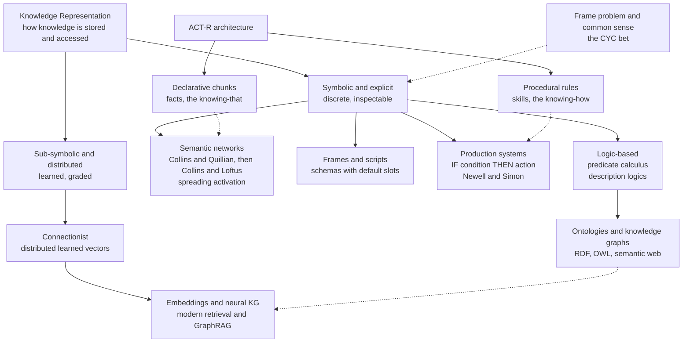

# 🧩 Knowledge Representation

> [!abstract] TL;DR
> Knowledge representation (KR) is the study of *how* a mind or a machine stores facts and concepts so that they can be efficiently retrieved, combined, and reasoned over. The same core question — what is the internal "format" of knowledge? — drives both cognitive theory (semantic networks, schemas, ACT-R) and AI engineering (logic, ontologies, knowledge graphs, learned embeddings). The chosen format decides what is easy to infer, what is fast to recall, and what remains invisible.

---

## Intuition

**Analogy:** Think about how a well-organized kitchen stores knowledge about cooking. Some things live in a *hierarchy* — "spices" is a shelf, and cumin, paprika, and turmeric sit inside it, so you never store "is edible" on each jar individually; you inherit it from the shelf. Other things live in *routines* — a mental script for "making an omelette" that fires step by step. And some things you just *know without thinking*, the way an experienced cook reaches for salt without deliberating. The kitchen's layout is not the food; it is a *format* that makes some recipes trivial to find and others a scramble. Reorganize the kitchen and you change what is fast, what is slow, and what you forget you own.

Knowledge representation asks the same question about the mind and about AI systems: what internal layout stores concepts, and how does that layout make some thoughts instant, some inferences automatic, and some connections impossible to draw?

---

## How It Works

### Core Mechanics

**1. The two-sided question.** KR sits at the intersection of cognitive science and AI. Cognitive scientists ask a *descriptive* question — what format does the human mind actually use, given how people remember, err, and react in milliseconds? AI engineers ask a *normative/constructive* question — what format should we build so a system can store millions of facts and infer new ones reliably? The theories below are read on both tracks at once.

**2. Semantic networks — Collins & Quillian's hierarchical model (1969).** The first influential proposal: concepts are *nodes* linked by labeled *relations*, chiefly **is-a** (superordinate) and **has-property**. "Canary" links up to "Bird" links up to "Animal." Properties are stored at the highest level they apply to — *cognitive economy*: "has skin" lives on Animal, not repeated on Canary. Prediction: verifying "a canary can fly" (one level up) is faster than "a canary has skin" (two levels up), because you traverse fewer is-a links. Early reaction-time data supported this **category-size effect**.

**3. Where the strict hierarchy broke — typicality.** The clean model failed two ways. **Typicality effects**: people verify "a robin is a bird" faster than "an ostrich is a bird," even though both are one level up — semantic distance is not just link count. **Category-size violations**: "a dog is an animal" can be verified as fast as "a dog is a mammal," contradicting a rigid ladder. Pure inheritance hierarchies cannot explain graded membership.

**4. Collins & Loftus spreading activation (1975).** The repair replaced the tidy tree with a *weighted graph*. Links have variable strength (semantic relatedness), and accessing a concept sends **activation** spreading outward along links, decaying with distance and dividing among many links. Retrieval is a matter of accumulating activation, not counting hops. This naturally explains typicality (strong links to "robin," weak to "ostrich") and **semantic priming** (hearing "doctor" pre-activates "nurse," so "nurse" is recognized faster). Spreading activation became the workhorse mechanism of semantic memory.

**5. The Teachable Language Comprehender (TLC).** Quillian's TLC was the first computational instantiation: a program that represented word meanings as intersecting semantic-network paths and "understood" text by finding paths connecting concepts. It is the ancestor of every later semantic-network AI and a proof-of-concept that meaning could be searched as graph structure.

**6. Feature / attribute models.** A rival family drops the network and represents a concept as a *bundle of features* — "bird = {has wings, has feathers, can fly, lays eggs}." Smith, Shoben & Rips's **feature-comparison model** splits *defining* from *characteristic* features and explains typicality by feature overlap. This is the conceptual root of today's **vector embeddings**, where a concept is a point in feature space and similarity is distance.

**7. Frames and scripts — structured, default-filled knowledge.** Minsky's **frames** (1974) and Schank & Abelson's **scripts** package knowledge into structured templates with *slots* and *default values*: a "room" frame defaults to having walls, a floor, and a ceiling; a "restaurant script" defaults to being seated, ordering, eating, paying. Defaults let you fill gaps you were never told — the cognitive-science construct of *schemas* is the same idea (see the Schemas topic in this section). Frames trade logical purity for the shape of everyday, expectation-driven cognition.

**8. Production systems — condition-action rules (Newell & Simon).** Procedural knowledge is captured as **IF condition THEN action** rules (productions). A recognize-act cycle matches the current state against rule conditions and fires the winner. Newell's **Soar** and the family of production systems model skilled behavior as thousands of small rules — the engineering face of the [[Computational_Theory_of_Mind|Physical Symbol System Hypothesis]] and the mechanism behind classic expert systems (MYCIN, DENDRAL).

**9. Logic-based representation.** For guaranteed correctness, knowledge is written in **first-order predicate calculus**: `∀x Bird(x) → HasWings(x)`, and inference is formal deduction (see [[Predicate_Logic_and_Quantifiers]]). Full first-order logic is undecidable and slow, so AI carved out **description logics** — a decidable fragment tuned for defining concepts (classes), roles (relations), and individuals, with automatic *subsumption* reasoning (is class A necessarily a subclass of B?). This is the formal backbone that bridges KR to the [[Logic_in_AI_and_Computation|logic-and-computation]] tradition.

**10. Ontologies and the Semantic Web.** An **ontology** is an explicit, shared specification of the concepts and relations in a domain. The W3C stack — **RDF** (subject-predicate-object triples), **RDFS**, and **OWL** (built on description logics) — was meant to turn the Web into machine-readable knowledge. Ontologies give consistency and machine reasoning at the cost of laborious hand-engineering.

**11. ACT-R — declarative vs procedural.** Anderson's **ACT-R** architecture unifies several threads. Knowledge splits into **declarative memory** (facts as *chunks*, subject to spreading activation and decay — the "knowing that") and **procedural memory** (productions — the "knowing how"). Each chunk carries a real-valued *activation* that predicts retrieval latency and probability, letting ACT-R fit human reaction-time data quantitatively. It is the most successful hybrid of symbolic structure and sub-symbolic activation.

**12. Connectionist / distributed knowledge.** Connectionism rejects discrete symbols: a concept is a *pattern of activation* over many units, and knowledge is stored in the *weights* between units, **learned** from data rather than hand-coded. Meaning is distributed, graded, and superimposed — robust to noise and great at similarity, but hard to inspect and prone to interference. Modern word embeddings and neural nets are its descendants.

**13. Knowledge graphs in modern AI.** The semantic network came full circle at industrial scale: Google's Knowledge Graph, Wikidata, and enterprise graphs store billions of entity-relation-entity triples. Today they fuse with neural methods — **knowledge-graph embeddings** and retrieval systems like [[GraphRAG]] combine explicit symbolic structure with learned vectors, marrying paragraphs 4-12 into one pipeline.

**14. The frame problem and common-sense knowledge.** The deep unsolved issue: after any action, *which* facts change and which stay the same? A symbolic agent cannot afford to re-check every belief (the **frame problem**), and no one has fully captured the vast web of unstated **common-sense knowledge** ("water is wet," "you can't push a rope"). Lenat's **CYC** project spent decades hand-encoding millions of common-sense axioms — the boldest bet that knowledge can be explicitly represented, and a standing reminder of how much a human knows without ever being told.

### Flow / Architecture



---

## Key Concepts

**Secondary (intuitive level)**
- Knowledge has a *format*: the mind and AI store concepts in a layout, and the layout decides what is fast to recall.
- A **semantic network** is a web of concepts joined by labeled links like "is-a" and "has-part."
- **Spreading activation**: thinking of one concept warms up its neighbors, so related words come to mind faster (why "doctor" makes "nurse" quicker to read).
- Some knowledge is *knowing that* (facts) and some is *knowing how* (skills).

**Undergraduate (conceptual level)**
- *Collins & Quillian hierarchy*: property inheritance and cognitive economy predict the **category-size effect**; **typicality effects** are the anomaly that broke it.
- *Collins & Loftus spreading activation*: a weighted graph explains graded membership and priming that a strict hierarchy cannot.
- *Frames/scripts/schemas*: structured templates with slots and defaults let you infer unstated information.
- *Production systems*: procedural knowledge as condition-action rules driving a recognize-act cycle (Soar, expert systems).
- *Feature models*: concepts as feature bundles; the intuition behind vector embeddings.

**Graduate (technical / disputed level)**
- *Description logics* as the decidable core of OWL; the expressiveness-vs-tractability trade-off and automatic subsumption/classification.
- *ACT-R's hybrid*: declarative chunks carry sub-symbolic activation `A = base-level + spreading` that predicts latency and recall probability, unifying symbolic and connectionist commitments.
- *Distributed vs localist debate*: superposition and graceful degradation vs the interpretability and systematicity of discrete symbols.
- *The frame problem* (McCarthy & Hayes) and non-monotonic/default reasoning; the qualification and ramification problems.
- *The CYC gamble and its critique*: whether common-sense knowledge is best hand-encoded, learned statistically, or grounded through embodiment.

---

## Python Demo

```python
# Semantic network + spreading activation + a semantic priming effect.
# Nodes = concepts, labeled edges = typed relations (color-of, is-a, similar).
# Activation spreads from a "prime" concept via a random-walk-with-restart,
# decaying with graph distance; response time then falls as pre-activation
# rises -- reproducing the classic priming result. numpy + matplotlib only.

import numpy as np
import matplotlib.pyplot as plt

# --- 1. Define a small Collins & Loftus style semantic network -----------
nodes = ["Red", "Orange", "Yellow", "Fire_truck", "Vehicle", "Bus",
         "Apple", "Cherry", "Fruit", "Rose", "Flower", "Fish", "Salmon"]
idx = {name: i for i, name in enumerate(nodes)}
n = len(nodes)

# (a, b, relation_label, weight): undirected typed links.
edges = [
    ("Red", "Fire_truck", "color-of", 1.0),
    ("Red", "Apple",      "color-of", 1.0),
    ("Red", "Cherry",     "color-of", 1.0),
    ("Red", "Rose",       "color-of", 1.0),
    ("Red", "Orange",     "similar",  0.7),
    ("Orange", "Yellow",  "similar",  0.7),
    ("Fire_truck", "Vehicle", "is-a", 1.0),
    ("Bus", "Vehicle",    "is-a",     1.0),
    ("Apple", "Fruit",    "is-a",     1.0),
    ("Cherry", "Fruit",   "is-a",     1.0),
    ("Rose", "Flower",    "is-a",     1.0),
    ("Salmon", "Fish",    "is-a",     1.0),   # disconnected control component
]

# --- 2. Weighted symmetric adjacency -> column-stochastic transition ------
W = np.zeros((n, n))
for a, b, rel, w in edges:
    W[idx[a], idx[b]] = w
    W[idx[b], idx[a]] = w

col_sums = W.sum(axis=0)
P = np.divide(W, col_sums, out=np.zeros_like(W), where=col_sums > 0)

# --- 3. Spreading activation = random walk with restart from the prime -----
# High restart keeps the source "hot"; activation leaks outward and decays
# with distance -- the priming gradient. Disconnected nodes stay near zero.
def spread(source, alpha=0.15, iters=200):
    s = np.zeros(n); s[idx[source]] = 1.0
    a = s.copy()
    for _ in range(iters):
        a = (1.0 - alpha) * (P @ a) + alpha * s
    return a

prime = "Red"
act = spread(prime)
act_norm = act / act.max()

# --- 4. Semantic priming: response time drops as pre-activation rises -------
base_ms, gain = 650.0, 300.0
probes = ["Apple", "Fire_truck", "Yellow", "Bus", "Salmon"]
print("Prime = '{}'\n".format(prime))
print("{:12s} {:>11s} {:>8s}".format("probe", "activation", "RT_ms"))
for p in probes:
    rt = base_ms - gain * act_norm[idx[p]]
    print("{:12s} {:>11.3f} {:>8.0f}".format(p, act_norm[idx[p]], rt))
# 'Apple'/'Fire_truck' (1 hop) are primed and fast; 'Salmon' (unrelated,
# disconnected) sits at baseline -> a clean semantic priming effect.

# --- 5. Visualize the network and the activation levels --------------------
pos = {
    "Red": (0, 0), "Orange": (-1.5, 1.3), "Yellow": (-2.9, 2.0),
    "Fire_truck": (1.7, 1.2), "Vehicle": (2.9, 2.1), "Bus": (3.8, 0.9),
    "Apple": (1.7, -1.2), "Cherry": (0.4, -2.0), "Fruit": (2.8, -2.1),
    "Rose": (-1.7, -1.2), "Flower": (-2.9, -2.0),
    "Fish": (5.2, -1.4), "Salmon": (5.4, -0.2),
}

fig, (ax1, ax2) = plt.subplots(1, 2, figsize=(14, 6))

for a, b, rel, w in edges:                    # edges + relation labels
    x0, y0 = pos[a]; x1, y1 = pos[b]
    ax1.plot([x0, x1], [y0, y1], color="0.75", lw=1.2, zorder=1)
    ax1.text((x0 + x1) / 2, (y0 + y1) / 2, rel, fontsize=7, color="0.4",
             ha="center", va="center",
             bbox=dict(boxstyle="round,pad=0.1", fc="white", ec="none", alpha=0.85))

xs = [pos[name][0] for name in nodes]
ys = [pos[name][1] for name in nodes]
sc = ax1.scatter(xs, ys, c=act_norm, cmap="hot_r", s=1700,
                 edgecolors="black", zorder=2, vmin=0, vmax=1)
for name in nodes:
    ax1.text(pos[name][0], pos[name][1], name, fontsize=8,
             ha="center", va="center", zorder=3)
ax1.set_title("Semantic network: activation spreading from '{}'".format(prime))
ax1.axis("off")
fig.colorbar(sc, ax=ax1, shrink=0.7, label="activation")

order = np.argsort(act_norm)[::-1]
ax2.barh([nodes[i] for i in order], [act_norm[i] for i in order], color="#d1495b")
ax2.invert_yaxis()
ax2.set_xlabel("normalized activation")
ax2.set_title("Activation levels = retrieval priority")

plt.tight_layout()
plt.savefig("semantic_network_activation.png", dpi=120)
print("\nsaved semantic_network_activation.png")
```

---

## Real-World Applications

> **Example:** Google's **Knowledge Graph** is a planet-scale semantic network. When you search "Marie Curie," the panel on the right is generated by traversing entity-relation-entity triples (`Marie_Curie — won — Nobel_Prize`, `Marie_Curie — field — physics`) — the direct industrial descendant of Quillian's TLC and Collins & Loftus's labeled graph.

- **Semantic search and RAG**: retrieval-augmented systems like [[GraphRAG]] fuse a symbolic knowledge graph with neural embeddings, using graph structure for global reasoning and vectors for fuzzy similarity — paragraphs 4, 12, and 13 in one product.
- **Expert / decision systems**: medical (MYCIN) and configuration systems encode domain knowledge as production rules (IF-THEN), the deployed form of production systems and description-logic ontologies (SNOMED CT in healthcare).
- **Cognitive modeling**: ACT-R and Soar predict human reaction times and error patterns for interface design, tutoring systems, and pilot/driver workload models, grounded in declarative-chunk activation.
- **Ontologies in industry**: schema.org markup, Wikidata, and enterprise ontologies power interoperable data exchange and machine reasoning across the Semantic Web stack (RDF/OWL).

---

## Common Pitfalls

- **Assuming a strict is-a hierarchy models human memory** — Collins & Quillian's clean tree is falsified by typicality and category-size violations; real semantic memory is a weighted graph, not a taxonomy. Use inheritance for engineering economy, not as a psychological claim.
- **Confusing spreading activation with logical inference** — activation spreads by *association and distance*, not validity; it will happily "prime" false or misleading neighbors. It models fast recall, not sound deduction. Keep the retrieval mechanism separate from the reasoning guarantee.
- **Believing symbolic KR captures common sense** — the frame problem and CYC's decades of hand-encoding show how much unstated knowledge resists explicit representation. Do not assume "just add more axioms" scales to human-level common sense.
- **Treating embeddings as interpretable knowledge** — distributed representations are powerful and learnable but opaque and non-compositional in ways symbols are not. A vector says two things are "similar" without telling you *why* (is-a? part-of? co-occurrence?). Losing the relation label loses the knowledge structure.
- **Ignoring the expressiveness-vs-tractability trade-off** — full first-order logic is undecidable; description logics stay decidable by *giving up* expressive power. Reaching for maximal logical power in a production ontology often buys you reasoning that never terminates.

---

## Related Concepts

- [[Computational_Theory_of_Mind]] — KR supplies the "what is represented" half of computationalism; the Physical Symbol System Hypothesis is the charter for symbolic KR.
- [[Predicate_Logic_and_Quantifiers]] — first-order predicate calculus is the formal language of logic-based KR and the parent of description logics.
- [[Logic_in_AI_and_Computation]] — production systems, expert systems, and automated reasoning are the engineering realization of symbolic knowledge representation.
- [[GraphRAG]] — modern fusion of symbolic knowledge graphs with neural retrieval; a semantic network scaled up and married to embeddings.
- [[Levels_of_Analysis_and_Marrs_Levels]] — the *format* of a representation is a Marr algorithmic-level question, distinct from the computation it serves and the neural implementation.
- [[Cognitive_Science_Overview]] — situates KR within the interdisciplinary project of explaining mind as representation plus process.

---

## Review Questions

1. **(Conceptual)** Collins & Quillian's hierarchical model made a specific, testable prediction about reaction times (the category-size effect). State that prediction, then explain the *two* empirical findings that forced the move to Collins & Loftus's spreading-activation model. Why is a weighted graph able to explain both when a strict hierarchy cannot?
2. **(Scenario)** You are designing the knowledge layer for a medical assistant that must (a) answer "is drug X contraindicated for condition Y?" with a guarantee of correctness and (b) surface "related conditions a clinician might also consider." Which representation would you use for each requirement — logic/description-logic ontology, spreading-activation semantic graph, or learned embeddings — and why is no single format ideal for both?
3. **(Trade-off)** Compare symbolic (logic/frames/ontologies) and connectionist (distributed embeddings) knowledge representation on three axes: interpretability, ability to learn from data, and handling of common-sense/frame-problem knowledge. Given a system like [[GraphRAG]] that combines both, argue which failures of each the hybrid actually fixes and which it merely inherits.

---

## Sources

- Collins, A. M. & Quillian, M. R. (1969). "Retrieval time from semantic memory." *Journal of Verbal Learning and Verbal Behavior*, 8(2), 240–247. https://doi.org/10.1016/S0022-5371(69)80069-1
- Collins, A. M. & Loftus, E. F. (1975). "A spreading-activation theory of semantic processing." *Psychological Review*, 82(6), 407–428. https://doi.org/10.1037/0033-295X.82.6.407
- Minsky, M. (1974). "A Framework for Representing Knowledge." *MIT AI Laboratory Memo 306*. https://dspace.mit.edu/handle/1721.1/6089
- Anderson, J. R., Bothell, D., Byrne, M. D., Douglass, S., Lebiere, C. & Qin, Y. (2004). "An integrated theory of the mind." *Psychological Review*, 111(4), 1036–1060. https://doi.org/10.1037/0033-295X.111.4.1036
- Lenat, D. B. (1995). "CYC: A Large-Scale Investment in Knowledge Infrastructure." *Communications of the ACM*, 38(11), 33–38. https://doi.org/10.1145/219717.219745

---

#cognitive-science #knowledge-representation #semantic-network #spreading-activation #ontology
