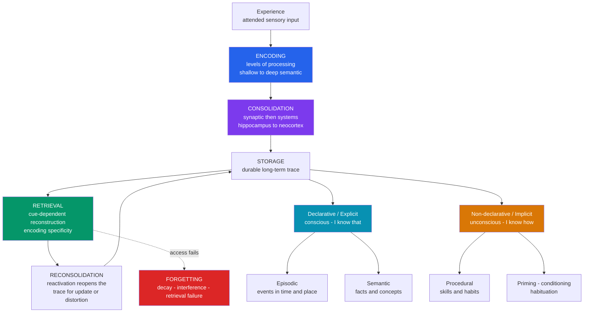

# 🧠 Long-Term Memory Systems

> [!abstract] TL;DR
> Long-term memory is not one store but a **family of dissociable systems**: **declarative** (explicit) memory for facts and events — split by Tulving into **episodic** and **semantic** — and **non-declarative** (implicit) memory for skills, priming, conditioning, and habituation. Every memory passes through **encoding → consolidation → storage → retrieval**, and each stage has its own failure mode. What you retain is governed by *how deeply* you encoded it, *how well the retrieval context matches encoding*, and *how the practice was spaced over time*. Memory is reconstructive, not a recording — which makes it powerful, adaptive, and systematically fallible.

---

## Intuition

**Analogy: a forest trail network.**

Imagine your long-term memory as a web of hiking trails worn into a forest.

- A **declarative memory** (a fact or an event) is a **signposted trail you can consciously describe** to someone else: "turn left at the oak." A **procedural memory** is the **automatic footwork of walking itself** — you cannot explain it in words, you just do it. That is why H.M., who could form no new signposted trails, still got smoother at mirror-drawing every day: his footwork improved while he had no memory of ever walking the path.
- **Encoding** is walking a new route for the first time. Clearing a **wide, meaningful path** (deep processing) leaves a far more durable trail than brushing a faint one (shallow processing).
- **Consolidation** is the trail *hardening on its own over the following nights* as the forest settles — most of it while you sleep.
- **Retrieval** is following the trail again. Crucially, **each walk slightly reshapes the path**, and a misleading sign planted afterward can reroute it entirely — that is a false memory.
- **Forgetting** has three separate causes: the path **overgrows** (decay), **crossing trails confuse you** (interference), or the **trailhead sign goes missing** (retrieval failure — the trail is still there, you just cannot find the entrance).
- The **spacing effect** falls straight out of the analogy: re-walking a *faintly overgrown* trail forces more clearing effort, so that effort counts for more than re-walking a path that is still fresh. Struggling to recall is what deepens the groove.

The core insight is that memory is a **living, self-modifying trail network**, not a warehouse of finished recordings.

---

## How It Works

Long-term memory is described at two levels: a **taxonomy** of *what kinds* of information are stored, and a **process pipeline** of *how* information moves through the system.

### The three-stage pipeline

1. **Encoding** — converting a perceived experience into a stored representation. Encoding quality is governed by the **levels-of-processing** principle (Craik & Lockhart, 1972): semantic ("what does this word *mean*?") processing produces far more durable traces than phonological ("does it rhyme?") or visual ("is it in capitals?") processing. Attention is the gatekeeper — unattended information is never encoded (see [[Attention_and_Cognitive_Load]]).
2. **Consolidation** — the newly formed trace is initially fragile and gradually stabilises. *Synaptic consolidation* happens over minutes to hours; *systems consolidation* redistributes the memory from hippocampus to neocortex over weeks to years, heavily driven by sleep (see [[Sleep_and_Circadian_Rhythms]]). Two theories compete over the end state — see Key Concepts.
3. **Retrieval** — reconstructing the trace from a partial cue. Retrieval is **cue-dependent** and governed by **encoding specificity**: you recall best when the retrieval context matches the encoding context. Every retrieval also *destabilises* the memory, opening a **reconsolidation** window in which it can be updated or distorted.

### The taxonomy

**Declarative / explicit** memory (conscious, "I know *that*") divides into **episodic** (events tied to a specific time and place) and **semantic** (context-free facts and concepts) — a distinction introduced by **Endel Tulving (1972)**. **Non-declarative / implicit** memory (unconscious, "I know *how*") includes **procedural** skills, **priming**, **classical conditioning**, and **habituation**. The two branches are anatomically and behaviourally dissociable, most famously in patient **H.M. (Henry Molaison)**, whose declarative branch was destroyed while his non-declarative branch remained intact.



---

## Key Concepts

### Secondary Level

**The taxonomy of long-term memory.** Long-term memory splits into *declarative* (explicit, verbalisable) and *non-declarative* (implicit, expressed through behaviour). Declarative memory further splits into **episodic** (personally experienced events — "my first day at university") and **semantic** (general knowledge — "Paris is the capital of France"), a distinction proposed by Tulving. Non-declarative memory includes procedural skills, priming, classical conditioning, and habituation.

**Encoding, storage, retrieval.** These are the three sequential requirements for remembering. A failure at *any* stage produces forgetting: you may never have encoded the information (inattention), the trace may have degraded in storage, or you may be unable to retrieve an intact trace because the right cue is missing.

**The H.M. dissociation.** After bilateral removal of his hippocampi in 1953, Henry Molaison could form **no new declarative memories** (dense anterograde amnesia) yet could still **learn new motor skills** without any awareness of practising them. This double dissociation is the single most important piece of evidence that declarative and non-declarative memory are separate systems.

**The Ebbinghaus forgetting curve.** Hermann Ebbinghaus (1885), testing himself on nonsense syllables, found that retention drops steeply at first and then flattens. Roughly half of freshly learned material is lost within an hour, but what survives the first day is far more durable. The curve is the empirical baseline against which all study strategies are measured.

### Undergraduate Level

**Levels of processing (Craik & Lockhart, 1972).** Memory durability depends not on rehearsal *time* but on *depth of processing*. Answering a semantic question about a word ("Does it fit this sentence?") produces much better later recall than a shallow phonological or structural judgement. This replaced the passive "rehearsal transfers to LTM" view of the earlier multi-store model with an active, encoding-quality view.

**Encoding specificity and context-dependent memory (Tulving & Thomson, 1973).** Retrieval succeeds to the extent that the retrieval cues overlap with the cues present at encoding. **Godden & Baddeley (1975)** had divers learn word lists on land or underwater and tested them in the same or the other environment — recall was substantially better when the two environments matched. **State-dependent memory** is the internal analogue: material encoded in a given mood or physiological state is retrieved best in that same state.

**Consolidation: standard model vs multiple-trace theory.** The **standard consolidation model (Squire)** holds that the hippocampus temporarily binds a memory and gradually trains the neocortex to hold it independently, after which the hippocampus is no longer needed — consistent with *Ribot's Law* (recent memories are more vulnerable to hippocampal damage than remote ones). **Multiple-trace theory (Nadel & Moscovitch)** counters that rich, contextual *episodic* memories always depend on the hippocampus, while only *semantic* memories become hippocampus-independent. The debate hinges on whether old episodic memories are truly hippocampus-free.

**Theories of forgetting.**
- **Decay** — traces fade with disuse over time (well supported in short-term memory; contested as a cause in long-term memory).
- **Interference** — competing memories block each other: **proactive** (old learning impairs new) and **retroactive** (new learning impairs old).
- **Retrieval failure** — the trace is intact but inaccessible without the right cue; the *tip-of-the-tongue* state is the clearest demonstration that retrieval is not all-or-nothing.

**The spacing effect and the testing effect.** Two of the most robust findings in the science of learning. **Spacing:** distributing study across time yields far more durable retention than the same amount of massed study ("cramming") — meta-analysed across hundreds of experiments (Cepeda et al., 2006). **Testing (retrieval practice):** actively recalling information strengthens it more than re-reading (Roediger & Karpicke, 2006). Both exploit **desirable difficulties** (Bjork): effortful retrieval, precisely because it is harder, drives stronger encoding.

### Graduate Level

**Reconsolidation.** A consolidated memory is not permanently fixed. Reactivating it returns it to a labile state for a few hours before it re-stabilises — during which it can be strengthened, weakened, or updated. This overturns the classic "consolidate once" view and underlies experimental PTSD treatments that reactivate a trauma memory and then blunt its re-storage.

**Reconstruction and false memories (Loftus; Schacter).** Memory is reconstructive: retrieval fills gaps with plausible inference and is contaminated by post-event information. **Loftus & Palmer (1974)** showed that changing a single verb — "smashed" vs "hit" — in a question about a filmed car crash inflated speed estimates and induced false memories of broken glass (the **misinformation effect**). The **DRM paradigm** reliably produces false recall of an unpresented "lure" word, and the "lost in the mall" studies show entire fictitious childhood events can be implanted. **Schacter's seven sins of memory** organise these failures into three of *omission* (transience, absent-mindedness, blocking) and four of *commission* (misattribution, suggestibility, bias, persistence) — arguing each "sin" is the cost of an otherwise adaptive feature.

**Flashbulb memories (Brown & Kulik, 1977).** Emotionally shocking public events (assassinations, 9/11) create vivid, confidently held memories of the moment one heard the news. Yet longitudinal studies — notably **Neisser & Harsch's** *Challenger* study — show these memories **decay and distort like ordinary memories** while subjective confidence stays high. The dissociation between *vividness/confidence* and *accuracy* is the key lesson.

**The form of the forgetting curve.** Ebbinghaus's own data are fit better by a **power law** than by a simple exponential: forgetting *decelerates* — the *rate* of loss itself slows over time (Wixted & Ebbesen, 1991). This "power law of forgetting" implies that a memory's decay rate depends on its current age, not a fixed half-life, and is a strong constraint on any mechanistic model of storage. The Python demo below compares the two fits directly.

**Metamemory and the illusion of competence.** Learners systematically mis-monitor their own memory. **Fluency** (how easily material is processed during study) is mistaken for learning, which is why re-reading *feels* effective while producing poor retention. Desirable difficulties feel worse in the moment but predict better delayed performance — a metacognitive trap that spaced, tested practice must overcome.

---

## Python Demo

```python
# numpy + matplotlib only.
# Part 1: fit the Ebbinghaus forgetting curve (exponential vs power law).
# Part 2: demonstrate the spacing effect -- distributed practice beats
#         massed practice at a delayed test, even with equal total study.
import numpy as np
import matplotlib.pyplot as plt

# ============================================================
# PART 1 -- Fit the Ebbinghaus forgetting curve
# Ebbinghaus (1885): relearning "savings" as a function of delay.
# ============================================================
t_hours   = np.array([0.33, 1.0, 8.8, 24.0, 48.0, 144.0, 744.0])   # delay
retention = np.array([58.2, 44.2, 35.8, 33.7, 27.8, 25.4, 21.1])   # percent saved

# Exponential model  R = a * exp(b * t)   ->  log R = log a + b * t
b_exp, log_a_exp = np.polyfit(t_hours, np.log(retention), 1)
a_exp = np.exp(log_a_exp)
R_exp = lambda t: a_exp * np.exp(b_exp * t)

# Power-law model  R = a * (t + 1)^b   ->  log R = log a + b * log(t + 1)
b_pow, log_a_pow = np.polyfit(np.log(t_hours + 1.0), np.log(retention), 1)
a_pow = np.exp(log_a_pow)
R_pow = lambda t: a_pow * (t + 1.0) ** b_pow

def r_squared(y, yhat):
    ss_res = np.sum((y - yhat) ** 2)
    ss_tot = np.sum((y - np.mean(y)) ** 2)
    return 1.0 - ss_res / ss_tot

r2_exp = r_squared(retention, R_exp(t_hours))
r2_pow = r_squared(retention, R_pow(t_hours))
print(f"Exponential fit  R^2 = {r2_exp:.3f}")
print(f"Power-law  fit   R^2 = {r2_pow:.3f}   (forgetting decelerates -> power law wins)")

# ============================================================
# PART 2 -- The spacing effect
# Same number of study sessions; MASSED vs SPACED.
# Each restudy boosts memory STABILITY more when the trace has
# partly decayed (study-phase retrieval / desirable difficulty).
# ============================================================
def simulate(study_days, horizon=40.0, S0=1.0, alpha=0.4, beta=6.0, n=1500):
    """Piecewise retention R = exp(-t / S) with stability S boosted at each restudy."""
    events = sorted(study_days)
    stabilities = [S0]
    S = S0
    for k in range(1, len(events)):
        gap = events[k] - events[k - 1]
        r_at_restudy = np.exp(-gap / S)                    # fraction surviving
        S = S * (1.0 + alpha + beta * (1.0 - r_at_restudy))  # bigger boost if more forgotten
        stabilities.append(S)

    t = np.linspace(0.0, horizon, n)
    R = np.zeros_like(t)
    for i, ti in enumerate(t):
        idx = np.searchsorted(events, ti, side="right") - 1
        R[i] = 0.0 if idx < 0 else np.exp(-(ti - events[idx]) / stabilities[idx])
    return t, R, stabilities[-1]

massed = [0.0, 0.3, 0.6]     # three sessions crammed into day 0
spaced = [0.0, 6.0, 12.0]    # three sessions spread across two weeks

t_m, R_m, S_m = simulate(massed)
t_s, R_s, S_s = simulate(spaced)

test_day = 30.0
ret_m = np.exp(-(test_day - massed[-1]) / S_m)
ret_s = np.exp(-(test_day - spaced[-1]) / S_s)
print(f"Massed: final stability = {S_m:6.1f} d | retention at day 30 = {ret_m:.1%}")
print(f"Spaced: final stability = {S_s:6.1f} d | retention at day 30 = {ret_s:.1%}")

# ============================================================
# Plot both results side by side
# ============================================================
fig, (ax1, ax2) = plt.subplots(1, 2, figsize=(13, 5))

tt = np.linspace(t_hours.min(), t_hours.max(), 500)
ax1.scatter(t_hours, retention, color="black", zorder=5, label="Ebbinghaus data")
ax1.plot(tt, R_exp(tt), color="tomato",    lw=2, label=f"Exponential  R2 = {r2_exp:.2f}")
ax1.plot(tt, R_pow(tt), color="steelblue", lw=2, label=f"Power law    R2 = {r2_pow:.2f}")
ax1.set_xscale("log")
ax1.set_xlabel("Delay since learning [hours, log scale]")
ax1.set_ylabel("Retention [percent saved]")
ax1.set_title("Ebbinghaus Forgetting Curve")
ax1.legend(fontsize=9)

ax2.plot(t_s, R_s, color="steelblue", lw=2, label="Spaced practice")
ax2.plot(t_m, R_m, color="tomato",    lw=2, label="Massed practice")
for e in massed:
    ax2.axvline(e, color="tomato", alpha=0.25, lw=0.8)
for e in spaced:
    ax2.axvline(e, color="steelblue", alpha=0.25, lw=0.8)
ax2.axvline(test_day, color="gray", ls="--", lw=1.2, label="Delayed test, day 30")
ax2.set_xlabel("Days since first study")
ax2.set_ylabel("Retention  R = exp(-t / S)")
ax2.set_title("Spacing Effect: distributed beats massed")
ax2.set_ylim(0, 1.05)
ax2.legend(fontsize=9)

plt.tight_layout()
plt.savefig("long_term_memory.png", dpi=150)
print("Saved long_term_memory.png")
```

**What the demo shows.** *Part 1:* the power-law model tracks Ebbinghaus's data better than the exponential, because real forgetting *decelerates* — the older a memory, the slower it decays. *Part 2:* massed practice wins in the short term (right after cramming, retention is near 1.0), but the **spaced schedule crosses over and dominates at the delayed test** (roughly 60% vs under 1% at day 30), because studying a partly forgotten trace delivers a much larger stability boost than restudying a still-fresh one. That crossover is the spacing effect, and it is why spaced-repetition tools schedule reviews just as you are about to forget.

---

## Real-World Applications

- **Spaced-repetition software (Anki, SuperMemo).** These tools operationalise the spacing effect and the power law of forgetting: they estimate each item's stability and schedule the next review at the moment retention is predicted to fall to a target level, expanding intervals geometrically. Medical and language learners report large efficiency gains over massed re-reading.
- **Study strategy in education.** The single most evidence-backed pair of techniques is **retrieval practice** (self-testing, flashcards) plus **spacing**, with **interleaving** of problem types. Highlighting and re-reading — the most *common* techniques — are among the least effective because they create an illusion of fluency without durable encoding.
- **Eyewitness testimony reform.** Because episodic memory is reconstructive and suggestible, legal systems have reformed lineup and interview procedures (double-blind lineups, non-leading "cognitive interviews" built on encoding specificity). Eyewitness error is implicated in a large share of DNA exonerations.
- **Trauma treatment via reconsolidation.** Exposure therapies and pharmacological trials (for example propranolol during memory reactivation) exploit the reconsolidation window to attenuate the emotional charge of traumatic episodic memories in PTSD.
- **Advertising and priming.** Repeated exposure produces implicit priming and processing fluency that bias later preference and recognition — an application of non-declarative memory that operates without the consumer's awareness.
- **Interface and instructional design.** Because encoding depends on attention and depth of processing, well-designed training chunks material, connects it to existing schemas, and forces active generation rather than passive presentation.

---

## Common Pitfalls

- **The fluency illusion** — mistaking the *ease* of re-reading for actual learning. Fluent processing feels like mastery but predicts poor delayed recall; only effortful retrieval reveals (and builds) durable memory.
- **Trusting flashbulb confidence** — vivid, emotionally charged memories feel photographic, but confidence is *not* correlated with accuracy. They decay and distort like ordinary memories.
- **"Memory is a recording"** — treating retrieval as playback ignores reconstruction and reconsolidation. Every recall can subtly rewrite the trace, which is how misinformation implants false memories.
- **Cramming before an exam** — massed practice produces high *immediate* performance and near-total loss weeks later. It optimises the wrong test. Space the sessions.
- **Confusing recognition with recall** — recognising an answer in a multiple-choice list is far easier than generating it. Study that only builds recognition fails when free recall is required.
- **Assuming forgetting equals decay** — much "forgetting" is retrieval failure (intact trace, missing cue) or interference (competing traces), not the trace disappearing. The fix is better cues and spacing, not more raw repetition.

---

## Related Concepts

- [[Memory_Systems]] — the Psychology vault's broad overview of sensory, working, and long-term memory (Atkinson-Shiffrin and Baddeley models); this note goes deeper on the *long-term* taxonomy, forgetting theory, and false memory rather than repeating the multi-store framework.
- [[Learning_and_Memory_Systems]] — the Neuroscience vault's biological substrate: hippocampal indexing, engram cells, LTP, and molecular consolidation that *implement* the cognitive processes described here.
- [[Attention_and_Cognitive_Load]] — attention is the gatekeeper of encoding; nothing enters long-term memory that working memory did not first process.
- [[Synaptic_Plasticity_and_LTP]] — long-term potentiation is the synaptic mechanism that instantiates consolidation at the level of individual connections.
- [[Sleep_and_Circadian_Rhythms]] — slow-wave and REM sleep drive systems consolidation via hippocampal replay; sleep loss directly degrades retention.
- [[Cognitive_Biases]] — hindsight bias, the misinformation effect, and the availability heuristic are downstream consequences of reconstructive, malleable memory.
- [[Limbic_System_and_Diencephalon]] — the hippocampus (binding/consolidation) and amygdala (emotional modulation, flashbulb vividness) are the core structures behind these processes.
- [[Neurodegenerative_Diseases]] — Alzheimer's disease is the canonical *declarative* memory failure, attacking the hippocampal-entorhinal circuit while procedural memory is spared until late.

---

## Review Questions

**Tier 1 — Conceptual (can you explain it to a peer?)**
1. Distinguish episodic from semantic memory with an original example of each, then explain why severe hippocampal damage typically devastates the ability to form new episodic memories while sparing remote semantic knowledge such as vocabulary.
2. Name the three stages of the memory pipeline and give one distinct cause of forgetting that can strike at each stage.

**Tier 2 — Applied / scenario**
3. Two students prepare for the same exam three weeks away. One re-reads the chapter five times the night before; the other does five short self-tests spread across the three weeks. Predict who scores higher on the exam and who *feels* more confident the night before, and explain the mechanisms (fluency illusion, spacing effect, testing effect) behind any mismatch between confidence and performance.
4. A detective wants a witness to recall more detail from a crime scene. Using encoding specificity and context-dependent memory, describe two concrete interview techniques that should improve recall — and one leading-question mistake that could implant a false memory.

**Tier 3 — Analytical / trade-off**
5. Ebbinghaus's data are fit better by a power law than an exponential, meaning the *rate* of forgetting slows as a memory ages. What does this constraint imply for the *mechanism* of forgetting, and why does it argue against a simple fixed-half-life decay model? Connect your answer to why spaced-repetition schedules expand review intervals geometrically rather than keeping them constant.
6. Schacter frames the "seven sins of memory" as costs of otherwise adaptive features. Choose two sins (one of omission, one of commission) and argue what adaptive benefit each failure mode buys — i.e., why a perfect, immutable memory system would be *worse* for an organism.

---

## Sources

- Ebbinghaus, H. (1885/1913). *Memory: A Contribution to Experimental Psychology.* The original forgetting-curve experiments on nonsense syllables.
- Tulving, E. (1972). "Episodic and semantic memory." In E. Tulving & W. Donaldson (Eds.), *Organization of Memory.* Academic Press. Introduces the episodic/semantic distinction.
- Craik, F. I. M. & Lockhart, R. S. (1972). "Levels of processing: A framework for memory research." *Journal of Verbal Learning and Verbal Behavior*, 11(6), 671–684.
- Loftus, E. F. & Palmer, J. C. (1974). "Reconstruction of automobile destruction." *Journal of Verbal Learning and Verbal Behavior*, 13(5), 585–589. The classic misinformation-effect study.
- Roediger, H. L. & Karpicke, J. D. (2006). "Test-enhanced learning: Taking memory tests improves long-term retention." *Psychological Science*, 17(3), 249–255.
- Schacter, D. L. (2001). *The Seven Sins of Memory: How the Mind Forgets and Remembers.* Houghton Mifflin.

---

#cognitive-science #long-term-memory #declarative #procedural #forgetting
