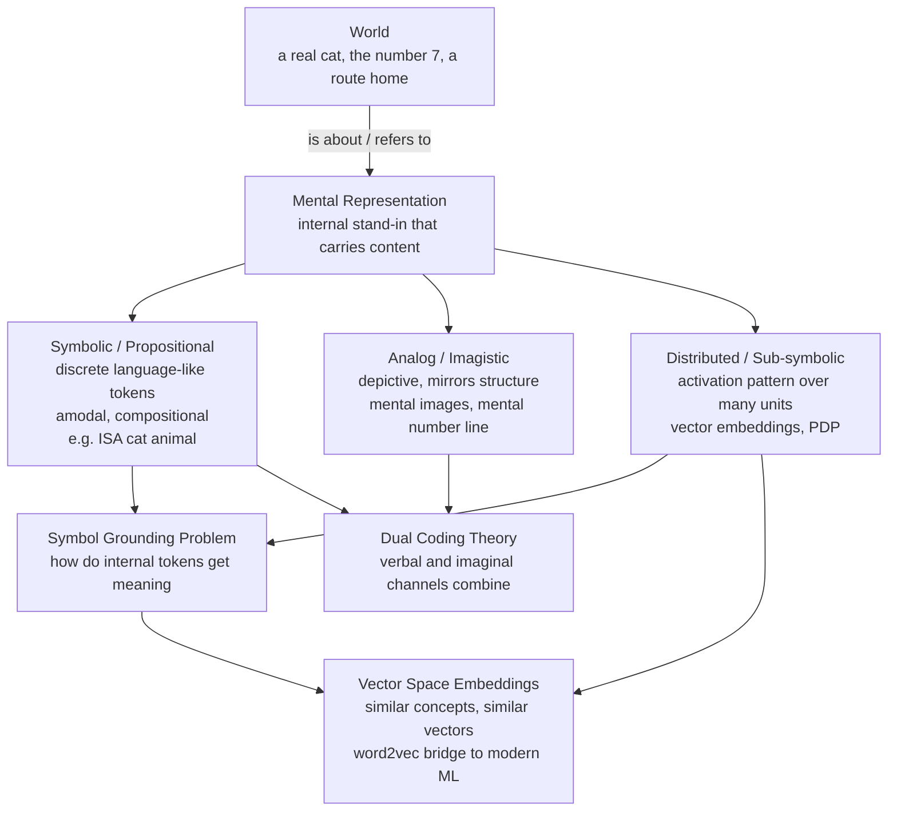

# 🧠 Mental Representation

> [!abstract] TL;DR
> A mental representation is an internal state that **stands in for** something else and carries **content** ("aboutness") — it is the mind's currency for thought. The central debates are about its **format**: language-like propositional symbols, picture-like analog images, or activation patterns spread across many units (distributed / sub-symbolic). How those internal states connect to the world is the **symbol grounding problem**, and modern vector embeddings like word2vec are the engineering descendants of the distributed view.

---

## Intuition

**Analogy:** A thermostat's bimetallic strip bends by an amount that *stands for* the room temperature — the strip is not the heat, but its state is reliably *about* the heat, and the furnace acts on the strip as if it were the temperature. A mental representation is the same trick scaled up: a brain state that stands in for something absent (a cat, the number 7, your route home) so that reasoning can operate on the stand-in instead of the world itself.

The key move is that a representation has two faces: a **vehicle** (the physical/neural state doing the standing-in) and a **content** (what it is about). Thought is the manipulation of vehicles in a way that respects their contents. This is the core wager of the **Representational Theory of Mind**: cognition is computation over contentful internal states.

---

## How It Works

### Core Mechanics

1. **Aboutness (intentionality).** A representation is defined by having *content* — it points beyond itself. A ring on a tree stands for a year; a neuron's firing can stand for a vertical edge. Content is what distinguishes a representation from a mere physical event.
2. **Vehicle vs content.** The same content ("the cat is on the mat") can ride on different vehicles: a sentence, an image, a vector. The same vehicle can, in different contexts, carry different content. Cognitive science studies which **format** the mind actually uses.
3. **Format shapes computation.** Format is not decorative — it determines which operations are cheap. Symbolic formats make logical inference and compositionality cheap; analog formats make spatial comparison and rotation cheap; distributed formats make similarity and generalization cheap.
4. **Three canonical formats:**
   - **Propositional / symbolic** — discrete, language-like tokens combined by rules (a "language of thought"). Amodal, compositional, arbitrary mapping to referents.
   - **Analog / imagistic** — depictive states whose *structure mirrors* what they represent. A mental image preserves relative distances; the **mental number line** preserves magnitude ordering.
   - **Distributed / sub-symbolic** — content is a *pattern of activation* over many units; no single unit "means" the concept. This is the connectionist stance (Rumelhart & McClelland's PDP).
5. **The imagery debate.** Do we literally use pictures? **Kosslyn** argues for a *depictive* format realized in retinotopic cortex (scanning larger images takes longer, consistent with a real spatial medium). **Pylyshyn** counters that image-like *behavior* can be produced by underlying propositional representations plus **tacit knowledge** — subjects unconsciously simulate what *would* happen with a real object, so the timing data do not prove a pictorial medium.
6. **Dual coding (Paivio).** Verbal and imaginal codes are two partly independent systems; concrete words ("apple") recruit both channels and are remembered better than abstract words ("justice") — the classic concreteness effect.
7. **The symbol grounding problem (Harnad).** If symbols get their meaning only from other symbols (a dictionary defining words with more words), the system never touches the world — it is a "Chinese-Chinese dictionary." Grounding requires connecting at least some symbols to sensorimotor experience, motivating **sub-symbolic** and embodied representations.
8. **Vector-space representations.** Distributed vectors formalize the idea that *similar things have similar representations*. Word2vec embeds words so that geometric distance tracks semantic similarity, and directions encode relations. This is the direct computational heir of connectionism and a working (partial) response to grounding via distributional structure.

### Format Map



---

## Key Concepts

### Secondary (explain to a curious beginner)
- **A representation stands for something.** A map stands for a city; a mental image stands for your kitchen. The mind runs on stand-ins so it can think about things that are not present.
- **Two ways to represent a cat.** You can *describe* it in word-like symbols ("furry, four legs, meows") or *picture* it. Cognitive scientists argue about which the brain really uses — probably both.
- **Cognitive maps (Tolman).** Rats that learned a maze took clever shortcuts when the usual path was blocked, as if consulting an internal *map* rather than a memorized list of turns — early evidence for structured internal representations.

### Undergraduate (needs some cognitive-science background)
- **Representational Theory of Mind (RTM).** Mental states are relations to internal representations; thinking is rule-governed manipulation of them. Fodor's **Language of Thought** is the strong symbolic version: a compositional, systematic "mentalese."
- **Propositional vs analog format.** Propositional = discrete, amodal, truth-evaluable, compositional. Analog = continuous, modality-specific, structure-preserving. The **imagery debate** (Kosslyn vs Pylyshyn) is a fight over which format underlies visual imagination.
- **Dual Coding Theory.** Verbal (logogen) and non-verbal (imagen) systems; concreteness and picture-superiority effects follow from having two retrieval routes.
- **Localist vs distributed.** *Localist* = one unit per concept (a "grandmother cell," one-hot vector). *Distributed* = each concept is a pattern over shared units, and each unit participates in many concepts. Distributed codes generalize and **degrade gracefully**.
- **Analog magnitude / the mental number line.** Numerical quantity is represented on a compressed, ordered continuum; distance and size effects (comparing 8 vs 9 is slower than 2 vs 9) reveal its analog nature.

### Graduate (system-level thinking)
- **Sub-symbolic computation (connectionism / PDP).** Cognition emerges from the dynamics of many simple units; "symbols" are approximate, higher-level descriptions of stable activation patterns, not primitives. Smolensky's proper-treatment-of-connectionism argues symbols are the emergent "macro" level of a sub-symbolic "micro" substrate.
- **The symbol grounding problem (Harnad 1990).** Pure symbol systems are semantically parasitic; grounding demands a bottom layer of iconic/sensorimotor representations from which categorical symbols are learned. Bridges to embodied and enactive cognition.
- **Pylyshyn's tacit-knowledge critique.** Imagery experiments may reveal *cognitively penetrable* task strategies, not fixed architecture — a methodological warning that behavioral signatures underdetermine representational format.
- **Distributional semantics as grounding-by-structure.** Word2vec / embedding spaces show that rich relational content can arise from co-occurrence statistics alone, reframing (though not fully solving) grounding: meaning as position in a similarity manifold. Connects to population coding in the brain, where a stimulus is a vector across a neural population.
- **Vehicle/content and the frame problem.** Choice of format determines what is easy to hold fixed and what must be recomputed — a live issue in both classical AI and cognitive architecture.

---

## Python Demo

```python
# Contrast SYMBOLIC (localist one-hot) vs DISTRIBUTED representations.
# We build 6 concepts in two families (animals, vehicles), give the
# distributed version hand-crafted semantic feature vectors so that
# similar concepts have similar vectors, then:
#   1. compare cosine-similarity structure (one-hot has none; distributed does)
#   2. visualize both similarity matrices as heatmaps
#   3. show GRACEFUL DEGRADATION: add noise and see which representation
#      still recovers the right concept.
import numpy as np
import matplotlib.pyplot as plt

rng = np.random.default_rng(0)

concepts = ["cat", "dog", "wolf", "car", "truck", "bus"]
features = ["animal", "vehicle", "size", "has_legs",
            "has_wheels", "domestic", "passengers"]

# --- Distributed representation: each concept is a pattern over shared features ---
#            animal vehicle size legs wheels domestic passengers
D = np.array([
    [1, 0, 0.2, 1, 0, 1, 0.1],   # cat
    [1, 0, 0.4, 1, 0, 1, 0.1],   # dog
    [1, 0, 0.5, 1, 0, 0, 0.1],   # wolf
    [0, 1, 0.4, 0, 1, 1, 0.3],   # car
    [0, 1, 0.9, 0, 1, 0, 0.2],   # truck
    [0, 1, 1.0, 0, 1, 1, 1.0],   # bus
], dtype=float)

# --- Symbolic / localist representation: one-hot, each concept its own dimension ---
S = np.eye(len(concepts))

def cosine_matrix(M):
    norms = np.linalg.norm(M, axis=1, keepdims=True)
    U = M / np.clip(norms, 1e-12, None)
    return U @ U.T

sim_D = cosine_matrix(D)
sim_S = cosine_matrix(S)

print("Distributed similarity (cat vs dog):  %.2f" % sim_D[0, 1])
print("Distributed similarity (cat vs bus):  %.2f" % sim_D[0, 5])
print("One-hot     similarity (cat vs dog):  %.2f" % sim_S[0, 1])
# -> distributed: cat~dog high, cat~bus low; one-hot: everything unrelated (0)

# --- Graceful degradation: corrupt a concept and find its nearest clean concept ---
def nearest(query, clean_matrix):
    sims = cosine_matrix(np.vstack([query, clean_matrix]))[0, 1:]
    return int(np.argmax(sims)), sims

noise_level = 0.35
print("\nAdd noise to 'dog' and recover nearest concept:")
for name, M in [("distributed", D), ("one-hot", S)]:
    hits = 0
    trials = 200
    for _ in range(trials):
        noisy = M[1] + rng.normal(0, noise_level, size=M.shape[1])
        idx, _ = nearest(noisy, M)
        hits += (idx == 1)              # did we still land on 'dog'?
    print("  %-11s recovers 'dog' %3d%% of the time" % (name, int(100 * hits / trials)))
# Distributed stays robust (neighbors share features); one-hot collapses:
# with all off-target dims equal, any noise easily flips the winner.

# --- Visualize both similarity structures ---
fig, axes = plt.subplots(1, 2, figsize=(11, 4.5))
for ax, sim, title in [(axes[0], sim_S, "Symbolic / one-hot"),
                       (axes[1], sim_D, "Distributed / vector")]:
    im = ax.imshow(sim, vmin=0, vmax=1, cmap="viridis")
    ax.set_xticks(range(len(concepts)), concepts, rotation=45, ha="right")
    ax.set_yticks(range(len(concepts)), concepts)
    ax.set_title(title)
    fig.colorbar(im, ax=ax, fraction=0.046)
fig.suptitle("Cosine similarity: one-hot carries no structure, "
             "distributed encodes semantic neighborhoods")
fig.tight_layout()
plt.show()
```

Running it shows the distributed matrix has bright animal and vehicle blocks (cat-dog-wolf mutually similar, car-truck-bus mutually similar) while the one-hot matrix is a bare diagonal — every concept equidistant from every other. Under noise, the distributed code still recovers "dog" the large majority of the time; the one-hot code flips essentially at random. That robustness *is* graceful degradation, the hallmark advantage of distributed representation.

---

## Real-World Applications

> **Word embeddings (word2vec / GloVe).** The engineering realization of distributed representation: words become dense vectors where cosine similarity tracks meaning and vector offsets encode relations ("king − man + woman ≈ queen"). This is Rumelhart-and-McClelland connectionism turned into a production NLP primitive.

> **The mental number line in interfaces and dyscalculia research.** Analog magnitude representation predicts distance and size effects; educational tools that make the number line spatial (number-line games) improve numerical cognition, and its disruption is a marker in developmental dyscalculia.

> **Cognitive maps in navigation and RL.** Tolman's structured spatial representations map onto hippocampal place/grid cells and onto model-based reinforcement learning, where an agent stores a *transition model* (a map) rather than a cached policy — enabling shortcut and detour behavior.

> **Population coding in neural prosthetics.** The brain represents movement direction as a distributed vector across a neuron population; brain-computer interfaces decode intended motion by reading that population vector — a literal distributed representation put to clinical use.

---

## Common Pitfalls

- **Confusing vehicle with content.** "The image in my head" is not a picture *in* the brain that a homunculus views; it is a neural vehicle *with* depictive content. Reifying the picture invites an infinite regress of inner viewers.
- **Treating one-hot as "the meaning."** A localist / one-hot code is a *label*, not a semantic representation — it has zero similarity structure, so it cannot generalize. Beginners often mistake indexing for understanding.
- **Assuming behavior reveals format.** Pylyshyn's warning: image-like reaction-time curves can be produced by non-pictorial representations plus tacit knowledge. Cognitive penetrability means behavioral signatures underdetermine the underlying format.
- **Thinking embeddings "solve" grounding.** Distributional vectors capture relational meaning from co-occurrence, but a system that only relates symbols to symbols still faces Harnad's problem until some representations connect to perception and action.
- **Forcing one format everywhere.** The evidence favors a *plurality* of formats (propositional, analog, distributed) recruited for different tasks; insisting the mind is "all symbols" or "all vectors" is a common overreach.
- **Ignoring compositionality costs.** Distributed codes generalize but struggle to represent structured, systematic relations ("John loves Mary" ≠ "Mary loves John") without extra binding machinery — the classic Fodor & Pylyshyn critique of connectionism.

---

## Related Concepts

- [[Word2Vec]] — the canonical distributed representation of concepts; embeds words so similar meanings sit close in vector space, the ML descendant of connectionism.
- [[Word_Embeddings]] — the broader family of dense vector representations; concrete demonstration that geometric distance can carry semantic content.
- [[Lexical_Semantics]] — how word meaning is structured (senses, relations, features); the linguistic counterpart to representational format debates.
- [[Cognitive_Semantics_and_Metaphor]] — embodied, image-schematic view of meaning that resonates with analog and grounded representation.
- [[Neural_Network_Basics]] — the computational substrate of sub-symbolic / distributed representation, where concepts are activation patterns over units.
- [[Population_Coding_and_Decoding]] — the neuroscience realization of distributed representation: a stimulus encoded as a vector across a neural population, with graceful degradation.
- [[Learning_and_Memory_Systems]] — how contentful representations are stored, consolidated, and retrieved in the brain.

---

## Review Questions

1. **(Conceptual)** Distinguish the *vehicle* and the *content* of a mental representation, and explain why the "picture in the head" intuition risks an infinite regress. What does it mean to say a representation has "aboutness"?
2. **(Scenario)** You must build a system that answers "is a wolf more like a dog or more like a bus?" You can encode concepts as one-hot labels or as distributed feature vectors. Which format do you pick, what property of that format makes the question answerable, and how would you show it degrades gracefully under noise?
3. **(Trade-off)** Kosslyn claims imagery uses a depictive medium; Pylyshyn says propositional representations plus tacit knowledge produce the same data. Explain why reaction-time evidence underdetermines the format, and what kind of evidence (behavioral or neural) could actually adjudicate the debate.

---

## Sources

- Pitt, D. "Mental Representation." *Stanford Encyclopedia of Philosophy.* [https://plato.stanford.edu/entries/mental-representation/](https://plato.stanford.edu/entries/mental-representation/)
- Harnad, S. (1990). "The Symbol Grounding Problem." *Physica D*, 42, 335–346. [https://doi.org/10.1016/0167-2789(90)90087-6](https://doi.org/10.1016/0167-2789(90)90087-6)
- Tolman, E. C. (1948). "Cognitive Maps in Rats and Men." *Psychological Review*, 55(4), 189–208. [https://doi.org/10.1037/h0061626](https://doi.org/10.1037/h0061626)
- Paivio, A. (1986). *Mental Representations: A Dual Coding Approach.* Oxford University Press.
- Pylyshyn, Z. W. (2003). "Return of the Mental Image: Are There Really Pictures in the Brain?" *Trends in Cognitive Sciences*, 7(3), 113–118. [https://doi.org/10.1016/S1364-6613(03)00003-2](https://doi.org/10.1016/S1364-6613(03)00003-2)
- Mikolov, T., et al. (2013). "Efficient Estimation of Word Representations in Vector Space." [https://arxiv.org/abs/1301.3781](https://arxiv.org/abs/1301.3781)

---

#cognitive-science #mental-representation #distributed-representation #imagery #propositional
