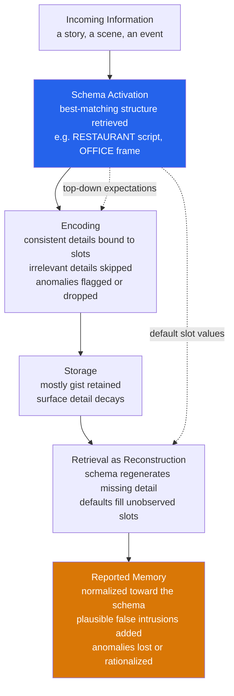

# 🧩 Schemas and Mental Models

> [!abstract] TL;DR
> A **schema** is a structured, reusable packet of knowledge — a mental template with labelled slots and default values — that the mind uses to organize experience, guide what it encodes, fill in what it never observed, and reconstruct what it later recalls. Specialized schemas include **scripts** (stereotyped event sequences, like dining at a restaurant) and **frames** (structured descriptions of objects and situations). A closely related idea, the **mental model**, is a runnable internal simulation of how some part of the world works, used to reason by imagined manipulation rather than by formal logic. Schemas make cognition fast and inference-rich, but the same machinery produces predictable costs: memory drifts toward the schema, anomalies are lost or "normalized," and stereotypes are exactly schemas applied to people.

---

## Intuition

**Analogy:** Think of a schema as a **pre-printed form with default entries already filled in**. Imagine a hospital admission form whose blanks — name, complaint, allergies, next of kin — come pre-filled with the *most common* answer. When a new patient walks in, the clerk does not write down everything from scratch; she only records the fields that *differ* from the defaults and leaves the rest as printed. This is enormously efficient. But months later, if someone asks "did that patient list any allergies?", the clerk who lost the form will glance at a *blank* copy of the same template, see the default "none," and confidently report "no allergies" — even though she never actually knew. She has reconstructed a memory out of the template's defaults, and it *feels* exactly like a real recollection.

That is the double edge of schemas in one image. The template lets you process a flood of experience cheaply by noting only the deviations, and it lets you answer questions about things you never encoded by reading off the defaults. But retrieval is not a video playback — it is a **reconstruction** that leans on the template, so your memory quietly migrates toward the standard form. A **mental model** is the next step up: not a static form but a little working *machine* in your head — you can turn its handle and watch what happens, the way you mentally rotate a suitcase to see if it will fit in an overhead bin before you lift it.

---

## How It Works

### Schemas as structured knowledge frameworks

The modern concept traces to **Frederic Bartlett's** *Remembering* (1932). Bartlett rejected the then-dominant view of memory as the faithful storage and replay of traces. He had British participants read an unfamiliar Native American folk tale, **"The War of the Ghosts,"** rich with details that clashed with their cultural expectations (canoes and seal-hunting, ghosts, a supernatural cause of death), then reproduce it repeatedly over hours, days, and months. The reproductions were systematically transformed: they got **shorter**, the culturally **alien details dropped out or were rationalized** into familiar forms (canoes became boats), and the whole story **drifted toward the participants' own cultural schema**. Bartlett concluded that memory is an **active reconstruction** governed by "an effort after meaning" — the mind reshapes the unfamiliar into the expected.

A schema has three defining properties that explain this:

1. **Slots with variables and default values.** A `BUYING` schema has slots for buyer, seller, goods, and price. Unfilled slots take defaults ("if unspecified, payment was money"). Defaults are what let a schema answer questions about details you never observed.
2. **Hierarchy and embedding.** Schemas nest: a `FACE` schema contains `EYES`, `NOSE`, `MOUTH` sub-schemas; a `RESTAURANT` script contains an `ORDERING` scene. Activating the parent primes the children.
3. **Abstraction over instances.** A schema is a generalization distilled from many episodes, so it applies to novel cases it was never built from — you can navigate a restaurant you have never entered.

### Scripts and frames — two important specializations

- **Scripts** (**Schank & Abelson**, *Scripts, Plans, Goals, and Understanding*, 1977) are schemas for **stereotyped event sequences**. The canonical example is the **restaurant script**: enter, wait to be seated, read menu, order, eat, pay, tip, leave. Scripts were built as an AI theory of how a program could understand a story that *omits* obvious steps — "John ate at a restaurant, then caught a bus" — by inferring the unstated ordering, eating, and paying from the script's default chain. Human readers do exactly the same inferential filling, which is why they later "remember" script-implied events that were never stated.
- **Frames** (**Marvin Minsky**, "A Framework for Representing Knowledge," 1975) are the parallel proposal for **structured descriptions of objects and situations**. A frame for a room has terminals for walls, a ceiling, and a door, with default expectations attached; when you enter a real room you bind the terminals to observed values and inherit the rest. Minsky's frames and Schank's scripts are two branches of the same 1970s insight that intelligence requires large stores of pre-packaged, default-laden world knowledge.

### How schemas guide encoding, inference, and retrieval

A schema is active at **three** stages of memory, and distorts at each:

- **Encoding.** The active schema is a top-down filter. **Schema-consistent** information is bound quickly to its slot; **schema-irrelevant** information is often not encoded at all; **schema-inconsistent** information gets *either* dropped *or*, if distinctive, encoded especially well as an anomaly (the two fates produce the classic U-shaped memory advantage for both congruent and flagrantly incongruent items).
- **Inference / comprehension.** The schema supplies **default values and bridging inferences** so that gaps in the input are filled automatically. This is what makes text comprehensible: sentences do not state the obvious, and the reader's schema supplies it.
- **Retrieval.** Because storage keeps mostly gist, retrieval **regenerates** surface detail from the schema. Missing details are filled with defaults; the result is normalized toward the schema; plausible-but-false **intrusions** are added. **Brewer & Treyens (1981)** demonstrated this vividly: participants left briefly in an academic office later "remembered" books that were never there (schema default for an office) and forgot the genuinely present but schema-violating skull and picnic basket.

### The benefit / cost trade-off

The same mechanism produces both sides of the ledger. **Benefits:** speed (only deviations must be processed), inference (defaults answer unobserved questions), comprehension (gaps are bridged), and prediction (what happens next is anticipated). **Costs:** systematic memory distortion toward the schema, loss of anomalous information, overconfident false recall, and — when the schema is about a *social group* — **stereotyping**, which is nothing more exotic than a person-schema applied with the same default-filling machinery.

### Mental models — runnable internal simulations

**Kenneth Craik** (*The Nature of Explanation*, 1943) proposed that the mind carries "small-scale models" of reality that it can run to predict events before they happen. **Philip Johnson-Laird** turned this into a full theory of reasoning: people reason not by applying formal logic rules but by **constructing a mental model of the premises, reading a putative conclusion off the model, and searching for counterexample models**. The theory's signature prediction is that difficulty scales with the **number of models** you must hold in mind — which is why exclusive-or and multiply-quantified statements are hard, and why people commit predictable errors (the "illusory inferences") when they fail to flesh out all the models a set of premises permits.

### Related structures

- **Structure-mapping for analogy** (**Gentner**, 1983): a mental model of a familiar *source* domain is mapped onto an unfamiliar *target* by aligning **relational structure**, letting you import inferences — the machinery underlying [[Analogical_Reasoning]].
- **Naive / intuitive theories:** people hold schema-like *folk theories* — **folk physics** (impetus intuitions that violate Newton), **folk biology** (essentialist category reasoning about living kinds), and **folk psychology / theory of mind** (predicting behaviour from beliefs and desires). These are coherent, inference-generating models, not random misconceptions.
- **Situation models** (**Kintsch's** Construction–Integration model, 1988): understanding a text builds three levels — surface form, a **textbase** of propositions, and a **situation model**, the reader's schema-enriched mental simulation of the state of affairs described. Comprehension *is* the construction of that model, which is why you remember the *situation* long after forgetting the exact words.
- **Schemas and expertise:** expert performance is largely the possession of thousands of richly organized, domain-specific schemas. Chess masters recall board positions vastly better than novices — but *only* for realistic positions their schemas can encode; on random positions the advantage vanishes (Chase & Simon, 1973). Expertise is schema-indexed perception.
- **User mental models in HCI:** users build a mental model of how a device works and act on *that*, not on the engineer's design model. Usability failures occur when the user's model diverges from the system's behaviour; good design communicates a correct model through visible structure, feedback, and constraints (Norman).



---

## Key Concepts

### Secondary

- **Schema (mental template).** A packet of organized knowledge about a kind of thing or situation, built up from experience, that tells you what to expect and helps you fill in what you did not actually see.
- **Script.** A schema for a familiar *sequence of events* — like everything that happens, in order, when you eat at a restaurant or visit a doctor. Scripts let you understand stories that skip the obvious steps.
- **Reconstructive memory.** Remembering is not replaying a recording; it is *rebuilding* an event using both real traces and your general expectations. That is why two people honestly remember the same event differently.
- **Bartlett and "The War of the Ghosts."** When British readers repeatedly retold an unfamiliar folk tale, it got shorter and steadily changed to fit their own culture — the first clear demonstration that memory is shaped by pre-existing knowledge.
- **Stereotype as a schema.** A stereotype is just a schema about a *group of people*. It runs the same "fill in the defaults" process — which is why it can feel like knowledge while producing biased, false conclusions.

### Undergraduate

- **Slots, variables, and defaults.** Formally, a schema is a frame with labelled slots, each accepting a range of values and carrying a **default**. Defaults are the source of both cheap inference and false memory: they answer questions about details that were never encoded.
- **Encoding consequences (the congruency and incongruency effects).** Schema-consistent items are remembered well because they are easily integrated; **flagrantly** inconsistent items can also be remembered well because they demand extra processing as anomalies; **schema-irrelevant** items fare worst. Net effect: memory is systematically *biased*, not merely *weaker*.
- **Scripts and default-based inference (Schank & Abelson).** A comprehension system fills unstated but script-implied events, then cannot later distinguish inferred events from stated ones — the mechanism behind "remembering" things that were only implied.
- **Frames (Minsky).** Object/situation knowledge as networks of frames with terminals and inheritance; entering a scene binds observed values and inherits defaults for the rest. The direct ancestor of object-oriented representation and of modern knowledge graphs.
- **Mental models of reasoning (Johnson-Laird).** People reason by building and manipulating models of possibilities rather than by applying inference rules; task difficulty tracks the **number of models** that must be represented, predicting both which inferences are hard and which systematic errors occur.
- **Situation models (Kintsch's Construction–Integration).** Comprehension proceeds by *constructing* a loosely connected network of propositions and knowledge, then *integrating* it via spreading activation into a coherent situation model. Explains why gist survives when wording is forgotten.

### Graduate

- **Schema theory versus exemplar and connectionist accounts.** Classical schema theory posits explicit abstracted structures; connectionist and exemplar models reproduce many "schema effects" (defaults, prototype extraction, graceful degradation) *without* storing an explicit schema — schema-like behaviour emerges from superposed traces. The dispute over whether schemas are *represented* or merely *emergent* parallels the symbolic-versus-connectionist debate in [[Computational_Theory_of_Mind]].
- **The anomaly problem and schema-plus-tag / schema copy-plus-correction.** How is schema-inconsistent information stored if the schema normalizes everything? Proposals include tagging deviations onto the schema versus building a corrected copy — a live modelling question for both memory research and knowledge representation.
- **Predictive processing reframing.** Under the free-energy / predictive-coding view, schemas are **generative priors**; perception and memory minimize prediction error against them. Normalization toward the schema is simply strong priors dominating weak, decayed sensory evidence — connecting Bartlett to Bayesian brain theory and to [[Bayesian_Reasoning]].
- **Mental-model theory versus mental-logic and probabilistic accounts.** Johnson-Laird's model theory competes with rule-based "mental logic" and with Bayesian/probabilistic theories of reasoning; the empirical battleground is the pattern of *systematic errors* (illusory inferences, belief bias, the selection task) that each framework predicts.
- **Schema-driven distortion as a feature, not a bug.** From a rational-analysis standpoint, reconstructing missing detail from a well-calibrated prior is *optimal* given lossy storage and a structured world; "false memories" are the unavoidable cost of an inference system that is, on average, right. This reframes eyewitness unreliability as adaptive inference operating outside its design conditions.

---

## Python Demo

```python
import numpy as np
import matplotlib
matplotlib.use("Agg")
import matplotlib.pyplot as plt

# ------------------------------------------------------------------
# Schema-driven memory distortion: a simulation of Bartlett's
# "War of the Ghosts" serial-reproduction effect (Bartlett, 1932).
#
# Bartlett had British readers repeatedly recall a Native American
# folk tale full of details that clashed with their cultural schema
# (canoes and seal-hunting, ghosts, a supernatural cause of death).
# Across reproductions the recalled story (a) got SHORTER, (b) LOST
# its schema-inconsistent "alien" details, and (c) DRIFTED toward the
# reader's own cultural schema as surviving details were rationalized
# into familiar forms -- Bartlett's "effort after meaning".
#
# We place each remembered detail on a schema-consistency axis in
# [0, 1]:  0.0 = maximally alien/inconsistent, 1.0 = fully consistent
# with the reader's schema.  At each reproduction, every surviving
# detail is (i) kept or dropped with a probability that RISES with its
# consistency, (ii) if kept, nudged TOWARD the schema (normalization),
# and (iii) occasionally joined by a new schema-consistent intrusion.
# ------------------------------------------------------------------

rng = np.random.default_rng(7)

# --- The original encoded story: 24 details ------------------------
# A realistic mix: many alien details, some neutral, some familiar.
original = np.concatenate([
    rng.uniform(0.00, 0.30, 10),   # strongly INCONSISTENT (ghosts, seal-hunting)
    rng.uniform(0.30, 0.65, 8),    # neutral / ambiguous
    rng.uniform(0.65, 1.00, 6),    # already schema-consistent
])

SCHEMA_MEAN = 0.85     # the attractor: the reader's cultural schema
N_REPRO     = 7        # number of serial reproductions
N_CHAINS    = 40       # independent recall chains (like many participants)

def retain_prob(c):
    """Survival probability of a detail, rising with its consistency."""
    return 0.35 + 0.55 * c          # inconsistent ~0.35, consistent ~0.90

def reproduce(details):
    """One reproduction: drop details, normalize survivors, add intrusions."""
    kept = []
    for c in details:
        if rng.random() < retain_prob(c):
            # "Effort after meaning": pull the survivor toward the schema.
            kept.append(c + 0.30 * (SCHEMA_MEAN - c))
    if rng.random() < 0.5:              # occasional plausible false intrusion
        kept.append(rng.uniform(0.70, 1.0))
    return np.array(kept) if kept else np.array([SCHEMA_MEAN])

# --- Run many independent recall chains ----------------------------
mean_consistency = np.zeros((N_CHAINS, N_REPRO + 1))
n_remembered     = np.zeros((N_CHAINS, N_REPRO + 1))
frac_alien       = np.zeros((N_CHAINS, N_REPRO + 1))

for chain in range(N_CHAINS):
    details = original.copy()
    for step in range(N_REPRO + 1):
        if step > 0:
            details = reproduce(details)
        mean_consistency[chain, step] = details.mean()
        n_remembered[chain, step]     = len(details)
        frac_alien[chain, step]       = np.mean(details < 0.30)

x = np.arange(N_REPRO + 1)
m = mean_consistency.mean(axis=0)

# --- Figure --------------------------------------------------------
fig, (ax1, ax2) = plt.subplots(1, 2, figsize=(14, 5.5))
fig.suptitle("Schema-Driven Memory Distortion: Bartlett's Serial-Reproduction Effect",
             fontsize=13, fontweight="bold")

# Panel 1: drift of schema-consistency toward the schema attractor
for chain in range(N_CHAINS):
    ax1.plot(x, mean_consistency[chain], color="#94a3b8", alpha=0.15, lw=0.8)
ax1.plot(x, m, color="#2563eb", lw=3, marker="o", label="Mean recalled consistency")
ax1.axhline(SCHEMA_MEAN, color="#dc2626", ls="--", lw=2, label="Reader's schema (attractor)")
ax1.axhline(original.mean(), color="#059669", ls=":", lw=2, label="Original story mean")
ax1.set_xlabel("Reproduction number")
ax1.set_ylabel("Mean schema-consistency of recalled details")
ax1.set_title("Recall drifts TOWARD the schema")
ax1.set_ylim(0, 1)
ax1.legend(fontsize=8, loc="lower right")
ax1.grid(alpha=0.2)

# Panel 2: the memory shortens and the alien details vanish
ax2.plot(x, n_remembered.mean(axis=0), color="#7c3aed", lw=3, marker="s",
         label="Details remembered (count)")
ax2.set_xlabel("Reproduction number")
ax2.set_ylabel("Number of details remembered", color="#7c3aed")
ax2.tick_params(axis="y", labelcolor="#7c3aed")
ax2.set_title("Memory shortens; alien details drop out")
ax2.grid(alpha=0.2)

ax2b = ax2.twinx()
ax2b.plot(x, frac_alien.mean(axis=0) * 100, color="#d97706", lw=3, marker="^",
          label="Schema-inconsistent details retained")
ax2b.set_ylabel("Alien details remaining (percent)", color="#d97706")
ax2b.tick_params(axis="y", labelcolor="#d97706")
ax2b.set_ylim(0, 45)

lines1, labels1 = ax2.get_legend_handles_labels()
lines2, labels2 = ax2b.get_legend_handles_labels()
ax2.legend(lines1 + lines2, labels1 + labels2, fontsize=8, loc="upper right")

plt.tight_layout(rect=[0, 0, 1, 0.95])
plt.savefig("schema_memory_distortion.png", dpi=110, bbox_inches="tight")
plt.show()

# --- Console summary -----------------------------------------------
print("Reproduction  :  " + "   ".join(f"{i}" for i in x))
print("Consistency   :  " + "  ".join(f"{v:.2f}" for v in m))
print("Details left  :  " + "  ".join(f"{v:4.1f}" for v in n_remembered.mean(axis=0)))
print("Alien percent :  " + "  ".join(f"{v:4.0f}" for v in frac_alien.mean(axis=0) * 100))
print()
print(f"Original mean consistency : {original.mean():.2f}")
print(f"Final mean consistency    : {m[-1]:.2f}  (drifted toward schema = {SCHEMA_MEAN})")
```

**What the demo shows.** Panel 1 plots forty independent recall chains (faint grey) and their mean (blue). The recalled memory starts near the *original* story's mixed consistency (green dotted line, ~0.43) and climbs steadily toward the reader's schema (red dashed attractor, 0.85) — Bartlett's normalization made quantitative. Panel 2 shows the two accompanying signatures: the number of remembered details **shrinks** as low-consistency items are preferentially dropped, and the percentage of surviving **schema-inconsistent** ("alien") details collapses toward zero. The model is deliberately minimal — three rules (consistency-weighted retention, pull-toward-schema, occasional intrusion) reproduce all three of Bartlett's classic findings.

---

## Real-World Applications

> **Eyewitness testimony and the law.** Reconstructive, schema-driven memory is why eyewitness accounts are unreliable and why leading questions are so dangerous. A witness's crime schema fills gaps with defaults ("the robber must have had a weapon"), post-event information is absorbed as if witnessed, and confidence rises even as accuracy does not. This is the applied core of Elizabeth Loftus's misinformation research and a leading cause of wrongful convictions.

> **Natural-language understanding and AI knowledge representation.** Schank's scripts and Minsky's frames were engineering proposals, and their descendants are everywhere: frame-based knowledge representation, object-oriented inheritance, semantic networks, and the slot-filling "frames" of task-oriented dialogue systems (a flight-booking bot literally fills origin, destination, and date slots with defaults). Modern large language models exhibit strong script-like default inference — filling unstated but implied steps — which is powerful and, for the same Bartlett reasons, a source of confident confabulation.

> **Instructional design and conceptual change.** Because naive theories (folk physics, folk biology) are coherent schemas, teaching is rarely a matter of adding facts — it is **conceptual change**, restructuring a resilient existing model. Effective instruction surfaces the learner's mental model, confronts it with anomalies it cannot explain, and scaffolds a replacement, rather than layering correct statements on top of an intact misconception.

> **Human-computer interaction and product design.** Users operate on their *mental model* of a system, not its actual mechanism. Don Norman's design principles — visible affordances, immediate feedback, natural mappings, and constraints — exist to install a correct user model. When the conceptual model is wrong (thermostats imagined as "valves" that heat faster when turned up higher), users make systematic, predictable errors; the fix is communicating the right model, not blaming the user.

> **Expertise, training, and simulation.** Since expert perception is schema-indexed (chess masters, radiologists reading scans, pilots reading instruments), training is largely the deliberate construction of rich domain schemas and runnable mental models through varied, feedback-dense practice. Flight and surgical simulators work precisely because they let trainees build and refine an accurate mental model of system dynamics before touching the real thing.

---

## Common Pitfalls

- **Treating memory as a recording.** The single most consequential error, in both everyday reasoning and courtrooms, is assuming vivid, confident recall is accurate playback. Bartlett's whole point is that recall is *reconstruction*; confidence tracks schema-fit and rehearsal, not fidelity.
- **Assuming schema-consistent means better remembered, full stop.** The relationship is non-monotonic: consistent items *and* flagrantly inconsistent (distinctive) items are both remembered well, while schema-*irrelevant* items fare worst. Modelling memory as a simple "consistency helps" gradient misses the incongruency advantage for salient anomalies.
- **Confusing a script with a mental model.** A script is a *static* stereotyped sequence you retrieve; a mental model is a *runnable* simulation you manipulate to derive novel predictions. Reasoning about a genuinely new situation needs a model, not merely a filed script — conflating them under-explains human flexibility.
- **Ignoring the cost side of schemas.** Schemas are so useful that people forget stereotyping, confirmation-style assimilation, and false memory are the *same* mechanism, not separate failures. Any account praising schema efficiency must budget for schema-driven distortion — see [[Cognitive_Biases]].
- **Reifying schemas as literal stored objects.** It is easy to slip from "the data look schema-like" to "there is a schema object in the head." Connectionist and exemplar models produce the same defaults and prototype effects without any explicitly stored schema, so schema *behaviour* does not by itself prove schema *representation*.
- **Mistaking naive theories for random ignorance.** Folk physics and folk biology are systematic, internally coherent models that generate consistent predictions. Teaching that treats them as empty gaps to be filled, rather than robust structures to be restructured, reliably fails.

---

## Related Concepts

- [[Memory_Systems]] — Provides the encoding/storage/retrieval architecture that schemas act upon; the reconstructive nature of long-term memory and the misinformation effect are the substrate for schema-driven distortion.
- [[Analogical_Reasoning]] — Gentner's structure-mapping theory is the mechanism by which a mental model of a familiar source domain is mapped onto an unfamiliar target; analogy is mental-model transfer across domains.
- [[Cognitive_Biases]] — Stereotyping, confirmation-style assimilation, and false recall are schema-driven distortion applied to social and evidential reasoning; this note is the bias-side counterpart to schema theory.
- [[Theories_of_Perception]] — Schemas are the top-down knowledge that guides perceptual hypothesis-testing; the constructivist view of perception (Gregory, predictive coding) is schema theory at the sensory front end.
- [[Computational_Theory_of_Mind]] — Frames and scripts are classic symbolic knowledge representations; the debate over whether schemas are explicitly represented or emergent maps directly onto the symbolic-versus-connectionist architecture question.
- [[Problem_Solving_and_Decision_Making]] — Expert problem-solving is schema-indexed pattern recognition; mental models are the internal simulations manipulated during planning and decision-making.
- [[Language_and_Thought]] — Comprehension builds Kintsch-style situation models; schemas supply the world knowledge that turns a string of words into an understood situation.
- [[Cognitive_Semantics_and_Metaphor]] — Fillmore-style frame semantics and conceptual metaphor treat linguistic meaning as schema/frame activation, applying schema theory to the structure of language.
- [[Attention_and_Cognitive_Load]] — Schemas reduce working-memory load by chunking many raw elements into a single structured unit, which is why expertise dramatically expands effective capacity.
- [[Bayesian_Reasoning]] — Under predictive-processing accounts, schemas function as generative priors, and normalization toward the schema is prior-dominated inference over decayed sensory evidence.

---

## Review Questions

### Secondary

1. Bartlett's British readers, retelling "The War of the Ghosts" over weeks, gradually changed the story so it made more sense to *them*. In your own words, what does this experiment show about how human memory works, and why is "memory is like a video recording" the wrong picture?
2. A "restaurant script" lists the usual steps of eating out: enter, order, eat, pay, leave. If a friend tells you "I went out for dinner last night," you assume they ordered food and paid — even though they never said so. Where did that extra information come from, and how could it lead you to "remember" something they never actually told you?
3. Explain how a stereotype is really just a schema applied to a group of people. Using that idea, give one reason stereotypes can feel like knowledge while still being wrong.

### Undergraduate

1. Distinguish a **script**, a **frame**, and a **mental model**, giving the originating theorist for each and one property that separates it from the other two. Then describe a single everyday episode (e.g., taking a train) and identify what each of the three would contribute to understanding and remembering it.
2. Schema theory predicts that both schema-*consistent* and flagrantly schema-*inconsistent* items can be well remembered, while schema-*irrelevant* items are remembered worst. Explain the encoding mechanism behind each of these three outcomes, and describe how Brewer & Treyens's (1981) office study provides evidence for the pattern.
3. Johnson-Laird claims people reason by building and manipulating mental models rather than by applying formal logic rules. State the theory's central prediction about what makes a deductive inference *hard*, and explain how it accounts for a systematic reasoning error that a pure rule-based account would not predict.

### Graduate

1. Connectionist and exemplar models can reproduce prototype extraction, default inference, and graceful degradation — the classic "schema effects" — *without* storing any explicit schema. What empirical evidence, if any, could distinguish a genuinely *represented* schema from merely schema-like *emergent* behaviour? Does the distinction have testable consequences, or is it purely interpretive?
2. Reframe Bartlett's normalization effect under the predictive-processing / Bayesian-brain view, treating schemas as generative priors over lossy stored evidence. On this account, are schema-driven "false memories" a malfunction or the expected output of an optimal inference system? Specify the conditions under which the same mechanism would be adaptive versus maladaptive, and what this implies for eyewitness reliability.
3. Kintsch's Construction–Integration model separates a text's *textbase* from the reader's *situation model*. Design an experiment whose results would dissociate the two levels — showing intact memory for the situation while surface and propositional memory are degraded (or vice versa) — and explain what pattern of recognition, inference, and paraphrase errors each level predicts.

---

## Sources

- [Bartlett, F. C. (1932). *Remembering: A Study in Experimental and Social Psychology*. Cambridge University Press.](https://doi.org/10.1017/CBO9780511759185)
- [Schank, R. C., & Abelson, R. P. (1977). *Scripts, Plans, Goals, and Understanding: An Inquiry into Human Knowledge Structures*. Lawrence Erlbaum.](https://doi.org/10.4324/9780203781036)
- [Minsky, M. (1975). "A Framework for Representing Knowledge." In P. H. Winston (Ed.), *The Psychology of Computer Vision*. McGraw-Hill.](https://web.media.mit.edu/~minsky/papers/Frames/frames.html)
- [Johnson-Laird, P. N. (1983). *Mental Models: Towards a Cognitive Science of Language, Inference, and Consciousness*. Harvard University Press.](https://www.hup.harvard.edu/catalog.php?isbn=9780674568822)
- [Kintsch, W. (1988). "The role of knowledge in discourse comprehension: A construction-integration model." *Psychological Review*, 95(2), 163–182.](https://doi.org/10.1037/0033-295X.95.2.163)
- [Brewer, W. F., & Treyens, J. C. (1981). "Role of schemata in memory for places." *Cognitive Psychology*, 13(2), 207–230.](https://doi.org/10.1016/0010-0285(81)90008-6)

---

#cognitive-science #schema #mental-models #scripts #knowledge-structures
