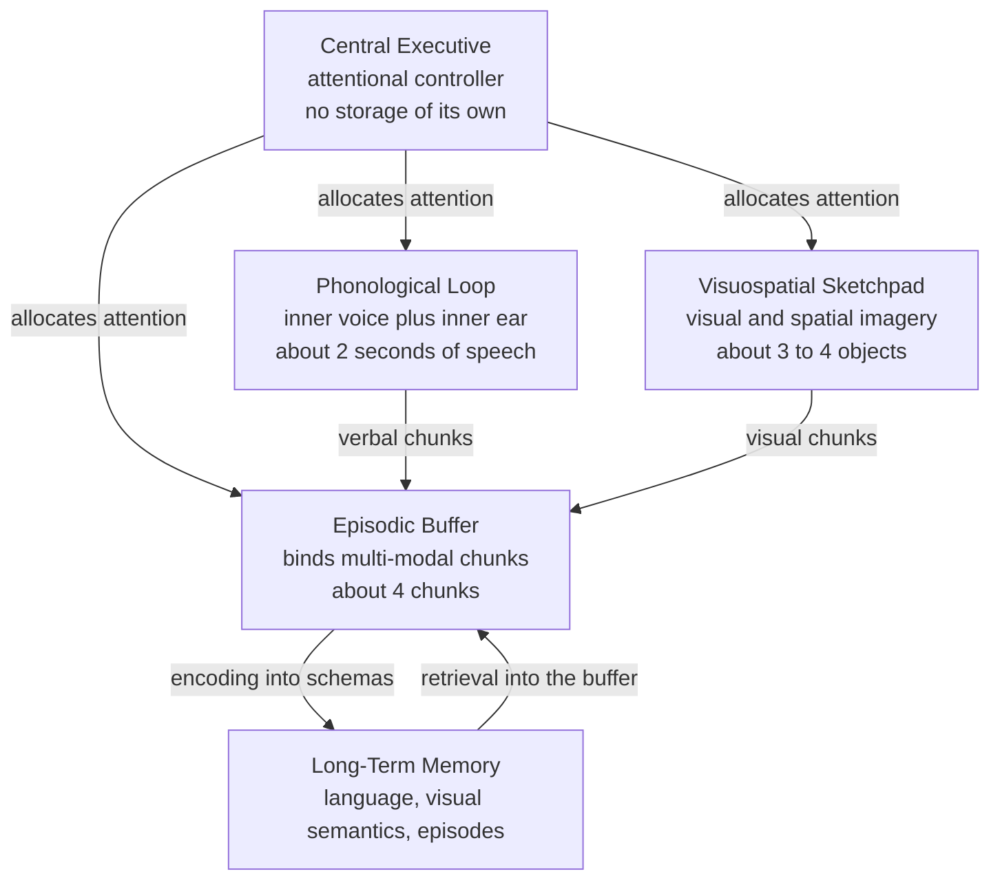

# 🧠 Working Memory and Cognitive Load

> [!abstract] TL;DR
> **Working memory** is the small, active workspace where the mind holds and manipulates information for the few seconds it is needed — reading a sentence, doing mental arithmetic, following directions. It is not a passive store but a *system* (Baddeley and Hitch): a **central executive** directing attention, a **phonological loop** for speech, a **visuospatial sketchpad** for imagery, and an **episodic buffer** binding it all. Its capacity is tiny — Miller's "7 ± 2" is really closer to Cowan's **~4 chunks** — and this bottleneck is the single most important constraint on learning. **Cognitive Load Theory** turns that constraint into instructional design: minimize wasted (extraneous) load so the limited workspace can build durable knowledge.

## Intuition

**Analogy: the workbench, not the warehouse.**

Imagine a carpenter with a huge warehouse of lumber and tools (long-term memory) but a tiny workbench (working memory) that holds only about four objects at once. To build anything, they must carry pieces from the warehouse to the bench, work on them, and clear them off to make room. Drop something and it is gone unless you carry it back. The warehouse is effectively infinite; the *bench* is the bottleneck. A skilled carpenter does not have a bigger bench — they pre-assemble sub-parts into a single unit (a **chunk**), so one "object" on the bench now carries far more content.

**Cognitive load** is simply how crowded the bench gets. Clutter it with irrelevant offcuts (badly designed instructions) and there is no room left to actually build. The whole art of teaching, interface design, and expertise is keeping the bench clear for what matters.

---

## How It Works

### From one store to a system

The **Atkinson–Shiffrin multi-store model (1968)** framed memory as a conveyor belt: sensory register → a single short-term store (~7 items, ~20 s, kept alive by rehearsal) → long-term store. It was foundational but too simple — it treated short-term memory as one undifferentiated box and could not explain why two verbal tasks interfere badly while a verbal and a visual task barely interfere at all.

**Baddeley and Hitch (1974)** replaced the single box with a *multi-component working memory*:

1. **Central executive** — a limited-capacity attentional controller with *no storage of its own*. It allocates attention, switches between tasks, inhibits distractions, and coordinates the subsystems. It is essentially **executive attention** applied to internal contents.
2. **Phonological loop** — the "inner voice" (articulatory rehearsal) plus the "inner ear" (a passive phonological store holding ~2 seconds of sound). This is where you silently repeat a phone number.
3. **Visuospatial sketchpad** — holds and manipulates visual and spatial imagery (mental rotation, remembering where objects are). Capacity ~3–4 objects.
4. **Episodic buffer** (added 2000) — a limited store (~4 chunks) that *binds* information from the loop, the sketchpad, and long-term memory into integrated, multi-modal episodes. It is the interface between working memory and long-term memory.

### Capacity: from "7 ± 2" to "~4"

- **Miller (1956), the magic number 7:** immediate memory span averages about seven *items* — but Miller's key insight was that the unit is the **chunk**, not the raw element. "F B I C I A" is six letters but two chunks.
- **Cowan (2001), the magic number 4:** once you prevent covert rehearsal and long-term-memory grouping, the true capacity of the focus of attention is closer to **3–5 chunks**. Miller's 7 was inflated by phonological rehearsal doing extra work.
- **Chunking** is the escape hatch: expertise converts many low-level elements into a few high-level units, so a chess master "sees" a board as a handful of meaningful configurations rather than 32 individual pieces.

### Signatures of the phonological loop

Two robust effects prove the loop is real and speech-based:

- **Phonological similarity effect:** lists of similar-sounding items (B, C, D, T, G) are recalled worse than dissimilar ones (F, K, R, Y, Q), because they blur in the phonological store. Meaning-based similarity barely matters — confirming the store codes *sound*, not sense.
- **Word-length effect:** short words are recalled better than long ones, because rehearsal is time-limited to ~2 seconds of speech. You can hold as many words as you can *say* in that window.

### Short-term memory vs working memory

They are not synonyms. **Short-term memory** = passive *storage* (a digit span you simply hold). **Working memory** = storage **plus** *manipulation* under executive control (holding digits while reversing them, or reading while tracking meaning). Working memory span tasks (reading span, operation span) predict real cognitive outcomes far better than simple digit span precisely because they tax the central executive.

### Cognitive Load Theory (Sweller, 1988)

Because working memory is the bottleneck, learning succeeds or fails on how load is managed. Sweller distinguishes three loads:

- **Intrinsic load** — the inherent difficulty of the material, driven by *element interactivity* (how many pieces must be held together at once). Fixed by the content and the learner's expertise.
- **Extraneous load** — load imposed by *how* material is presented (clutter, split attention, redundancy). Pure waste; minimize it.
- **Germane load** — effortful processing that builds and automates **schemas** in long-term memory. This is the productive load you want to protect.

The design rule: cut extraneous load so the fixed working-memory budget can be spent on germane processing.

### The Baddeley working memory system



---

## Key Concepts

### Secondary (intuitive level)

- Working memory is your mental "desk" — small, temporary, and where all conscious thinking happens.
- It holds only a handful of things at once (about 4), which is why long phone numbers are hard.
- **Chunking** beats the limit: grouping items into meaningful units lets you hold more.
- Cognitive load = how full the desk is. Overload it and you make mistakes or forget the goal.

### Undergraduate (mechanistic level)

- **Baddeley's four components:** central executive (attention/control), phonological loop (verbal rehearsal), visuospatial sketchpad (imagery), episodic buffer (binding + link to LTM).
- **Diagnostic effects:** phonological similarity effect and word-length effect localize verbal storage to a *sound-based, time-limited* loop.
- **STM vs WM:** storage alone versus storage-plus-manipulation; complex span tasks tap the executive.
- **Cognitive Load Theory:** intrinsic vs extraneous vs germane load; instructional effects such as worked examples, split-attention, and redundancy follow directly from the working-memory bottleneck.

### Graduate (theoretical and individual-differences level)

- **Cowan's embedded-processes model:** working memory is not a separate box but the *activated portion of long-term memory*, with a still-narrower **focus of attention** (~4 chunks) inside it. This reframes capacity as an attentional limit, not a storage limit.
- **WM capacity and fluid intelligence:** individual differences in working-memory capacity correlate strongly with **fluid intelligence (Gf)** and reasoning (Engle, Kane, Conway). The shared variance is largely **executive attention** — the ability to maintain goals and resist interference — rather than raw storage.
- **Measurement:** the **n-back task** requires continuously updating and matching the item n steps back, taxing updating and interference control; complex span tasks (reading/operation span) interleave storage with processing.
- **Open debates:** are capacity limits better described as a fixed number of **discrete slots** or a continuous, divisible **resource**? Does WM training (e.g., n-back) transfer to Gf? Evidence for far transfer is weak and contested.

---

## Python Demo

```python
# Model the SERIAL POSITION EFFECT in a free-recall task.
# Recall probability = baseline + primacy component + recency component.
#
#  * Primacy: the earliest items get extra rehearsal and reach the
#    long-term store, so their advantage DECAYS SLOWLY from the list start.
#  * Recency: the final items are still active in working memory at test,
#    so their advantage DECAYS FAST with distance from the list end.
#
# A filled delay before recall (e.g. 30 s of arithmetic) displaces the
# working-memory contents and ABOLISHES recency, while the LTM-based
# primacy component survives -- classic evidence for separate stores.

import numpy as np
import matplotlib.pyplot as plt

N = 16                                  # list length
positions = np.arange(1, N + 1)         # serial positions 1..N

baseline         = 0.25   # asymptotic recall from long-term store
primacy_strength = 0.45   # boost for the very first items
primacy_decay    = 0.35   # SLOW decay -> LTM-based, durable advantage
recency_strength = 0.55   # boost for the very last items
recency_decay    = 0.85   # FAST decay -> fragile, WM-based advantage

dist_from_start = positions - 1         # 0 for the first item
dist_from_end   = N - positions         # 0 for the last item

primacy           = primacy_strength * np.exp(-primacy_decay * dist_from_start)
recency_immediate = recency_strength * np.exp(-recency_decay * dist_from_end)

# Immediate recall keeps BOTH components -> U-shaped curve.
p_immediate = np.clip(baseline + primacy + recency_immediate, 0.0, 1.0)

# Delayed recall keeps only primacy -> recency tail collapses.
p_delayed = np.clip(baseline + primacy, 0.0, 1.0)

plt.figure(figsize=(8, 5))
plt.plot(positions, p_immediate, "o-", color="#2563eb", label="Immediate recall")
plt.plot(positions, p_delayed,  "s--", color="#dc2626", label="Delayed recall, 30 s filled delay")
plt.xlabel("Serial position in list")
plt.ylabel("Probability of recall")
plt.title("Serial Position Effect: primacy plus recency")
plt.xticks(positions)
plt.ylim(0, 1)
plt.legend()
plt.grid(alpha=0.3)
plt.tight_layout()
plt.show()

# Quick sanity check printed to console
print("Immediate recall (first, middle, last): "
      f"{p_immediate[0]:.2f}, {p_immediate[N//2]:.2f}, {p_immediate[-1]:.2f}")
print("Delayed   recall (first, middle, last): "
      f"{p_delayed[0]:.2f}, {p_delayed[N//2]:.2f}, {p_delayed[-1]:.2f}")
```

Running this reproduces the textbook result: the immediate curve is **U-shaped** (both ends recalled well), while the delayed curve keeps the **primacy** rise but loses the **recency** tail — the empirical fingerprint that the recency effect lives in a fragile short-term buffer and primacy in durable long-term storage.

---

## Real-World Applications

- **Instructional design and e-learning:** Cognitive Load Theory is the backbone of evidence-based teaching. Use **worked examples** for novices, place labels directly on diagrams to kill the **split-attention effect**, and drop redundant narration once learners gain expertise (**expertise-reversal effect**).
- **UX and interface design:** menus, forms, and dashboards that exceed ~4 simultaneously relevant elements overload working memory. Progressive disclosure, chunking related controls, and leaning on familiar conventions (existing schemas) reduce extraneous load.
- **Aviation and medicine:** checklists and standardized handoffs (e.g., SBAR) externalize working memory so critical items are not lost under high load during emergencies.
- **Cognitive assessment:** digit span, complex span, and **n-back** tasks index working-memory capacity and executive attention, used in research on ADHD, aging, and predicting academic and reasoning performance.
- **Mnemonics and expertise:** chunking and the method of loci let experts (chess masters, memory athletes, musicians) pack enormous structure into the same tiny workspace everyone else has.

---

## Common Pitfalls

- **Treating "7 ± 2" as a hard fact** — Miller's number was inflated by rehearsal and chunking. Pure capacity is closer to **~4 chunks** (Cowan). Designing around seven independent items overloads most people.
- **Confusing short-term memory with working memory** — holding is not the same as *manipulating*. Digit span (storage) predicts far less than complex span (storage + executive control).
- **Ignoring the chunk, counting elements** — capacity is measured in *meaningful units*, not raw items. Expertise expands what a chunk contains, not how many chunks fit.
- **Adding "helpful" material that raises extraneous load** — decorative images, redundant narration, and split-source layouts feel richer but crowd the workbench and *hurt* learning, especially for novices.
- **Assuming WM training makes you smarter** — n-back practice improves n-back performance, but robust **far transfer** to fluid intelligence is not established.
- **Forgetting individual differences** — the same instruction can help a low-capacity learner and bore or hinder a high-capacity expert. Load is relative to the learner's schemas.

---

## Related Concepts

- [[Memory_Systems]] — the broader multi-store picture (sensory → short-term/working → long-term) that working memory sits inside.
- [[Attention_and_Cognitive_Load]] — the attentional bottleneck and the full instructional catalogue of Cognitive Load Theory (split-attention, redundancy, worked examples).
- [[Learning_and_Memory_Systems]] — the neuroscience of encoding and consolidation, including how working-memory contents become durable long-term traces.
- [[Attention_and_Executive_Function]] — the prefrontal executive-attention circuitry that *is* the central executive, and its role in updating and interference control.

---

## Review Questions

**Tier 1 — Recall / Comprehension**
1. Name Baddeley's four working-memory components and state the single function of each. Which one has no storage of its own?
2. What is a "chunk," and why does Cowan argue the real capacity limit is ~4 rather than Miller's 7?

**Tier 2 — Application**
3. You are designing a beginner tutorial that pairs a wiring diagram with a paragraph of explanatory text placed on the next page. Using Cognitive Load Theory, identify the load problem and propose two concrete fixes, naming the load type each addresses.
4. In a free-recall experiment, one group recalls immediately and another after 30 seconds of counting backward. Predict how each group's serial position curve differs and explain the mechanism behind the difference.

**Tier 3 — Analysis / Synthesis**
5. Working-memory capacity correlates strongly with fluid intelligence. Cowan and Engle attribute much of this to executive attention rather than storage per se. Design an experiment (specify task and manipulation) that would help distinguish a "storage-limit" account from an "attention-control" account of individual differences in WM capacity.

---

## Sources

- Baddeley, A. D., & Hitch, G. (1974). "Working memory." In G. H. Bower (Ed.), *The Psychology of Learning and Motivation*, Vol. 8, 47–89.
- Miller, G. A. (1956). "The magical number seven, plus or minus two: Some limits on our capacity for processing information." *Psychological Review*, 63(2), 81–97.
- Cowan, N. (2001). "The magical number 4 in short-term memory: A reconsideration of mental storage capacity." *Behavioral and Brain Sciences*, 24(1), 87–114.
- Sweller, J. (1988). "Cognitive load during problem solving: Effects on learning." *Cognitive Science*, 12(2), 257–285.
- Engle, R. W. (2002). "Working memory capacity as executive attention." *Current Directions in Psychological Science*, 11(1), 19–23.

---

#cognitive-science #working-memory #cognitive-load #baddeley #capacity
