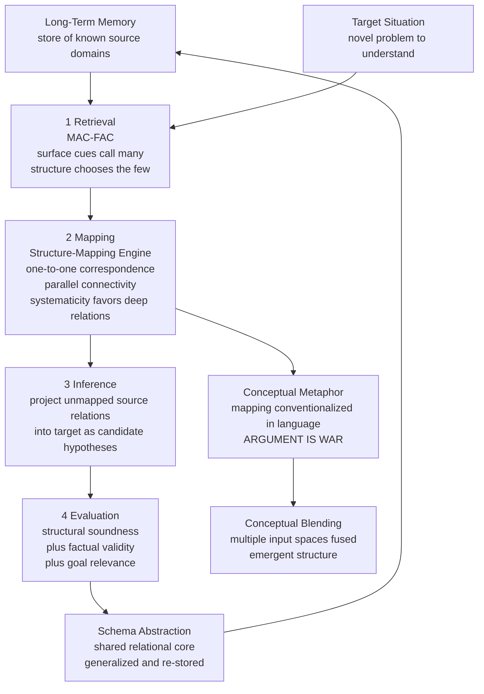

# 🧩 Analogy and Conceptual Metaphor

> [!abstract] TL;DR
> **Analogy** is the cognitive engine that transfers *relational structure* from a familiar **source** domain to an unfamiliar **target** domain — it is *not* about how things look, but about how their parts relate. Dedre Gentner's **Structure-Mapping Theory** makes this precise: the mind prefers mappings that preserve deep, interconnected systems of relations (the **systematicity principle**) over mappings that merely match surface attributes, and the **Structure-Mapping Engine (SME)** shows this can be computed. **Conceptual Metaphor Theory** (Lakoff & Johnson) is the same machinery frozen into language and thought: ARGUMENT IS WAR and TIME IS MONEY are analogical mappings we no longer notice, grounded in the body. **Conceptual blending** generalizes both to multi-space integration with emergent structure. Together they support the strong claim — from Hofstadter to modern LLM research — that analogy is a *core* mechanism of cognition, not a decorative one.

---

## Intuition

**Analogy:** Give a child who has only ever seen apple trees a single sentence — "a family tree shows who your grandparents are" — and they instantly understand a diagram they have never seen. They do not do this by noticing that a family tree is *green* or has *bark*. They do it by carrying over a **relational skeleton**: *a thing branches from a source, branches split into more branches, and everything traces back to a common root*. The apples, the leaves, the color — all the surface stuff — get thrown away. The branching *relationships* are what transfer. That silent, automatic act of throwing away appearances and keeping relations **is** analogy, and your mind performs it thousands of times a day without announcing it.

Now notice something stranger. When you say a debate "took a *wrong turn*," that a friendship "*grew cold*," or that you are "*behind* on a deadline," you are doing the exact same thing — mapping a physical, bodily source (paths, temperature, spatial order) onto an abstract target (reasoning, affection, time). You are not being poetic. You literally have no other way to think about these abstractions. **Conceptual metaphor** is analogy that has hardened into the concepts themselves.

This note takes the *cognitive-mechanisms* angle: how the mind retrieves, maps, infers, and evaluates analogies as a computational process. For the argument-strength and epistemology angle see [[Analogical_Reasoning]]; for the linguistic-semantics angle see [[Cognitive_Semantics_and_Metaphor]].

---

## How It Works

### Core Mechanics: relations over attributes

Gentner's foundational move (1983) is a taxonomy of what can correspond across two domains, ranked by analogical power:

1. **Attribute matches** — object properties shared between domains. *The Sun is yellow; is the nucleus yellow?* These are the stuff of literal similarity and simile. They contribute **almost nothing** to genuine analogy.
2. **First-order relations** — relations *between objects*. *The planet revolves around the Sun; the electron revolves around the nucleus.* This is the substance of most analogy.
3. **Higher-order relations** — relations *between relations*. *Gravitational attraction **causes** the orbit; electrostatic attraction **causes** the orbit.* The `causes` predicate takes two relations as its arguments. These are the deepest and most productive correspondences.

The **systematicity principle** states the mind's preference: when choosing among candidate mappings, prefer the one that preserves a **connected system of higher-order relations** — an interlocking causal or logical structure — over one that matches more isolated facts or attributes. A predicate embedded in a larger relational system is more likely to be mapped than an equally-matchable predicate that stands alone. Systematicity is why "the atom is a tiny solar system" is a *good* analogy while "the atom is yellow like the Sun" is a *bad* one, even though the second is literally true.

### The four-stage analogical process

Structure-mapping is one stage of a larger cycle. Cognitive science decomposes analogical thinking into four sub-processes:

1. **Retrieval** — given a target, fetch a relevant source from long-term memory. This stage is notoriously **surface-driven**: people are reminded of stories that share objects and settings far more easily than stories that share only abstract structure. Gentner and Forbus's **MAC/FAC** model captures this: a cheap, "Many Are Called" content-vector filter proposes many candidates on surface overlap, then an expensive "Few Are Chosen" structural evaluator (SME) selects the few that are structurally sound. The mismatch — retrieval favors surface, but *good* analogy needs structure — is the central bottleneck of human analogy.
2. **Mapping** — align the source and target, establishing one-to-one correspondences between elements and identifying the maximal common relational structure. This is SME's job and the heart of the theory.
3. **Inference** — carry over source relations that have no target counterpart *yet* as **candidate inferences** — new hypotheses about the target. This is where analogy becomes *generative*: it produces knowledge that was not in the target description.
4. **Evaluation** — judge the candidate inferences on structural soundness (does the mapping hold together?), factual validity (is the projected claim actually true of the target?), and goal-relevance (does it help me?). Analogies that map beautifully can still be *false*.

### SME: mapping as constraint satisfaction

The **Structure-Mapping Engine** (Falkenhainer, Forbus & Gentner, 1989) implements mapping under three structural constraints:

- **One-to-one correspondence** — each source element maps to at most one target element and vice versa.
- **Parallel connectivity** — if two relations correspond, their arguments must correspond too (you cannot map `attracts(Sun, Planet)` to `attracts(Nucleus, Electron)` while mapping Sun to Electron).
- **Systematicity** — score mappings so that deep, interconnected relational systems win over shallow collections of matches.

SME builds local match hypotheses, propagates them into globally consistent **kernels**, merges kernels into maximal **gmaps**, and returns the highest-scoring gmap plus its candidate inferences. Crucially SME operates on **structure alone** — it is blind to what the symbols "mean," which is exactly why it models the *domain-general* nature of analogy.

### Copycat and fluid analogies

Hofstadter and Mitchell's **Copycat** takes a radically different stance. Instead of matching fixed, pre-built representations, Copycat argues the hard part of analogy is *building the right representation in the first place* — perception and mapping are inseparable. Working in a micro-domain of letter-strings ("if `abc` changes to `abd`, how does `ijk` change?"), Copycat uses a **parallel terraced scan**: many small agents ("codelets") compete stochastically, a "temperature" variable controls how much the system explores versus commits, and concepts have a "conceptual slippage" that lets `successor` slide to `predecessor` when the pressure of the problem demands it. This **fluid** view explains creative, non-obvious analogies where the very framing has to shift — the part SME's fixed representations assume is already done.

### Flow / Architecture



---

## Key Concepts

### Secondary

- **Source and target** — every analogy has a *known* domain (source) that lends structure and an *unknown* domain (target) that receives it. Analogies are **asymmetric**: "the brain is like a computer" licenses different inferences than "the computer is like a brain."
- **Relations vs. attributes** — the single most important distinction. Attributes describe *one object* (red, heavy, hot). Relations connect *two or more* objects (orbits, attracts, causes). Good analogy transfers relations; poor analogy fixates on attributes.
- **Candidate inference** — a source relation with no target match yet, projected onto the target as a *guess*. This is why analogy teaches you something new instead of merely restating what you knew.
- **Conceptual metaphor** — a systematic, conventionalized analogical mapping from a concrete source (usually bodily) to an abstract target, e.g., TIME IS MONEY ("spend time," "waste time," "invest time"). We stop noticing these as mappings.

### Undergraduate

- **Structure-Mapping Theory (Gentner 1983)** — the systematicity principle and the primacy of relations. It reframes analogy as *structural alignment*, and predicts that experts and scientists prefer deep relational analogies while novices are seduced by surface similarity.
- **The four-stage process** — retrieval, mapping, inference, evaluation. Retrieval is surface-driven (the "inert knowledge" problem: you *have* the relevant source but never think of it); mapping and inference are structure-driven. Keeping these separate explains why people can *recognize* a good analogy they could never have *retrieved*.
- **SME and MAC/FAC** — the process models. SME computes the mapping under structural constraints; MAC/FAC models the two-stage retrieval bottleneck (cheap surface filter, then expensive structural rerank). Together they are a computational-level and algorithmic-level account in the sense of [[Levels_of_Analysis_and_Marrs_Levels]].
- **Image schemas and primary metaphors** — Johnson's pre-linguistic bodily patterns (CONTAINER, PATH, FORCE, UP-DOWN) supply the source structure for conceptual metaphors. **Primary metaphors** (AFFECTION IS WARMTH, MORE IS UP, KNOWING IS SEEING) arise from universal experiential correlations and are candidates for cross-cultural universality.
- **Analogy in instruction** — teaching a new (target) concept by mapping it onto a familiar (source) one works only if learners align the *relational* structure. Bridging analogies and "case comparison" (contrasting two examples to force abstraction of the shared relation) are the empirically strongest classroom techniques.

### Graduate

- **Systematicity as an epistemic virtue** — the preference for higher-order structure is not just a psychological bias; higher-order relations tend to be **lawful** rather than accidental, so systematic mappings generate more *correct* inferences. This connects structure-mapping to Mary Hesse's philosophy of scientific models and to the productive role of the **disanalogy** (the classical electron *should* radiate and spiral in — the failure of the solar-system mapping *demanded* quantization).
- **Progressive alignment and relational shift** — children's analogical ability develops as their relational vocabulary and knowledge grow (the **relational shift** from attribute-based to relation-based similarity around ages 3–5). Comparing highly similar cases first ("progressive alignment") bootstraps the abstraction of relations that later transfer to dissimilar cases — a developmental prediction of structure-mapping.
- **Copycat vs. SME — representation-building vs. representation-matching** — SME assumes clean predicate-calculus representations exist and mapping is the problem; Copycat argues that *constructing* the representation under the pressure of the problem (fluid concepts, conceptual slippage, temperature-controlled search) is the real cognitive work. This is the analogy-theoretic version of the symbolic-vs-emergent debate in the [[Computational_Theory_of_Mind]].
- **Conceptual blending (Fauconnier & Turner)** — generalizes two-domain mapping to a network of **input spaces**, a **generic space** (shared abstract structure), and a **blended space** with *emergent* structure present in neither input (the desktop GUI, the Grim Reaper, "safe sex"). Blending subsumes metaphor and analogy as special cases and models novel, online meaning-construction rather than stable stored mappings.
- **Embodiment and the metaphor–analogy relation** — Lakoff & Johnson's *Philosophy in the Flesh* argues abstract reason is *literally* built from sensorimotor structure via metaphor, giving a strong-embodiment reading (see [[Embodied_and_Extended_Cognition]]). Metaphor is then just **conventionalized, unidirectional, cross-domain analogy** whose source is reliably concrete/bodily and whose mapping has become automatic. Analogy is the live, effortful, often novel act; metaphor is its fossil.
- **Analogy in AI and LLMs** — classical AI modeled analogy symbolically (SME, ACME, Copycat, case-based reasoning). Modern large language models perform analogy in a *very* different way — via learned distributed representations — and Webb, Holyoak & Lu (2023) reported human-level performance on novel matrix-reasoning and verbal analogies with no explicit structure-mapping module. The open question is whether transformers *implement* something like systematicity implicitly, or exploit statistical shortcuts that break on adversarially restructured problems. Few-shot and chain-of-thought prompting are themselves analogical: the model maps the relational template of worked examples onto a new query.

---

## Python Demo

```python
# Gentner's Structure-Mapping, implemented from scratch.
#
# We encode the SOURCE domain (solar system) and TARGET domain (atom) as
# RELATIONAL GRAPHS: nodes are entities, edges are LABELED directed relations,
# and each entity also carries surface ATTRIBUTES.
#
# We then SEARCH every one-to-one entity mapping and SCORE it so that
# preserved RELATIONS dominate, a preserved HIGHER-ORDER relation earns a
# systematicity bonus, and matched ATTRIBUTES count only a little. The winning
# mapping is the structurally consistent alignment that maximizes RELATIONAL
# (not attribute) correspondence -- exactly Gentner's claim.
#
# Note the deliberate trap: the target's "Photon" shares surface attributes
# (radiant, bright) with the source's "Sun". An attribute-driven matcher would
# wrongly pair them. Structure-mapping resists the lure.

import itertools
import numpy as np
import matplotlib.pyplot as plt
from matplotlib.patches import FancyArrowPatch

# ---- 1. Encode each domain as a relational graph -------------------------
src_entities = ["Sun", "Planet", "Comet"]
src_attrs = {
    "Sun":    {"yellow", "hot", "radiant"},
    "Planet": {"solid", "cool"},
    "Comet":  {"icy", "bright"},
}
# first-order relations: (label, head, tail)
src_rels = {
    ("attracts",        "Sun",    "Planet"),
    ("revolves_around", "Planet", "Sun"),
    ("more_massive",    "Sun",    "Planet"),
    ("hotter_than",     "Sun",    "Planet"),   # NO counterpart in the atom
}
# higher-order relation: (label, relation, relation)  ->  systematicity
src_higher = {
    ("causes",
     ("attracts", "Sun", "Planet"),
     ("revolves_around", "Planet", "Sun")),
}

tgt_entities = ["Nucleus", "Electron", "Photon"]
tgt_attrs = {
    "Nucleus":  {"heavy", "dense"},
    "Electron": {"light", "cool"},
    "Photon":   {"radiant", "bright"},         # attribute lure toward the Sun!
}
tgt_rels = {
    ("attracts",        "Nucleus",  "Electron"),
    ("revolves_around", "Electron", "Nucleus"),
    ("more_massive",    "Nucleus",  "Electron"),
}
tgt_higher = {
    ("causes",
     ("attracts", "Nucleus", "Electron"),
     ("revolves_around", "Electron", "Nucleus")),
}

# ---- 2. Score any candidate one-to-one mapping ---------------------------
W_REL, W_SYS, W_ATTR = 6.0, 10.0, 1.0   # relations >> systematicity >> attrs

def image_rel(rel, m):
    label, h, t = rel
    return (label, m[h], m[t])

def score_mapping(m):
    rel_s = sys_s = attr_s = 0.0
    preserved = set()
    for r in src_rels:                       # first-order relations
        if image_rel(r, m) in tgt_rels:
            rel_s += W_REL
            preserved.add(r)
    for (lbl, r1, r2) in src_higher:         # higher-order (systematicity)
        mapped = (lbl, image_rel(r1, m), image_rel(r2, m))
        if mapped in tgt_higher and r1 in preserved and r2 in preserved:
            sys_s += W_SYS
    for e in src_entities:                   # surface attribute overlap
        attr_s += W_ATTR * len(src_attrs[e] & tgt_attrs[m[e]])
    return rel_s + sys_s + attr_s, rel_s, sys_s, attr_s, preserved

# ---- 3. Exhaustively search all mappings; keep the best ------------------
candidates = []
for perm in itertools.permutations(tgt_entities):
    m = dict(zip(src_entities, perm))
    total, rel_s, sys_s, attr_s, preserved = score_mapping(m)
    candidates.append((total, rel_s, sys_s, attr_s, m, preserved))
candidates.sort(key=lambda c: c[0], reverse=True)

best_total, best_rel, best_sys, best_attr, best_map, best_preserved = candidates[0]

print("Best structural mapping (maximizes RELATIONAL correspondence):")
for s, t in best_map.items():
    print(f"   {s:<7} ->  {t}")
print(f"   relational={best_rel:.0f}  systematicity={best_sys:.0f}  "
      f"attribute={best_attr:.0f}   TOTAL={best_total:.0f}\n")
print("Candidate inference projected onto the target:")
print("   causes(attracts, revolves_around) holds in the atom too ->")
print("   the electron's orbit is CAUSED by nuclear attraction.\n")
print("Dropped source relation (analogy's boundary):")
print("   hotter_than(Sun, Planet) has no atomic counterpart -> not mapped.")

# ---- 4. Visualize the aligned structures as a bipartite mapping ----------
fig, (axA, axB) = plt.subplots(1, 2, figsize=(15, 6.2),
                               gridspec_kw={"width_ratios": [1.15, 1.0]})

# -- Panel A: bipartite alignment of the two relational graphs -------------
axA.set_xlim(-0.85, 1.85)
axA.set_ylim(-0.9, 2.75)
axA.axis("off")
axA.set_title("Structural Alignment: Solar System  ->  Atom",
              fontsize=12, fontweight="bold")

src_y = {"Sun": 2, "Planet": 1, "Comet": 0}
tgt_y = {"Nucleus": 2, "Electron": 1, "Photon": 0}
src_pos = {e: (0.0, src_y[e]) for e in src_entities}
tgt_pos = {e: (1.0, tgt_y[e]) for e in tgt_entities}

# how many preserved relations each source entity participates in
part = {e: 0 for e in src_entities}
for (_, h, t) in best_preserved:
    part[h] += 1
    part[t] += 1

# draw intra-domain relation edges (the "graph" part)
def grouped(rels):
    g = {}
    for (label, h, t) in rels:
        g.setdefault((h, t), []).append(label)
    return g

def render_relations(ax, groups, pos, preserved, sign):
    for i, ((h, t), labels) in enumerate(sorted(groups.items())):
        rad = sign * (0.30 + 0.30 * i)
        arrow = FancyArrowPatch(pos[h], pos[t],
                                connectionstyle=f"arc3,rad={rad}",
                                arrowstyle="-|>", mutation_scale=10,
                                lw=1.2, color="#64748b", zorder=1)
        ax.add_patch(arrow)
        text = " / ".join(l if (preserved is None or (l, h, t) in preserved)
                          else l + "*" for l in labels)
        lx = pos[h][0] + sign * (0.30 + 0.26 * i)
        ly = (pos[h][1] + pos[t][1]) / 2
        ax.text(lx, ly, text, fontsize=6.3, color="#334155", style="italic",
                ha="center", va="center", rotation=90,
                bbox=dict(boxstyle="round,pad=0.15", fc="#f8fafc",
                          ec="#cbd5e1", lw=0.5), zorder=3)

render_relations(axA, grouped(src_rels), src_pos, best_preserved, sign=-1)
render_relations(axA, grouped(tgt_rels), tgt_pos, None, sign=+1)

# draw the winning cross-domain mapping (thicker + green = structurally rich)
for s, t in best_map.items():
    (x0, y0), (x1, y1) = src_pos[s], tgt_pos[t]
    strong = part[s] > 0
    axA.plot([x0, x1], [y0, y1],
             color="#16a34a" if strong else "#cbd5e1",
             lw=1.5 + 1.7 * part[s], alpha=0.9 if strong else 0.7, zorder=2)

# draw entity nodes with their surface attributes
def draw_nodes(ax, entities, pos, attrs, color):
    for e in entities:
        x, y = pos[e]
        ax.scatter([x], [y], s=1700, color=color, edgecolors="white",
                   linewidths=1.5, zorder=4)
        ax.text(x, y, e, color="white", fontsize=9, fontweight="bold",
                ha="center", va="center", zorder=5)
        ax.text(x, y - 0.30, "{" + ", ".join(sorted(attrs[e])) + "}",
                fontsize=6, color="#475569", ha="center", va="top", zorder=5)

draw_nodes(axA, src_entities, src_pos, src_attrs, "#1d4ed8")
draw_nodes(axA, tgt_entities, tgt_pos, tgt_attrs, "#b45309")
axA.text(0.0, 2.62, "SOURCE", fontsize=9, fontweight="bold",
         color="#1d4ed8", ha="center")
axA.text(1.0, 2.62, "TARGET", fontsize=9, fontweight="bold",
         color="#b45309", ha="center")
axA.text(0.5, -0.78, "green = structurally rich mapping   *  = relation with "
         "no target match (dropped)", fontsize=7, color="#64748b", ha="center")

# -- Panel B: score landscape over all candidate mappings ------------------
labels_b, rel_p, sys_p, attr_p = [], [], [], []
for total, rel_s, sys_s, attr_s, m, _ in candidates:
    labels_b.append("\n".join(f"{s[0]}->{t[0]}" for s, t in m.items()))
    rel_p.append(rel_s); sys_p.append(sys_s); attr_p.append(attr_s)

x = np.arange(len(candidates))
rel_p, sys_p, attr_p = map(np.array, (rel_p, sys_p, attr_p))
axB.bar(x, rel_p, color="#2563eb", label="relational")
axB.bar(x, sys_p, bottom=rel_p, color="#16a34a",
        label="systematicity (higher-order)")
axB.bar(x, attr_p, bottom=rel_p + sys_p, color="#f59e0b",
        label="attribute (surface)")
axB.set_xticks(x)
axB.set_xticklabels(labels_b, fontsize=6.5)
axB.set_ylabel("mapping score")
axB.set_title("Every candidate mapping, scored\n(winner = leftmost bar)",
              fontsize=11, fontweight="bold")
axB.legend(fontsize=8, loc="upper right")
axB.annotate("structurally\nconsistent\nwinner",
             xy=(0, rel_p[0] + sys_p[0] + attr_p[0]),
             xytext=(1.4, rel_p[0] + sys_p[0] + attr_p[0] + 1),
             fontsize=8, color="#166534", fontweight="bold",
             arrowprops=dict(arrowstyle="->", color="#166534"))
axB.spines[["top", "right"]].set_visible(False)

plt.suptitle("Structure-Mapping: relations beat attributes",
             fontsize=13, fontweight="bold", y=1.02)
plt.tight_layout()
plt.savefig("structure_mapping_solar_atom.png", dpi=150, bbox_inches="tight")
plt.show()
```

**What the demo proves.** The exhaustive search returns **Sun→Nucleus, Planet→Electron, Comet→Photon** with a total score of **30** (18 relational + 10 systematicity + 2 attribute). The attribute-lure mapping that pairs Sun→Photon (both "radiant"/"bright") scores only **2** — pure surface. Panel A draws the aligned relational graphs as a bipartite mapping: thick green lines mark the correspondences that carry the orbital relations, and the starred `hotter_than` relation is the productive *disanalogy* that finds no atomic counterpart. Panel B shows the whole search landscape: relational and systematicity mass (blue + green) tower over attribute mass (orange), which is Gentner's thesis rendered as a bar chart — deep interconnected relations, not shared features, decide the analogy.

---

## Real-World Applications

> **Example 1 — Scientific discovery (Rutherford / Bohr atom, 1911–1913).** Rutherford and then Bohr imported the solar-system relational structure — a massive center attracting lighter bodies that orbit it — into subatomic physics. The analogy was *generative*: it produced the candidate inference that electrons occupy orbits, and, decisively, its **failure point** was productive. Classical electromagnetism says an orbiting (accelerating) electron must radiate energy and spiral into the nucleus. That disanalogy — the solar system's planets do not radiate away their orbits — is exactly what forced Bohr to postulate quantized, non-radiating stationary states. The analogy's *boundary* did the theoretical work.

> **Example 2 — Kepler's physics of the heavens.** Kepler explicitly reasoned that if the Sun moves the planets, there must be a *force* emanating from it like light spreading from a lamp, weakening with distance — a systematic mapping from the familiar behavior of light and of a *lever/anima motrix* onto celestial mechanics. Gentner has analyzed Kepler's notebooks as a case study in how a chain of analogies (Sun-as-light-source, force-as-spokes-of-a-wheel) scaffolded the move from a geometric to a *causal, force-based* astronomy — the conceptual bridge toward Newton.

> **Example 3 — Teaching and instructional design.** Every good explanation is a source domain: electrical current *is like* water flowing through pipes (voltage = pressure, resistance = pipe narrowness), the immune system *is like* an army, the cell *is like* a factory. The empirical lesson from structure-mapping research is that analogies teach only when instruction makes learners **align the relations**, not admire the surface. "Case comparison" — presenting two worked examples side by side and asking what they share — reliably produces transfer because it forces abstraction of the common relational schema, mitigating the surface-driven retrieval bottleneck.

> **Example 4 — Political and therapeutic framing (Conceptual Metaphor Theory in the wild).** Thibodeau & Boroditsky (2011) showed that describing crime as a BEAST *preying* on a city led readers to favor enforcement and capture, while describing the same statistics with crime as a VIRUS *infecting* a community led them to favor prevention and social reform — the source domain's relational structure silently imported a whole policy stance. The same mechanism drives therapeutic reframing (depression as a PRISON vs. as passing WEATHER) and UX design (the desktop/folder/trash **blend** that made computing learnable). Which metaphor is active reshapes the inferences available.

> **Example 5 — Analogical reasoning in large language models.** Raven's-style matrix problems and verbal analogies (A:B :: C:?) are now solved at or above the average-human level by large models with no hand-built structure-mapping engine (Webb, Holyoak & Lu, 2023). This has reopened a foundational question: are transformers acquiring an implicit form of systematicity from data, or exploiting distributional regularities that a truly novel relational structure would break? Practically, in-context few-shot and chain-of-thought prompting *are* analogical transfer — the model maps the relational template of the demonstrations onto the query (see [[Chain_of_Thought]]).

---

## Common Pitfalls

- **Mapping attributes instead of relations** — the novice's error, and the one structure-mapping was built to diagnose. Two diseases that both produce a "red rash" are not analogous in mechanism; two problems that share a *causal structure* are, even if they look nothing alike. Expertise largely *is* the shift from attribute-based to relation-based similarity. Always ask "what *relates* to what?" before "what looks like what?"
- **Confusing retrieval failure with absence of knowledge** ("inert knowledge") — people routinely fail to *retrieve* a structurally perfect source because retrieval is surface-driven, then conclude they lack the relevant idea. The classic Gick & Holyoak result: subjects who had just read the "fortress" story usually failed to apply it to Duncker's radiation problem *until told to*. The fix is deliberate: index knowledge by its relational schema, and practice cross-domain comparison.
- **Ignoring the disanalogy / over-extending the mapping** — every analogy holds in some respects and fails in others. Treating "the atom is a solar system" as *complete* leads to wrong predictions (planets do not tunnel or jump orbits). The *boundary* of an analogy is not a defect to hide; in science it is often where the discovery is. Specify what does **not** map.
- **Treating conceptual metaphors as conscious rhetoric** — "prices *rose*," "I *see* your point," "we're *behind* schedule" are not stylistic choices; the mappings fire automatically and are, for most abstract domains, the *only* available cognitive structure. You cannot study them by asking people whether they "meant it metaphorically." Systematic corpus and priming methods are required (see [[Cognitive_Semantics_and_Metaphor]]).
- **Over-universalizing metaphors from one language** — early Conceptual Metaphor Theory drew almost entirely on English. Primary metaphors (MORE IS UP, AFFECTION IS WARMTH) do appear broadly universal because they are grounded in shared embodiment, but *complex* metaphors (TIME IS MONEY, the horizontal vs. vertical axis of time) vary across cultures. Check cross-linguistic data before claiming universality.
- **"Blending explains everything" and unfalsifiability** — because almost any pair of inputs can be described as a blend with emergent structure, conceptual blending risks being untestable. Its defenders reply that successful blends must satisfy specific optimality constraints (Integration, Web, Unpacking, Topology, Relevance) and that violating them predicts *communicative failure* — that is where the theory earns falsifiable content. Do not use "it's a blend" as an explanation that could never be wrong.

---

## Related Concepts

- [[Analogical_Reasoning]] — the Logic-vault companion covering the same phenomenon from the **argument-strength / epistemology** angle (Mill's criteria, false-analogy fallacy, analogy as inductive inference). This note gives the *cognitive-process* mechanics; that note gives the *how-good-is-the-argument* evaluation.
- [[Cognitive_Semantics_and_Metaphor]] — the Linguistics-vault treatment of Conceptual Metaphor Theory, image schemas, mental spaces, and blending at the **semantic layer of language**. Read together: metaphor is analogy conventionalized into meaning; this note supplies the structure-mapping machinery underneath it.
- [[Embodied_and_Extended_Cognition]] — the strong-embodiment thesis (Lakoff & Johnson's *Philosophy in the Flesh*) that abstract reason is literally built from sensorimotor structure via metaphor; grounds *why* the source domains of primary metaphors are bodily.
- [[Computational_Theory_of_Mind]] — SME and ACME are symbolic, representation-matching models; Copycat and modern LLMs are emergent/subsymbolic. The analogy debate is a concrete instance of the symbolic-vs-connectionist question this note frames.
- [[Levels_of_Analysis_and_Marrs_Levels]] — structure-mapping is a clean case of Marr's levels: systematicity is the *computational* goal, SME/MAC-FAC are *algorithmic* proposals, and neural relational-integration circuits (prefrontal cortex) are the *implementation*.

---

## Review Questions

1. **Conceptual.** Gentner claims analogy prefers *relations* over *attributes* and, among relations, *higher-order* systems over isolated ones. Explain, using the solar-system/atom case, why "the atom is yellow like the Sun" is a worse analogy than "the atom is a tiny solar system" even though the first statement about the Sun is literally true and the second is literally false. What role does the systematicity principle play in this judgment?

2. **Scenario.** A teacher explains electrical circuits with the water-pipe analogy (voltage = pressure, current = flow, resistance = narrow pipe). A student later insists that, like a burst pipe, a "burst wire" would spray electricity everywhere. Using the four-stage process (retrieval, mapping, inference, evaluation) and the concept of *disanalogy*, diagnose exactly where the student's reasoning went wrong and what the teacher should do about it.

3. **Trade-off.** SME assumes clean, pre-built relational representations and computes the optimal mapping over them; Copycat argues the hard part is *building* the representation under the pressure of the problem. A modern LLM does neither explicitly yet solves novel analogies well. Compare the three approaches on (a) where the "intelligence" of the analogy lives, (b) their falsifiability, and (c) what each predicts should happen when a problem's surface features are made deliberately misleading but its deep structure is preserved.

---

## Sources

- Gentner, D. (1983). "Structure-Mapping: A Theoretical Framework for Analogy." *Cognitive Science*, 7(2), 155–170. — The foundational paper: systematicity and the relations-over-attributes principle.
- Falkenhainer, B., Forbus, K. D., & Gentner, D. (1989). "The Structure-Mapping Engine: Algorithm and Examples." *Artificial Intelligence*, 41(1), 1–63. — The SME process model of mapping and candidate inference.
- Hofstadter, D. R., & Mitchell, M. (1995). "The Copycat Project: A Model of Mental Fluidity and Analogy-making." In *Fluid Concepts and Creative Analogies*. Basic Books. — The fluid-analogies / representation-building alternative.
- Lakoff, G., & Johnson, M. (1980, 2003). *Metaphors We Live By*. University of Chicago Press. — Conceptual Metaphor Theory: ARGUMENT IS WAR, TIME IS MONEY, embodiment.
- Fauconnier, G., & Turner, M. (2002). *The Way We Think: Conceptual Blending and the Mind's Hidden Complexities*. Basic Books. — Multi-space integration and emergent structure.
- Gentner, D., Holyoak, K. J., & Kokinov, B. N. (Eds.) (2001). *The Analogical Mind: Perspectives from Cognitive Science*. MIT Press. — Authoritative survey spanning SME, ACME, retrieval, and development.
- Webb, T., Holyoak, K. J., & Lu, H. (2023). "Emergent Analogical Reasoning in Large Language Models." *Nature Human Behaviour*, 7, 1526–1541. — Analogy in modern LLMs and the systematicity debate.

---

#cognitive-science #analogy #structure-mapping #conceptual-metaphor #relational-reasoning
