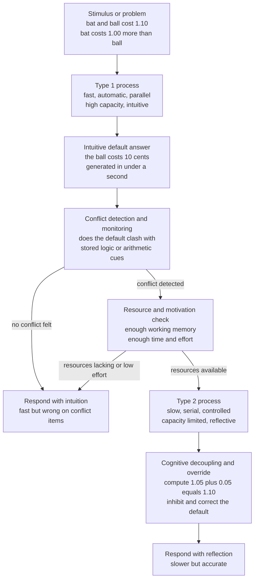

# 🧠 Dual-Process Theory

> [!abstract] TL;DR
> **Dual-process theory** proposes that human reasoning runs on two kinds of process: **Type 1** — fast, automatic, parallel, high-capacity, and intuitive — and **Type 2** — slow, controlled, serial, capacity-limited, and reflective. Type 1 throws up an answer almost instantly (often a useful heuristic, sometimes a systematic bias); Type 2 can *monitor, endorse, or override* that answer, but only if you have the working memory, motivation, and time to run it. The framework grew from Wason and Evans's reasoning research, Sloman's "two systems," and Stanovich and West's System 1 / System 2 labels, and was popularized by Kahneman's *Thinking, Fast and Slow*. Its architects (Evans and Stanovich) now insist on the cautious language of **Type 1 / Type 2 processes**, not two literal "systems" — a reframing driven by exactly the criticisms (vagueness, the "two systems" myth, single-process alternatives) the theory has had to answer.

---

## Intuition

**Analogy: the blurter and the auditor.**

Picture two people sharing one desk. The first is a **blurter**: the instant a question lands, he shouts out whatever answer *feels* right — no effort, no waiting, and he is available even when exhausted. Most of the time he is right, because the questions resemble ones he has seen a thousand times. The second is a slow, careful **auditor**: she actually works the problem out, but she is easily tired, can only handle one thing at a time, and needs quiet and effort to function. She does not answer every question herself. Instead she *listens to the blurter*, and only if something about his answer smells wrong — and only if she has the energy to spare — does she stop, recompute, and correct him.

Now the crucial point: **the auditor is often too slow, too busy, or too lazy to check.** When she stays silent, the blurter's answer is simply what you say. That is why a smart person, rushed or distracted, confidently gives the wrong answer to the bat-and-ball problem: the blurter shouted "10 cents," the answer felt fluent, and the auditor never audited. Dual-process theory is the study of when the auditor wakes up — and when she does not.

---

## How It Works

### Core mechanics

Dual-process theory does **not** claim there are two boxes in the brain. It claims that behaviour on reasoning and judgment tasks is best explained by two *styles* of processing with different signatures:

1. **Type 1 (intuitive) processing** is autonomous — it fires whenever its triggering conditions are met, without needing to be deliberately started. It is **fast, parallel, high in capacity, and independent of working memory**. It includes overlearned associations (reading a word, recognising a face), emotional responses, and the classic **heuristics** (availability, representativeness, anchoring). It is not "bad thinking" — it is the vast, efficient background that lets you function. Its failure mode is that it answers the question it finds *easy* rather than the question actually asked (attribute substitution).

2. **Type 2 (reflective) processing** is deliberate. It is **slow, serial, capacity-limited, and loads heavily on working memory and cognitive control**. Its defining job is **cognitive decoupling** — building a hypothetical mental model that is quarantined from your beliefs so you can reason about "what if" without contaminating it. This is metabolically and attentionally expensive, which is why Type 2 is the exception, not the rule.

3. **Conflict detection and monitoring** is the hinge between them. A cheap monitoring process continuously checks whether the intuitive default conflicts with other cues (stored logical/probabilistic knowledge, a felt sense of wrongness). De Neys's work shows people often *register* a conflict — slowing down, growing less confident, showing autonomic arousal — even when they still give the biased answer. Detecting conflict is necessary but not sufficient; you must then successfully inhibit the default and complete the Type 2 computation.

4. **Two candidate architectures** describe how the processes relate:
   - **Default-interventionist** (Evans, Kahneman): Type 1 generates a default answer *first*; Type 2 intervenes serially only if conflict is detected and resources allow. This is the mainstream view and the one the analogy above captures.
   - **Parallel-competitive** (Sloman): both processes run *simultaneously* and race, and the output is whichever wins — so an intuitive and a rule-based answer can be experienced at once (the "I know it's wrong but it still looks right" feeling).

### Defining features vs correlated features

Early accounts listed a long cluster of properties (fast/slow, automatic/controlled, unconscious/conscious, evolutionarily old/new, high/low capacity) as if they always travel together. Critics pointed out that these features **dissociate**: some fast processes are conscious, some slow ones are automatic. Evans and Stanovich (2013) responded with a disciplined retreat. Only two features are **defining**: Type 2 requires **working-memory-dependent cognitive decoupling and hypothetical thinking**; Type 1 does not. Everything else (speed, automaticity, capacity) is merely a **correlated, typical** feature, not part of the definition. This is why they now prefer **"Type 1 / Type 2 processes"** over **"System 1 / System 2"** — the word *system* wrongly implies two unified, anatomically distinct machines.

### The Cognitive Reflection Test

Frederick's (2005) three-item **Cognitive Reflection Test (CRT)** operationalises the whole theory. Each item has a lure answer that Type 1 supplies fluently and a correct answer that requires suppressing it:

- *A bat and a ball cost 1.10 in total. The bat costs 1.00 more than the ball. How much is the ball?* Lure: 10 cents. Correct: **5 cents** (0.05 + 1.05 = 1.10).
- *If 5 machines take 5 minutes to make 5 widgets, how long for 100 machines to make 100 widgets?* Lure: 100 minutes. Correct: **5 minutes**.
- *A lily patch doubles each day and covers the lake in 48 days. When was it half-covered?* Lure: 24 days. Correct: **47 days**.

CRT scores predict susceptibility to a wide range of biases and correlate with — but are not identical to — numeracy and intelligence, which is exactly why interpreting the test requires care.

### Default-interventionist architecture



---

## Key Concepts

### Secondary (intuitive level)

- Your mind has two ways of answering: a **fast, gut way** (Type 1 / System 1) and a **slow, careful way** (Type 2 / System 2).
- The fast way is usually right and costs no effort, but on tricky "gotcha" questions it blurts out an answer that *feels* right and is wrong.
- The slow way can catch and fix those mistakes — but only if you *notice* something is off and bother to think it through.
- The **bat-and-ball problem** is the classic trap: "10 cents" is the fast answer, "5 cents" is the correct one.
- Being smart is not enough. You also have to be the kind of person who *stops and checks* — that habit is what the Cognitive Reflection Test measures.

### Undergraduate (mechanistic level)

- **Type 1 features (typical):** fast, autonomous, parallel, high-capacity, does not tax working memory; includes heuristics and overlearned associations. **Type 2 features (typical):** slow, controlled, serial, capacity-limited, working-memory-dependent.
- **The one defining difference (Evans and Stanovich):** Type 2 performs **cognitive decoupling** and hypothetical thinking on working memory; Type 1 cannot. Speed and automaticity are *correlated*, not defining — which is why the modern name is Type 1 / Type 2, not System 1 / System 2.
- **Historical lineage:** Wason and Evans's dual processes in reasoning (1970s) → Sloman's "two systems" (1996, parallel-competitive) → Stanovich and West's System 1 / System 2 labels (2000) → Kahneman's *Thinking, Fast and Slow* (2011) popularisation.
- **Two architectures:** *default-interventionist* (serial: intuition first, deliberation intervenes) vs *parallel-competitive* (both run at once and race).
- **Conflict detection:** a monitoring process flags mismatch between the intuitive default and logical/probabilistic cues; biased responders often detect the conflict yet fail to override it.
- **CRT (Frederick, 2005):** a short test whose items pit a fluent lure against a correct answer that requires inhibiting it; predicts bias susceptibility beyond raw IQ.

### Graduate (theoretical and critical level)

- **Defining vs correlated features and the "two systems" myth:** the theory's most damaging early error was reifying a *list* of co-varying properties into two homunculi. Keren and Schul, and Kruglanski and Gigerenzer, argued the features dissociate and that a single continuous process (varying in effort, evidence, or resource allocation) can reproduce the same data. Evans and Stanovich's 2013 reply concedes the point and rebuilds the theory around a *single* defining criterion (working-memory-dependent decoupling), explicitly demoting speed, consciousness, and evolutionary age to "typical correlates."
- **Single-process alternatives:** Osman's single-system dynamic-graded-continuum model, and unimodel accounts (Kruglanski), hold that apparent "two systems" are two ends of one continuum of processing intensity. The empirical challenge is that most dual-process predictions can be re-derived from a graded single process, so the debate is partly about parsimony and falsifiability, not just data.
- **Rationality and individual differences (Stanovich):** Stanovich decomposes Type 2 into the **algorithmic mind** (raw computational capacity, indexed by fluid intelligence) and the **reflective mind** (thinking dispositions — the *tendency* to engage decoupling). This dissociation explains **dysrationalia**: high-IQ people who still fail reasoning tasks because they lack the reflective disposition to override, and it is why CRT is not redundant with IQ.
- **Conflict monitoring as the empirical frontier:** De Neys's "logical intuitions" program shows conflict detection is fast and largely automatic — pushing some genuinely *logical* competence *down* into Type 1 and blurring the neat "intuition = error, deliberation = logic" mapping. This reframes many biases as failures of *inhibition and completion*, not failures of detection.
- **Relation to working memory and cognitive control:** Type 2 is essentially working memory plus executive control (inhibition, updating, decoupling) applied to reasoning. Individual differences in working-memory capacity predict override success; this is where dual-process theory connects to the [[Working_Memory_and_Cognitive_Load|working-memory bottleneck]] and to prefrontal executive-attention research.
- **Vagueness critique:** because "System 1" can be invoked *post hoc* to explain almost any error and "System 2" any success, the framework risks being an unfalsifiable relabeling. The disciplined defining-feature version is the field's attempt to make it a genuine, testable theory rather than a narrative.

---

## Python Demo

```python
import numpy as np
import matplotlib
matplotlib.use("Agg")
import matplotlib.pyplot as plt

# ------------------------------------------------------------------
# A RACE between two accumulators on the Cognitive Reflection Test.
#
# Bat-and-ball problem:
#   "A bat and a ball cost 1.10 in total. The bat costs 1.00 more
#    than the ball. How much does the ball cost?"
#   Intuitive lure  : 10 cents   (WRONG)
#   Correct answer  : 5 cents    (0.05 + 1.05 = 1.10)
#
# Each cognitive process is a LINEAR BALLISTIC ACCUMULATOR: evidence
# rises at a constant per-trial rate until it hits threshold b, so
#   finishing time = b / rate.
#
#   * Type 1 (intuitive) : HIGH mean rate -> finishes FAST, but on a
#                          conflict item it commits to the LURE.
#   * Type 2 (analytic)  : LOW  mean rate -> finishes SLOW, but it
#                          computes the CORRECT answer.
#
# Read-out is DEFAULT-INTERVENTIONIST at deliberation deadline T:
#   if Type 2 has finished -> it OVERRIDES (correct);
#   elif Type 1 has finished -> emit its answer (lure on conflict);
#   else -> neither is ready, so guess (0.5).
# ------------------------------------------------------------------

rng = np.random.default_rng(7)

N        = 20000      # simulated reasoners per item type
b        = 1.0        # shared decision threshold
mu1, s1  = 2.0, 0.45  # Type 1 rate: fast, moderate variability
mu2, s2  = 0.7, 0.20  # Type 2 rate: slow

# Per-trial drift rates (clipped to stay positive -> finite times).
rate1 = np.clip(rng.normal(mu1, s1, N), 0.05, None)
rate2 = np.clip(rng.normal(mu2, s2, N), 0.05, None)

t1 = b / rate1        # Type 1 finishing times (small)
t2 = b / rate2        # Type 2 finishing times (large)

deadlines = np.linspace(0.0, 4.0, 200)

def accuracy(T, conflict):
    """Expected accuracy at deliberation deadline T.
    conflict=True  -> the Type 1 lure is WRONG (bat-and-ball style).
    conflict=False -> the Type 1 answer happens to be RIGHT.
    """
    s2_done = t2 <= T                     # did the analytic process finish?
    s1_done = t1 <= T                     # did the intuition finish?
    type1_correct = 0.0 if conflict else 1.0
    p = np.where(s2_done, 1.0,            # Type 2 overrides -> correct
                 np.where(s1_done, type1_correct,
                          0.5))           # neither ready -> guess
    return p.mean()

acc_conflict    = np.array([accuracy(T, True)  for T in deadlines])
acc_no_conflict = np.array([accuracy(T, False) for T in deadlines])

# --- console summary -------------------------------------------------
below   = np.where(acc_conflict < 0.5)[0]           # the "confidently wrong" dip
recover = deadlines[below[-1] + 1] if below.size else 0.0
print("Median Type 1 finish time      :", round(float(np.median(t1)), 3))
print("Median Type 2 finish time      :", round(float(np.median(t2)), 3))
print("Conflict accuracy at T = 0.5   :", round(float(accuracy(0.5, True)), 3))
print("Conflict accuracy at T = 3.0   :", round(float(accuracy(3.0, True)), 3))
print("Deadline where accuracy recovers above chance:", round(float(recover), 3))

# --- plot ------------------------------------------------------------
plt.figure(figsize=(9, 5.5))
plt.plot(deadlines, acc_conflict, color="#dc2626", lw=2.4,
         label="Conflict item (bat-and-ball): Type 1 lure is WRONG")
plt.plot(deadlines, acc_no_conflict, color="#059669", lw=2.4,
         label="No-conflict item: Type 1 answer is RIGHT")
plt.axhline(0.5, color="#6b7280", ls=":", lw=1, label="Chance (guessing)")
plt.axvline(np.median(t1), color="#f59e0b", ls="--", lw=1.3,
            label="Median Type 1 finish (fast)")
plt.axvline(np.median(t2), color="#2563eb", ls="--", lw=1.3,
            label="Median Type 2 finish (slow)")
plt.xlabel("Deliberation time available  T  (arbitrary units)")
plt.ylabel("Probability of a correct answer")
plt.title("System 1 vs System 2: a race read out under a deadline")
plt.ylim(-0.02, 1.02)
plt.legend(loc="center right", fontsize=8.5)
plt.grid(alpha=0.3)
plt.tight_layout()
plt.savefig("dual_process_race.png", dpi=110, bbox_inches="tight")
plt.show()
```

**What the demo shows:** On the **conflict** item (red), accuracy starts at chance (nothing has finished, so the reasoner guesses), then *drops below chance* precisely in the window where the fast Type 1 accumulator has finished but the slow Type 2 has not — the model's version of the **confidently-wrong intuitive answer that wins under time pressure**. As the deadline `T` extends past the median Type 2 finishing time, the analytic process overrides and accuracy climbs toward 1.0. On the **no-conflict** item (green), the fast intuition is already correct, so accuracy rises to ceiling almost immediately and never dips. The single manipulation — *how much deliberation time is allowed* — reproduces the core dual-process signature: intuition dominates when rushed, reflection overtakes when given room.

---

## Real-World Applications

> **Behavioural economics and "nudging":** Kahneman and Tversky's heuristics-and-biases program (Nobel Prize, 2002) rests on dual-process ideas. Because most everyday choices are made by fast Type 1 processing, choice architects design **defaults, framings, and reminders** — automatic pension enrolment, organ-donation opt-outs, salient calorie labels — that work *with* System 1 rather than assuming a deliberative System 2 will show up. See [[Cognitive_Biases_and_Heuristics]] and [[Problem_Solving_and_Decision_Making]].

> **Medical diagnosis:** Clinical reasoning is explicitly taught as dual-process. Experienced physicians rely on fast **pattern recognition** (Type 1) that is highly accurate for typical presentations, but most serious diagnostic errors trace to Type 1 shortcuts (premature closure, anchoring) that Type 2 failed to catch. "Diagnostic time-out" and structured checklists are deliberate attempts to trigger Type 2 override on high-stakes cases.

> **Education and critical thinking:** Because CRT-style failures persist in intelligent people, curricula increasingly target the **reflective disposition** — the habit of questioning a fluent first answer — rather than raw ability. Teaching students to *expect* the intuitive trap on certain problem types is a Type 2 metacognitive strategy.

> **AI and large language models:** The "fast vs slow" framing directly inspires machine reasoning design. A base LLM's single forward pass behaves like Type 1 (fast, pattern-completing, sometimes confidently wrong); techniques such as **chain-of-thought prompting, self-consistency, and deliberate multi-step "reasoning models"** are engineered System-2-style override layers that trade latency and compute for accuracy on problems where the fluent answer is a trap.

> **Finance and investing:** Behavioural finance treats market misjudgments (loss aversion, overconfidence, herding) as Type 1 responses that disciplined, rule-based Type 2 processes are designed to counteract — the reason systematic investors codify decisions into checklists and models that remove in-the-moment intuition.

---

## Common Pitfalls

- **Reifying two "systems" as two brain modules** — there is no single "System 1 region" and "System 2 region." The processes are functional signatures, not anatomical boxes. Evans and Stanovich abandoned the word *system* for exactly this reason; treating a phrase from a popular book as neuroanatomy is the most common error.
- **Equating Type 1 with "bad" and Type 2 with "good"** — Type 1 is right the overwhelming majority of the time and is the only reason you can function at speed; Type 2 is slow, effortful, and can rationalise *worse* answers. The systems are not virtue and vice.
- **Assuming System 2 is a reliable truth machine** — Type 2 can be captured to defend the intuitive answer (motivated reasoning) rather than to correct it. Engaging deliberation does not guarantee normatively correct output; it guarantees *decoupling capacity*, which can be misused.
- **Reading the CRT as a pure reflection meter** — CRT scores are entangled with numeracy and intelligence. A low score can reflect weak arithmetic rather than low reflectiveness, so it must be interpreted alongside ability measures.
- **Treating the correlated features as if they always co-occur** — "fast therefore unconscious therefore Type 1" is invalid reasoning. Speed, consciousness, and capacity dissociate; only working-memory-dependent decoupling defines Type 2.
- **Circular, post-hoc explanation** — labeling every error "System 1" and every success "System 2" after the fact explains nothing and is unfalsifiable. Use the defining-feature version and make predictions in advance, or the theory collapses into a just-so story.
- **Ignoring conflict detection** — assuming biased responders simply "don't notice" the trap. Evidence shows they often *do* detect the conflict yet fail to inhibit the default; the bottleneck is override, not detection.

---

## Related Concepts

- [[Working_Memory_and_Cognitive_Load]] — Type 2 processing *is* working memory plus executive control applied to reasoning; the capacity bottleneck described there is exactly what limits deliberate override.
- [[Cognitive_Biases_and_Heuristics]] — the heuristics-and-biases program (Kahneman and Tversky) that dual-process theory was built to explain; System 1 shortcuts are the engine of the systematic biases catalogued there.
- [[Problem_Solving_and_Decision_Making]] — the psychology-side treatment of System 1 / System 2 in judgment and choice; direct companion note framing decisions as the fast-vs-slow tension.
- [[Cognitive_Biases]] — the specific catalogue of predictable errors that Type 1 intuition produces when applied outside its calibrated conditions.
- [[Critical_Thinking_Frameworks]] — structured methods that deliberately force Type 2 engagement to interrupt fluent-but-wrong intuitive defaults.
- [[Decision_Making_Under_Uncertainty]] — the normative decision models against which System 1's departures are measured, and where deliberate override matters most.
- [[Cognitive_Science_Overview]] — situates dual-process reasoning within the broader mind-as-information-processor program and the resource-rational debate.
- [[Consciousness_and_Awareness]] — connects to why Type 2 processing is typically (though not definitionally) conscious and reportable while Type 1 is not.

---

## Review Questions

### Secondary

1. In your own words, describe the difference between the "fast" and "slow" ways of thinking, and give one everyday example where the fast way gives a wrong answer.
2. In the bat-and-ball problem the ball costs 5 cents, not 10. Explain why so many people — including very smart people — blurt out "10 cents." What would they have to do to catch the mistake?
3. Why is it wrong to say "fast thinking is bad and slow thinking is good"?

### Undergraduate

1. Distinguish the **default-interventionist** and **parallel-competitive** architectures. What behavioural evidence (e.g., response times, the feeling of simultaneously "knowing" two answers) would favour one over the other?
2. Evans and Stanovich argue that only one feature truly *defines* Type 2 processing, while speed, automaticity, and consciousness are merely *correlated*. What is the defining feature, and why does insisting on it lead them to prefer "Type 1 / Type 2" over "System 1 / System 2"?
3. The Cognitive Reflection Test predicts bias susceptibility beyond IQ. Using Stanovich's split between the **algorithmic mind** and the **reflective mind**, explain how a high-IQ person could still score poorly on the CRT (dysrationalia).

### Graduate

1. Single-process theorists argue that a graded, continuous account of processing intensity can reproduce every result dual-process theory explains. Construct the strongest single-process objection to dual-process theory, then evaluate whether the "defining-feature" reframing (working-memory-dependent decoupling) survives it or merely relabels the problem.
2. De Neys's work suggests biased reasoners often *detect* the conflict between intuition and logic yet still fail to override it, implying some logical competence lives in Type 1. How does this "logical intuitions" finding complicate the classic mapping of intuition-to-error and deliberation-to-logic, and what does it imply for interventions aimed at reducing bias?
3. Design an experiment that would *dissociate* conflict **detection** from successful **override** — that is, distinguish reasoners who never notice the trap from those who notice but cannot inhibit the default. What measures (response time, confidence, autonomic arousal, working-memory load manipulation) would you use, and what result pattern would support each hypothesis?

---

## Sources

- [Kahneman, D. (2011). *Thinking, Fast and Slow*. Farrar, Straus and Giroux.](https://us.macmillan.com/books/9780374533557/thinkingfastandslow)
- [Evans, J. St. B. T., & Stanovich, K. E. (2013). "Dual-Process Theories of Higher Cognition: Advancing the Debate." *Perspectives on Psychological Science*, 8(3), 223–241.](https://doi.org/10.1177/1745691612460685)
- [Frederick, S. (2005). "Cognitive Reflection and Decision Making." *Journal of Economic Perspectives*, 19(4), 25–42.](https://doi.org/10.1257/089533005775196732)
- [Sloman, S. A. (1996). "The Empirical Case for Two Systems of Reasoning." *Psychological Bulletin*, 119(1), 3–22.](https://doi.org/10.1037/0033-2909.119.1.3)
- [Stanovich, K. E., & West, R. F. (2000). "Individual Differences in Reasoning: Implications for the Rationality Debate?" *Behavioral and Brain Sciences*, 23(5), 645–665.](https://doi.org/10.1017/S0140525X00003435)
- [De Neys, W. (2012). "Bias and Conflict: A Case for Logical Intuitions." *Perspectives on Psychological Science*, 7(1), 28–38.](https://doi.org/10.1177/1745691611429354)

---

#cognitive-science #dual-process #system-1-system-2 #reasoning #cognition
