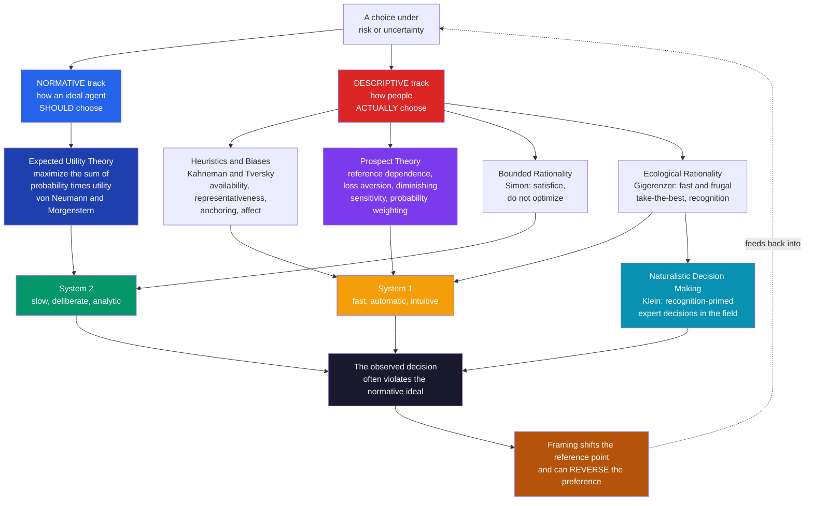

# 🎲 Judgment and Decision Making

> [!abstract] TL;DR
> Judgment and decision making (JDM) is the cognitive-science study of how humans actually estimate probabilities and choose among uncertain options — and how systematically that differs from the **normative** ideal of expected-utility maximization. The field's spine is the **heuristics-and-biases** program (Kahneman & Tversky): people substitute fast mental shortcuts — *availability*, *representativeness*, *anchoring*, and *affect* — for hard probabilistic reasoning, producing predictable errors such as base-rate neglect and the conjunction fallacy. Its central formal model is **prospect theory**, which replaces the rational agent with a psychologically real one who evaluates *changes* from a reference point (not absolute wealth), feels losses about twice as keenly as gains, and distorts probabilities via an inverse-S weighting curve — so the very same choice flips when it is *framed* as a gain versus a loss. Competing traditions reframe the "irrationality" verdict: **bounded rationality** (Simon) says people *satisfice* under real cognitive limits; **ecological rationality** (Gigerenzer) shows that simple *fast-and-frugal* heuristics can be more accurate than complex models in the environments they evolved for; and **naturalistic decision making** (Klein) finds that experts decide by pattern recognition, not comparison. Together these define one of cognitive science's most consequential debates: is human judgment broken, or is it well-adapted to a world of limited time, information, and computation?

---

## Intuition

**Analogy:** Imagine two ways to weigh a suitcase before a flight. The **normative** way is to put it on a precise digital scale, read the exact kilograms, and compare against the airline's limit — accurate, but slow, and it needs a scale you may not have. The way people *actually* do it is to lift the bag by the handle and feel whether it seems "too heavy." That heft-judgment is a **heuristic**: it is instant, needs no equipment, and is right most of the time. But it fails in patterned, predictable ways — a small dense bag of books feels lighter than a large fluffy bag of pillows of the same weight, and if you *just* lifted a very heavy box, every bag afterwards feels light (an **anchoring** effect). Crucially, the errors are not random noise; a psychologist could predict *exactly* which bags you will misjudge and in which direction.

Human judgment under uncertainty works the same way. We rarely compute probabilities and utilities; we "heft" a situation using whatever comes easily to mind — how vividly a scenario is imagined, how much a case resembles a stereotype, whatever number was mentioned first. These shortcuts are fast, cheap, and usually adequate, which is why we have them. The science of JDM is the systematic catalogue of *when the heft misleads us*, *why the errors are lawful rather than random*, and *whether "error" is even the right word* once you account for the fact that a real mind has milliseconds, not minutes, and a body that must act rather than deliberate forever.

---

## How It Works

### The normative benchmark: expected utility

The rational-choice ideal, axiomatized by **von Neumann and Morgenstern (1947)** and extended by Savage to subjective probability, says a rational agent should choose the option that maximizes **expected utility**: for each option, multiply the utility of each possible outcome by its probability, sum, and pick the largest total. The theory rests on axioms — *completeness*, *transitivity*, *independence*, *continuity* — that feel almost undeniable in the abstract. Utility is *concave* (diminishing marginal value of money), which alone explains risk aversion for gains. This is the yardstick against which all descriptive findings are measured; JDM is essentially the study of how and why humans violate it.

### The descriptive turn: heuristics and biases

Kahneman and Tversky's insight (from the early 1970s) was that people do not estimate probabilities by the calculus of chance; they **substitute an easier question**. Judging "how likely is X?" is hard, so the mind swaps in an easier attribute and reads the answer off that instead:

1. **Availability** — frequency or probability is judged by *how easily instances come to mind*. Vivid, recent, or emotionally charged events (plane crashes, shark attacks) are over-estimated; silent, statistical killers (diabetes, car crashes) are under-estimated. The heuristic conflates *ease of recall* with *actual frequency*.
2. **Representativeness** — probability is judged by *similarity to a prototype*. How likely is it that a described person is a librarian? People answer by how much the description *resembles* a stereotypical librarian, ignoring how rare librarians are. This produces two signature errors: **base-rate neglect** (ignoring prior probabilities in favor of case-specific similarity) and the **conjunction fallacy**.
3. **Anchoring and adjustment** — estimates start from an initial value (an *anchor*, however arbitrary) and adjust insufficiently toward the truth. Spinning a wheel of fortune before asking "what percent of UN countries are African?" shifts answers toward the wheel's number — even though it is transparently irrelevant.
4. **The affect heuristic** (Slovic) — the immediate emotional "goodness/badness" of an option stands in for a reasoned risk-benefit analysis. Because affect is one-dimensional, people who *like* a technology judge it as both high-benefit *and* low-risk, even though benefit and risk are logically independent.

The **conjunction fallacy** is the sharpest demonstration. In the classic **Linda problem**, subjects read a description of Linda as outspoken and concerned with social justice, then rank statements by probability. A large majority rank "Linda is a bank teller *and* is active in the feminist movement" as *more probable* than "Linda is a bank teller" — a logical impossibility, since a conjunction can never be more probable than one of its conjuncts. Representativeness overrides the probability axioms: the conjunction *resembles* Linda better, so it *feels* more likely.

### Prospect theory: a descriptive model of choice

Where heuristics-and-biases catalogues errors in *judgment* (estimating probabilities), **prospect theory (Kahneman & Tversky, 1979; cumulative version 1992)** is a formal model of *choice* that replaces expected utility with four psychologically grounded departures:

- **Reference dependence** — outcomes are coded as *gains and losses relative to a reference point* (usually the status quo), not as final states of wealth. The carrier of value is the *change*, not the level. This is why the identical bank balance feels like triumph or disaster depending on where you started.
- **Loss aversion** — the value function is *steeper for losses than for gains*: losing 100 dollars hurts roughly twice as much as gaining 100 feels good, with an empirical coefficient near 2.25. This asymmetry drives the endowment effect and status-quo bias.
- **Diminishing sensitivity** — the value function is *concave for gains and convex for losses* (an S-shape through the reference point). The felt difference between 0 and 100 dollars exceeds that between 1000 and 1100. Concavity in gains yields risk aversion; convexity in losses yields **risk seeking for losses** — people gamble to avoid a sure loss.
- **Probability weighting** — objective probabilities are transformed by a nonlinear, inverse-S *weighting function*: small probabilities are *over-weighted* (why we buy lottery tickets and insurance), while moderate-to-large probabilities are *under-weighted*, with under-sensitivity in the middle range. Certainty is treated as special.

Because value is measured from a reference point, **framing** the same objective gamble as a gain or a loss moves the reference point and can *reverse the preference* — the effect the Python demo below reproduces numerically.

### Bounded, ecological, and naturalistic rationality

Three research programs push back on the implied verdict that humans are simply irrational:

- **Bounded rationality (Herbert Simon, 1955)** — real agents have limited time, information, and computation, so they do not *optimize*; they **satisfice** — search until they find an option that clears an aspiration threshold, then stop. Rationality is *bounded* by cognitive and environmental constraints, and heuristics are the adaptive response, not a defect. Simon's "scissors": one blade is the mind's limits, the other is the structure of the environment; you cannot explain behavior by either blade alone.
- **Ecological rationality (Gerd Gigerenzer)** — heuristics are not second-best approximations to a lost ideal; in the right environment a **fast-and-frugal** heuristic can *beat* a complex statistical model by ignoring information (avoiding overfitting). The **recognition heuristic** ("if you recognize one of two objects and not the other, judge the recognized one higher") lets people answer which of two cities is larger surprisingly well; **take-the-best** decides by the single most valid cue that discriminates, ignoring the rest, yet matches or exceeds multiple regression out of sample. Rationality is a *match between mind and environment*, not conformity to logic.
- **Naturalistic decision making (Gary Klein, 1993)** — studying firefighters, nurses, and pilots in the field, Klein found experts almost never compare options. His **recognition-primed decision (RPD)** model: an expert recognizes the situation as typical, retrieves a single workable course of action, mentally *simulates* it once, and acts if it passes — generating and testing options *serially*, not in parallel comparison. Expertise converts deliberation into perception.

### The dual-process framing

Tying much of this together, the **dual-process** view (Stanovich & West; popularized in Kahneman's *Thinking, Fast and Slow*) distinguishes **System 1** — fast, automatic, associative, effortless, the home of the heuristics — from **System 2** — slow, deliberate, rule-governed, effortful, capacity-limited. Biases arise because System 2 is *lazy*: it typically endorses System 1's intuitive answer without checking (the bat-and-ball problem: the intuitive "10 cents" is wrong; the answer is 5). Note that the dual-process label is a *framework*, not a settled theory — critics argue the two "systems" are a continuum, not a dichotomy.



---

## Key Concepts

### Secondary Level

**What is a "decision under uncertainty"?** It is any choice where you cannot be sure how it will turn out — buying a lottery ticket, choosing a medical treatment, deciding whether to take an umbrella. Because you do not know the outcome, you have to weigh *how good or bad* each result would be against *how likely* it is.

**The "right" way vs. the way we really do it.** Mathematicians long ago worked out a "right" way to decide: for each choice, multiply how good each outcome is by how likely it is, add these up, and pick the biggest total. This is the **normative** rule. But real people almost never do this arithmetic. Instead we use **mental shortcuts** called *heuristics*.

**Three famous shortcuts (and how they trip us up):**

| Shortcut | What we secretly do instead | The predictable mistake |
|---|---|---|
| **Availability** | Judge how likely something is by how *easily we remember examples* | We fear plane crashes more than car crashes, though cars are far deadlier |
| **Representativeness** | Judge how likely by how much it *matches a stereotype* | We ignore how common something actually is (base rates) |
| **Anchoring** | Start from the *first number we heard* and barely move | A high sticker price makes the "sale" price seem cheap |

**Losses hurt more than gains feel good.** People will work harder to avoid losing 20 dollars than to win 20 dollars. This is **loss aversion**, and it is the single most reliable finding in the field. It is why "free trials that auto-charge" and "don't lose your streak" are such powerful hooks.

**Framing.** The *exact same* situation feels different depending on how it is described. "90 percent survival" and "10 percent mortality" are identical facts, but doctors and patients choose differently between them. How a choice is *worded* changes the choice.

---

### Undergraduate Level

**Expected value vs. expected utility.** Expected *value* weights money outcomes by probability; it predicts we should be indifferent to a fair bet. But we are not — most people decline a 50/50 chance to win 110 or lose 100. Expected *utility* fixes this by making the *utility* of money concave (each extra dollar is worth less), so risk aversion falls out of the curvature. Bernoulli proposed this in 1738 to resolve the St. Petersburg paradox. The problem: a single concave utility-of-wealth function cannot simultaneously explain why people are risk-averse for gains *and* risk-seeking for losses, nor why they buy both lottery tickets and insurance. Prospect theory can.

**The conjunction fallacy in depth.** P(A and B) can never exceed P(A) — this is a theorem, not an empirical claim. Yet in the Linda problem, adding the detail "active in the feminist movement" makes the story *more representative* of the description, and representativeness, not probability, drives the ranking. The fallacy is robust across statistically trained subjects and survives many reformulations, though frequency framings ("how many of 100 people like Linda are...") sharply reduce it — a clue that the mind reasons better about *natural frequencies* than about single-event probabilities.

**Base-rate neglect and Bayes.** Given a disease with 1 percent prevalence and a test that is 90 percent sensitive and 90 percent specific, most people (including clinicians) estimate a positive test means about a 90 percent chance of disease. Bayes' rule gives roughly **8 percent**, because the large healthy population generates many false positives that swamp the few true positives. People latch onto the *diagnostic* likelihood and neglect the *prior*. See [[Bayesian_Reasoning]] for the formal machinery this violates.

**The four-fold pattern of risk attitudes** (from prospect theory's value and weighting functions combined):

| | Gains | Losses |
|---|---|---|
| **High probability** | Risk-averse (take the sure win; fear of disappointment) | Risk-seeking (gamble to avoid the sure loss) |
| **Low probability** | Risk-seeking (buy the lottery ticket; overweight the jackpot) | Risk-averse (buy insurance; overweight the disaster) |

This single 2x2 explains a huge range of real behavior that expected utility cannot, and it is the diagnostic signature of prospect theory.

**Satisficing vs. optimizing.** Simon's point is computational: enumerating and evaluating *all* options is infeasible for real problems (chess has more positions than atoms in the universe). Agents set an **aspiration level** and accept the first option that meets it, adjusting the aspiration up or down based on how easy options are to find. This is not a failure to be rational — it is rationality under the constraint that search is costly.

---

### Graduate Level

**Prospect theory, formally.** The overall value of a prospect is `V = sum over i of w(p_i) * v(x_i)`, where outcomes `x_i` are coded relative to a reference point. The **value function** is typically `v(x) = x^alpha` for gains and `v(x) = -lambda * (-x)^beta` for losses, with estimated parameters `alpha = beta = 0.88` and `lambda = 2.25`. The **weighting function** (Tversky & Kahneman, 1992) is `w(p) = p^gamma / (p^gamma + (1-p)^gamma)^(1/gamma)`, with `gamma` near 0.61 for gains and 0.69 for losses; it is inverse-S, over-weighting the tails and under-weighting the middle. The 1992 **cumulative** version applies the weighting to the cumulative distribution (rank-dependent), which repairs the original theory's violation of stochastic dominance and extends it to many outcomes.

**Rational analysis and resource-rationality.** A powerful modern reframing (Anderson; Griffiths, Lieder) argues many "biases" are what a Bayesian agent *should* do given the true statistics of the environment, *or* what an agent that must trade off accuracy against computational cost should do — **resource-rational** analysis. Anchoring, for instance, emerges as an optimal stopping point for iterative sampling under a time cost. On this view, the heuristics-and-biases and the ecological-rationality camps are partly reconciled: heuristics are *approximately optimal given resource constraints*, and the environment determines when a shortcut is adaptive. This connects JDM directly to the [[Computational_Theory_of_Mind]] and Marr's levels — the same behavior can be "biased" at the algorithmic level yet near-optimal at the computational level.

**The great rationality debate.** Gigerenzer's critique of Kahneman & Tversky is methodological as well as substantive: he argues that many "fallacies" dissolve when problems are posed in *natural frequencies* rather than single-event probabilities, that "content-blind" logical norms are the wrong benchmark for an adapted mind, and that *less information can yield better inferences* (the less-is-more effect). The Kahneman camp replies that framing effects and preference reversals are real violations of *coherence* norms that no environmental story excuses. The debate is not settled; it is best read as a disagreement about the correct *normative standard* for a bounded, embodied, evolved agent.

**Neuroeconomics.** The neural implementation level (see [[Decision_Making_and_Reward_Circuits]]) has begun to ground these constructs. Expected value and reward-prediction-error signals track to **dopaminergic midbrain** and **ventral striatum**; subjective value integrates in **ventromedial prefrontal cortex**; loss aversion shows as asymmetric amygdala and striatal responses to losses vs. gains; and risk/ambiguity attitudes recruit distinct circuits (insula for risk, prefrontal regions for ambiguity). Neuroeconomics tests whether prospect theory's *functional* constructs (reference point, loss aversion, probability weighting) have identifiable *neural* correlates — moving JDM down from Marr's computational and algorithmic levels toward implementation.

**Recognition-primed decisions and expertise.** Klein's RPD model implies that expert decision quality depends on the *validity of the environment's cues* and the *feedback available for learning them* (Kahneman & Klein's "two conditions for skilled intuition": a sufficiently regular environment, and adequate opportunity to learn its regularities). Where those conditions fail — stock picking, long-range political forecasting — expert intuition is no better than chance, and the heuristics become biases. This is the crucial synthesis: intuition is trustworthy *exactly when* the environment is learnable, which is the same ecological criterion Gigerenzer invokes.

---

## Python Demo

```python
# ---------------------------------------------------------------
# PROSPECT THEORY (Kahneman & Tversky, 1979 / 1992)
#
# We implement and plot the two psychological functions at the
# heart of the theory, then use them to reproduce a FRAMING EFFECT:
# the same objective 50/50 gamble is chosen or rejected depending
# only on whether it is described as a gain or a loss -- a
# preference reversal that expected-utility theory cannot produce.
#
#   Value function     v(x):  concave for gains, convex for losses,
#                             and STEEPER for losses (loss aversion).
#   Weighting function w(p):  inverse-S -- overweights small
#                             probabilities, underweights large ones.
# ---------------------------------------------------------------
import numpy as np
import matplotlib
matplotlib.use("Agg")            # headless-safe backend
import matplotlib.pyplot as plt

# --- Standard Tversky & Kahneman (1992) parameter estimates -----
ALPHA = 0.88     # curvature of the value function for GAINS
BETA  = 0.88     # curvature of the value function for LOSSES
LAMBDA = 2.25    # loss-aversion coefficient (losses ~2.25x gains)
GAMMA = 0.61     # curvature of the probability-weighting function

def value(x, alpha=ALPHA, beta=BETA, lam=LAMBDA):
    """Prospect-theory value of an outcome coded relative to the
    reference point: concave in gains, convex & steeper in losses."""
    x = np.asarray(x, dtype=float)
    gains  = np.power(np.abs(x), alpha)          # x>=0 branch
    losses = -lam * np.power(np.abs(x), beta)    # x<0  branch
    return np.where(x >= 0, gains, losses)

def weight(p, gamma=GAMMA):
    """Tversky-Kahneman (1992) probability weighting function.
    Inverse-S: overweights small p, underweights moderate/large p."""
    p = np.asarray(p, dtype=float)
    num = np.power(p, gamma)
    den = np.power(np.power(p, gamma) + np.power(1.0 - p, gamma), 1.0 / gamma)
    return num / den

# --- Evaluate a two-outcome prospect under prospect theory ------
def prospect_value(outcomes, probs):
    """V = sum_i w(p_i) * v(x_i), with outcomes coded vs. reference."""
    outcomes = np.asarray(outcomes, dtype=float)
    probs    = np.asarray(probs, dtype=float)
    return np.sum(weight(probs) * value(outcomes))

# ===============================================================
# FRAMING EFFECT  (the classic "endowment + gamble" setup)
#
# Two frames describe the SAME final-wealth lottery:
#
#  GAIN frame  (reference = a 1000 endowment already given):
#     A  sure gain of +500        -> final wealth 1500
#     B  50% gain +1000, 50% +0   -> final wealth 2000 or 1000
#
#  LOSS frame  (reference = a 2000 endowment already given):
#     C  sure loss of -500        -> final wealth 1500  (== A)
#     D  50% lose -1000, 50% -0   -> final wealth 1000 or 2000 (== B)
#
# A and C are the identical outcome; so are B and D. Only the
# REFERENCE POINT (how the choice is framed) differs.
# ===============================================================
# GAIN frame: outcomes coded as gains from the 1000 reference
V_A = prospect_value([+500],          [1.0])          # sure thing
V_B = prospect_value([+1000, 0.0],    [0.5, 0.5])     # the gamble

# LOSS frame: outcomes coded as losses from the 2000 reference
V_C = prospect_value([-500],          [1.0])          # sure thing
V_D = prospect_value([-1000, 0.0],    [0.5, 0.5])     # the gamble

print("=" * 62)
print("PROSPECT-THEORY FRAMING EFFECT  (same lottery, two frames)")
print("=" * 62)
print(f"  w(0.5) = {weight(0.5):.3f}   "
      f"(0.5 objectively, but weighted BELOW 0.5)")
print()
print("  GAIN frame:")
print(f"    A  sure +500  : V = {V_A:8.2f}")
print(f"    B  50/50 gamble: V = {V_B:8.2f}")
choose_gain = "A (sure thing)  -> RISK-AVERSE" if V_A > V_B else "B (gamble)"
print(f"    -> prefers {choose_gain}")
print()
print("  LOSS frame:")
print(f"    C  sure -500  : V = {V_C:8.2f}")
print(f"    D  50/50 gamble: V = {V_D:8.2f}")
choose_loss = "D (gamble)      -> RISK-SEEKING" if V_D > V_C else "C (sure thing)"
print(f"    -> prefers {choose_loss}")
print()
print("  A == C and B == D in final wealth, yet the preference")
print("  REVERSES: sure-thing in gains, gamble in losses.")
print("  Expected-utility theory forbids this. Prospect theory predicts it.")

# ===============================================================
# FIGURE: (1) value function  (2) weighting function
#         (3) the framing-effect valuations as bars
# ===============================================================
fig, (axV, axW, axF) = plt.subplots(1, 3, figsize=(17, 5.4))
fig.suptitle("Prospect Theory: value function, probability weighting, "
             "and a framing-effect preference reversal",
             fontsize=13, fontweight="bold")

# ---- Panel 1: the S-shaped value function ----------------------
x = np.linspace(-250, 250, 800)
axV.plot(x, value(x), color="#7c3aed", lw=2.5)
axV.axhline(0, color="#9ca3af", lw=0.8)
axV.axvline(0, color="#9ca3af", lw=0.8)
# Emphasize the loss-aversion asymmetry: |v(-100)| vs v(+100)
axV.plot([100, 100], [0, value(100)],  color="#059669", lw=1.4, ls=":")
axV.plot([-100, -100], [0, value(-100)], color="#dc2626", lw=1.4, ls=":")
axV.annotate(f"v(+100) = {value(100):.0f}",
             xy=(100, value(100)), xytext=(120, value(100) + 15),
             color="#059669", fontsize=9)
axV.annotate(f"v(-100) = {value(-100):.0f}  (steeper)",
             xy=(-100, value(-100)), xytext=(-245, value(-100) - 30),
             color="#dc2626", fontsize=9)
axV.set_title("Value function v(x)\nconcave in gains, convex + steeper in losses",
              fontsize=10)
axV.set_xlabel("Outcome relative to reference point")
axV.set_ylabel("Subjective value")
axV.text(120, -140, "LOSSES loom larger\nthan equivalent GAINS",
         fontsize=8.5, color="#dc2626", ha="left")
axV.grid(alpha=0.2)

# ---- Panel 2: the inverse-S weighting function -----------------
p = np.linspace(0.0001, 0.9999, 800)
axW.plot(p, weight(p), color="#f59e0b", lw=2.5, label="w(p): decision weight")
axW.plot([0, 1], [0, 1], color="#9ca3af", lw=1.2, ls="--",
         label="w(p) = p (objective)")
axW.fill_between(p, weight(p), p, where=(weight(p) > p),
                 color="#f59e0b", alpha=0.15)
axW.fill_between(p, weight(p), p, where=(weight(p) < p),
                 color="#2563eb", alpha=0.12)
axW.set_title("Weighting function w(p)\noverweights small p, underweights large p",
              fontsize=10)
axW.set_xlabel("Objective probability p")
axW.set_ylabel("Decision weight w(p)")
axW.text(0.03, 0.30, "small p\nOVER-weighted\n(lotteries, insurance)",
         fontsize=8, color="#b45309")
axW.text(0.55, 0.40, "large p\nUNDER-weighted",
         fontsize=8, color="#1e40af")
axW.legend(loc="lower right", fontsize=8)
axW.grid(alpha=0.2)

# ---- Panel 3: framing effect valuations ------------------------
labels = ["A\nsure +500", "B\ngamble", "C\nsure -500", "D\ngamble"]
vals   = [V_A, V_B, V_C, V_D]
colors = ["#059669", "#34d399", "#dc2626", "#f87171"]
bars = axF.bar(labels, vals, color=colors, edgecolor="black", linewidth=0.8)
axF.axhline(0, color="black", lw=0.9)
for b, v in zip(bars, vals):
    axF.text(b.get_x() + b.get_width() / 2,
             v + (8 if v >= 0 else -18),
             f"{v:.0f}", ha="center", fontsize=9, fontweight="bold")
# Mark the winner in each frame
axF.text(0.5, max(V_A, V_B) + 55, "GAIN frame\npicks the SURE thing",
         ha="center", fontsize=8.5, color="#065f46")
axF.text(2.5, 40, "LOSS frame\npicks the GAMBLE",
         ha="center", fontsize=8.5, color="#7f1d1d")
axF.set_title("Same lottery, opposite choice\n(A==C, B==D in final wealth)",
              fontsize=10)
axF.set_ylabel("Prospect-theory valuation V")
axF.grid(axis="y", alpha=0.2)

plt.tight_layout(rect=[0, 0, 1, 0.93])
plt.savefig("prospect_theory.png", dpi=110, bbox_inches="tight")
plt.show()
```

**What the demo shows:**

- **Panel 1 (value function):** the curve is concave above the reference point and convex below it, and the loss arm is *steeper* — `v(-100)` is about 2.25 times as far from zero as `v(+100)`. That single asymmetry *is* loss aversion, and its convex loss arm is why people gamble to escape a sure loss.
- **Panel 2 (weighting function):** the orange curve bows *above* the diagonal for small probabilities (a 1 percent chance feels like more than 1 percent — hence lottery tickets and insurance) and *below* it for large probabilities. Objective 0.5 maps to a decision weight *below* 0.5, which is what tilts choices away from the risky option in the gain frame.
- **Panel 3 (framing effect):** options A and C are the identical sure outcome and B and D are the identical gamble — they differ *only* in whether the endowment frames them as gains or losses. Prospect theory values the sure thing higher in the gain frame (risk-averse) but the gamble higher in the loss frame (risk-seeking), reproducing a genuine **preference reversal**. Expected-utility theory, which cares only about final wealth, cannot generate this; the reference point can.

---

## Real-World Applications

> **Behavioral economics and "nudging" (public policy):** The entire field of behavioral economics (Thaler & Sunstein's *Nudge*; Thaler's 2017 Nobel) is applied JDM. Automatic-enrollment retirement plans exploit status-quo bias and loss aversion to raise savings without removing choice; opt-out organ-donation defaults dramatically raise donor rates; "framing" tax letters as what citizens *lose* by not paying improves compliance. Choice architecture is the deliberate engineering of the reference point, default, and framing that JDM research identified.

> **Medicine and clinical decision making:** Diagnostic errors are frequently JDM failures — *availability* (over-diagnosing the disease you just saw), *anchoring* (fixating on the first hypothesis), *base-rate neglect* (over-reading a positive test for a rare condition), and *representativeness* (a textbook-looking case masking an atypical one). Framing survival vs. mortality statistics changes treatment choices for identical prognoses. Structured differential diagnosis, Bayesian reasoning training with natural frequencies, and Klein-style "pre-mortems" are direct countermeasures.

> **Finance and insurance markets:** Prospect theory explains the **disposition effect** (investors hold losers too long — risk-seeking in losses — and sell winners too early — risk-averse in gains), the **equity premium puzzle** (loss aversion makes stocks feel too risky, so they must pay a large premium), and why the same person buys both a lottery ticket and life insurance (over-weighting of small probabilities at both tails). Insurers price around the fact that customers over-weight rare catastrophes.

> **Product design and growth engineering:** "Loss framing" ("Don't lose your progress", expiring points, streak counters), scarcity and anchoring in pricing (a decoy "premium" tier that anchors the middle option as reasonable), and default selections that ride status-quo bias are all JDM findings turned into interface patterns. The affect heuristic underlies why attractive design raises perceived trustworthiness and lowers perceived risk.

> **High-stakes expert judgment (fire, aviation, military):** Klein's naturalistic decision making reshaped training for firefighters, pilots, and command staff away from formal option-comparison toward *recognition* and *mental simulation*, and toward deliberately building the rich experiential base that makes expert intuition reliable — while explicitly flagging the domains (irregular, low-feedback) where such intuition should *not* be trusted.

---

## Common Pitfalls

- **Confusing a heuristic with a bias.** A heuristic is a *strategy* (judge frequency by ease of recall); a bias is the *systematic error* it produces *under specific conditions*. Heuristics are usually adaptive — the error is the exception, not the rule. Calling all heuristic thinking "irrational" is exactly the overreach that ecological rationality corrects.
- **Assuming intelligence or expertise immunizes you.** Statistically trained subjects still commit the conjunction fallacy; experts still anchor and still show loss aversion and framing effects. Some biases shrink with cognitive ability and training; coherence-based effects like framing and preference reversal largely do not. "I'm too smart to be biased" is itself a bias (the bias blind spot).
- **Treating the reference point as fixed or obvious.** The single biggest modeling error with prospect theory is assuming you know the reference point. It can be the status quo, an expectation, an aspiration, a social comparison, or a recent peak — and it *shifts*. Because value is measured from it, mis-specifying the reference point invalidates every prediction. Framing effects are literally reference-point manipulation.
- **Over-weighting the "humans are irrational" headline.** The popular reading of Kahneman & Tversky as "people are hopelessly irrational" ignores Simon, Gigerenzer, and Klein: heuristics are often *the right tool* for a bounded agent in a structured environment, and can beat optimization out of sample. The scientific question is not "biased or rational?" but "matched to which environment?"
- **Applying single-event probabilities where natural frequencies work better.** Many base-rate and conjunction errors *shrink dramatically* when the same problem is posed as "how many of 1000 people..." instead of "what is the probability...". Communicating risk in natural frequencies is a cheap, evidence-based debiasing tool that is routinely ignored in medicine and media.
- **Mistaking the dual-process metaphor for neuroanatomy.** "System 1" and "System 2" are useful labels, not two literal brain modules with fixed addresses. Treating them as anatomical facts, or assuming every judgment is cleanly one or the other, over-reads a framework that many researchers regard as a continuum.

---

## Related Concepts

- [[Problem_Solving_and_Decision_Making]] — the psychology-vault companion covering the same heuristics, dual-process theory, and problem-solving strategies (means-end analysis, functional fixedness) from the cognitive-*psychology* angle; this note is the cognitive-*science* treatment emphasizing the normative-descriptive contrast and formal models.
- [[Decision_Making_Under_Uncertainty]] — the critical-thinking vault's *prescriptive* companion: expected value, decision trees, and how to make *better* decisions. This note is descriptive (how people *do* decide); that one is closer to normative and applied.
- [[Cognitive_Biases_and_Heuristics]] — the logic vault's catalogue of specific biases as reasoning errors; read it for the taxonomy, read this for the underlying *mechanisms* (heuristics, prospect theory) that generate them.
- [[Cognitive_Biases]] — the psychology vault's bias taxonomy; the systematic errors this note explains at the level of their generating heuristics.
- [[Bayesian_Reasoning]] — the normative probability calculus that base-rate neglect and the conjunction fallacy *violate*, and the backbone of the rational-analysis and resource-rational reinterpretations of "biases".
- [[Decision_Making_and_Reward_Circuits]] — the neuroscience implementation level: dopaminergic reward-prediction error, ventromedial-PFC value coding, and the amygdala/striatal signatures of loss aversion that neuroeconomics maps onto prospect theory's constructs.
- [[Behavioral_Economics_Psychology]] — how prospect theory, loss aversion, and bounded rationality became the foundation of behavioral economics and nudge theory in real markets and policy.
- [[Computational_Theory_of_Mind]] — the framework in which "biased at the algorithmic level, near-optimal at the computational level" (resource-rational analysis) makes sense; connects JDM to Marr's levels.
- [[Cognitive_Science_Overview]] — situates JDM as the reasoning-and-decision corner of the field's study of the mind as an information processor, and the origin of behavioral economics from cognitive science.
- [[Theories_of_Perception]] — shares the Bayesian/predictive machinery: perception and judgment are both inference under uncertainty where priors (or reference points) shape the outcome, and both reveal the mind's use of adaptive shortcuts.
- [[Attention_and_Cognitive_Load]] — cognitive load starves System 2, increasing reliance on System 1 heuristics and amplifying biases; attention is the resource that resource-rational models budget.

---

## Review Questions

### Secondary

1. Give an everyday example of the **availability heuristic** from your own life — a case where you judged how likely or common something is by how easily you could think of examples. Why might that shortcut give the wrong answer, and roughly what would you have to look up to get the *right* answer?
2. A store shows a jacket's "original price" of 200 dollars crossed out, now "only 80 dollars." Explain, using **anchoring** and **loss aversion**, why this makes people more likely to buy than simply labeling it 80 dollars with no crossed-out price.
3. A treatment is described to one patient as "90 out of 100 people survive" and to another as "10 out of 100 people die." The facts are identical. What is this effect called, and why might the two patients make different choices?

### Undergraduate

1. State the **conjunction fallacy** precisely (using the probability axioms), then explain *why* the Linda problem produces it in terms of the **representativeness** heuristic. What single change to how the problem is worded sharply reduces the error, and what does that tell you about how the mind represents uncertainty?
2. Draw (or describe) the **four-fold pattern of risk attitudes**. Using the shapes of prospect theory's value function *and* probability-weighting function, explain how the *same person* can rationally-seeming-ly buy a lottery ticket and a fire-insurance policy on the same afternoon.
3. Compare **satisficing** (Simon) with **expected-utility maximization**. Give a concrete decision (e.g., choosing an apartment) where satisficing is not just a cognitive shortcut but arguably the *better* strategy, and say what feature of the environment makes it so.

### Graduate

1. Gigerenzer argues that many "biases" dissolve under natural-frequency framings and that content-blind logical norms are the wrong benchmark for an adapted mind, while Kahneman argues that framing effects and preference reversals are genuine violations of coherence that no ecological story excuses. Reconstruct the strongest version of each position, then explain how **resource-rational analysis** attempts to reconcile them. Which normative standard do you think is appropriate for a bounded agent, and what empirical result would change your mind?
2. Prospect theory's predictions depend entirely on the **reference point**, yet the theory does not fully specify how the reference point is set. Design a study that could adjudicate between at least two competing accounts of reference-point formation (e.g., status quo vs. rational expectations vs. recent peak), and state what each account predicts for your paradigm.
3. Kahneman and Klein's "adversarial collaboration" concluded that expert intuition is trustworthy only when the environment is sufficiently *regular* and offers adequate *feedback* for learning. Use this criterion to explain why firefighting intuition (Klein) and financial stock-picking intuition can diverge so sharply in reliability, and connect it to Simon's "scissors" and to Gigerenzer's notion of ecological rationality. What does this imply about when to trust a machine-learning model's "intuition" over a human expert's?

---

## Sources

- [Tversky, A. & Kahneman, D. (1974). "Judgment under Uncertainty: Heuristics and Biases." *Science* 185(4157), 1124–1131](https://doi.org/10.1126/science.185.4157.1124)
- [Kahneman, D. & Tversky, A. (1979). "Prospect Theory: An Analysis of Decision under Risk." *Econometrica* 47(2), 263–291](https://doi.org/10.2307/1914185)
- [Tversky, A. & Kahneman, D. (1981). "The Framing of Decisions and the Psychology of Choice." *Science* 211(4481), 453–458](https://doi.org/10.1126/science.7455683)
- [Tversky, A. & Kahneman, D. (1992). "Advances in Prospect Theory: Cumulative Representation of Uncertainty." *Journal of Risk and Uncertainty* 5(4), 297–323](https://doi.org/10.1007/BF00122574)
- [Simon, H. A. (1955). "A Behavioral Model of Rational Choice." *Quarterly Journal of Economics* 69(1), 99–118](https://doi.org/10.2307/1884852)
- [Gigerenzer, G. & Goldstein, D. G. (1996). "Reasoning the Fast and Frugal Way: Models of Bounded Rationality." *Psychological Review* 103(4), 650–669](https://doi.org/10.1037/0033-295X.103.4.650)
- [Kahneman, D. & Klein, G. (2009). "Conditions for Intuitive Expertise: A Failure to Disagree." *American Psychologist* 64(6), 515–526](https://doi.org/10.1037/a0016755)
- [Kahneman, D. (2011). *Thinking, Fast and Slow*. Farrar, Straus and Giroux](https://us.macmillan.com/books/9780374533557/thinkingfastandslow)

---

#cognitive-science #decision-making #heuristics-and-biases #prospect-theory #judgment
