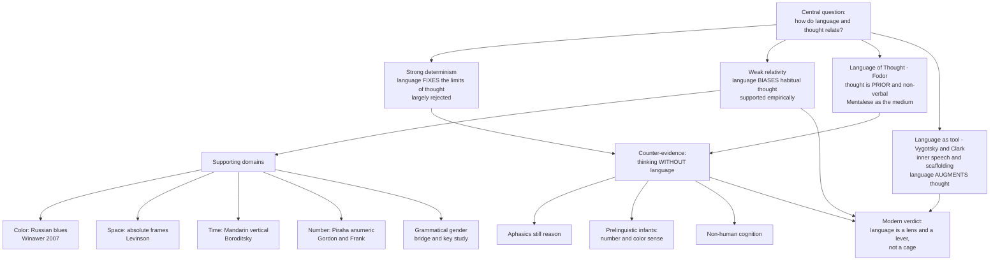

# 🗣️ Language and Cognition

> [!abstract] TL;DR
> Does the language you speak shape the thoughts you can think? The **strong** claim — linguistic determinism, that language *fixes* the boundaries of thought — is largely rejected. The **weak** claim — linguistic relativity, that habitual language *biases* perception, memory, and inference — is supported by careful experiments in **color, space, time, number, and grammatical gender** (Kay, Winawer, Levinson, Boroditsky). Against a purely language-driven view stand Fodor's **Language of Thought** (thought is a prior, non-verbal symbol system), evidence of rich cognition *without* language (aphasics, prelinguistic infants, non-human animals), and the Vygotsky–Clark view of language as a **cognitive tool** that scaffolds rather than constitutes thought. The modern consensus: language is a **lens and a lever**, not a cage.

---

## Intuition

**Analogy:** Think of language as the set of **pre-labelled folders** on your desk. The folders do not create the papers, and you can always shuffle a document into the "miscellaneous" pile — so the folders do not *determine* what you can file. But whatever a folder *already exists* for gets sorted faster, retrieved faster, and noticed more often. Over years, the habit of reaching for those particular folders quietly reshapes which distinctions feel obvious and which feel like effort.

A Russian speaker has two separate "folders" for light blue (*goluboy*) and dark blue (*siniy*) where English has one ("blue"). Neither speaker's eyes are different, but the Russian speaker's ready-made boundary makes them **quicker to tell the two blues apart** — exactly the small, real, measurable nudge that the weak Sapir-Whorf hypothesis predicts.

---

## How It Works

### The space of positions

The relationship between language and thought is not one hypothesis but a **space of competing claims**, ordered by how much causal power they grant language:

1. **Strong linguistic determinism** — language *determines* the categories of thought; what your language lacks a word for, you cannot conceive. Associated (via caricature) with Whorf. **Empirically rejected**: people routinely form concepts they have no word for, learn new distinctions, and translate across languages.
2. **Weak linguistic relativity** — language *influences* thought by making some distinctions habitual, accessible, and cheap. This is the **defensible, well-supported** version, and almost all modern "Whorfian" findings are of this kind.
3. **The Language of Thought (Fodor)** — reasoning happens in an internal, non-natural-language symbol system ("Mentalese"). Natural language is an *output channel*, not the medium of thought; thought is **prior to and independent of** the language you speak.
4. **Language as cognitive tool (Vygotsky, Clark)** — language neither determines nor merely expresses thought; it **augments** it. Internalized speech becomes a control structure for reasoning, and public symbols offload and restructure cognition.

These are not mutually exclusive: relativity effects can be real *and* thought can have a non-verbal core *and* language can be a powerful amplifier.

### Where weak relativity has real evidence

- **Color** — Berlin & Kay showed color *naming* varies across languages but clusters around universal focal hues; Kay & Kempton (1984) then showed the naming boundary **warps perception** (categorical perception at the boundary). Winawer et al. (2007) found Russian speakers discriminate *goluboy*/*siniy* blues faster than English speakers, and the advantage **disappears under verbal interference** — showing language is doing the work online.
- **Space** — Levinson's group found languages using **absolute frames** (cardinal-like: "north of the tree") vs **relative frames** ("left of the tree"). Speakers of absolute-frame languages (Guugu Yimithirr, Tzeltal) stay oriented and solve spatial rotation tasks differently — their non-verbal spatial memory tracks their linguistic frame.
- **Time** — Boroditsky showed Mandarin's **vertical** time metaphors bias vertical time judgments; the Pormpuraaw (Kuuk Thaayorre) lay out time **east-to-west** following cardinal direction, not left-to-right.
- **Number** — the Pirahã, whose language has words only for roughly "one," "two," and "many," succeed on **approximate** matching but fail **exact** large-number matching (Gordon 2004; Frank et al. 2008). Counting words appear to be a **cognitive technology** for exact number, not a precondition for numerical intuition.
- **Grammatical gender** — Boroditsky's bridge/key studies: German (feminine *die Brücke*) speakers call bridges "elegant, slender"; Spanish (masculine *el puente*) speakers call them "strong, sturdy."

### The counter-evidence: thinking without language

- **Aphasia** — patients with **global aphasia** who have lost grammar and most vocabulary can still do arithmetic, follow causal reasoning, play chess, and pass theory-of-mind tasks (Varley et al.). Grammar is **not** the engine of thought.
- **Prelinguistic infants** — babies show **categorical color perception**, an **approximate number system**, object permanence, and causal expectations *before* they have words. Concepts precede the labels.
- **Non-human cognition** — corvids and primates plan, use tools, and track quantities with no natural language at all.

Together these show a **non-linguistic substrate** of thought that language exploits and refines but does not create.

### The processing view: psycholinguistics

Independent of the philosophy, psycholinguistics studies the *machinery*:

- **Comprehension** is **incremental** — the parser commits to interpretations word-by-word, producing **garden-path** misreads ("The horse raced past the barn fell"). It integrates syntax, semantics, and context in real time.
- **Production** runs the pipeline in reverse (Levelt's model): **conceptualization → formulation (lexical selection + grammatical + phonological encoding) → articulation**. Speech errors ("slips of the tongue") expose the stages.
- **Dual coding** (Paivio): information is stored in **two** cooperating codes — a **verbal** symbolic code and a **non-verbal imagery** code — and concrete words that recruit both are remembered better. This is direct evidence that cognition is *not* purely linguistic.



---

## Key Concepts

### Secondary (explain to a curious beginner)
- **Linguistic relativity vs determinism** — *influence* (weak, real) versus *control* (strong, rejected). The "50 words for snow" claim is a **myth**; the real effects are subtle speed and memory biases.
- **Categorical perception** — a boundary between two *words* makes items on opposite sides look more different than items the same physical distance apart on the same side.
- **Thought without words** — babies, animals, and language-impaired adults still think, so language cannot be the *only* medium of thought.

### Undergraduate (needs some cognitive science)
- **Kay & Kempton / Winawer paradigm** — using **discrimination reaction time** and **verbal interference** to test whether a *linguistic* category, not just perception, is driving a behavioral effect.
- **Frames of spatial reference** — absolute vs relative vs intrinsic; how a grammatical habit predicts non-verbal spatial memory (Levinson).
- **The approximate number system (ANS) vs exact counting** — a language-independent magnitude sense plus a **culturally transmitted counting routine**; the Pirahã dissociate the two.
- **Levelt's production model** and **incremental parsing** — the real-time cognitive architecture of speaking and understanding.

### Graduate (system-level tension)
- **Fodor's Language of Thought** vs relativity — if reasoning is computation over an innate, universal symbol system ([[Computational_Theory_of_Mind]]), how can natural-language differences change *thought*? Reconciliation: language shapes the **inputs, attention weighting, and retrieval cues** to a universal engine, not the engine's format.
- **Vygotsky's internalization** and **Clark's extended mind** — private speech becomes **inner speech**, a self-directed control resource; public language becomes **cognitive scaffolding** that offloads computation, linking this topic to [[Embodied_and_Extended_Cognition]].
- **Thinking-for-speaking (Slobin)** — the relativity effect may live specifically at the moment you *prepare an utterance*, when a language forces you to encode tense, gender, or evidentiality you might otherwise ignore.
- **Online vs offline effects** — whether relativity reflects a durable reshaping of representations or a transient, label-recruiting strategy (the verbal-interference result favors "online, strategic").

---

## Python Demo

```python
# Simulate a color-discrimination task to illustrate WEAK linguistic relativity.
# Two "languages" view the SAME green->blue hue continuum:
#   (A) a language WITH a lexical green/blue boundary (like English/Russian)
#   (B) a language WITHOUT it (one "grue" word).
# All adjacent chip pairs are the SAME physical distance apart, so any RT
# difference at the boundary is driven by the *word*, not by low-level optics.
# We generate reaction-time data and plot the categorical-perception signature:
# a dip in discrimination RT exactly at the lexical boundary.

import numpy as np
import matplotlib.pyplot as plt

rng = np.random.default_rng(42)

# --- Stimulus continuum ---------------------------------------------------
n_chips  = 8
boundary = 4.5                        # lexical split sits between chip 4 and 5
pairs    = np.arange(1, n_chips)      # pair i compares chip i and chip i+1
centers  = pairs + 0.5               # plot position of each adjacent pair
cross_boundary = (pairs < boundary) & (pairs + 1 > boundary)  # only pair (4,5)

# --- Model: RT = base - (label speed-up if cross-boundary) + noise --------
base_rt      = 650.0                  # ms, within-category baseline
label_speedup = 90.0                  # ms saved when a word distinguishes the pair
noise_sd     = 40.0
n_trials     = 200

def simulate(has_boundary):
    speedup = label_speedup if has_boundary else 0.0
    rts = np.empty((len(pairs), n_trials))
    for i, is_cross in enumerate(cross_boundary):
        mean = base_rt - (speedup if is_cross else 0.0)
        rts[i] = rng.normal(mean, noise_sd, n_trials)
    return rts

rt_split   = simulate(True)           # language WITH green/blue boundary
rt_nosplit = simulate(False)          # language WITHOUT a boundary

m_split,   se_split   = rt_split.mean(1),   rt_split.std(1) / np.sqrt(n_trials)
m_nosplit, se_nosplit = rt_nosplit.mean(1), rt_nosplit.std(1) / np.sqrt(n_trials)

# --- Plot the categorical-perception signature ----------------------------
fig, ax = plt.subplots(figsize=(8, 5))
ax.errorbar(centers, m_split, yerr=se_split, marker="o", capsize=3,
            label="Language WITH green/blue boundary")
ax.errorbar(centers, m_nosplit, yerr=se_nosplit, marker="s", capsize=3,
            label="Language WITHOUT boundary (one 'grue' word)")
ax.axvline(boundary, color="grey", ls="--", label="Lexical category boundary")
ax.set_xlabel("Adjacent chip pair (green -> blue continuum)")
ax.set_ylabel("Mean discrimination RT (ms)  [lower = faster]")
ax.set_title("Categorical perception: a word boundary speeds cross-boundary discrimination")
ax.legend()
fig.tight_layout()
plt.show()

# --- Quantify the effect --------------------------------------------------
cb = np.where(cross_boundary)[0][0]
within_avg = np.delete(m_split, cb).mean()
print(f"Cross-boundary RT (with words) : {m_split[cb]:6.1f} ms")
print(f"Within-category RT (avg)       : {within_avg:6.1f} ms")
print(f"Categorical-perception advantage: {within_avg - m_split[cb]:6.1f} ms")
```

Running it prints roughly a 90 ms cross-boundary advantage **only** for the language that has the word, and the plot shows a clean RT **dip** at the boundary for that language and a flat line for the language without it — the textbook categorical-perception signature.

---

## Real-World Applications

- **UX and design vocabulary** — giving users explicit *names* for states (e.g., "draft / in review / published") measurably speeds recognition and reduces errors, a practical categorical-perception effect.
- **Second-language pedagogy** — teaching a distinction the learner's L1 lacks (e.g., English /r/–/l/ for Japanese speakers) is a training problem in *installing a new category boundary*; perceptual training reshapes discrimination.
- **Cross-cultural HCI and safety** — spatial-instruction interfaces (turn-by-turn vs cardinal) and number/date formats interact with the user's habitual linguistic frame; assuming "left/right" is universal fails for absolute-frame speakers.
- **AI and LLMs** — large language models are a live experiment in *how much* cognition-like behavior arises from linguistic form alone; the language-vs-thought debate reframes as "what does statistical language structure encode about the world?"
- **Number cognition and education** — the ANS-vs-counting dissociation informs early-math curricula: exact arithmetic must be *taught as a symbolic technology*, it does not fall out of number intuition automatically.

---

## Common Pitfalls

- **Confusing the strong and weak claims** — refuting linguistic *determinism* (easy) is often mistaken for refuting *all* relativity effects (which are robust). Always specify which version is on the table.
- **The "many words for snow" trope** — vocabulary richness is not evidence of altered cognition; polysynthetic morphology inflates word counts without implying different perception.
- **Naming ≠ perceiving** — a naming difference across languages does not by itself prove a *perceptual* or *cognitive* difference. The strong tests add reaction time, verbal interference, and non-verbal memory measures.
- **Ignoring online strategy** — many relativity effects vanish under a concurrent verbal task, suggesting the language is being *recruited on the fly* rather than having permanently rewired perception. Reporting an effect without this control overstates it.
- **Treating counting words as innate number sense** — the Pirahã case shows exact number is a *learned technology*; conflating it with the innate approximate number system misreads the data.
- **Over-crediting language for reasoning** — aphasia evidence shows grammar can be lost while logical and mathematical reasoning survive; do not assume "no words, no thought."

---

## Related Concepts

- [[Computational_Theory_of_Mind]] — Fodor's Language of Thought / Mentalese lives here: the counter-position that thought is a prior, non-verbal symbol system that language merely reports.
- [[Embodied_and_Extended_Cognition]] — Clark's "language as cognitive scaffolding" and Vygotsky's internalized speech, the *tool* view of language augmenting cognition.
- [[Theories_of_Perception]] — categorical perception and the Bayesian/top-down machinery that lets a linguistic prior warp a perceptual boundary.
- [[Language_and_Thought]] — the Psychology-vault companion covering acquisition, aphasia neuroanatomy, and concept/prototype theory in more depth.
- [[Cognitive_Semantics_and_Metaphor]] — the Linguistics-vault treatment of embodied meaning and conceptual metaphor, the mechanism behind many time/space relativity effects.

---

## Review Questions

1. **(Conceptual)** Distinguish linguistic *determinism* from linguistic *relativity*. Why does refuting the first tell us almost nothing about the second, and what specific experimental controls separate a mere *naming* difference from a genuine *cognitive* one?
2. **(Scenario)** You find that Russian speakers discriminate two shades of blue faster than English speakers. A colleague concludes "language rewires perception." Design a follow-up (hint: verbal interference) that could show the effect is instead an *online, label-recruiting strategy*, and explain how each outcome should change your conclusion.
3. **(Trade-off / integrative)** Fodor argues thought is prior to and independent of natural language, yet weak relativity effects are real. Construct a single account in which *both* are true, specifying exactly where in the cognitive pipeline (representation format, attention weighting, retrieval cues, thinking-for-speaking) natural language exerts its influence.

---

## Sources

- Boroditsky, L. (2011). "How Language Shapes Thought." *Scientific American*, 304(2).
- Winawer, J., Witthoft, N., Frank, M. C., Wu, L., Wade, A. R., & Boroditsky, L. (2007). "Russian blues reveal effects of language on color discrimination." *PNAS*, 104(19).
- Levinson, S. C. (2003). *Space in Language and Cognition: Explorations in Cognitive Diversity*. Cambridge University Press.
- Gordon, P. (2004). "Numerical Cognition Without Words: Evidence from Amazonia." *Science*, 306(5695); and Frank, M. C. et al. (2008), *Cognition*, 108(3).
- Fodor, J. A. (1975). *The Language of Thought*. Harvard University Press.

---

#cognitive-science #language-and-thought #linguistic-relativity #sapir-whorf #psycholinguistics
