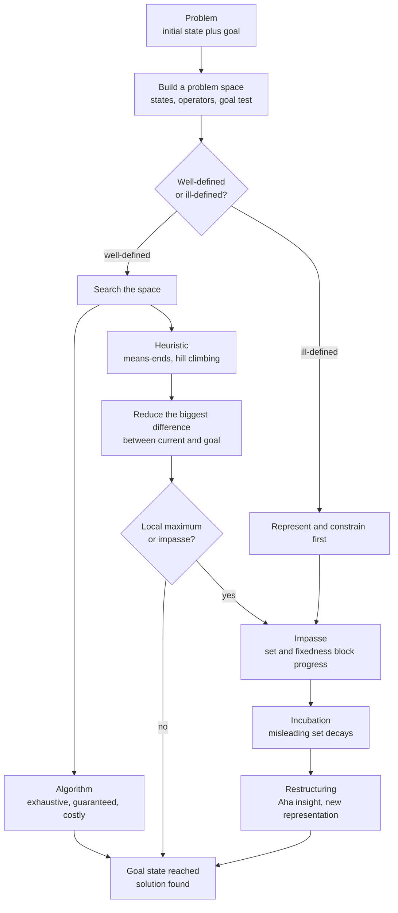

# 🧩 Problem Solving and Insight

> [!abstract] TL;DR
> Problem solving is the search for a path from where you are to where you want to be. Newell and Simon recast this as literal *search through a problem space* — a graph of states connected by operators, filtered by a goal test — and showed that humans, like their General Problem Solver program, navigate it with **heuristics** (chiefly means-ends analysis) rather than exhaustive **algorithms**, because the space is far too large to enumerate. The rival Gestalt tradition studies the moments when this incremental search hits an impasse and the solution instead arrives whole, through a sudden **restructuring** of the problem itself — the "Aha!" of insight, blocked by fixations like functional fixedness and mental set, and sometimes unlocked only after incubation.

---

## Intuition

**Analogy:** Imagine you land at night in an unfamiliar city and must reach a specific hotel with no map and no phone. You *could* walk every street until you stumble on it (an exhaustive algorithm — guaranteed but hopeless). Instead you glance at the skyline, spot the tallest lit tower roughly where the hotel should be, and at every intersection you take the turn that most reduces the gap between you and that landmark. You are not guaranteed to be right, and occasionally a river forces you to walk *away* from the hotel to reach a bridge — but you get there far faster than blind wandering. That "always shrink the distance to the goal" rule *is* means-ends analysis, the core human problem-solving heuristic.

Now imagine the hotel is hidden behind an unmarked door you keep walking past because it looks like a shop. No amount of clever turn-taking helps — the failure is in how you *see* the scene, not in your route. Suddenly you notice the tiny brass plaque and the whole street reorganizes in your mind. That flip is **insight**: not more search, but a new *representation* of the same space.

---

## How It Works

### Core Mechanics

**1. The problem space (Newell & Simon, 1972).** Their *problem-space hypothesis* says all deliberate problem solving takes place inside a mentally constructed space defined by four things: an **initial state**, a set of **operators** (legal moves that transform one state into another), the resulting **states** those operators reach, and a **goal test** that recognizes a solution. Solving = finding a sequence of operators that carries the initial state to a goal state. This is the same abstraction used by every graph-search algorithm in computer science, which is exactly why the theory bridges psychology and AI (see [[Computational_Theory_of_Mind]]).

**2. Well-defined vs. ill-defined problems.** A *well-defined* problem has an explicit initial state, a crisp goal test, and a known operator set — chess, algebra, the Tower of Hanoi. An *ill-defined* problem has fuzzy or missing pieces: "write a great novel," "improve team morale." Most laboratory problem-solving research uses well-defined puzzles because the space is specifiable; most *real* problems are ill-defined, and their hardest step is *constructing* a workable problem space in the first place.

**3. Algorithms vs. heuristics.** An **algorithm** systematically explores the space and is guaranteed to find a solution if one exists (breadth-first search, exhaustive enumeration). It is correct but combinatorially explosive — chess has more legal positions than atoms in the observable universe. A **heuristic** is a rule of thumb that prunes the space, trading the guarantee for tractability. Humans are obligate heuristic searchers because working memory can hold only a handful of states at once (see [[Working_Memory_and_Cognitive_Load]]).

**4. Means-ends analysis and the General Problem Solver.** Newell, Shaw, and Simon's **GPS** (1957) mechanized the central human heuristic: (a) compare the current state to the goal and identify the biggest *difference*; (b) find an operator known to reduce that kind of difference; (c) if the operator can't be applied yet, set up a *subgoal* to create the conditions it needs, and recurse. This is recursive difference-reduction with subgoaling — the algorithmic skeleton behind "to reach the hotel I must cross the river, so first I must reach the bridge."

**5. Hill climbing and local maxima.** The simplest form of difference-reduction is **hill climbing**: always take the single move that most improves your evaluation of nearness to the goal. It is cheap and memory-light, but it fails whenever the solution requires a *temporary* step backward. Tower of Hanoi is the canonical trap — you must move a disk *off* the goal peg to make progress. Pure hill climbing stalls at a **local maximum** (an impasse), which is precisely where insight problems live.

**6. The Gestalt tradition — insight and restructuring.** Where Newell and Simon saw incremental search, the earlier Gestalt psychologists (Wertheimer, Köhler, Duncker) studied problems solved by a sudden *reorganization of perception*. Köhler's chimpanzee Sultan did not gradually search a space of arm movements; he sat, then abruptly stacked crates to reach a banana. Insight is defined as a solution reached through **restructuring** — changing how the problem is represented — rather than through step-by-step operator application. It typically follows an *impasse* and arrives with the sudden confident "Aha!".

**7. Functional fixedness — Duncker's candle problem (1945).** Given a candle, a box of tacks, and matches, and asked to fix the candle to the wall so it burns without dripping, most people fail to see that the *tack box itself* can be emptied and tacked up as a shelf. They are fixated on the box's conventional function (a container). **Functional fixedness** is the failure to represent an object's affordances beyond its habitual use — a fixation in the *state/operator* representation.

**8. Mental set — Luchins' water-jar problem (1942).** After solving several water-measuring puzzles with the same three-jar formula, participants keep mechanically applying that long formula even when a trivially shorter solution exists, and some fail entirely when only the short solution works. This **Einstellung** or **mental set** is a fixation carried in from prior success — the mind reuses a proven operator sequence instead of re-searching the space.

**9. The Aha! moment and its neural signature.** Kounios and Beeman used EEG and fMRI to catch insight as it happens. Solutions experienced as sudden insight (versus gradual analysis) are preceded ~1.5 s earlier by an **alpha-band "brain blink"** over right visual cortex (gating out distraction) and accompanied at the moment of solution by a **burst of high-frequency gamma activity in the right anterior superior temporal gyrus** — a region tied to distant, non-obvious semantic connections. Insight is a real, measurable cognitive event, not a metaphor.

**10. Incubation and unconscious processing.** Setting an impasse aside and doing something else often lets the solution surface later. The leading explanation is *selective forgetting*: the misleading mental set and functional-fixedness bindings decay over the break, so on return the solver re-enters the space with a less-constrained representation. Unconscious spreading activation may also continue to explore weak associates below awareness.

**11. Analogical problem solving — Duncker's radiation problem (Gick & Holyoak, 1980).** How do you destroy a stomach tumor with rays strong enough to kill it without destroying the healthy tissue they pass through? The solution — many weak rays converging from all sides — is readily *transferred* by anyone who has just read a story about a general capturing a fortress by sending small groups down many roads at once. But without a hint, most people fail to notice the analogy: **surface features dominate retrieval**, while it is the shared *structural* relations that carry the solution (see [[Analogical_Reasoning]]).

**12. Expertise, chunking, and problem representation (Chase & Simon, 1973).** Chess masters and novices shown a real game position for five seconds differ hugely in recall — but on *random* positions their recall is equal. Masters do not have better raw memory; they perceive the board as a few meaningful **chunks** (familiar patterns) rather than dozens of individual pieces. Expertise is largely superior *problem representation*: experts search a space organized around perceptual patterns and typical operator sequences, which is why they consider far fewer moves yet find better ones.

**13. Working memory as the bottleneck.** Every heuristic humans use — limited look-ahead, subgoaling, chunking — is a response to the fact that only a few states and partial results can be actively maintained at once. Individual differences in problem-solving skill track working-memory capacity, and load (stress, distraction, dual tasks) reliably degrades multi-step search.

### Flow / Architecture



---

## Key Concepts

**Secondary (intuitive level)**
- Solving a problem is finding a route from where you are to where you want to be through a maze of possible moves.
- A guaranteed method that checks everything (an *algorithm*) is often too slow, so people use clever shortcuts (*heuristics*) that usually work.
- Sometimes the answer will not come by trying moves — it arrives all at once when you suddenly *see the problem differently*. That flash is **insight** ("Aha!").
- Getting stuck often means you are fixated: you keep seeing an object as only its usual use (a box is *only* a container).

**Undergraduate (conceptual level)**
- *Problem space*: initial state, operators, resulting states, goal test — Newell and Simon's framework linking psychology to graph search.
- *Well-defined vs. ill-defined*: whether the states, operators, and goal are fully specified; real-world problems are usually ill-defined.
- *Means-ends analysis*: recursively identify the largest difference from the goal, apply a difference-reducing operator, and set subgoals — the engine of the **General Problem Solver**.
- *Hill climbing and local maxima*: greedy difference-reduction that stalls when progress requires a temporary step backward.
- *Gestalt fixations*: **functional fixedness** (Duncker's candle) and **mental set / Einstellung** (Luchins' water jars) as failures of representation, not of effort.
- *Analogical transfer* (Gick & Holyoak): solutions move between problems that share deep structure, but retrieval is captured by surface similarity.

**Graduate (technical / disputed level)**
- *Insight as restructuring vs. business-as-usual search*: the "special-process" view (representational change, constraint relaxation — Ohlsson) versus the "nothing-special" view that insight is ordinary search with a subjective suddenness marker. Progress-monitoring and criterion-for-satisfactory-progress theories try to unify them.
- *Neural signature of insight* (Kounios & Beeman): right-hemisphere anterior temporal gamma burst plus pre-solution alpha gating; questions remain about causality versus correlation and about individual "insightful vs. analytic" cognitive styles.
- *Incubation mechanisms*: selective forgetting of misleading sets versus continued unconscious spreading activation versus mere fatigue relief — meta-analyses find real but moderate incubation effects, larger for ill-defined creative problems.
- *Expertise and chunking* (Chase & Simon; template theory, Gobet & Simon): whether expert advantage is stored chunks/templates, faster pattern recognition, or reorganized long-term working memory (Ericsson & Kintsch).
- *Bounded rationality and satisficing* (Simon): heuristic search is not a defect but an adaptation to combinatorial explosion under working-memory limits; the mind optimizes for good-enough under cost.

---

## Python Demo

```python
# Newell & Simon's PROBLEM-SPACE HYPOTHESIS made concrete.
# A problem = {initial state, operators, goal test}. Solving = SEARCH.
# We solve the 3-disk Tower of Hanoi two ways and compare how much of the
# space each touches:
#   (1) BFS  -- blind, exhaustive, guarantees the SHORTEST solution.
#   (2) Greedy best-first "means-ends" search -- always expand the frontier
#       state whose DIFFERENCE from the goal is smallest (heuristic guidance).
# Then we visualize how the BFS search tree grows level by level.
# Only numpy + matplotlib are used (plus the standard-library deque).

import numpy as np
import matplotlib.pyplot as plt
from collections import deque

N_DISKS = 3
PEGS = (0, 1, 2)
START = (0,) * N_DISKS      # state[d] = peg holding disk d; disk 0 is smallest
GOAL  = (2,) * N_DISKS      # every disk stacked on peg 2

def legal_moves(state):
    """Operators: move the top (smallest) disk of a peg onto another peg,
    never placing a larger disk on a smaller one."""
    tops = {}                                   # peg -> smallest disk on it
    for disk, peg in enumerate(state):          # disks scanned small -> large
        if peg not in tops:
            tops[peg] = disk
    succ = []
    for src, moving in tops.items():
        for dst in PEGS:
            if dst == src:
                continue
            if dst in tops and tops[dst] < moving:
                continue                        # cannot stack larger on smaller
            new = list(state)
            new[moving] = dst
            succ.append(tuple(new))
    return succ

# --- (1) Breadth-first search over the state space ----------------------
def bfs(start, goal):
    frontier = deque([start])
    came_from = {start: None}
    depth = {start: 0}
    order = []                                  # states in the order expanded
    while frontier:
        s = frontier.popleft()
        order.append(s)
        if s == goal:
            break
        for nxt in legal_moves(s):
            if nxt not in came_from:
                came_from[nxt] = s
                depth[nxt] = depth[s] + 1
                frontier.append(nxt)
    return order, came_from, depth

order, came_from, depth = bfs(START, GOAL)

# reconstruct the shortest solution path
path, node = [], GOAL
while node is not None:
    path.append(node)
    node = came_from[node]
path.reverse()

print("Total legal states in the space :", 3 ** N_DISKS)
print("States expanded by BFS          :", len(order))
print("Shortest solution length        :", len(path) - 1, "moves")

# --- (2) Greedy best-first search = heuristic "means-ends" reduction -----
def heuristic(state):
    # difference to the goal: how many disks are NOT yet on the target peg
    return sum(1 for peg in state if peg != GOAL[0])

def greedy_best_first(start, goal):
    frontier = [start]
    visited = {start}
    order = []
    while frontier:
        frontier.sort(key=heuristic)            # expand the state nearest goal
        s = frontier.pop(0)
        order.append(s)
        if s == goal:
            break
        for nxt in legal_moves(s):
            if nxt not in visited:
                visited.add(nxt)
                frontier.append(nxt)
    return order

greedy_order = greedy_best_first(START, GOAL)
print("States expanded by greedy MEA   :", len(greedy_order))

# --- Visualize BFS search-tree growth -----------------------------------
max_d = max(depth.values())
width = np.array([sum(1 for d in depth.values() if d == k)
                  for k in range(max_d + 1)])
cumulative = np.cumsum(width)

fig, ax = plt.subplots(1, 2, figsize=(11, 4))
ax[0].bar(np.arange(max_d + 1), width, color="#4C78A8", edgecolor="black")
ax[0].set_xlabel("BFS depth (moves from start)")
ax[0].set_ylabel("new states discovered")
ax[0].set_title("Frontier width per level")

ax[1].plot(np.arange(max_d + 1), cumulative, "o-", color="#E45756")
ax[1].axhline(3 ** N_DISKS, ls="--", color="gray", label="whole state space")
ax[1].set_xlabel("BFS depth")
ax[1].set_ylabel("cumulative states explored")
ax[1].set_title("Search tree growth")
ax[1].legend()

plt.tight_layout()
plt.savefig("hanoi_search.png", dpi=120)
print("saved hanoi_search.png")

# Takeaway: BFS is an ALGORITHM -- it fans out and ends up touching essentially
# the whole 27-state space because the goal corner is the farthest node.
# Greedy means-ends is a HEURISTIC -- it lets the goal-difference pull the
# search forward and generally expands fewer states. That trade (guarantee vs.
# tractability) is the entire story of human problem solving under a tiny
# working memory.
```

---

## Real-World Applications

> **Example:** Classical **AI planners** are the direct descendants of the General Problem Solver. STRIPS and modern PDDL planners represent a task exactly as Newell and Simon's problem space — an initial state, a goal, and operators with preconditions and effects — and search it with heuristics that estimate the difference to the goal, the automated form of means-ends analysis.

- **Chess and game engines:** engines search a move-tree with heuristic evaluation and pruning; human masters, per Chase & Simon, prune far more aggressively using perceptual **chunks**, considering only a handful of candidate moves.
- **Medical diagnosis:** clinicians run a means-ends-like differential — each unexplained symptom is a "difference" to reduce by ordering the test most likely to close it; premature fixation on a first hypothesis mirrors mental set.
- **Design and engineering:** functional fixedness is the everyday enemy of innovation; techniques like the "generic parts technique" force decomposition of objects into function-free features to break the box-is-only-a-container trap.
- **Education:** worked-example and analogy training (Gick & Holyoak) improves transfer only when instruction highlights *structural* relations over surface cover stories; incubation breaks are deliberately built into creative and design-thinking workflows.

---

## Common Pitfalls

- **Mistaking neat lab puzzles for real problems** — Tower of Hanoi and water jars are *well-defined*; most real problems are ill-defined, and their crux is constructing the problem space, a step the tidy-puzzle literature can obscure.
- **Treating insight as magic** — "it just came to me" invites a mystical reading. The evidence points to a mechanical story: an impasse from a bad representation, decay of the misleading set during incubation, and a restructuring that reopens search. No homunculus required.
- **Confusing a heuristic with an algorithm** — a heuristic gives no guarantee. Assuming means-ends analysis or hill climbing will always find the optimum ignores local maxima, exactly the impasses where these methods break.
- **Ignoring that expertise cuts both ways** — the same chunking that makes masters brilliant produces the **Einstellung effect**: strong patterns block better non-obvious solutions. Experience is not uniformly good for novel problems.
- **Expecting analogical transfer for free** — people retrieve analogues by surface similarity, so a structurally perfect analogy from a different domain usually goes unnoticed without a hint. Assuming learners will "just see it" is why transfer so often fails.
- **Overloading working memory** — multi-step search silently depends on holding subgoals and partial states active; stress, interruptions, and dual tasks degrade it, so "they just need to try harder" often misdiagnoses a capacity limit.

---

## Related Concepts

- [[Computational_Theory_of_Mind]] — Newell and Simon's Physical Symbol System Hypothesis frames problem solving as search over symbol structures; the same lineage as GPS.
- [[Analogical_Reasoning]] — analogical problem solving (Duncker's radiation problem, Gick & Holyoak) transfers structure across problems and is a route around impasses.
- [[Problem_Solving_and_Decision_Making]] — the psychology-vault companion covering heuristics-and-biases, dual-process theory, and prospect theory alongside these mechanisms.
- [[Working_Memory_and_Cognitive_Load]] — the capacity bottleneck that forces heuristic rather than exhaustive search and predicts individual differences in problem-solving skill.
- [[BFS]] — the exhaustive-algorithm baseline used in the demo; blind breadth-first search over the state space.
- [[A_Star_Search]] — heuristic best-first search formalized: the AI counterpart of means-ends analysis, guiding search with a goal-distance estimate.

---

## Review Questions

1. **(Secondary)** Explain, using the night-in-an-unfamiliar-city analogy, the difference between an algorithm and a heuristic. Why does a person almost never solve a real problem by "checking every possibility"?
2. **(Undergraduate)** Describe the problem space for the Tower of Hanoi (states, operators, goal test). Why does pure hill climbing fail on it, and how does that failure illuminate what an "impasse" is in insight problems?
3. **(Graduate)** Duncker's radiation problem is solved readily after reading the fortress-and-general story, yet usually missed without the hint. Explain what this reveals about retrieval in analogical transfer, and evaluate whether the "convergence" insight is better described as restructuring (special-process view) or as ordinary search that merely *feels* sudden. Bring in at least one piece of neural or behavioral evidence.

---

## Sources

- Newell, A. & Simon, H. A. (1972). *Human Problem Solving*. Prentice-Hall.
- Duncker, K. (1945). "On Problem-Solving." *Psychological Monographs*, 58(5), i–113. https://doi.org/10.1037/h0093599
- Gick, M. L. & Holyoak, K. J. (1980). "Analogical Problem Solving." *Cognitive Psychology*, 12(3), 306–355. https://doi.org/10.1016/0010-0285(80)90013-4
- Chase, W. G. & Simon, H. A. (1973). "Perception in Chess." *Cognitive Psychology*, 4(1), 55–81. https://doi.org/10.1016/0010-0285(73)90004-2
- Kounios, J. & Beeman, M. (2014). "The Cognitive Neuroscience of Insight." *Annual Review of Psychology*, 65, 71–93. https://doi.org/10.1146/annurev-psych-010213-115154

---

#cognitive-science #problem-solving #insight #heuristic-search #means-ends-analysis
