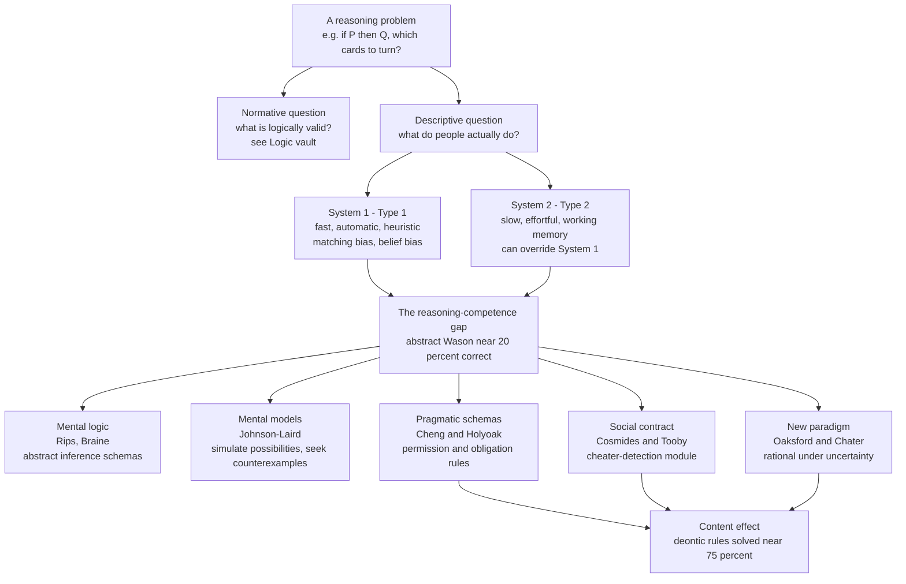

# 🧠 Reasoning and Inference

> [!abstract] TL;DR
> The **psychology** of reasoning studies how people *actually* draw conclusions, not how a logic textbook says they *should*. The headline finding is a systematic gap between the two: on the famous **Wason selection task** fewer than a quarter of educated adults find the logically correct answer to an abstract rule, yet the *same* logical structure dressed as a social rule ("if you drink beer you must be over 18") is solved by most people. Explaining this gap has driven a fifty-year debate between **mental logic** theories (we reason with abstract inference rules in the head), **mental models** theory (we reason by imagining possibilities), **pragmatic reasoning schemas** and **social-contract** accounts (we reason with domain-specific rules tuned to permissions, obligations, and cheating), and a **dual-process** framework (a fast intuitive System 1 versus a slow analytic System 2). The field's "new paradigm" reframes everyday conditionals as **probabilistic** and treats people as broadly *rational under uncertainty* rather than broken logicians.

---

## Intuition

**Analogy:** Give someone this puzzle in the abstract — "Here are four cards. Each has a letter on one side and a number on the other. You see **A**, **K**, **4**, **7**. Which cards must you turn over to check the rule *if a card has a vowel on one side, it has an even number on the other*?" — and most people freeze, then confidently pick the wrong cards. Now give the *identical logical puzzle* to a bouncer: "Four people are drinking. One has **beer**, one has **coke**, one is clearly **25**, one is clearly **16**. Whose ID must you check to enforce *if you're drinking beer you must be over 18*?" — and almost everyone instantly nails it (the beer-drinker and the 16-year-old). Same logic, wildly different success.

That single dissociation is the engine of the whole field. It tells us reasoning is **not** the execution of content-free logical rules. The *meaning*, the *context*, and especially whether the problem looks like **catching a cheater** change performance more than the logical form does. The psychology of reasoning is the attempt to reverse-engineer the actual machinery that produces this pattern.

---

## How It Works

### The two classic problem families

Research grew from two experimental workhorses:

1. **Conditional reasoning** — "If P then Q." Four inferences can be drawn. Two are logically **valid**: *modus ponens* (given P, conclude Q) and *modus tollens* (given not-Q, conclude not-P). Two are **fallacies**: *affirming the consequent* (given Q, conclude P) and *denying the antecedent* (given not-P, conclude not-Q). People are near-perfect on modus ponens but reliably *miss* modus tollens and reliably *commit* the two fallacies — a signature that is hard for a pure-logic account to explain.

2. **Syllogistic reasoning** — "All A are B; all B are C; therefore...?" Here accuracy depends heavily on the *believability* of the conclusion, not just its validity (see **belief bias** below).

### The Wason selection task and content effects

Peter Wason's 1966 task is the most-studied item in the field. The **abstract** version yields roughly **10–25%** correct. The crucial discovery was that **thematic content** can dramatically boost performance — but not just any content. Cheng and Holyoak's **permission** framing and Cosmides and Tooby's **social-contract** framing (rules of the form "if you take a benefit, you must pay a cost") produce **65–80%** correct. Arbitrary-but-realistic rules do *not* reliably help. The facilitation is tied to a specific kind of *deontic* content, not to concreteness per se.

### The great theoretical divide: rules vs models

- **Mental logic / natural deduction** (Rips' *PSYCOP*; Braine & O'Brien): the mind contains a repertoire of **abstract inference schemas** (a psychological analogue of natural deduction). Reasoning is applying these rules to the logical form of a problem. Errors come from missing rules, heavy proof search, or misparsing the premises. Strength: explains why some inferences (modus ponens) are trivially easy. Weakness: struggles to explain why *content* changes performance so much when the *form* is held constant.

- **Mental models theory** (Johnson-Laird): people reason not with syntactic rules but by constructing **mental models** — small simulations of the *possibilities* consistent with the premises. You reason by (a) building an initial model, (b) reading a putative conclusion off it, and (c) searching for **counterexample** models that falsify it. The killer prediction: difficulty scales with the **number of models** you must hold in working memory. Reasoning that needs only one model is easy; reasoning that requires **fleshing out** implicit models (e.g., modus tollens, or double-negation) is hard and error-prone — exactly the observed profile.

### Belief bias

In syllogistic reasoning, people accept **invalid** conclusions that are *believable* and reject **valid** conclusions that are *unbelievable*. Validity and believability are confounded in judgment. This is a decisive datum: a content-free logic engine could never show it. It also became a flagship demonstration for **dual-process** theory — belief-based responding looks like fast **System 1**, while overriding a believable-but-invalid conclusion requires effortful **System 2**.

### Dual-process theory (Evans, Stanovich)

Two kinds of processing coexist. **Type 1 / System 1** is fast, automatic, high-capacity, and heuristic (it delivers the *matching*, *believable*, or *pragmatically obvious* answer). **Type 2 / System 2** is slow, effortful, working-memory-dependent, and capable of **hypothetical, decoupled** reasoning that can *override* the intuitive answer. Stanovich adds that individual differences in **cognitive ability** and **thinking dispositions** predict who overrides System 1 — and that the "correct" normative standard is itself something people vary in recognizing.

### The "new paradigm": reasoning as rational under uncertainty

Oaksford and Chater argued the whole enterprise mis-scored people against the *wrong* normative model. Everyday "if" is not the brittle **material conditional** of classical logic; it expresses a **high conditional probability** of Q given P. Under their **information-gain** model, the "wrong" Wason card choices are actually the ones that *maximize expected information* about whether the rule holds — a **Bayesian**, not a deductive, strategy. This **new paradigm** treats human reasoners as broadly *rational under uncertainty*, replaces truth-tables with **probabilities**, and reframes conditionals via the **Ramsey test** (evaluate "if P then Q" by hypothetically supposing P and assessing Q). The normative *logic* still matters — see the Logic vault — but as one idealization among several, not the only yardstick.



---

## Key Concepts

### Secondary (intuition-level)
- **Reasoning is not logic.** People are excellent at some inferences (modus ponens) and terrible at others (modus tollens) even though both are equally valid.
- **The Wason selection task**: turn over the cards that could *break* the rule. Abstract version is hard; the "check the drinker's age" version is easy.
- **Content matters more than form.** Whether a problem *looks like catching a rule-breaker* predicts success better than its logical structure.

### Undergraduate (mechanism-level)
- **Conditional inference profile**: modus ponens (easy, valid), modus tollens (hard, valid), affirming the consequent and denying the antecedent (common fallacies). Explaining *this specific pattern* is the test any theory must pass.
- **Mental models theory** (Johnson-Laird): reason by building models of possibilities; difficulty tracks the **number of models** and the need to **flesh out** implicit ones. Predicts *systematic, content-sensitive* error.
- **Mental logic** (Rips, Braine): reason by applying **abstract inference rules** to logical form; difficulty tracks **proof length** and rule availability.
- **Belief bias**: conclusion **believability** contaminates **validity** judgments — the clean signature that reasoning is not a formal engine.
- **Dual-process account** (Evans, Stanovich): heuristic **System 1** vs analytic **System 2**; overriding a compelling-but-wrong intuition is effortful and predicted by cognitive ability.

### Graduate (debate-level)
- **The rules-vs-models debate** is partly *underdetermined*: both frameworks can be tuned to fit many results, so discriminating experiments (double-negation costs, illusory inferences, model-count manipulations) matter more than global claims.
- **Pragmatic reasoning schemas** (Cheng & Holyoak): intermediate between content-free rules and content-specific memories — abstract-but-domain-bound schemas for **permission** ("to do X you must satisfy precondition Y") and **obligation** that carry their own inference rules.
- **Social-contract theory / cheater detection** (Cosmides & Tooby): an *evolved, modular* explanation. Facilitation appears specifically for **benefit-cost** rules because a specialized algorithm evolved to detect **cheaters** who take benefits without paying costs. Rival accounts (deontic logic of Sperber; relevance theory) contest whether the effect is truly cheating-specific.
- **The new paradigm** (Oaksford & Chater; Evans & Over): shift from **binary truth** to **subjective probability**; the conditional is assessed by the **Ramsey test** and its acceptability equals **P(Q|P)** ("the conditional probability hypothesis," supported by the finding that people evaluate "if P then Q" by the proportion of P-cases that are Q). Recasts classic "errors" as **rational information-seeking**.
- **Open frontier**: integrating dual-process architecture with Bayesian rationality — is System 1 itself running approximate Bayesian inference, with System 2 doing explicit hypothetical decoupling?

---

## Python Demo

We simulate the Wason selection task as a population of reasoners. The task is "if P then Q," and the **only** logically correct selection is the pair `{P, not-Q}` (the two cards that could reveal a P-and-not-Q violation). We model **per-card selection probabilities** for two conditions and compare percent fully correct. The abstract condition is dominated by **matching bias** (people pick the cards *named* in the rule — P and Q — so the decisive `not-Q` is missed); the deontic drinking-age condition triggers **cheater detection**, which flags the under-age person (`not-Q`).

```python
# Wason selection task: abstract rule vs deontic (drinking-age) rule.
# Correct answer for "if P then Q" is to turn exactly {P, not-Q}.
import numpy as np
import matplotlib.pyplot as plt

rng = np.random.default_rng(42)
N = 5000  # simulated participants per condition

# Card order: [P, not-P, Q, not-Q]
labels = ["P", "not-P", "Q", "not-Q"]

# ABSTRACT rule: "if a card shows a vowel, its other side is even."
# Selection is driven by MATCHING BIAS -> pick cards NAMED in the rule (P and Q),
# so the logically decisive not-Q is usually missed.
p_abstract = np.array([0.90,   # P     -> matches the rule, almost always chosen
                       0.05,   # not-P -> correctly ignored
                       0.62,   # Q     -> matches -> chosen (the classic ERROR)
                       0.22])  # not-Q -> decisive card, usually MISSED

# DEONTIC rule: "if drinking beer, must be over 18."
# A social-contract / cheater-detection schema flags the drinker (P) and the
# under-age person (not-Q) as the ones who could be cheating.
p_deontic  = np.array([0.92,   # P (beer drinker) -> check age
                       0.10,   # not-P (coke)     -> irrelevant
                       0.30,   # Q (over 18)      -> weaker pull than abstract Q
                       0.85])  # not-Q (under 18) -> cheater detection CATCHES it

def simulate(p, n):
    picks = rng.random((n, 4)) < p            # independent choice per card
    # fully correct == chose exactly {P, not-Q}: cols 0 & 3 True, cols 1 & 2 False
    correct = picks[:, 0] & picks[:, 3] & ~picks[:, 1] & ~picks[:, 2]
    return picks.mean(axis=0), correct.mean()

rate_abs, pc_abs = simulate(p_abstract, N)
rate_deo, pc_deo = simulate(p_deontic, N)

print(f"Abstract  % fully correct : {100*pc_abs:5.1f}%")
print(f"Deontic   % fully correct : {100*pc_deo:5.1f}%")
print(f"Facilitation effect       : {100*(pc_deo - pc_abs):5.1f} percentage points")

fig, (ax1, ax2) = plt.subplots(1, 2, figsize=(11, 4.5))

# Left: the headline content effect (percent choosing the correct pair)
ax1.bar(["Abstract\nrule", "Deontic\n(drinking age)"],
        [100*pc_abs, 100*pc_deo], color=["#dc2626", "#059669"])
ax1.set_ylabel("% choosing correct pair {P, not-Q}")
ax1.set_ylim(0, 100)
ax1.set_title("Wason facilitation: content beats form")
for i, v in enumerate([100*pc_abs, 100*pc_deo]):
    ax1.text(i, v + 2, f"{v:.0f}%", ha="center", fontweight="bold")

# Right: per-card selection rates reveal WHY (matching bias vs cheater detection)
x = np.arange(4); w = 0.38
ax2.bar(x - w/2, 100*rate_abs, w, label="Abstract", color="#dc2626")
ax2.bar(x + w/2, 100*rate_deo, w, label="Deontic",  color="#059669")
ax2.set_xticks(x); ax2.set_xticklabels(labels)
ax2.set_ylabel("% selecting each card")
ax2.set_title("Matching bias keeps abstract Q high;\ndeontic not-Q jumps")
ax2.legend()

plt.tight_layout()
plt.show()
```

**What it shows.** Because "fully correct" requires *both* selecting `P` and `not-Q` *and* rejecting `Q` and `not-P`, the abstract condition collapses to a low rate — the high `Q` selection (matching bias) and low `not-Q` selection together sabotage most participants, reproducing the classic ~15–20% figure. In the deontic condition `not-Q` selection jumps and `Q` selection falls, so the correct pair emerges far more often, reproducing the ~60–75% facilitation. The right-hand panel makes the **matching-bias account** visible: in the abstract case the two *named* cards (`P`, `Q`) dominate regardless of logic; the content effect is essentially the reallocation of attention from the matched `Q` to the logically decisive `not-Q`.

---

## Real-World Applications

- **Auditing, compliance, and fraud detection.** The social-contract finding generalizes: humans are dramatically better at spotting *rule violations framed as cheating* ("who took the benefit without paying the cost?") than at abstract consistency checking. Effective compliance training frames checks as cheater-detection, not as material-conditional verification.
- **Contract and policy design.** Deontic framing ("to receive X you must have done Y") is understood and enforced far more reliably than logically equivalent descriptive framing. This shapes how permissions, entitlements, and terms of service are written.
- **Medical and intelligence diagnosis.** Belief bias and confirmation-style card selection explain why experts under-test disconfirming possibilities (the missing `not-Q`). Structured differential diagnosis and "consider the opposite" prompts are System 2 scaffolds that force the neglected test.
- **AI and LLM evaluation.** Conditional-reasoning and syllogism benchmarks are used to probe whether language models show *human-like* content effects and belief bias — a live question in machine-reasoning research, and a bridge to the normative treatments in the Logic vault.
- **Debiasing and education.** Teaching the *form* of an argument (as in formal logic courses) transfers poorly; teaching **pragmatic schemas** (permission/obligation reasoning) and explicit **counterexample search** transfers better, consistent with mental-models pedagogy.

---

## Common Pitfalls

- **Treating classical logic as the only correct standard.** The "new paradigm" shows that scoring people against the material conditional can *manufacture* irrationality. Everyday "if" is probabilistic; many "errors" are rational under uncertainty. Choose the normative model before declaring an error.
- **Assuming any concrete content helps.** Content effects are *selective*: facilitation clusters on **deontic / social-contract** rules, not on mere concreteness or familiarity. Arbitrary realistic rules often fail to help at all.
- **Collapsing System 1 into "always wrong."** System 1 heuristics are usually adaptive; the deontic facilitation is itself a *fast, intuitive* success. Dual-process theory is about *which* process fits *which* problem, not intuition = error.
- **Over-reading the modularity claim.** Cheater-detection is one explanation of the social-contract effect; deontic-logic and relevance-theoretic accounts explain much of the same data. The *effect* is robust; its *evolutionary-module* interpretation is contested.
- **Confusing belief bias with simple ignorance.** Belief bias appears in *capable* reasoners who *know* the logic — it is a failure to decouple believability from validity, not a lack of knowledge.
- **Mistaking mental models for mental imagery.** Johnson-Laird's "models" are abstract structured representations of possibilities, not necessarily vivid pictures; the theory's currency is *model count*, not visual detail.

---

## Related Concepts

- [[Problem_Solving_and_Decision_Making]] — the dual-process (System 1 / System 2) framework and heuristics-and-biases program that this note extends into deductive reasoning.
- [[Cognitive_Biases]] — belief bias, confirmation bias, and matching bias as systematic reasoning errors catalogued here.
- [[Bayesian_Reasoning]] — the normative probabilistic machinery behind the "new paradigm" (Oaksford & Chater) and the Ramsey-test view of conditionals.
- [[Propositional_Logic]] — the normative account of conditionals, modus ponens/tollens, and truth-functional connectives that human performance is compared against.
- [[Categorical_Logic_and_Syllogisms]] — the normative syllogistic forms whose *believability* effects produce belief bias.
- [[Arguments_Validity_and_Soundness]] — validity vs soundness, the distinction that belief bias famously blurs.
- [[Proof_Theory_and_Natural_Deduction]] — the formal natural-deduction systems that mental-logic theories (Rips, Braine) psychologize.
- [[Inductive_Logic]] — the uncertain, ampliative inference that the new paradigm treats everyday reasoning as a species of.
- [[Language_and_Thought]] — how linguistic framing of a conditional shapes which inferences people draw.

---

## Review Questions

1. **(Conceptual)** People are near-perfect on *modus ponens* but frequently fail *modus tollens*, even though both are valid. Explain how mental models theory accounts for this asymmetry, and contrast that explanation with what a mental-logic (natural deduction) theory would say.
2. **(Scenario / applied)** A bank wants employees to reliably catch a specific policy violation. Given the Wason content-effect literature, how would you *frame* the rule and the checking task to maximize correct detection, and *why* would your framing outperform a logically equivalent abstract statement of the same policy?
3. **(Trade-off / synthesis)** The "new paradigm" claims many classic Wason "errors" are actually rational under uncertainty. What does this framework gain by replacing the material conditional with conditional probability, and what does it risk losing or leaving unexplained compared with the dual-process and social-contract accounts?

---

## Sources

- Wason, P. C. (1968). "Reasoning about a rule." *Quarterly Journal of Experimental Psychology*, 20(3), 273–281.
- Johnson-Laird, P. N. (2006). *How We Reason*. Oxford University Press. (Mental models theory.)
- Cheng, P. W., & Holyoak, K. J. (1985). "Pragmatic reasoning schemas." *Cognitive Psychology*, 17(4), 391–416.
- Cosmides, L., & Tooby, J. (1992). "Cognitive adaptations for social exchange." In *The Adapted Mind* (Barkow, Cosmides & Tooby, eds.).
- Oaksford, M., & Chater, N. (2007). *Bayesian Rationality: The Probabilistic Approach to Human Reasoning*. Oxford University Press.
- Evans, J. St. B. T., & Stanovich, K. E. (2013). "Dual-process theories of higher cognition: Advancing the debate." *Perspectives on Psychological Science*, 8(3), 223–241.

---

#cognitive-science #reasoning #deduction #wason #mental-models
