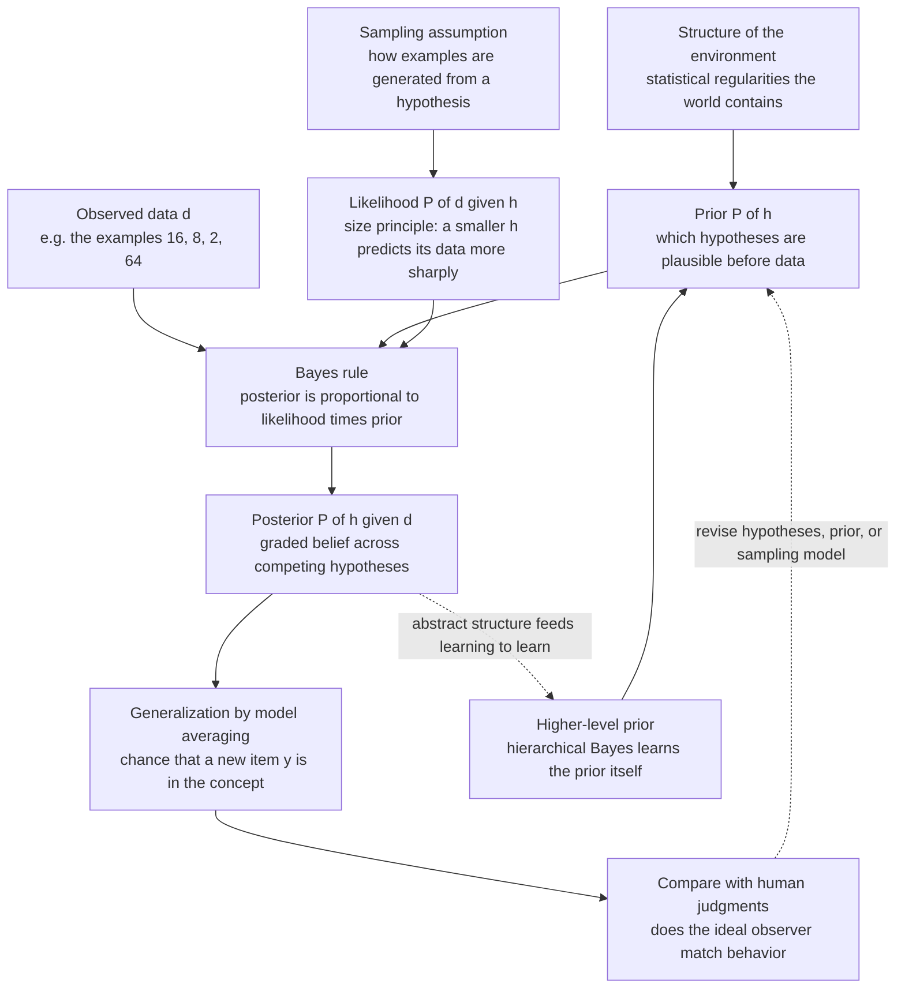

# 🎲 Bayesian Models of Cognition

> [!abstract] TL;DR
> Bayesian models of cognition treat the mind as an **approximately optimal inference engine**: faced with sparse, noisy, ambiguous data, it computes a **posterior** over hypotheses by combining a **prior** (what is plausible before the data) with a **likelihood** (how well each hypothesis predicts the data), exactly as **Bayes' rule** prescribes. The program is **Marr's computational level realised probabilistically** — first characterise the *inductive problem* the mind actually solves and its optimal solution, then compare human behaviour to that ideal observer. Born from **Anderson's rational analysis** and matured in the **reverse-engineering-the-mind** project of Tenenbaum, Griffiths, Kemp, and Goodman, it explains how children leap from a handful of examples to a rich concept — the famous **"number game"** and its **size principle** — and scales up to causal learning, word learning, and theory acquisition through **structured, hierarchical probabilistic models**. Its power is a precise account of learning from little data; its live controversies are **arbitrary priors, computational intractability, and whether the brain is *really* Bayesian** or merely *behaves as if* it were.

---

## Intuition

**Analogy:** Play a guessing game. I am thinking of a rule that picks out some numbers between 1 and 100, and I tell you that **16** is an example. What else fits? You cannot be sure, but you would happily bet on 8, 32, 64, and maybe other even numbers or squares. Now I add three more examples: **8, 2, 64**. Suddenly your uncertainty *collapses* — you feel almost certain the rule is "**powers of two**," and you would bet heavily on 4 and 32 but *not* on 10 or 60, even though 10 and 60 are perfectly even. Nothing forced this. Logically, "even numbers" and "numbers under 70" still contain all four examples. Yet your mind treated the fact that all four *happen* to be powers of two as a **suspicious coincidence** — too neat to be an accident.

That flip from broad to razor-sharp generalization, driven by a felt coincidence, is the whole subject in miniature. A Bayesian model makes the hunch precise: a *small* hypothesis like "powers of two" (only six members) would be astonished to keep producing powers of two by chance, so when it does, it earns enormous credit; a *large* hypothesis like "even numbers" (fifty members) would produce that pattern only rarely and so explains it poorly. The mind, on this view, is running the arithmetic of plausible inference — quietly, automatically, and near-optimally — every time it learns.

---

## How It Works

### From Marr's computational level to an ideal observer

A Bayesian model is not, in the first instance, a theory of *neurons* or even of *processing steps*. It is a theory at **[[Levels_of_Analysis_and_Marrs_Levels|Marr's computational level]]**: it asks *what problem is the mind solving, and what would the optimal solution look like?* The claim is that most cognition is **induction under uncertainty** — inferring hidden structure (a concept, a cause, a word meaning, a 3-D scene) from data that radically underdetermine the answer. Once you frame the problem that way, probability theory supplies the *unique* consistent calculus for reasoning under uncertainty (Cox's theorem, de Finetti's Dutch-book arguments), so the optimal solution *is* Bayesian by construction. The model is an **ideal observer** whose behaviour you then compare against real people.

### Rational analysis (Anderson's recipe)

John R. Anderson's **rational analysis** (1990) gave the methodology, a six-step reverse-engineering procedure:

1. **Specify the goal** the cognitive system is trying to achieve.
2. **Specify the environment** to which it is adapted — crucially, its *statistical structure*.
3. **Specify the computational costs and constraints** (memory, time).
4. **Derive the optimal behaviour** given goal, environment, and constraints.
5. **Compare** the optimal prediction with human data.
6. **Iterate** — revise the environmental assumptions until the fit improves.

The load-bearing move is step 2: much of the apparent quirkiness of memory, categorization, and reasoning turns out to be *optimal adaptation to the statistics of the world*, not a bug. Anderson famously showed that human **memory retrieval** mirrors the probability that an item will be *needed* again given how it has appeared in the past — the mind pre-fetches what the environment says is likely to be useful.

### Bayes' rule as the engine

Every model shares one equation. For hypothesis `h` in a hypothesis space `H` and observed data `d`:

```
                 P(d | h) · P(h)
P(h | d)  =  -----------------------
             Σ_h' P(d | h') · P(h')
```

- **Prior** `P(h)` — how plausible each hypothesis is *before* the data. This is where world knowledge, learned biases, and simplicity preferences enter.
- **Likelihood** `P(d | h)` — how well hypothesis `h` predicts the data. This is where the *size principle* lives.
- **Posterior** `P(h | d)` — the updated, graded belief over hypotheses.
- **Generalization** — to decide whether a new item `y` belongs to the concept, you *average predictions across all hypotheses weighted by their posterior* (Bayesian model averaging): `P(y ∈ C | d) = Σ_h P(y ∈ h) · P(h | d)`.

This differs sharply from the **normative treatment in the [[Bayesian_Reasoning|Logic vault's Bayes note]]**: there the question is *what an ideal agent ought to believe*; here the question is *whether human minds behave as if they compute it*, and *what prior and likelihood best reproduce human data*. Same equation, opposite direction of use — normative prescription versus descriptive reverse-engineering.

### The size principle (why less is more)

Suppose data are sampled *uniformly at random from within* the true concept (Tenenbaum's **strong sampling** assumption). Then the likelihood of drawing `n` examples that all fall inside a hypothesis of size `|h|` is:

```
P(d | h) = ( 1 / |h| )^n     if every example lies in h, else 0
```

The `(1/|h|)^n` term is the whole game. Smaller hypotheses assign *higher* probability to any data they can explain, and this advantage grows **exponentially with the number of examples** `n`. One example barely discriminates; four coincident examples make a tight hypothesis beat a loose one by orders of magnitude. This is the formal content of "suspicious coincidence," and it is why generalization sharpens as evidence accumulates — no ad-hoc rule needed.

### Shepard's universal law as a special case

Roger **Shepard's universal law of generalization** (1987) found that the probability of generalizing a response from one stimulus to another falls off **exponentially with distance in an internal psychological space**, across species and sensory modalities. Tenenbaum and Griffiths showed this law is what you get when you run Bayesian generalization over **"consequential regions"** — hypotheses that are connected regions of psychological space with a broad prior. The exponential gradient is not a brute empirical fact but a *derived consequence* of averaging over uncertainty about where the boundary lies. The number game is the *discrete, structured* cousin of Shepard's *continuous* law.

### Scaling up: structured and hierarchical probabilistic models

Flat hypothesis spaces do not scale to real cognition. The modern program adds **structure**:

- **Hierarchical Bayes / "learning to learn."** Priors are themselves learned from data at a higher level. Kemp, Perfors, and Tenenbaum's **overhypotheses** explain the *shape bias* in word learning: after seeing a few categories where members share shape (not colour or material), a child infers the abstract meta-rule "categories tend to be organized by shape," and then learns *new* categories from a **single example**. The prior for the next concept is the posterior over abstract structure.
- **Grammars and structured priors.** Kemp and Tenenbaum's *structure-learning* work infers whether a domain is best organized as a **tree, ring, chain, grid, or hierarchy** — the mind selects the *form* of representation, not just its parameters.
- **Probabilistic programs (Church / the probabilistic language of thought).** Goodman, Tenenbaum, and colleagues represent hypotheses as **stochastic generative programs**. A concept is a little program that *generates* examples; inference runs the program backward. This fuses the compositional, symbolic power of a **[[Computational_Theory_of_Mind|language of thought]]** with graded probabilistic inference — arguably the most expressive current framework.

### The "child as scientist" and theory acquisition

Gopnik, Schulz, and Tenenbaum extend the machinery to **intuitive theories** — causal, physical, and psychological. On this view the child is a **miniature scientist** who entertains competing causal theories, designs (or exploits) informative "experiments" through play, and updates a **posterior over theories**. Bayesian **causal learning** (Griffiths and Tenenbaum's *causal support* model over causal graphical models) predicts human judgments of causal strength and structure better than raw correlation counting, precisely because people weigh the *coincidence* of cause and effect against prior causal knowledge.



---

## Key Concepts

### Secondary (intuition-level)

- **Learning is guessing under uncertainty.** From a few examples the mind forms a *graded* belief about the rule, not a single certainty.
- **The suspicious-coincidence effect.** Four numbers that all happen to be powers of two feel like no accident, so the mind bets narrowly; the *same* four could be "even numbers," but that feels too loose.
- **More examples, sharper guess.** One example leaves you open-minded; several *coincident* examples snap your generalization to a tight, specific concept.
- **Prior plus evidence.** Your background sense of what rules are likely (prior) combines with how well a rule fits the examples (likelihood) to give your final hunch (posterior).

### Undergraduate (mechanism-level)

- **Bayes' rule as inference:** `posterior ∝ likelihood × prior`; generalization averages over *all* hypotheses weighted by their posterior, not just the single best one.
- **The size principle:** `P(d|h) = (1/|h|)^n`; smaller hypotheses win, and their advantage grows *exponentially* in the number of examples — the formal engine of the number game.
- **Strong vs weak sampling:** results depend on *how you assume the data were generated*. Strong sampling (examples drawn from inside the concept) yields the size principle; weak sampling (examples labelled by an oracle) weakens it. The *sampling assumption* is a substantive modelling choice, and people are sensitive to whether examples are helpfully chosen.
- **Rational analysis (Anderson):** explain behaviour as optimal adaptation to the *statistics of the environment* — memory decay, category use, and retrieval mirror the probability of future need.
- **Shepard's universal law:** exponential generalization gradient in psychological space, *derived* as Bayesian averaging over uncertain consequential regions.
- **Hierarchical Bayes:** the prior for one problem is learned from other problems ("learning to learn," overhypotheses, the shape bias).

### Graduate (debate-level)

- **Structured probabilistic models vs flat feature spaces:** grammars, graphs, and **probabilistic programs (Church)** let hypotheses be *compositional generative processes*, uniting the language-of-thought tradition with graded inference — the current frontier of expressiveness.
- **Causal learning as structure inference:** Griffiths and Tenenbaum's *causal support* compares causal-graph hypotheses (a link exists vs does not), predicting human strength judgments where associative counting fails; the "child as scientist" reframes development as Bayesian theory change.
- **Approximation and the "Bayesian brain":** exact inference is intractable, so proposals hold that neural computation implements *approximate* Bayes via **sampling** (predictions match human variability and order effects), **variational** free-energy minimization, or **particle filters**; predictive-coding accounts of perception are the perceptual instance (see [[Theories_of_Perception]]).
- **Rationality without optimality — resource-rational analysis:** Griffiths, Lieder, and Gershman recast the target as *optimal use of limited computation*, folding cognitive costs into the objective and reconciling Bayesian ideals with heuristics and biases.
- **The identifiability problem:** any behaviour can be fit by *some* prior plus *some* likelihood, so a model is only as constrained as its independently-motivated assumptions — the crux of the "Bayesian Fundamentalism" critique.

---

## Python Demo

We reproduce **Tenenbaum's number game**. The concept is some subset of the numbers 1 to 100. We build a hypothesis space of familiar mathematical concepts (even, odd, squares, cubes, primes, multiples of *m*, powers of *b*, "ends in *d*") plus a family of contiguous **interval** hypotheses ("numbers between *a* and *b*", with an Erlang prior favouring moderate ranges). Given a handful of positive examples we (1) score every hypothesis with a **size-principle** likelihood, (2) combine with the prior via **Bayes' rule** to get the posterior, and (3) plot the **generalization gradient** `P(y in the concept)` over the whole number line. Watch generalization go from *broad* after one example to *razor-sharp* after four coincident ones.

```python
# Bayesian concept learning: Tenenbaum's "number game" over 1..100.
# Only numpy + matplotlib.
import numpy as np
import matplotlib.pyplot as plt

N = 100
nums = np.arange(1, N + 1)

def is_prime(k):
    if k < 2:
        return False
    for d in range(2, int(k ** 0.5) + 1):
        if k % d == 0:
            return False
    return True

# --- 1. Build the hypothesis space: (name, boolean mask over 1..N, raw prior) --
names, masks, priors = [], [], []
def add(name, mask, w):
    names.append(name); masks.append(mask.astype(float)); priors.append(float(w))

MATH_W = 1.0                                   # each maths hypothesis, equal prior
add("even", nums % 2 == 0, MATH_W)
add("odd",  nums % 2 == 1, MATH_W)
add("squares", np.isin(nums, [k * k for k in range(1, 11)]), MATH_W)
add("cubes",   np.isin(nums, [k ** 3 for k in range(1, 5)]), MATH_W)
add("primes",  np.array([is_prime(int(k)) for k in nums]), MATH_W)
for m in range(3, 11):
    add(f"mult of {m}", nums % m == 0, MATH_W)
for b in range(2, 11):
    p = [b ** e for e in range(1, 8) if b ** e <= N]
    if len(p) >= 2:
        add(f"powers of {b}", np.isin(nums, p), MATH_W)
for dd in range(10):
    add(f"ends in {dd}", nums % 10 == dd, MATH_W)

# Interval hypotheses "between a and b" with an Erlang prior on the length.
SIGMA = 12.0
for a in range(1, N + 1):
    for b in range(a, N + 1):
        length = b - a + 1
        w = (length / SIGMA ** 2) * np.exp(-length / SIGMA)   # Erlang: prefers moderate ranges
        add(f"[{a},{b}]", (nums >= a) & (nums <= b), w)

names  = np.array(names, dtype=object)
masks  = np.array(masks)                        # shape (H, N), 1.0 = number in hypothesis
priors = np.array(priors)
sizes  = masks.sum(axis=1)                       # |h| for every hypothesis

# Give the two FAMILIES equal total prior mass (0.5 each) so neither swamps the other.
is_iv = np.array([str(n).startswith("[") for n in names])
priors[~is_iv] *= 0.5 / priors[~is_iv].sum()
priors[ is_iv] *= 0.5 / priors[ is_iv].sum()

# --- 2. Bayesian inference for a set of positive examples ---------------------
def infer(examples):
    idx = np.array(examples) - 1                                   # 0-based columns
    consistent = (masks[:, idx] > 0.5).all(axis=1)                 # h contains ALL examples
    like = np.where(consistent, (1.0 / sizes) ** len(examples), 0) # SIZE PRINCIPLE
    post = priors * like
    post = post / post.sum()                                       # normalise -> posterior
    gen  = post @ masks                                            # P(y in concept | examples)
    return post, gen

# --- 3. Three demonstrations: broad -> sharp ---------------------------------
example_sets = [[16], [16, 8, 2, 64], [10, 20, 30]]

fig, axes = plt.subplots(len(example_sets), 1, figsize=(11, 8.5), sharex=True)
for ax, X in zip(axes, example_sets):
    post, gen = infer(X)
    ax.bar(nums, gen, width=0.9, color="#2563eb")
    ax.plot(sorted(X), [1.05] * len(X), "v", color="#dc2626", ms=10,
            clip_on=False, label="observed examples")
    best = names[int(np.argmax(post))]
    ax.set_ylim(0, 1.12); ax.set_ylabel("P(y in concept)")
    ax.set_title(f"examples = {sorted(X)}   ->   top hypothesis: '{best}'"
                 f"  (posterior = {post.max():.2f})", loc="left", fontsize=10)
axes[0].legend(loc="upper right", fontsize=8)
axes[-1].set_xlabel("number  y  (1 to 100)")
plt.tight_layout(); plt.show()

# --- 4. Print the posterior "podium" so the size principle is explicit --------
for X in example_sets:
    post, _ = infer(X)
    order = np.argsort(post)[::-1][:5]
    print(f"\nexamples {sorted(X)} -> top posterior hypotheses:")
    for i in order:
        print(f"   {str(names[i]):>12s}   |h|={int(sizes[i]):3d}   P(h|d)={post[i]:.3f}")
```

**What it shows.** After a *single* example `{16}` the posterior spreads across many small hypotheses that contain 16 (powers of 2, squares, "ends in 6", multiples of 8), so the generalization gradient is *broad*. After `{16, 8, 2, 64}` the size principle multiplies the tiny "powers of 2" hypothesis (only six members) to victory — the `(1/6)^4` likelihood dwarfs `(1/50)^4` for "even" — and generalization collapses onto exactly `{2, 4, 8, 16, 32, 64}`. The set `{10, 20, 30}` snaps to "multiples of 10" rather than the larger "even" or "multiples of 5", again by size. The printed podium makes the mechanism unmistakable: the winning hypothesis is almost always the *smallest* set consistent with the data — "less is more."

---

## Real-World Applications

- **Developmental science and education.** Bayesian **word learning** (Xu and Tenenbaum) explains how a toddler generalizes "dog" from one or two labelled examples to the right level of a taxonomy — neither over-narrow ("only *this* dog") nor over-broad ("all animals") — and predicts *when* a single example suffices given the shape bias. This guides curriculum and example selection: a few *well-chosen*, diverse examples teach a concept faster than many redundant ones.
- **Causal reasoning and expert judgment.** Causal-graph Bayesian models predict how doctors, scientists, and jurors infer whether A causes B from small, noisy samples, capturing the human weighting of *coincidence against prior plausibility* that mere correlation-counting misses.
- **Machine learning bridges.** The same math underlies engineered systems: **Bayesian program induction** learns to recognize and generate handwritten characters from *one* example (Lake, Salakhutdinov, Tenenbaum's Bayesian Program Learning), and hierarchical Bayesian priors inspire few-shot and meta-learning. Contrast with the frequency-driven **[[Naive_Bayes|Naive Bayes]]** classifier shows the same rule used for engineering rather than cognitive modelling.
- **Cognitive architectures.** Anderson's **ACT-R** bakes rational analysis into its memory and production modules, so activation and retrieval track the *log-odds an item will be needed* — a deployed, predictive theory of skill and recall used in intelligent tutoring systems.
- **Computational psychiatry.** Aberrant priors or likelihood precision in Bayesian-brain / predictive-coding models are used to formalize hallucinations and delusions as *mis-set inference*, linking the framework to [[Theories_of_Perception|perceptual inference]] and to clinical prediction.

---

## Common Pitfalls

- **Treating the prior as a free knob.** The single sharpest criticism (Jones and Love's "Bayesian Fundamentalism or Enlightenment?"): because *some* prior plus *some* likelihood can fit almost any behaviour, a Bayesian model only explains something when its prior and sampling assumptions are **independently motivated** by the environment or by other tasks. A prior reverse-fit to the data it must predict is a description dressed as a theory.
- **Confusing "the mind is Bayesian" with "the brain computes Bayes exactly."** A computational-level fit says behaviour is *as if* optimal; it does **not** entail explicit posteriors in neurons. Exact inference is generally **intractable**, so any mechanistic claim must specify an *approximation* (sampling, variational, particle filters) — and skipping that leaves the [[Levels_of_Analysis_and_Marrs_Levels|algorithmic and implementational levels]] unaddressed.
- **Forgetting the sampling assumption.** The size principle depends on **strong sampling** (examples drawn from within the concept). If a knowledgeable teacher is *choosing* the examples, or if examples are labelled by an oracle (weak sampling), the correct likelihood — and hence the generalization — changes. Applying strong-sampling math to a weak-sampling situation is a common modelling error.
- **Reading the posterior mode as "the concept."** Human generalization is **model averaging** over the whole posterior, not commitment to the single best hypothesis. Reporting only the MAP hypothesis discards exactly the graded uncertainty that makes the model match behaviour.
- **Assuming optimality means "no biases."** Rational analysis often *predicts* apparent biases as adaptations to environmental statistics or to limited computation (**resource-rational** analysis). A bias is not automatically evidence against a Bayesian account; it may be its prediction.
- **Just-so hypothesis spaces.** Hand-picking exactly the hypotheses needed for the target result (e.g., including "powers of 2" but not "powers of 2 except 16") smuggles the answer into the model. The hypothesis space and its structure need principled, cross-task justification.

---

## Related Concepts

- [[Bayesian_Reasoning]] — the *normative* Bayes note in the Logic vault (prior, likelihood, posterior, updating); this note gives the same machinery its **cognitive-modelling angle** — using Bayes descriptively to reverse-engineer how minds actually generalize.
- [[Levels_of_Analysis_and_Marrs_Levels]] — Bayesian models are explicitly **computational-level** theories; understanding Marr's primacy-of-the-computational argument is prerequisite to reading them correctly (and to seeing what they leave unexplained at lower levels).
- [[Theories_of_Perception]] — **Bayesian perception and predictive coding** are the perceptual instance of the very same idea: the percept is the posterior over hidden scene causes given ambiguous sensory data.
- [[Reasoning_and_Inference]] — the **"new paradigm"** (Oaksford and Chater) that recasts human reasoning as *rational under uncertainty* is Bayesian cognition applied to deductive tasks.
- [[Computational_Theory_of_Mind]] — **probabilistic programs / the probabilistic language of thought** propose that mental representations are stochastic generative programs, bridging classical symbolic computation and graded inference.
- [[Mental_Representation]] — structured priors, overhypotheses, and grammars are *representational* commitments; hierarchical Bayes is a theory of how such abstract representations are learned.
- [[Language_and_Cognition]] — **word learning as Bayesian inference** (generalizing a new word to the right taxonomic level from a few examples) is a flagship application.
- [[Probability_and_Statistics]] — the AI-ML foundations note covering the priors, likelihoods, and posterior distributions that this framework runs on.
- [[Naive_Bayes]] — an *engineered* Bayesian classifier; contrasting it with cognitive Bayes highlights the difference between fitting a model for prediction and using it to explain human generalization.

---

## Review Questions

1. **(Conceptual / Secondary)** In the number game, after seeing the examples `{16, 8, 2, 64}` people generalize confidently to "powers of two" and refuse to include 10, even though "even numbers" also contains all four examples. Using the idea of a *suspicious coincidence*, explain in plain terms why the smaller hypothesis wins, and state the formula (the size principle) that captures it.
2. **(Scenario / Undergraduate)** A colleague fits a Bayesian model to a categorization dataset by adjusting the prior until the model matches the human curves, then declares that "the mind is Bayesian." Referencing rational analysis and the "Bayesian Fundamentalism" critique, explain *what is wrong* with this inference, and describe what an *independent* justification of the prior would look like (name a source of constraint).
3. **(Trade-off / Graduate)** Bayesian models live at Marr's computational level and assume optimal inference, yet exact Bayesian inference is intractable and real behaviour is noisy and order-dependent. Compare **sampling-based approximation** and **resource-rational analysis** as responses to this tension. What does each preserve and each give up, and how would you experimentally distinguish "the mind approximates Bayes by sampling" from "the mind is not really Bayesian at all"?

---

## Sources

- Anderson, J. R. (1990). *The Adaptive Character of Thought.* Lawrence Erlbaum. (Rational analysis.)
- Tenenbaum, J. B., & Griffiths, T. L. (2001). "Generalization, similarity, and Bayesian inference." *Behavioral and Brain Sciences*, 24(4), 629–640. (The number game, size principle, Shepard's law derived.)
- Tenenbaum, J. B., Kemp, C., Griffiths, T. L., & Goodman, N. D. (2011). "How to grow a mind: Statistics, structure, and abstraction." *Science*, 331(6022), 1279–1285.
- Griffiths, T. L., Chater, N., Kemp, C., Perfors, A., & Tenenbaum, J. B. (2010). "Probabilistic models of cognition: Exploring representations and inductive biases." *Trends in Cognitive Sciences*, 14(8), 357–364.
- Shepard, R. N. (1987). "Toward a universal law of generalization for psychological science." *Science*, 237(4820), 1317–1323.
- Jones, M., & Love, B. C. (2011). "Bayesian Fundamentalism or Enlightenment? On the explanatory status and theoretical contributions of Bayesian models of cognition." *Behavioral and Brain Sciences*, 34(4), 169–188.
- Xu, F., & Tenenbaum, J. B. (2007). "Word learning as Bayesian inference." *Psychological Review*, 114(2), 245–272.

---

#cognitive-science #bayesian-cognition #rational-analysis #concept-learning #probabilistic-models
