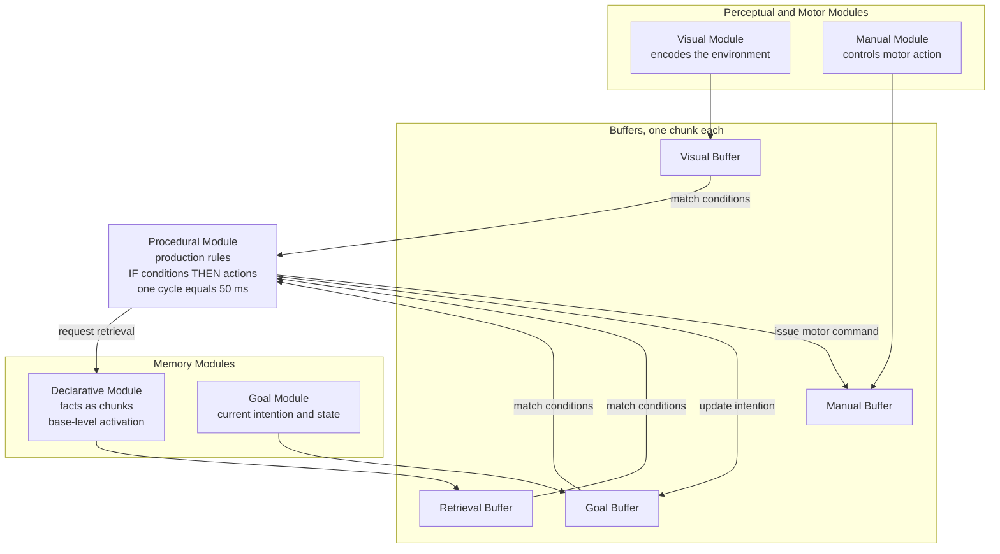

# 🏛️ Cognitive Architectures

> [!abstract] TL;DR
> A **cognitive architecture** is a single computational theory of the *fixed structure* of the mind — the mechanisms that stay constant across every task, in the way a CPU's instruction set stays constant across every program. Following Allen Newell's call for **Unified Theories of Cognition**, architectures like **ACT-R** (Anderson) and **SOAR** (Newell and Laird) try to integrate perception, memory, learning, reasoning, and action in *one* system rather than modeling each in isolation. Their scientific payoff is precision: an architecture is a *runnable theory* that predicts human **reaction times and error rates** to the millisecond and percentage point, then is falsified when it misses. They combine a **symbolic** layer (production rules, chunks) with a **subsymbolic** layer (activation, utility, learning) — a hybrid design that both explains classic behavioral data and now frames debates about how to build general intelligence.

## Intuition

**Analogy: the fixed engine versus the changing cargo.**

Think of a shipping container port. The **cranes, rails, container slots, and the crane operator's rulebook** never change — that fixed machinery is the *architecture*. What changes day to day is the *cargo*: which containers arrive, where they go, in what order. Cognitive science had spent decades studying individual cargo shipments (a memory experiment here, a reasoning study there) and building a separate little model for each one. Newell's complaint was that you can produce a hundred such micro-theories and still have no idea how the *port* works — the machinery that makes all of them possible at once.

A cognitive architecture is the attempt to specify the port itself: the permanent crane-and-rail system of the mind. You write down the fixed machinery *once*, then feed it different "cargo" (task instructions and knowledge). If the same unchanged machinery reproduces how fast people read, how they solve algebra, *and* how they lose track of a phone number, you have evidence you captured something real about the architecture — not just curve-fit one experiment.

---

## How It Works

### What a cognitive architecture commits to

An architecture must specify, in mechanistic detail, the parts of cognition that do **not** vary with the task:

1. **Memories and their formats** — what representations exist (facts, rules, images) and how they are stored, strengthened, and forgotten.
2. **Processes** — how information moves and transforms: matching, retrieval, decision, action.
3. **Control** — what decides *what happens next* when many things could happen at once (the classic AI "conflict resolution" problem).
4. **Timing** — every operation costs time, so the architecture emits a *behavioral trace* that can be compared against human reaction-time and error data.

This is the crucial difference from a black-box AI system: an architecture is a **scientific theory**. It is judged not only on whether it *solves* a task but on whether it gets the task *wrong in the same ways humans do*, at the same speed.

### The production-system core

Almost every symbolic architecture is built on a **production system**: knowledge of *how to act* is stored as **production rules** of the form

> **IF** these conditions hold in the current state **THEN** take these actions.

A **matcher** continuously compares all rules against the current contents of a small set of **buffers** (the system's working memory). Rules whose conditions match become the **conflict set**; a **conflict-resolution** mechanism picks one to **fire**; firing changes the buffers; the cycle repeats. This recognize–act loop is the architecture's heartbeat, and each cycle is assigned a fixed duration (in ACT-R, 50 ms) — which is where precise timing predictions come from.

### ACT-R: modules, buffers, and a symbolic/subsymbolic hybrid

**ACT-R** (Adaptive Control of Thought — Rational, John Anderson) organizes the mind as a set of specialized **modules** — visual, manual (motor), **declarative** (facts), **goal**, and a central **procedural** module — that communicate *only* through narrow **buffers** holding a single chunk each. The procedural module is the production system; it can inspect and change buffers but cannot see inside the modules directly. This is a deliberately brain-like design: modules map onto cortical and subcortical regions, buffers onto their interfaces.

ACT-R's power comes from being a **hybrid**:

- The **symbolic** layer is discrete: chunks (declarative facts) and production rules.
- The **subsymbolic** layer is continuous and governs *availability and choice*. Each declarative chunk has a **base-level activation** that rises with use and decays with time, and each production has a **utility** that reinforcement learning tunes. These continuous quantities decide *which* chunk is retrieved and *how fast*, and *which* rule fires when several match.

**Base-level activation and the power law of practice.** A chunk's base activation is the log of a sum over its past uses, each discounted by how long ago it happened:

> B = ln( Σ over past uses of t<sup>−d</sup> )

with decay d ≈ 0.5. Recent uses count heavily (the **recency/forgetting** curve); many uses add up (the **frequency** effect). Because the sum grows with practice count n roughly as ln(n), performance improves as a **power law of practice** — the single most robust regularity in all of skill learning. Total activation adds **spreading activation** from the current context (cues in the buffers) plus noise; activation then sets both **retrieval latency** (higher activation → faster) and **retrieval probability** (a chunk below the **threshold** simply fails to be recalled). This is how ACT-R predicts the **fan effect**, forgetting curves, and reaction-time distributions from first principles.

### SOAR: problem spaces, impasses, and chunking

**SOAR** (Newell and Laird) shares the production-system core but organizes *all* behavior as search through **problem spaces**: a state, a set of **operators** that transform it, and a goal. On every cycle SOAR proposes, evaluates, and applies operators. Its two signature ideas:

- **Impasses and universal subgoaling.** When SOAR cannot decide what to do next — no operator applies, or several tie, or it lacks the knowledge — it hits an **impasse**. Rather than halting, it *automatically creates a subgoal* to resolve the impasse and drops into a new problem space to figure it out. All deliberate reasoning is this recursive subgoaling.
- **Chunking.** Once a subgoal is resolved, SOAR *compiles* the result into a new production rule that will fire directly next time, skipping the whole deliberation. This is SOAR's universal learning mechanism: it converts slow, deliberate problem-solving into fast, automatic recognition — a mechanistic account of how practice turns effortful thought into skill.

Where ACT-R is tuned to *match human data quantitatively*, SOAR historically leaned toward *functional generality* — building a system that could do the widest range of intelligent tasks. Modern SOAR has since added subsymbolic memories (reinforcement learning, semantic and episodic memory) too.

### The broader family

- **EPIC** (Kieras and Meyer) specializes in tightly modeling **perceptual-motor** constraints and multitasking; ACT-R absorbed much of its perceptual/motor machinery.
- **CLARION** (Sun) makes the **implicit/explicit** distinction central, pairing a symbolic top level with a neural-network bottom level to model intuition versus explicit rule use.
- **Sigma** (Rosenbloom) tries to derive cognition from a single uniform substrate — **graphical models / factor graphs** — unifying symbolic and probabilistic computation.
- **LIDA** (Franklin) implements **Global Workspace Theory**, modeling consciousness as a competition whose winner is broadcast, cycling through perception, attention, and action.
- **Spaun** (Eliasmith) is the biologically detailed extreme: **2.5 million spiking neurons** built with the Neural Engineering Framework that can see digits, remember lists, and write answers with a simulated arm — a bridge from architecture to *neurons*.

### Architecture of ACT-R



---

## Key Concepts

### Secondary (intuitive level)

- A cognitive architecture is a **blueprint of the fixed machinery of the mind** — the parts that stay the same no matter what problem you are solving.
- Instead of a separate model for each experiment, you build **one system** and give it different knowledge, the way one computer runs many programs.
- The two most famous are **ACT-R** and **SOAR**; both work by matching **IF–THEN rules** against a small working memory, over and over.
- The point is not just to *solve* a task but to be **wrong in the same ways and at the same speed as a real person**.

### Undergraduate (mechanistic level)

- **Production-system core:** a recognize–act cycle — match rules against buffers, resolve conflicts, fire one rule, update state, repeat. Fixed cycle time yields timing predictions.
- **ACT-R structure:** independent **modules** (visual, manual, declarative, goal, procedural) communicating only through single-chunk **buffers**; a **symbolic** layer (chunks + rules) over a **subsymbolic** layer (activation + utility).
- **Base-level activation** encodes the **power law of practice** and forgetting: `B = ln(Σ t^(−d))`. It drives **retrieval latency** and **retrieval probability**, and adding **spreading activation** produces the **fan effect**.
- **SOAR mechanics:** all behavior is search in **problem spaces** via **operators**; **impasses** trigger automatic **subgoaling**; **chunking** compiles solved subgoals into new rules — a single, universal learning mechanism.
- **Declarative vs procedural memory** maps directly onto ACT-R's chunk store versus its rule store — the "knowing that" versus "knowing how" distinction made computational.

### Graduate (theoretical level)

- **Architectures as falsifiable theories.** A model is fit by choosing *knowledge* (task strategy) on top of *fixed* architectural parameters, then evaluated against human RT and error distributions. The scientific tension is **identifiability**: because you supply both the knowledge and the parameters, strong fits can be argued to reflect degrees of freedom rather than the architecture — the "irrelevant specification" and "many models fit" critiques (Roberts and Pashler).
- **Rational analysis.** ACT-R's subsymbolic equations are not arbitrary: Anderson derives them as **Bayesian/optimal** solutions to the problem the memory system faces — base-level activation approximates the log-odds that a chunk will be needed, given the statistics of the environment. Cognition is *adapted* to environmental structure.
- **The symbol-grounding and integration problem.** Hybrid architectures juxtapose symbolic and subsymbolic layers but do not fully dissolve the boundary; how genuinely continuous, learned representations give rise to discrete compositional structure remains open — the same fault line running through the **neuro-symbolic** debate in modern AI.
- **Newell's constraints on cognition and the AGI ambition.** Newell listed functional criteria a true architecture must meet (behave flexibly, use vast knowledge, learn, operate in real time, use language, be self-aware). Contemporary work (SOAR, Sigma, the "Common Model of Cognition") revives this as a research program for **artificial general intelligence** and for reconciling architectures with **deep learning**: architectures supply structured control, memory, and metacognition; neural networks supply perception and statistical learning.

---

## Python Demo

```python
# Simplified ACT-R declarative memory: how a fact's ACTIVATION sets whether
# and how fast it is retrieved. We implement three ACT-R equations:
#
#   1. Base-level activation   B = ln( sum_j (t - t_j)^(-d) )
#        -> encodes RECENCY (recent uses weigh more) and FREQUENCY
#           (more uses add up), giving the POWER LAW OF PRACTICE.
#   2. Spreading activation    A = B + sum_k W_k * S_ki
#        -> context cues in the buffers boost associated chunks;
#           high-fan cues spread thin (the FAN EFFECT).
#   3. Retrieval performance   RT = F * exp(-A) ,  P = logistic((A - tau)/s)
#        -> more active chunks are retrieved FASTER and MORE RELIABLY.

import numpy as np
import matplotlib.pyplot as plt

# --- Architectural parameters (ACT-R defaults) -------------------------
d   = 0.5      # base-level decay (power law of forgetting)
F   = 0.35     # latency factor: seconds per unit of e^(-A)
tau = -0.5     # retrieval threshold: below this, retrieval fails
s   = 0.25     # activation noise scale (logistic spread)

# --- Equation 1: base-level activation over time -----------------------
def base_level(t, pres_times, d=0.5):
    """B(t) = ln( sum over PAST presentations of (t - t_j)^(-d) )."""
    t = np.atleast_1d(t).astype(float)
    B = np.full(t.shape, -np.inf)
    for i, now in enumerate(t):
        ages = now - np.asarray(pres_times, dtype=float)
        ages = ages[ages > 0.0]                 # only presentations before now
        if ages.size:
            B[i] = np.log(np.sum(ages ** (-d)))
    return B

pres_times = [0.0, 2.0, 5.0, 12.0]              # times (s) the chunk was used
t_grid = np.linspace(0.1, 60.0, 2000)
B_trace = base_level(t_grid, pres_times, d)

# --- Power law of practice: activation grows like ln(frequency) --------
n_trials = np.arange(1, 51)
spacing  = 5.0                                   # one practice every 5 s
practice_B = np.array([
    base_level((n - 1) * spacing + spacing,      # test one interval after last
               spacing * np.arange(n), d)[0]
    for n in n_trials
])

# --- Equation 2: spreading activation and the fan effect ---------------
W_total = 1.0                                    # source activation from a cue
S_max   = 2.0                                    # maximum associative strength
fan     = np.array([2, 5, 20])                   # chunks each cue is linked to
S_ki    = S_max - np.log(fan)                    # high fan -> weaker link
B_base  = 0.3                                    # same base level for all three
A_chunk = B_base + W_total * S_ki                # total activation per chunk

# --- Equation 3: retrieval latency and probability vs activation -------
A_axis = np.linspace(-1.5, 2.0, 400)
retrieval_time = F * np.exp(-A_axis)                       # RT = F * e^(-A)
retrieval_prob = 1.0 / (1.0 + np.exp(-(A_axis - tau) / s)) # logistic around tau

# --- Visualize ---------------------------------------------------------
fig, ax = plt.subplots(2, 2, figsize=(12, 8))

ax[0, 0].plot(t_grid, B_trace, color="#2563eb")
for tp in pres_times:
    ax[0, 0].axvline(tp, color="#9ca3af", ls=":", lw=1)
ax[0, 0].set_title("Base-level activation: each use boosts it,\nthen it decays as a power law")
ax[0, 0].set_xlabel("time since study start (s)")
ax[0, 0].set_ylabel("activation  B(t)")
ax[0, 0].grid(alpha=0.3)

ax[0, 1].plot(n_trials, practice_B, "o-", color="#059669", ms=3)
ax[0, 1].set_title("Power law of practice:\nactivation rises with ln(number of uses)")
ax[0, 1].set_xlabel("number of practice trials  n")
ax[0, 1].set_ylabel("base-level activation at test")
ax[0, 1].grid(alpha=0.3)

ax[1, 0].plot(A_axis, retrieval_time * 1000.0, color="#dc2626")
ax[1, 0].set_title("Retrieval latency:  RT = F . exp(-A)\nmore active = retrieved faster")
ax[1, 0].set_xlabel("total activation  A")
ax[1, 0].set_ylabel("retrieval time (ms)")
ax[1, 0].grid(alpha=0.3)

ax[1, 1].plot(A_axis, retrieval_prob, color="#7c3aed")
ax[1, 1].axvline(tau, color="#9ca3af", ls="--", lw=1, label="threshold tau")
ax[1, 1].set_title("Retrieval probability:\nlogistic around the threshold")
ax[1, 1].set_xlabel("total activation  A")
ax[1, 1].set_ylabel("P(retrieve)")
ax[1, 1].legend()
ax[1, 1].grid(alpha=0.3)

plt.tight_layout()
plt.show()

# --- Console: the fan effect, same base level, different associations --
print("Fan effect (identical base level, different associative fan):")
for fk, ak in zip(fan, A_chunk):
    rt_ms = F * np.exp(-ak) * 1000.0
    print(f"  fan={fk:>2}  ->  A={ak:5.2f}  ->  RT={rt_ms:6.1f} ms")
```

Running it reproduces three signature ACT-R behaviors: base-level activation **spikes at each use and decays as a power law** between uses; activation at test **grows like the logarithm of practice count** (diminishing returns, the power law of practice); and retrieval gets **faster and more reliable as activation rises**. The console shows the **fan effect** — a fact tied to many other facts (high fan) is retrieved more slowly than the same fact tied to few, because the cue's activation must spread across more associations.

---

## Real-World Applications

- **Intelligent tutoring systems.** ACT-R's theory of skill acquisition is the engine behind **Cognitive Tutors** (Anderson, Koedinger; commercialized as Carnegie Learning). By modeling the student's declarative and procedural knowledge as production rules, the tutor tracks which skills are mastered (**knowledge tracing**) and selects problems that target weak rules — deployed to hundreds of thousands of math students with measured learning gains.
- **Human–computer interaction and usability.** Architectures turn interface design into *quantitative prediction*: ACT-R and EPIC (and the GOMS/keystroke-level lineage) predict how long expert users take on a menu or a cockpit procedure *before building it*. NASA and aviation groups use ACT-R pilot and air-traffic models to forecast workload and error under multitasking.
- **Cognitive modeling in basic science.** Architectures are the standard tool for turning a verbal psychological theory into a running model that emits reaction-time distributions and error rates, then testing it against lab data — from list memory and the fan effect to driving and dual-task interference.
- **Synthetic agents and simulation.** SOAR has driven large-scale **military and game AI** (e.g., TacAir-SOAR flying simulated combat missions), where human-like, knowledge-rich, real-time behavior matters more than raw optimality.
- **AGI and the neuro-symbolic frontier.** Architectures inform how to give large neural systems what they lack — persistent structured **memory, goal-directed control, and metacognition** — motivating the "Common Model of Cognition" and modern agent frameworks that wrap LLMs in architecture-like control loops.

---

## Common Pitfalls

- **Mistaking an architecture for a single model.** The architecture is the *fixed machinery*; a *model* is the architecture plus task-specific knowledge and parameter settings. Claims like "ACT-R predicts X" almost always mean a *particular model built in ACT-R* predicts X.
- **Ignoring the degrees-of-freedom critique.** Because the modeler supplies both the knowledge (strategy) and free parameters, an impressive data fit can reflect flexibility rather than the theory (Roberts and Pashler). Good practice constrains parameters across tasks and tests *out-of-sample* predictions, not just fits.
- **Confusing "does the task" with "does it like a human."** An architecture that solves algebra but produces superhuman speed and zero errors has *failed* as a cognitive theory. The target is human timing and human error patterns.
- **Treating symbolic and subsymbolic layers as interchangeable.** They do different jobs: symbols carry compositional structure and control; activation/utility carry availability and choice. Collapsing the distinction loses exactly what makes the hybrid work.
- **Assuming architectures compete with deep learning.** They address different levels — control, memory, and metacognition versus perception and statistical learning. The productive framing is *integration* (neuro-symbolic), not replacement.
- **Over-reading brain mapping.** ACT-R modules correlate with brain regions and predict fMRI, but the mapping is a working hypothesis, not a proven identity of module and area.

---

## Related Concepts

- [[Computational_Theory_of_Mind]] — the philosophical foundation: cognition as rule-governed symbol manipulation, including the **Physical Symbol System Hypothesis** that cognitive architectures operationalize.
- [[Working_Memory_and_Cognitive_Load]] — ACT-R's single-chunk **buffers** are a mechanistic model of the capacity-limited workspace that working-memory research describes behaviorally.
- [[Functionalism_and_Machine_Minds]] — architectures embody **multiple realizability**: a mind specified as fixed structure plus knowledge, independent of the substrate that runs it.
- [[Logic_in_AI_and_Computation]] — production systems and rule-based reasoning are the symbolic (GOFAI) tradition from which the architectural core descends.
- [[Long_Term_Memory_Systems]] — the **declarative vs procedural** memory distinction that ACT-R implements as separate chunk and rule stores.
- [[Reasoning_and_Inference]] — SOAR's problem-space search and impasse-driven subgoaling are a computational account of deliberate reasoning.
- [[Knowledge_Representation]] — chunks, slots, and productions are concrete knowledge-representation formalisms inside the architecture.

---

## Review Questions

**Tier 1 — Recall / Comprehension**
1. What does it mean to say a cognitive architecture models the *fixed structure* of the mind, and how does that differ from building a separate model for each experiment?
2. Describe ACT-R's recognize–act cycle. What are modules, and why can they communicate only through buffers?
3. In SOAR, what is an **impasse**, and what does the system do when it hits one?

**Tier 2 — Application**
4. Using ACT-R's base-level activation equation, explain why cramming (many study repetitions in one session) and spaced practice (the same repetitions spread over days) predict different retrieval activation at a delayed test. Which produces higher activation later, and why?
5. You must design an intelligent tutor that decides when a student has mastered a skill. Sketch how you would represent that skill and its mastery using declarative chunks and production utilities, and what behavioral signal would indicate mastery.

**Tier 3 — Analysis / Synthesis**
6. A critic argues that ACT-R's excellent fit to reaction-time data is unpersuasive because the modeler chose both the strategy and the free parameters. Explain the Roberts–Pashler critique and propose two concrete methodological safeguards that would make an architectural model genuinely falsifiable.
7. Contemporary AGI research pairs large neural networks with architecture-style control loops. Argue for what a symbolic cognitive architecture supplies that current end-to-end deep learning lacks, and where the two are hardest to reconcile (the integration problem).

---

## Sources

- Newell, A. (1990). *Unified Theories of Cognition*. Harvard University Press.
- Anderson, J. R., Bothell, D., Byrne, M. D., Douglass, S., Lebiere, C., & Qin, Y. (2004). "An integrated theory of the mind." *Psychological Review*, 111(4), 1036–1060.
- Laird, J. E. (2012). *The Soar Cognitive Architecture*. MIT Press.
- Kotseruba, I., & Tsotsos, J. K. (2020). "40 years of cognitive architectures: core cognitive abilities and practical applications." *Artificial Intelligence Review*, 53, 17–94.
- Eliasmith, C., et al. (2012). "A large-scale model of the functioning brain [Spaun]." *Science*, 338(6111), 1202–1205.

---

#cognitive-science #cognitive-architecture #act-r #soar #unified-theories
