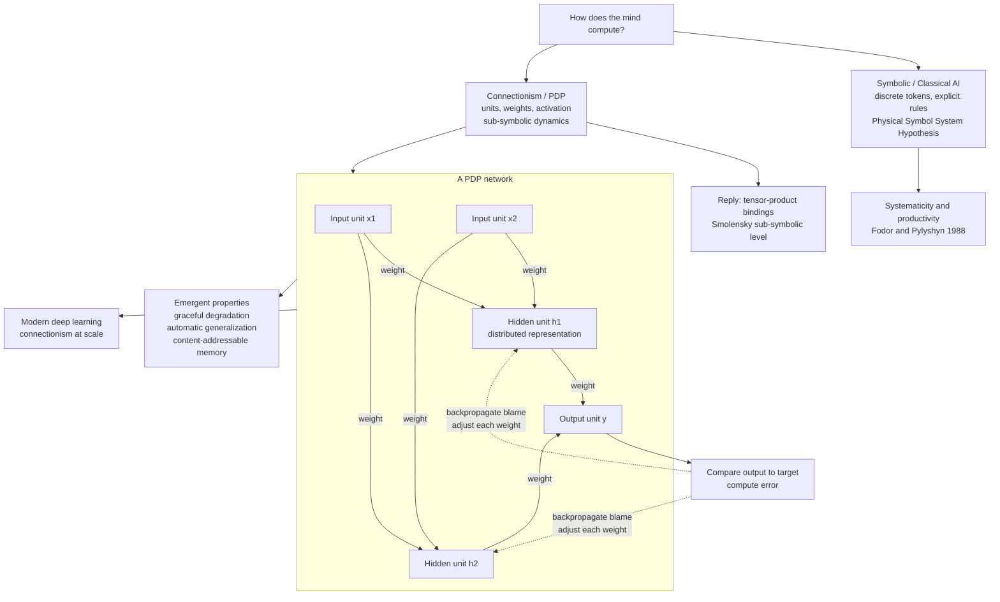

# 🕸️ Connectionism and Neural Networks

> [!abstract] TL;DR
> Connectionism is the theory that cognition arises not from manipulating discrete symbols by rules, but from the **parallel, cooperative activity of many simple neuron-like units** connected by weighted links. Knowledge lives *in the weights*, concepts are **distributed patterns of activation** rather than single symbols, and learning is the gradual adjustment of connection strengths — classically by **backpropagation**. Championed by the Rumelhart–McClelland **PDP** group in 1986 as an alternative to symbolic AI, it explains graceful degradation, automatic generalization, and content-addressable memory, weathered the Fodor–Pylyshyn systematicity critique, and is the direct intellectual ancestor of modern deep learning.

---

## Intuition

**Analogy:** Picture how a stadium crowd recognizes "Mexican wave" — no single spectator *is* the wave and no conductor issues orders; the pattern is a global regularity that **emerges** from thousands of individuals each following a dumb local rule ("stand a beat after my neighbor"). Cut out any one person and the wave rolls on, only slightly rougher. Connectionism says a thought — recognizing your grandmother, conjugating a verb — is like that wave: a coherent large-scale pattern of activity riding on top of many tiny, individually meaningless units.

Where symbolic AI treats a concept as a token you could point to (a `GRANDMOTHER` symbol in memory), connectionism treats it as a *shape in a high-dimensional activation space* — no cell holds the meaning, the meaning is the whole pattern. Because knowledge is smeared across the connections rather than stored in a lookup slot, the system bends instead of breaking, and similar inputs automatically evoke similar responses.

---

## How It Works

### Core Mechanics

**1. Units, weights, and activation.** A network is a graph of simple **units** (idealized neurons). Each unit computes a weighted sum of its inputs, `net = Σ wᵢ·xᵢ + b`, then passes it through a nonlinear **activation function** — a sigmoid, tanh, or ReLU — to produce its output. The **weights** encode all the knowledge; there is no separate rulebook. Change the weights and you change what the network "knows."

**2. Distributed vs localist representation.** In a **localist** scheme one unit stands for one concept (a "grandmother cell," a one-hot code). In a **distributed** scheme each concept is a *pattern* over many units, and each unit participates in many concepts. Distributed codes are the connectionist signature: they give **automatic generalization** (similar patterns → similar outputs), **content-addressable memory** (a partial or noisy cue reconstructs the whole), and **graceful degradation** (damage a few units and performance sags gently rather than crashing — unlike a symbol table where losing the address loses the datum).

**3. Learning by weight change.** Networks are not programmed, they are **trained**. A learning rule nudges each weight to reduce error. The **perceptron rule** (Rosenblatt, 1958) and the **delta / Widrow–Hoff rule** handle a single layer; **backpropagation** generalizes this to hidden layers by using the chain rule to assign each internal weight its share of blame for the output error. Hidden units are the crux: they let the network invent its *own* intermediate features — the distributed internal representations that no one hand-designed.

**4. The perceptron and its winter.** Rosenblatt's perceptron could learn linearly separable categories and generated huge excitement. In **1969 Minsky and Papert** proved a single-layer perceptron *cannot* compute **XOR** (exclusive-or is not linearly separable) and cast doubt on scaling multilayer learning. Funding and interest collapsed — a "connectionist winter." The field revived when **backpropagation** (popularized by Rumelhart, Hinton & Williams, 1986) showed multilayer networks *can* be trained, and a hidden layer solves XOR trivially — the very problem that had buried the approach.

**5. The PDP framework (1986).** The two-volume *Parallel Distributed Processing* by Rumelhart, McClelland and the **PDP Research Group** made connectionism a serious theory of *cognition*, not just an engineering trick. Its bet: intelligent behavior emerges from the parallel interaction of many units, and the right level to describe the mind is **sub-symbolic**. Symbols, on this view, are approximate, higher-level descriptions of stable activation patterns — real as "the wave," not as fundamental parts.

**6. Classic cognitive models.**
- **NETtalk (Sejnowski & Rosenberg, 1987)** — a network that learned to map English text to phonemes and, strikingly, went through babbling-like error stages resembling a child's, without explicit pronunciation rules.
- **The past-tense debate** — Rumelhart & McClelland's (1986) single network learned regular (*walk→walked*) and irregular (*go→went*) verbs *in one system*, reproducing the child's **U-shaped learning curve** (early correct *went*, later over-regularized *goed*, then recovery) with **no explicit rule** and no separate "rule box." **Pinker & Prince (1988)** attacked this as evidence that the mind needs *two* mechanisms — a symbolic rule for regulars plus rote memory for irregulars — igniting the defining rules-vs-networks controversy in cognitive science.
- **Interactive Activation model (McClelland & Rumelhart, 1981)** — explained the **word-superiority effect** (a letter is recognized faster inside a real word than alone) via bidirectional excitation and inhibition flowing between feature, letter, and word levels — top-down context literally helping bottom-up perception.

**7. The systematicity challenge (Fodor & Pylyshyn, 1988).** The sharpest philosophical attack: thought is **systematic** and **productive** — anyone who can think "John loves Mary" can think "Mary loves John," because thoughts have combinatorial constituent structure. Classical symbol systems explain this for free; a bare associative net, they argued, does not, so connectionism is at best an *implementation* of a symbolic architecture, not a rival to it. Connectionists answered with structured schemes — **Smolensky's tensor-product bindings** and later vector-symbolic architectures — that build compositional structure out of distributed vectors.

**8. Sub-symbolic cognition (Smolensky, 1988).** Paul Smolensky's "On the Proper Treatment of Connectionism" argued for a **sub-symbolic** level of description: cognition is governed by the continuous dynamics of activation vectors, and symbolic rules are an emergent, approximate "macro" account of that "micro" substrate — useful but not exact, like thermodynamics over statistical mechanics.

**9. The lineage to deep learning.** Modern deep networks are connectionism at scale: same units, weights, and backprop, now with many layers, huge data, and GPUs. The PDP insights — distributed representations, learned features, graceful degradation — are exactly what makes today's models tick. For the engineering mechanics (architectures, optimizers, training) see the AI/ML vault; this note is about connectionism *as a theory of mind*.

### Symbolic vs Connectionist Cognition



---

## Key Concepts

### Secondary (explain to a curious beginner)
- **Knowledge is in the connections.** A connectionist "brain" is a web of tiny switches wired together; what it knows is *how strongly* the switches are wired, not a list of facts in a filing cabinet.
- **No grandmother cell.** The idea of "your grandmother" is not one special neuron but a whole *pattern* lighting up across thousands of units — like a chord, not a single note.
- **It learns from examples, not rules.** You do not tell it "add -ed for past tense." You show it thousands of verbs and it gradually tunes itself, even inventing childlike mistakes like "goed" along the way.
- **It fails softly.** Knock out a few units and it gets a bit worse, not totally broken — like a photo losing sharpness rather than a file becoming unreadable.

### Undergraduate (needs some cognitive-science background)
- **Unit / weight / activation function.** A unit outputs `f(Σ wᵢxᵢ + b)`; the nonlinearity `f` is what lets stacked layers compute more than a linear map.
- **Localist vs distributed representation.** One-hot vs pattern-over-units; distributed codes generalize and degrade gracefully, localist codes do not.
- **Perceptron and the XOR problem.** Single-layer perceptrons learn only linearly separable functions; Minsky & Papert's XOR result (1969) exposed this limit and triggered an AI winter until backprop-trained hidden layers dissolved it.
- **Backpropagation as credit assignment.** The chain rule distributes output error backward so hidden weights learn useful intermediate features.
- **PDP framework.** Rumelhart, McClelland & the PDP group (1986) recast connectionism as a general theory of cognition, emphasizing emergence and sub-symbolic processing.
- **The past-tense debate.** A single network reproducing regular *and* irregular inflection (with the U-shaped curve) vs Pinker & Prince's dual-mechanism (rule + rote) rebuttal.

### Graduate (system-level thinking)
- **Sub-symbolic level (Smolensky, 1988).** Cognition described as continuous vector dynamics; symbolic rules are an emergent, approximate macro-description, not the computational primitives.
- **The systematicity argument (Fodor & Pylyshyn, 1988).** Whether connectionism can *explain* rather than merely *implement* the combinatorial structure of thought; replies via tensor-product representations and vector-symbolic architectures that bind roles to fillers in distributed space.
- **Interactive activation and constraint satisfaction.** Bidirectional excitation/inhibition realizes soft, parallel constraint satisfaction — top-down context shaping bottom-up perception (word-superiority effect), a mechanism symbolic pipelines struggle to model naturally.
- **Graceful degradation and content-addressability as architectural consequences.** These are not add-ons but fall directly out of distributed superposition of memories in a weight matrix (cf. Hopfield networks, attractor dynamics).
- **Relation to Marr's levels.** Connectionism and symbolism can be read as competing *algorithmic/implementational* accounts of possibly the same *computational-level* task — reframing the debate as which level the mind's regularities actually live at.
- **From PDP to deep learning.** Depth, representation learning, and distributed features scaled up; but questions of compositionality, systematic generalization, and interpretability that Fodor & Pylyshyn raised remain live in modern neural nets.

---

## Python Demo

```python
# Connectionism in miniature: a 2-layer neural network (one hidden layer)
# trained FROM SCRATCH with numpy and MANUAL backpropagation to solve XOR --
# the exact function Minsky & Papert (1969) proved a single-layer perceptron
# cannot compute. The hidden units are forced to invent their own DISTRIBUTED
# internal representation that makes XOR linearly separable at the output.
# We plot (1) the loss curve and (2) the learned decision boundary.
# Only numpy + matplotlib are used.

import numpy as np
import matplotlib.pyplot as plt

rng = np.random.default_rng(1)

# --- XOR dataset: NOT linearly separable -> defeats a bare perceptron -------
X = np.array([[0, 0],
              [0, 1],
              [1, 0],
              [1, 1]], dtype=float)
y = np.array([[0], [1], [1], [0]], dtype=float)   # XOR targets

def sigmoid(z):
    return 1.0 / (1.0 + np.exp(-z))

def dsigmoid(a):          # derivative expressed via the activation value a
    return a * (1.0 - a)

# --- Network: 2 inputs -> 2 hidden units -> 1 output ------------------------
n_in, n_hid, n_out = 2, 2, 1
W1 = rng.normal(0, 1.0, size=(n_in, n_hid))   # input -> hidden weights
b1 = np.zeros((1, n_hid))
W2 = rng.normal(0, 1.0, size=(n_hid, n_out))  # hidden -> output weights
b2 = np.zeros((1, n_out))

lr = 0.5
epochs = 20000
losses = []

for epoch in range(epochs):
    # ---- forward pass ----
    z1 = X @ W1 + b1
    a1 = sigmoid(z1)               # hidden activations = internal representation
    z2 = a1 @ W2 + b2
    a2 = sigmoid(z2)               # network output

    # ---- loss (mean squared error) ----
    loss = np.mean((a2 - y) ** 2)
    losses.append(loss)

    # ---- manual backpropagation (chain rule, layer by layer) ----
    d2 = (a2 - y) * dsigmoid(a2)          # output-layer error signal
    dW2 = a1.T @ d2
    db2 = d2.sum(axis=0, keepdims=True)

    d1 = (d2 @ W2.T) * dsigmoid(a1)       # blame propagated back to hidden units
    dW1 = X.T @ d1
    db1 = d1.sum(axis=0, keepdims=True)

    # ---- gradient-descent weight update ----
    W2 -= lr * dW2; b2 -= lr * db2
    W1 -= lr * dW1; b1 -= lr * db1

# ---- final predictions ----
def forward(inp):
    return sigmoid(sigmoid(inp @ W1 + b1) @ W2 + b2)

pred = forward(X)
print("XOR truth table vs learned output:")
for xi, ti, pi in zip(X, y.ravel(), pred.ravel()):
    print("  input %s  target %d  ->  output %.3f" % (xi.astype(int), int(ti), pi))

# Show the DISTRIBUTED internal code the hidden layer invented:
hidden = sigmoid(X @ W1 + b1)
print("\nHidden-unit activations (the learned internal representation):")
for xi, hi in zip(X, hidden):
    print("  input %s -> hidden %s" % (xi.astype(int), np.round(hi, 2)))

# --- Plot 1: loss curve  |  Plot 2: decision boundary -----------------------
fig, (axL, axR) = plt.subplots(1, 2, figsize=(12, 5))

axL.plot(losses, color="#c0392b")
axL.set_xlabel("epoch"); axL.set_ylabel("mean squared error")
axL.set_title("Learning curve: error falls as weights adapt")
axL.set_yscale("log")

# decision boundary over the input square
gx, gy = np.meshgrid(np.linspace(-0.2, 1.2, 300),
                     np.linspace(-0.2, 1.2, 300))
grid = np.c_[gx.ravel(), gy.ravel()]
zz = forward(grid).reshape(gx.shape)
cs = axR.contourf(gx, gy, zz, levels=20, cmap="RdBu_r", alpha=0.8)
fig.colorbar(cs, ax=axR, label="network output")
for xi, ti in zip(X, y.ravel()):
    axR.scatter(*xi, s=260, edgecolors="black",
                c=("#2166ac" if ti == 0 else "#b2182b"), zorder=3)
    axR.text(xi[0], xi[1] + 0.06, "XOR=%d" % int(ti), ha="center", fontsize=9)
axR.set_title("Learned XOR decision boundary\n(a hidden layer carves a curved region)")
axR.set_xlabel("x1"); axR.set_ylabel("x2")

fig.suptitle("A 2-layer connectionist net solves XOR "
             "(the problem that defeated the perceptron)")
fig.tight_layout()
plt.show()
```

Running it, the output converges to roughly `0, 1, 1, 0` and the loss curve plunges. The revealing part is the printed **hidden-unit activations**: the two hidden units settle into a code where the two "1-output" cases become linearly separable from the two "0-output" cases at the output layer. Nobody designed that code — the network *discovered* an internal representation that makes an impossible problem easy. That self-invented distributed representation is the whole point of connectionism, and the reason a hidden layer overturned Minsky & Papert's XOR verdict.

---

## Real-World Applications

> **NETtalk and text-to-speech.** Sejnowski & Rosenberg's NETtalk learned English pronunciation from examples and passed through babble-like error stages resembling a child's — an early demonstration that a network can acquire quasi-linguistic behavior with no explicit rules, foreshadowing today's neural TTS systems.

> **Modeling developmental trajectories.** The past-tense network reproduced the child's **U-shaped learning curve** (correct *went* → over-regularized *goed* → recovery) from a single learning mechanism, making connectionist models a standard tool in developmental and language-acquisition research for testing whether behavior *needs* explicit rules.

> **Reading and word recognition.** The Interactive Activation model remains the reference account of the **word-superiority effect** and top-down context in reading, and underlies the influential triangle model of reading (orthography–phonology–semantics) used in dyslexia research.

> **Modern deep learning as applied connectionism.** Every production neural system — image recognition, machine translation, speech models, LLMs — inherits PDP's core commitments (distributed representations, learned features, backprop). See [[Neural_Network_Basics]], [[Backpropagation]], and [[RNN_and_LSTM]] in the AI/ML vault for the engineering depth this note deliberately does not duplicate.

---

## Common Pitfalls

- **Equating connectionism with "the brain" or with any specific deep net.** PDP is a *theory of cognition* about distributed, sub-symbolic processing — not a claim that units are biological neurons, nor a synonym for a particular architecture like a CNN or transformer. Real neurons are far more complex than PDP units.
- **Assuming networks have no rules, therefore no structure.** "No explicit rules" does not mean "no regularities." A network can behave *as if* rule-governed (regular past tense) while storing everything in weights — which is exactly why the Rumelhart–McClelland vs Pinker–Prince debate was so hard to settle.
- **Treating XOR as a toy irrelevance.** XOR is the historical hinge: it justified the perceptron pessimism *and* vindicated hidden layers. Misreading it as a mere exercise loses the whole plot of why the field died and revived.
- **Ignoring the systematicity critique.** Fodor & Pylyshyn's challenge is not refuted by scale alone; systematic, compositional generalization remains a genuine open problem for neural models, not a solved one. Waving it away is a common overreach.
- **Confusing distributed with merely "many units."** A wide *localist* layer (one unit per concept) is still localist. Distributed means each concept is a *pattern* and each unit is *polysemous* — that superposition is what buys generalization and graceful degradation.
- **Reading connectionism as anti-computational.** Both connectionism and symbolic CTM agree the mind *computes*; the dispute is over *what kind* of computation (vector transformation vs symbol manipulation), not whether computation happens at all.

---

## Related Concepts

- [[Computational_Theory_of_Mind]] — the symbolic rival; connectionism is the sub-symbolic alternative to its Physical Symbol System Hypothesis, and the systematicity debate is fought across this divide.
- [[Mental_Representation]] — connectionism supplies the *distributed / sub-symbolic* format in the representation-format debates; this note is its dynamical, learning-based counterpart.
- [[The_Cognitive_Revolution]] — connectionism is the second wave that challenged the first cognitive revolution's symbol-processing orthodoxy.
- [[Levels_of_Analysis_and_Marrs_Levels]] — reframes the symbolic-vs-connectionist fight as a dispute over the algorithmic/implementational level of the same computational task.
- [[Embodied_and_Extended_Cognition]] — shares connectionism's suspicion of amodal symbols and its emphasis on emergent, interaction-driven cognition.
- [[Neural_Network_Basics]] — the engineering foundations (units, layers, forward pass) that this note treats as a theory of mind rather than a build tutorial.
- [[Backpropagation]] — the credit-assignment algorithm whose 1986 popularization revived connectionism after the perceptron winter.
- [[RNN_and_LSTM]] — recurrent connectionist architectures that add the temporal dynamics needed for sequence and language cognition.
- [[Population_Coding_and_Decoding]] — the neuroscience realization of distributed representation: a stimulus encoded as a vector across a neural population with graceful degradation.
- [[Syntactic_Theory_and_Generative_Grammar]] — Chomsky's combinatorial syntax underwrites the systematicity/productivity arguments Fodor & Pylyshyn wield against connectionism.

---

## Review Questions

1. **(Conceptual)** Explain precisely why a single-layer perceptron cannot compute XOR, and what a hidden layer changes so that a 2-layer network can. In your answer, connect the geometric notion of *linear separability* to the idea that the hidden units learn a *distributed internal representation*.
2. **(Scenario)** A child says "goed" at age 4 after correctly saying "went" at age 3, then recovers "went" by age 6. Rumelhart & McClelland model this U-shaped curve with a *single* network and no explicit rule; Pinker & Prince argue it proves the mind uses *two* mechanisms (a symbolic rule plus rote memory). Lay out the strongest version of each account and describe one piece of evidence that would favor one over the other.
3. **(Trade-off)** Fodor & Pylyshyn (1988) claim connectionism can at best *implement* a symbolic architecture, not *replace* it, because thought is systematic and productive. State their argument, give Smolensky's sub-symbolic / tensor-product reply, and assess whether scaling networks to modern deep-learning size resolves the challenge or merely postpones it.

---

## Sources

- Rumelhart, D. E., McClelland, J. L. & the PDP Research Group (1986). *Parallel Distributed Processing: Explorations in the Microstructure of Cognition* (Vols. 1–2). MIT Press.
- Rumelhart, D. E., Hinton, G. E. & Williams, R. J. (1986). "Learning representations by back-propagating errors." *Nature*, 323, 533–536. [https://doi.org/10.1038/323533a0](https://doi.org/10.1038/323533a0)
- Fodor, J. A. & Pylyshyn, Z. W. (1988). "Connectionism and cognitive architecture: A critical analysis." *Cognition*, 28(1–2), 3–71. [https://doi.org/10.1016/0010-0277(88)90031-5](https://doi.org/10.1016/0010-0277(88)90031-5)
- Smolensky, P. (1988). "On the proper treatment of connectionism." *Behavioral and Brain Sciences*, 11(1), 1–23. [https://doi.org/10.1017/S0140525X00052432](https://doi.org/10.1017/S0140525X00052432)
- Pinker, S. & Prince, A. (1988). "On language and connectionism: Analysis of a parallel distributed processing model of language acquisition." *Cognition*, 28(1–2), 73–193. [https://doi.org/10.1016/0010-0277(88)90032-7](https://doi.org/10.1016/0010-0277(88)90032-7)
- Garson, J. & Buckner, C. "Connectionism." *Stanford Encyclopedia of Philosophy*. [https://plato.stanford.edu/entries/connectionism/](https://plato.stanford.edu/entries/connectionism/)

---

#cognitive-science #connectionism #neural-networks #pdp #distributed-representation
