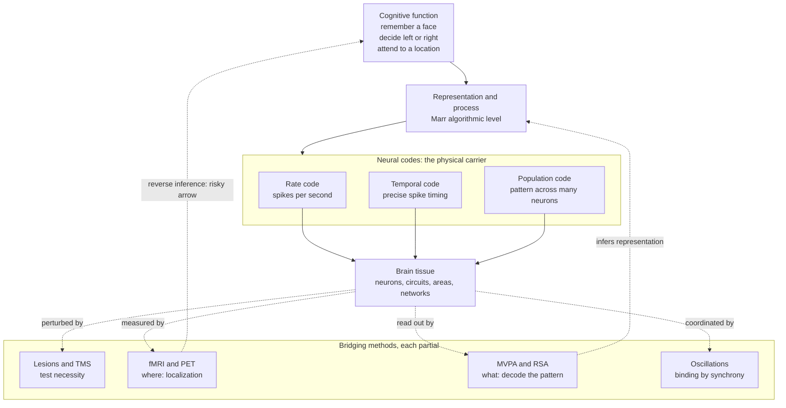

# 🧠 Neural Basis of Cognition

> [!abstract] TL;DR
> The neural basis of cognition is the study of **how the abstract processes of the mind — perceiving, remembering, deciding, attending — are physically realised in nervous tissue**. It occupies Marr's *implementational* level: cognitive science says *what* is computed and *how* (algorithmically), and this field asks *how neurons, populations, and brain areas actually carry it out*. The central difficulty is the **mapping problem** — representations and processes are functional descriptions, brains are lumps of tissue, and there is no guarantee the two carve up the same way. Modern tools (fMRI localization, lesion studies, multivariate decoding, representational similarity analysis, oscillation and synchrony measures) each buy a different, partial view of that mapping, and each comes with a signature failure mode such as **reverse inference**.

---

## Intuition

**Analogy:** Suppose you find a working computer running a chess program but you have no manual, no source code, and you are only allowed to probe the hardware. You can measure voltages on chips, cut a wire and see the screen glitch, or watch which regions of the board heat up while it "thinks." From this you might learn that *this* chip lights up when the machine calculates a move and *that* one when it draws the board — but you still would not have recovered the *rules of chess* or the *search algorithm*. Worse, if you saw a chip heat up, you could not reliably run the inference backwards and conclude "therefore the machine is calculating a move," because that same chip heats up during many operations.

Studying the neural basis of cognition is exactly this reverse-engineering problem, on a device with 86 billion components you cannot fully instrument. The "voltages" are spikes and blood flow; the "heat maps" are fMRI images; "cutting a wire" is a lesion or a TMS pulse. The whole enterprise is figuring out how the *chess rules* (cognition) are encoded in the *silicon* (neurons) — while knowing that the hardware map is not the program.

---

## How It Works

### Core mechanics: from function to tissue

Cognitive science characterises a capacity functionally — "hold three items in mind," "recognise a face," "choose the higher-value option." The neural basis question asks how each such function is **implemented**, and answering it means committing to three linked claims:

1. **A coding claim** — *in what physical variable is the information carried?* The candidate neural codes are:
   - **Rate coding** — information lives in the average firing rate over some window. A neuron fires faster for its preferred stimulus. Robust and easy to read, but slow and lossy.
   - **Temporal coding** — information lives in the *precise timing* of spikes (first-spike latency, inter-spike intervals, phase relative to an ongoing rhythm). Fast and high-capacity, but fragile and harder to demonstrate.
   - **Population coding** — information is distributed across the *pattern* of activity over many neurons, each broadly tuned and individually unreliable. No single cell is decisive; the ensemble is precise. This is the dominant modern view and the one the demo below makes concrete.

2. **A mapping claim** — *how do representations and processes map onto tissue?* This is the **mapping problem**. Does a cognitive process correspond to a brain *region*, a *network*, a *population geometry*, or a *dynamical trajectory*? The unit of the mind and the unit of the brain need not coincide, and a single region may participate in many functions.

3. **A localization-vs-distribution claim** — *is the function concentrated or spread out?* **Functional specialization** (the fusiform face area, Broca's area) says specific tissue does specific jobs; **distributed processing** says a function is smeared across a network and readable only from the joint pattern. Almost every real function is *some of both*: a hub plus a distributed code.

### The bridging methods and their logic

- **Lesions** establish *necessity*: if damage to area A abolishes function F, A is (part of) what F needs. Classic but confounded by plasticity, diaschisis, and the fact that damage is never surgically clean.
- **fMRI / PET localization** establishes *correlation*: which regions change activity while F is performed. This is a *forward* inference — task to activation — and it is on solid ground.
- **Reverse inference** runs the arrow backwards — activation to cognition — and is treacherous. Observing anterior insula activity and concluding "the subject felt disgust" is invalid whenever that region also activates for many other processes; the inference is only as strong as the region's *selectivity* (formally, a Bayesian posterior that depends on the base rate of the region's involvement).
- **Multivariate pattern analysis (MVPA) / decoding** trains a classifier to read a stimulus or state off the *spatial pattern* of activity, exploiting distributed information a regional average would wash out. Decodability proves the information *is present*, not that the brain *uses* it that way.
- **Representational similarity analysis (RSA)** abstracts away from individual voxels or neurons to a **representational geometry**: build a matrix of pairwise dissimilarities between the neural patterns for every condition, and compare that geometry across brain areas, across species, and against computational models. Two systems "represent alike" if their dissimilarity matrices match, even if their raw activity is incommensurable.
- **Oscillations and the binding problem** — features of one object (its colour, motion, shape) are processed in *different* areas, yet experienced as one thing. The **binding-by-synchrony** hypothesis proposes that neurons coding the same object fire in gamma-band synchrony, and that this temporal tag is what glues distributed features into a unified representation. Influential, contested, and still unresolved.

### Neural reuse and reading cognition off neurons

Two deep framing ideas cut across all of the above. **Neural reuse** (Anderson) holds that evolution redeploys existing circuits for new cognitive uses, so a given region participates in many unrelated functions — which is *precisely why reverse inference fails* and why one-region-one-function maps are the exception. And the overarching epistemic question: **can cognition be "read off" neurons at all?** Decoders and encoding models increasingly say *yes, a great deal can be recovered from population activity* — while reminding us that decodability by an experimenter is not the same as *use* by the brain.



---

## Key Concepts

### Secondary (intuitive grasp)

- **Different jobs, different places — mostly.** Damage to the back of the brain harms vision; damage near the temples harms memory; damage to the left frontal cortex harms speech production. The brain is not a uniform porridge; there is real functional specialization.
- **Rate vs population coding.** One way to send a message is "how fast a cell fires" (rate); a richer way is "the pattern across a whole crowd of cells" (population). The crowd is more accurate than any single member — like a noisy committee that votes well together.
- **Brain scans show *where*, not *what*.** An fMRI "lighting up" tells you which region got busier during a task. It does not directly tell you the *thought* — inferring the thought from the light-up is the error called reverse inference.

### Undergraduate (working knowledge)

- **The mapping problem.** Functional descriptions (memory, attention) and anatomical descriptions (hippocampus, parietal cortex) are two different vocabularies, and there is no guarantee they align one-to-one. A cognitive process might map to a network, a population geometry, or a dynamical trajectory rather than a tidy region.
- **Neural correlates of specific functions.** The best-mapped cases: **hippocampus → episodic/spatial memory** (patient H.M.; place cells), **parietal and prefrontal cortex → decision variables** (evidence accumulation in area LIP), **frontoparietal network → attention control** (the dorsal attention system biasing sensory cortex). Each is a *correlate*, and turning correlation into mechanism requires lesion or stimulation evidence.
- **Decoding / MVPA.** Instead of asking "does region R activate on average," ask "can I train a classifier to tell condition A from B using the full spatial pattern in R?" Haxby's face/object work showed object identity is readable from *distributed, overlapping* patterns in ventral temporal cortex — information invisible to a regional average.
- **Reverse inference, formally.** The strength of "activation in R implies process P" is a posterior that grows with how *selectively* R is engaged by P across the literature. For a region active in almost every task, that posterior barely rises above the prior — so the inference is nearly worthless there.

### Graduate (critical and integrative)

- **Representational similarity analysis and representational geometry.** RSA sidesteps the incommensurability of neurons, voxels, and model units by comparing *second-order* structure: the matrix of pairwise dissimilarities among condition-evoked patterns. Two systems with matching representational dissimilarity matrices implement the same *representational geometry* regardless of their substrate — the empirical workhorse for comparing brains to deep networks.
- **Deep networks as models of neural systems.** Goal-driven deep nets trained on object recognition develop internal representations whose RSA geometry and encoding-model fit *predict* responses along the primate ventral stream better than any hand-built model (Yamins & DiCarlo). This reframes the neural-basis question: a good model of the *computation* becomes the best available model of the *implementation* — a striking convergence of Marr's levels.
- **Binding by synchrony, contested.** The gamma-synchrony account of feature binding is elegant but faces hard objections: synchrony may be a *consequence* of shared drive rather than a binding *code*, measured coherence is confounded by common input, and behaviour can proceed without the predicted synchrony. Binding remains a live problem, not a solved one.
- **Neural reuse and anti-modularity.** Anderson's meta-analytic evidence that individual regions participate in many task domains undermines strict modularity and localizationism, and supplies the mechanistic reason reverse inference is dangerous: reuse guarantees low selectivity.
- **Decodability is not use.** A stimulus can be linearly decodable from an area that is *not causally involved* in the behaviour (e.g. decoding a visual feature from auditory cortex). Information-present (encoded) and information-used (read out downstream) are distinct claims; only perturbation experiments (optogenetics, TMS) bridge them.
- **The explanatory-gap residue.** Even a complete decoding map leaves the philosophical question of whether cognition — especially conscious experience — is *fully* captured by, or merely *correlated with*, the neural implementation.

---

## Python Demo

```python
# Reading cognition off neurons: a population-coding read-out.
# A bank of direction-tuned neurons with Gaussian tuning curves encodes ONE
# cognitive variable -- an intended movement direction. Each trial we draw
# noisy Poisson spike counts, then DECODE the direction with a population
# vector (the firing-rate-weighted sum of each neuron's preferred direction).
# We show (1) the tuning curves + one decoded estimate, and (2) that decoding
# accuracy sharpens as the population grows -- the core reason the brain codes
# with populations rather than single cells.
import numpy as np
import matplotlib.pyplot as plt

rng = np.random.default_rng(7)

R_MAX = 25.0     # peak firing rate per trial bin (spikes)
SIGMA = 45.0     # tuning width in degrees (Gaussian standard deviation)
TRUE  = 110.0    # the "thought" to read out: the intended direction, in degrees

def circ_diff(a, b):
    """Signed circular difference a - b in degrees, wrapped to (-180, 180]."""
    return (a - b + 180.0) % 360.0 - 180.0

def tuning_rates(direction, prefs):
    """Gaussian tuning-curve MEAN rates of neurons with preferred dirs 'prefs'."""
    d = circ_diff(direction, prefs)
    return R_MAX * np.exp(-0.5 * (d / SIGMA) ** 2)

def population_vector(spikes, prefs):
    """Decode direction as the rate-weighted vector sum of preferred directions."""
    ang = np.deg2rad(prefs)
    x = np.sum(spikes * np.cos(ang))
    y = np.sum(spikes * np.sin(ang))
    return np.rad2deg(np.arctan2(y, x)) % 360.0

# --- 1) Decoding accuracy vs population size --------------------------------
pop_sizes = np.array([4, 8, 16, 32, 64, 128])
n_trials  = 400
rmse = []
for N in pop_sizes:
    prefs = np.linspace(0, 360, N, endpoint=False)   # tile the circle
    mu = tuning_rates(TRUE, prefs)                    # mean rates for this stim
    errs = []
    for _ in range(n_trials):
        spikes = rng.poisson(mu)                      # noisy population response
        est = population_vector(spikes, prefs)        # read cognition off cells
        errs.append(circ_diff(est, TRUE))
    rmse.append(np.sqrt(np.mean(np.square(errs))))
rmse = np.array(rmse)

# --- 2) One worked example with a mid-size population -----------------------
N_demo = 16
prefs_demo  = np.linspace(0, 360, N_demo, endpoint=False)
spikes_demo = rng.poisson(tuning_rates(TRUE, prefs_demo))
est_demo    = population_vector(spikes_demo, prefs_demo)

# --- Plots ------------------------------------------------------------------
fig, ax = plt.subplots(1, 2, figsize=(13, 4.5))

grid = np.linspace(0, 360, 361)
for p in prefs_demo:                                   # faint tuning curves
    ax[0].plot(grid, tuning_rates(grid, np.full_like(grid, p)),
               color="tab:blue", alpha=0.25, lw=1)
ax[0].bar(prefs_demo, spikes_demo, width=6, color="tab:orange",
          alpha=0.85, label="noisy spike counts")
ax[0].axvline(TRUE, color="green", ls="--", lw=2, label=f"true = {TRUE:.0f} deg")
ax[0].axvline(est_demo, color="red", ls=":", lw=2,
              label=f"decoded = {est_demo:.0f} deg")
ax[0].set_xlabel("direction (degrees)")
ax[0].set_ylabel("firing rate / spike count")
ax[0].set_title(f"Tuning curves + population-vector read-out (N = {N_demo})")
ax[0].set_xlim(0, 360)
ax[0].legend(fontsize=8)

ax[1].plot(pop_sizes, rmse, "o-", color="tab:purple", label="population-vector RMSE")
ref = rmse[0] * np.sqrt(pop_sizes[0] / pop_sizes)      # 1/sqrt(N) reference
ax[1].plot(pop_sizes, ref, "k--", alpha=0.6, label="1 / sqrt(N) reference")
ax[1].set_xscale("log", base=2)
ax[1].set_xlabel("population size N")
ax[1].set_ylabel("decoding RMSE (degrees)")
ax[1].set_title("More neurons -> sharper read-out of the same 'thought'")
ax[1].legend(fontsize=8)
ax[1].grid(alpha=0.3)

plt.tight_layout()
plt.show()

for N, e in zip(pop_sizes, rmse):
    print(f"N = {N:3d}  ->  decoding RMSE = {e:5.2f} deg")
# Expected: overlapping Gaussian tuning curves; the decoded line lands near the
# true 110 deg; and RMSE falls roughly as 1/sqrt(N) -- no single noisy neuron is
# reliable, yet the population read-out is precise and improves with size.
```

The demo dramatises the field's founding intuition: *no single neuron reliably reports the intended direction*, yet a weighted read-out of the whole noisy population recovers it, and the read-out sharpens as the population grows. This is why the brain can code cognitive variables with unreliable cells — and why the experimenter's ability to *decode* the variable does not by itself prove the brain *reads it out* the same way.

---

## Real-World Applications

- **Intracortical brain-computer interfaces.** BrainGate-style systems decode intended movement or attempted handwriting directly from motor-cortex population activity in paralysed patients, letting them drive cursors and type. This is the neural-basis-of-cognition thesis turned into engineering: the *intention* is genuinely present in, and readable from, the population code.
- **Clinical localization for neurosurgery.** Pre-surgical fMRI and electrocortical stimulation map language and motor cortex in individual patients so surgeons can resect tumours or epileptic foci while sparing eloquent tissue — functional specialization used to guide the scalpel.
- **fMRI decoding and "mind-reading" demos.** MVPA and encoding models can reconstruct which image category a person is viewing, or approximate seen/imagined scenes, from distributed occipitotemporal patterns — a proof that rich content is decodable, and a standing cautionary tale about overclaiming from decodability.
- **Deep networks as computational models of cortex.** In vision neuroscience, goal-driven convolutional networks are now standard *models* of the ventral stream: their layers are fit to and compared with neural populations via RSA and encoding models, closing the loop between the algorithmic and implementational levels.
- **Diagnosing disorders as network, not spot, pathology.** Framing conditions such as schizophrenia and Alzheimer's as disruptions of distributed networks and their oscillatory coordination (rather than single-region lesions) reflects the shift from localizationism toward distributed, connectivity-based accounts of cognition.

---

## Common Pitfalls

- **Reverse inference.** Concluding a mental process from an activation ("the amygdala lit up, so they were afraid") is invalid whenever the region is not selective for that process. Neural reuse makes most regions non-selective, so the inference is weak by default — always ask about the region's base rate of involvement.
- **Mistaking decodability for use.** A classifier reading a variable from area R shows the information is *encoded* there, not that downstream circuits *read it out* or that R is *causally* necessary. Only perturbation (lesion, TMS, optogenetics) upgrades encoding to mechanism.
- **The blobology fallacy.** Treating a coloured fMRI blob as "the seat of" a function ignores that the function is typically distributed across a network, that the blob is a thresholded statistical map, and that "more active" is relative to a baseline that is itself doing something.
- **Confusing levels.** Explaining cognition purely in neurons with no statement of the *computation* yields detail without understanding (Marr's "feathers, not flight"); conversely, treating the algorithm as fully independent of the substrate ignores that noisy, parallel, energy-limited neural hardware constrains which algorithms are plausible.
- **Over-reading synchrony.** Finding gamma coherence between areas does not establish binding-by-synchrony; shared input can manufacture coherence, and coherence measures are easy to confound. Treat synchrony as a candidate code to be tested, not a demonstrated one.
- **Assuming one region equals one function.** Both directions fail: a region serves many functions (reuse), and a function recruits many regions (distribution). Neither the fusiform face area nor Broca's area is exclusively or solely responsible for its headline function.

---

## Related Concepts

- [[Levels_of_Analysis_and_Marrs_Levels]] — this note *is* Marr's implementational level; the neural-basis question is "how are the computational and algorithmic levels physically realised?"
- [[Mental_Representation]] — the representations posited by cognitive theory are exactly what the mapping problem tries to locate in tissue; RSA compares their geometry across substrates.
- [[Computational_Theory_of_Mind]] — the "mind as software" thesis whose multiple realizability both motivates and complicates reading cognition off any particular neural hardware.
- [[Population_Coding_and_Decoding]] (Neuroscience) — the coding scheme and decoders behind the Python demo; the neuroscience-side deep dive this note gives a cognitive framing to.
- [[Neural_Coding_and_Spike_Trains]] (Neuroscience) — the rate-vs-temporal-code distinctions summarised here, with the biophysical detail.
- [[Neural_Oscillations_and_Synchrony]] (Neuroscience) — the mechanistic substrate for the binding-by-synchrony hypothesis discussed above.
- [[Neuroimaging_Methods]] (Neuroscience) — the fMRI/PET machinery behind localization, MVPA, and RSA, and the source of reverse-inference risk.
- [[Learning_and_Memory_Systems]] (Neuroscience) — the hippocampus-memory correlate, a best-case example of function-to-tissue mapping.
- [[Decision_Making_and_Reward_Circuits]] (Neuroscience) — parietal/prefrontal evidence accumulation, the decision-variable correlate.
- [[Attention_and_Executive_Function]] (Neuroscience) — the frontoparietal control network behind the attention correlate.
- [[Consciousness_and_Neural_Correlates]] (Neuroscience) — the NCC programme is the neural-basis question applied to conscious experience, where the explanatory gap bites hardest.
- [[Dualism_vs_Physicalism]] (Philosophy) — physicalism is the metaphysical premise that lets a *neural* basis be a *complete* basis for cognition.

---

## Review Questions

1. **(Secondary)** Using the "chess computer with no manual" analogy, explain the difference between learning *where* a function happens in the brain and learning *what* the brain is actually computing. Why does a brain scan lighting up during a task not, by itself, tell you what the person was thinking?
2. **(Undergraduate)** A study reports insula activation while subjects view unpleasant images and concludes "subjects experienced disgust." Name the inferential error, and explain — in terms of a region's *selectivity* and of *neural reuse* — the conditions under which such an inference would be strong versus nearly worthless. What kind of evidence would upgrade the claim from correlation to mechanism?
3. **(Graduate)** You can linearly decode stimulus orientation from a brain area with 95% accuracy. A collaborator claims this proves the area "codes orientation for the behaviour." (a) Distinguish *information encoded* from *information used*, and give a concrete way the decode could be a false positive for causal involvement. (b) How would representational similarity analysis let you compare this area's representational geometry to that of a deep network trained on the same task, and what would a *match* and a *mismatch* each imply about the neural basis of the computation?

---

## Sources

- Poldrack, R. A. (2006). "Can cognitive processes be inferred from neuroimaging data?" *Trends in Cognitive Sciences*, 10(2), 59–63.
- Kriegeskorte, N., Mur, M., & Bandettini, P. (2008). "Representational similarity analysis — connecting the branches of systems neuroscience." *Frontiers in Systems Neuroscience*, 2, 4.
- Haxby, J. V., Gobbini, M. I., Furey, M. L., et al. (2001). "Distributed and overlapping representations of faces and objects in ventral temporal cortex." *Science*, 293(5539), 2425–2430.
- Anderson, M. L. (2010). "Neural reuse: A fundamental organizational principle of the brain." *Behavioral and Brain Sciences*, 33(4), 245–266.
- Yamins, D. L. K., & DiCarlo, J. J. (2016). "Using goal-driven deep learning models to understand sensory cortex." *Nature Neuroscience*, 19(3), 356–365.
- Singer, W., & Gray, C. M. (1995). "Visual feature integration and the temporal correlation hypothesis." *Annual Review of Neuroscience*, 18, 555–586.

---

#cognitive-science #cognitive-neuroscience #neural-coding #population-coding #brain
