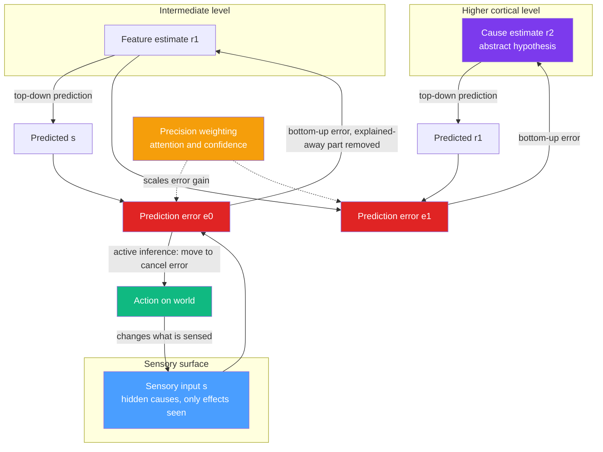

# 🔮 Predictive Processing and the Free Energy Principle

> [!abstract] TL;DR
> **Predictive processing** claims the brain is not a passive stimulus-response machine but a *prediction engine*: it runs an internal **generative model** of the causes of its sensations, continuously predicts incoming signals top-down, and only propagates the **prediction error** (the surprising residual) upward to correct the model. Karl Friston's **Free Energy Principle (FEP)** generalizes this into a single imperative — any self-organizing system that resists dissolution must minimize **variational free energy**, a tractable *upper bound on surprise*. Perception minimizes error by updating beliefs; **active inference** minimizes it by acting on the world to make predictions come true. Attention is the *precision-weighting* of errors, illusions are priors overpowering weak evidence, and disorders like schizophrenia and autism can be read as aberrant precision. It is one of the most ambitious unifying theories in cognitive science — and one of the most contested.

---

## Intuition

**Analogy:** Picture a seasoned newspaper editor who does not read every word of every draft. Instead she *anticipates* what each reporter will file — she knows their beats, their style, the day's events — and she scans only for **deviations** from her expectation. A typo, an unexpected fact, a sentence that breaks the anticipated flow: those jump out and demand her attention and effort. Everything she correctly predicted, she barely processes at all. Over the day she updates her expectations about each writer, so tomorrow she predicts even better and has even less to correct. Her whole job is to *minimize surprise* against a model she keeps refining.

Your brain is that editor, and reality is the incessant stream of copy. Higher brain regions constantly "file predictions" downward about what lower sensory regions are about to report. When the prediction matches, the signal is silently absorbed and consciousness barely registers it. When it *fails*, a **prediction error** shoots upward, grabs resources, and forces the model to update. Perception, on this view, is not the brain reading the world — it is the world *correcting the brain's best guess*. Richard Gregory called perception hypothesis testing; Anil Seth calls it a **controlled hallucination** that happens to be reined in by sensory evidence.

---

## How It Works

### The core idea: minimize prediction error

Sensory organs deliver only the *effects* (patterns of light, pressure, chemical binding); the *causes* (objects, agents, events) are hidden and must be inferred. Rather than build percepts bottom-up from scratch, the brain maintains a **hierarchical generative model** — a cascade of "if this cause were present, this is what I'd sense" mappings — and inverts it. At every level:

1. A higher region emits a **top-down prediction** of the activity it expects in the region below.
2. The lower region computes a **prediction error**: the difference between what it actually receives and what was predicted.
3. Only this **residual error propagates bottom-up**; the predicted part is "explained away" and suppressed.
4. Higher regions **update their estimates** to reduce the error, then predict again. The loop settles when error is minimized — that settled state *is* the percept.

This is **Rao & Ballard's (1999)** predictive coding of visual cortex: forward connections carry *errors*, backward connections carry *predictions*. It is efficient — the brain transmits only what it could not anticipate, a biological cousin of predictive compression.

### Precision: attention as confidence-weighting

Not all errors deserve equal trust. A signal from a noisy, unreliable channel (a blurry glimpse in fog) should barely move your beliefs; a signal from a crisp, reliable channel should dominate. The brain therefore weights each prediction error by its **precision** — the inverse variance, an estimate of its reliability. Turning up the gain on a set of error units is, functionally, **attention**: it decides which prediction errors get to shape the model. Neurobiologically this precision-weighting is linked to neuromodulators (dopamine, acetylcholine) tuning post-synaptic gain.

### The Bayesian brain

All of this is Bayes' rule made mechanical: the percept is the **posterior** `P(causes | data) proportional to P(data | causes) times P(causes)`. Top-down predictions encode the **prior**, bottom-up errors carry the **likelihood**, and precision is the confidence assigned to each. Predictive coding is a neurally plausible, message-passing *approximation* to Bayesian inference — the brain does not compute full posteriors but descends a gradient that approximates them.

### The Free Energy Principle: surprise you can actually compute

The truly Bayesian thing to minimize would be **surprise** (the negative log-probability of your sensations given your model) — but surprise requires marginalizing over all possible causes, which is intractable. Friston's move borrows **variational free energy** from statistical physics and machine learning: an upper bound on surprise that depends only on quantities the brain has access to (its current beliefs and its sensory errors). Minimizing this bound *also* pushes surprise down, without ever computing the intractable integral. Free energy decomposes as roughly `accuracy penalty plus complexity` — fit the data well while keeping beliefs close to priors.

The FEP then makes a sweeping claim: **any system that maintains a boundary against its environment (a Markov blanket) and persists over time must, on average, minimize the free energy of its sensory states.** Staying alive means occupying a small set of expected, low-surprise states (a fish expects water, a body expects 37 degrees). Homeostasis, self-organization, and perception become facets of one principle: resist the second law's pull toward disorder by keeping your sensations predictable.

### Active inference: acting to fulfill predictions

There are two ways to shrink a prediction error. Change the **model** to fit the world (perception), or change the **world** to fit the model (action). **Active inference** is the second: motor commands are treated as predictions about proprioceptive input, and reflex arcs act to *make those predictions true*. You predict your hand at the cup; the resulting proprioceptive error is cancelled not by revising the belief but by moving the hand there. On this view perception and action are the same imperative running in opposite directions, and *desires and goals are simply strong, hard-to-revise priors* about states you expect to occupy.



---

## Key Concepts

### Secondary (school-level intuition)

- **The brain guesses first, checks second.** You do not build what you see from scratch each moment; you predict it and fix the mistakes.
- **Surprise costs effort.** Expected things slide by unnoticed; unexpected things grab attention. That "grab" is a prediction error.
- **Attention is turning up the volume.** The brain trusts clear signals more than noisy ones and pays attention accordingly.
- **Illusions are the brain over-trusting its expectations** when the real evidence is weak or unusual.
- **Acting is predicting too.** Reaching for a cup is your brain making its prediction "hand at cup" come true.

### Undergraduate (cognitive-science depth)

- **Hierarchical predictive coding (Rao & Ballard, 1999):** backward connections carry predictions, forward connections carry prediction errors; each level explains away the level below.
- **Explaining-away:** once a cause accounts for the data, the corresponding error is suppressed — the reason expected input barely reaches awareness.
- **Bayesian brain hypothesis:** perception is posterior inference; priors are top-down predictions, likelihoods are bottom-up errors, precision is confidence.
- **Precision as attention:** gain control on error units; misallocated precision reweights which evidence dominates the percept.
- **Analysis-by-synthesis:** the brain tests hypotheses by running its generative model forward and comparing the synthetic prediction to actual input.
- **Controlled hallucination (Clark, Hohwy, Seth):** the percept is an internally generated best guess constrained by sensory error, not a readout of the world.

### Graduate (formal / systems view)

- **Variational free energy:** `F = E_q[ln q(x) - ln p(s, x)]`, an upper bound on surprise `-ln p(s)`; minimizing `F` over the recognition density `q` approximates Bayesian inference (variational Bayes / expectation maximization in the brain).
- **The Free Energy Principle & Markov blankets:** self-organizing systems that persist maintain a statistical boundary and minimize the free energy of sensory states; homeostasis and inference are unified under one variational objective.
- **Active inference & expected free energy:** policy selection minimizes *expected* free energy, which decomposes into an epistemic (information-gain / exploration) term and a pragmatic (goal / exploitation) term — a principled resolution of the explore-exploit trade-off.
- **Generalized filtering / predictive coding as gradient descent:** neuronal dynamics implement a gradient descent on precision-weighted prediction error; hierarchical message passing under the Laplace approximation.
- **Interoceptive inference & emotion (Seth, Barrett):** emotions and selfhood arise from predictive models of the body's internal (interoceptive) state; allostasis is prediction-driven physiological regulation.
- **Computational psychiatry:** disorders modeled as aberrant precision — attenuated priors / over-weighted sensory precision in autism, imprecise priors with false-inference "explaining away" in psychosis and hallucination.

---

## Python Demo

A minimal **hierarchical predictive coding loop**. A three-level generative model (top cause to mid features to sensory surface) receives a fixed sensory input. The network starts ignorant, emits top-down predictions, computes bottom-up prediction errors, and updates its estimates by gradient descent to **minimize precision-weighted error**. Watch the error signal shrink as the model progressively "explains away" the input, and the inferred hidden cause converge to the true value. Requires only `numpy` and `matplotlib`.

```python
# Hierarchical predictive coding: top level predicts middle predicts sensory.
# Bottom-up prediction errors drive the estimates to minimize free energy,
# i.e. total precision-weighted squared error. We watch the error "explain away".
import numpy as np
import matplotlib.pyplot as plt

rng = np.random.default_rng(0)

# ---- Generative model (fixed weights that DECODE a level into a prediction
#      of the level below). Scaled by 1/sqrt(fan-in) to keep dynamics stable. ----
n_top, n_mid, n_sens = 1, 3, 8
W_mid  = rng.normal(0, 1, size=(n_mid,  n_top)) / np.sqrt(n_top)    # top  -> mid prediction
W_sens = rng.normal(0, 1, size=(n_sens, n_mid)) / np.sqrt(n_mid)    # mid  -> sensory prediction

# ---- The true hidden cause that actually generated the sensory data ----
true_top = np.array([2.0])
true_mid = W_mid  @ true_top
sensory  = W_sens @ true_mid           # the input the "brain" receives

# ---- Precisions (inverse variances) weight each error term ----
prec_sens, prec_mid = 1.0, 1.0

# ---- Inference: start from ignorant zero estimates and minimize error ----
x_top = np.zeros(n_top)
x_mid = np.zeros(n_mid)

lr, n_iter = 0.08, 250
err_history, top_history = [], []

for t in range(n_iter):
    # Top-down predictions
    pred_mid  = W_mid  @ x_top          # top predicts the middle layer
    pred_sens = W_sens @ x_mid          # middle predicts the sensory layer

    # Bottom-up prediction errors
    e_sens = sensory - pred_sens        # sensory prediction error
    e_mid  = x_mid   - pred_mid         # representation prediction error

    # Precision-weighted errors
    pe_sens = prec_sens * e_sens
    pe_mid  = prec_mid  * e_mid

    # Gradient descent on free energy (sum of precision-weighted squared errors):
    #   middle unit is pushed UP by sensory error, pulled toward its top-down prediction
    x_mid = x_mid + lr * (W_sens.T @ pe_sens - pe_mid)
    x_top = x_top + lr * (W_mid.T  @ pe_mid)

    total_error = prec_sens * np.sum(e_sens**2) + prec_mid * np.sum(e_mid**2)
    err_history.append(total_error)
    top_history.append(x_top[0])

err_history = np.array(err_history)
print(f"True hidden cause      : {true_top[0]:.4f}")
print(f"Inferred hidden cause  : {x_top[0]:.4f}")
print(f"Initial total error    : {err_history[0]:.4f}")
print(f"Final total error      : {err_history[-1]:.6f}")

# ---- Visualize convergence ----
fig, (ax1, ax2) = plt.subplots(1, 2, figsize=(11, 4.5))

ax1.plot(err_history, color="#e02424", lw=2)
ax1.set_yscale("log")
ax1.set_title("Prediction error is explained away")
ax1.set_xlabel("Inference iteration")
ax1.set_ylabel("Total precision-weighted squared error (log scale)")
ax1.grid(alpha=0.3)

ax2.axhline(true_top[0], color="gray", ls="--", lw=1.5, label="True hidden cause")
ax2.plot(top_history, color="#7c3aed", lw=2, label="Inferred cause estimate")
ax2.set_title("Top-level estimate converges to the true cause")
ax2.set_xlabel("Inference iteration")
ax2.set_ylabel("Estimated top-level cause")
ax2.legend()
ax2.grid(alpha=0.3)

plt.tight_layout()
plt.savefig("predictive_coding_convergence.png", dpi=120)
plt.show()
```

**What to notice:** the red error curve plunges by orders of magnitude on a log scale — the hierarchy settles into a state where its top-down predictions almost perfectly reconstruct the input, so almost nothing surprising remains to propagate upward. Simultaneously the purple estimate climbs toward the true hidden cause (2.0) *without ever being told it* — it is recovered purely by minimizing prediction error. That is predictive coding in one loop: perception as the fixed point where the generative model best explains its own sensations.

---

## Real-World Applications

- **Machine learning:** predictive coding networks are studied as a biologically plausible alternative to backpropagation; the FEP's variational objective is the same one behind **variational autoencoders** and modern generative models, and self-supervised "predict the next token / masked patch" objectives echo the same minimize-surprise logic.
- **Computational psychiatry:** aberrant-precision models give mechanistic accounts of **hallucinations and delusions** (strong priors, false inference), **autism** (attenuated priors / over-precise sensory evidence, hence detail focus and sensory overload), Parkinsonian and dopaminergic symptoms (precision set by dopamine), and functional / psychosomatic symptoms as prediction-driven interoception gone awry.
- **Affective neuroscience & interoception:** Seth's and Barrett's interoceptive-inference accounts recast **emotion** as the brain's predictive model of bodily state, informing research on anxiety, depression, and body-awareness interventions.
- **Robotics & control:** active inference is deployed as a unified perception-action controller for adaptive robots, replacing separate estimation and control loops with one free-energy-minimizing objective.
- **Human-computer interaction & VR:** designing displays and haptics that respect the brain's predictions (and avoid cue conflicts) reduces sensory mismatch and simulator sickness — engineering around controlled hallucination.

---

## Common Pitfalls

- **Confusing "prediction error" with a conscious mistake.** It is a low-level, mostly unconscious mismatch signal between expected and received neural activity, not an error of judgment you can introspect.
- **Thinking the goal is to eliminate all error / seek a "dark room."** The famous **dark-room objection**: if minimizing surprise were everything, we should seek a silent, dark, stimulus-free room and stay forever. The reply is that organisms carry *prior expectations to explore, eat, and seek novelty* (and expected free energy includes an epistemic, information-seeking term), so a dark room is itself highly surprising relative to what a creature expects.
- **Treating the FEP as an empirical, falsifiable neuroscience claim.** Critics (e.g. some readings of the debate around Friston) argue the strong FEP is a *mathematical near-tautology / normative framework*, not a testable hypothesis — it can retro-fit almost any behavior. Keep the falsifiable **process theory** (predictive coding as a specific neural implementation) distinct from the unfalsifiable **normative principle** (free-energy minimization).
- **Assuming predictions are always high-level "beliefs."** Most predictions are implicit statistical regularities at every level of the hierarchy, from edge orientation to social context — not sentences you could state.
- **Reading precision-weighting as merely "gain."** Misallocated precision has real content: it explains attention, but *also* pathology (over-precise priors yielding hallucination), so it is a substantive theoretical commitment, not a free parameter to wave at any datum.
- **Equating predictive processing with pure top-down idealism.** Sensory error still anchors the model to reality — it is *controlled* hallucination. Remove the control and you get dreaming or psychosis, not veridical perception.

---

## Related Concepts

- [[Theories_of_Perception]] — predictive processing is the modern synthesis of Helmholtz's unconscious inference and the Bayesian brain; this note situates it among direct vs constructivist theories.
- [[Bayesian_Reasoning]] — the formal `posterior proportional to likelihood times prior` machinery that predictive coding approximates with neural message passing.
- [[Computational_Theory_of_Mind]] — predictive processing is a specific, probabilistic instantiation of the mind-as-computation thesis, with generative models as the representations.
- [[Levels_of_Analysis_and_Marrs_Levels]] — the FEP is a computational-level goal, predictive coding an algorithmic-level process, and cortical microcircuits the implementation.
- [[Attention_and_Selection]] — attention reframed as precision-weighting of prediction errors: which signals get to update the model.
- [[Multisensory_Integration]] — precision-weighted fusion of modalities is the same reliability-based mechanism operating across senses.
- [[Consciousness_and_Awareness]] — "controlled hallucination" and predictive self-models feed directly into predictive theories of conscious content and selfhood.
- [[Embodied_and_Extended_Cognition]] — active inference makes action constitutive of cognition, aligning predictive processing with embodied and enactive views.
- [[Sensorimotor_Integration_and_Feedback]] — the neural loop where motor commands act as proprioceptive predictions cancelled by movement (active inference in the sensorimotor system).
- [[Consciousness_and_Neural_Correlates]] — the neuroscience of how predictive hierarchies relate to the contents and level of consciousness.
- [[Psychiatric_Disorders_and_Neurobiology]] — computational-psychiatry accounts of schizophrenia and autism as aberrant precision and prior weighting.
- [[Visual_System_and_Visual_Cortex]] — the cortical hierarchy (V1 upward) where Rao & Ballard originally modeled predictive coding with forward errors and backward predictions.

---

## Review Questions

1. **(Conceptual)** Explain how minimizing *variational free energy* lets a brain reduce *surprise* without ever computing the (intractable) surprise directly. What does free energy bound, and why does that make it useful?
2. **(Scenario)** A person reports vivid auditory hallucinations. Using the precision-weighting framework, give two distinct predictive-processing explanations — one emphasizing over-weighted priors, one emphasizing mis-set sensory precision — and describe an experiment that could distinguish them.
3. **(Trade-off / critique)** The Free Energy Principle is praised as a grand unifying theory yet accused of being unfalsifiable, and it faces the "dark-room problem." State the dark-room objection precisely, give the standard reply, and argue whether the criticism targets the *normative principle*, the *process theory* of predictive coding, or both.

---

## Sources

- Rao, R. P. N., & Ballard, D. H. (1999). "Predictive coding in the visual cortex: a functional interpretation of some extra-classical receptive-field effects." *Nature Neuroscience*, 2(1), 79–87.
- Friston, K. (2010). "The free-energy principle: a unified brain theory?" *Nature Reviews Neuroscience*, 11(2), 127–138.
- Clark, A. (2013). "Whatever next? Predictive brains, situated agents, and the future of cognitive science." *Behavioral and Brain Sciences*, 36(3), 181–204.
- Hohwy, J. (2013). *The Predictive Mind*. Oxford University Press.
- Seth, A. K. (2021). *Being You: A New Science of Consciousness*. Faber & Faber / Dutton.
- Friston, K., FitzGerald, T., Rigoli, F., Schwartenbeck, P., & Pezzulo, G. (2017). "Active inference: a process theory." *Neural Computation*, 29(1), 1–49.

---

#cognitive-science #predictive-processing #free-energy #active-inference #predictive-coding
