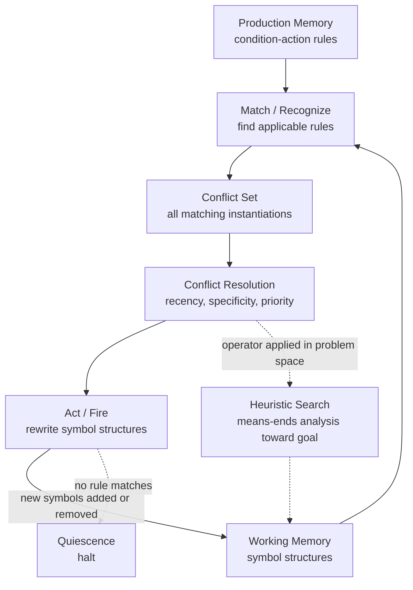

# 🔣 Symbolic AI and Physical Symbol Systems

> [!abstract] TL;DR
> Symbolic AI — the classical, "Good Old-Fashioned AI" (GOFAI) program of Newell, Simon, McCarthy, and Minsky — holds that intelligence is the mechanical manipulation of *symbols*: discrete, meaning-bearing tokens combined into expressions and rewritten by explicit rules. Its central claim, the **Physical Symbol System Hypothesis** (Newell & Simon, 1976), is that "a physical symbol system has the necessary and sufficient means for general intelligent action." Embodied in production systems, heuristic search, and expert systems, this approach gave cognitive science its first working theory of mind — powerful, interpretable, and systematic — but ran aground on brittleness, common sense, the frame problem, and symbol grounding, failures that launched connectionism and, today, the neuro-symbolic synthesis.

---

## Intuition

**Analogy:** Picture a chef working from an enormous box of index cards. Each card reads "IF such-and-such ingredients are on the counter, THEN perform this step." The chef never improvises and never really *understands* cuisine. She just scans the counter (which holds the current ingredients), finds every card whose IF-part matches what is actually there, picks one card, does exactly what its THEN-part says — which rearranges the counter — and then scans again. Repeat until no card matches. Out of this blind, mechanical loop of *match a situation to a card and act*, a complicated dish reliably emerges.

Symbolic AI claims that all intelligence, human or machine, is this trick scaled up. The counter is **working memory**, the box of cards is **long-term (production) memory**, an ingredient is a **symbol**, an arrangement of ingredients is an **expression**, and the scan-pick-act loop is the **recognize-act cycle**. A "physical symbol system" is any device — a brain, a computer, the chef — that stores symbol structures and has processes that create, match, copy, and rewrite them. The bet of GOFAI is that *that is all thinking is*.

---

## How It Works

### Core Mechanics

**1. The Physical Symbol System Hypothesis (Newell & Simon, 1976).** In their Turing Award lecture, Allen Newell and Herbert Simon proposed AI's founding empirical hypothesis: "A physical symbol system has the necessary and sufficient means for general intelligent action." *Necessary*: anything genuinely intelligent must be a symbol system. *Sufficient*: any system with enough symbol-processing capacity can, in principle, be made generally intelligent. Crucially they framed it as an **empirical** hypothesis — a claim to be confirmed or refuted by building systems, not a definition — putting AI and cognitive psychology on the same experimental footing.

**2. Symbols, expressions, and processes.** A **symbol** is a physical pattern (a token) that can *designate* — stand for — an object, another symbol, or a process. **Expressions** (symbol structures) are symbols arranged by relations. **Processes** create, modify, reproduce, and destroy expressions. Two properties matter: *designation* (a symbol can point at what it stands for, so the system can act on the referent through the token) and *interpretation* (an expression can designate a process, so the system can execute it). This is the machinery of a **language of thought** made physical: syntax you can manipulate, semantics that rides along.

**3. Production systems.** The canonical symbolic architecture. Knowledge is stored as **productions** — condition-action rules of the form `IF <pattern of working-memory elements> THEN <action>`. **Working memory (WM)** holds the current facts as symbol structures. **Production memory** holds the rules. Nothing is procedural in the usual sense; the entire behavior is emergent from which rules fire when.

**4. The recognize-act cycle.** Control loops through three phases: **(a) Match/Recognize** — find every production whose condition pattern-matches the current WM; each match is an *instantiation* with specific bindings, and the set of them is the **conflict set**. **(b) Conflict resolution** — choose exactly one instantiation to fire. **(c) Act** — execute its action, which adds, removes, or modifies WM elements. The changed WM feeds the next cycle. The system halts at **quiescence**: a cycle where no production matches. The Rete algorithm (Forgy, 1979) makes the match phase efficient by caching partial matches so unchanged WM is not re-tested every cycle.

**5. Conflict resolution strategies.** Because many rules may match at once, the strategy that picks the winner *is* the system's control policy. Classic OPS5 strategies: **refraction** (do not re-fire the same instantiation on the same data), **recency** (prefer rules matching the most recently changed WM elements), **specificity** (prefer the rule with the more detailed condition), and explicit **priority/salience**. Change the strategy and you change the "personality" of reasoning without touching a single rule.

**6. Heuristic search — taming combinatorial explosion.** Newell and Simon reframed problem solving as **search through a problem space**: states, operators that transform states, an initial state, and a goal test. Brute-force search explodes, so intelligence lives in the **heuristics** that prune it. The **General Problem Solver (GPS)** used **means-ends analysis** — detect the difference between the current and goal state, select an operator known to reduce that difference, and recurse. Informed search like [[A_Star_Search]] formalizes the same idea with an admissible heuristic that estimates distance-to-goal.

**7. GOFAI (Haugeland's framing).** Philosopher John Haugeland coined **"Good Old-Fashioned AI"** in *Artificial Intelligence: The Very Idea* (1985). His characterization: GOFAI systems reason by manipulating symbols that are *semantically interpretable* — each token means something, and the system's operations respect those meanings, so "if you take care of the syntax, the semantics takes care of itself." This is the engineering face of the [[Computational_Theory_of_Mind]].

**8. The classic systems.** **Logic Theorist** (1956) proved theorems from *Principia Mathematica* — arguably the first AI program. **GPS** (1957) generalized its search strategy. **SHRDLU** (Winograd, 1972) understood and manipulated a simulated blocks world through parsed natural-language commands, a triumph of tightly-scoped symbolic reasoning. **Expert systems** — DENDRAL (chemistry), MYCIN (diagnosis), R1/XCON (VAX configuration) — turned production rules into 1980s commercial AI. **SOAR** (Laird, Newell, Rosenbloom, 1987) and **ACT-R** (Anderson) became **unified cognitive architectures**: production systems proposed as complete theories of the human mind, predicting reaction times and error patterns in psychology experiments.

**9. The symbol system as a theory of mind.** Newell's *Unified Theories of Cognition* (1990) argued that a single production architecture (SOAR) should account for *all* of cognition. This is the strong claim: human thought literally *is* a physical symbol system, so its strengths — **systematicity** (grasping "John loves Mary" entails grasping "Mary loves John"), **compositionality** (complex thoughts built from parts), **productivity** (unboundedly many thoughts from finite means), **interpretability** (every step is an explicit, inspectable rule), and **explicit reasoning** — are the empirical signatures we should expect and do observe.

**10. The limits that motivated connectionism.** GOFAI hit walls that were not incidental bugs but structural. **Brittleness**: a symbolic system is confident and correct inside its rule set and nonsensical one step outside it. **The frame problem**: after any action, deciding which of a vast store of facts changed and which stayed put is prohibitively expensive to state explicitly. **Common sense**: the sheer volume of tacit world knowledge resisted hand-coding — CYC spent decades entering millions of assertions and never reached fluency. **Learning**: rules were largely written by humans, not acquired from data. **Graceful degradation**: damage a symbolic system and it fails catastrophically, unlike a brain, which degrades smoothly. **The symbol grounding problem** (Harnad, 1990): if each symbol's meaning is given only by other symbols, the whole system is an ungrounded dictionary — how does any token connect to the world? These failures motivated **connectionism** (distributed, sub-symbolic, learned representations) and, more recently, the **neuro-symbolic** synthesis: use neural networks to perceive, ground, and learn, and symbolic engines to reason, verify, and explain — pairing a pattern-matcher with a rulebook so each covers the other's weakness.

### Flow / Architecture



---

## Key Concepts

### Secondary (Foundational)

- **Symbol.** A physical token that stands for something. In a production system, symbols name facts in working memory; the system acts on the world by manipulating these tokens.
- **Condition-action rule (production).** An `IF pattern THEN action` pair. The IF-part is matched against working memory; if it fits, the THEN-part is eligible to fire.
- **Recognize-act cycle.** The engine's heartbeat: match rules against memory, pick one, fire it to change memory, repeat until nothing matches.
- **GOFAI.** Haugeland's label for classical, symbol-manipulating AI, as opposed to sub-symbolic neural approaches.
- **Heuristic.** A rule of thumb that guides search toward a goal without examining every possibility — the difference between intelligent search and brute force.

### Undergraduate (Technical Depth)

- **Physical Symbol System Hypothesis.** The necessary-and-sufficient claim for general intelligent action; important because it is *empirical* and *substrate-neutral* — brains, silicon, or index cards all qualify if they process symbol structures the right way.
- **Conflict resolution.** The strategy (refraction, recency, specificity, salience) that selects one instantiation from the conflict set. It encodes the system's control flow implicitly; there is no separate "main program."
- **Means-ends analysis.** GPS's core heuristic: repeatedly reduce the measured difference between the current state and the goal by applying a difference-reducing operator, recursing on any preconditions the operator itself requires.
- **Problem space.** The formal `<states, operators, initial state, goal test>` structure over which search runs; casting a task as a problem space is the symbolic modeler's first move.
- **Systematicity and compositionality.** Structured thought comes in predictable clusters and builds wholes from parts — the strongest positive evidence that cognition uses a combinatorial symbol system rather than unstructured association.

### Graduate (Research Frontier)

- **Rete networks and match complexity.** Naive matching re-tests all of WM every cycle. Rete compiles conditions into a dataflow network that stores partial matches, trading memory for near-incremental match cost — the enabling technology for large-scale rule engines (OPS5, CLIPS, Drools).
- **Unified theories of cognition.** SOAR and ACT-R promote the production system from a tool to a *falsifiable psychological theory*, fitting millisecond-scale reaction times, learning curves (chunking / production compilation), and error distributions across many tasks with a single architecture.
- **The frame problem, formally.** In situation calculus, representing which fluents persist across an action requires either a quadratic blow-up of frame axioms or Reiter's successor-state axioms; the deeper *epistemological* frame problem — computing relevance cheaply — remains a live obstacle for any explicit symbolic agent.
- **Symbol grounding and the merry-go-round.** Harnad's argument that a purely symbolic system's meanings are parasitic on other symbols; proposed fixes couple symbols to sensorimotor categories, prefiguring today's multimodal grounding of language models in perception.
- **Neuro-symbolic integration ("the third wave").** Architectures that embed differentiable components inside symbolic reasoning (or vice versa): DeepProbLog, Logic Tensor Networks, and systems like AlphaGeometry that use a neural proposer plus a symbolic verifier — reconciling learning and grounding with systematicity and interpretability.

---

## Python Demo

```python
# A minimal PRODUCTION SYSTEM (the GOFAI engine in ~60 lines).
#
# Working memory (WM) = an array of values, each at an indexed position.
# Long-term memory   = a set of CONDITION-ACTION rules (productions).
# The engine runs the RECOGNIZE-ACT CYCLE:
#     1. MATCH   -> find every rule instantiation whose condition holds in WM
#     2. RESOLVE -> a conflict-resolution strategy picks ONE instantiation
#     3. ACT     -> fire it, rewriting working memory
# Task: sort a short list into ascending order using only adjacent-swap
# productions (bubble sort expressed as rules). It HALTS at quiescence,
# when no production matches. numpy + matplotlib only.

import numpy as np
import matplotlib.pyplot as plt

# ---- Working memory: values held at positions 0..n-1 --------------------
wm = np.array([4, 2, 5, 1, 3])

# ---- Production memory: condition-action rules --------------------------
# A production is (name, match_fn). match_fn(wm) returns a list of
# instantiations, each a tuple (action_fn, description, sort_key).

def p_swap_adjacent(mem):
    """IF value at i is greater than value at i+1 THEN swap the pair."""
    instantiations = []
    for i in range(len(mem) - 1):
        if mem[i] > mem[i + 1]:
            def action(w, i=i):                 # bind i at creation time
                w[i], w[i + 1] = w[i + 1], w[i]
                return w
            desc = "swap positions {} and {}".format(i, i + 1)
            instantiations.append((action, desc, i))
    return instantiations

PRODUCTIONS = [("swap-adjacent", p_swap_adjacent)]

# ---- The recognize-act cycle -------------------------------------------
history = []              # (cycle, rule_name, description) for each firing
states = [wm.copy()]      # snapshot of WM after every cycle
cycle = 0
MAX_CYCLES = 100

while cycle < MAX_CYCLES:
    # (1) MATCH: build the conflict set of all matching instantiations
    conflict_set = []
    for name, match_fn in PRODUCTIONS:
        for action, desc, key in match_fn(wm):
            conflict_set.append((name, action, desc, key))

    if not conflict_set:
        break                                  # QUIESCENCE: nothing fires

    # (2) CONFLICT RESOLUTION: fire the LEFTMOST eligible pair.
    #     (A deterministic strategy; OPS5/SOAR use recency + specificity.)
    name, action, desc, key = min(conflict_set, key=lambda c: c[3])

    # (3) ACT: fire the chosen production, rewriting working memory
    wm = action(wm)
    cycle += 1
    history.append((cycle, name, desc))
    states.append(wm.copy())
    print("cycle {:2d}: fired {:14s} [{}] -> {}".format(
        cycle, name, desc, wm.tolist()))

print("HALTED at quiescence after {} cycles. Sorted WM = {}".format(
    cycle, wm.tolist()))

# ---- Visualization: rule firings over the recognize-act cycle ----------
rule_names = sorted({h[1] for h in history})
rule_y = {r: i for i, r in enumerate(rule_names)}
cycles = [h[0] for h in history]

fig, (ax1, ax2) = plt.subplots(
    2, 1, figsize=(10, 6), gridspec_kw={"height_ratios": [1, 2]})

# Panel 1 -- timeline of which production fired on each cycle
ax1.plot(cycles, [rule_y[h[1]] for h in history], color="0.8", zorder=1)
for c, name, desc in history:
    ax1.scatter(c, rule_y[name], s=140, color="#e07b39",
                edgecolors="black", zorder=3)
    ax1.annotate(desc.replace("positions ", ""), (c, rule_y[name]),
                 textcoords="offset points", xytext=(0, 10),
                 ha="center", fontsize=6, rotation=30)
ax1.set_yticks(range(len(rule_names)))
ax1.set_yticklabels(rule_names)
ax1.set_ylim(-0.6, len(rule_names) - 0.4)
ax1.set_xlabel("recognize-act cycle")
ax1.set_title("Production firings over the recognize-act cycle")
ax1.grid(True, axis="x", alpha=0.3)

# Panel 2 -- working memory sorting itself, one firing at a time
state_mat = np.array(states).T                 # rows = positions, cols = cycles
im = ax2.imshow(state_mat, aspect="auto", cmap="viridis", origin="lower")
for (i, j), v in np.ndenumerate(state_mat):
    ax2.text(j, i, int(v), ha="center", va="center",
             color="white", fontsize=8)
ax2.set_xlabel("cycle (0 = initial working memory)")
ax2.set_ylabel("WM position")
ax2.set_title("Working memory rewritten one production firing at a time")
fig.colorbar(im, ax=ax2, label="symbol value")

plt.tight_layout()
plt.savefig("production_system_trace.png", dpi=120)
print("saved production_system_trace.png")
```

Running it prints the full recognize-act trace and confirms the system halts at quiescence with `[1, 2, 3, 4, 5]`. The engine never "knows" it is sorting — it only matches condition patterns and rewrites symbols — yet correct behavior emerges from the loop. The timeline panel shows exactly which production fired on each cycle; the heatmap shows the symbol structures in working memory being progressively rewritten until no rule matches.

---

## Real-World Applications

> **Expert systems (MYCIN, R1/XCON).** The commercial face of GOFAI. MYCIN encoded ~600 IF-THEN rules for diagnosing bloodstream infections and matched specialist physicians on antibiotic recommendations; Digital Equipment's R1/XCON used ~2,500 production rules to configure VAX computer orders, saving DEC tens of millions of dollars a year in the 1980s. Both are pure recognize-act engines over a rule base.

> **Business rule engines (Drools, CLIPS).** The production-system architecture never died — it went enterprise. Drools (Red Hat) and CLIPS (NASA) implement the Rete match algorithm to run thousands of condition-action rules over live fact bases for insurance underwriting, fraud screening, loan approval, and regulatory compliance, where an *auditable, explicit* chain of fired rules is a legal requirement, not a nicety.

> **Cognitive architectures (SOAR, ACT-R).** As scientific instruments rather than products, SOAR and ACT-R model human cognition as production systems and are used to predict reaction times, learning curves, and error patterns in psychology, and to build human-like non-player characters and intelligent tutoring systems. ACT-R models routinely fit experimental data to within tens of milliseconds.

> **Automated planning (STRIPS, PDDL).** Classical planners are physical symbol systems that search a problem space of world states connected by symbolic operators with preconditions and effects — the direct descendants of GPS. PDDL-based planners still schedule spacecraft operations (NASA's Remote Agent flew on Deep Space 1) and logistics.

> **Neuro-symbolic systems (AlphaGeometry).** The modern synthesis in action: DeepMind's AlphaGeometry (2024) solved Olympiad geometry at near-gold-medal level by pairing a neural language model that *proposes* auxiliary constructions with a symbolic deduction engine that *verifies* every step — exactly the "pattern-matcher plus rulebook" division that classical AI's limits demanded (see [[Logic_in_AI_and_Computation]]).

---

## Common Pitfalls

- **Assuming symbol manipulation delivers meaning for free.** A production system can shuffle tokens flawlessly and mean nothing by them — this is the symbol grounding problem and Searle's Chinese Room. Grounding symbols in perception and action is an unsolved add-on, not an automatic consequence of correct syntax.
- **Underestimating conflict resolution.** Beginners treat the rule base as the whole system and the conflict-resolution strategy as a detail. In reality the strategy *is* the control flow: the same rules under recency versus specificity versus salience produce entirely different behavior. Debugging a rule system is usually debugging conflict resolution.
- **Confusing brittleness with a fixable bug.** GOFAI systems fail catastrophically at the edge of their rule coverage, and "just add more rules" scales badly — the combinatorial and frame-problem costs compound. Brittleness is a structural property of hand-coded symbolic knowledge, which is precisely why learning-based methods were needed.
- **Ignoring the frame problem when modeling actions.** Naively, every action rule must also state everything it does *not* change, causing a blow-up of frame axioms. Without successor-state axioms or an equivalent persistence assumption, an action model is either incomplete or unmanageably large.
- **Reading "the mind is a symbol system" as settled science.** The Physical Symbol System Hypothesis is an empirical claim with real counter-evidence (graceful degradation, statistical learning, perceptual grounding). Presenting GOFAI as the finished theory of mind ignores the connectionist and neuro-symbolic critiques that reshaped the field.
- **Equating symbolic with slow/old and neural with modern/better.** Symbolic reasoning still wins where guarantees, auditability, and compositional generalization matter. The frontier is not replacement but *integration*; treating the two paradigms as rivals rather than complements misreads current research.

---

## Related Concepts

- [[Computational_Theory_of_Mind]] — the philosophical thesis that thinking is computation over representations; the Physical Symbol System Hypothesis is its engineering, empirical form.
- [[Logic_in_AI_and_Computation]] — production rules, forward/backward chaining, expert systems, and the neuro-symbolic synthesis are the automated-reasoning realization of symbolic AI.
- [[A_Star_Search]] — informed heuristic search formalizes the difference-reducing, goal-directed search that GPS and means-ends analysis pioneered.
- [[The_Cognitive_Revolution]] — the 1950s shift that made "mind as information processor" respectable; Newell, Simon, and symbolic AI were among its engines.
- [[Working_Memory_and_Cognitive_Load]] — a production system's working memory is a deliberate analogue of human working memory, and cognitive architectures like ACT-R model its capacity limits directly.

---

## Review Questions

### Conceptual

1. State the Physical Symbol System Hypothesis precisely and explain why Newell and Simon insisted it was an *empirical* rather than a definitional claim. What kind of evidence would count *for* it, and what kind would count *against* it?

### Scenario

2. You must build a loan-approval system for a bank that is legally required to explain every decision, and separately a system that reads scanned handwritten application forms. For each task, decide whether a symbolic production system, a neural network, or a neuro-symbolic combination is the right architecture. Justify each choice by appealing to interpretability, brittleness, grounding, and the availability of training data.

### Trade-off

3. Classical symbolic AI offers systematicity, compositionality, and interpretability but suffers brittleness, the frame problem, and the symbol grounding problem; connectionism offers learning, grounding, and graceful degradation but weaker systematicity and interpretability. Choose a cognitive capacity (for example, sentence comprehension or rapid object recognition) and argue which paradigm — or which specific integration of the two — best models it, naming the precise strengths you are trading against which weaknesses.

---

## Sources

- [Newell, A. & Simon, H. A. (1976). "Computer Science as Empirical Inquiry: Symbols and Search." *Communications of the ACM*, 19(3), 113–126.](https://dl.acm.org/doi/10.1145/360018.360022) — The Turing Award lecture that states the Physical Symbol System Hypothesis.
- Haugeland, J. (1985). *Artificial Intelligence: The Very Idea.* MIT Press. — Origin of the term "Good Old-Fashioned AI" and its philosophical analysis.
- [Laird, J. E., Newell, A. & Rosenbloom, P. S. (1987). "SOAR: An Architecture for General Intelligence." *Artificial Intelligence*, 33(1), 1–64.](https://doi.org/10.1016/0004-3702(87)90050-6) — The production-system architecture proposed as a unified theory of cognition.
- [Harnad, S. (1990). "The Symbol Grounding Problem." *Physica D*, 42, 335–346.](https://doi.org/10.1016/0167-2789(90)90087-6) — The canonical statement of why ungrounded symbols cannot mean anything.
- [Garcez, A. d'A. & Lamb, L. C. (2023). "Neurosymbolic AI: The 3rd Wave." *Artificial Intelligence Review*, 56, 12387–12406.](https://doi.org/10.1007/s10462-023-10448-w) — Survey of the modern reconciliation of symbolic and neural approaches.

---

#cognitive-science #symbolic-ai #gofai #production-systems #physical-symbol-system
